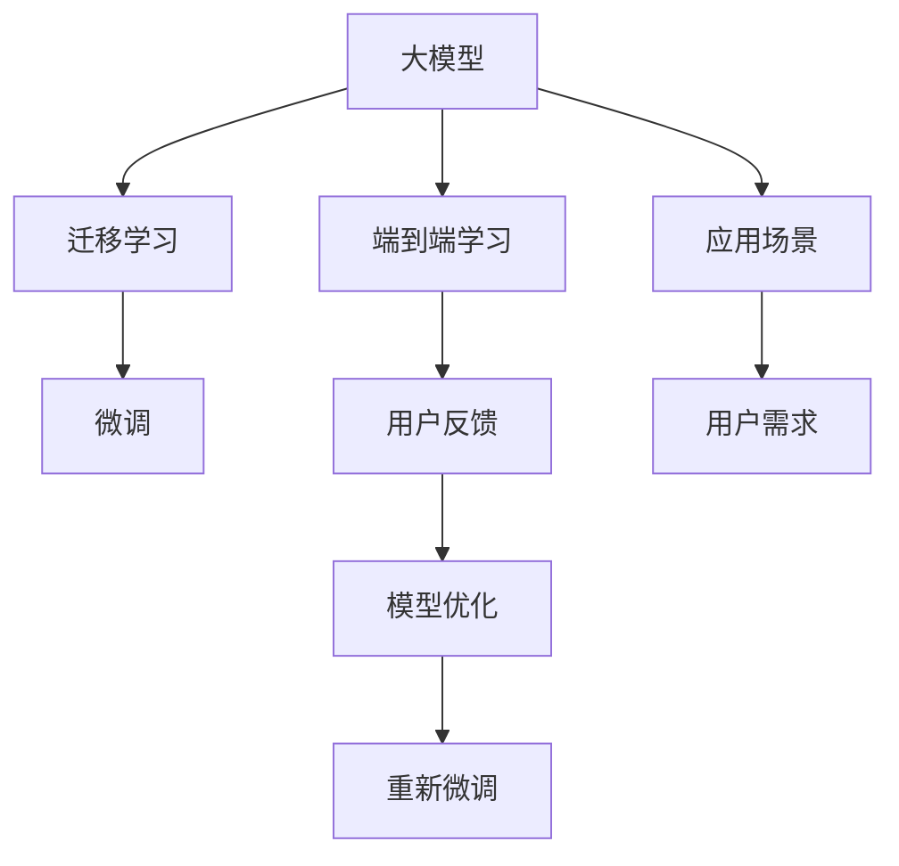

                 

# AI大模型创业：如何打造未来爆款应用？

## 1. 背景介绍

### 1.1 问题由来

随着AI技术的迅猛发展，大模型（如GPT-3、BERT等）在自然语言处理（NLP）、计算机视觉（CV）等领域的优异表现，吸引了越来越多的创业者和投资者的关注。然而，如何将这些大模型的技术优势转化为商业价值，打造出真正具备市场竞争力的AI大模型应用，成为了创业者和技术开发者面临的重要课题。

### 1.2 问题核心关键点

1. **数据获取**：高质量的训练数据是大模型性能的关键。如何高效获取和利用数据，特别是在资源有限的创业初期，是首要解决的问题。
2. **模型训练**：大模型的训练需要强大的计算资源和高度的算法优化。如何在有限的资源下进行高效的模型训练，并取得优异的性能，是技术团队需要攻克的难点。
3. **应用场景**：如何将大模型应用于具体的业务场景，实现用户价值最大化，是决定产品成败的根本。
4. **市场推广**：如何通过有效的市场策略，将产品推广到目标用户群体，获取市场份额，是实现商业成功的关键。

## 2. 核心概念与联系

### 2.1 核心概念概述

为了更好地理解如何打造未来爆款AI大模型应用，本节将介绍几个关键的概念：

- **大模型**：以深度神经网络为基础，在特定领域进行大规模无监督训练的模型，如GPT-3、BERT等。
- **迁移学习**：利用已在大规模数据上训练好的模型，在新任务上进行微调，以提高性能。
- **微调**：在特定任务上对大模型进行有监督学习优化，提升模型在该任务上的表现。
- **端到端学习**：将数据收集、模型训练、产品部署等环节整合在一起，形成一个完整的闭环，以提升效率和效果。
- **用户反馈**：通过用户的使用反馈，调整产品功能和服务，实现持续改进。

这些概念之间的关系可以用以下Mermaid流程图表示：



这个流程图展示了从大模型到最终应用的过程，包括迁移学习、微调、端到端学习和用户反馈等关键环节。

## 3. 核心算法原理 & 具体操作步骤

### 3.1 算法原理概述

打造爆款AI大模型应用的核心在于高效利用大模型的能力和数据资源，通过合理的算法和策略，将其应用到具体的业务场景中，以满足用户需求，实现商业价值。

- **数据获取与预处理**：通过爬虫、API接口等方式，获取或购买高质量的数据集，并进行清洗、标注等预处理工作，为模型训练提供基础。
- **模型训练与微调**：在特定任务上对大模型进行微调，优化其性能，以适应实际应用需求。
- **端到端学习**：将数据收集、模型训练、产品部署等环节整合在一起，形成一个完整的闭环，以提升效率和效果。
- **用户反馈与优化**：通过用户的使用反馈，调整产品功能和服务，实现持续改进。

### 3.2 算法步骤详解

1. **数据获取与预处理**：
   - 使用爬虫或API接口获取目标领域的高质量数据集，确保数据的多样性和代表性。
   - 对数据进行清洗、标注、划分训练集、验证集和测试集等预处理工作，确保数据质量和可用性。

2. **模型训练与微调**：
   - 选择合适的预训练模型，如BERT、GPT-3等，作为初始化参数。
   - 在特定任务上对模型进行微调，通过有监督学习优化模型在该任务上的性能。
   - 使用Adam、SGD等优化算法，选择合适的学习率、批大小、迭代轮数等超参数，进行模型训练。
   - 在训练过程中，定期在验证集上评估模型性能，根据性能指标决定是否触发Early Stopping。

3. **端到端学习**：
   - 将数据收集、模型训练、产品部署等环节整合在一起，形成一个完整的闭环。
   - 使用DevOps工具链（如Jenkins、GitLab CI等）进行自动化测试、构建和部署，提升开发效率。
   - 通过API接口、SDK等形式，将模型集成到实际应用系统中，实现用户价值最大化。

4. **用户反馈与优化**：
   - 收集用户的使用反馈，分析用户需求和痛点，调整产品功能和优化服务。
   - 通过A/B测试等方法，验证优化措施的有效性，持续迭代改进。

### 3.3 算法优缺点

大模型创业中的算法步骤具有以下优点：
- **高效利用资源**：通过迁移学习和微调，可以大幅提升模型性能，同时减少从头训练所需的计算资源和时间。
- **灵活适应需求**：模型可以通过微调快速适应新的业务需求，提升应用场景的覆盖面。
- **端到端优化**：通过将数据收集、模型训练、产品部署等环节整合在一起，提升整体效率和效果。
- **用户驱动优化**：通过用户反馈进行持续改进，不断提升用户体验和满意度。

同时，该算法步骤也存在一定的局限性：
- **数据依赖**：对高质量标注数据的依赖较高，数据获取和预处理成本较高。
- **过拟合风险**：微调过程中容易发生过拟合，特别是当数据量较少时。
- **模型复杂性**：大模型的训练和微调过程较为复杂，需要较高的技术积累和资源投入。
- **可解释性不足**：大模型往往是"黑盒"系统，难以解释其内部工作机制和决策逻辑。

## 4. 数学模型和公式 & 详细讲解

### 4.1 数学模型构建

在打造爆款AI大模型应用的过程中，需要构建数学模型来描述从数据收集、模型训练到产品部署的整个流程。假设大模型为$M_{\theta}$，其输入为$x$，输出为$y$。模型训练的目标是最小化损失函数$\mathcal{L}$：

$$
\mathcal{L}(\theta) = \frac{1}{N}\sum_{i=1}^N \ell(y_i, M_{\theta}(x_i))
$$

其中$\ell$为损失函数，通常为交叉熵损失、均方误差损失等。模型训练的优化目标是最小化损失函数：

$$
\theta^* = \mathop{\arg\min}_{\theta} \mathcal{L}(\theta)
$$

### 4.2 公式推导过程

以二分类任务为例，假设模型$M_{\theta}$在输入$x$上的输出为$\hat{y}=M_{\theta}(x) \in [0,1]$，表示样本属于正类的概率。真实标签$y \in \{0,1\}$。则二分类交叉熵损失函数定义为：

$$
\ell(M_{\theta}(x),y) = -[y\log \hat{y} + (1-y)\log (1-\hat{y})]
$$

将其代入经验风险公式，得：

$$
\mathcal{L}(\theta) = -\frac{1}{N}\sum_{i=1}^N [y_i\log M_{\theta}(x_i)+(1-y_i)\log(1-M_{\theta}(x_i))]
$$

根据链式法则，损失函数对参数$\theta_k$的梯度为：

$$
\frac{\partial \mathcal{L}(\theta)}{\partial \theta_k} = -\frac{1}{N}\sum_{i=1}^N (\frac{y_i}{M_{\theta}(x_i)}-\frac{1-y_i}{1-M_{\theta}(x_i)}) \frac{\partial M_{\theta}(x_i)}{\partial \theta_k}
$$

其中$\frac{\partial M_{\theta}(x_i)}{\partial \theta_k}$可进一步递归展开，利用自动微分技术完成计算。

### 4.3 案例分析与讲解

以文本分类任务为例，可以使用BERT模型进行微调。首先，对文本数据进行预处理，包括分词、去停用词、构建词汇表等。然后，将文本转换为模型所需的输入形式，如BERT的输入形式。最后，使用交叉熵损失函数进行模型训练，优化目标是最小化损失函数。

## 5. 项目实践：代码实例和详细解释说明

### 5.1 开发环境搭建

在进行AI大模型应用开发前，需要先搭建好开发环境。以下是使用Python进行PyTorch开发的简单配置流程：

1. 安装Anaconda：从官网下载并安装Anaconda，用于创建独立的Python环境。

2. 创建并激活虚拟环境：
```bash
conda create -n pytorch-env python=3.8 
conda activate pytorch-env
```

3. 安装PyTorch：根据CUDA版本，从官网获取对应的安装命令。例如：
```bash
conda install pytorch torchvision torchaudio cudatoolkit=11.1 -c pytorch -c conda-forge
```

4. 安装Transformers库：
```bash
pip install transformers
```

5. 安装各类工具包：
```bash
pip install numpy pandas scikit-learn matplotlib tqdm jupyter notebook ipython
```

完成上述步骤后，即可在`pytorch-env`环境中开始开发。

### 5.2 源代码详细实现

下面以文本分类任务为例，给出使用Transformers库对BERT模型进行微调的PyTorch代码实现。

```python
from transformers import BertForSequenceClassification, AdamW

model = BertForSequenceClassification.from_pretrained('bert-base-uncased', num_labels=2)

optimizer = AdamW(model.parameters(), lr=2e-5)

for epoch in range(3):
    for batch in train_dataloader:
        inputs = batch['input_ids']
        attention_mask = batch['attention_mask']
        labels = batch['labels']

        outputs = model(inputs, attention_mask=attention_mask, labels=labels)
        loss = outputs.loss

        optimizer.zero_grad()
        loss.backward()
        optimizer.step()
```

可以看到，使用Transformers库对BERT模型进行微调，代码实现相对简洁。通过选择预训练模型、设置优化器和超参数，即可快速进行模型训练和微调。

### 5.3 代码解读与分析

**BertForSequenceClassification类**：
- 定义了序列分类任务所需的模型结构，包括BERT编码器、线性分类器和交叉熵损失函数。

**AdamW优化器**：
- 使用AdamW优化算法，自动调整学习率，提升训练效率和效果。

**模型训练过程**：
- 对数据进行批处理，依次输入模型进行前向传播和后向传播，计算损失函数并更新模型参数。

**学习率调度**：
- 通过设置不同的学习率，动态调整模型更新步长，避免学习率过大导致的过拟合。

**模型保存和部署**：
- 训练完成后，使用`model.save_pretrained()`方法保存模型，便于后续使用和部署。

## 6. 实际应用场景

### 6.1 智能客服系统

AI大模型可以在智能客服系统中发挥重要作用。通过收集企业内部的客服对话记录，对预训练模型进行微调，使其能够理解用户意图，匹配最佳答复，提供7x24小时不间断服务，快速响应客户咨询。智能客服系统不仅能提升客户咨询体验，还能减少人力成本，提高问题解决效率。

### 6.2 金融舆情监测

金融机构需要实时监测市场舆论动向，避免负面信息传播带来的金融风险。AI大模型可以在金融舆情监测中发挥重要作用，通过收集金融领域相关的新闻、报道、评论等文本数据，对模型进行微调，使其能够自动判断文本所属主题和情感倾向。一旦发现负面信息激增，系统便能自动预警，帮助金融机构快速应对潜在风险。

### 6.3 个性化推荐系统

AI大模型可以应用于个性化推荐系统中，通过收集用户浏览、点击、评论、分享等行为数据，提取和用户交互的物品标题、描述、标签等文本内容，对模型进行微调，使其能够从文本内容中准确把握用户的兴趣点。在生成推荐列表时，模型能够根据用户的行为数据进行动态排序，提供更加个性化的推荐内容。

### 6.4 未来应用展望

未来，AI大模型将在更多领域得到应用，为传统行业带来变革性影响。智慧医疗、智能教育、智慧城市治理、企业生产、社会治理、文娱传媒等众多领域，都将迎来AI大模型的加持。随着预训练语言模型和微调方法的持续演进，基于大模型的AI应用将更加广泛，为经济社会发展注入新的动力。

## 7. 工具和资源推荐

### 7.1 学习资源推荐

为了帮助开发者系统掌握AI大模型的开发技巧，这里推荐一些优质的学习资源：

1. 《Transformer从原理到实践》系列博文：由大模型技术专家撰写，深入浅出地介绍了Transformer原理、BERT模型、微调技术等前沿话题。

2. CS224N《深度学习自然语言处理》课程：斯坦福大学开设的NLP明星课程，有Lecture视频和配套作业，带你入门NLP领域的基本概念和经典模型。

3. 《Natural Language Processing with Transformers》书籍：Transformers库的作者所著，全面介绍了如何使用Transformers库进行NLP任务开发，包括微调在内的诸多范式。

4. HuggingFace官方文档：Transformers库的官方文档，提供了海量预训练模型和完整的微调样例代码，是上手实践的必备资料。

5. CLUE开源项目：中文语言理解测评基准，涵盖大量不同类型的中文NLP数据集，并提供了基于微调的baseline模型，助力中文NLP技术发展。

通过对这些资源的学习实践，相信你一定能够快速掌握AI大模型的开发技巧，并用于解决实际的NLP问题。

### 7.2 开发工具推荐

高效的开发离不开优秀的工具支持。以下是几款用于AI大模型微调开发的常用工具：

1. PyTorch：基于Python的开源深度学习框架，灵活动态的计算图，适合快速迭代研究。大部分预训练语言模型都有PyTorch版本的实现。

2. TensorFlow：由Google主导开发的开源深度学习框架，生产部署方便，适合大规模工程应用。同样有丰富的预训练语言模型资源。

3. Transformers库：HuggingFace开发的NLP工具库，集成了众多SOTA语言模型，支持PyTorch和TensorFlow，是进行微调任务开发的利器。

4. Weights & Biases：模型训练的实验跟踪工具，可以记录和可视化模型训练过程中的各项指标，方便对比和调优。与主流深度学习框架无缝集成。

5. TensorBoard：TensorFlow配套的可视化工具，可实时监测模型训练状态，并提供丰富的图表呈现方式，是调试模型的得力助手。

6. Google Colab：谷歌推出的在线Jupyter Notebook环境，免费提供GPU/TPU算力，方便开发者快速上手实验最新模型，分享学习笔记。

合理利用这些工具，可以显著提升AI大模型微调任务的开发效率，加快创新迭代的步伐。

### 7.3 相关论文推荐

AI大模型和微调技术的发展源于学界的持续研究。以下是几篇奠基性的相关论文，推荐阅读：

1. Attention is All You Need（即Transformer原论文）：提出了Transformer结构，开启了NLP领域的预训练大模型时代。

2. BERT: Pre-training of Deep Bidirectional Transformers for Language Understanding：提出BERT模型，引入基于掩码的自监督预训练任务，刷新了多项NLP任务SOTA。

3. Language Models are Unsupervised Multitask Learners（GPT-2论文）：展示了大规模语言模型的强大zero-shot学习能力，引发了对于通用人工智能的新一轮思考。

4. Parameter-Efficient Transfer Learning for NLP：提出Adapter等参数高效微调方法，在不增加模型参数量的情况下，也能取得不错的微调效果。

5. Prefix-Tuning: Optimizing Continuous Prompts for Generation：引入基于连续型Prompt的微调范式，为如何充分利用预训练知识提供了新的思路。

6. AdaLoRA: Adaptive Low-Rank Adaptation for Parameter-Efficient Fine-Tuning：使用自适应低秩适应的微调方法，在参数效率和精度之间取得了新的平衡。

这些论文代表了大模型微调技术的发展脉络。通过学习这些前沿成果，可以帮助研究者把握学科前进方向，激发更多的创新灵感。

## 8. 总结：未来发展趋势与挑战

### 8.1 研究成果总结

本文对打造未来爆款AI大模型应用的理论基础和实践技巧进行了全面系统的介绍。首先阐述了AI大模型创业的背景和意义，明确了从大模型到应用的全流程技术路径。其次，从原理到实践，详细讲解了AI大模型的训练、微调、应用等关键环节，给出了完整的代码实例和详细解释。同时，本文还探讨了AI大模型在多个领域的应用场景和未来前景，为读者提供了全面的技术指引。

### 8.2 未来发展趋势

展望未来，AI大模型创业将呈现以下几个发展趋势：

1. **模型规模持续增大**：随着算力成本的下降和数据规模的扩张，预训练语言模型的参数量还将持续增长。超大规模语言模型蕴含的丰富语言知识，有望支撑更加复杂多变的下游任务微调。

2. **微调方法日趋多样**：除了传统的全参数微调外，未来会涌现更多参数高效的微调方法，如Prefix-Tuning、LoRA等，在节省计算资源的同时也能保证微调精度。

3. **持续学习成为常态**：随着数据分布的不断变化，微调模型也需要持续学习新知识以保持性能。如何在不遗忘原有知识的同时，高效吸收新样本信息，将成为重要的研究课题。

4. **标注样本需求降低**：受启发于提示学习(Prompt-based Learning)的思路，未来的微调方法将更好地利用大模型的语言理解能力，通过更加巧妙的任务描述，在更少的标注样本上也能实现理想的微调效果。

5. **多模态微调崛起**：当前的微调主要聚焦于纯文本数据，未来会进一步拓展到图像、视频、语音等多模态数据微调。多模态信息的融合，将显著提升语言模型对现实世界的理解和建模能力。

6. **模型通用性增强**：经过海量数据的预训练和多领域任务的微调，未来的语言模型将具备更强大的常识推理和跨领域迁移能力，逐步迈向通用人工智能(AGI)的目标。

以上趋势凸显了AI大模型微调技术的广阔前景。这些方向的探索发展，必将进一步提升NLP系统的性能和应用范围，为人类认知智能的进化带来深远影响。

### 8.3 面临的挑战

尽管AI大模型微调技术已经取得了瞩目成就，但在迈向更加智能化、普适化应用的过程中，它仍面临着诸多挑战：

1. **数据依赖**：对高质量标注数据的依赖较高，数据获取和预处理成本较高。如何进一步降低微调对标注样本的依赖，将是一大难题。

2. **模型鲁棒性不足**：当前微调模型面对域外数据时，泛化性能往往大打折扣。对于测试样本的微小扰动，微调模型的预测也容易发生波动。如何提高微调模型的鲁棒性，避免灾难性遗忘，还需要更多理论和实践的积累。

3. **推理效率有待提高**：大规模语言模型虽然精度高，但在实际部署时往往面临推理速度慢、内存占用大等效率问题。如何在保证性能的同时，简化模型结构，提升推理速度，优化资源占用，将是重要的优化方向。

4. **可解释性亟需加强**：当前微调模型更像是"黑盒"系统，难以解释其内部工作机制和决策逻辑。对于医疗、金融等高风险应用，算法的可解释性和可审计性尤为重要。如何赋予微调模型更强的可解释性，将是亟待攻克的难题。

5. **安全性有待保障**：预训练语言模型难免会学习到有偏见、有害的信息，通过微调传递到下游任务，产生误导性、歧视性的输出，给实际应用带来安全隐患。如何从数据和算法层面消除模型偏见，避免恶意用途，确保输出的安全性，也将是重要的研究课题。

6. **知识整合能力不足**：现有的微调模型往往局限于任务内数据，难以灵活吸收和运用更广泛的先验知识。如何让微调过程更好地与外部知识库、规则库等专家知识结合，形成更加全面、准确的信息整合能力，还有很大的想象空间。

正视AI大模型微调面临的这些挑战，积极应对并寻求突破，将是大模型微调走向成熟的必由之路。相信随着学界和产业界的共同努力，这些挑战终将一一被克服，AI大模型微调必将在构建人机协同的智能时代中扮演越来越重要的角色。

### 8.4 研究展望

面对AI大模型微调所面临的种种挑战，未来的研究需要在以下几个方面寻求新的突破：

1. **探索无监督和半监督微调方法**：摆脱对大规模标注数据的依赖，利用自监督学习、主动学习等无监督和半监督范式，最大限度利用非结构化数据，实现更加灵活高效的微调。

2. **研究参数高效和计算高效的微调范式**：开发更加参数高效的微调方法，在固定大部分预训练参数的同时，只更新极少量的任务相关参数。同时优化微调模型的计算图，减少前向传播和反向传播的资源消耗，实现更加轻量级、实时性的部署。

3. **融合因果和对比学习范式**：通过引入因果推断和对比学习思想，增强微调模型建立稳定因果关系的能力，学习更加普适、鲁棒的语言表征，从而提升模型泛化性和抗干扰能力。

4. **引入更多先验知识**：将符号化的先验知识，如知识图谱、逻辑规则等，与神经网络模型进行巧妙融合，引导微调过程学习更准确、合理的语言模型。同时加强不同模态数据的整合，实现视觉、语音等多模态信息与文本信息的协同建模。

5. **结合因果分析和博弈论工具**：将因果分析方法引入微调模型，识别出模型决策的关键特征，增强输出解释的因果性和逻辑性。借助博弈论工具刻画人机交互过程，主动探索并规避模型的脆弱点，提高系统稳定性。

6. **纳入伦理道德约束**：在模型训练目标中引入伦理导向的评估指标，过滤和惩罚有偏见、有害的输出倾向。同时加强人工干预和审核，建立模型行为的监管机制，确保输出符合人类价值观和伦理道德。

这些研究方向的探索，必将引领AI大模型微调技术迈向更高的台阶，为构建安全、可靠、可解释、可控的智能系统铺平道路。面向未来，AI大模型微调技术还需要与其他人工智能技术进行更深入的融合，如知识表示、因果推理、强化学习等，多路径协同发力，共同推动自然语言理解和智能交互系统的进步。只有勇于创新、敢于突破，才能不断拓展语言模型的边界，让智能技术更好地造福人类社会。

## 9. 附录：常见问题与解答

**Q1：AI大模型创业是否适用于所有领域？**

A: AI大模型创业并不适用于所有领域。其效果和适用性取决于目标领域的数据量和质量，以及模型与业务场景的匹配度。在某些领域，如金融、医疗等，数据获取和预处理成本较高，模型效果可能不如预期。因此，需要根据具体情况进行选择。

**Q2：如何选择合适的预训练模型？**

A: 选择合适的预训练模型需要考虑多个因素，如任务类型、数据规模、计算资源等。一般而言，可以选择通用型预训练模型（如BERT、GPT-3等）进行微调，以适应不同领域的任务需求。如果需要针对特定领域的微调效果，可以自行构建或选择定制化的预训练模型。

**Q3：微调过程中如何避免过拟合？**

A: 避免过拟合的方法包括数据增强、正则化、早停等。数据增强可以通过回译、近义词替换等方式扩充训练集；正则化可以使用L2正则、Dropout等；早停可以在验证集上评估模型性能，根据性能指标决定是否停止训练。

**Q4：如何在有限的资源下进行高效的模型训练？**

A: 在有限的资源下进行高效的模型训练，可以采用以下几个方法：使用梯度累积、混合精度训练、模型并行等技术，减少内存消耗和计算时间；选择合适的优化算法和超参数，提高训练效率；合理划分数据集，进行分布式训练，充分利用计算资源。

**Q5：如何评估微调后的模型性能？**

A: 评估微调后的模型性能可以通过多种指标进行，如准确率、召回率、F1分数、AUC等。常用的评估方法包括交叉验证、混淆矩阵、ROC曲线等。可以通过在不同数据集上进行评估，综合比较模型的效果。

**Q6：如何部署微调后的模型？**

A: 部署微调后的模型可以通过API接口、SDK等形式，集成到实际应用系统中。常用的部署平台包括AWS、Azure、Google Cloud等，可以提供GPU/TPU等高性能计算资源，支持模型的高效部署和调用。

通过本文的系统梳理，可以看到，打造爆款AI大模型应用需要从数据获取、模型训练、应用部署等多个环节进行综合优化。只有不断迭代和优化模型、数据和算法，才能真正实现商业成功。未来，随着预训练语言模型和微调方法的不断进步，AI大模型创业将迎来更多的创新机遇和发展空间。

