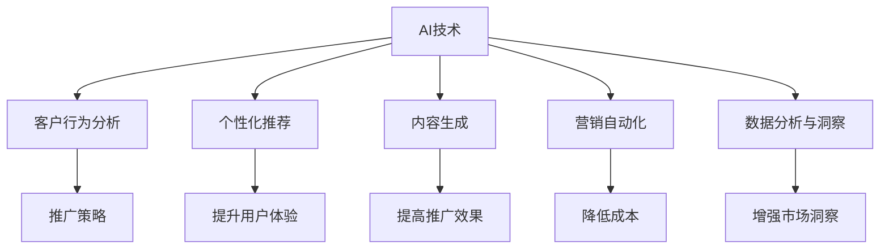

                 

# AI如何帮助电商企业进行品牌推广

> 关键词：AI, 品牌推广, 电商, 客户行为分析, 个性化推荐, 内容生成, 营销自动化

## 1. 背景介绍

### 1.1 问题由来

在当今数字化时代，电商企业面临着激烈的市场竞争和不断变化的市场需求。如何吸引并留住客户，提升品牌知名度和市场份额，是每个电商企业面临的重大挑战。AI技术，特别是机器学习和自然语言处理（NLP）技术的快速发展，为电商企业提供了全新的品牌推广手段。

### 1.2 问题核心关键点

- **客户行为分析**：通过AI技术分析客户购买历史、浏览行为、搜索记录等数据，理解客户需求和偏好，精准制定推广策略。
- **个性化推荐**：利用机器学习模型，根据客户历史行为和偏好，个性化推荐商品，提升用户体验和转化率。
- **内容生成**：使用AI技术自动生成吸引人的广告文案和营销内容，提高推广效果和品牌曝光度。
- **营销自动化**：通过AI驱动的自动化营销工具，实现精准营销，降低人工成本，提升营销效率。
- **数据分析与洞察**：利用大数据分析和机器学习，深入挖掘市场趋势和客户行为，为决策提供科学依据。

这些关键点共同构成了AI在电商品牌推广中的核心应用，使得电商企业能够更加精准、高效地进行市场推广和品牌建设。

### 1.3 问题研究意义

利用AI技术进行品牌推广，能够显著提升电商企业的市场竞争力，具体体现在：

- **提升用户体验**：通过个性化推荐和精准营销，提升客户满意度和忠诚度，从而提升品牌形象。
- **优化营销效果**：利用数据分析和内容生成技术，提高营销内容的吸引力和转化率，提升广告投入产出比。
- **降低成本**：通过自动化工具和智能决策，降低人力成本和运营成本，提高运营效率。
- **增强市场洞察**：利用AI技术深度分析市场数据，发现潜在机会和风险，帮助企业制定更加科学的市场策略。

## 2. 核心概念与联系

### 2.1 核心概念概述

为更好地理解AI在电商品牌推广中的应用，本节将介绍几个密切相关的核心概念：

- **AI技术**：指使用计算机算法和模型处理数据的智能技术，涵盖机器学习、深度学习、自然语言处理等。
- **客户行为分析**：通过数据分析和建模技术，理解客户行为和需求，为品牌推广提供依据。
- **个性化推荐**：利用推荐算法，根据用户历史行为和偏好，推荐相关商品或内容，提升用户体验。
- **内容生成**：使用自然语言处理技术，自动生成广告文案、文章、视频等营销内容。
- **营销自动化**：通过AI技术实现自动化营销，如广告投放、邮件营销、社交媒体管理等，提高效率和效果。
- **数据分析与洞察**：利用数据挖掘和机器学习技术，分析市场趋势和客户行为，提供决策支持。

这些核心概念之间的逻辑关系可以通过以下Mermaid流程图来展示：



这个流程图展示了大语言模型的核心概念及其之间的关系：

1. AI技术是大语言模型的基础，提供数据处理和模型训练的能力。
2. 客户行为分析、个性化推荐、内容生成和营销自动化是AI技术在电商品牌推广中的主要应用场景。
3. 数据分析与洞察为这些应用提供数据支持和市场洞察。
4. 通过AI技术的集成应用，电商企业能够实现高效、精准、智能的品牌推广。

## 3. 核心算法原理 & 具体操作步骤

### 3.1 算法原理概述

AI在电商品牌推广中的应用，主要基于以下核心算法原理：

1. **客户行为分析**：使用统计分析和机器学习算法，分析客户的购买历史、浏览行为、搜索记录等，识别出客户偏好和行为模式，从而制定精准的推广策略。
2. **个性化推荐**：利用协同过滤、矩阵分解、深度学习等算法，根据用户历史行为和偏好，推荐相关商品，提升用户体验和转化率。
3. **内容生成**：使用自然语言处理技术，自动生成吸引人的广告文案、产品描述、营销邮件等，提高推广效果。
4. **营销自动化**：通过机器学习和自然语言处理技术，实现广告投放、邮件营销、社交媒体管理的自动化，提高营销效率和效果。
5. **数据分析与洞察**：利用数据挖掘和机器学习技术，分析市场数据和客户行为，提供科学的市场洞察，为决策提供依据。

### 3.2 算法步骤详解

基于上述算法原理，AI在电商品牌推广中的操作步骤大致如下：

1. **数据收集**：收集客户的购买历史、浏览行为、搜索记录、社交媒体互动等数据，构建数据仓库。
2. **数据预处理**：对收集到的数据进行清洗、归一化、特征提取等预处理操作，准备用于机器学习模型的输入。
3. **模型训练**：使用机器学习算法训练客户行为分析模型、个性化推荐模型、内容生成模型和营销自动化模型，优化模型参数。
4. **模型评估**：在测试集上评估模型的性能，如准确率、召回率、转化率等指标，确保模型效果。
5. **推广应用**：将训练好的模型应用于客户行为分析、个性化推荐、内容生成和营销自动化，提升电商品牌推广效果。

### 3.3 算法优缺点

AI在电商品牌推广中的算法具有以下优点：

1. **精准度**：通过数据分析和机器学习，能够精准理解客户需求和行为，制定个性化推荐策略，提升用户体验和转化率。
2. **效率高**：利用自动化工具和算法，实现快速、高效的营销推广，降低人工成本和运营成本。
3. **覆盖面广**：通过数据挖掘和模型训练，能够覆盖广泛的客户和市场，提供全方位的品牌推广。
4. **灵活性强**：根据市场变化和客户反馈，快速调整算法和策略，适应市场变化。

同时，AI在电商品牌推广中也有一些局限性：

1. **数据依赖**：模型的效果依赖于高质量、充分的数据，数据收集和处理成本较高。
2. **模型复杂**：复杂的机器学习模型需要大量的计算资源，对硬件要求较高。
3. **隐私风险**：在收集和分析客户数据时，需要注意数据隐私和安全问题，避免侵犯客户隐私。
4. **解释性不足**：复杂的模型往往是"黑盒"系统，难以解释其内部决策逻辑，可能影响客户信任。

### 3.4 算法应用领域

AI在电商品牌推广中的应用领域非常广泛，涵盖以下几个方面：

1. **客户行为分析**：用于理解客户需求和行为，为品牌推广提供依据。
2. **个性化推荐**：提高用户体验和转化率，提升销售业绩。
3. **内容生成**：生成吸引人的广告文案、产品描述、营销邮件等，提高推广效果。
4. **营销自动化**：实现广告投放、邮件营销、社交媒体管理等自动化操作，提高营销效率。
5. **数据分析与洞察**：深入挖掘市场趋势和客户行为，提供科学的市场策略和决策依据。

这些应用领域共同构成了AI在电商品牌推广中的全流程解决方案，使得电商企业能够高效、精准地进行品牌推广。

## 4. 数学模型和公式 & 详细讲解 & 举例说明

### 4.1 数学模型构建

本节将使用数学语言对AI在电商品牌推广中的应用进行更加严格的刻画。

假设有一个电商平台，客户数据包含历史购买记录、浏览行为、搜索关键词等，我们希望通过AI技术分析这些数据，制定精准的推广策略。模型输入为 $X=(\vec{x_1}, \vec{x_2}, ..., \vec{x_n})$，其中 $\vec{x_i}$ 为第 $i$ 个客户的特征向量。模型输出为 $Y=(y_1, y_2, ..., y_m)$，其中 $y_j$ 为第 $j$ 个推广策略的效果评价指标。

定义损失函数 $L$ 为模型预测值与真实值之间的差异，常见的损失函数包括均方误差（MSE）和交叉熵损失（CE）等。模型的目标是最小化损失函数，即：

$$
\min_{\theta} L(Y, \hat{Y}) = \min_{\theta} \sum_{j=1}^m (y_j - \hat{y_j})^2 \quad \text{(均方误差)}
$$

或

$$
\min_{\theta} L(Y, \hat{Y}) = \min_{\theta} -\frac{1}{m} \sum_{j=1}^m y_j \log \hat{y_j} \quad \text{(交叉熵损失)}
$$

其中 $\hat{Y}=f(X, \theta)$ 为模型输出，$f$ 为模型函数。

### 4.2 公式推导过程

以交叉熵损失为例，下面给出详细推导过程。

假设我们有一个客户行为分析模型，用于预测客户对某个商品的兴趣。模型的输入为 $X=(\vec{x_1}, \vec{x_2}, ..., \vec{x_n})$，输出为 $\hat{Y}=(\hat{y_1}, \hat{y_2}, ..., \hat{y_m})$。设实际标签为 $Y=(y_1, y_2, ..., y_m)$，其中 $y_j \in \{0, 1\}$，表示客户是否对商品感兴趣。

交叉熵损失函数的定义为：

$$
L(Y, \hat{Y}) = -\frac{1}{m} \sum_{j=1}^m y_j \log \hat{y_j} + (1-y_j) \log (1-\hat{y_j})
$$

其含义为：若实际标签 $y_j$ 为 1，则模型输出的 $\hat{y_j}$ 应尽可能接近 1；若实际标签 $y_j$ 为 0，则模型输出的 $\hat{y_j}$ 应尽可能接近 0。这样可以最大化模型预测的准确性。

### 4.3 案例分析与讲解

以电商平台的用户个性化推荐为例，我们通过用户历史行为数据，预测用户对不同商品的兴趣，然后向用户推荐感兴趣的商品。假设用户的浏览历史为 $X=(\vec{x_1}, \vec{x_2}, ..., \vec{x_n})$，每条记录包含商品类别、浏览时间等特征。模型预测用户对每类商品 $y_j$ 的兴趣程度，可以使用协同过滤、深度学习等算法进行训练。训练好的模型 $f(X, \theta)$ 能够输出 $Y=(y_1, y_2, ..., y_m)$，其中 $y_j$ 表示用户对第 $j$ 类商品的兴趣程度。模型的损失函数为交叉熵损失，用于最小化预测值与实际值之间的差异。

## 5. 项目实践：代码实例和详细解释说明

### 5.1 开发环境搭建

在进行AI品牌推广项目开发前，需要准备好开发环境。以下是使用Python进行机器学习和深度学习开发的常见环境配置流程：

1. 安装Anaconda：从官网下载并安装Anaconda，用于创建独立的Python环境。
2. 创建并激活虚拟环境：
```bash
conda create -n pytorch-env python=3.8 
conda activate pytorch-env
```

3. 安装PyTorch：根据CUDA版本，从官网获取对应的安装命令。例如：
```bash
conda install pytorch torchvision torchaudio cudatoolkit=11.1 -c pytorch -c conda-forge
```

4. 安装TensorFlow：
```bash
pip install tensorflow
```

5. 安装Pandas、NumPy、Scikit-Learn等数据处理库：
```bash
pip install pandas numpy scikit-learn matplotlib tqdm jupyter notebook ipython
```

完成上述步骤后，即可在`pytorch-env`环境中开始AI品牌推广项目开发。

### 5.2 源代码详细实现

下面我们以电商平台的个性化推荐系统为例，给出使用PyTorch进行客户行为分析的Python代码实现。

首先，定义数据处理函数：

```python
import pandas as pd
from sklearn.model_selection import train_test_split

# 加载数据
data = pd.read_csv('customer_data.csv')

# 数据预处理
features = ['buy_time', 'view_time', 'search_time', 'click_time']
labels = ['interest_in_product_a', 'interest_in_product_b', 'interest_in_product_c']
X = data[features]
y = data[labels]

# 数据标准化
from sklearn.preprocessing import StandardScaler
scaler = StandardScaler()
X = scaler.fit_transform(X)

# 数据分割
X_train, X_test, y_train, y_test = train_test_split(X, y, test_size=0.2, random_state=42)
```

然后，定义模型和优化器：

```python
import torch
from torch import nn, optim

# 定义模型
class CustomerBehaviorModel(nn.Module):
    def __init__(self, input_dim, hidden_dim=32, output_dim=3):
        super(CustomerBehaviorModel, self).__init__()
        self.hidden_layer = nn.Linear(input_dim, hidden_dim)
        self.output_layer = nn.Linear(hidden_dim, output_dim)
    
    def forward(self, x):
        x = torch.relu(self.hidden_layer(x))
        x = torch.sigmoid(self.output_layer(x))
        return x

# 定义优化器
model = CustomerBehaviorModel(input_dim=X_train.shape[1], output_dim=3)
optimizer = optim.Adam(model.parameters(), lr=0.001)
```

接着，定义训练和评估函数：

```python
from sklearn.metrics import mean_squared_error

def train_epoch(model, data, batch_size, optimizer):
    model.train()
    for batch in tqdm(data, desc='Training'):
        inputs, targets = batch
        optimizer.zero_grad()
        outputs = model(inputs)
        loss = nn.BCELoss()(outputs, targets)
        loss.backward()
        optimizer.step()
    return loss.item()

def evaluate(model, data, batch_size):
    model.eval()
    total_loss = 0
    with torch.no_grad():
        for batch in tqdm(data, desc='Evaluating'):
            inputs, targets = batch
            outputs = model(inputs)
            loss = nn.BCELoss()(outputs, targets)
            total_loss += loss.item()
    return total_loss / len(data)

# 训练模型
epochs = 100
batch_size = 64
for epoch in range(epochs):
    loss = train_epoch(model, (X_train, y_train), batch_size, optimizer)
    print(f'Epoch {epoch+1}, loss: {loss:.4f}')
    test_loss = evaluate(model, (X_test, y_test), batch_size)
    print(f'Test loss: {test_loss:.4f}')
```

以上代码展示了使用PyTorch进行客户行为分析的完整过程。通过简单的数据处理和模型训练，即可得到客户行为分析模型，用于后续的个性化推荐系统。

### 5.3 代码解读与分析

让我们再详细解读一下关键代码的实现细节：

**数据预处理函数**：
- 加载客户数据，并进行标准化处理。
- 选择历史行为特征和兴趣标签，作为模型输入和输出。
- 对数据进行分割，用于模型训练和测试。

**模型定义函数**：
- 使用PyTorch定义多层感知机（MLP）模型，包括输入层、隐藏层和输出层。
- 定义激活函数和损失函数，用于计算模型预测与真实标签之间的差异。

**训练函数**：
- 在训练集上使用Adam优化器进行模型训练，最小化损失函数。
- 每个epoch后，在测试集上评估模型性能，输出测试损失。

**评估函数**：
- 在测试集上计算模型预测与真实标签之间的损失。

**训练流程**：
- 循环迭代epochs次，每次epoch后输出训练损失和测试损失。

## 6. 实际应用场景

### 6.1 智能客服系统

智能客服系统通过AI技术，能够24小时不间断服务，快速响应客户咨询，用自然流畅的语言解答各类常见问题。在智能客服系统中，AI技术可以用于以下方面：

- **客户行为分析**：分析客户咨询历史，识别常见问题和客户需求，优化客服策略。
- **个性化推荐**：根据客户咨询记录，推荐相关解决方案和产品，提升客户满意度。
- **内容生成**：生成自动回复和常见问题解答，提高客服效率。
- **数据分析与洞察**：深入分析客户咨询数据，发现客户常见问题，优化客服流程。

### 6.2 智能推荐系统

智能推荐系统通过AI技术，能够根据客户历史行为和偏好，推荐相关商品或内容，提升用户体验和转化率。在智能推荐系统中，AI技术可以用于以下方面：

- **客户行为分析**：分析客户历史行为和偏好，构建用户画像。
- **个性化推荐**：使用协同过滤、矩阵分解、深度学习等算法，推荐相关商品或内容。
- **内容生成**：自动生成商品描述和广告文案，提高推荐效果。
- **数据分析与洞察**：分析推荐效果，优化推荐策略。

### 6.3 营销自动化系统

营销自动化系统通过AI技术，能够自动化处理邮件营销、社交媒体管理等营销任务，提高营销效率和效果。在营销自动化系统中，AI技术可以用于以下方面：

- **客户行为分析**：分析客户互动数据，构建客户画像。
- **个性化推荐**：根据客户互动数据，推荐相关产品或内容。
- **内容生成**：自动生成营销邮件和广告文案。
- **数据分析与洞察**：分析营销效果，优化营销策略。

### 6.4 未来应用展望

随着AI技术的发展，未来AI在电商品牌推广中的应用将更加广泛和深入。具体而言，未来的AI技术将呈现以下几个发展趋势：

1. **深度学习模型的应用**：深度学习模型将进一步普及，提升模型准确性和泛化能力。
2. **联邦学习的应用**：通过联邦学习技术，保护客户隐私，同时实现跨平台数据共享和模型训练。
3. **多模态数据融合**：将文本、图像、语音等多模态数据结合，提升营销效果。
4. **AI伦理和公平性**：重视AI伦理和公平性问题，确保AI模型不歧视、不偏见。
5. **智能客服的普及**：智能客服将更加普及，提升客户服务质量。
6. **实时推荐系统**：实时推荐系统将进一步优化，提高推荐效率和准确性。

## 7. 工具和资源推荐

### 7.1 学习资源推荐

为了帮助开发者系统掌握AI在电商品牌推广中的应用，这里推荐一些优质的学习资源：

1. **《深度学习》（Ian Goodfellow, Yoshua Bengio, Aaron Courville）**：深度学习领域的经典教材，全面介绍了深度学习的基本原理和应用。
2. **CS231n: Convolutional Neural Networks for Visual Recognition**：斯坦福大学开设的计算机视觉课程，涵盖深度学习在计算机视觉中的应用。
3. **自然语言处理（NLP）在线课程**：包括Coursera、edX等平台的NLP课程，涵盖自然语言处理的基本理论和算法。
4. **TensorFlow官方文档**：TensorFlow的官方文档，提供了丰富的学习资源和样例代码。
5. **PyTorch官方文档**：PyTorch的官方文档，提供了详细的API参考和教程。

通过对这些资源的学习实践，相信你一定能够快速掌握AI在电商品牌推广中的应用，并用于解决实际的电商问题。

### 7.2 开发工具推荐

高效的开发离不开优秀的工具支持。以下是几款用于AI品牌推广开发的常用工具：

1. **PyTorch**：基于Python的开源深度学习框架，灵活动态的计算图，适合快速迭代研究。
2. **TensorFlow**：由Google主导开发的开源深度学习框架，生产部署方便，适合大规模工程应用。
3. **Keras**：高级神经网络API，基于TensorFlow或Theano，易于使用，适合初学者和研究人员。
4. **Pandas**：数据处理和分析库，支持数据清洗、转换、聚合等操作。
5. **NumPy**：科学计算库，支持高效数组运算和数学函数。
6. **Scikit-Learn**：机器学习库，支持多种机器学习算法和数据预处理工具。

合理利用这些工具，可以显著提升AI品牌推广任务的开发效率，加快创新迭代的步伐。

### 7.3 相关论文推荐

AI在电商品牌推广中的应用源于学界的持续研究。以下是几篇奠基性的相关论文，推荐阅读：

1. **《深度学习中的客户行为分析》（Customer Behavior Analysis via Deep Learning）**：介绍了深度学习在客户行为分析中的应用，并提出了一些经典模型。
2. **《基于协同过滤的个性化推荐系统》（Collaborative Filtering for Personalized Recommendation）**：介绍了协同过滤算法在个性化推荐系统中的应用，并提出了一些改进方法。
3. **《基于深度学习的营销自动化》（Marketing Automation via Deep Learning）**：介绍了深度学习在营销自动化中的应用，并提出了一些最新技术。
4. **《联邦学习在电商数据中的应用》（Federated Learning in E-commerce Data）**：介绍了联邦学习技术在电商数据中的应用，并提出了一些优化策略。
5. **《多模态数据融合在电商推荐中的应用》（Multimodal Data Fusion in E-commerce Recommendation）**：介绍了多模态数据融合技术在电商推荐中的应用，并提出了一些创新方法。

这些论文代表了大语言模型微调技术的发展脉络。通过学习这些前沿成果，可以帮助研究者把握学科前进方向，激发更多的创新灵感。

## 8. 总结：未来发展趋势与挑战

### 8.1 研究成果总结

本文对AI在电商品牌推广中的应用进行了全面系统的介绍。首先阐述了AI技术在电商品牌推广中的背景和意义，明确了AI推广的优势和挑战。其次，从原理到实践，详细讲解了AI推广的数学模型和关键算法，给出了AI推广任务的代码实现。同时，本文还广泛探讨了AI推广在智能客服、智能推荐、营销自动化等多个领域的应用前景，展示了AI推广的广阔应用场景。此外，本文精选了AI推广的相关学习资源、开发工具和前沿论文，力求为读者提供全方位的技术指引。

通过本文的系统梳理，可以看到，AI技术在电商品牌推广中的应用前景广阔，能够显著提升客户体验和营销效率，降低成本，优化运营。未来，伴随AI技术的不断进步和应用场景的不断拓展，AI推广必将在电商领域发挥更加重要的作用，推动电商行业的数字化转型。

### 8.2 未来发展趋势

展望未来，AI在电商品牌推广中的技术发展将呈现以下几个趋势：

1. **深度学习模型的普及**：深度学习模型将进一步普及，提升模型准确性和泛化能力，提供更加精准的推广策略。
2. **联邦学习的应用**：联邦学习技术将保护客户隐私，同时实现跨平台数据共享和模型训练，提高数据利用率。
3. **多模态数据融合**：多模态数据融合技术将提升营销效果，提供更加全面的客户画像。
4. **智能客服的普及**：智能客服将更加普及，提升客户服务质量和满意度。
5. **实时推荐系统**：实时推荐系统将进一步优化，提高推荐效率和准确性，提升用户体验。
6. **AI伦理和公平性**：重视AI伦理和公平性问题，确保AI模型不歧视、不偏见，提升用户信任。

以上趋势凸显了AI在电商品牌推广中的广阔前景，这些方向的探索发展，必将进一步提升电商推广的效果和效率，为电商企业带来更大的商业价值。

### 8.3 面临的挑战

尽管AI在电商品牌推广中已经取得了显著成效，但在迈向更加智能化、普适化应用的过程中，它仍面临着诸多挑战：

1. **数据质量**：模型的效果依赖于高质量、充分的数据，数据收集和处理成本较高，且数据质量问题可能会影响模型性能。
2. **模型复杂度**：复杂的深度学习模型需要大量的计算资源，对硬件要求较高，可能会带来高昂的计算成本。
3. **隐私保护**：在收集和分析客户数据时，需要注意数据隐私和安全问题，避免侵犯客户隐私。
4. **模型解释性**：复杂的深度学习模型往往是"黑盒"系统，难以解释其内部决策逻辑，可能影响客户信任。
5. **偏见和公平性**：AI模型可能会学习到数据中的偏见，导致不公平的推荐或决策，需要重视AI伦理和公平性问题。

正视这些挑战，积极应对并寻求突破，将是大语言模型微调走向成熟的必由之路。相信随着学界和产业界的共同努力，这些挑战终将一一被克服，AI推广必将在电商领域发挥更加重要的作用。

### 8.4 研究展望

未来，AI在电商品牌推广中的应用还需要在以下几个方面进行进一步研究和探索：

1. **数据增强**：通过数据增强技术，扩大训练数据集，提高模型的泛化能力。
2. **模型压缩和优化**：研究模型压缩和优化技术，降低模型计算资源消耗，提升计算效率。
3. **跨领域迁移学习**：探索跨领域迁移学习技术，提升模型的泛化能力和应用范围。
4. **多模态数据融合**：研究多模态数据融合技术，提升营销效果和用户体验。
5. **AI伦理和公平性**：重视AI伦理和公平性问题，确保AI模型不歧视、不偏见，提升用户信任。

这些研究方向将推动AI在电商品牌推广中的应用向更深层次发展，为电商企业带来更大的商业价值。相信随着技术的不断进步和应用场景的不断拓展，AI推广必将在电商领域发挥更加重要的作用，推动电商行业的数字化转型。

## 9. 附录：常见问题与解答

**Q1：AI在电商品牌推广中的应用效果如何？**

A: AI在电商品牌推广中的应用效果显著。通过客户行为分析、个性化推荐、内容生成和营销自动化等技术，能够显著提升客户体验和营销效率，降低成本，优化运营。例如，智能推荐系统通过深度学习算法，能够根据客户历史行为和偏好，推荐相关商品，提升转化率。智能客服系统通过自然语言处理技术，能够24小时不间断服务，快速响应客户咨询，提升客户满意度。

**Q2：AI在电商品牌推广中面临的主要挑战是什么？**

A: AI在电商品牌推广中面临的主要挑战包括数据质量、模型复杂度、隐私保护、模型解释性和偏见和公平性等。数据质量问题可能会影响模型性能，模型复杂度需要大量的计算资源，隐私保护问题可能会侵犯客户隐私，模型解释性问题可能会影响客户信任，偏见和公平性问题可能会带来不公平的推荐或决策。这些问题需要重视并积极应对，才能保证AI推广的效果和可信度。

**Q3：AI在电商品牌推广中如何保护客户隐私？**

A: 在收集和分析客户数据时，需要重视数据隐私和安全问题，确保数据合法合规。可以通过数据匿名化、加密存储、访问控制等技术手段，保护客户隐私。同时，可以采用联邦学习技术，保护客户数据隐私的同时，实现跨平台数据共享和模型训练。

**Q4：AI在电商品牌推广中如何提高模型解释性？**

A: 提高模型解释性是AI推广的重要研究方向。可以通过引入可解释性算法（如LIME、SHAP等），对模型进行解释和可视化。同时，可以引入自然语言处理技术，自动生成模型决策依据，提升用户信任和理解度。

**Q5：AI在电商品牌推广中如何处理偏见和公平性问题？**

A: 处理偏见和公平性问题是AI推广中的重要研究方向。可以通过数据预处理、模型优化和公平性评估等技术手段，减少模型的偏见。例如，可以使用公平性算法（如Adversarial Debiasing），减少模型中的歧视性偏见。同时，可以引入AI伦理和公平性评估标准，确保AI推广的公平性和透明性。

总之，AI在电商品牌推广中的应用前景广阔，能够显著提升客户体验和营销效率，降低成本，优化运营。但同时，也需要重视数据质量、模型复杂度、隐私保护、模型解释性和偏见和公平性等问题，积极应对并寻求突破，才能确保AI推广的效果和可信度。未来，随着技术的不断进步和应用场景的不断拓展，AI推广必将在电商领域发挥更加重要的作用，推动电商行业的数字化转型。

