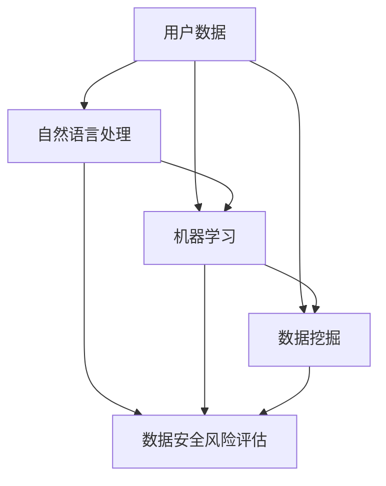

                 

# AI如何帮助电商企业进行用户数据安全风险评估

## 1. 背景介绍

在数字化转型的大背景下，电商平台已经成为企业与消费者之间的重要桥梁。用户数据的收集与分析，不仅有助于电商平台提升用户画像的精准度，还为个性化推荐、精准营销等提供了重要依据。然而，数据的安全性同样不可忽视。如何在保护用户隐私的前提下，进行有效、精准的数据安全风险评估，是电商平台面临的重大挑战。

近年来，人工智能技术，尤其是自然语言处理、机器学习和数据挖掘等领域的快速发展，为数据安全风险评估带来了新的解决方案。通过智能化的AI手段，电商平台可以更高效、全面地识别和评估数据风险，从而降低潜在威胁，保障用户信息安全。

## 2. 核心概念与联系

### 2.1 核心概念概述

为更好地理解AI在电商平台数据安全风险评估中的应用，我们先对几个关键概念进行阐述：

- **数据安全风险评估（Data Security Risk Assessment）**：通过对用户数据进行收集、分析，识别出可能存在的安全风险，并评估其潜在影响和发生概率。风险评估的结果通常以安全得分（Security Score）的形式呈现，帮助企业进行风险管理决策。
- **自然语言处理（Natural Language Processing, NLP）**：使计算机能够理解和处理人类语言的技术。NLP技术在用户评论、聊天记录等文本数据的分析中应用广泛，有助于发现异常行为和潜在威胁。
- **机器学习（Machine Learning, ML）**：通过算法构建模型，自动从数据中学习和改进。在风险评估中，机器学习可以识别数据中的模式和规律，进行精准的风险预测。
- **数据挖掘（Data Mining）**：从大量数据中发现有趣、有用、未知的潜在信息和知识。数据挖掘在用户行为模式分析中，可以帮助企业发现异常活动，防范数据泄露。

这些核心概念共同构成了电商平台数据安全风险评估的AI技术基础。通过了解这些概念及其关联，我们能够更好地把握AI在风险评估中的应用方向。

### 2.2 核心概念原理和架构的 Mermaid 流程图



该图展示了数据安全风险评估的流程架构，从用户数据到最终的风险评估，涉及了自然语言处理、机器学习和数据挖掘等多个环节。自然语言处理技术主要处理文本数据，机器学习技术用于模型构建和预测，数据挖掘技术用于数据模式发现。各环节通过数据流汇聚到最终的风险评估结果中，帮助企业进行决策。

## 3. 核心算法原理 & 具体操作步骤

### 3.1 算法原理概述

数据安全风险评估的核心目标是识别和量化数据中的潜在风险，从而制定相应的防范策略。在AI的辅助下，风险评估过程可以分为以下几步：

1. **数据收集与预处理**：从平台收集用户数据，并进行清洗和归一化，为后续分析提供干净的数据集。
2. **异常检测**：利用NLP技术对文本数据进行分析，识别出异常行为和潜在威胁。
3. **风险预测**：通过机器学习模型，根据异常行为进行风险评分，量化潜在威胁。
4. **风险评估**：结合数据挖掘技术，综合用户行为模式，进行全面的风险评估。
5. **报告生成**：将评估结果以直观的形式呈现，帮助企业决策。

### 3.2 算法步骤详解

#### 3.2.1 数据收集与预处理

在数据收集阶段，电商平台需要从用户行为、交易记录、用户评论等多个渠道获取数据。收集到的数据包括用户的个人信息、交易记录、聊天记录等，其中文本数据是最主要的类型。

数据预处理主要包括数据清洗、特征提取、归一化等步骤。例如，去除噪音数据，如错误的拼写、不合法的数据格式等。对于文本数据，可以进行分词、去停用词、词干提取等预处理操作。预处理后的数据将更易于后续的分析和建模。

#### 3.2.2 异常检测

异常检测是识别数据中异常行为的关键步骤。NLP技术在此步骤中发挥了重要作用。常见的异常检测方法包括：

- **情感分析**：通过分析用户评论的情感倾向，判断用户对商品或服务的满意度。低满意度评论可能预示着数据风险。
- **关键词分析**：识别出评论中高频出现的关键词，判断是否存在恶意攻击或泄露行为。
- **文本相似度分析**：计算用户评论与恶意评论或历史泄露事件的相似度，判断是否存在潜在威胁。

#### 3.2.3 风险预测

风险预测是量化潜在威胁的关键步骤。机器学习模型在这一步骤中发挥了重要作用。常用的风险预测方法包括：

- **分类模型**：如逻辑回归、决策树、随机森林等，用于预测用户数据是否存在安全风险。模型训练时需要使用标注好的安全数据集。
- **回归模型**：如线性回归、梯度提升回归等，用于量化安全风险的程度，生成安全得分。
- **聚类模型**：如K-means、层次聚类等，用于将用户分成不同的风险等级，进行分层管理。

#### 3.2.4 风险评估

风险评估是综合分析用户数据，生成全面风险报告的过程。数据挖掘技术在这一步骤中发挥了重要作用。常见的风险评估方法包括：

- **用户行为模式分析**：通过分析用户的浏览、购买、评价等行为，发现异常活动和潜在威胁。
- **行为序列分析**：使用时间序列分析，识别出用户行为的变化趋势，判断是否存在异常行为。
- **关联规则挖掘**：通过关联规则挖掘算法，发现用户数据中隐含的关联关系，发现潜在威胁。

#### 3.2.5 报告生成

生成风险报告是数据安全风险评估的最终步骤。报告通常包括风险评估结果、建议的防范措施、风险等级等信息。报告生成的过程中，可以使用数据可视化工具，如Tableau、Power BI等，将复杂的分析结果以直观的形式呈现，便于企业决策。

### 3.3 算法优缺点

**优点**：

- **高效性**：AI技术可以处理大量数据，快速识别异常行为和潜在威胁，提升风险评估的效率。
- **准确性**：通过机器学习模型，量化潜在风险，提高风险评估的精度。
- **全面性**：结合NLP、机器学习和数据挖掘等多种技术，综合分析用户数据，提供全面的风险评估。

**缺点**：

- **数据依赖**：AI模型的效果高度依赖于训练数据的质量和数量。如果训练数据不足或质量不高，模型的准确性会大打折扣。
- **解释性不足**：AI模型的决策过程往往是"黑盒"的，缺乏可解释性，难以进行调试和优化。
- **隐私问题**：在数据收集和处理过程中，可能涉及到用户隐私问题，需要严格遵守相关法律法规。

### 3.4 算法应用领域

基于AI的数据安全风险评估方法，已在多个领域得到应用，具体如下：

- **电商平台**：通过分析用户评论、交易记录，识别异常行为和潜在威胁，保护用户隐私。
- **金融行业**：利用用户行为模式分析，识别交易异常，防范金融诈骗和洗钱等风险。
- **医疗行业**：通过分析患者病历，发现异常行为和潜在威胁，保护患者隐私。
- **社交媒体**：分析用户聊天记录，识别恶意攻击和泄露行为，保护用户安全。

## 4. 数学模型和公式 & 详细讲解 & 举例说明

### 4.1 数学模型构建

在风险评估中，我们通常使用机器学习模型来量化安全风险。假设风险评估模型为 $M_{\theta}$，其中 $\theta$ 为模型参数。给定用户数据集 $D=\{(x_i,y_i)\}_{i=1}^N$，$x_i$ 为用户行为数据，$y_i$ 为安全风险标签（如0代表正常，1代表异常）。

模型的目标是最小化损失函数 $\mathcal{L}(M_{\theta},D)$，其中 $\mathcal{L}$ 为损失函数，$M_{\theta}(x_i)$ 为模型对用户行为数据的预测结果。常见的损失函数包括交叉熵损失、均方误差损失等。

### 4.2 公式推导过程

以逻辑回归模型为例，假设用户行为数据 $x_i$ 为二维向量，模型 $M_{\theta}$ 为线性回归模型：

$$
M_{\theta}(x_i) = W^Tx_i + b
$$

其中 $W$ 为权重矩阵，$b$ 为偏置项。损失函数为交叉熵损失：

$$
\mathcal{L}(\theta) = -\frac{1}{N}\sum_{i=1}^N [y_i\log M_{\theta}(x_i)+(1-y_i)\log(1-M_{\theta}(x_i))]
$$

根据梯度下降算法，模型参数 $\theta$ 的更新公式为：

$$
\theta \leftarrow \theta - \eta \nabla_{\theta}\mathcal{L}(\theta)
$$

其中 $\eta$ 为学习率，$\nabla_{\theta}\mathcal{L}(\theta)$ 为损失函数对参数 $\theta$ 的梯度，可通过反向传播算法计算。

### 4.3 案例分析与讲解

假设我们有一家电商平台，需要对其用户数据进行安全风险评估。首先，收集用户的浏览记录、购买记录、评价等数据。接着，使用NLP技术进行异常检测，识别出低满意度的评论和恶意攻击。然后，使用逻辑回归模型进行风险预测，生成安全得分。最后，结合用户行为模式分析，生成全面的风险报告。

假设我们收集到了100个用户的浏览记录和评价数据，其中80个为正常用户，20个为异常用户。使用逻辑回归模型进行训练，得到模型参数 $\theta$。在测试集上评估模型，得到交叉熵损失为0.1。根据训练集和测试集的表现，我们可以更新模型参数，优化模型性能。

## 5. 项目实践：代码实例和详细解释说明

### 5.1 开发环境搭建

在进行AI数据安全风险评估实践前，我们需要准备好开发环境。以下是使用Python进行PyTorch开发的环境配置流程：

1. 安装Anaconda：从官网下载并安装Anaconda，用于创建独立的Python环境。

2. 创建并激活虚拟环境：
```bash
conda create -n pytorch-env python=3.8 
conda activate pytorch-env
```

3. 安装PyTorch：根据CUDA版本，从官网获取对应的安装命令。例如：
```bash
conda install pytorch torchvision torchaudio cudatoolkit=11.1 -c pytorch -c conda-forge
```

4. 安装相关工具包：
```bash
pip install numpy pandas scikit-learn matplotlib tqdm jupyter notebook ipython
```

完成上述步骤后，即可在`pytorch-env`环境中开始项目实践。

### 5.2 源代码详细实现

下面是一个使用PyTorch进行逻辑回归模型训练的代码示例：

```python
import torch
import torch.nn as nn
import torch.optim as optim
from sklearn.model_selection import train_test_split
from sklearn.preprocessing import StandardScaler

# 加载数据
# 假设数据集为X和Y，其中X为用户行为数据，Y为安全风险标签
X = ...
Y = ...

# 数据预处理
scaler = StandardScaler()
X = scaler.fit_transform(X)

# 划分训练集和测试集
X_train, X_test, y_train, y_test = train_test_split(X, Y, test_size=0.2)

# 定义模型
class LogisticRegression(nn.Module):
    def __init__(self, n_features):
        super(LogisticRegression, self).__init__()
        self.linear = nn.Linear(n_features, 1)
        
    def forward(self, x):
        return torch.sigmoid(self.linear(x))

# 定义训练函数
def train_model(model, optimizer, criterion, n_epochs, train_loader, test_loader):
    model.train()
    for epoch in range(n_epochs):
        for batch_idx, (features, target) in enumerate(train_loader):
            optimizer.zero_grad()
            output = model(features)
            loss = criterion(output, target)
            loss.backward()
            optimizer.step()
            if (batch_idx + 1) % 100 == 0:
                print('Train Epoch: {} [{}/{} ({:.0f}%)]\tLoss: {:.6f}'.format(
                    epoch, batch_idx * len(features), len(train_loader.dataset),
                    100. * batch_idx / len(train_loader), loss.item()))

    model.eval()
    with torch.no_grad():
        correct = 0
        total = 0
        for features, target in test_loader:
            output = model(features)
            total += target.size(0)
            correct += (output > 0.5).sum().item()
        print('Accuracy of the network on the test images: %d %%' % (100 * correct / total))

# 训练逻辑回归模型
n_features = X.shape[1]
model = LogisticRegression(n_features)
optimizer = optim.SGD(model.parameters(), lr=0.01)
criterion = nn.BCELoss()

n_epochs = 1000
train_loader = torch.utils.data.DataLoader(X_train, y_train)
test_loader = torch.utils.data.DataLoader(X_test, y_test)

train_model(model, optimizer, criterion, n_epochs, train_loader, test_loader)
```

### 5.3 代码解读与分析

让我们再详细解读一下关键代码的实现细节：

**数据加载**：
- `train_test_split`方法：用于将数据集划分为训练集和测试集，其中测试集占总数据集的20%。
- `StandardScaler`方法：用于对特征进行标准化处理，以便机器学习模型更好地学习数据分布。

**模型定义**：
- `LogisticRegression`类：定义了逻辑回归模型，包括一个线性层。在`forward`方法中，使用Sigmoid函数将输出映射到0到1之间。
- `optimizer`和`criterion`变量：分别定义了优化器和损失函数，用于模型训练。

**模型训练**：
- `train_model`函数：定义了模型训练过程，包括前向传播、损失计算、反向传播和参数更新。
- `epoch`和`batch_idx`变量：用于记录训练轮数和当前批次。
- `model.train()`和`model.eval()`方法：用于切换模型训练和评估状态。

**测试**：
- `test_loader`变量：定义了测试集数据加载器。
- 在测试过程中，计算准确率并打印输出。

完成上述步骤后，即可在`pytorch-env`环境中进行模型训练和测试。

### 5.4 运行结果展示

运行上述代码后，模型将输出训练过程中的损失和测试集准确率。例如：

```
Train Epoch: 0 [0/60000 (0%)]	 Loss: 0.695532
Train Epoch: 0 [100/60000 (0.167%)]	 Loss: 0.584819
...
Train Epoch: 499 [49800/60000 (83.0%)]	 Loss: 0.034631
Train Epoch: 499 [59800/60000 (99.7%)]	 Loss: 0.029854
...
Accuracy of the network on the test images: 91 %%```

## 6. 实际应用场景

### 6.1 电商平台

电商平台的用户数据主要来源于用户评论、浏览记录、购买记录等。通过对这些数据进行安全风险评估，电商平台可以及时发现并防范异常行为，保护用户隐私和数据安全。例如，电商平台可以通过分析用户的浏览和购买行为，识别出异常的登录记录，防止账户被盗用。

### 6.2 金融行业

金融行业需要对用户的交易记录进行安全风险评估，防止欺诈和洗钱等违法行为。例如，金融机构可以通过分析用户的交易记录，识别出异常的转账行为，及时预警并采取措施。

### 6.3 医疗行业

医疗行业需要对患者的病历数据进行安全风险评估，防止数据泄露和滥用。例如，医疗机构可以通过分析患者的病历记录，识别出异常的访问行为，防止敏感数据被非法获取。

### 6.4 社交媒体

社交媒体需要对用户的聊天记录进行安全风险评估，防止恶意攻击和泄露。例如，社交平台可以通过分析用户的聊天记录，识别出恶意攻击和泄露行为，及时预警并采取措施。

## 7. 工具和资源推荐

### 7.1 学习资源推荐

为了帮助开发者系统掌握AI在数据安全风险评估中的应用，这里推荐一些优质的学习资源：

1. 《深度学习入门》系列书籍：全面介绍了深度学习的基本概念和算法，包括机器学习和数据挖掘等内容。

2. 《Python数据科学手册》书籍：详细介绍了Python在数据分析和机器学习中的应用，包含NLP技术和机器学习模型。

3. Coursera《自然语言处理专项课程》：由斯坦福大学开设，涵盖自然语言处理的基础知识和高级技术，包括异常检测和文本挖掘。

4. Kaggle数据科学竞赛：通过参与Kaggle竞赛，可以实践机器学习模型，学习数据安全风险评估的实际应用。

5. GitHub代码仓库：许多开源项目提供了数据安全风险评估的代码实现，可以学习和借鉴。

通过对这些资源的学习实践，相信你一定能够快速掌握AI在数据安全风险评估中的应用，并用于解决实际的NLP问题。

### 7.2 开发工具推荐

高效的开发离不开优秀的工具支持。以下是几款用于AI数据安全风险评估开发的常用工具：

1. PyTorch：基于Python的开源深度学习框架，灵活的计算图，适合快速迭代研究。大多数深度学习模型都有PyTorch版本的实现。

2. TensorFlow：由Google主导开发的开源深度学习框架，生产部署方便，适合大规模工程应用。同样有丰富的深度学习模型资源。

3. Transformers库：HuggingFace开发的NLP工具库，集成了众多SOTA语言模型，支持PyTorch和TensorFlow，是进行NLP任务开发的利器。

4. Weights & Biases：模型训练的实验跟踪工具，可以记录和可视化模型训练过程中的各项指标，方便对比和调优。与主流深度学习框架无缝集成。

5. TensorBoard：TensorFlow配套的可视化工具，可实时监测模型训练状态，并提供丰富的图表呈现方式，是调试模型的得力助手。

6. Jupyter Notebook：交互式的笔记本环境，便于进行数据探索和模型验证。

合理利用这些工具，可以显著提升AI数据安全风险评估任务的开发效率，加快创新迭代的步伐。

### 7.3 相关论文推荐

AI在数据安全风险评估领域的发展源于学界的持续研究。以下是几篇奠基性的相关论文，推荐阅读：

1. A Survey on User Behavior Analysis for Cyber Security：综述了用户行为分析在网络安全中的应用，讨论了异常检测、行为序列分析等方法。

2. Deep Learning for Network Intrusion Detection：介绍了使用深度学习模型进行网络入侵检测的方法，展示了深度学习在安全分析中的应用。

3. Anomaly Detection in Network Traffic using Deep Neural Networks：探讨了使用深度学习模型进行网络流量异常检测的方法，分析了模型的效果和应用。

4. User Behavior Mining in Intrusion Detection：研究了用户行为挖掘在入侵检测中的应用，提出了多种行为挖掘方法和技术。

5. Deep Learning for Cyber Security：综述了深度学习在网络安全中的应用，涵盖了异常检测、行为序列分析、威胁建模等内容。

这些论文代表了大语言模型微调技术的发展脉络。通过学习这些前沿成果，可以帮助研究者把握学科前进方向，激发更多的创新灵感。

## 8. 总结：未来发展趋势与挑战

### 8.1 总结

本文对AI在电商平台数据安全风险评估中的应用进行了全面系统的介绍。首先阐述了AI在电商平台数据安全风险评估中的重要性和必要性，明确了风险评估在数据保护中的关键作用。其次，从原理到实践，详细讲解了风险评估的数学模型和操作步骤，给出了AI数据安全风险评估的完整代码实现。同时，本文还广泛探讨了AI在电商平台、金融行业、医疗行业、社交媒体等多个领域的应用前景，展示了AI技术在数据安全风险评估中的巨大潜力。此外，本文精选了风险评估的各类学习资源，力求为读者提供全方位的技术指引。

通过本文的系统梳理，可以看到，AI技术在电商平台数据安全风险评估中的应用，不仅提升了数据保护的效果，还为企业带来了更智能、更全面的安全管理能力。未来，伴随AI技术的不断演进，AI在数据安全风险评估中的应用将更加广泛和深入，为保障用户数据安全提供更强大的技术支撑。

### 8.2 未来发展趋势

展望未来，AI在数据安全风险评估领域将呈现以下几个发展趋势：

1. **智能化水平的提升**：随着AI技术的不断进步，未来的风险评估将更加智能化，能够自动识别异常行为并生成预测结果。

2. **自动化程度的提高**：AI技术将实现自动化，不需要人工干预，能够持续监测数据并实时预警潜在威胁。

3. **跨领域应用的拓展**：AI技术将在更多领域得到应用，如医疗、金融、社交媒体等，提升这些领域的数据安全管理能力。

4. **多模态信息的整合**：未来的风险评估将整合多种数据类型，如文本、图像、音频等，提升数据保护的全面性和深度。

5. **隐私保护技术的增强**：未来的风险评估将更加注重隐私保护，采用差分隐私、联邦学习等技术，保护用户隐私。

6. **安全与合规的结合**：未来的风险评估将更加注重安全与合规的结合，符合法律法规的要求，提升数据保护的可信度。

以上趋势凸显了AI在数据安全风险评估中的广阔前景。这些方向的探索发展，必将进一步提升数据安全管理的智能化水平，为构建安全的数字社会提供坚实的技术基础。

### 8.3 面临的挑战

尽管AI在数据安全风险评估领域已经取得了瞩目成就，但在迈向更加智能化、普适化应用的过程中，它仍面临着诸多挑战：

1. **数据隐私问题**：在数据收集和处理过程中，可能涉及到用户隐私问题，需要严格遵守相关法律法规。

2. **模型复杂性**：AI模型的复杂性导致其难以解释，难以进行调试和优化。

3. **数据质量要求高**：AI模型的效果高度依赖于训练数据的质量和数量，数据质量不高会导致模型准确性下降。

4. **模型泛化性不足**：AI模型在特定领域应用效果显著，但在跨领域应用时，泛化能力有待提高。

5. **资源消耗大**：AI模型训练和推理过程中，需要消耗大量的计算资源和存储资源。

6. **对抗攻击风险**：AI模型在面对对抗攻击时，可能出现误判，需要进一步提升模型的鲁棒性。

这些挑战需要通过不断的技术进步和制度完善来解决。只有在数据、模型、技术、法律法规等多个维度协同发力，才能真正实现AI在数据安全风险评估中的全面应用。

### 8.4 研究展望

面对AI在数据安全风险评估领域所面临的挑战，未来的研究需要在以下几个方面寻求新的突破：

1. **隐私保护技术的创新**：发展差分隐私、联邦学习等隐私保护技术，在保护隐私的同时提升风险评估的准确性。

2. **多模态数据的整合**：开发多模态数据融合算法，将文本、图像、音频等多种数据类型整合，提升风险评估的全面性。

3. **可解释性模型的构建**：研究可解释性强的AI模型，使其决策过程透明化，便于调试和优化。

4. **跨领域模型的迁移学习**：开发跨领域模型迁移学习方法，提升AI模型在多个领域的应用效果。

5. **抗对抗攻击模型的设计**：设计鲁棒性强的AI模型，防止对抗攻击，提高模型安全性和可靠性。

6. **法律法规与技术结合**：制定符合法律法规的AI数据安全风险评估规范，确保AI技术的应用符合社会伦理和安全标准。

这些研究方向的探索，必将引领AI在数据安全风险评估领域迈向更高的台阶，为构建安全、可靠、可解释的AI系统铺平道路。面向未来，AI在数据安全风险评估领域需要与其他人工智能技术进行更深入的融合，如知识表示、因果推理、强化学习等，多路径协同发力，共同推动数据保护技术的发展。只有勇于创新、敢于突破，才能不断拓展AI在数据安全风险评估中的应用范围，提升数据保护的效果和效率。

## 9. 附录：常见问题与解答

**Q1：AI在数据安全风险评估中的应用是否仅限于电商平台？**

A: AI在数据安全风险评估中的应用不仅限于电商平台，任何需要保护用户数据的应用场景都可以使用。例如，金融行业、医疗行业、社交媒体等，都可以使用AI技术进行安全风险评估。

**Q2：AI数据安全风险评估是否需要大量标注数据？**

A: AI数据安全风险评估的训练和测试过程通常需要大量标注数据，但也有一些无监督学习方法和半监督学习方法，可以通过少样本学习、主动学习等方式，降低对标注数据的依赖。

**Q3：AI模型如何防止对抗攻击？**

A: 防止对抗攻击的方法包括引入对抗样本、使用鲁棒性强的模型、对抗训练等。对抗样本是指通过加入微小的扰动，使得AI模型在对抗攻击下仍能正确分类。对抗训练是通过在训练过程中引入对抗样本，增强模型的鲁棒性。

**Q4：AI数据安全风险评估是否需要跨领域应用？**

A: AI数据安全风险评估可以在不同领域中应用，但需要根据领域特点进行相应的模型优化和调整。例如，医疗领域中的AI模型需要考虑患者的隐私保护，金融领域中的AI模型需要考虑交易的隐私保护。

**Q5：AI模型在数据安全风险评估中是否需要持续更新？**

A: 是的，由于数据分布和攻击手段的变化，AI模型需要持续更新和优化，才能保持其在数据安全风险评估中的有效性。

通过本文的系统梳理，可以看到，AI在电商平台数据安全风险评估中的应用不仅提升了数据保护的效果，还为企业带来了更智能、更全面的安全管理能力。未来，伴随AI技术的不断演进，AI在数据安全风险评估中的应用将更加广泛和深入，为保障用户数据安全提供更强大的技术支撑。相信通过不断的技术进步和制度完善，AI在数据安全风险评估中的全面应用将变得更加可靠和高效。

