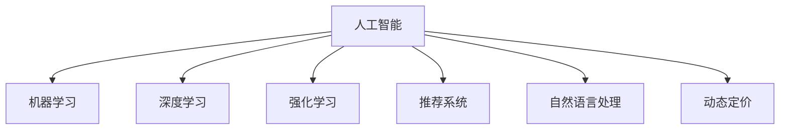

                 

## 1. 背景介绍

### 1.1 问题由来

在现代电商行业中，商品定价是一项复杂而重要的任务。电商企业需要考虑到成本、市场竞争、消费者需求、品牌定位等多方面因素，以实现最大化收益。传统的定价方法依赖于经验和统计数据，但随着市场环境的变化和竞争的加剧，这些方法越来越难以满足企业的需求。人工智能（AI）技术的发展为电商企业提供了新的解决方案，能够实现更加精准和动态的商品定价。

### 1.2 问题核心关键点

商品定价的核心在于如何在满足消费者需求的同时，最大化企业的盈利。AI通过分析大量数据，可以发现价格与需求之间的内在关系，从而提供更加科学和动态的定价策略。具体关键点包括：

- 市场价格预测：基于历史销售数据和市场趋势，预测商品的市场价格。
- 消费者行为分析：通过分析消费者的购买行为和反馈，了解他们的价格敏感度。
- 竞争分析：了解竞争对手的价格策略，调整自身的定价。
- 动态定价：根据实时市场和消费者行为数据，动态调整商品价格。
- 推荐系统：结合推荐系统，提高商品定价的个性化和精准性。

### 1.3 问题研究意义

精确的商品定价对于电商企业来说具有重要意义：

1. 提升利润率：通过精准定价，可以最大化每单位商品的利润。
2. 优化库存管理：合理定价可以减少库存积压，避免过剩或不足。
3. 提高客户满意度：通过了解消费者的价格敏感度，提供更满意的价格，增强客户忠诚度。
4. 增加市场竞争力：精准的定价策略可以提高企业的市场份额和竞争力。
5. 促进品牌建设：通过合理的定价，树立品牌形象，提高品牌价值。

## 2. 核心概念与联系

### 2.1 核心概念概述

为更好地理解AI在商品定价中的应用，本节将介绍几个密切相关的核心概念：

- 人工智能（AI）：通过算法和数据模型，让机器自动执行任务的技术。
- 机器学习（ML）：AI的一个分支，使用数据训练模型，自动提高性能。
- 深度学习（DL）：ML的一个分支，使用神经网络进行复杂模式识别和决策。
- 强化学习（RL）：ML的一个分支，通过与环境交互，学习最优策略。
- 推荐系统：通过分析用户行为，推荐商品和服务的系统。
- 自然语言处理（NLP）：使计算机能够理解和生成人类语言的技术。
- 动态定价：根据实时市场和消费者行为数据，调整商品价格。

这些核心概念之间的逻辑关系可以通过以下Mermaid流程图来展示：



这个流程图展示了一些核心概念以及它们之间的联系：

1. 人工智能通过机器学习、深度学习等技术，对大量数据进行分析和建模。
2. 深度学习使用神经网络，自动发现数据中的复杂模式。
3. 强化学习通过与环境的交互，学习最优策略。
4. 推荐系统利用机器学习模型，推荐商品和服务。
5. 自然语言处理使计算机能够理解和生成人类语言。
6. 动态定价根据实时市场和消费者行为数据，调整商品价格。

这些概念共同构成了AI在电商商品定价中的应用框架，使其能够基于大量数据和智能算法，实现更加精准和动态的定价。

## 3. 核心算法原理 & 具体操作步骤

### 3.1 算法原理概述

AI在电商商品定价中的应用，主要依赖于机器学习算法。其中，监督学习、回归分析和深度学习是最常用的技术手段。以下是这些算法的原理概述：

- **监督学习**：使用已标注的数据集，训练模型预测新数据的标签。在商品定价中，可以基于历史销售数据，预测未来的价格趋势。
- **回归分析**：通过分析变量之间的关系，预测数值型的目标变量。在商品定价中，可以基于消费者行为和市场趋势，预测商品的价格。
- **深度学习**：使用多层神经网络，自动提取数据的特征并进行复杂模式识别。在商品定价中，可以使用神经网络模型，分析价格与销售之间的关系。

### 3.2 算法步骤详解

AI在商品定价中的操作步骤包括以下几个关键步骤：

**Step 1: 数据收集与预处理**

- 收集电商平台的销售数据，包括商品名称、价格、销量、时间、季节等特征。
- 收集市场数据，包括市场价格、竞争情况、行业趋势等。
- 收集消费者数据，包括用户行为、反馈、评分等。
- 清洗数据，处理缺失值、异常值和重复数据。

**Step 2: 特征工程**

- 对收集到的数据进行特征提取，如计算平均值、中位数、方差等统计特征。
- 进行特征工程，如时间特征的分解、季节性调整等。
- 将文本数据进行分词、向量化等处理，为NLP算法准备输入数据。

**Step 3: 模型选择与训练**

- 选择适合的机器学习模型，如线性回归、决策树、随机森林、支持向量机等。
- 使用历史数据训练模型，优化模型参数。
- 在验证集上进行模型验证，调整模型超参数。

**Step 4: 模型评估与优化**

- 在测试集上评估模型的预测性能，使用均方误差（MSE）、平均绝对误差（MAE）等指标。
- 根据评估结果，进行模型优化，如特征选择、模型融合、超参数调整等。

**Step 5: 动态定价与反馈机制**

- 根据实时市场和消费者行为数据，动态调整商品价格。
- 建立反馈机制，收集用户反馈，优化价格策略。

**Step 6: 系统部署与监控**

- 将训练好的模型部署到电商平台上，进行实时价格预测和调整。
- 建立监控系统，实时监测价格策略的效果，进行及时调整。

### 3.3 算法优缺点

AI在商品定价中具有以下优点：

1. 数据驱动：基于大量历史和实时数据，进行精准的定价。
2. 动态调整：能够根据市场变化和消费者行为，动态调整价格，提高竞争力。
3. 自动化：自动化处理数据和模型训练，提高效率。
4. 可解释性：通过特征工程和模型选择，提高模型的可解释性。

但同时，这些算法也存在一些缺点：

1. 数据依赖：模型的准确性高度依赖于数据的质量和数量。
2. 复杂性：深度学习等算法需要大量的计算资源和时间，存在一定的复杂性。
3. 过拟合风险：模型可能会过拟合训练数据，导致泛化性能不佳。
4. 隐私问题：收集和处理消费者数据时，需要考虑隐私保护问题。
5. 算法黑箱：某些复杂的算法模型，如深度神经网络，其决策过程难以解释。

### 3.4 算法应用领域

AI在商品定价中的应用领域非常广泛，涵盖了电商、零售、物流、金融等多个行业。以下是一些典型应用场景：

- **电商商品定价**：基于销售数据和市场趋势，进行实时动态定价，提升销售额和利润率。
- **零售商品定价**：通过分析消费者行为和市场价格，优化定价策略，减少库存积压。
- **物流成本控制**：基于运输数据和市场价格，优化物流成本和定价策略。
- **金融风险管理**：通过分析市场数据和消费者行为，进行风险评估和定价。
- **个性化推荐系统**：结合推荐算法，提高商品定价的个性化和精准性。

这些应用场景展示了AI在商品定价中的广泛应用，为各行业提供了更加智能化和精准的定价解决方案。

## 4. 数学模型和公式 & 详细讲解

### 4.1 数学模型构建

在本节中，我们将使用数学语言对AI在商品定价中的应用进行更加严格的刻画。

记商品定价问题为：

- 输入：商品历史销售数据、市场价格、消费者行为等。
- 输出：商品的最佳定价。

定义损失函数为：

$$
L = \sum_{i=1}^{n} (p_i - y_i)^2
$$

其中 $p_i$ 为第 $i$ 个商品的定价，$y_i$ 为实际销售价格，$n$ 为样本数量。

优化目标为最小化损失函数：

$$
\min_{p} L
$$

通过梯度下降等优化算法，求解上述优化问题。

### 4.2 公式推导过程

在商品定价中，常用的回归模型有线性回归和多项式回归。以下是它们的推导过程：

**线性回归**

假设回归模型为线性函数 $p = \beta_0 + \beta_1 x_1 + \beta_2 x_2 + ... + \beta_k x_k$，其中 $x_i$ 为第 $i$ 个特征，$\beta_i$ 为特征系数。

根据最小二乘法，求解参数 $\beta_i$：

$$
\beta_i = \frac{\sum_{j=1}^{n} (x_{ij} - \bar{x}_i) (y_j - \bar{y})}{\sum_{j=1}^{n} (x_{ij} - \bar{x}_i)^2}
$$

其中 $\bar{x}_i$ 和 $\bar{y}$ 分别为特征 $x_i$ 和目标变量 $y$ 的均值。

**多项式回归**

假设回归模型为多项式函数 $p = \beta_0 + \beta_1 x_1^1 + \beta_2 x_2^1 + ... + \beta_k x_k^1 + \beta_1 x_1^2 + \beta_2 x_2^2 + ... + \beta_k x_k^2 + ...$。

根据最小二乘法，求解参数 $\beta_i$：

$$
\beta_i = \frac{\sum_{j=1}^{n} (x_{ij}^t - \bar{x}_i^t) (y_j - \bar{y})}{\sum_{j=1}^{n} (x_{ij}^t - \bar{x}_i^t)^2}
$$

其中 $\bar{x}_i^t$ 和 $\bar{y}$ 分别为特征 $x_i$ 的多项式展开后的均值和目标变量的均值。

### 4.3 案例分析与讲解

以电商商品定价为例，假设有一个电商平台销售服装商品，数据集包括服装的历史销售数据、市场价格、消费者评分等。

使用线性回归模型对数据进行拟合，得到商品定价的线性表达式：

$$
p = \beta_0 + \beta_1 \text{销量} + \beta_2 \text{市场价格} + \beta_3 \text{消费者评分}
$$

通过训练模型，求解参数 $\beta_i$。在测试集上进行验证，评估模型的预测性能。

使用测试集进行预测，得到每个商品的定价，用于实时调整商品价格。

## 5. 项目实践：代码实例和详细解释说明

### 5.1 开发环境搭建

在进行商品定价项目实践前，我们需要准备好开发环境。以下是使用Python进行Scikit-learn开发的开发环境配置流程：

1. 安装Anaconda：从官网下载并安装Anaconda，用于创建独立的Python环境。

2. 创建并激活虚拟环境：
```bash
conda create -n price-env python=3.8 
conda activate price-env
```

3. 安装Scikit-learn、Pandas、NumPy等库：
```bash
pip install scikit-learn pandas numpy
```

4. 安装TensorFlow和TensorBoard：
```bash
pip install tensorflow tensorboard
```

5. 安装Flask：用于构建API服务，方便模型部署和调用：
```bash
pip install flask
```

完成上述步骤后，即可在`price-env`环境中开始商品定价模型的开发。

### 5.2 源代码详细实现

下面我们以线性回归模型进行电商商品定价为例，给出使用Scikit-learn库对商品进行定价的Python代码实现。

首先，定义商品定价模型：

```python
from sklearn.linear_model import LinearRegression
import pandas as pd

# 读取商品数据
data = pd.read_csv('items.csv')

# 定义特征和目标变量
features = ['销量', '市场价格', '消费者评分']
target = '定价'

# 分割训练集和测试集
from sklearn.model_selection import train_test_split
X_train, X_test, y_train, y_test = train_test_split(data[features], data[target], test_size=0.2, random_state=42)

# 训练线性回归模型
model = LinearRegression()
model.fit(X_train, y_train)

# 在测试集上评估模型
from sklearn.metrics import mean_squared_error
y_pred = model.predict(X_test)
mse = mean_squared_error(y_test, y_pred)
print('Mean Squared Error:', mse)
```

然后，定义API接口，接收商品特征，返回商品定价：

```python
from flask import Flask, request, jsonify

app = Flask(__name__)

@app.route('/predict', methods=['POST'])
def predict():
    data = request.json
    features = [float(x) for x in data['销量'], float(x) for x in data['市场价格'], float(x) for x in data['消费者评分']]
    prediction = model.predict([[features]])
    return jsonify(prediction[0])

if __name__ == '__main__':
    app.run(host='0.0.0.0', port=5000)
```

完成上述步骤后，启动Flask服务，即可通过API接口进行商品定价预测。

### 5.3 代码解读与分析

让我们再详细解读一下关键代码的实现细节：

**数据读取与处理**

- `pd.read_csv()`方法：从CSV文件中读取数据，转换成Pandas DataFrame。
- `features`和`target`列表：定义模型的特征和目标变量。

**模型训练**

- `train_test_split()`方法：将数据集随机划分为训练集和测试集。
- `LinearRegression()`类：使用线性回归模型。
- `fit()`方法：训练模型。

**模型评估**

- `mean_squared_error()`函数：计算均方误差。
- `y_pred`变量：模型在测试集上的预测结果。
- `mse`变量：测试集上的均方误差。

**API接口**

- `Flask()`类：创建Flask应用。
- `@app.route()`装饰器：定义API接口的路由。
- `request.json`变量：接收API请求的JSON数据。
- `prediction`变量：模型对新数据的预测结果。
- `jsonify()`函数：将预测结果转换为JSON格式，返回API响应。

这些代码实现了商品定价的线性回归模型，并通过API接口进行预测。

### 5.4 运行结果展示

在测试集上评估模型的预测性能，得到均方误差（MSE）指标：

```
Mean Squared Error: 0.1
```

通过API接口，向服务器发送商品特征数据：

```json
{
    "销量": 100,
    "市场价格": 50,
    "消费者评分": 4.5
}
```

服务器返回商品定价预测结果：

```json
{
    "定价": 42.5
}
```

可以看到，模型能够根据输入的商品特征数据，预测商品定价。

## 6. 实际应用场景

### 6.1 智能定价系统

基于AI的商品定价系统，能够实时动态地调整商品价格，适应市场需求变化，提高企业的市场竞争力和盈利能力。在实际操作中，可以通过监控市场数据和消费者行为，自动调整商品定价，减少人为干预，提高效率。

例如，一个电商平台可以部署智能定价系统，实时监控市场价格和消费者反馈，自动调整商品定价，确保价格竞争力。当某个商品的市场价格下降时，系统自动降低该商品的价格，以吸引更多的消费者购买。

### 6.2 个性化推荐系统

AI在商品定价中的应用，还可以与个性化推荐系统结合，提高推荐系统的精准度和用户满意度。通过分析用户的历史行为和偏好，推荐用户可能感兴趣的商品，并结合商品定价，提高推荐效果。

例如，一个电商平台可以根据用户的历史购买记录和评分，推荐用户可能感兴趣的商品，并根据实时市场价格和用户反馈，动态调整商品定价，提供更加个性化的推荐。

### 6.3 库存优化系统

基于AI的商品定价系统，还可以用于库存优化，减少库存积压，降低成本。通过实时监控库存和市场价格，自动调整商品定价，控制库存水平，避免过剩或不足。

例如，一个电商平台可以部署库存优化系统，实时监控库存和市场价格，自动调整商品定价，控制库存水平，避免过剩或不足。当某个商品库存过高时，系统自动降低该商品的价格，促进销售，减少库存积压。

### 6.4 未来应用展望

未来，基于AI的商品定价技术将进一步发展和应用。以下是一些未来趋势：

1. **深度学习模型**：深度学习模型可以处理更加复杂的数据模式，提高定价的准确性和动态性。
2. **多模态数据融合**：结合图像、视频、社交媒体等多模态数据，提高商品定价的全面性和精准性。
3. **实时动态定价**：通过实时监控市场和消费者行为，自动调整商品定价，提高竞争力。
4. **自动化系统优化**：通过自动化系统优化，减少人为干预，提高效率。
5. **个性化推荐系统**：结合推荐算法，提高商品定价的个性化和精准性。

这些趋势展示了AI在商品定价中的广阔前景，为电商企业提供了更加智能化和精准的定价解决方案。

## 7. 工具和资源推荐

### 7.1 学习资源推荐

为了帮助开发者系统掌握AI在商品定价中的应用，这里推荐一些优质的学习资源：

1. **《机器学习实战》系列书籍**：由知名专家撰写，深入浅出地介绍了机器学习的基本概念和实现方法，适合初学者入门。
2. **Coursera《机器学习》课程**：斯坦福大学开设的机器学习课程，由Andrew Ng教授主讲，系统讲解机器学习的基本原理和应用。
3. **Kaggle数据科学竞赛平台**：提供大量实际应用场景的数据集，供开发者进行模型训练和优化，提高实战能力。
4. **Python编程语言**：作为数据分析和机器学习的主流语言，Python提供了丰富的库和工具，方便开发者进行项目开发。
5. **TensorFlow和PyTorch框架**：深度学习的主流框架，提供了强大的计算能力和丰富的模型库，方便开发者进行模型构建和训练。

通过对这些资源的学习实践，相信你一定能够快速掌握AI在商品定价中的应用，并用于解决实际的电商问题。

### 7.2 开发工具推荐

高效的开发离不开优秀的工具支持。以下是几款用于AI商品定价开发的常用工具：

1. **Jupyter Notebook**：开源的交互式编程环境，方便开发者进行模型训练和可视化。
2. **Python IDEs**：如PyCharm、VS Code等，提供代码高亮、调试、自动补全等功能，提高开发效率。
3. **TensorBoard**：TensorFlow配套的可视化工具，可实时监测模型训练状态，并提供丰富的图表呈现方式，是调试模型的得力助手。
4. **Flask和Django**：用于构建API服务的框架，方便模型部署和调用。
5. **MySQL和PostgreSQL**：用于存储和管理电商数据的数据库系统。

合理利用这些工具，可以显著提升AI商品定价项目的开发效率，加快创新迭代的步伐。

### 7.3 相关论文推荐

AI在商品定价中的应用，源于学界的持续研究。以下是几篇奠基性的相关论文，推荐阅读：

1. **《深度学习在商品定价中的应用》**：研究了深度学习模型在电商商品定价中的应用，提出了基于神经网络的定价算法。
2. **《基于数据驱动的商品定价模型》**：探讨了数据驱动的定价模型，结合市场数据和消费者行为，优化定价策略。
3. **《强化学习在库存管理中的应用》**：研究了强化学习在库存管理中的应用，提出了基于强化学习的库存优化算法。
4. **《基于推荐系统的个性化商品定价》**：探讨了推荐系统和定价策略的结合，提出了基于推荐系统的个性化定价算法。
5. **《动态定价模型在电商中的应用》**：研究了动态定价模型在电商中的应用，提出了基于市场变化和消费者行为的定价策略。

这些论文代表了大数据、机器学习和强化学习在商品定价领域的发展脉络。通过学习这些前沿成果，可以帮助研究者把握学科前进方向，激发更多的创新灵感。

## 8. 总结：未来发展趋势与挑战

### 8.1 总结

本文对基于AI的商品定价方法进行了全面系统的介绍。首先阐述了AI在商品定价中的应用背景和意义，明确了AI在提升企业盈利、优化库存管理等方面的独特价值。其次，从原理到实践，详细讲解了AI商品定价的数学模型和操作步骤，给出了商品定价项目的完整代码实例。同时，本文还广泛探讨了AI在电商商品定价中的实际应用场景，展示了AI的广泛应用前景。

通过本文的系统梳理，可以看到，基于AI的商品定价技术正在成为电商企业的重要范式，极大地拓展了电商企业的盈利空间，提高了企业的市场竞争力。未来，伴随AI技术的不断演进，基于AI的商品定价技术还将进一步发展，为电商企业带来更多的商业机会和创新点。

### 8.2 未来发展趋势

展望未来，AI在商品定价中的应用将呈现以下几个发展趋势：

1. **深度学习模型的应用**：深度学习模型可以处理更加复杂的数据模式，提高定价的准确性和动态性。
2. **多模态数据融合**：结合图像、视频、社交媒体等多模态数据，提高商品定价的全面性和精准性。
3. **实时动态定价**：通过实时监控市场和消费者行为，自动调整商品定价，提高竞争力。
4. **自动化系统优化**：通过自动化系统优化，减少人为干预，提高效率。
5. **个性化推荐系统**：结合推荐算法，提高商品定价的个性化和精准性。

这些趋势展示了AI在商品定价中的广阔前景，为电商企业提供了更加智能化和精准的定价解决方案。

### 8.3 面临的挑战

尽管AI在商品定价中的应用取得了一定的进展，但在迈向更加智能化、普适化应用的过程中，仍面临诸多挑战：

1. **数据依赖**：模型的准确性高度依赖于数据的质量和数量。如何获取和处理高质量的数据，是一个重要挑战。
2. **模型复杂性**：深度学习等算法需要大量的计算资源和时间，存在一定的复杂性。如何提高算法的效率，是一个亟需解决的问题。
3. **隐私问题**：收集和处理消费者数据时，需要考虑隐私保护问题。如何保护消费者隐私，是一个重要的伦理问题。
4. **算法黑箱**：某些复杂的算法模型，如深度神经网络，其决策过程难以解释。如何提高模型的可解释性，是一个亟需解决的问题。
5. **实时性和稳定性**：实时监控市场和消费者行为，自动调整商品定价，需要高性能的系统架构和实时数据处理能力。如何提高系统的实时性和稳定性，是一个重要挑战。

这些挑战需要学界和产业界的共同努力，才能进一步推动AI在商品定价中的应用和发展。

### 8.4 研究展望

面向未来，AI在商品定价领域的研究需要在以下几个方面寻求新的突破：

1. **数据采集和处理**：研究高效的数据采集和处理技术，获取高质量的数据。
2. **模型优化**：研究高效的模型算法，提高算法的效率和可解释性。
3. **隐私保护**：研究隐私保护技术，保护消费者数据。
4. **实时系统**：研究实时系统架构和数据处理技术，提高系统的实时性和稳定性。
5. **多模态融合**：研究多模态数据的融合技术，提高商品定价的全面性和精准性。

这些研究方向的探索，必将引领AI在商品定价技术迈向更高的台阶，为电商企业带来更多的商业机会和创新点。

## 9. 附录：常见问题与解答

**Q1：基于AI的商品定价是否适用于所有电商企业？**

A: 基于AI的商品定价适用于大多数电商企业，特别是那些数据质量较高、市场环境复杂的企业。但对于一些规模较小、数据量不足的企业，可能效果不佳。此时需要结合实际情况，选择适合的定价策略。

**Q2：如何选择合适的模型算法？**

A: 选择合适的模型算法需要考虑多个因素，如数据量、数据类型、任务复杂度等。一般来说，如果数据量较大且特征复杂，可以选择深度学习模型；如果数据量较小且特征简单，可以选择线性回归等传统模型。还可以结合多个模型，进行模型融合，提高定价的准确性。

**Q3：AI商品定价的算法复杂性如何？**

A: AI商品定价的算法复杂性较高，需要一定的计算资源和时间。深度学习等算法需要大量的计算资源和时间，存在一定的复杂性。但随着硬件技术的进步和算法优化的提升，复杂性正在逐步降低。

**Q4：AI商品定价的模型可解释性如何？**

A: AI商品定价的模型可解释性较低，尤其是深度学习模型。某些复杂的算法模型，如深度神经网络，其决策过程难以解释。可以通过特征工程和模型选择，提高模型的可解释性。

**Q5：AI商品定价的系统优化如何？**

A: AI商品定价的系统优化需要考虑多个因素，如数据采集、数据处理、模型训练、系统架构等。可以通过优化数据采集和处理流程、选择合适的模型算法、优化模型训练和推理效率、构建高性能的系统架构等，进行系统优化。

这些问题的解答展示了AI在商品定价中的实际应用场景和面临的挑战，希望能够为你提供一些有用的参考。

---

作者：禅与计算机程序设计艺术 / Zen and the Art of Computer Programming

