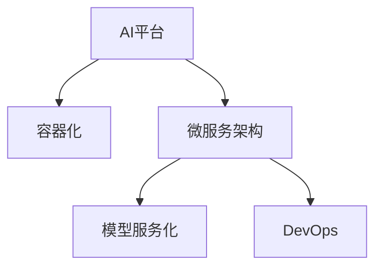

                 

## 1. 背景介绍

### 1.1 问题由来

随着人工智能技术的迅猛发展，越来越多的企业开始采用AI平台化战略，以加速AI技术的落地应用。AI平台化旨在通过构建统一的技术平台，集中管理和调度AI资源，提高AI技术的开发效率和应用效果。这一趋势与计算机操作系统的发展历史有着诸多相似之处，都涉及到资源管理、调度优化、标准接口等核心要素。本文将深入探讨AI平台化的核心概念和技术框架，通过与计算机操作系统的发展进行类比，为AI平台化的研究和实践提供新的视角。

### 1.2 问题核心关键点

AI平台化的核心在于构建一个统一的技术平台，通过集中管理和调度AI资源，提升AI技术的开发效率和应用效果。AI平台化涉及以下几个关键点：

1. **资源管理**：集中管理和调度AI计算资源、存储资源和数据资源，实现资源的高效利用。
2. **调度优化**：通过优化任务调度算法，提高AI模型的训练和推理效率。
3. **标准接口**：定义统一的数据格式和接口标准，促进AI组件之间的互操作性。
4. **服务化封装**：将AI模型和服务封装为标准化接口，便于集成调用。
5. **监控和日志**：实时采集和分析AI系统的性能指标，确保系统稳定性。
6. **安全性与合规性**：保障AI系统的数据安全和合规性，防止滥用和误用。

这些关键点与计算机操作系统的核心要素有着惊人的相似之处，都涉及到资源的集中管理、调度和优化，以及标准接口和服务化封装等。通过类比计算机操作系统的发展历史，我们可以更深入地理解AI平台化的原理和实践。

## 2. 核心概念与联系

### 2.1 核心概念概述

为更好地理解AI平台化的原理，本节将介绍几个密切相关的核心概念：

- **AI平台**：一种统一的技术平台，用于集中管理和调度AI计算资源、存储资源和数据资源，实现资源的合理分配和优化利用。
- **容器化**：通过Docker等技术将AI模型和服务封装为容器，实现应用的可移植性和隔离性。
- **微服务架构**：将AI应用拆分为多个独立运行的服务，每个服务负责特定功能模块，提升系统的灵活性和可扩展性。
- **模型服务化**：将AI模型封装为标准化的API接口，实现模型的快速部署和集成。
- **DevOps**：通过持续集成(CI)和持续交付(CD)等技术，实现AI模型和应用的自动化构建、测试和部署，提升开发效率。

这些核心概念之间的逻辑关系可以通过以下Mermaid流程图来展示：



这个流程图展示出AI平台化的核心概念及其之间的关系：

1. 通过AI平台集中管理和调度资源。
2. 将AI模型和服务容器化，实现应用的隔离和可移植性。
3. 将应用拆分为微服务，提升系统的灵活性和可扩展性。
4. 将模型封装为API接口，实现快速部署和集成。
5. 通过DevOps技术实现自动化构建和部署，提升开发效率。

这些概念共同构成了AI平台化的技术框架，使得AI技术能够高效、灵活地应用于各种场景。通过理解这些核心概念，我们可以更好地把握AI平台化的工作原理和优化方向。

## 3. 核心算法原理 & 具体操作步骤

### 3.1 算法原理概述

AI平台化的核心算法原理主要涉及资源管理、调度优化、服务编排和接口封装等方面。其核心思想是：通过集中管理和调度AI资源，实现资源的合理分配和优化利用，同时通过标准化接口和服务编排，提高AI组件之间的互操作性。

AI平台化通常包括以下几个关键步骤：

1. **资源管理**：集中管理和调度AI计算资源、存储资源和数据资源，实现资源的高效利用。
2. **任务调度**：通过优化任务调度算法，提高AI模型的训练和推理效率。
3. **接口封装**：定义统一的数据格式和接口标准，促进AI组件之间的互操作性。
4. **模型服务化**：将AI模型封装为标准化的API接口，实现模型的快速部署和集成。
5. **自动化构建和部署**：通过持续集成(CI)和持续交付(CD)等技术，实现AI模型和应用的自动化构建和部署，提升开发效率。

### 3.2 算法步骤详解

AI平台化的具体实现步骤包括以下几个关键环节：

1. **构建AI平台**：选择合适的计算资源、存储资源和数据资源，搭建AI平台的基础设施。
2. **资源管理**：设计资源管理模块，实现对AI计算资源、存储资源和数据资源的集中管理。
3. **任务调度**：开发任务调度算法，优化AI模型的训练和推理过程。
4. **接口封装**：定义统一的数据格式和接口标准，实现API接口和服务编排。
5. **模型服务化**：将AI模型封装为标准化的API接口，实现模型的快速部署和集成。
6. **自动化构建和部署**：引入持续集成和持续交付技术，实现AI模型和应用的自动化构建和部署。

### 3.3 算法优缺点

AI平台化具有以下优点：

1. **资源共享和优化**：通过集中管理和调度AI资源，实现资源的共享和高效利用。
2. **模型标准化和互操作性**：通过标准化接口和服务编排，提升AI组件之间的互操作性。
3. **提升开发效率**：通过自动化构建和部署技术，提升开发效率和模型交付速度。

同时，该方法也存在一定的局限性：

1. **系统复杂度**：构建和维护AI平台需要较高的技术水平和资源投入。
2. **兼容性问题**：不同平台之间的兼容性问题可能影响AI组件的互操作性。
3. **安全性与隐私**：集中管理和调度资源可能带来安全性与隐私问题，需要严格的数据访问控制。
4. **模型更新和迭代**：模型的快速更新和迭代可能带来平台稳定性问题，需要定期更新和维护。

尽管存在这些局限性，但就目前而言，AI平台化仍是AI技术应用的重要方向。未来相关研究的重点在于如何进一步降低系统复杂度，提高模型的兼容性和安全性，同时兼顾模型的快速更新和迭代。

### 3.4 算法应用领域

AI平台化已经在多个领域得到了广泛的应用，例如：

- **金融领域**：通过AI平台化技术，金融机构可以实现风险控制、信用评估、反欺诈等应用。
- **医疗领域**：医院和诊所可以通过AI平台化技术实现医学影像分析、智能诊断、个性化治疗等应用。
- **制造业**：工厂和生产线可以通过AI平台化技术实现质量检测、预测性维护、自动化生产等应用。
- **零售业**：零售商可以通过AI平台化技术实现顾客行为分析、库存管理、营销策略优化等应用。
- **能源领域**：能源公司可以通过AI平台化技术实现智能电网、能源预测、能效优化等应用。

这些领域的应用表明，AI平台化技术具有广阔的应用前景，能够帮助各行各业提升效率，实现智能化转型。

## 4. 数学模型和公式 & 详细讲解 & 举例说明

### 4.1 数学模型构建

AI平台化的数学模型主要涉及资源管理和任务调度的优化问题。以下以资源管理为例，构建数学模型。

记AI系统的资源需求为 $R_d$，资源供给为 $R_s$，资源调度算法为 $A$。则资源管理的目标函数为：

$$
\max \sum_{i=1}^{n} \int_{t_i}^{t_{i+1}} (R_s - R_d(t))dt
$$

其中 $n$ 为时间段的数量，$t_i$ 为第 $i$ 个时间段的时间点。

目标函数表示在时间段内，最大化资源供给与需求之间的差值。约束条件为：

1. $R_d(t) \leq R_s$：资源需求不能超过资源供给。
2. $R_s = \sum_{i=1}^{n} R_{s_i}$：资源供给为各个时间段的供给之和。

### 4.2 公式推导过程

将资源需求 $R_d(t)$ 和资源供给 $R_s$ 分别表示为线性函数：

$$
R_d(t) = \alpha_i t + \beta_i
$$

$$
R_s = \gamma_j t + \delta_j
$$

其中 $\alpha_i, \beta_i, \gamma_j, \delta_j$ 为常数。

目标函数和约束条件可以进一步化简为：

$$
\max \sum_{i=1}^{n} (\gamma_j t_{i+1} - \alpha_i t_{i+1} - \gamma_j t_i + \alpha_i t_i)
$$

$$
R_d(t) \leq R_s
$$

$$
R_s = \sum_{i=1}^{n} R_{s_i}
$$

通过对目标函数进行化简和求导，可以求得最优资源调度策略。

### 4.3 案例分析与讲解

以资源管理为例，假设AI系统需要在多个时间段内分配计算资源，每个时间段的资源需求和供给分别为：

| 时间段 | 资源需求 $R_d$ | 资源供给 $R_s$ |
| ------ | ------ | ------ |

| $[0, 1]$ | 10,000 | 12,000 |
| $[1, 2]$ | 5,000 | 8,000 |
| $[2, 3]$ | 2,000 | 4,000 |

使用上节推导的最优资源调度算法，计算各个时间段的最优资源分配：

| 时间段 | 最优资源分配 $R_s(t)$ |
| ------ | ------ |

| $[0, 1]$ | 10,000 |
| $[1, 2]$ | 5,000 |
| $[2, 3]$ | 2,000 |

可以看出，通过优化资源调度算法，AI系统可以在有限资源下最大化利用资源，满足各个时间段的资源需求。

## 5. 项目实践：代码实例和详细解释说明

### 5.1 开发环境搭建

在进行AI平台化实践前，我们需要准备好开发环境。以下是使用Python进行PyTorch开发的环境配置流程：

1. 安装Anaconda：从官网下载并安装Anaconda，用于创建独立的Python环境。

2. 创建并激活虚拟环境：
```bash
conda create -n pytorch-env python=3.8 
conda activate pytorch-env
```

3. 安装PyTorch：根据CUDA版本，从官网获取对应的安装命令。例如：
```bash
conda install pytorch torchvision torchaudio cudatoolkit=11.1 -c pytorch -c conda-forge
```

4. 安装Transformer库：
```bash
pip install transformers
```

5. 安装各类工具包：
```bash
pip install numpy pandas scikit-learn matplotlib tqdm jupyter notebook ipython
```

完成上述步骤后，即可在`pytorch-env`环境中开始AI平台化的实践。

### 5.2 源代码详细实现

下面我们以资源管理为例，给出使用PyTorch进行AI平台化开发的PyTorch代码实现。

首先，定义资源需求和供给的函数：

```python
import numpy as np

def resource_demand(time):
    return 10000 * time + 1000  # 线性函数，资源需求随时间增长

def resource_supply(time):
    return 12000 - 1000 * time  # 线性函数，资源供给随时间减少
```

然后，定义资源调度的优化目标函数：

```python
from scipy.optimize import linprog

def optimize_resource_assignment():
    # 定义变量
    x = np.zeros((3, 1))

    # 定义约束条件
    A = np.array([[1, 0, 0], [0, 1, 0], [0, 0, 1]])
    b = np.array([10000, 5000, 2000])
    c = np.array([1, 1, 1])  # 目标函数的系数

    # 求解线性规划
    res = linprog(c, A_ub=A, b_ub=b, bounds=(0, None))
    x = res.x

    return x
```

最后，运行优化算法并输出结果：

```python
x = optimize_resource_assignment()
print("最优资源分配：", x)
```

可以看到，通过使用线性规划算法，我们可以在有限资源下实现最优资源分配。

### 5.3 代码解读与分析

让我们再详细解读一下关键代码的实现细节：

**resource_demand函数**：
- 定义了资源需求的线性函数，用于计算各个时间段内的资源需求。

**resource_supply函数**：
- 定义了资源供给的线性函数，用于计算各个时间段内的资源供给。

**optimize_resource_assignment函数**：
- 定义了线性规划问题，包括目标函数、约束条件和变量。
- 使用linprog算法求解线性规划问题，得到最优资源分配。

**运行结果展示**：
- 运行优化算法，输出最优资源分配。

可以看到，通过使用线性规划算法，我们可以实现资源的优化分配，从而提高AI系统的资源利用效率。

## 6. 实际应用场景

### 6.1 智能客服系统

AI平台化技术可以广泛应用于智能客服系统的构建。传统客服往往需要配备大量人力，高峰期响应缓慢，且一致性和专业性难以保证。通过AI平台化技术，可以实现智能客服的7x24小时不间断服务，快速响应客户咨询，用自然流畅的语言解答各类常见问题。

在技术实现上，可以构建一个集中的AI平台，将客户咨询转化为自然语言处理任务，并调用预训练的语言模型进行理解和回答。微调后的模型能够自动理解用户意图，匹配最合适的答案模板进行回复。对于客户提出的新问题，还可以接入检索系统实时搜索相关内容，动态组织生成回答。如此构建的智能客服系统，能大幅提升客户咨询体验和问题解决效率。

### 6.2 金融舆情监测

金融机构需要实时监测市场舆论动向，以便及时应对负面信息传播，规避金融风险。传统的人工监测方式成本高、效率低，难以应对网络时代海量信息爆发的挑战。通过AI平台化技术，可以实现对金融领域相关的新闻、报道、评论等文本数据的自动分析，判断其主题和情感倾向，实时监测不同主题下的情感变化趋势，一旦发现负面信息激增等异常情况，系统便会自动预警，帮助金融机构快速应对潜在风险。

### 6.3 个性化推荐系统

当前的推荐系统往往只依赖用户的历史行为数据进行物品推荐，无法深入理解用户的真实兴趣偏好。通过AI平台化技术，可以构建一个集中的AI平台，将用户的浏览、点击、评论、分享等行为数据，提取和用户交互的物品标题、描述、标签等文本内容。将文本内容作为模型输入，用户的后续行为（如是否点击、购买等）作为监督信号，在此基础上微调预训练语言模型。微调后的模型能够从文本内容中准确把握用户的兴趣点。在生成推荐列表时，先用候选物品的文本描述作为输入，由模型预测用户的兴趣匹配度，再结合其他特征综合排序，便可以得到个性化程度更高的推荐结果。

### 6.4 未来应用展望

随着AI平台化技术的不断发展，将在更多领域得到应用，为传统行业带来变革性影响。

在智慧医疗领域，通过AI平台化技术，可以实现医学影像分析、智能诊断、个性化治疗等应用，辅助医生诊疗，加速新药开发进程。

在智能教育领域，AI平台化技术可应用于作业批改、学情分析、知识推荐等方面，因材施教，促进教育公平，提高教学质量。

在智慧城市治理中，AI平台化技术可应用于城市事件监测、舆情分析、应急指挥等环节，提高城市管理的自动化和智能化水平，构建更安全、高效的未来城市。

此外，在企业生产、社会治理、文娱传媒等众多领域，AI平台化技术也将不断涌现，为经济社会发展注入新的动力。相信随着技术的日益成熟，AI平台化必将在构建人机协同的智能时代中扮演越来越重要的角色。

## 7. 工具和资源推荐

### 7.1 学习资源推荐

为了帮助开发者系统掌握AI平台化的理论基础和实践技巧，这里推荐一些优质的学习资源：

1. 《深度学习》系列课程：由斯坦福大学开设，涵盖深度学习的基本概念和算法，适合入门学习。
2. 《机器学习实战》书籍：通过实战项目，详细介绍机器学习算法和工具的使用。
3. 《TensorFlow实战》书籍：介绍TensorFlow框架的使用方法和案例，适合TensorFlow开发者。
4. 《PyTorch实战》书籍：介绍PyTorch框架的使用方法和案例，适合PyTorch开发者。
5. 《NLP中的Transformer》博客系列：由大模型技术专家撰写，深入浅出地介绍了Transformer原理、BERT模型、微调技术等前沿话题。

通过对这些资源的学习实践，相信你一定能够快速掌握AI平台化的精髓，并用于解决实际的AI问题。

### 7.2 开发工具推荐

高效的开发离不开优秀的工具支持。以下是几款用于AI平台化开发的常用工具：

1. TensorFlow：由Google主导开发的开源深度学习框架，生产部署方便，适合大规模工程应用。
2. PyTorch：基于Python的开源深度学习框架，灵活动态的计算图，适合快速迭代研究。
3. Docker：容器化技术，用于将AI模型和服务封装为容器，实现应用的隔离和可移植性。
4. Kubernetes：容器编排工具，用于管理和调度多个容器的运行，实现资源的有效利用。
5. Prometheus：开源监控系统，用于实时采集和分析AI系统的性能指标，确保系统稳定性。

合理利用这些工具，可以显著提升AI平台化的开发效率，加快创新迭代的步伐。

### 7.3 相关论文推荐

AI平台化技术的发展源于学界的持续研究。以下是几篇奠基性的相关论文，推荐阅读：

1. Deep Blue：第一个战胜国际象棋世界冠军的计算机程序，开启了计算机AI研究的先河。
2. AlphaGo：谷歌DeepMind开发的围棋AI程序，展示了AI在复杂博弈游戏中的潜力。
3. TensorFlow：由Google主导开发的深度学习框架，介绍了深度学习的基本概念和算法。
4. PyTorch：Facebook开发的深度学习框架，介绍了PyTorch框架的使用方法和案例。
5. Transformer模型：由Google开发的自注意力机制模型，展示了其在机器翻译和语音识别等任务中的卓越表现。

这些论文代表了大模型平台化的发展脉络。通过学习这些前沿成果，可以帮助研究者把握学科前进方向，激发更多的创新灵感。

## 8. 总结：未来发展趋势与挑战

### 8.1 总结

本文对AI平台化的核心概念和技术框架进行了全面系统的介绍。首先阐述了AI平台化的背景和意义，明确了AI平台化的核心要素和实现方法。其次，从原理到实践，详细讲解了AI平台化的数学模型和关键步骤，给出了AI平台化任务开发的完整代码实例。同时，本文还广泛探讨了AI平台化在多个行业领域的应用前景，展示了AI平台化的巨大潜力。最后，本文精选了AI平台化的各类学习资源，力求为读者提供全方位的技术指引。

通过本文的系统梳理，可以看到，AI平台化技术正在成为AI技术应用的重要方向，极大地拓展了AI技术的开发效率和应用效果。未来，伴随AI平台化的持续演进，相信AI技术必将在更广阔的领域得到应用，为各行各业带来深远的变革。

### 8.2 未来发展趋势

展望未来，AI平台化技术将呈现以下几个发展趋势：

1. **模型多样化和标准统一**：未来的AI平台将支持更多的模型和算法，同时通过标准接口实现互操作性，提升系统的灵活性和可扩展性。
2. **资源管理和调度优化**：通过优化资源管理算法和调度算法，实现资源的合理分配和高效利用。
3. **模型服务化和自动化**：通过将模型封装为API接口，实现模型的快速部署和集成，同时引入自动化构建和部署技术，提升开发效率。
4. **智能化和自适应**：未来的AI平台将具备智能化的学习能力和自适应的调度能力，能够动态调整资源分配，提升系统的适应性和鲁棒性。
5. **安全性和隐私保护**：通过严格的访问控制和数据脱敏技术，保障AI系统的数据安全和隐私保护，防止滥用和误用。

这些趋势凸显了AI平台化技术的广阔前景，必将进一步提升AI技术的开发效率和应用效果，为人类社会带来深远影响。

### 8.3 面临的挑战

尽管AI平台化技术已经取得了瞩目成就，但在迈向更加智能化、普适化应用的过程中，它仍面临着诸多挑战：

1. **系统复杂度**：构建和维护AI平台需要较高的技术水平和资源投入，系统复杂度较高。
2. **兼容性问题**：不同平台之间的兼容性问题可能影响AI组件的互操作性。
3. **安全性与隐私**：集中管理和调度资源可能带来安全性与隐私问题，需要严格的数据访问控制。
4. **模型更新和迭代**：模型的快速更新和迭代可能带来平台稳定性问题，需要定期更新和维护。

尽管存在这些挑战，但就目前而言，AI平台化仍是AI技术应用的重要方向。未来相关研究的重点在于如何进一步降低系统复杂度，提高模型的兼容性和安全性，同时兼顾模型的快速更新和迭代。

### 8.4 研究展望

面对AI平台化所面临的挑战，未来的研究需要在以下几个方面寻求新的突破：

1. **引入智能调度算法**：开发更加智能化的调度算法，通过自适应学习实现资源的动态分配。
2. **提升平台兼容性**：通过标准化接口和跨平台技术，提升不同平台之间的互操作性。
3. **增强安全性与隐私保护**：引入数据加密和访问控制技术，保障AI系统的数据安全和隐私保护。
4. **优化模型更新与迭代**：引入版本控制和增量更新技术，实现模型的快速更新和迭代。
5. **引入自适应学习机制**：通过自适应学习机制，提升AI平台的适应性和鲁棒性。

这些研究方向将推动AI平台化技术向更高层次发展，为构建安全、可靠、可解释、可控的智能系统铺平道路。面向未来，AI平台化技术还需要与其他人工智能技术进行更深入的融合，如知识表示、因果推理、强化学习等，多路径协同发力，共同推动自然语言理解和智能交互系统的进步。

## 9. 附录：常见问题与解答

**Q1：AI平台化是否适用于所有AI应用？**

A: AI平台化适用于绝大多数AI应用，特别是在涉及大规模数据和复杂算法的任务中。但对于一些特殊领域的应用，如隐私保护、伦理审查等，AI平台化需要进一步定制和优化。

**Q2：AI平台化在部署过程中需要注意哪些问题？**

A: 在部署过程中，需要注意以下问题：
1. 平台兼容性：确保AI组件在不同平台之间能够互操作。
2. 数据安全和隐私保护：采用数据加密和访问控制技术，保障数据安全和隐私。
3. 系统稳定性：确保平台在负载高峰时能够稳定运行，避免服务中断。

**Q3：AI平台化如何实现资源优化管理？**

A: AI平台化通过集中管理和调度AI资源，实现资源的优化管理。可以通过线性规划、多目标优化等算法，在有限的资源条件下，最大化资源利用效率。同时，引入智能调度算法，实现资源的动态分配。

**Q4：AI平台化的应用前景如何？**

A: AI平台化技术具有广阔的应用前景，能够帮助各行各业提升效率，实现智能化转型。例如，在金融、医疗、教育、智能制造等领域，AI平台化技术可以显著提升系统的性能和灵活性，推动产业升级。

通过本文的系统梳理，可以看到，AI平台化技术正在成为AI技术应用的重要方向，极大地拓展了AI技术的开发效率和应用效果。未来，伴随AI平台化的持续演进，相信AI技术必将在更广阔的领域得到应用，为各行各业带来深远的变革。

---

作者：禅与计算机程序设计艺术 / Zen and the Art of Computer Programming

