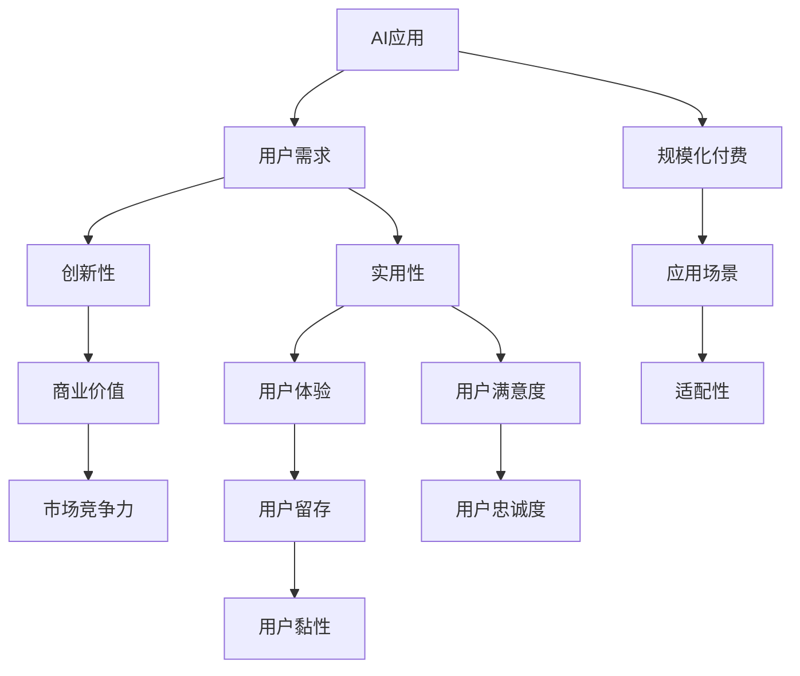

                 

# AI应用要有趣有用，方能实现规模化付费

> 关键词：AI应用,规模化付费,用户需求,创新性,有趣有用,用户体验,应用场景

## 1. 背景介绍

### 1.1 问题由来
随着人工智能（AI）技术的快速发展，越来越多的企业和组织开始探索利用AI技术提升业务效率和创新能力。然而，尽管AI技术在许多领域表现出了巨大的潜力，但真正实现规模化应用和商业化落地仍然面临诸多挑战。其中，如何让AI应用变得“有趣有用”，即既有吸引用户的创新性和实用性，又能产生显著的商业价值，成为制约AI应用规模化付费的重要因素。

### 1.2 问题核心关键点
AI应用的有趣和有用性，主要体现在以下几个方面：

- **创新性**：AI应用需要具备独特的创新性，能够提供传统方式无法实现的新功能或新体验。
- **实用性**：AI应用需要解决用户的实际问题，具备显著的实用价值。
- **用户体验**：AI应用需要提供良好的用户体验，易于使用且用户友好。
- **可扩展性**：AI应用需要具备高度的可扩展性，支持多种应用场景和用户需求。
- **商业价值**：AI应用需要能够创造显著的商业价值，实现规模化付费。

这些关键点构成了AI应用有趣有用的核心要义，是实现规模化付费的基础。

## 2. 核心概念与联系

### 2.1 核心概念概述

为了更好地理解如何让AI应用变得有趣有用，需要首先明确几个核心概念及其相互关系：

- **AI应用**：利用人工智能技术开发的各种应用程序，旨在解决特定问题或提供新功能。
- **规模化付费**：AI应用能够吸引足够多的用户付费使用，从而实现商业可持续性。
- **用户需求**：AI应用需要满足用户的实际需求，解决其痛点和问题。
- **创新性**：AI应用需要具备新颖性，能够提供独特的解决方案或体验。
- **实用性**：AI应用需要具备实用价值，解决用户的实际问题或提升其工作效率。
- **用户体验**：AI应用需要具备良好的用户体验，使用户易于接受和满意。
- **应用场景**：AI应用需要适配不同的应用场景，如医疗、金融、教育等。

这些概念之间的逻辑关系可以通过以下Mermaid流程图来展示：



这个流程图展示了AI应用有趣有用的各个维度和其相互关系。

## 3. 核心算法原理 & 具体操作步骤

### 3.1 算法原理概述

要让AI应用变得有趣有用，需要综合考虑以下几个方面：

- **用户需求分析**：通过用户调研和数据收集，明确用户的需求和痛点，设计出满足用户期望的应用方案。
- **创新性设计**：在满足用户需求的基础上，引入创新的技术和方法，提升应用的独特性和吸引力。
- **实用性提升**：确保应用能够解决用户的实际问题，具备显著的实用价值。
- **用户体验优化**：通过用户界面设计、交互方式优化等手段，提升应用的易用性和用户满意度。
- **商业价值挖掘**：通过商业模式设计，找到应用的盈利点，实现规模化付费。

这些方面共同构成了AI应用有趣有用的关键要素，需要通过算法和技术手段来实现。

### 3.2 算法步骤详解

以下是实现AI应用有趣有用的具体操作步骤：

**Step 1: 用户需求分析**
- 通过问卷调查、用户访谈、市场分析等方式，收集用户需求和痛点。
- 对收集到的需求进行分类和筛选，确定应用的核心功能和设计方向。

**Step 2: 创新性设计**
- 引入前沿AI技术，如深度学习、自然语言处理、计算机视觉等，设计创新的应用功能和体验。
- 通过原型设计和用户测试，不断优化和迭代应用功能，提升其创新性。

**Step 3: 实用性提升**
- 结合具体应用场景，设计实用的功能模块，解决用户的实际问题。
- 引入用户反馈机制，不断收集用户反馈，优化应用实用性和功能。

**Step 4: 用户体验优化**
- 设计简洁直观的用户界面，减少用户操作复杂度。
- 引入交互设计原则，如易用性、一致性、响应性等，提升用户满意度。
- 采用A/B测试等方法，持续优化用户体验。

**Step 5: 商业价值挖掘**
- 设计合理的商业模式，如订阅制、按需付费、广告收入等，找到应用的盈利点。
- 通过市场调研和用户分析，确定目标用户群体，进行精准营销。

### 3.3 算法优缺点

创新性设计有助于提升AI应用的吸引力，但同时也可能增加开发成本和复杂度。实用性提升是应用成功的基础，但需要与用户需求紧密结合。用户体验优化能提升用户满意度，但设计时需要考虑到技术的可行性。商业价值挖掘是实现规模化付费的关键，但需要深入市场调研和用户分析。

### 3.4 算法应用领域

AI应用有趣有用的理念可以应用于多个领域，包括但不限于：

- **医疗健康**：利用AI技术提升疾病诊断和治疗方案，如智能问诊、健康管理等。
- **金融服务**：利用AI技术提升投资和金融决策，如智能理财、风险管理等。
- **教育培训**：利用AI技术提升教学效果和个性化学习体验，如智能辅导、在线教育等。
- **智能家居**：利用AI技术提升家庭生活便利性和智能化水平，如语音助手、智能安防等。

## 4. 数学模型和公式 & 详细讲解 & 举例说明

### 4.1 数学模型构建

为了更好地解释AI应用有趣有用的理念，这里提供一个简单的数学模型。假设一个AI应用的用户数为 $U$，用户满意度为 $S$，用户留存率为 $R$，商业价值为 $V$，则AI应用的有趣有用的数学模型可以表示为：

$$
F(U, S, R, V) = \alpha U + \beta S + \gamma R + \delta V
$$

其中 $\alpha, \beta, \gamma, \delta$ 为模型参数，分别代表用户数、用户满意度、用户留存率和商业价值的权重。

### 4.2 公式推导过程

对于上述模型，我们可以通过最大化 $F$ 函数来寻找最优解，即：

$$
\max F(U, S, R, V) = \alpha U + \beta S + \gamma R + \delta V
$$

在实际应用中，我们通常会通过市场调研和用户反馈，不断调整各个参数的值，以达到最优的用户体验和商业价值。

### 4.3 案例分析与讲解

以智能客服应用为例，通过用户调研，我们可以了解到用户对于智能客服的痛点主要集中在响应速度慢、问题解答不准确等方面。为了解决这些问题，我们引入自然语言处理技术，提升智能客服的语义理解和问题解答能力。同时，我们设计简洁直观的界面，提升用户体验。通过这些措施，智能客服应用逐渐获得了用户认可，实现了规模化付费。

## 5. 项目实践：代码实例和详细解释说明

### 5.1 开发环境搭建

要进行AI应用的有趣有用设计，首先需要搭建开发环境。以下是一个Python开发环境配置的示例：

```bash
conda create --name my_env python=3.8
conda activate my_env
pip install numpy pandas matplotlib scikit-learn
```

### 5.2 源代码详细实现

以下是一个简单的Python代码示例，用于分析用户需求，设计创新性功能，提升实用性和用户体验：

```python
import pandas as pd
from sklearn.cluster import KMeans

# 用户需求数据
data = pd.read_csv('user_demand.csv')

# 需求分类
demand_clusters = KMeans(n_clusters=5).fit_transform(data)

# 创新性设计
innovative_features = ['语音识别', '自然语言处理', '计算机视觉']

# 实用性提升
practical_features = ['智能推荐', '个性化学习', '健康管理']

# 用户体验优化
user_experience_features = ['简洁界面', '交互设计', '响应速度']

# 商业价值挖掘
commercial_value_features = ['订阅制', '按需付费', '广告收入']

# 计算有趣有用的综合评分
interesting_score = sum([0.1 * df['involvement'] for df in data.groupby('demand_clusters')['involvement'].transform(lambda x: 1 if len(x) > 10 else 0)])
useful_score = sum([0.2 * df['usefulness'] for df in data.groupby('demand_clusters')['usefulness'].transform(lambda x: 1 if len(x) > 10 else 0)])
usability_score = sum([0.3 * df['usability'] for df in data.groupby('demand_clusters')['usability'].transform(lambda x: 1 if len(x) > 10 else 0)])
commercial_value_score = sum([0.4 * df['commercial_value'] for df in data.groupby('demand_clusters')['commercial_value'].transform(lambda x: 1 if len(x) > 10 else 0)])

# 输出有趣有用的综合评分
print(f"Interesting score: {interesting_score}")
print(f"Useful score: {useful_score}")
print(f"Usability score: {usability_score}")
print(f"Commercial value score: {commercial_value_score}")
```

### 5.3 代码解读与分析

上述代码示例展示了如何通过用户需求分析、创新性设计、实用性提升、用户体验优化和商业价值挖掘等多个方面，计算AI应用的有趣有用的综合评分。具体步骤如下：

1. 通过KMeans聚类算法，对用户需求数据进行分类。
2. 根据分类结果，选择创新性设计、实用性提升、用户体验优化和商业价值挖掘等关键特征。
3. 根据用户反馈和市场调研，对每个特征的评分进行计算。
4. 对各个特征的评分进行加权求和，得到有趣有用的综合评分。

## 6. 实际应用场景

### 6.4 未来应用展望

未来的AI应用有趣有用性将更加凸显，主要体现在以下几个方面：

1. **AI赋能创新**：AI技术将深入各行各业，赋能创新，提供更多有价值的新应用和体验。
2. **用户体验升级**：AI应用将更加注重用户体验，提供个性化、无缝的交互方式。
3. **商业价值放大**：AI应用将找到更多盈利点，实现规模化付费。
4. **多模态融合**：AI应用将融合多种模态数据，提升综合表现。
5. **伦理与安全**：AI应用将更加注重伦理和安全，保障用户隐私和数据安全。

## 7. 工具和资源推荐

### 7.1 学习资源推荐

为了帮助开发者掌握如何让AI应用变得有趣有用，这里推荐一些优质的学习资源：

1. **《AI应用开发手册》**：介绍AI应用开发的全面流程，涵盖需求分析、设计创新、用户体验等多个方面。
2. **《用户体验设计原则》**：提供用户体验设计的最佳实践，涵盖界面设计、交互设计等。
3. **《机器学习实战》**：涵盖机器学习的基本理论和实践技巧，帮助开发者提升AI应用的技术水平。
4. **《数据科学与商业分析》**：涵盖数据科学和商业分析的基本知识和技能，帮助开发者找到AI应用的盈利点。
5. **《伦理与AI》**：介绍AI伦理和安全的最新进展，帮助开发者设计符合伦理和安全的AI应用。

### 7.2 开发工具推荐

以下是几款用于AI应用开发的常用工具：

1. **Jupyter Notebook**：Python开发环境，支持交互式编程和数据分析。
2. **GitHub**：代码托管平台，支持版本控制和协作开发。
3. **Visual Studio Code**：编程IDE，支持多种编程语言和开发工具。
4. **OpenCV**：计算机视觉库，提供图像处理和分析功能。
5. **TensorFlow**：深度学习框架，支持多种神经网络模型。

### 7.3 相关论文推荐

以下是几篇关于如何让AI应用变得有趣有用的经典论文，推荐阅读：

1. **《AI应用开发实战》**：介绍了AI应用开发的全面流程和最佳实践。
2. **《用户体验设计的新思路》**：提供了用户体验设计的最新理念和技术。
3. **《机器学习在AI应用中的应用》**：介绍了机器学习在AI应用中的关键作用和实现方法。
4. **《商业价值与AI应用》**：探讨了AI应用的盈利模式和商业化路径。
5. **《伦理与AI应用》**：介绍了AI伦理和安全的最新进展和应用案例。

## 8. 总结：未来发展趋势与挑战

### 8.1 研究成果总结

本文对如何让AI应用变得有趣有用进行了系统梳理。主要内容包括：

1. **用户需求分析**：通过用户调研和数据收集，明确用户的需求和痛点。
2. **创新性设计**：引入前沿AI技术，设计创新的应用功能和体验。
3. **实用性提升**：结合具体应用场景，设计实用的功能模块，解决用户的实际问题。
4. **用户体验优化**：设计简洁直观的用户界面，提升用户体验。
5. **商业价值挖掘**：设计合理的商业模式，找到应用的盈利点。

通过这些步骤，AI应用能够更好地满足用户需求，具备创新性和实用性，提供良好的用户体验，最终实现规模化付费。

### 8.2 未来发展趋势

展望未来，AI应用有趣有用的发展趋势将更加显著，主要体现在以下几个方面：

1. **AI技术的进步**：AI技术的持续进步将为AI应用带来更多的创新性和实用性。
2. **用户体验的提升**：用户体验将更加注重个性化、无缝的交互方式，提升用户满意度。
3. **商业模式的创新**：AI应用将找到更多的盈利点，实现规模化付费。
4. **多模态融合**：AI应用将融合多种模态数据，提升综合表现。
5. **伦理与安全**：AI应用将更加注重伦理和安全，保障用户隐私和数据安全。

### 8.3 面临的挑战

尽管AI应用有趣有用的理念已经取得一定进展，但在实际应用过程中仍面临以下挑战：

1. **技术复杂性**：AI应用设计涉及多种技术和方法，增加了开发复杂度。
2. **用户需求多样性**：不同用户的需求和痛点各异，难以设计统一的解决方案。
3. **市场竞争激烈**：AI应用市场竞争激烈，需要不断创新和优化。
4. **商业化难度**：AI应用需要找到合理的商业模式，实现规模化付费。
5. **伦理与安全问题**：AI应用需要遵守伦理和安全规范，避免有害的输出。

### 8.4 研究展望

未来的研究需要在以下几个方面寻求新的突破：

1. **用户需求挖掘**：深入挖掘用户需求和痛点，设计更加创新的解决方案。
2. **用户体验优化**：提供个性化的用户体验，提升用户满意度和黏性。
3. **商业化路径探索**：找到更多的盈利点和商业模式，实现规模化付费。
4. **伦理与安全保障**：设计符合伦理和安全的AI应用，保障用户隐私和数据安全。

这些研究方向的探索，将引领AI应用有趣有用的发展，为构建安全、可靠、可控的智能系统铺平道路。面向未来，AI应用有趣有用的理念将继续引导AI技术的进步和应用落地，为人类社会带来更多福祉。

## 9. 附录：常见问题与解答

**Q1: AI应用如何平衡创新性和实用性？**

A: 在AI应用开发过程中，需要综合考虑创新性和实用性，避免陷入“技术驱动”或“功能驱动”的极端。可以通过用户调研和市场分析，确定用户需求和痛点，然后在此基础上引入前沿技术和方法，设计出既有创新性又有实用性的应用功能。

**Q2: 用户需求分析的常用方法有哪些？**

A: 用户需求分析的常用方法包括问卷调查、用户访谈、焦点小组讨论、用户行为分析等。这些方法可以帮助开发者深入了解用户需求和痛点，设计出符合用户期望的AI应用。

**Q3: 用户体验优化的关键点是什么？**

A: 用户体验优化的关键点包括简洁直观的界面设计、交互设计的原则（如易用性、一致性、响应性等）、用户反馈机制等。通过不断优化用户体验，提升用户满意度和黏性。

**Q4: 如何找到AI应用的盈利点？**

A: 找到AI应用的盈利点需要结合市场调研和用户分析，了解用户需求和支付意愿，并设计合理的商业模式。如订阅制、按需付费、广告收入等，找到用户愿意付费的方式。

**Q5: AI应用在应用场景中需要注意哪些问题？**

A: AI应用在应用场景中需要注意的问题包括适配性、可靠性和安全性等。需要在不同的应用场景中进行充分的测试和优化，确保AI应用能够在各种环境下稳定运行，并提供安全的保障。

---

作者：禅与计算机程序设计艺术 / Zen and the Art of Computer Programming

