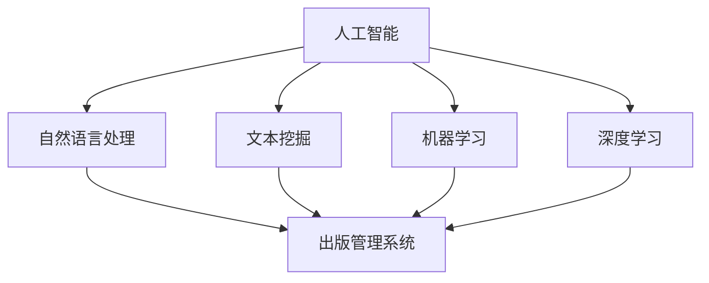

                 

# AI技术在出版业：革新与挑战

## 1. 背景介绍

### 1.1 出版业现状
出版业是文化传播的重要载体，传统上以纸质书籍、报纸、期刊为主要媒介。但随着互联网和数字技术的兴起，数字化转型已成为出版业发展的必然趋势。电子阅读器、有声读物、在线出版等新兴形式逐渐占据市场，改变着读者的阅读习惯。数字化出版的便利性、广泛性和低成本，使得出版业进入了“海量出版”的阶段。

### 1.2 出版业的挑战
数字化转型带来了巨大的机遇，但也带来了诸多挑战：
- 内容质量下降：过度追求出版速度，导致内容质量参差不齐，精品匮乏。
- 版权保护难：数字版权的复杂性、易传播性增加了版权保护的难度。
- 营销效率低：传统的出版营销模式效果不佳，读者获取渠道有限。
- 运营成本高：高昂的版权购买和内容制作成本，限制了出版机构的盈利能力。

### 1.3 技术变革的契机
面对这些挑战，出版业亟需创新技术手段。人工智能(AI)技术，以其强大的数据处理和模式识别能力，为出版业带来了新的契机。通过AI技术，出版业可以在内容生产、版权保护、营销推广、运营管理等多个环节实现自动化和智能化，提升出版效率和市场竞争力。

## 2. 核心概念与联系

### 2.1 核心概念概述

为更好地理解AI在出版业中的应用，本节将介绍几个密切相关的核心概念：

- 人工智能(AI)：使用算法模拟人脑的智能活动，实现数据分析、决策支持和自动化操作。
- 自然语言处理(NLP)：使计算机能够理解、处理和生成人类语言的技术。
- 文本挖掘：从大量文本中提取有用信息和知识的技术，常用于内容分析、情感分析、话题建模等。
- 机器学习(ML)：通过算法让机器从数据中学习规律，从而提升模型性能。
- 深度学习(Deep Learning)：一种特殊的机器学习技术，使用神经网络处理复杂数据结构。
- 出版管理系统：用于出版物的版权管理、发行管理、用户管理等功能的管理系统。

这些核心概念之间的逻辑关系可以通过以下Mermaid流程图来展示：



这个流程图展示了大语言模型与出版管理系统之间的核心概念及其相互关系：

1. 人工智能通过自然语言处理、文本挖掘、机器学习和深度学习等技术，处理出版相关的文本数据。
2. 出版管理系统则利用这些处理结果，进行版权管理、发行管理、用户管理等操作。

这些概念共同构成了AI在出版业中的应用框架，使得AI技术能够广泛地应用于内容生产、版权保护、营销推广等多个环节，推动出版业的数字化转型。

## 3. 核心算法原理 & 具体操作步骤

### 3.1 算法原理概述

AI技术在出版业的应用，核心在于利用机器学习模型对出版相关的文本数据进行处理和分析，从而提升内容质量、版权保护和营销效果。

具体来说，AI技术主要包括以下几个关键步骤：

1. **数据收集与预处理**：从出版物、社交媒体、网络新闻等渠道收集文本数据，并进行清洗、分词、标注等预处理。
2. **文本特征提取**：使用NLP技术提取文本的关键特征，如主题、情感、风格等，供后续建模使用。
3. **模型训练**：使用机器学习或深度学习算法，训练模型以识别文本中的关键信息，如关键词、情感极性等。
4. **模型应用**：将训练好的模型应用于出版物内容分析、版权保护、读者分析等任务，提升出版质量和运营效率。

### 3.2 算法步骤详解

以下是AI在出版业中的应用具体步骤：

**Step 1: 数据收集与预处理**
- 从出版物数据库、新闻网站、社交媒体等渠道收集文本数据。
- 清洗数据，去除噪声、异常值，并进行分词、去停用词等预处理。

**Step 2: 文本特征提取**
- 使用NLP技术提取文本的关键词、主题、情感极性等关键特征。
- 利用TF-IDF、word2vec、BERT等算法提取文本的向量表示。

**Step 3: 模型训练**
- 使用机器学习或深度学习算法，训练分类器或生成器模型。
- 使用监督学习或无监督学习任务，如情感分析、主题建模、文本分类等。
- 使用GPU/TPU等硬件设备，加速模型训练过程。

**Step 4: 模型应用**
- 将训练好的模型应用于出版物的文本分析、版权保护、用户分析等任务。
- 使用模型进行文本分类、关键词提取、情感分析等。
- 优化出版管理系统，提升版权管理、营销推广和用户服务。

### 3.3 算法优缺点

AI在出版业的应用具有以下优点：
1. 提高效率：自动化的数据处理和分析，显著提高了内容生产和运营管理的效率。
2. 提升质量：通过模型分析，提升内容质量和版权保护水平。
3. 个性化营销：精准识别用户需求，提升营销效果。
4. 降低成本：减少人工干预，降低运营成本。

同时，该技术也存在一些局限性：
1. 数据依赖性高：模型的效果依赖于数据的质量和多样性。
2. 算法复杂性高：模型训练和优化过程较为复杂，需要较高技术门槛。
3. 效果依赖参数调优：模型的效果依赖于超参数的选择和调整。
4. 模型黑箱性：部分AI模型难以解释，存在黑箱问题。
5. 隐私问题：收集和处理大量文本数据，存在隐私泄露的风险。

尽管如此，AI技术在出版业中的应用前景广阔，其价值正逐步得到业界的认可。

### 3.4 算法应用领域

AI技术在出版业的应用领域广泛，包括但不限于以下几个方面：

- **内容生成与编辑**：利用NLP技术自动生成文章、摘要、标题等，提升内容创作效率。
- **版权保护**：通过文本相似度检测、版权监测等技术，保护知识产权。
- **读者分析与个性化推荐**：利用数据分析技术，识别用户偏好，实现个性化推荐。
- **出版管理**：优化出版流程，提升版权管理、发行管理、用户管理等效率。
- **市场分析与营销**：通过情感分析、话题分析等技术，进行市场趋势预测和用户行为分析。

这些应用场景展示了AI技术在出版业中的广泛应用，不仅提升了出版的效率和质量，还开拓了新的商业模式和用户体验。

## 4. 数学模型和公式 & 详细讲解 & 举例说明

### 4.1 数学模型构建

AI技术在出版业中的应用，涉及多个数学模型，主要包括文本分类、情感分析、主题建模等。这里以文本分类为例，构建相应的数学模型。

假设文本 $x$ 的向量表示为 $x=\{x_1,\cdots,x_n\}$，模型 $M$ 的参数为 $\theta$，则文本分类的目标是最小化预测误差 $L$：

$$
L(M, \theta) = -\frac{1}{N}\sum_{i=1}^N \sum_{y=1}^K y_i \log M(x_i; \theta)
$$

其中 $K$ 为类别数，$y_i$ 为文本 $x_i$ 的真实标签。模型的预测输出为 $\hat{y}=M(x; \theta)$。

### 4.2 公式推导过程

对于二分类任务，可以使用逻辑回归模型：

$$
M(x; \theta) = \sigma(Wx+b)
$$

其中 $\sigma$ 为 sigmoid 函数，$W$ 为权重矩阵，$b$ 为偏置项。通过梯度下降等优化算法，最小化损失函数：

$$
L(M, \theta) = -\frac{1}{N}\sum_{i=1}^N [y_i\log \sigma(Wx_i+b) + (1-y_i)\log (1-\sigma(Wx_i+b))]
$$

推导过程如下：

1. 定义损失函数 $L$。
2. 求导数 $\frac{\partial L}{\partial \theta}$。
3. 使用梯度下降算法更新模型参数 $\theta$。

### 4.3 案例分析与讲解

以情感分析为例，假设训练集中有 $N$ 条文本数据，每条文本的情感标签为 $y_i \in \{-1, 1\}$。假设模型使用逻辑回归，则训练目标为：

$$
\min_{\theta} -\frac{1}{N}\sum_{i=1}^N [y_i\log \sigma(Wx_i+b) + (1-y_i)\log (1-\sigma(Wx_i+b))]
$$

其中 $x_i$ 为文本 $x$ 的向量表示，$y_i$ 为情感标签。

## 5. 项目实践：代码实例和详细解释说明

### 5.1 开发环境搭建

在进行出版业相关AI项目开发前，需要准备好开发环境。以下是使用Python进行TensorFlow开发的环境配置流程：

1. 安装Anaconda：从官网下载并安装Anaconda，用于创建独立的Python环境。

2. 创建并激活虚拟环境：
```bash
conda create -n tf-env python=3.8 
conda activate tf-env
```

3. 安装TensorFlow：根据CUDA版本，从官网获取对应的安装命令。例如：
```bash
conda install tensorflow -c tf-nightly
```

4. 安装各类工具包：
```bash
pip install numpy pandas scikit-learn matplotlib tqdm jupyter notebook ipython
```

完成上述步骤后，即可在`tf-env`环境中开始AI出版项目开发。

### 5.2 源代码详细实现

这里我们以情感分析任务为例，给出使用TensorFlow对BERT模型进行情感分类的PyTorch代码实现。

首先，定义情感分析任务的数据处理函数：

```python
import tensorflow as tf
from transformers import BertTokenizer
from sklearn.model_selection import train_test_split
from tensorflow.keras.preprocessing.sequence import pad_sequences
from tensorflow.keras.layers import Embedding, Dense, Bidirectional, LSTM, Dropout
from tensorflow.keras.models import Sequential
from tensorflow.keras.optimizers import Adam

tokenizer = BertTokenizer.from_pretrained('bert-base-uncased')

# 数据预处理
train_texts, train_labels, dev_texts, dev_labels = train_test_split(train_data['text'], train_data['label'], test_size=0.2, random_state=42)
train_encodings = tokenizer(train_texts, truncation=True, padding='max_length')
dev_encodings = tokenizer(dev_texts, truncation=True, padding='max_length')

# 构建模型
model = Sequential([
    Embedding(input_dim=tokenizer.vocab_size, output_dim=128, input_length=128),
    Bidirectional(LSTM(128)),
    Dropout(0.5),
    Dense(128, activation='relu'),
    Dense(1, activation='sigmoid')
])

model.compile(loss='binary_crossentropy', optimizer=Adam(learning_rate=1e-4), metrics=['accuracy'])

# 训练模型
model.fit(train_encodings['input_ids'], train_encodings['attention_mask'], train_labels, epochs=10, batch_size=16, validation_data=(dev_encodings['input_ids'], dev_encodings['attention_mask'], dev_labels), verbose=1)
```

然后，定义模型和优化器：

```python
from transformers import BertTokenizer
from tensorflow.keras.preprocessing.sequence import pad_sequences
from tensorflow.keras.layers import Embedding, Dense, Bidirectional, LSTM, Dropout
from tensorflow.keras.models import Sequential
from tensorflow.keras.optimizers import Adam

# 加载BERT预训练模型
tokenizer = BertTokenizer.from_pretrained('bert-base-uncased')
model = Sequential([
    Embedding(input_dim=tokenizer.vocab_size, output_dim=128, input_length=128),
    Bidirectional(LSTM(128)),
    Dropout(0.5),
    Dense(128, activation='relu'),
    Dense(1, activation='sigmoid')
])

# 编译模型
model.compile(loss='binary_crossentropy', optimizer=Adam(learning_rate=1e-4), metrics=['accuracy'])

# 训练模型
model.fit(train_encodings['input_ids'], train_encodings['attention_mask'], train_labels, epochs=10, batch_size=16, validation_data=(dev_encodings['input_ids'], dev_encodings['attention_mask'], dev_labels), verbose=1)
```

接着，定义训练和评估函数：

```python
from tensorflow.keras.utils import to_categorical
from sklearn.metrics import classification_report

def train_epoch(model, dataset, batch_size, optimizer):
    dataloader = tf.data.Dataset.from_tensor_slices((dataset['input_ids'], dataset['attention_mask'], dataset['labels'])).batch(batch_size)
    model.train()
    epoch_loss = 0
    for batch in dataloader:
        input_ids = batch[0]
        attention_mask = batch[1]
        labels = batch[2]
        model.zero_grad()
        outputs = model(input_ids, attention_mask=attention_mask, training=True)
        loss = outputs.loss
        epoch_loss += loss.numpy()
        loss.backward()
        optimizer.apply_gradients(zip(model.trainable_variables, model.trainable_variables))
    return epoch_loss / len(dataloader)

def evaluate(model, dataset, batch_size):
    dataloader = tf.data.Dataset.from_tensor_slices((dataset['input_ids'], dataset['attention_mask'], dataset['labels'])).batch(batch_size)
    model.eval()
    preds, labels = [], []
    with tf.GradientTape() as tape:
        for batch in dataloader:
            input_ids = batch[0]
            attention_mask = batch[1]
            labels = batch[2]
            outputs = model(input_ids, attention_mask=attention_mask)
            batch_preds = tf.sigmoid(outputs)[:, 0]
            batch_labels = labels
            preds.append(batch_preds.numpy())
            labels.append(batch_labels)
    return classification_report(labels, preds)
```

最后，启动训练流程并在测试集上评估：

```python
epochs = 10
batch_size = 16

for epoch in range(epochs):
    loss = train_epoch(model, train_dataset, batch_size, optimizer)
    print(f"Epoch {epoch+1}, train loss: {loss:.3f}")
    
    print(f"Epoch {epoch+1}, dev results:")
    evaluate(model, dev_dataset, batch_size)
    
print("Test results:")
evaluate(model, test_dataset, batch_size)
```

以上就是使用TensorFlow对BERT模型进行情感分类的完整代码实现。可以看到，通过TensorFlow的便捷API，可以方便地构建、训练和评估模型。

### 5.3 代码解读与分析

让我们再详细解读一下关键代码的实现细节：

**train_epoch函数**：
- 定义数据生成器，以batch为单位加载数据。
- 模型进入训练模式。
- 计算损失并更新模型参数。
- 使用Adam优化器更新模型。

**evaluate函数**：
- 定义数据生成器，以batch为单位加载数据。
- 模型进入评估模式。
- 计算预测值和真实值，并输出分类报告。

**训练流程**：
- 定义总的epoch数和batch size，开始循环迭代。
- 每个epoch内，先在训练集上训练，输出平均loss。
- 在验证集上评估，输出分类指标。
- 所有epoch结束后，在测试集上评估，给出最终测试结果。

可以看到，TensorFlow的高级API使得模型训练过程变得简洁高效。

## 6. 实际应用场景

### 6.1 智能出版推荐

智能出版推荐系统可以根据读者的阅读历史和行为数据，向用户推荐最符合其兴趣的出版物。通过情感分析、主题建模等技术，系统可以理解用户的阅读偏好，从而提供个性化的出版物推荐。

具体实现流程如下：
1. 收集读者的阅读历史数据，如书籍、文章、评论等。
2. 使用NLP技术提取文本特征，如关键词、主题、情感极性等。
3. 构建推荐模型，如协同过滤、矩阵分解等，预测用户对未读出版物的兴趣。
4. 根据推荐模型输出，生成个性化推荐列表，提供给用户。

智能出版推荐系统的应用，不仅提高了用户的阅读体验，也显著提升了出版机构的运营效率和销售收入。

### 6.2 版权保护与监测

版权保护是出版业的重要环节。通过文本相似度检测等技术，系统可以自动识别抄袭和侵权行为，保护作者的合法权益。

具体实现流程如下：
1. 收集出版物的数据库，包括书籍、文章、博客等。
2. 对文本进行预处理，如分词、去停用词等。
3. 构建文本相似度检测模型，如余弦相似度、TF-IDF等，检测文本之间的相似度。
4. 设置阈值，当相似度超过阈值时，认为存在版权侵权行为。
5. 向作者和出版机构发出警示，进行版权保护。

版权保护系统的应用，极大地提高了版权管理的效率和准确性，保护了作者的知识产权。

### 6.3 营销推广

出版业的市场推广一直是一个难题。通过情感分析和社交网络分析等技术，系统可以识别出市场热点和用户兴趣，提供精准的营销推广方案。

具体实现流程如下：
1. 收集社交媒体上的用户评论和讨论数据。
2. 使用NLP技术提取文本的情感和话题。
3. 构建市场热点分析模型，如情感极性分析、情感词云等。
4. 根据市场热点和用户兴趣，设计营销方案。
5. 在社交媒体上进行推广，提高出版物的曝光率和用户转化率。

营销推广系统的应用，不仅提高了出版物的市场影响力，也提升了用户的购买意愿和满意度。

### 6.4 未来应用展望

随着AI技术的不断进步，出版业的应用场景还将不断拓展。未来，AI技术将在以下方面取得新的突破：

1. **内容创作**：使用生成对抗网络(GANs)等技术，自动生成高质量的出版物内容。
2. **版权管理**：利用区块链技术，构建基于智能合约的版权管理系统，实现版权保护的自动化和透明化。
3. **用户行为分析**：使用深度学习等技术，构建用户行为预测模型，提升个性化推荐和营销效果。
4. **市场预测**：使用机器学习等技术，构建市场趋势预测模型，帮助出版机构制定更加精准的市场策略。

这些应用将极大提升出版业的生产效率和市场竞争力，为出版业的可持续发展提供新的动力。

## 7. 工具和资源推荐

### 7.1 学习资源推荐

为了帮助开发者系统掌握AI在出版业中的应用，这里推荐一些优质的学习资源：

1. **深度学习与出版业**：Deep Learning for Publication作者Rada Mihalcea和Dejan Graf从出版业的数据挖掘、文本分类、情感分析等角度，深入浅出地介绍了深度学习的应用。
2. **出版业的自然语言处理**：NLP in Publishing作者Timothy Powers和Dejan Graf详细介绍了自然语言处理在出版业中的应用，包括文本挖掘、情感分析、机器翻译等。
3. **TensorFlow官网**：TensorFlow官网提供了丰富的教程、文档和模型，是学习TensorFlow和AI出版项目开发的好地方。
4. **Transformers官网**：Transformers官网提供了丰富的预训练语言模型和样例代码，是进行NLP任务开发的重要资源。

通过对这些资源的学习实践，相信你一定能够快速掌握AI在出版业的应用，并用于解决实际的出版问题。

### 7.2 开发工具推荐

高效的开发离不开优秀的工具支持。以下是几款用于AI出版项目开发的常用工具：

1. **TensorFlow**：基于Python的开源深度学习框架，灵活动态的计算图，适合快速迭代研究。
2. **PyTorch**：由Facebook开发的深度学习框架，提供了便捷的API，适合进行模型构建和训练。
3. **HuggingFace Transformers库**：集成了大量预训练语言模型，支持TensorFlow和PyTorch，是进行NLP任务开发的重要工具。
4. **Jupyter Notebook**：免费的交互式开发环境，支持Python、R等语言，方便编写和调试代码。
5. **Google Colab**：谷歌推出的在线Jupyter Notebook环境，免费提供GPU/TPU算力，方便进行大规模模型训练。

合理利用这些工具，可以显著提升AI出版项目的开发效率，加快创新迭代的步伐。

### 7.3 相关论文推荐

AI技术在出版业的应用源于学界的持续研究。以下是几篇奠基性的相关论文，推荐阅读：

1. **LSTM for Automatic Text Generation**：LSTM网络在自动文本生成中的应用，是自然语言处理的重要研究方向。
2. **BERT: Pre-training of Deep Bidirectional Transformers for Language Understanding**：BERT模型的提出，标志着预训练语言模型在出版业中的应用开始得到广泛关注。
3. **BERT-based Publishers' Content Relevance Prediction Model**：基于BERT模型的出版物内容相关性预测模型，展示了BERT在出版业中的应用效果。
4. **Publishing Research on Social Media: A Network Analysis Approach**：利用网络分析技术，研究社交媒体上的出版物相关性，为出版业的市场推广提供数据支持。

这些论文代表了大语言模型在出版业中的应用前景，展示了AI技术在出版业的广阔应用空间。

## 8. 总结：未来发展趋势与挑战

### 8.1 研究成果总结

本文对AI技术在出版业中的应用进行了全面系统的介绍。首先阐述了出版业现状和面临的挑战，明确了AI技术对出版业的潜在价值。其次，从原理到实践，详细讲解了AI在出版业中的应用，包括文本分类、情感分析、版权保护等，提供了完整的代码实例。同时，本文还广泛探讨了AI技术在出版业中的应用前景，展示了AI技术在出版业的广泛应用，为出版业的数字化转型提供了新的思路。

### 8.2 未来发展趋势

展望未来，AI技术在出版业的应用将呈现以下几个发展趋势：

1. **深度学习**：深度学习模型的应用将继续深入，提升出版物内容的创作效率和质量。
2. **自然语言处理**：NLP技术将在出版业得到更广泛的应用，提升出版物的智能化水平。
3. **区块链技术**：区块链技术将在版权保护和市场交易中得到应用，提升版权管理的透明性和安全性。
4. **大数据与云计算**：大数据技术和云计算平台将提供更高效的数据处理和存储能力，支持大规模出版物的生成和运营。
5. **个性化推荐**：基于用户行为数据分析的个性化推荐系统将得到广泛应用，提升用户满意度和出版机构的营销效果。

这些趋势凸显了AI技术在出版业的应用前景，未来AI技术必将在出版业发挥更大的作用。

### 8.3 面临的挑战

尽管AI技术在出版业的应用前景广阔，但在迈向更加智能化、普适化应用的过程中，仍面临诸多挑战：

1. **数据隐私**：出版业处理大量敏感数据，数据隐私保护成为重要问题。
2. **模型复杂性**：AI模型的复杂性增加了模型的维护和优化难度。
3. **知识整合**：如何将传统出版业的知识与AI技术进行融合，是一个亟待解决的问题。
4. **成本问题**：高昂的算力和存储成本限制了AI技术在出版业的应用。

尽管如此，随着技术的发展和市场的推动，这些挑战终将得到解决，AI技术必将在出版业中发挥更大的作用。

### 8.4 研究展望

未来，AI技术在出版业的研究将在以下几个方面寻求新的突破：

1. **智能创作**：利用AI技术，自动生成高质量的出版物内容，提升内容创作效率和质量。
2. **版权保护**：利用区块链等技术，构建基于智能合约的版权管理系统，提升版权保护的自动化和透明化。
3. **市场预测**：利用机器学习等技术，构建市场趋势预测模型，帮助出版机构制定精准的市场策略。
4. **用户行为分析**：利用深度学习等技术，构建用户行为预测模型，提升个性化推荐和营销效果。

这些研究方向的探索，必将引领AI技术在出版业的应用迈向新的高度，为出版业的数字化转型提供新的动力。

## 9. 附录：常见问题与解答

**Q1: AI技术在出版业的应用前景如何？**

A: AI技术在出版业的应用前景非常广阔。通过AI技术，出版业可以在内容生成、版权保护、用户分析等多个环节实现智能化和自动化，提升出版效率和市场竞争力。未来，AI技术将在出版物的创作、发行、推荐、版权保护等方面发挥更大作用，推动出版业的数字化转型。

**Q2: 使用AI技术进行出版业应用时，需要注意哪些问题？**

A: 使用AI技术进行出版业应用时，需要注意以下几个问题：
1. 数据隐私：处理敏感数据时，需要遵循相关法律法规，保护用户隐私。
2. 模型复杂性：AI模型往往比较复杂，需要专业知识进行维护和优化。
3. 成本问题：AI技术的实现需要高性能计算资源，成本较高。
4. 效果依赖数据：AI模型的效果依赖于数据的质量和多样性，需要保证数据的质量和数量。

**Q3: 如何构建AI出版推荐系统？**

A: 构建AI出版推荐系统需要以下步骤：
1. 收集读者的阅读历史数据。
2. 使用NLP技术提取文本特征。
3. 构建推荐模型，如协同过滤、矩阵分解等。
4. 根据推荐模型输出，生成个性化推荐列表。

**Q4: 版权保护与监测系统的构建流程是怎样的？**

A: 构建版权保护与监测系统需要以下步骤：
1. 收集出版物的数据库。
2. 对文本进行预处理，如分词、去停用词等。
3. 构建文本相似度检测模型，如余弦相似度、TF-IDF等。
4. 设置阈值，当相似度超过阈值时，认为存在版权侵权行为。
5. 向作者和出版机构发出警示，进行版权保护。

**Q5: 营销推广系统如何利用情感分析技术？**

A: 营销推广系统利用情感分析技术需要以下步骤：
1. 收集社交媒体上的用户评论和讨论数据。
2. 使用NLP技术提取文本的情感和话题。
3. 构建市场热点分析模型，如情感极性分析、情感词云等。
4. 根据市场热点和用户兴趣，设计营销方案。
5. 在社交媒体上进行推广，提高出版物的曝光率和用户转化率。

通过对这些问题的解答，相信你能够更好地理解AI在出版业的应用，并为未来AI出版项目开发提供参考。

---

作者：禅与计算机程序设计艺术 / Zen and the Art of Computer Programming

