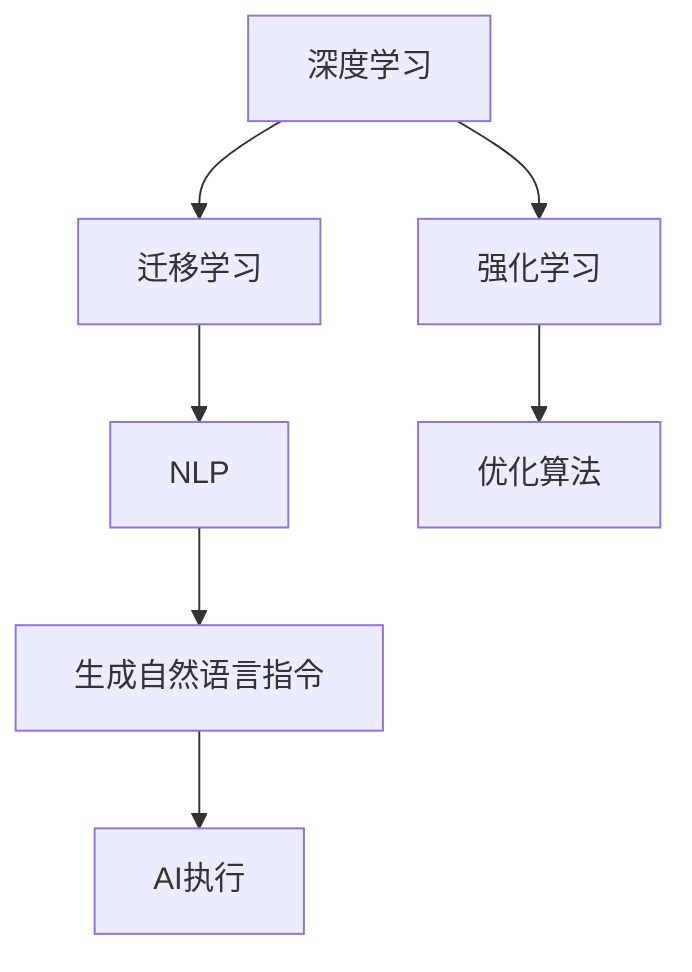

                 

# AI技术趋势与应用场景的结合

## 1. 背景介绍

### 1.1 问题由来

人工智能(AI)技术的迅猛发展，正在深刻改变着各行各业的运行方式。无论是制造业、金融业、医疗健康，还是零售、教育、娱乐，AI技术无处不在。而AI技术的广泛应用，也使得研究者、开发者和企业不断探讨其发展趋势和应用潜力。

本文将聚焦于AI技术的前沿趋势，分析其在不同应用场景中的结合模式。具体来说，我们将以深度学习、强化学习、迁移学习、自然语言处理(NLP)等关键技术为核心，探讨其在医疗、智能制造、智能城市、金融、教育等领域的具体应用，并剖析其中的技术挑战与解决思路。

## 2. 核心概念与联系

### 2.1 核心概念概述

在深入讨论AI技术的应用之前，我们首先需要了解几个核心概念：

- **深度学习(Deep Learning)**：一种基于神经网络的机器学习方法，能够自动从数据中提取特征并进行分类、回归、生成等任务。
- **强化学习(Reinforcement Learning)**：一种通过奖励机制进行自我优化的机器学习方法，广泛应用于自动驾驶、机器人控制、游戏AI等领域。
- **迁移学习(Transfer Learning)**：一种将知识从一个任务转移到另一个任务上的学习方法，可以大大提高模型的泛化能力。
- **自然语言处理(NLP)**：一种处理和理解人类语言的技术，广泛应用于机器翻译、语音识别、情感分析、文本生成等任务。

这些核心概念之间存在着紧密的联系和相互作用。例如，深度学习是迁移学习的基础，通过在大规模数据上进行预训练，迁移学习可以高效地应用于新任务中。同时，NLP技术常借助深度学习实现，并在强化学习中发挥关键作用，如生成自然语言指令供AI执行。

### 2.2 核心概念原理和架构的 Mermaid 流程图



## 3. 核心算法原理 & 具体操作步骤

### 3.1 算法原理概述

**深度学习**：深度学习通过多层次的非线性神经网络，从数据中自动提取特征，实现复杂的模式识别和分类任务。深度学习模型包括卷积神经网络(CNN)、循环神经网络(RNN)和Transformer等。

**强化学习**：强化学习通过与环境的交互，通过奖励机制不断调整模型策略，以实现最优化目标。主要分为值函数型(RL)和策略梯度型(RL)两类。

**迁移学习**：迁移学习通过在大规模数据上进行预训练，提取通用的特征表示，然后将这些特征应用于新的任务中，以提高模型性能和泛化能力。

**自然语言处理**：NLP技术通过语言模型、序列模型、词向量等方法，实现对自然语言的理解与生成。主要应用包括机器翻译、情感分析、问答系统等。

### 3.2 算法步骤详解

#### 3.2.1 深度学习

**数据预处理**：收集数据并清洗、归一化，如分词、去除停用词等。

**模型构建**：选择合适的深度学习模型架构，如CNN、RNN或Transformer，并设置超参数。

**模型训练**：使用反向传播算法和优化器，如SGD、Adam等，最小化损失函数，更新模型参数。

**模型评估**：在验证集上评估模型性能，选择最优模型。

**模型部署**：将训练好的模型部署到实际应用环境中，进行推理预测。

#### 3.2.2 强化学习

**环境设计**：设计或获取模拟或真实环境，定义状态空间、动作空间和奖励函数。

**模型选择**：选择合适的强化学习算法，如Q-learning、SARSA、DQN等。

**策略更新**：通过模型与环境的交互，根据奖励信号更新模型策略。

**策略评估**：在测试集上评估模型性能，选择最优策略。

**策略部署**：将训练好的模型应用于实际环境中，进行策略执行和优化。

#### 3.2.3 迁移学习

**数据预处理**：收集数据并清洗、归一化。

**预训练**：在大规模数据集上进行预训练，提取特征表示。

**微调**：在特定任务上对预训练模型进行微调，更新部分模型参数。

**模型评估**：在测试集上评估模型性能，选择最优模型。

**模型部署**：将训练好的模型部署到实际应用环境中，进行推理预测。

#### 3.2.4 自然语言处理

**数据预处理**：收集数据并清洗、归一化，如分词、去除停用词等。

**模型构建**：选择合适的NLP模型架构，如LSTM、GRU或Transformer，并设置超参数。

**模型训练**：使用反向传播算法和优化器，如SGD、Adam等，最小化损失函数，更新模型参数。

**模型评估**：在验证集上评估模型性能，选择最优模型。

**模型部署**：将训练好的模型部署到实际应用环境中，进行推理预测。

### 3.3 算法优缺点

**深度学习**

**优点**：
- 自动化特征提取：能够自动从数据中提取高层次特征，适合处理复杂数据。
- 性能优越：在大规模数据上训练的模型往往具有较高的准确率。

**缺点**：
- 数据需求高：需要大量标注数据，标注成本高。
- 模型复杂：需要大量计算资源，训练时间较长。

**强化学习**

**优点**：
- 自适应性强：能够通过与环境的交互不断优化策略。
- 应用广泛：适合处理复杂的决策问题，如自动驾驶、游戏AI等。

**缺点**：
- 数据需求低：通常不需要标注数据，但需要大量的试错过程。
- 策略复杂：难以保证收敛性和稳定性。

**迁移学习**

**优点**：
- 泛化能力强：通过预训练提取通用特征，提高模型在新任务上的表现。
- 数据需求低：需要较少标注数据，提高训练效率。

**缺点**：
- 通用性不足：预训练模型可能不适用于某些特定任务。
- 微调复杂：微调过程需要调整模型参数，可能引入过拟合问题。

**自然语言处理**

**优点**：
- 处理能力强：能够处理大规模文本数据，提取语义信息。
- 应用广泛：广泛应用于机器翻译、情感分析、问答系统等。

**缺点**：
- 数据需求高：需要大量文本数据，标注成本高。
- 模型复杂：深度神经网络结构复杂，训练时间较长。

### 3.4 算法应用领域

**深度学习**

- **计算机视觉**：如图像分类、目标检测、人脸识别等。
- **语音识别**：如语音转文本、情感分析、语音合成等。
- **自然语言处理**：如情感分析、机器翻译、问答系统等。
- **医疗健康**：如医学影像分析、疾病预测、个性化医疗等。

**强化学习**

- **自动驾驶**：如智能决策、路径规划、交通信号控制等。
- **机器人控制**：如路径规划、动作生成、交互学习等。
- **游戏AI**：如策略学习、智能博弈等。

**迁移学习**

- **自然语言处理**：如文本分类、情感分析、机器翻译等。
- **计算机视觉**：如图像分类、目标检测、人脸识别等。
- **医疗健康**：如疾病诊断、药物推荐、个性化治疗等。

**自然语言处理**

- **机器翻译**：如英文到中文、中文到英文等。
- **情感分析**：如文本情感分类、情感极性分析等。
- **问答系统**：如智能客服、对话机器人等。

## 4. 数学模型和公式 & 详细讲解 & 举例说明

### 4.1 数学模型构建

**深度学习**

- **卷积神经网络(CNN)**：$y = f(W*x + b)$，其中$W$为卷积核权重，$x$为输入图像，$b$为偏置项，$f$为激活函数。
- **循环神经网络(RNN)**：$y_t = f(W_h*x_t + U_h*h_{t-1} + b_h)$，其中$h_t$为隐藏状态，$W_h$为权重矩阵，$x_t$为输入序列，$b_h$为偏置项。

**强化学习**

- **Q-learning**：$Q(s_t, a_t) = Q(s_t, a_t) + \alpha * (r_t + \gamma * max Q(s_{t+1}, a_{t+1}) - Q(s_t, a_t))$，其中$\alpha$为学习率，$\gamma$为折扣因子，$Q(s_t, a_t)$为状态-动作值函数。

**迁移学习**

- **预训练**：在大型数据集$D$上预训练模型$M$，提取特征表示$F$。
- **微调**：在特定任务$T$上，微调$M$，更新部分参数，得到新模型$M'$。

**自然语言处理**

- **Transformer**：$y = S(S^{-1}QKV)^TW_0 + b$，其中$S$为softmax函数，$Q$、$K$、$V$为多头注意力机制，$W_0$为线性变换权重。

### 4.2 公式推导过程

**深度学习**

- **卷积神经网络(CNN)**：通过卷积操作提取特征，通过池化操作减小特征尺寸，通过全连接层进行分类或回归。

**强化学习**

- **Q-learning**：通过奖励信号更新状态-动作值函数，实现策略优化。

**迁移学习**

- **预训练**：通过在大型数据集上训练模型，提取特征表示。
- **微调**：通过特定任务上的微调，更新部分参数，提高模型性能。

**自然语言处理**

- **Transformer**：通过多头注意力机制捕捉输入序列的语义关系，通过线性变换生成输出序列。

### 4.3 案例分析与讲解

**案例1：深度学习在计算机视觉中的应用**

- **数据预处理**：收集并清洗图像数据，进行归一化处理。
- **模型构建**：选择卷积神经网络模型，设置超参数。
- **模型训练**：在训练集上训练模型，使用反向传播算法和优化器。
- **模型评估**：在验证集上评估模型性能，选择最优模型。
- **模型部署**：将训练好的模型部署到实际应用环境中，进行推理预测。

**案例2：强化学习在自动驾驶中的应用**

- **环境设计**：设计或获取模拟或真实环境，定义状态空间、动作空间和奖励函数。
- **模型选择**：选择合适的强化学习算法，如DQN。
- **策略更新**：通过模型与环境的交互，根据奖励信号更新模型策略。
- **策略评估**：在测试集上评估模型性能，选择最优策略。
- **策略部署**：将训练好的模型应用于实际环境中，进行策略执行和优化。

**案例3：迁移学习在自然语言处理中的应用**

- **数据预处理**：收集并清洗文本数据，进行归一化处理。
- **预训练**：在大规模数据集上进行预训练，提取特征表示。
- **微调**：在特定任务上对预训练模型进行微调，更新部分参数。
- **模型评估**：在测试集上评估模型性能，选择最优模型。
- **模型部署**：将训练好的模型部署到实际应用环境中，进行推理预测。

## 5. 项目实践：代码实例和详细解释说明

### 5.1 开发环境搭建

在进行AI技术的应用实践前，我们需要准备好开发环境。以下是使用Python进行TensorFlow开发的常见环境配置流程：

1. 安装Anaconda：从官网下载并安装Anaconda，用于创建独立的Python环境。

2. 创建并激活虚拟环境：
```bash
conda create -n tensorflow-env python=3.8 
conda activate tensorflow-env
```

3. 安装TensorFlow：
```bash
pip install tensorflow
```

4. 安装各类工具包：
```bash
pip install numpy pandas scikit-learn matplotlib tqdm jupyter notebook ipython
```

完成上述步骤后，即可在`tensorflow-env`环境中开始AI技术的项目实践。

### 5.2 源代码详细实现

这里我们以深度学习在图像分类任务中的应用为例，给出使用TensorFlow进行代码实现。

首先，导入必要的库：

```python
import tensorflow as tf
from tensorflow.keras import layers
import numpy as np
import matplotlib.pyplot as plt

# 设置随机种子
np.random.seed(42)
tf.random.set_seed(42)
```

接着，定义数据集和模型：

```python
# 定义数据集
(x_train, y_train), (x_test, y_test) = tf.keras.datasets.mnist.load_data()

# 将像素值归一化到[0, 1]
x_train = x_train.astype(np.float32) / 255
x_test = x_test.astype(np.float32) / 255

# 将标签转化为one-hot编码
y_train = tf.keras.utils.to_categorical(y_train, num_classes=10)
y_test = tf.keras.utils.to_categorical(y_test, num_classes=10)

# 定义模型
model = tf.keras.Sequential([
    layers.Flatten(input_shape=(28, 28)),
    layers.Dense(128, activation='relu'),
    layers.Dense(10, activation='softmax')
])
```

然后，训练模型：

```python
# 定义优化器和损失函数
optimizer = tf.keras.optimizers.Adam(learning_rate=0.001)
loss_fn = tf.keras.losses.CategoricalCrossentropy()

# 训练模型
model.compile(optimizer=optimizer, loss=loss_fn, metrics=['accuracy'])
model.fit(x_train, y_train, epochs=10, validation_data=(x_test, y_test))
```

最后，评估模型：

```python
# 评估模型
test_loss, test_acc = model.evaluate(x_test, y_test)
print('Test Loss:', test_loss)
print('Test Accuracy:', test_acc)
```

以上就是使用TensorFlow进行深度学习在图像分类任务中的应用实践。可以看到，通过简单的代码，就可以实现从数据预处理到模型训练和评估的全过程。

### 5.3 代码解读与分析

让我们再详细解读一下关键代码的实现细节：

**数据预处理**：
- 导入必要的库，并设置随机种子，确保结果可复现。
- 加载MNIST数据集，并将像素值归一化到[0, 1]。
- 将标签转化为one-hot编码，方便模型训练。

**模型构建**：
- 定义一个序列模型，包括一个Flatten层、一个Dense层和一个输出层。

**模型训练**：
- 定义优化器和损失函数。
- 使用`compile`方法编译模型，指定优化器、损失函数和评估指标。
- 使用`fit`方法训练模型，指定训练集、验证集和训练轮数。

**模型评估**：
- 使用`evaluate`方法评估模型，输出测试集上的损失和准确率。

## 6. 实际应用场景

### 6.1 医疗健康

AI技术在医疗健康领域有着广泛的应用，包括疾病诊断、药物研发、个性化治疗等。例如，通过深度学习模型对医学影像进行分类和识别，可以辅助医生诊断复杂疾病；通过强化学习算法优化治疗方案，可以实现更加个性化的医疗服务。

**案例**：深度学习在医学影像分类中的应用

- **数据预处理**：收集并清洗医学影像数据，进行归一化处理。
- **模型构建**：选择卷积神经网络模型，设置超参数。
- **模型训练**：在训练集上训练模型，使用反向传播算法和优化器。
- **模型评估**：在验证集上评估模型性能，选择最优模型。
- **模型部署**：将训练好的模型部署到医疗系统中，进行医学影像分类和识别。

### 6.2 智能制造

AI技术在智能制造领域的应用包括生产流程优化、质量控制、设备预测性维护等。例如，通过强化学习算法优化生产流程，可以实现更加智能化的制造；通过自然语言处理技术实现设备状态监控和预测性维护，可以降低设备故障率，提高生产效率。

**案例**：强化学习在生产流程优化中的应用

- **环境设计**：设计或获取生产流程的模拟环境，定义状态空间、动作空间和奖励函数。
- **模型选择**：选择合适的强化学习算法，如DQN。
- **策略更新**：通过模型与环境的交互，根据奖励信号更新模型策略。
- **策略评估**：在测试集上评估模型性能，选择最优策略。
- **策略部署**：将训练好的模型应用于实际生产环境中，进行生产流程优化。

### 6.3 智能城市

AI技术在智能城市中的应用包括交通管理、环境监测、公共安全等。例如，通过深度学习模型进行交通流量预测，可以实现智能交通管理；通过自然语言处理技术进行舆情监测，可以及时响应突发事件。

**案例**：深度学习在交通流量预测中的应用

- **数据预处理**：收集并清洗交通流量数据，进行归一化处理。
- **模型构建**：选择卷积神经网络模型，设置超参数。
- **模型训练**：在训练集上训练模型，使用反向传播算法和优化器。
- **模型评估**：在验证集上评估模型性能，选择最优模型。
- **模型部署**：将训练好的模型部署到交通管理系统中，进行交通流量预测。

### 6.4 金融

AI技术在金融领域的应用包括风险评估、欺诈检测、投资分析等。例如，通过深度学习模型进行信用评分和风险评估，可以降低金融风险；通过强化学习算法进行投资策略优化，可以实现更加智能化的投资决策。

**案例**：深度学习在信用评分中的应用

- **数据预处理**：收集并清洗金融数据，进行归一化处理。
- **模型构建**：选择卷积神经网络模型，设置超参数。
- **模型训练**：在训练集上训练模型，使用反向传播算法和优化器。
- **模型评估**：在验证集上评估模型性能，选择最优模型。
- **模型部署**：将训练好的模型部署到金融系统中，进行信用评分和风险评估。

## 7. 工具和资源推荐

### 7.1 学习资源推荐

为了帮助开发者系统掌握AI技术的基础理论和应用实践，这里推荐一些优质的学习资源：

1. 《深度学习》（Ian Goodfellow等著）：全面介绍深度学习的理论和算法，适合初学者和进阶者阅读。
2. 《强化学习：一种现代方法》（Richard S. Sutton等著）：介绍强化学习的理论基础和算法实现，适合对强化学习感兴趣的学习者。
3. 《自然语言处理综论》（Daniel Jurafsky等著）：介绍自然语言处理的基本概念和技术，适合NLP领域的学习者。
4. Coursera《深度学习专项课程》：斯坦福大学开设的深度学习课程，涵盖深度学习的基础理论和实践技能。
5. Udacity《人工智能》课程：介绍AI技术的核心概念和应用案例，适合初学者和进阶者学习。

通过对这些资源的学习实践，相信你一定能够快速掌握AI技术的基础知识和应用技能，为进一步开发实际应用打下坚实的基础。

### 7.2 开发工具推荐

高效的开发离不开优秀的工具支持。以下是几款用于AI技术开发的常用工具：

1. TensorFlow：由Google主导开发的深度学习框架，支持大规模模型训练和部署。
2. PyTorch：由Facebook开发的开源深度学习框架，灵活的动态图机制，适合快速迭代研究。
3. Keras：基于TensorFlow和Theano的高层次API，提供简单易用的API接口，适合快速构建模型。
4. Weights & Biases：模型训练的实验跟踪工具，可以记录和可视化模型训练过程中的各项指标，方便对比和调优。
5. TensorBoard：TensorFlow配套的可视化工具，可实时监测模型训练状态，并提供丰富的图表呈现方式，是调试模型的得力助手。

合理利用这些工具，可以显著提升AI技术的开发效率，加快创新迭代的步伐。

### 7.3 相关论文推荐

AI技术的发展离不开学界的持续研究。以下是几篇奠基性的相关论文，推荐阅读：

1. AlexNet: ImageNet Classification with Deep Convolutional Neural Networks：提出卷积神经网络，开启深度学习时代。
2. DQN: Deep Q-Learning with Convolutional Neural Networks：提出深度强化学习算法DQN，应用于自动驾驶等领域。
3. GAN: Generative Adversarial Networks：提出生成对抗网络，实现数据增强和生成新样本。
4. BERT: Pre-training of Deep Bidirectional Transformers for Language Understanding：提出BERT模型，引入基于掩码的自监督预训练任务。
5. AlphaGo Zero: Mastering the Game of Go without Human Knowledge：提出AlphaGo Zero，通过强化学习实现高水平围棋AI。

这些论文代表了大规模AI技术的发展脉络。通过学习这些前沿成果，可以帮助研究者把握学科前进方向，激发更多的创新灵感。

## 8. 总结：未来发展趋势与挑战

### 8.1 研究成果总结

本文对AI技术的前沿趋势及其在多个应用场景中的应用进行了全面系统的介绍。我们探讨了深度学习、强化学习、迁移学习、自然语言处理等核心技术的基本原理和操作步骤，并通过具体案例分析，展示了其在计算机视觉、智能制造、智能城市、金融等领域的应用实践。

通过本文的系统梳理，可以看到，AI技术在各个应用场景中都有广泛的应用前景，能够显著提升行业效率和用户体验。AI技术的发展不仅依赖于技术的进步，还需要在工程实践中不断优化和迭代，以实现更加高效、稳定、智能的解决方案。

### 8.2 未来发展趋势

展望未来，AI技术的发展趋势将呈现以下几个方向：

1. **深度学习**：深度神经网络模型将不断优化，模型的复杂度和性能将进一步提升。同时，模型压缩、优化加速等技术也将不断发展，以应对计算资源的限制。
2. **强化学习**：强化学习算法将更加高效和稳定，适应更加复杂的环境和任务。同时，模型与环境的交互方式也将更加多样和灵活。
3. **迁移学习**：迁移学习技术将更加灵活和广泛应用，特别是在跨领域、跨模态的任务上。同时，如何提升迁移学习的泛化能力和鲁棒性也将成为重要的研究方向。
4. **自然语言处理**：NLP技术将更加智能化和人性化，能够更好地理解语义、生成自然语言。同时，多模态NLP技术也将不断涌现，实现视觉、语音、文本等多种信息的融合。

这些趋势表明，AI技术将不断发展和创新，为各行各业带来更加智能、高效、可靠的解决方案。

### 8.3 面临的挑战

尽管AI技术取得了巨大的进步，但在其实际应用中，仍面临着诸多挑战：

1. **数据需求高**：大多数AI技术需要大量的标注数据，获取高质量数据的成本较高。同时，数据的隐私保护和安全性也是重要的研究方向。
2. **模型复杂**：深度学习模型和强化学习模型通常结构复杂，训练和推理耗时较长。如何优化模型结构和算法，提高计算效率，是一个重要的研究课题。
3. **可解释性差**：AI模型的决策过程往往难以解释，特别是在医疗、金融等高风险领域，模型的可解释性和可审计性尤为重要。
4. **伦理和安全问题**：AI模型可能学习到有偏见、有害的信息，如何从数据和算法层面消除模型偏见，避免恶意用途，确保输出的安全性，将是重要的研究课题。

### 8.4 研究展望

面对AI技术面临的诸多挑战，未来的研究需要在以下几个方面寻求新的突破：

1. **数据增强和生成**：通过数据增强、生成对抗网络等技术，提高数据质量，降低标注成本。同时，探索无监督学习和半监督学习等方法，减少对标注数据的依赖。
2. **模型压缩和加速**：通过模型剪枝、量化、蒸馏等技术，优化模型结构，提高计算效率。同时，探索更高效的学习算法和优化方法，提高训练和推理速度。
3. **可解释性**：通过因果分析、可视化等方法，增强AI模型的可解释性，提高模型决策的透明性和可信度。
4. **伦理和安全**：引入伦理导向的评估指标，过滤和惩罚有偏见、有害的输出倾向。加强人工干预和审核，建立模型行为的监管机制，确保输出符合人类价值观和伦理道德。

这些研究方向的探索，必将引领AI技术迈向更高的台阶，为构建安全、可靠、可解释、可控的智能系统铺平道路。面向未来，AI技术还需要与其他人工智能技术进行更深入的融合，如知识表示、因果推理、强化学习等，多路径协同发力，共同推动人工智能技术的发展。只有勇于创新、敢于突破，才能不断拓展AI技术的边界，让智能技术更好地造福人类社会。

## 9. 附录：常见问题与解答

**Q1：AI技术在医疗健康领域的应用有哪些？**

A: AI技术在医疗健康领域的应用广泛，包括疾病诊断、药物研发、个性化治疗等。例如，通过深度学习模型对医学影像进行分类和识别，可以辅助医生诊断复杂疾病；通过强化学习算法优化治疗方案，可以实现更加个性化的医疗服务。

**Q2：AI技术在金融领域的应用有哪些？**

A: AI技术在金融领域的应用包括风险评估、欺诈检测、投资分析等。例如，通过深度学习模型进行信用评分和风险评估，可以降低金融风险；通过强化学习算法进行投资策略优化，可以实现更加智能化的投资决策。

**Q3：AI技术在智能制造领域的应用有哪些？**

A: AI技术在智能制造领域的应用包括生产流程优化、质量控制、设备预测性维护等。例如，通过强化学习算法优化生产流程，可以实现更加智能化的制造；通过自然语言处理技术实现设备状态监控和预测性维护，可以降低设备故障率，提高生产效率。

**Q4：AI技术在智能城市中的应用有哪些？**

A: AI技术在智能城市中的应用包括交通管理、环境监测、公共安全等。例如，通过深度学习模型进行交通流量预测，可以实现智能交通管理；通过自然语言处理技术进行舆情监测，可以及时响应突发事件。

**Q5：AI技术在教育领域中的应用有哪些？**

A: AI技术在教育领域的应用包括智能教学、自动批改、学习分析等。例如，通过深度学习模型进行学生成绩预测，可以进行个性化的教学；通过自然语言处理技术实现自动批改和答疑，提高教学效率。

**Q6：AI技术在零售领域中的应用有哪些？**

A: AI技术在零售领域的应用包括客户分析、库存管理、个性化推荐等。例如，通过深度学习模型进行客户行为预测，可以进行个性化的推荐；通过自然语言处理技术实现智能客服，提高客户满意度。

**Q7：AI技术在娱乐领域中的应用有哪些？**

A: AI技术在娱乐领域的应用包括内容推荐、智能搜索、虚拟角色等。例如，通过深度学习模型进行内容推荐，可以提高用户粘性；通过自然语言处理技术实现智能搜索，提升用户体验。

**Q8：AI技术在安全领域中的应用有哪些？**

A: AI技术在安全领域的应用包括入侵检测、网络安全、反欺诈等。例如，通过深度学习模型进行入侵检测，可以提高网络安全；通过自然语言处理技术实现反欺诈，保护用户财产安全。

**Q9：AI技术在交通领域中的应用有哪些？**

A: AI技术在交通领域的应用包括自动驾驶、交通流量预测、智能调度等。例如，通过深度学习模型进行交通流量预测，可以实现智能交通管理；通过自然语言处理技术实现智能调度，提高交通效率。

**Q10：AI技术在能源领域中的应用有哪些？**

A: AI技术在能源领域的应用包括能源调度、智能电网、能源监控等。例如，通过深度学习模型进行能源调度，可以实现能源优化；通过自然语言处理技术实现智能电网监控，提高能源利用效率。

作者：禅与计算机程序设计艺术 / Zen and the Art of Computer Programming

