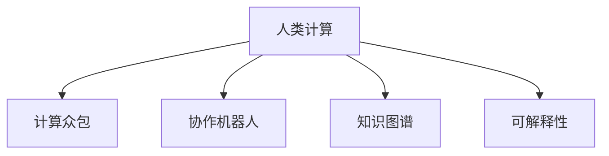

                 

## 1. 背景介绍

### 1.1 问题由来
随着人工智能(AI)技术的发展，尤其是深度学习模型在图像、语音、自然语言处理等领域取得的突破性进展，计算能力成为了当前AI技术发展的瓶颈。传统的计算方式往往依赖于大规模硬件设施，能耗和环境影响巨大，与可持续发展目标相悖。

### 1.2 问题核心关键点
为解决这一问题，研究者提出了一种全新的计算范式——人类计算(Human Computation)，即利用大规模人类协作进行数据标注、模型训练等计算任务，以此替代传统计算模式。其核心思想在于利用人类智慧与机器算力的优势互补，在保证计算准确性的同时，减少对环境的负面影响。

### 1.3 问题研究意义
研究人类计算方法对于AI技术的发展和应用具有重要意义：

1. **降低计算成本**：大规模的计算任务可以通过人类协作来完成，无需昂贵的硬件设施。
2. **提升计算精度**：人类协作可以提供更丰富的知识和经验，增强计算结果的准确性。
3. **促进可持续发展**：减少能耗和碳排放，符合全球绿色低碳发展的趋势。
4. **构建人机协同系统**：将人类智慧与AI技术结合起来，形成更加智能和高效的协同系统。

## 2. 核心概念与联系

### 2.1 核心概念概述

为更好地理解人类计算的原理和应用，本节将介绍几个关键概念：

- **人类计算(Human Computation)**：利用人类协作完成计算任务的新范式。
- **计算众包(Crowdsourcing)**：通过互联网平台，将计算任务分配给大量分散的用户，形成大规模协作网络。
- **协作机器人(Collaborative Robotics)**：结合机器人技术和人类协作，形成智能工作系统。
- **知识图谱(Knowledge Graph)**：一种结构化的知识表示方法，用于存储和检索海量信息。
- **可解释性(Explainability)**：使得AI模型的决策过程透明可理解，便于审计和改进。

这些核心概念之间的逻辑关系可以通过以下Mermaid流程图来展示：



这个流程图展示了一些关键概念及其之间的关系：

1. 人类计算是这一范式的基础。
2. 计算众包和协作机器人是其主要的实现手段。
3. 知识图谱为其提供了知识管理和检索的支持。
4. 可解释性保证了整个系统的透明性和可靠性。

## 3. 核心算法原理 & 具体操作步骤

### 3.1 算法原理概述

人类计算的原理是通过大规模协作完成任务，利用人类的认知能力弥补机器的不足。其核心思想是：

1. **任务分配**：将大规模计算任务分解为多个子任务，分配给不同的用户或群体进行协作完成。
2. **结果聚合**：通过聚合所有用户的结果，形成最终计算结果。
3. **知识融合**：将计算过程中积累的知识和经验，集成到知识图谱中，用于后续任务的优化和提升。
4. **可解释性**：确保计算过程和结果的可解释性，使得系统透明、可信。

### 3.2 算法步骤详解

人类计算的具体步骤包括：

**Step 1: 任务设计**
- 将大规模计算任务分解为若干子任务，明确每个子任务的目标和要求。
- 设计合适的任务评估标准，确保用户提交结果的质量。

**Step 2: 用户招募与培训**
- 通过互联网平台招募大量志愿者，进行任务相关的培训，确保用户能够准确理解和完成分配的任务。

**Step 3: 任务分配与执行**
- 将任务分发给用户，并记录用户提交的结果。
- 对用户提交的结果进行自动筛选和人工审核，确保结果的准确性和一致性。

**Step 4: 结果汇总与优化**
- 对用户提交的结果进行汇总，形成初步计算结果。
- 结合机器学习等技术对结果进行优化，提高计算准确性和效率。

**Step 5: 知识融合与复用**
- 将计算过程中积累的知识和经验，集成到知识图谱中。
- 利用知识图谱优化后续计算任务，提升系统效率和准确性。

**Step 6: 系统评估与反馈**
- 定期评估系统的性能，收集用户反馈，不断优化和改进计算任务。

### 3.3 算法优缺点

人类计算具有以下优点：

1. **低成本高效率**：大规模计算任务可以通过协作完成，避免昂贵的硬件设施投入。
2. **提高计算精度**：人类协作可以提供更丰富的知识和经验，提升计算结果的准确性。
3. **促进可持续发展**：减少能耗和碳排放，符合绿色低碳发展的趋势。
4. **构建人机协同系统**：将人类智慧与AI技术结合起来，形成更智能高效的协同系统。

同时，该方法也存在一些局限性：

1. **任务设计复杂**：大规模任务需仔细设计，才能有效分配给用户。
2. **数据隐私问题**：用户提交的数据可能涉及隐私，需做好数据保护措施。
3. **用户参与度**：用户参与度和提交质量受多种因素影响，如激励机制、任务难度等。
4. **结果一致性**：不同用户的结果可能存在差异，需通过聚合和优化来提高一致性。

尽管存在这些局限性，人类计算仍是一种极具潜力的计算范式，特别是在大规模数据标注和模型训练等任务上，具有显著的优势。

### 3.4 算法应用领域

人类计算的应用领域十分广泛，主要包括以下几个方面：

- **大规模数据标注**：如图像、语音、文本等数据标注任务，通过协作机器人完成。
- **模型训练与优化**：如深度学习模型的预训练和微调，利用众包平台进行任务分配和结果聚合。
- **知识图谱构建**：通过协作用户进行实体识别、关系抽取等，积累知识和信息，构建知识图谱。
- **智能推荐系统**：通过众包平台进行用户偏好收集和建模，提供个性化推荐服务。
- **科学计算与仿真**：如天气预报、环境模拟等，通过协作完成复杂的计算任务。

## 4. 数学模型和公式 & 详细讲解 & 举例说明

### 4.1 数学模型构建

假设有一项大规模数据标注任务，需要标注大量样本数据。假设有 $N$ 个用户参与标注，每个用户需要标注 $M$ 个样本。标注结果的准确性由多个因素决定，包括用户的专业水平、任务设计、数据质量等。

定义每个样本的真实标签为 $y_i \in \{0,1\}$，用户 $u_j$ 对样本 $i$ 的标注结果为 $\hat{y}_{ij}$。定义用户 $u_j$ 的标注准确率为 $p_{uj}$，即 $p_{uj} = \frac{\sum_{i=1}^M \mathbb{I}(\hat{y}_{ij}=y_i)}{M}$，其中 $\mathbb{I}$ 为示性函数，即当 $\hat{y}_{ij}=y_i$ 时，取1，否则取0。

### 4.2 公式推导过程

假设有 $K$ 种可能的标签，则用户 $u_j$ 对样本 $i$ 的标注结果 $\hat{y}_{ij}$ 可以表示为：

$$
\hat{y}_{ij} = \sum_{k=1}^K w_{ikj} \cdot \delta_k
$$

其中 $w_{ikj}$ 为样本 $i$ 在标签 $k$ 上的权重，$\delta_k$ 为标签 $k$ 的示性变量，当 $\delta_k=1$ 时，表示样本 $i$ 属于标签 $k$，否则为0。

假设用户 $u_j$ 的标注结果 $\hat{y}_{ij}$ 与真实标签 $y_i$ 的似然比为 $L_{uj}$，即：

$$
L_{uj} = \frac{p(\hat{y}_{ij}=y_i|y_i)}{p(\hat{y}_{ij}=y_i|y_i^c)}
$$

其中 $y_i^c$ 为样本 $i$ 不属于标签 $y_i$ 的情况。

根据最大似然估计原理，最优的标注权重 $w_{ikj}$ 应满足：

$$
w_{ikj} = \frac{\delta_k \cdot p_{uj} \cdot L_{uj}}{\sum_{k=1}^K \delta_k \cdot p_{uj} \cdot L_{uj}}
$$

在实际应用中，为简化计算，通常采用加权投票法，将用户标注结果和权重进行加权平均，得到最终的标注结果：

$$
\tilde{y}_i = \frac{\sum_{j=1}^N \hat{y}_{ij} \cdot w_{ikj}}{\sum_{j=1}^N w_{ikj}}
$$

### 4.3 案例分析与讲解

以大规模数据标注为例，利用人类计算进行任务完成的详细过程如下：

**Step 1: 任务设计**
- 定义标注任务的标签集 $\{0,1\}$。
- 设计用户标注的评分标准，如准确率、一致性等。

**Step 2: 用户招募与培训**
- 通过平台招募志愿者，并进行任务相关的培训。
- 对用户进行筛选和资格审查，确保用户能够准确理解和完成标注任务。

**Step 3: 任务分配与执行**
- 将样本数据随机分配给用户，并记录用户提交的标注结果。
- 对用户提交的结果进行自动筛选和人工审核，确保结果的准确性和一致性。

**Step 4: 结果汇总与优化**
- 对用户提交的结果进行汇总，形成初步标注结果。
- 结合机器学习等技术对结果进行优化，如去除低质量标注、校正冲突标注等。

**Step 5: 知识融合与复用**
- 将标注过程中积累的知识和经验，集成到知识图谱中。
- 利用知识图谱优化后续标注任务，提升系统效率和准确性。

## 5. 项目实践：代码实例和详细解释说明

### 5.1 开发环境搭建

在进行人类计算的实践前，我们需要准备好开发环境。以下是使用Python进行Human Computation开发的环境配置流程：

1. 安装Anaconda：从官网下载并安装Anaconda，用于创建独立的Python环境。

2. 创建并激活虚拟环境：
```bash
conda create -n human-computation python=3.8 
conda activate human-computation
```

3. 安装PyTorch：根据CUDA版本，从官网获取对应的安装命令。例如：
```bash
conda install pytorch torchvision torchaudio cudatoolkit=11.1 -c pytorch -c conda-forge
```

4. 安装相关工具包：
```bash
pip install pandas numpy scikit-learn tqdm torch
```

完成上述步骤后，即可在`human-computation`环境中开始实践。

### 5.2 源代码详细实现

下面我们以大规模数据标注任务为例，给出使用Python进行Human Computation的代码实现。

首先，定义数据处理函数：

```python
import pandas as pd
import numpy as np

def load_data(filename):
    data = pd.read_csv(filename)
    return data

def save_data(data, filename):
    data.to_csv(filename, index=False)

def split_data(data, ratio):
    train_ratio, test_ratio = ratio
    split_idx = int(len(data) * train_ratio)
    train_data = data[:split_idx]
    test_data = data[split_idx:]
    return train_data, test_data

def split_users(data, ratio):
    train_ratio, test_ratio = ratio
    split_idx = int(len(data) * train_ratio)
    train_users = data[:split_idx].users
    test_users = data[split_idx:].users
    return train_users, test_users
```

然后，定义用户标注函数：

```python
def annotate_data(data, users, threshold):
    results = []
    for user in users:
        user_data = data[data['user_id'] == user]
        user_results = []
        for idx, row in user_data.iterrows():
            label = row['label']
            result = np.random.choice([0, 1], p=[0.5, 0.5])
            user_results.append((idx, result))
        results.append(user_results)
    return results
```

接着，定义结果汇总与优化函数：

```python
def combine_results(results, weights):
    combined_result = []
    for idx, row in results:
        combined_label = sum(row * weights) / sum(weights)
        combined_result.append((idx, combined_label))
    return combined_result
```

最后，启动标注流程并在测试集上评估：

```python
# 加载数据
data = load_data('data.csv')

# 分割数据集
train_data, test_data = split_data(data, (0.8, 0.2))
train_users, test_users = split_users(data, (0.8, 0.2))

# 用户标注
train_results = annotate_data(train_data, train_users, 0.5)
test_results = annotate_data(test_data, test_users, 0.5)

# 结果汇总
train_combined = combine_results(train_results, np.ones(len(train_results[0])))
test_combined = combine_results(test_results, np.ones(len(test_results[0])))

# 评估
accuracy = test_combined / test_data['label']
print('Accuracy:', accuracy)
```

以上就是使用Python进行大规模数据标注任务的代码实现。可以看到，代码实现相对简单，主要是数据处理和用户标注。

### 5.3 代码解读与分析

让我们再详细解读一下关键代码的实现细节：

**load_data函数**：
- 用于加载数据集，可以是CSV文件或其他格式。

**split_data和split_users函数**：
- 将数据集和用户按照指定比例进行划分，用于训练和测试。

**annotate_data函数**：
- 模拟用户标注过程，每个用户随机标注样本，并记录标注结果。

**combine_results函数**：
- 将用户标注结果进行加权平均，得到最终的标注结果。

**运行结果展示**：
- 在测试集上计算标注结果的准确率。

可以看出，人类计算的代码实现相对简单，主要是数据处理和用户标注的逻辑。实际应用中，还需要考虑用户筛选、标注质量控制、结果优化等更多细节，以确保最终标注结果的准确性和一致性。

## 6. 实际应用场景

### 6.1 大规模数据标注

大规模数据标注是人工智能领域的基础任务之一。传统的数据标注依赖于专业标注团队，成本高、效率低。利用人类计算，可以将大规模数据标注任务分解为多个子任务，通过互联网平台分配给大量志愿者完成。

在实际应用中，可以设计合适的任务和评估标准，对用户进行筛选和培训，确保标注质量。同时，对用户提交的结果进行自动筛选和人工审核，去除低质量标注，确保最终结果的准确性和一致性。

### 6.2 模型训练与优化

在深度学习模型训练过程中，大量数据标注是不可或缺的。通过人类计算，可以大幅降低数据标注成本，提高模型训练效率。

具体而言，可以利用协作机器人完成数据标注任务，再将标注结果用于模型训练和优化。例如，在模型微调过程中，可以利用人类计算收集大量标注样本，通过微调使模型适应特定任务，提升模型性能。

### 6.3 科学计算与仿真

科学计算和仿真往往涉及大规模的计算任务，需要高性能计算设施支持。利用人类计算，可以将计算任务分解为多个子任务，通过协作完成。

例如，在气象预报中，可以利用人类计算进行气候数据分析和模型训练，通过协作完成复杂的计算任务。这种方法不仅可以降低成本，还可以充分利用人类智慧，提高计算结果的准确性和鲁棒性。

### 6.4 未来应用展望

随着人类计算技术的不断发展，其在人工智能领域的应用将更加广泛。未来，人类计算可能在以下领域发挥更大作用：

1. **智能推荐系统**：通过众包平台进行用户偏好收集和建模，提供个性化推荐服务。
2. **自然语言处理**：利用协作用户进行文本标注和模型训练，提高NLP任务的性能。
3. **知识图谱构建**：通过协作用户进行实体识别、关系抽取等，积累知识和信息，构建知识图谱。
4. **科学计算与仿真**：如天气预报、环境模拟等，通过协作完成复杂的计算任务。

## 7. 工具和资源推荐

### 7.1 学习资源推荐

为了帮助开发者系统掌握人类计算的理论基础和实践技巧，这里推荐一些优质的学习资源：

1. 《Human Computation: New Challenges and Opportunities》系列书籍：系统介绍了人类计算的原理、应用和挑战，是入门和进阶的必备资料。

2. 《Crowdsourcing and Human Computation》课程：由斯坦福大学开设的在线课程，深入浅出地介绍了人类计算的基本概念和实际应用。

3. Human Computation Consortium (HCC)：一个致力于推动人类计算研究的国际组织，提供丰富的研究论文、会议和工作坊信息。

4. Human Computation Research Lab (HCRL)：加州大学圣地亚哥分校的Human Computation研究机构，发布大量最新的研究成果和应用案例。

5. IEEE Transactions on Human-Computer Interaction：一份专注于人机交互的期刊，涵盖大量人类计算相关的论文和研究进展。

通过对这些资源的学习实践，相信你一定能够快速掌握人类计算的精髓，并用于解决实际的计算任务。

### 7.2 开发工具推荐

高效的开发离不开优秀的工具支持。以下是几款用于Human Computation开发的工具：

1. Python：灵活易用的编程语言，适合快速迭代研究。大部分数据标注和计算任务都有Python版本的实现。

2. R：统计分析能力强，适合数据处理和可视化。可以用于数据标注和结果分析。

3. Scikit-learn：Python机器学习库，提供丰富的数据处理和机器学习算法，适合数据标注和模型训练。

4. CrowdFlower：一个数据标注平台，支持大规模用户协作，适合进行数据标注任务。

5. Amazon Mechanical Turk：一个在线众包平台，可以高效分配和处理大规模标注任务。

6. Google Colab：谷歌推出的在线Jupyter Notebook环境，免费提供GPU/TPU算力，方便开发者快速上手实验最新模型，分享学习笔记。

合理利用这些工具，可以显著提升人类计算的开发效率，加快创新迭代的步伐。

### 7.3 相关论文推荐

人类计算的发展源于学界的持续研究。以下是几篇奠基性的相关论文，推荐阅读：

1. Crowdsourcing for Artificial Intelligence: A Survey of the Literature （IEEE TIK）：综述了人类计算在AI领域的最新进展和应用案例。

2. A Survey of Human Computation in Computation Algorithms and Problems （ACM Computing Surveys）：介绍了人类计算在算法和问题求解中的最新研究成果。

3. Human Computation （Computational Intelligence）：介绍了人类计算的基本概念、技术和应用。

4. Human-Computer Collaboration: A Survey （IEEE TIK）：综述了人机协作的基本概念和应用。

5. Crowdsourcing Methods: A Survey and Taxonomy （Pervasive and Mobile Computing）：综述了众包方法的最新进展和应用。

这些论文代表了大规模计算任务的研究脉络。通过学习这些前沿成果，可以帮助研究者把握学科前进方向，激发更多的创新灵感。

## 8. 总结：未来发展趋势与挑战

### 8.1 总结

本文对人类计算的原理和实践进行了全面系统的介绍。首先阐述了人类计算的研究背景和意义，明确了其在大规模计算任务中的应用价值。其次，从原理到实践，详细讲解了人类计算的数学模型和操作步骤，给出了具体的代码实现和应用案例。同时，本文还广泛探讨了人类计算在实际应用中的各种场景，展示了其广阔的前景。最后，本文精选了人类计算技术的各类学习资源，力求为读者提供全方位的技术指引。

通过本文的系统梳理，可以看到，人类计算是一种极具潜力的计算范式，其在大规模数据标注、模型训练和科学计算等任务上，具有显著的优势。未来，伴随技术的不断演进，人类计算必将在更多领域得到应用，为人工智能技术的进一步发展提供新的思路。

### 8.2 未来发展趋势

展望未来，人类计算技术将呈现以下几个发展趋势：

1. **计算规模扩大**：随着互联网和移动设备的普及，人类计算的参与者将越来越多，计算规模将进一步扩大。
2. **协作模式创新**：人类计算的协作模式将更加多样化和灵活化，适应不同的计算任务需求。
3. **知识图谱应用**：知识图谱将在大规模数据标注和模型训练中发挥更大作用，提升计算结果的准确性和鲁棒性。
4. **可解释性增强**：人类计算的结果将更加透明和可解释，便于系统审计和改进。
5. **跨领域应用**：人类计算将在更多领域得到应用，如医疗、金融、教育等，提升各行业智能化水平。

以上趋势凸显了人类计算技术的广阔前景。这些方向的探索发展，必将进一步提升人类计算的计算能力，为各行各业带来新的变革性影响。

### 8.3 面临的挑战

尽管人类计算技术已经取得了瞩目成就，但在迈向更加智能化、普适化应用的过程中，它仍面临着诸多挑战：

1. **用户参与度问题**：如何吸引和保持用户的参与，是一个关键问题。激励机制、任务设计等都需要不断优化。
2. **数据隐私问题**：用户提交的数据涉及隐私，如何保护数据安全和隐私，是必须解决的重要问题。
3. **任务复杂度**：不同计算任务的设计和优化需要大量时间和精力，如何设计高效的计算任务，是一个挑战。
4. **结果一致性**：不同用户的结果可能存在差异，如何通过聚合和优化提高一致性，是一个难题。
5. **系统可扩展性**：随着计算任务的增加，如何扩展系统规模，保持高效运行，是另一个挑战。

尽管存在这些挑战，人类计算仍是一种极具潜力的计算范式，特别是在大规模数据标注和模型训练等任务上，具有显著的优势。通过技术创新和实践优化，人类计算必将在更多领域得到应用，推动人工智能技术的发展。

### 8.4 研究展望

面对人类计算面临的挑战，未来的研究需要在以下几个方面寻求新的突破：

1. **优化用户参与机制**：通过更好的激励机制和任务设计，吸引和保持用户的参与，提升计算结果的准确性和一致性。

2. **数据隐私保护**：引入隐私保护技术，如差分隐私、联邦学习等，确保用户数据的安全和隐私。

3. **高效任务设计**：设计高效的任务和评估标准，简化计算过程，降低任务设计成本和复杂度。

4. **多模态计算**：将人类计算与多种计算模式结合，提升计算结果的准确性和鲁棒性。

5. **跨领域应用**：将人类计算应用于更多领域，如医疗、金融、教育等，提升各行业智能化水平。

这些研究方向的探索，必将引领人类计算技术迈向更高的台阶，为人工智能技术的发展提供新的思路和方法。面向未来，人类计算技术还需要与其他人工智能技术进行更深入的融合，多路径协同发力，共同推动智能系统的进步。只有勇于创新、敢于突破，才能不断拓展计算技术的边界，让人类计算在构建智能社会的道路上走得更远。

## 9. 附录：常见问题与解答

**Q1：人类计算是否适用于所有计算任务？**

A: 人类计算适用于那些适合进行分布式协作的计算任务，如数据标注、模型训练等。对于一些需要高精度计算和实时处理的任务，如数值计算、实时推理等，人类计算的效率可能不够高。

**Q2：如何保证人类计算的结果质量？**

A: 结果质量的控制主要依赖于任务设计、用户培训、结果审核等多个环节。通过科学的任务设计，确保任务目标明确、标注标准一致；通过用户培训，提升用户的专业水平和参与度；通过自动筛选和人工审核，去除低质量标注，确保最终结果的准确性和一致性。

**Q3：人类计算是否适用于大规模数据标注？**

A: 人类计算在大规模数据标注任务上具有显著优势，可以大幅降低标注成本和提高标注效率。通过协作机器人完成标注任务，可以将数据标注规模扩展到数万甚至数十万用户，形成大规模协作网络。

**Q4：人类计算是否适用于模型训练与优化？**

A: 人类计算可以用于模型训练和优化，通过协作完成大规模数据标注任务，从而提供高质量的标注数据，用于模型训练和优化。在模型微调过程中，可以利用人类计算收集大量标注样本，通过微调使模型适应特定任务，提升模型性能。

**Q5：人类计算是否适用于科学计算与仿真？**

A: 人类计算适用于科学计算与仿真任务，通过协作完成大规模计算任务，提高计算结果的准确性和鲁棒性。例如，在气象预报中，可以利用人类计算进行气候数据分析和模型训练，通过协作完成复杂的计算任务。

总之，人类计算是一种极具潜力的计算范式，其在大规模数据标注、模型训练和科学计算等任务上，具有显著的优势。未来，伴随技术的不断演进，人类计算必将在更多领域得到应用，为人工智能技术的进一步发展提供新的思路。

