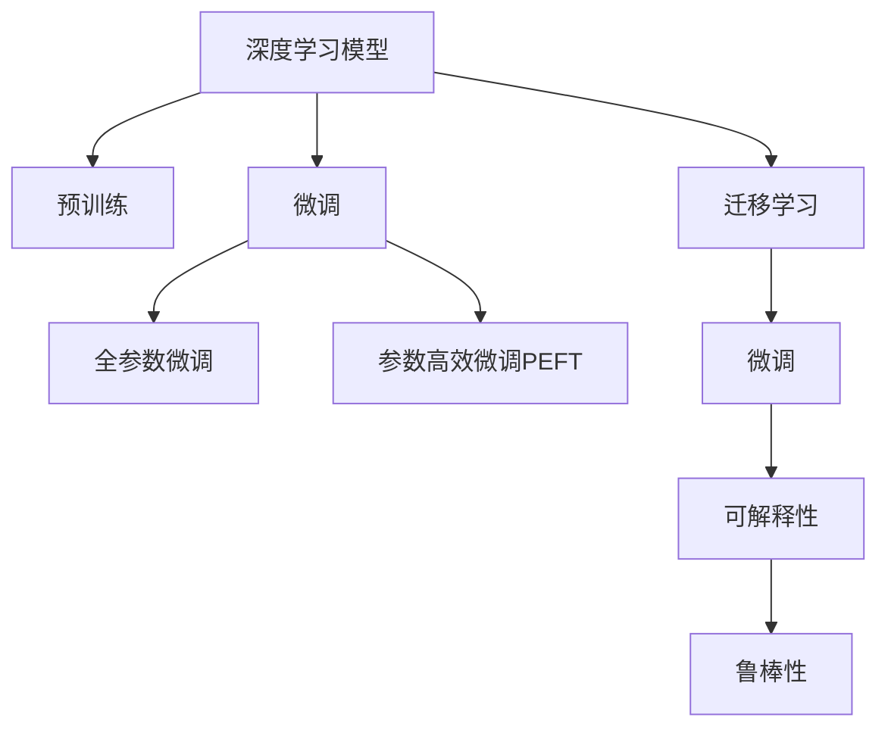

                 

## 1. 背景介绍

### 1.1 问题由来

在21世纪信息化与智能化的浪潮中，人工智能（AI）成为了驱动社会变革的重要力量。从智能客服到智能家居，从无人驾驶到医疗诊断，AI正以不可阻挡的趋势深入各行各业。这些AI应用的背后，都是基于深度学习模型，尤其是深度神经网络模型的创新与突破。然而，这些模型的训练和优化过程，对于数据、计算资源、算法等有着极高的要求，难以完全适配实际应用中的复杂多变场景。

### 1.2 问题核心关键点

AI模型的有效性取决于其在实际应用场景中的表现。基于传统机器学习模型的AI应用往往需要大量的手动特征工程，而基于深度神经网络的AI模型则需要通过大规模数据集进行预训练，以便学习到通用的特征表示。因此，将AI模型适配到现实应用中，关键在于模型训练与调优的策略，以及模型优化与推理的效率。

近年来，大模型（Large Models）因其在大规模数据上的预训练能力，以及良好的迁移学习能力，在NLP、CV、音频处理等领域展现出了巨大潜力。然而，将大模型应用于实际问题时，仍面临诸多挑战。例如，如何在大规模数据上进行高效训练，如何通过微调策略适应不同领域的应用需求，如何在有限的计算资源下进行高效的推理和优化，如何在保证模型性能的同时提高可解释性，等等。

本文将系统性地介绍AI模型在现实中的应用，以及如何通过一系列算法与技术手段，实现模型的高效训练与优化，以解决实际中的大量问题。

## 2. 核心概念与联系

### 2.1 核心概念概述

为了更好地理解AI模型在现实中的应用，本节将介绍几个密切相关的核心概念：

- **深度学习模型（Deep Learning Models）**：基于神经网络结构的机器学习模型，通过多个隐含层来学习数据的复杂特征表示。
- **预训练模型（Pre-trained Models）**：在大规模无标签数据上进行自监督学习，学习到通用的特征表示，可用于多个下游任务的迁移学习。
- **微调（Fine-tuning）**：在预训练模型的基础上，使用下游任务的少量标注数据，通过有监督学习优化模型在该任务上的性能。
- **迁移学习（Transfer Learning）**：将一个领域学习到的知识，迁移应用到另一个不同但相关的领域的学习范式。
- **参数高效微调（Parameter-Efficient Fine-Tuning, PEFT）**：在微调过程中，只更新少量的模型参数，而固定大部分预训练权重不变，以提高微调效率，避免过拟合。
- **可解释性（Explainability）**：理解AI模型的决策过程和结果，以提高模型的可信度和可用性。
- **鲁棒性（Robustness）**：模型对数据扰动、对抗样本等外部攻击的抗干扰能力。

这些核心概念之间的逻辑关系可以通过以下Mermaid流程图来展示：



这个流程图展示了大模型的核心概念及其之间的关系：

1. 深度学习模型通过预训练获得基础能力。
2. 微调是对预训练模型进行任务特定的优化，可以分为全参数微调和参数高效微调（PEFT）。
3. 迁移学习是连接预训练模型与下游任务的桥梁，可以通过微调或参数高效微调来实现。
4. 可解释性和鲁棒性是在微调过程中，通过技术手段提升模型性能的重要指标。

## 3. 核心算法原理 & 具体操作步骤

### 3.1 算法原理概述

AI模型在现实中的应用，通常需要经过以下几个关键步骤：

1. **数据准备**：收集并预处理数据，进行数据增强、标准化等操作。
2. **模型选择与训练**：选择合适的预训练模型，并对其进行微调，以适应特定任务。
3. **模型评估与调优**：通过验证集评估模型性能，调整超参数和优化算法，以获得更好的结果。
4. **模型部署与应用**：将模型部署到实际应用场景中，进行推理与预测。

这些步骤中的每个环节，都需要精心设计和优化，才能确保模型的有效性和性能。

### 3.2 算法步骤详解

#### 3.2.1 数据准备

数据准备是大模型应用的基础。通常需要收集并清洗数据，并进行以下预处理操作：

1. **数据增强（Data Augmentation）**：通过数据增强技术，如旋转、裁剪、翻转等，丰富训练样本的多样性，防止过拟合。
2. **标准化（Normalization）**：对输入数据进行标准化处理，如归一化、中心化等，以提高模型的训练效率和收敛速度。
3. **分批处理（Batching）**：将数据分为多个小批次进行处理，以减少内存占用，提高计算效率。

#### 3.2.2 模型选择与训练

选择合适的预训练模型，并进行微调，是实现AI模型在现实应用中的关键。常见的预训练模型包括BERT、GPT、ResNet等。微调过程通常包括以下步骤：

1. **选择预训练模型**：根据任务需求选择合适的预训练模型，如文本分类任务选择BERT，图像分类任务选择ResNet等。
2. **添加任务适配层**：在预训练模型的基础上，添加或修改输出层和损失函数，以适应特定任务。
3. **设置微调超参数**：选择合适的优化算法及其参数，如Adam、SGD等，设置学习率、批大小、迭代轮数等。
4. **执行梯度训练**：将训练集数据分批次输入模型，前向传播计算损失函数。反向传播计算参数梯度，根据设定的优化算法和学习率更新模型参数。
5. **周期性评估模型性能**：在验证集上评估模型性能，根据性能指标决定是否触发Early Stopping。
6. **重复训练直至收敛**：重复上述步骤，直至模型在验证集上的性能达到预设标准。

#### 3.2.3 模型评估与调优

模型评估与调优是确保模型性能的关键步骤。通常需要以下操作：

1. **模型评估**：使用验证集对模型进行评估，计算准确率、召回率、F1-score等指标。
2. **超参数调优**：通过网格搜索或随机搜索，调整学习率、批大小、优化器等超参数，以获得更好的模型性能。
3. **优化算法选择**：根据任务特点和模型特性，选择合适的优化算法，如Adam、Adagrad、SGD等。
4. **正则化技术应用**：通过L2正则、Dropout等技术，防止模型过拟合。
5. **对抗训练**：加入对抗样本，提高模型鲁棒性。
6. **模型集成**：通过集成多个模型，取平均或加权平均输出，提高模型性能。

#### 3.2.4 模型部署与应用

模型部署与应用是确保模型实际效果的最后一步。通常需要以下操作：

1. **模型保存与加载**：将训练好的模型保存为特定格式，以便后续部署和使用。
2. **模型推理**：使用测试集或实际数据，对模型进行推理和预测。
3. **模型监控与调优**：实时监控模型性能，根据反馈数据进行模型调优。

### 3.3 算法优缺点

#### 3.3.1 优点

- **高效训练**：大模型通过预训练可以学习到通用的特征表示，只需少量标注数据进行微调，即可达到良好性能。
- **泛化能力强**：预训练模型通过在大规模数据上进行学习，具备较强的泛化能力，可以适应不同领域的应用需求。
- **性能提升显著**：微调过程可以在预训练模型的基础上进行优化，显著提升模型在特定任务上的表现。
- **参数高效微调**：通过只更新少量参数，既提升性能，又节省计算资源。
- **迁移学习**：通过迁移学习，可以利用预训练模型的知识，减少从头训练的时间成本。

#### 3.3.2 缺点

- **计算资源需求高**：大模型的训练和推理需要较高的计算资源，需要高性能的GPU或TPU设备。
- **过拟合风险**：微调过程中，模型可能会过拟合训练数据，导致泛化能力下降。
- **模型复杂度高**：大模型往往包含大量的参数，推理复杂度较高，部署难度较大。
- **可解释性不足**：深度学习模型通常被视为"黑盒"，难以解释其决策过程。
- **对抗攻击脆弱**：深度学习模型可能对对抗样本敏感，难以抵抗攻击。

### 3.4 算法应用领域

AI模型的应用领域非常广泛，涵盖医疗、金融、智能制造、智能交通等多个行业。以下是几个典型的应用场景：

#### 3.4.1 医疗影像分析

AI模型可以应用于医疗影像分析，帮助医生进行疾病的早期筛查和诊断。例如，通过预训练模型对大量医疗影像数据进行学习，再通过微调模型对特定病灶进行检测和分类。

#### 3.4.2 智能推荐系统

AI模型可以应用于智能推荐系统，为用户推荐个性化的商品、内容等。通过预训练模型对用户行为数据进行学习，再通过微调模型对推荐策略进行优化，提升推荐效果和用户满意度。

#### 3.4.3 自动驾驶

AI模型可以应用于自动驾驶系统，通过预训练模型对海量驾驶数据进行学习，再通过微调模型对具体驾驶场景进行决策和控制，提升驾驶安全性和舒适性。

#### 3.4.4 金融风险管理

AI模型可以应用于金融风险管理，通过预训练模型对历史数据进行学习，再通过微调模型对市场波动进行预测和风险评估，帮助金融机构制定合理的投资策略。

#### 3.4.5 智能客服

AI模型可以应用于智能客服系统，通过预训练模型对客户咨询数据进行学习，再通过微调模型对客户问题进行理解和回答，提升客户体验和问题解决效率。

## 4. 数学模型和公式 & 详细讲解 & 举例说明

### 4.1 数学模型构建

在AI模型训练中，通常使用以下数学模型：

$$
\min_{\theta} \frac{1}{N} \sum_{i=1}^N \ell(M_{\theta}(x_i), y_i)
$$

其中，$\theta$为模型参数，$M_{\theta}(x_i)$为模型对输入$x_i$的输出，$\ell$为损失函数，$y_i$为真实标签。

### 4.2 公式推导过程

以分类任务为例，假设模型对输入$x_i$的输出为$\hat{y}=M_{\theta}(x_i)$，真实标签为$y_i \in \{0, 1\}$，则交叉熵损失函数为：

$$
\ell(M_{\theta}(x_i), y_i) = -[y_i \log \hat{y} + (1-y_i) \log (1-\hat{y})]
$$

将其代入损失函数，得：

$$
\mathcal{L}(\theta) = -\frac{1}{N} \sum_{i=1}^N [y_i \log \hat{y}_i + (1-y_i) \log (1-\hat{y}_i)]
$$

根据链式法则，损失函数对参数$\theta_k$的梯度为：

$$
\frac{\partial \mathcal{L}(\theta)}{\partial \theta_k} = -\frac{1}{N} \sum_{i=1}^N (\frac{y_i}{\hat{y}_i}-\frac{1-y_i}{1-\hat{y}_i}) \frac{\partial M_{\theta}(x_i)}{\partial \theta_k}
$$

其中$\frac{\partial M_{\theta}(x_i)}{\partial \theta_k}$可进一步递归展开，利用自动微分技术完成计算。

### 4.3 案例分析与讲解

以图像分类任务为例，假设使用ResNet模型，在ImageNet数据集上进行预训练，然后在CIFAR-10数据集上进行微调。具体步骤如下：

1. **数据准备**：收集并预处理CIFAR-10数据集，并进行数据增强和标准化。
2. **模型选择**：选择ResNet模型作为预训练模型。
3. **添加任务适配层**：在ResNet模型顶层添加全连接层，输出10个类别概率，使用交叉熵损失函数。
4. **设置微调超参数**：选择Adam优化器，设置学习率为1e-4，批大小为128，迭代轮数为100。
5. **执行梯度训练**：将CIFAR-10数据集分批次输入模型，前向传播计算损失函数。反向传播计算参数梯度，根据设定的优化算法和学习率更新模型参数。
6. **周期性评估模型性能**：在验证集上评估模型性能，根据性能指标决定是否触发Early Stopping。
7. **重复训练直至收敛**：重复上述步骤，直至模型在验证集上的性能达到预设标准。

## 5. 项目实践：代码实例和详细解释说明

### 5.1 开发环境搭建

在进行AI模型应用开发前，我们需要准备好开发环境。以下是使用Python进行PyTorch开发的环境配置流程：

1. 安装Anaconda：从官网下载并安装Anaconda，用于创建独立的Python环境。
2. 创建并激活虚拟环境：
```bash
conda create -n pytorch-env python=3.8 
conda activate pytorch-env
```
3. 安装PyTorch：根据CUDA版本，从官网获取对应的安装命令。例如：
```bash
conda install pytorch torchvision torchaudio cudatoolkit=11.1 -c pytorch -c conda-forge
```
4. 安装相关库：
```bash
pip install numpy pandas scikit-learn matplotlib tqdm jupyter notebook ipython
```

完成上述步骤后，即可在`pytorch-env`环境中开始项目实践。

### 5.2 源代码详细实现

以下以图像分类任务为例，给出使用PyTorch对ResNet模型进行微调的完整代码实现。

首先，定义数据处理函数：

```python
import torch
import torch.nn as nn
from torchvision import datasets, transforms

class ResNet50(nn.Module):
    def __init__(self):
        super(ResNet50, self).__init__()
        self.conv1 = nn.Conv2d(3, 64, kernel_size=7, stride=2, padding=3, bias=False)
        self.bn1 = nn.BatchNorm2d(64)
        self.relu = nn.ReLU(inplace=True)
        self.maxpool = nn.MaxPool2d(kernel_size=3, stride=2, padding=1)
        self.layer1 = self._make_layer(64, 3)
        self.layer2 = self._make_layer(128, 3, stride=2)
        self.layer3 = self._make_layer(256, 3, stride=2)
        self.layer4 = self._make_layer(512, 3, stride=2)
        self.avgpool = nn.AdaptiveAvgPool2d((1, 1))
        self.fc = nn.Linear(512, 10)

    def forward(self, x):
        x = self.conv1(x)
        x = self.bn1(x)
        x = self.relu(x)
        x = self.maxpool(x)
        x = self.layer1(x)
        x = self.layer2(x)
        x = self.layer3(x)
        x = self.layer4(x)
        x = self.avgpool(x)
        x = x.view(x.size(0), -1)
        x = self.fc(x)
        return x

def train_epoch(model, train_loader, optimizer, device):
    model.train()
    loss_sum = 0
    correct_sum = 0
    for data, target in train_loader:
        data, target = data.to(device), target.to(device)
        optimizer.zero_grad()
        output = model(data)
        loss = nn.CrossEntropyLoss()(output, target)
        loss_sum += loss.item() * data.size(0)
        _, pred = output.max(1)
        correct_sum += pred.eq(target).sum().item()
    return loss_sum / len(train_loader.dataset), correct_sum / len(train_loader.dataset)

def evaluate(model, test_loader, device):
    model.eval()
    loss_sum = 0
    correct_sum = 0
    with torch.no_grad():
        for data, target in test_loader:
            data, target = data.to(device), target.to(device)
            output = model(data)
            loss = nn.CrossEntropyLoss()(output, target)
            loss_sum += loss.item() * data.size(0)
            _, pred = output.max(1)
            correct_sum += pred.eq(target).sum().item()
    return loss_sum / len(test_loader.dataset), correct_sum / len(test_loader.dataset)

def main():
    device = torch.device('cuda' if torch.cuda.is_available() else 'cpu')
    model = ResNet50().to(device)
    optimizer = torch.optim.Adam(model.parameters(), lr=1e-4)
    train_loader = torch.utils.data.DataLoader(
        datasets.CIFAR10(root='data', train=True, download=True, transform=transforms.ToTensor()),
        batch_size=128, shuffle=True)
    test_loader = torch.utils.data.DataLoader(
        datasets.CIFAR10(root='data', train=False, transform=transforms.ToTensor()),
        batch_size=128, shuffle=False)

    for epoch in range(100):
        train_loss, train_acc = train_epoch(model, train_loader, optimizer, device)
        test_loss, test_acc = evaluate(model, test_loader, device)
        print(f'Epoch {epoch+1}, Train Loss: {train_loss:.4f}, Train Acc: {train_acc:.4f}, Test Loss: {test_loss:.4f}, Test Acc: {test_acc:.4f}')

if __name__ == '__main__':
    main()
```

通过上述代码，我们定义了一个简单的ResNet模型，并在CIFAR-10数据集上进行了微调。可以看到，使用PyTorch和相关库，可以方便地实现图像分类的微调过程。

### 5.3 代码解读与分析

让我们再详细解读一下关键代码的实现细节：

**ResNet50类**：
- `__init__`方法：定义了ResNet模型的各层结构。
- `forward`方法：实现了前向传播，通过多层卷积、池化、全连接等操作，计算模型的最终输出。

**train_epoch函数**：
- 对训练集数据进行批处理，并在每个批次上计算损失函数和精度。
- 使用Adam优化器进行模型参数更新，并返回该epoch的平均损失和准确率。

**evaluate函数**：
- 对测试集数据进行批处理，并在每个批次上计算损失函数和精度。
- 使用无梯度模式进行推理，返回该epoch的平均损失和准确率。

**main函数**：
- 定义模型、优化器和数据集，并进行模型训练和评估。
- 在每个epoch结束时输出训练和测试的损失和准确率。

可以看到，使用PyTorch和相关库，可以方便地实现AI模型的微调过程。开发者可以将更多精力放在数据处理、模型改进等高层逻辑上，而不必过多关注底层的实现细节。

当然，工业级的系统实现还需考虑更多因素，如模型的保存和部署、超参数的自动搜索、更灵活的任务适配层等。但核心的微调范式基本与此类似。

## 6. 实际应用场景

### 6.1 智能医疗

在智能医疗领域，AI模型可以应用于疾病诊断、影像分析、智能问诊等多个环节。通过预训练模型对大量医学数据进行学习，再通过微调模型对特定疾病进行检测和分类，提升医疗服务的智能化水平。

### 6.2 金融风险管理

在金融风险管理领域，AI模型可以应用于信用评估、市场预测、反欺诈检测等多个环节。通过预训练模型对历史数据进行学习，再通过微调模型对市场波动进行预测和风险评估，帮助金融机构制定合理的投资策略。

### 6.3 智能制造

在智能制造领域，AI模型可以应用于生产调度、质量检测、设备维护等多个环节。通过预训练模型对生产数据进行学习，再通过微调模型对生产过程进行优化和预测，提升生产效率和质量。

### 6.4 自动驾驶

在自动驾驶领域，AI模型可以应用于环境感知、路径规划、决策控制等多个环节。通过预训练模型对海量驾驶数据进行学习，再通过微调模型对具体驾驶场景进行决策和控制，提升驾驶安全性和舒适性。

### 6.5 智能客服

在智能客服领域，AI模型可以应用于问题分类、意图识别、对话生成等多个环节。通过预训练模型对客户咨询数据进行学习，再通过微调模型对客户问题进行理解和回答，提升客户体验和问题解决效率。

## 7. 工具和资源推荐

### 7.1 学习资源推荐

为了帮助开发者系统掌握AI模型在现实中的应用，这里推荐一些优质的学习资源：

1. 《深度学习》（Ian Goodfellow等著）：深入浅出地介绍了深度学习的原理、算法和应用。
2. Coursera《Deep Learning Specialization》课程：由Andrew Ng教授主讲的深度学习系列课程，涵盖深度学习的基础和前沿技术。
3. DeepLearning.AI《AI for Everyone》课程：适合非技术背景的观众，介绍了AI的基础概念和应用场景。
4. HuggingFace官方文档：提供了大量预训练模型和微调范例，是学习和应用AI模型的必备资料。
5. Google AI博客：提供了大量AI技术的最新动态和应用案例，是了解AI趋势的重要来源。

通过对这些资源的学习实践，相信你一定能够系统地掌握AI模型在现实中的应用，并用于解决实际的AI问题。

### 7.2 开发工具推荐

高效的开发离不开优秀的工具支持。以下是几款用于AI模型微调开发的常用工具：

1. PyTorch：基于Python的开源深度学习框架，灵活高效的计算图，适合快速迭代研究。
2. TensorFlow：由Google主导开发的开源深度学习框架，生产部署方便，适合大规模工程应用。
3. Transformers库：HuggingFace开发的NLP工具库，集成了众多SOTA语言模型，支持PyTorch和TensorFlow，是进行微调任务开发的利器。
4. Weights & Biases：模型训练的实验跟踪工具，可以记录和可视化模型训练过程中的各项指标，方便对比和调优。
5. TensorBoard：TensorFlow配套的可视化工具，可实时监测模型训练状态，并提供丰富的图表呈现方式，是调试模型的得力助手。
6. Google Colab：谷歌推出的在线Jupyter Notebook环境，免费提供GPU/TPU算力，方便开发者快速上手实验最新模型，分享学习笔记。

合理利用这些工具，可以显著提升AI模型微调任务的开发效率，加快创新迭代的步伐。

### 7.3 相关论文推荐

AI模型和微调技术的不断发展源于学界的持续研究。以下是几篇奠基性的相关论文，推荐阅读：

1. ImageNet Classification with Deep Convolutional Neural Networks：提出使用卷积神经网络进行图像分类的经典算法，为后续深度学习模型奠定了基础。
2. Inception-v3, Inception ResNet and the Impact of Residual Connections on Learning：提出Inception网络结构和残差连接，提升了卷积神经网络的性能和训练效率。
3. Transformer Architectures：提出Transformer模型，改变了深度学习模型的训练和推理方式，推动了NLP等领域的发展。
4. Attention Is All You Need：提出Transformer模型，提升了深度学习模型的性能和训练效率，奠定了预训练语言模型的基础。
5. BERT: Pre-training of Deep Bidirectional Transformers for Language Understanding：提出BERT模型，引入掩码语言模型任务，推动了预训练语言模型在NLP领域的应用。
6. GANs Trained by a Two Time-Scale Update Rule Converge to the Fixed-Point of the Mini-Game Equilibrium：提出生成对抗网络（GAN），推动了生成模型在图像、音频、文本等领域的应用。

这些论文代表了大模型和微调技术的发展脉络。通过学习这些前沿成果，可以帮助研究者把握学科前进方向，激发更多的创新灵感。

## 8. 总结：未来发展趋势与挑战

### 8.1 研究成果总结

本文对AI模型在现实中的应用，以及如何通过一系列算法与技术手段，实现模型的高效训练与优化，以解决实际中的大量问题进行了全面系统的介绍。主要内容包括：

1. AI模型训练的基本步骤，包括数据准备、模型选择与训练、模型评估与调优、模型部署与应用。
2. AI模型的数学模型构建，包括损失函数、梯度计算等。
3. AI模型在医疗、金融、智能制造、自动驾驶等多个领域的实际应用。
4. 学习资源、开发工具和相关论文的推荐，以便读者深入学习和实践。

通过本文的系统梳理，可以看到，AI模型在现实中的应用具有广阔前景，未来有更多的创新空间和技术突破。

### 8.2 未来发展趋势

展望未来，AI模型在现实中的应用将呈现以下几个发展趋势：

1. **自监督学习与生成对抗网络（GAN）**：通过自监督学习和大规模GAN生成数据，提升模型的数据利用率和泛化能力。
2. **迁移学习与零样本学习**：利用迁移学习和零样本学习技术，提升模型的迁移能力和数据适应性。
3. **多模态融合与跨领域应用**：通过融合视觉、语音、文本等多种模态信息，提升模型的感知能力和应用范围。
4. **联邦学习与边缘计算**：通过联邦学习和边缘计算技术，实现模型在分布式环境下的高效训练和推理。
5. **可解释性与透明性**：通过可解释性和透明性技术，提升模型的可信度和可用性，降低人工智能的伦理风险。

这些趋势展示了AI模型在未来应用的广阔前景和无限可能性。这些方向的探索发展，必将进一步提升AI模型在实际应用中的表现，为人类社会带来更多价值。

### 8.3 面临的挑战

尽管AI模型在现实中的应用取得了显著成果，但在迈向更加智能化、普适化应用的过程中，仍面临诸多挑战：

1. **数据稀缺与质量**：AI模型需要大量高质量标注数据进行训练，但实际应用场景中数据稀缺且标注质量参差不齐，限制了模型的性能。
2. **计算资源限制**：AI模型的训练和推理需要大量计算资源，当前计算资源供不应求，限制了模型的应用规模。
3. **模型复杂性与可解释性**：AI模型通常结构复杂，难以解释其内部工作机制和决策逻辑，降低了模型的可信度和可用性。
4. **伦理与隐私问题**：AI模型的应用涉及到大量个人隐私数据，如何保护用户隐私和数据安全，是应用AI模型的一大挑战。
5. **安全与鲁棒性**：AI模型可能受到对抗样本攻击，如何保证模型的安全性和鲁棒性，是应用AI模型的一大挑战。
6. **跨领域模型迁移**：AI模型在特定领域内表现良好，但在其他领域的应用效果往往不理想，如何提高跨领域迁移能力，是应用AI模型的一大挑战。

正视这些挑战，积极应对并寻求突破，将是大模型和微调技术走向成熟的重要路径。

### 8.4 研究展望

面对AI模型在现实应用中面临的诸多挑战，未来的研究需要在以下几个方面寻求新的突破：

1. **数据生成与增强**：利用自监督学习和大规模GAN生成数据，提升模型的数据利用率和泛化能力。
2. **可解释性增强**：通过可解释性和透明性技术，提升模型的可信度和可用性，降低人工智能的伦理风险。
3. **分布式计算优化**：通过联邦学习和边缘计算技术，实现模型在分布式环境下的高效训练和推理。
4. **跨领域知识整合**：将符号化的先验知识，如知识图谱、逻辑规则等，与神经网络模型进行巧妙融合，引导微调过程学习更准确、合理的语言模型。
5. **多模态融合与跨领域应用**：通过融合视觉、语音、文本等多种模态信息，提升模型的感知能力和应用范围。
6. **对抗攻击鲁棒性**：通过引入对抗样本和鲁棒性训练，提升模型的鲁棒性和安全性。

这些研究方向将进一步提升AI模型的性能和应用范围，为人工智能技术在垂直行业的规模化落地铺平道路。面向未来，大模型和微调技术还需要与其他人工智能技术进行更深入的融合，如知识表示、因果推理、强化学习等，多路径协同发力，共同推动人工智能技术的进步。

## 9. 附录：常见问题与解答

**Q1：AI模型在实际应用中是否需要从头训练？**

A: 大部分AI模型都是通过预训练和微调的方式进行优化，而不是从头训练。预训练模型在大规模数据上学习到通用特征，可以在特定任务上进行微调，以适应新的数据和需求，从而提高模型性能和效率。

**Q2：AI模型训练时，如何选择学习率和优化算法？**

A: 学习率和优化算法的选择需要根据具体任务和数据特点进行灵活调整。一般来说，学习率越小，模型越容易收敛，但训练时间较长。Adam、SGD等优化算法在不同场景下表现各异，需要根据任务需求进行选择。

**Q3：AI模型训练时，如何防止过拟合？**

A: 防止过拟合的常用方法包括数据增强、正则化、Dropout等。数据增强可以增加训练样本的多样性，正则化可以限制模型的复杂度，Dropout可以随机丢弃部分神经元，减少模型对训练数据的依赖。

**Q4：AI模型训练时，如何提高模型的泛化能力？**

A: 提高模型的泛化能力可以从多个方面入手，如使用更多的数据进行训练，选择适当的损失函数和优化算法，使用Dropout、正则化等防止过拟合。此外，可以采用迁移学习和零样本学习等技术，提升模型的泛化能力和适应性。

**Q5：AI模型训练时，如何选择模型结构？**

A: 模型结构的选择需要根据具体任务和数据特点进行灵活调整。一般来说，较大的模型可以处理更复杂的数据和任务，但计算资源需求较大。较小的模型计算资源需求较少，但性能可能不如大型模型。可以根据实际需求和资源条件进行权衡选择。

通过回答这些常见问题，希望能够帮助读者更好地理解AI模型在现实中的应用，并为其实际应用提供参考。

