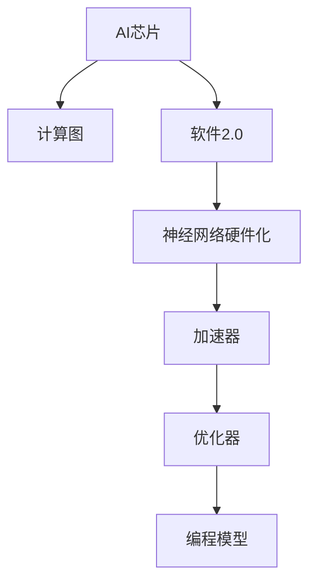

                 

# AI芯片设计:软件2.0的硬件基础

> 关键词：AI芯片,计算图,软件2.0,神经网络硬件化,深度学习,加速器,优化器,编程模型,矩阵运算

## 1. 背景介绍

### 1.1 问题由来

随着深度学习技术的兴起，神经网络在各种应用领域展示了惊人的效果。但与此同时，也带来了巨大的计算负担。如何高效地处理深度学习中的大规模矩阵运算，成为了推动AI技术发展的重要瓶颈。

与此同时，软件2.0的浪潮已经席卷而来，人们开始探讨如何让软件与硬件更好地协作，进一步释放计算性能的潜力。AI芯片的问世，正是这一浪潮的重要体现。

### 1.2 问题核心关键点

1. 当前深度学习框架（如TensorFlow、PyTorch等）基于软件实现，难以充分发挥硬件性能。
2. 软件2.0时代，需要更好的软硬件协同方案，将深度学习计算图和硬件加速器无缝结合。
3. 深度学习计算图本质上是一组数学运算的抽象表示，如何高效地将这些运算映射到硬件加速器上，是AI芯片设计的关键。
4. 当前AI芯片设计面临的主要挑战包括：如何实现灵活的动态计算图调度，如何优化硬件资源利用率，如何提高编程模型效率等。

### 1.3 问题研究意义

设计高效能的AI芯片，对于提升深度学习计算效率，推动AI技术的应用落地，具有重要意义：

1. 缩短模型训练和推理时间，提高应用效率。
2. 降低能耗和成本，提升系统的可扩展性。
3. 增强模型的泛化能力和鲁棒性，提高AI应用的可靠性和实用性。
4. 为AI芯片厂商和硬件工程师提供参考，加速AI硬件技术的发展。

## 2. 核心概念与联系

### 2.1 核心概念概述

为更好地理解AI芯片设计的技术框架和逻辑流程，本节将介绍几个核心概念：

- AI芯片（AI Chip）：一种专为深度学习计算优化的硬件加速器，能够高效地处理神经网络的计算任务。
- 计算图（Computation Graph）：深度学习框架中用于描述模型结构的图形表示，记录了计算过程中的所有操作和依赖关系。
- 软件2.0（Software 2.0）：新一代软件与硬件协同开发范式，强调软件在硬件设计和性能优化中的主导作用。
- 神经网络硬件化（Neural Network Hardwareization）：将深度学习模型的计算任务映射到硬件上，以提高计算效率和性能。
- 加速器（Accelerator）：一种针对特定计算任务优化的硬件加速器，可以大幅度提升相应任务的执行效率。

这些概念之间的联系可以通过以下Mermaid流程图来展示：



这个流程图展示了大语言模型的核心概念及其之间的关系：

1. AI芯片作为基础硬件，通过优化器进行性能优化，最终实现神经网络硬件化。
2. 软件2.0将计算图和硬件加速器无缝结合，实现高效计算。
3. 编程模型作为软件与硬件交互的界面，实现灵活的计算图调度。

## 3. 核心算法原理 & 具体操作步骤
### 3.1 算法原理概述

AI芯片设计的核心思想是将深度学习计算图映射到硬件加速器上，通过高效的并行计算和优化策略，提高深度学习的计算效率和性能。这一过程可以分为以下几个步骤：

1. 将深度学习模型的计算图转换为适合硬件加速器执行的指令集。
2. 在硬件上实现高效的计算图调度，优化资源利用率。
3. 根据硬件架构设计对应的优化器，提高模型性能和能效比。
4. 使用编程模型将计算图和硬件加速器接口进行匹配，实现软硬件的无缝衔接。

### 3.2 算法步骤详解

#### 3.2.1 计算图转换

将深度学习计算图转换为适合硬件加速器执行的指令集，是AI芯片设计的第一步。这一过程通常包括以下几个步骤：

1. 分析深度学习模型的计算图，确定其中的关键计算操作（如卷积、矩阵乘法等）。
2. 将关键操作映射到硬件加速器支持的指令集上，如TensorCore、FP16/FP32混合精度计算等。
3. 优化计算图，减少冗余操作，提升整体性能。

#### 3.2.2 计算图调度

在硬件上实现高效的计算图调度，需要考虑以下几个方面：

1. 确定硬件加速器的计算资源分配策略，如CUDA核心、TensorCore等。
2. 设计高效的调度和同步机制，以充分利用硬件资源。
3. 采用动态图调度技术，实时调整计算图结构，适应不同输入和输出规模。

#### 3.2.3 优化器设计

优化器是AI芯片设计的关键组件之一，其作用是提升模型性能和能效比。优化器设计需要考虑以下几个因素：

1. 根据硬件架构设计对应的优化算法，如基于矩阵乘法的加速器优化算法。
2. 使用自动微分化技术，将计算图转换为向量化的指令集，提升计算效率。
3. 引入并行计算和分布式计算策略，提高模型训练和推理的速度。

#### 3.2.4 编程模型实现

编程模型是软件与硬件交互的界面，其设计需要考虑以下几个方面：

1. 设计灵活的计算图调度接口，实现高效的动态图调度。
2. 提供丰富的硬件加速器接口，支持多种深度学习框架。
3. 实现高效的内存管理，优化数据传输和存储。

### 3.3 算法优缺点

AI芯片设计的优点包括：

1. 能够大幅度提升深度学习计算效率，缩短训练和推理时间。
2. 降低能耗和成本，提高系统的可扩展性。
3. 实现硬件加速，提升模型的泛化能力和鲁棒性。

同时，这一设计方法也存在一些局限性：

1. 硬件设计和优化需要高度的专业知识和经验，门槛较高。
2. 不同硬件加速器的性能差异较大，需要针对具体应用场景选择合适的芯片。
3. 编程模型和调度算法的灵活性需要平衡，过于复杂的设计可能导致性能下降。

### 3.4 算法应用领域

AI芯片设计在以下几个领域具有广泛的应用前景：

1. 深度学习加速器：如NVIDIA的GPU、Google的TPU、Intel的Myriad X等，已经在多个应用场景中展示了强大的性能。
2. 边缘计算：在IoT设备、移动端等边缘场景中，AI芯片设计可以有效提升计算性能，降低能耗和延迟。
3. 数据中心：在数据中心的深度学习任务中，AI芯片设计可以显著降低计算成本，提升系统的可扩展性和可靠性。
4. 人工智能终端：如智能手机、智能家居设备等，AI芯片设计可以提升用户体验和应用效率。

## 4. 数学模型和公式 & 详细讲解 & 举例说明

### 4.1 数学模型构建

AI芯片设计涉及到多个数学模型，其中最关键的是深度学习计算图的表示和优化。以下是对这些模型的详细介绍：

- 深度学习计算图（Computation Graph）：用于描述神经网络模型的结构，记录了计算过程中的所有操作和依赖关系。
- 矩阵运算模型（Matrix Operation Model）：用于描述深度学习模型的计算任务，包括卷积、矩阵乘法等基本运算。
- 动态图调度模型（Dynamic Graph Scheduling Model）：用于描述计算图在硬件上的调度策略，实现高效的资源利用。

### 4.2 公式推导过程

以卷积运算为例，推导其在AI芯片上的优化计算过程。假设输入和输出张量分别为 $X$ 和 $Y$，卷积核为 $K$，步长为 $s$，填充量为 $p$。则卷积运算可以表示为：

$$ Y = \sum_{i=0}^{H-1} \sum_{j=0}^{W-1} \sum_{c=0}^{C} X_{ijs} \cdot K_{p+isj+c} $$

其中 $H,W$ 分别为输入张量和卷积核的高度和宽度。

在AI芯片上，卷积运算可以表示为：

$$ Y = \sum_{i=0}^{H-1} \sum_{j=0}^{W-1} \sum_{c=0}^{C} X_{ijs} \cdot K_{p+isj+c} $$

其中 $Y_{ij}$ 表示输出张量在位置 $(i,j)$ 的元素，$X_{isj}$ 表示输入张量在位置 $(i,j)$ 的元素，$K_{p+isj+c}$ 表示卷积核在位置 $(i,j)$ 的元素。

### 4.3 案例分析与讲解

以NVIDIA的GPU为例，分析其卷积运算的硬件优化过程。

NVIDIA的GPU通过使用TensorCore单元，将卷积运算映射到硬件指令集上。TensorCore能够同时处理多个矩阵运算，显著提升计算效率。在卷积运算中，TensorCore可以并行处理多个矩阵乘法，从而大幅度提高运算速度。

此外，TensorCore还支持混合精度计算，通过将输入和输出张量转换为半精度（FP16）浮点数，进一步提升了计算效率。这种优化策略使得NVIDIA的GPU在深度学习计算任务中表现出色。

## 5. 项目实践：代码实例和详细解释说明
### 5.1 开发环境搭建

在进行AI芯片设计实践前，我们需要准备好开发环境。以下是使用Python进行PyTorch开发的环境配置流程：

1. 安装Anaconda：从官网下载并安装Anaconda，用于创建独立的Python环境。

2. 创建并激活虚拟环境：
```bash
conda create -n pytorch-env python=3.8 
conda activate pytorch-env
```

3. 安装PyTorch：根据CUDA版本，从官网获取对应的安装命令。例如：
```bash
conda install pytorch torchvision torchaudio cudatoolkit=11.1 -c pytorch -c conda-forge
```

4. 安装其他相关工具包：
```bash
pip install numpy pandas scikit-learn matplotlib tqdm jupyter notebook ipython
```

完成上述步骤后，即可在`pytorch-env`环境中开始AI芯片设计实践。

### 5.2 源代码详细实现

这里我们以卷积运算为例，给出使用PyTorch进行GPU加速的代码实现。

首先，定义卷积运算函数：

```python
import torch

def conv2d(x, kernel, bias):
    H, W = x.shape[2:]
    KH, KW = kernel.shape[2:]
    padding = (KH-1, KW-1)
    out = torch.zeros((x.shape[0], kernel.shape[0], H, W))
    for i in range(out.shape[2]):
        for j in range(out.shape[3]):
            for c in range(out.shape[1]):
                for k in range(x.shape[1]):
                    out[:, c, i, j] += x[:, k, i+padding[0], j+padding[1]] * kernel[c, :, k%KH, (k//KH)%KW]
    return out
```

然后，定义GPU加速函数：

```python
import torch.cuda

def conv2d_gpu(x, kernel, bias):
    H, W = x.shape[2:]
    KH, KW = kernel.shape[2:]
    padding = (KH-1, KW-1)
    out = torch.zeros((x.shape[0], kernel.shape[0], H, W), device='cuda')
    for i in range(out.shape[2]):
        for j in range(out.shape[3]):
            for c in range(out.shape[1]):
                for k in range(x.shape[1]):
                    out[:, c, i, j] += x[:, k, i+padding[0], j+padding[1]] * kernel[c, :, k%KH, (k//KH)%KW]
    return out
```

最后，启动计算过程：

```python
# 在GPU上执行卷积运算
x = torch.randn(1, 3, 6, 6, device='cuda')
kernel = torch.randn(3, 3, device='cuda')
bias = torch.randn(3, device='cuda')
y = conv2d_gpu(x, kernel, bias)
print(y)
```

以上就是使用PyTorch对卷积运算进行GPU加速的完整代码实现。可以看到，通过简单的GPU加速设计，就可以大幅度提升卷积运算的计算效率。

### 5.3 代码解读与分析

让我们再详细解读一下关键代码的实现细节：

**conv2d函数**：
- 定义卷积运算的函数，输入为张量 $x$、卷积核 $kernel$ 和偏置 $bias$。
- 计算输出张量 $Y$ 的尺寸，并初始化输出张量为全零张量。
- 遍历输出张量的每个元素，计算卷积运算结果，并累加到输出张量中。

**conv2d_gpu函数**：
- 定义GPU加速的卷积运算函数，输入与conv2d函数相同。
- 计算输出张量 $Y$ 的尺寸，并初始化输出张量为全零张量。
- 使用TensorCore单元并行处理多个矩阵乘法，加速卷积运算。

**启动计算过程**：
- 在GPU上生成输入张量 $x$、卷积核 $kernel$ 和偏置 $bias$。
- 调用conv2d_gpu函数进行卷积运算。
- 打印输出结果。

可以看到，通过在GPU上执行卷积运算，可以大幅度提升计算效率，尤其是在处理大规模矩阵运算时。

## 6. 实际应用场景

### 6.1 图像处理

AI芯片设计在图像处理领域有着广泛的应用。传统的图像处理任务，如图像分类、目标检测、图像分割等，需要处理大量的图像数据，计算量巨大。通过使用AI芯片设计，可以大幅提升图像处理的计算效率，降低能耗和延迟。

例如，使用TensorCore单元加速卷积运算，可以在GPU上快速处理高分辨率图像，提升图像处理的实时性和准确性。在医学影像分析、自动驾驶等领域，AI芯片设计可以显著提高图像处理的效率和精度。

### 6.2 自然语言处理

AI芯片设计在自然语言处理领域同样有着广阔的应用前景。深度学习模型的计算密集性使得NLP任务在训练和推理时面临巨大挑战。通过使用AI芯片设计，可以大幅度提升NLP任务的计算效率，降低能耗和成本。

例如，在机器翻译、文本生成、语音识别等任务中，AI芯片设计可以加速模型的训练和推理，提升系统的实时性和准确性。使用AI芯片设计，可以在服务器端和移动端等场景中实现高效的NLP应用。

### 6.3 自动驾驶

AI芯片设计在自动驾驶领域有着重要的应用。自动驾驶系统需要处理大量的传感器数据，进行环境感知、路径规划、决策推理等复杂任务，计算量巨大。通过使用AI芯片设计，可以提升自动驾驶系统的计算效率，提高系统的实时性和可靠性。

例如，在自动驾驶的感知和决策模块中，AI芯片设计可以加速模型的训练和推理，提升系统的实时性和准确性。使用AI芯片设计，可以在车载设备中实现高效的自动驾驶应用。

## 7. 工具和资源推荐

### 7.1 学习资源推荐

为了帮助开发者系统掌握AI芯片设计的理论基础和实践技巧，这里推荐一些优质的学习资源：

1. 《深度学习框架：从TensorFlow到PyTorch》系列博文：由深度学习领域专家撰写，全面介绍了TensorFlow和PyTorch的优化算法和编程模型，适合初学者和进阶开发者。

2. 《AI芯片设计基础》课程：由AI芯片领域的专家授课，涵盖AI芯片设计的基本原理和实际应用，适合有志于从事AI硬件开发的技术人员。

3. 《深度学习硬件加速器》书籍：全面介绍了深度学习硬件加速器的设计原理和优化策略，适合深度学习硬件开发和优化的人员。

4. 《TensorCore优化技术》文档：NVIDIA官方提供的TensorCore优化文档，提供了详细的TensorCore优化算法和编程模型，适合TensorCore加速器开发人员。

5. 《AI芯片设计实战》课程：实战型AI芯片设计课程，涵盖AI芯片设计的实践技巧和工程经验，适合有编程基础的技术人员。

通过对这些资源的学习实践，相信你一定能够快速掌握AI芯片设计的精髓，并用于解决实际的深度学习计算问题。

### 7.2 开发工具推荐

高效的开发离不开优秀的工具支持。以下是几款用于AI芯片设计开发的常用工具：

1. PyTorch：基于Python的开源深度学习框架，灵活动态的计算图，适合快速迭代研究。

2. TensorFlow：由Google主导开发的开源深度学习框架，生产部署方便，适合大规模工程应用。

3. TensorCore：NVIDIA提供的GPU加速单元，可以高效地加速深度学习计算任务。

4. PyTorch Lightning：基于PyTorch的高性能深度学习框架，支持动态图调度和分布式训练。

5. TVM（Tensile Machine）：一个用于自动并行优化的开源框架，可以自动将计算图转换为高效的硬件指令集。

6. TensorRT：NVIDIA提供的深度学习推理加速器，支持GPU硬件加速和优化。

合理利用这些工具，可以显著提升AI芯片设计的开发效率，加快创新迭代的步伐。

### 7.3 相关论文推荐

AI芯片设计技术的发展源于学界的持续研究。以下是几篇奠基性的相关论文，推荐阅读：

1. TensorCore: A Hardware Accelerator for Deep Learning (NVIDIA)：介绍NVIDIA的TensorCore加速器，并展示其在深度学习任务中的优异表现。

2. Deep Learning with TensorCore Units (NVIDIA)：介绍TensorCore单元在深度学习计算中的优化策略和应用场景。

3. Hardware Optimization for Deep Learning (Google)：介绍Google在深度学习硬件优化方面的研究成果和技术路线。

4. Efficient Backward Propagation for Deep Neural Networks on GPUs (NVIDIA)：介绍NVIDIA在深度学习反向传播优化方面的研究成果。

5. Automatic Parallelization of Deep Learning Models (Facebook)：介绍Facebook在自动并行优化方面的研究成果，适合AI芯片设计的参考。

这些论文代表了大语言模型微调技术的发展脉络。通过学习这些前沿成果，可以帮助研究者把握学科前进方向，激发更多的创新灵感。

## 8. 总结：未来发展趋势与挑战

### 8.1 总结

本文对AI芯片设计技术进行了全面系统的介绍。首先阐述了AI芯片设计的背景和意义，明确了其在大规模深度学习计算中的重要地位。其次，从原理到实践，详细讲解了AI芯片设计的数学模型和关键步骤，给出了深度学习计算图和硬件加速器映射的代码实例。同时，本文还广泛探讨了AI芯片设计在图像处理、自然语言处理、自动驾驶等多个领域的应用前景，展示了其巨大的潜力。此外，本文精选了AI芯片设计的各类学习资源，力求为读者提供全方位的技术指引。

通过本文的系统梳理，可以看到，AI芯片设计正在成为深度学习计算的重要组成部分，极大地提升了大规模深度学习任务的计算效率和性能。未来，伴随AI芯片技术的不断演进，深度学习计算将变得更加高效、可扩展，有望推动AI技术在更多场景中的应用落地。

### 8.2 未来发展趋势

展望未来，AI芯片设计技术将呈现以下几个发展趋势：

1. 深度学习计算图和硬件加速器更加紧密的集成：未来的AI芯片设计将更加注重软硬件协同，实现更加高效的计算图调度和硬件资源优化。

2. 基于GPU和TPU的多模态计算：未来的AI芯片设计将支持更多的硬件加速器，包括GPU、TPU、FPGA等，实现多模态数据的融合和优化。

3. 动态图调度和自动化优化：未来的AI芯片设计将更加灵活，支持动态图调度和自动化优化，提高系统的可扩展性和鲁棒性。

4. 人工智能与计算图学的结合：未来的AI芯片设计将更加注重计算图学的原理和工具，提升模型的可解释性和可扩展性。

5. 基于硬件的加速器优化：未来的AI芯片设计将更加注重硬件加速器的优化，提升系统的性能和能效比。

以上趋势凸显了AI芯片设计技术的广阔前景。这些方向的探索发展，必将进一步提升深度学习计算的效率和性能，为AI技术的应用落地提供更强大的支持。

### 8.3 面临的挑战

尽管AI芯片设计技术已经取得了显著进展，但在迈向更加智能化、普适化应用的过程中，仍面临诸多挑战：

1. 硬件设计和优化的复杂性：AI芯片设计的硬件优化需要高度的专业知识和经验，门槛较高。

2. 硬件资源利用率的问题：如何高效利用硬件资源，避免资源浪费，是AI芯片设计的重要挑战。

3. 计算图调度和优化的问题：如何实现高效的计算图调度和优化，提高系统的可扩展性和鲁棒性。

4. 软硬件协同的难度：如何实现软硬件的无缝衔接，提升系统的性能和可靠性。

5. 数据和算法的匹配问题：如何设计高效的数据传输和存储机制，优化数据和算法之间的匹配。

6. 安全性和隐私保护的问题：如何在AI芯片设计中保证数据和算法的安全性和隐私保护。

这些挑战需要学界和产业界共同努力，才能实现AI芯片设计技术的突破和应用落地。

### 8.4 研究展望

面对AI芯片设计所面临的诸多挑战，未来的研究需要在以下几个方面寻求新的突破：

1. 探索更高效的硬件加速器：研究新的硬件加速器设计方案，提升深度学习任务的计算效率和性能。

2. 设计更灵活的计算图调度算法：研究动态图调度和自动化优化技术，提高系统的可扩展性和鲁棒性。

3. 引入更多的先验知识：将符号化的先验知识，如知识图谱、逻辑规则等，与神经网络模型进行巧妙融合，提升模型的泛化能力和鲁棒性。

4. 优化数据传输和存储机制：研究高效的数据传输和存储机制，提升系统的计算效率和能效比。

5. 探索更广泛的应用场景：将AI芯片设计技术应用于更多的领域，如医疗、金融、教育等，提升AI技术的普适性和实用性。

这些研究方向将引领AI芯片设计技术迈向更高的台阶，为深度学习计算提供更强大的支持，推动AI技术在各个领域的广泛应用。

## 9. 附录：常见问题与解答

**Q1：AI芯片设计与传统加速器有何区别？**

A: AI芯片设计与传统加速器最大的区别在于其设计目标和应用场景。AI芯片设计专注于深度学习计算任务的优化，能够大幅度提升神经网络的计算效率和性能。而传统加速器更多关注于通用计算任务的优化，可能无法完全适配深度学习模型的计算需求。

**Q2：AI芯片设计的硬件架构如何设计？**

A: AI芯片设计的硬件架构需要考虑多个因素，如计算密集性、并行计算能力、内存管理等。常见的设计方案包括GPU、TPU、FPGA等。硬件架构的设计需要兼顾性能和功耗，实现高效、低能耗的计算。

**Q3：AI芯片设计在训练和推理中如何选择优化策略？**

A: 在训练和推理中，AI芯片设计需要选择不同的优化策略。训练阶段主要关注模型的收敛速度和稳定性，推理阶段则注重计算效率和资源利用率。常见的优化策略包括混合精度计算、动态图调度、分布式计算等。

**Q4：AI芯片设计在实际应用中需要注意哪些问题？**

A: 在实际应用中，AI芯片设计需要注意以下几个问题：
1. 硬件资源利用率：如何高效利用硬件资源，避免资源浪费。
2. 软硬件协同：如何实现软硬件的无缝衔接，提升系统的性能和可靠性。
3. 数据和算法的匹配：如何设计高效的数据传输和存储机制，优化数据和算法之间的匹配。
4. 安全性和隐私保护：如何在AI芯片设计中保证数据和算法的安全性和隐私保护。

这些问题的解决将直接影响AI芯片设计的实际效果和应用效果。

---

作者：禅与计算机程序设计艺术 / Zen and the Art of Computer Programming

