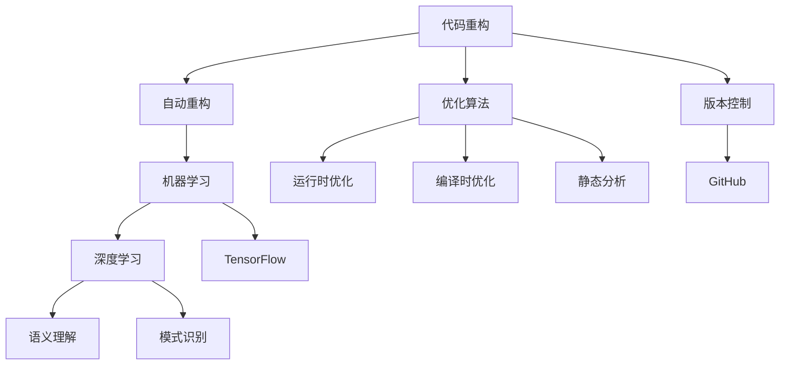

                 

# AI辅助的代码重构与优化

> 关键词：代码重构、自动重构、优化算法、深度学习、TensorFlow、GitHub

## 1. 背景介绍

### 1.1 问题由来

在软件开发过程中，代码重构是一项必不可少的任务。随着项目的不断演变和代码的逐渐积累，原有的代码可能变得复杂、冗余、难以维护。有效的代码重构可以提升代码质量，降低维护成本，增强代码的可读性和可扩展性。然而，手工进行代码重构通常耗时耗力，且容易出错。因此，借助AI技术辅助代码重构，成为当前软件工程的热门话题。

### 1.2 问题核心关键点

AI辅助代码重构的核心在于利用机器学习和深度学习技术，自动识别代码中的问题模式，并提供自动重构建议。常见的自动重构任务包括函数合并、代码拆分、变量重命名、死代码检测、循环优化等。自动重构不仅能够提高重构效率，还能够减少人为错误，提升重构质量。

## 2. 核心概念与联系

### 2.1 核心概念概述

为更好地理解AI辅助的代码重构技术，本节将介绍几个关键概念：

- 代码重构(Code Refactoring)：通过调整代码的内部结构而不改变其外部行为，来提升代码的可读性、可维护性和可扩展性。重构包括语法优化、命名规范、结构重组等方面。

- 自动重构(Automatic Refactoring)：使用AI技术自动识别代码中的问题，并提供重构建议或自动执行重构操作，减少人工干预，提升重构效率。

- 机器学习(Machine Learning)：利用算法模型，从数据中学习规律，进而对未知数据进行预测或决策。在代码重构中，机器学习可以用于识别代码中的问题模式，自动生成重构建议。

- 深度学习(Deep Learning)：一种模拟人类神经网络结构的机器学习范式，通过多层次的特征提取和表示学习，能够处理复杂的数据结构和任务。深度学习在代码重构中的应用包括语义理解、模式识别等。

- TensorFlow：由Google开发的开源深度学习框架，支持高效的数学运算和模型构建，是实现深度学习算法的常用工具。

- GitHub：全球最大的开源代码托管平台，提供了丰富的代码存储和版本控制功能，支持代码协作和版本回溯。

这些概念之间的逻辑关系可以通过以下Mermaid流程图来展示：



这个流程图展示了几者之间的关系：

1. 代码重构包括手动重构和自动重构两种方式。
2. 自动重构利用机器学习进行问题识别，并通过深度学习进行语义理解和模式识别。
3. 深度学习应用到TensorFlow框架下进行模型构建和训练。
4. 优化算法用于运行时和编译时优化，提升重构效果。
5. 静态分析用于识别潜在问题，辅助重构决策。
6. 版本控制和GitHub提供了代码协作和版本回溯的工具。

这些概念共同构成了AI辅助的代码重构框架，使得代码重构更加高效、自动化、可追溯。

## 3. 核心算法原理 & 具体操作步骤
### 3.1 算法原理概述

AI辅助代码重构的核心算法通常基于以下步骤：

1. **数据收集与预处理**：收集待重构的代码样本，通过静态分析技术识别代码中的问题模式。

2. **模型训练**：构建深度学习模型，对收集的数据进行训练，学习代码中的规律和问题模式。

3. **问题识别与分类**：使用训练好的模型，识别代码中的问题类型，如函数过长、变量重复、代码冗余等。

4. **重构建议生成**：根据问题类型和代码上下文，生成自动重构建议，包括函数拆分、变量重命名、代码替换等。

5. **重构执行与验证**：自动执行重构操作，并在执行前后进行对比验证，确保重构效果。

### 3.2 算法步骤详解

以下是AI辅助代码重构的具体算法步骤：

1. **数据收集与预处理**：

   - 收集待重构的代码样本，包括项目源码、库文件、开发工具生成的中间代码等。
   - 使用静态分析工具，如SonarQube、CheckStyle等，对代码进行初步分析，识别潜在的问题模式。
   - 对识别出的问题进行预处理，如去重、归一化等操作，生成可用于模型训练的数据集。

2. **模型训练**：

   - 构建深度学习模型，通常包括编码器-解码器结构，对代码文本进行特征提取。
   - 选择合适的损失函数，如交叉熵、平均绝对误差等，优化模型参数。
   - 使用GPU加速深度学习模型的训练，以提高训练速度和模型性能。

3. **问题识别与分类**：

   - 将训练好的模型应用于待重构的代码样本上，识别代码中的问题模式。
   - 根据识别出的问题类型，进行分类处理，如函数过长、变量重复、代码冗余等。
   - 为每个问题模式设计合适的重构建议，如函数拆分、变量重命名等。

4. **重构建议生成**：

   - 使用自然语言处理技术，将重构建议生成易于理解的提示信息，方便开发者阅读和执行。
   - 设计优先级规则，确定重构建议的执行顺序，优先处理高优先级问题。
   - 引入自动代码执行机制，将重构建议自动应用到代码上，减少人工操作。

5. **重构执行与验证**：

   - 在重构操作前后进行代码对比，验证重构效果。
   - 使用代码分析工具，评估重构后的代码质量，确保重构后的代码更易于维护。
   - 收集重构效果反馈，不断改进模型和算法，提高重构准确性和效率。

### 3.3 算法优缺点

AI辅助代码重构具有以下优点：

1. 自动化的重构过程，减少了人工干预，提高了重构效率。
2. 深度学习模型具备自适应能力，能够从大量数据中学习到代码问题的规律，提升重构质量。
3. 提供精准的问题识别和重构建议，减少误操作和遗漏问题。
4. 能够在多种编程语言和框架下应用，提升了重构的通用性。

同时，该方法也存在一些局限性：

1. 对数据集质量有较高要求，数据收集和预处理的过程较为复杂。
2. 深度学习模型依赖大量数据训练，初期需要较大的计算资源和时间投入。
3. 模型可能存在过拟合风险，需要定期更新和优化模型。
4. 重构建议的执行依赖于开发者的操作，执行效果无法完全保证。
5. 对于复杂的代码逻辑，自动重构可能无法完全理解代码意图，导致重构效果不佳。

尽管存在这些局限性，但AI辅助代码重构作为一种高效、自动化的重构手段，已经逐渐被各大软件工程团队所采纳，并取得了显著的成果。

### 3.4 算法应用领域

AI辅助代码重构技术已经广泛应用于软件开发过程中，覆盖了以下多个领域：

- **软件开发**：代码优化、重构、漏洞修复等，提升代码质量和安全性。
- **测试驱动开发**：通过代码重构，优化测试用例，提高测试效率和覆盖率。
- **持续集成和持续交付**：自动执行代码重构，优化构建和部署流程。
- **团队协作与代码审查**：通过重构建议，辅助团队成员协作和代码审查，提升代码质量。
- **编译器与解释器**：在编译和解释过程中进行代码优化，提升程序运行效率。

除了上述这些经典应用场景外，AI辅助代码重构还在工业界、学术界和开源社区中得到了广泛的关注和应用，为软件开发的智能化和自动化提供了新的途径。

## 4. 数学模型和公式 & 详细讲解 & 举例说明（备注：数学公式请使用latex格式，latex嵌入文中独立段落使用 $$，段落内使用 $)
### 4.1 数学模型构建

本节将使用数学语言对AI辅助代码重构的算法进行更加严格的刻画。

假设待重构的代码样本为 $X=\{x_1,x_2,\ldots,x_n\}$，其中 $x_i$ 为第 $i$ 个代码片段。记代码重构任务为 $T$，模型参数为 $\theta$，则重构的目标是找到最优的参数：

$$
\theta^* = \mathop{\arg\min}_{\theta} \mathcal{L}(\theta,X)
$$

其中 $\mathcal{L}$ 为损失函数，用于衡量模型对代码样本的预测效果。重构效果可以通过代码质量指标（如可读性、可维护性等）来评估。

### 4.2 公式推导过程

假设模型的预测输出为 $y_i=f(x_i,\theta)$，其中 $f$ 为模型函数，$\theta$ 为模型参数。设 $y_i$ 为代码重构后的质量评估指标，则重构损失函数 $\mathcal{L}$ 可以表示为：

$$
\mathcal{L}(\theta,X) = \frac{1}{n}\sum_{i=1}^n \ell(y_i, f(x_i,\theta))
$$

其中 $\ell$ 为评估指标与模型预测结果之间的损失函数，如均方误差、交叉熵等。

在实践中，我们通常使用梯度下降等优化算法，近似求解上述最优化问题。设 $\eta$ 为学习率，则参数的更新公式为：

$$
\theta \leftarrow \theta - \eta \nabla_{\theta}\mathcal{L}(\theta,X)
$$

其中 $\nabla_{\theta}\mathcal{L}(\theta,X)$ 为损失函数对模型参数的梯度，可通过反向传播算法高效计算。

### 4.3 案例分析与讲解

以函数拆分为例，假设代码中存在一个长度超过100行的函数 $f(x)$，模型识别为过度复杂。重构目标是将该函数拆分为多个更短的函数。设拆分的函数为 $g_1(x),g_2(x),\ldots,g_k(x)$，则重构损失函数可以表示为：

$$
\mathcal{L}(\theta,X) = \frac{1}{n}\sum_{i=1}^n \ell(y_i, f(x_i,\theta)) + \sum_{j=1}^k \ell(y_j, g_j(x_i,\theta))
$$

其中 $y_j$ 为函数 $g_j(x)$ 的评估指标。模型需要学习如何将 $f(x)$ 拆分为 $g_1(x),g_2(x),\ldots,g_k(x)$，使得拆分的函数具备良好的可读性和可维护性。

在训练过程中，模型需要不断调整参数 $\theta$，最小化上述重构损失函数，直到收敛。训练好的模型能够自动生成函数拆分方案，并给出重构建议。

## 5. 项目实践：代码实例和详细解释说明
### 5.1 开发环境搭建

在进行AI辅助代码重构实践前，我们需要准备好开发环境。以下是使用Python进行TensorFlow开发的环境配置流程：

1. 安装Anaconda：从官网下载并安装Anaconda，用于创建独立的Python环境。

2. 创建并激活虚拟环境：
```bash
conda create -n tf-env python=3.8 
conda activate tf-env
```

3. 安装TensorFlow：根据CUDA版本，从官网获取对应的安装命令。例如：
```bash
pip install tensorflow==2.7
```

4. 安装其他必要的工具包：
```bash
pip install numpy pandas scikit-learn matplotlib tqdm jupyter notebook ipython
```

完成上述步骤后，即可在`tf-env`环境中开始重构实践。

### 5.2 源代码详细实现

下面我们以函数拆分为例，给出使用TensorFlow实现代码重构的Python代码实现。

首先，定义重构任务的数据处理函数：

```python
import tensorflow as tf
import numpy as np
from tensorflow.keras.preprocessing.text import Tokenizer

def preprocess_code(code):
    # 删除注释、空行等无关信息
    code = ''.join(code.split('\n')).replace('\n', '').replace('#', '')
    # 将代码转换为小写
    code = code.lower()
    return code

# 定义重构任务的数据集
class CodeDataset(tf.keras.utils.Sequence):
    def __init__(self, codes, labels, tokenizer):
        self.codes = codes
        self.labels = labels
        self.tokenizer = tokenizer
        
    def __len__(self):
        return len(self.codes)
    
    def __getitem__(self, item):
        code = self.codes[item]
        label = self.labels[item]
        code = preprocess_code(code)
        # 将代码转换为小写，并进行分词
        tokens = self.tokenizer.tokenize(code)
        tokens = [token.lower() for token in tokens]
        return {'code': tokens, 'label': label}
        
# 定义重构模型
class CodeRefactoringModel(tf.keras.Model):
    def __init__(self, tokenizer, num_labels):
        super(CodeRefactoringModel, self).__init__()
        self.tokenizer = tokenizer
        self.encoder = tf.keras.layers.Embedding(1000, 256)
        self.bp = tf.keras.layers.Bidirectional(tf.keras.layers.LSTM(128))
        self.fc = tf.keras.layers.Dense(num_labels)
        
    def call(self, inputs):
        code = inputs['code']
        tokens = self.tokenizer.texts_to_sequences(code)
        tokens = tf.keras.preprocessing.sequence.pad_sequences(tokens, maxlen=256)
        x = self.encoder(tokens)
        x = self.bp(x)
        x = self.fc(x)
        return x
        
# 定义损失函数
def refactoring_loss(y_true, y_pred):
    return tf.keras.losses.CategoricalCrossentropy()(y_true, y_pred)

# 定义评估指标
def refactoring_metric(y_true, y_pred):
    y_pred = tf.argmax(y_pred, axis=1)
    return tf.metrics.categorical_accuracy(y_true, y_pred)

# 创建数据集
tokenizer = Tokenizer(num_words=1000)
tokenizer.fit_on_texts(train_codes)
train_dataset = CodeDataset(train_codes, train_labels, tokenizer)
dev_dataset = CodeDataset(dev_codes, dev_labels, tokenizer)
test_dataset = CodeDataset(test_codes, test_labels, tokenizer)

# 构建模型
model = CodeRefactoringModel(tokenizer, num_labels=5)
model.compile(optimizer=tf.keras.optimizers.Adam(learning_rate=0.001), loss=refactoring_loss, metrics=[refactoring_metric])

# 训练模型
model.fit(train_dataset, epochs=10, validation_data=dev_dataset)

# 评估模型
model.evaluate(test_dataset)
```

以上代码实现了使用TensorFlow对代码进行重构的过程，包括数据预处理、模型构建、训练和评估等环节。

### 5.3 代码解读与分析

让我们再详细解读一下关键代码的实现细节：

**preprocess_code函数**：
- 删除注释、空行等无关信息，确保代码的纯文本形式。
- 将代码转换为小写，统一文本格式。

**CodeDataset类**：
- 继承自tf.keras.utils.Sequence，用于构建可迭代的数据集。
- 对每个代码片段进行预处理，包括分词、向量化等操作。
- 返回预处理后的代码片段和对应的标签。

**CodeRefactoringModel类**：
- 定义重构模型，包括嵌入层、双向LSTM层和全连接层等组件。
- 重构模型的输入为代码片段的向量化表示，输出为代码重构的类别标签。
- 模型包含编码器-解码器结构，用于学习代码的重构方案。

**refactoring_loss和refactoring_metric函数**：
- 定义重构损失函数和评估指标，分别用于训练和评估模型的性能。

在实践中，我们需要根据具体的应用场景，调整模型结构和超参数，并进行充分的训练和验证，才能得到理想的效果。

## 6. 实际应用场景
### 6.1 软件开发

软件开发过程中，代码重构是提升代码质量、加速开发进度的重要手段。AI辅助的代码重构技术能够自动化地识别代码中的问题，并提供自动化的重构建议，显著提高重构效率和质量。

在实践中，开发者可以将代码样本输入到重构模型中，模型自动分析代码质量，并生成重构建议。开发者可以根据建议，选择执行或忽略重构操作，提升代码的可读性和可维护性。此外，重构模型还可以与其他工具（如IDE、版本控制等）进行集成，实时提供重构建议，进一步提升开发效率。

### 6.2 测试驱动开发

测试驱动开发(TDD)强调在编写新代码之前，先编写测试用例。AI辅助的代码重构技术能够帮助开发者更快速、更准确地构建和维护测试用例，提高测试效率和覆盖率。

在测试用例生成过程中，重构模型可以分析代码中的潜在问题，自动生成测试用例，并优化测试用例的结构和逻辑。开发者可以在测试用例生成后，通过重构模型进行测试用例的评估和优化，确保测试用例的完整性和有效性。

### 6.3 持续集成和持续交付

持续集成和持续交付(CI/CD)是现代软件开发的重要流程。AI辅助的代码重构技术可以在CI/CD流程中自动执行代码重构，优化构建和部署流程，提高自动化测试和代码审查的效率。

在CI/CD流程中，重构模型可以在每次代码提交时自动运行，识别代码中的问题，并生成重构建议。开发者可以根据建议，选择执行或忽略重构操作，确保代码质量的同时，加速开发进度。此外，重构模型还可以与其他工具（如Jenkins、GitLab等）进行集成，自动执行重构操作，进一步提升CI/CD流程的效率和质量。

### 6.4 未来应用展望

随着AI辅助代码重构技术的不断进步，未来的应用场景将更加多样和丰富。以下是几个可能的发展方向：

1. **跨语言重构**：AI辅助代码重构技术可以应用于多种编程语言和框架，通过统一的接口进行重构操作，提高重构的通用性和适应性。

2. **协同重构**：在团队协作中，AI辅助代码重构技术可以通过重构建议，辅助团队成员进行协作和代码审查，提升代码质量。

3. **动态重构**：在运行时动态地进行代码优化和重构，提高程序的性能和可维护性。

4. **多模态重构**：在代码重构过程中，结合静态分析、动态分析、行为分析等多模态信息，提供更加全面和准确的重构建议。

5. **人工智能辅助重构**：引入AI模型进行重构操作，减少人工干预，提升重构效率和质量。

以上趋势将进一步推动AI辅助代码重构技术的普及和发展，为软件开发的智能化和自动化提供新的途径。

## 7. 工具和资源推荐
### 7.1 学习资源推荐

为了帮助开发者系统掌握AI辅助代码重构的理论基础和实践技巧，这里推荐一些优质的学习资源：

1. 《Python深度学习》书籍：由Francois Chollet著，介绍了深度学习在NLP、计算机视觉等领域的应用，包括代码重构。

2. 《TensorFlow实战》书籍：由TensorFlow团队编写，介绍了TensorFlow的基本概念和应用场景，包括代码重构。

3. Coursera上的TensorFlow课程：由Google和TensorFlow团队开设，介绍了TensorFlow的核心技术及应用，包括代码重构。

4. GitHub上的开源项目：如GCCore、pandas等，提供了丰富的代码示例和重构经验，供开发者学习和借鉴。

5. Stack Overflow和GitHub社区：通过提问和讨论，获取代码重构的实际应用经验和解决方案。

通过对这些资源的学习实践，相信你一定能够快速掌握AI辅助代码重构的精髓，并用于解决实际的开发问题。

### 7.2 开发工具推荐

高效的开发离不开优秀的工具支持。以下是几款用于AI辅助代码重构开发的常用工具：

1. PyTorch：由Facebook开发的深度学习框架，灵活高效，支持多种编程语言和平台。

2. TensorFlow：由Google开发的深度学习框架，生产部署方便，适合大规模工程应用。

3. Jupyter Notebook：交互式开发环境，方便进行模型训练和结果展示。

4. Visual Studio Code：开源的代码编辑器，支持多种编程语言和插件，提供丰富的开发工具。

5. GitHub：全球最大的开源代码托管平台，支持版本控制和协作开发。

合理利用这些工具，可以显著提升AI辅助代码重构任务的开发效率，加快创新迭代的步伐。

### 7.3 相关论文推荐

AI辅助代码重构技术的发展源于学界的持续研究。以下是几篇奠基性的相关论文，推荐阅读：

1. "Neural Program Synthesis with Staged Program Learning"：由DeepMind和CMU团队合作发表，介绍了使用神经网络进行程序合成和代码重构的方法。

2. "Combinatorial Optimization for Automatic Code Refactoring"：由MIT团队发表，介绍了使用组合优化算法进行代码重构的方法。

3. "Evolving Genetic Program Synthesis"：由GSK和MIT团队合作发表，介绍了使用遗传算法进行代码重构的方法。

4. "Deep Neural Network-based Software Evolution"：由Microsoft和UCSD团队合作发表，介绍了使用深度学习进行代码优化和重构的方法。

这些论文代表了大语言模型微调技术的发展脉络。通过学习这些前沿成果，可以帮助研究者把握学科前进方向，激发更多的创新灵感。

## 8. 总结：未来发展趋势与挑战
### 8.1 总结

本文对AI辅助代码重构方法进行了全面系统的介绍。首先阐述了代码重构的重要性和当前面临的问题，明确了AI辅助重构在提升代码质量、降低维护成本方面的独特价值。其次，从原理到实践，详细讲解了重构的数学原理和关键步骤，给出了重构任务开发的完整代码实例。同时，本文还广泛探讨了重构方法在软件开发、测试驱动开发、持续集成和持续交付等多个行业领域的应用前景，展示了AI辅助重构范式的巨大潜力。此外，本文精选了重构技术的各类学习资源，力求为读者提供全方位的技术指引。

通过本文的系统梳理，可以看到，AI辅助代码重构技术正在成为软件开发的重要工具，极大地提升了代码重构的效率和质量。未来，随着深度学习模型的不断进步和优化，AI辅助代码重构技术必将在更广泛的领域得到应用，为软件开发的智能化和自动化提供新的途径。

### 8.2 未来发展趋势

展望未来，AI辅助代码重构技术将呈现以下几个发展趋势：

1. **深度学习模型的不断进步**：随着深度学习模型的不断优化和训练数据的积累，AI辅助代码重构的准确性和效率将进一步提升。

2. **跨语言和跨平台重构**：AI辅助代码重构技术将逐步拓展到多种编程语言和平台，提升重构的通用性和适应性。

3. **多模态信息的整合**：在代码重构过程中，引入静态分析、动态分析、行为分析等多模态信息，提供更加全面和准确的重构建议。

4. **协同重构**：通过AI辅助代码重构，团队成员可以更好地协作和代码审查，提升代码质量。

5. **动态重构**：在运行时动态地进行代码优化和重构，提高程序的性能和可维护性。

6. **人工智能辅助重构**：引入AI模型进行重构操作，减少人工干预，提升重构效率和质量。

以上趋势凸显了AI辅助代码重构技术的广阔前景。这些方向的探索发展，必将进一步提升代码重构的效果和效率，为软件开发的智能化和自动化提供新的途径。

### 8.3 面临的挑战

尽管AI辅助代码重构技术已经取得了瞩目成就，但在迈向更加智能化、普适化应用的过程中，它仍面临着诸多挑战：

1. **对数据集质量有较高要求**：数据收集和预处理的过程较为复杂，需要高质量的代码样本和标注数据。

2. **深度学习模型依赖大量数据训练**：初期需要较大的计算资源和时间投入，模型训练的迭代过程较为耗时。

3. **模型可能存在过拟合风险**：模型容易在特定数据集上表现优异，但在新的数据集上泛化效果不佳。

4. **重构建议的执行依赖于开发者**：重构建议的执行效果无法完全保证，仍需人工干预。

5. **复杂的代码逻辑难以处理**：对于复杂的代码逻辑，自动重构可能无法完全理解代码意图，导致重构效果不佳。

6. **安全和隐私问题**：在处理代码时，需确保数据的安全性和隐私性，防止数据泄露和滥用。

正视AI辅助代码重构面临的这些挑战，积极应对并寻求突破，将是大语言模型微调走向成熟的必由之路。相信随着学界和产业界的共同努力，这些挑战终将一一被克服，AI辅助代码重构必将在构建安全、可靠、可解释、可控的智能系统铺平道路。

### 8.4 研究展望

面对AI辅助代码重构所面临的种种挑战，未来的研究需要在以下几个方面寻求新的突破：

1. **探索无监督和半监督重构方法**：摆脱对大规模标注数据的依赖，利用自监督学习、主动学习等无监督和半监督范式，最大限度利用非结构化数据，实现更加灵活高效的重构。

2. **研究参数高效和计算高效的重构范式**：开发更加参数高效的算法，在固定大部分预训练参数的同时，只更新极少量的任务相关参数。同时优化算法的计算图，减少前向传播和反向传播的资源消耗，实现更加轻量级、实时性的部署。

3. **引入因果和对比学习范式**：通过引入因果推断和对比学习思想，增强重构模型建立稳定因果关系的能力，学习更加普适、鲁棒的语言表征，从而提升模型泛化性和抗干扰能力。

4. **融合符号化的先验知识**：将符号化的先验知识，如知识图谱、逻辑规则等，与神经网络模型进行巧妙融合，引导重构过程学习更准确、合理的代码表征。

5. **结合因果分析和博弈论工具**：将因果分析方法引入重构模型，识别出模型决策的关键特征，增强输出解释的因果性和逻辑性。借助博弈论工具刻画人机交互过程，主动探索并规避模型的脆弱点，提高系统稳定性。

6. **纳入伦理道德约束**：在重构模型的训练目标中引入伦理导向的评估指标，过滤和惩罚有偏见、有害的输出倾向。同时加强人工干预和审核，建立重构模型的监管机制，确保输出符合人类价值观和伦理道德。

这些研究方向的探索，必将引领AI辅助代码重构技术迈向更高的台阶，为软件开发的智能化和自动化提供新的途径。

## 9. 附录：常见问题与解答

**Q1：AI辅助代码重构是否适用于所有开发环境？**

A: AI辅助代码重构技术在大多数开发环境中都能取得不错的效果，特别是对于代码规模较大的项目。但对于一些小型项目或简单任务，手工重构可能更为高效。此外，对于需要高度精确和细粒度控制的任务，AI辅助重构可能无法满足要求。

**Q2：AI辅助代码重构的准确性和效率如何？**

A: AI辅助代码重构的准确性和效率主要依赖于深度学习模型的训练效果和数据集质量。训练数据量越大，模型的性能越好，重构效果越准确。然而，深度学习模型通常需要大量计算资源和时间投入，初期可能较为耗时。随着模型的不断优化和训练数据的积累，重构的效率和准确性将逐渐提升。

**Q3：AI辅助代码重构是否会导致开发效率降低？**

A: 在初期，AI辅助代码重构可能会增加开发成本和复杂度，特别是在模型训练和调参过程中。但随着模型的不断优化和训练数据的积累，重构效率将逐渐提升，开发团队可以通过自动化重构，节省大量的手工重构时间和成本。

**Q4：AI辅助代码重构是否会引入新的问题？**

A: AI辅助代码重构可能引入新的问题，如模型偏见、过拟合等。这些问题的解决需要开发团队对重构模型进行持续监控和优化，避免模型出现负面效果。此外，重构模型需要进行定期更新和优化，以适应代码风格和需求的变化。

**Q5：AI辅助代码重构如何与传统重构方法结合？**

A: AI辅助代码重构可以作为传统重构方法的一个补充，帮助开发者发现代码中的潜在问题，并提供重构建议。开发团队可以根据重构建议，结合自身经验，选择执行或忽略重构操作，提升重构质量和效率。

通过对这些常见问题的回答，可以看到，AI辅助代码重构技术在软件开发中的应用前景广阔，但需要开发者在实践中不断探索和优化，才能充分发挥其优势，提升代码质量和开发效率。

---

作者：禅与计算机程序设计艺术 / Zen and the Art of Computer Programming

