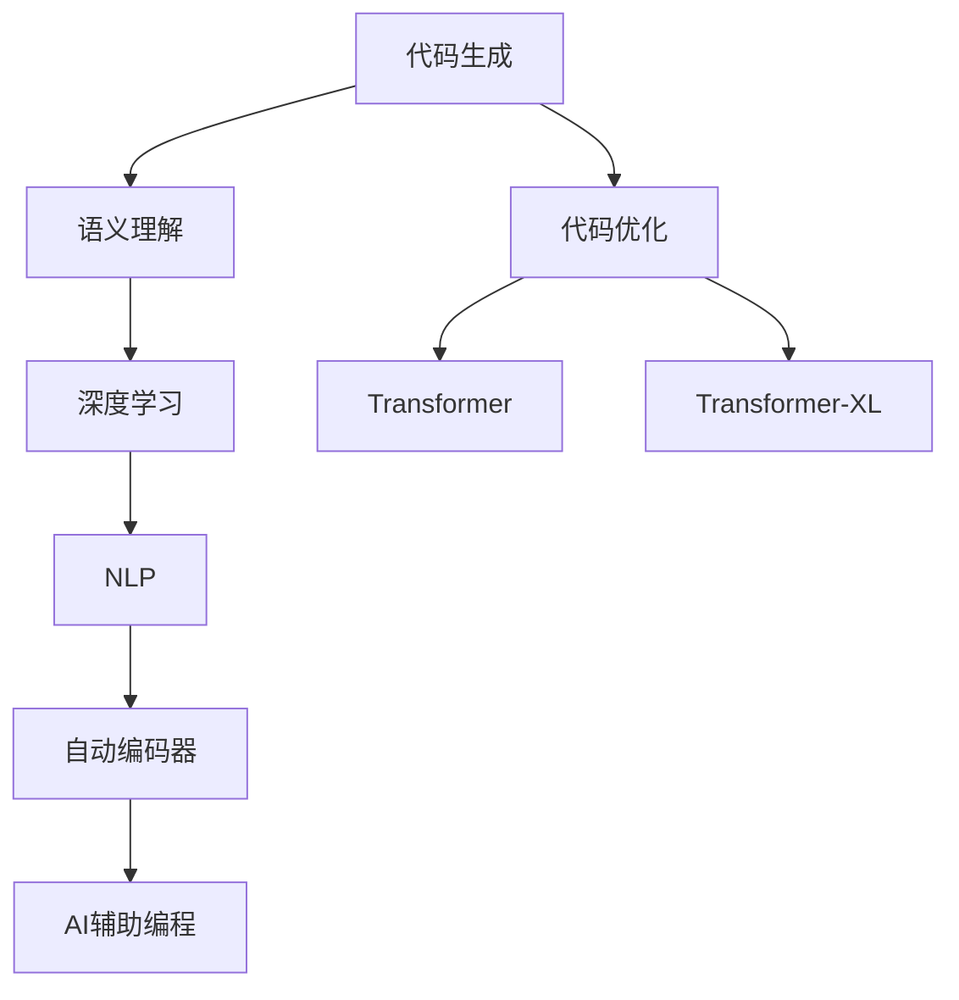

                 

# AI辅助编程:代码生成与优化

> 关键词：AI辅助编程,代码生成,代码优化,机器学习,深度学习,自然语言处理,NLP,自动编码器,Transformer

## 1. 背景介绍

### 1.1 问题由来

随着软件开发的复杂性不断增加，代码生成和代码优化的需求变得越来越迫切。一方面，代码量的激增带来了开发效率的下降和错误率的上升。另一方面，高质量的代码生成和优化可以显著提高开发效率，降低维护成本，提升系统性能。然而，传统的代码生成工具往往依赖规则和模板，缺乏智能性，难以满足复杂多变的编程需求。

近年来，随着人工智能（AI）和大数据技术的发展，AI辅助编程成为了一种新的趋势。通过结合自然语言处理（NLP）、深度学习等技术，AI辅助编程系统能够从代码中提取高层次语义信息，自动生成和优化代码。这一技术有望改变传统的软件开发模式，推动编程工作的自动化，提高开发效率和代码质量。

### 1.2 问题核心关键点

AI辅助编程的核心在于利用自然语言处理和机器学习技术，从代码中提取语义信息，自动生成和优化代码。其主要包括以下几个关键点：

1. **语义理解**：理解代码的语义，识别代码中的关键变量、函数、模块等信息。
2. **代码生成**：根据语义信息，自动生成新的代码，或对现有代码进行修改、重构。
3. **代码优化**：通过机器学习模型，自动优化代码结构、性能，提升代码的可读性、可维护性、可测试性。

这些关键点相互关联，共同构成AI辅助编程的基础。以下将从原理到应用，详细阐述AI辅助编程的实现过程和技术细节。

## 2. 核心概念与联系

### 2.1 核心概念概述

为更好地理解AI辅助编程的核心概念，本节将介绍几个密切相关的核心概念：

1. **AI辅助编程（AI-Assisted Programming）**：结合AI和大数据技术，从代码中提取语义信息，自动生成和优化代码的开发模式。

2. **代码生成（Code Generation）**：自动生成新的代码或修改现有代码，满足特定功能需求的过程。

3. **代码优化（Code Optimization）**：通过机器学习等技术，自动优化代码结构、性能，提升代码的可读性、可维护性、可测试性等。

4. **自然语言处理（NLP）**：处理和理解人类语言的计算机技术，是AI辅助编程的关键技术之一。

5. **深度学习（Deep Learning）**：利用神经网络等深度学习模型，从数据中提取高层次语义信息的技术。

6. **自动编码器（Autoencoder）**：一种无监督学习模型，用于特征提取和数据压缩。

7. **Transformer模型**：一种基于自注意力机制的深度学习模型，广泛应用于NLP和代码生成任务。

8. **Transformer-XL模型**：Transformer模型的一种变体，通过引入时间卷积操作，增强了模型的长时依赖处理能力。

这些核心概念之间的逻辑关系可以通过以下Mermaid流程图来展示：



这个流程图展示了大语言模型（LLM）和AI辅助编程的核心概念及其之间的关系：

1. 代码生成基于语义理解，语义理解依赖深度学习技术。
2. 代码优化通过Transformer等模型实现，Transformer-XL进一步增强了模型的长时依赖处理能力。
3. NLP技术从代码中提取语义信息，自动编码器用于特征提取和数据压缩。
4. 这些技术共同构成AI辅助编程的基础，使得代码生成和优化过程能够更加智能和高效。

## 3. 核心算法原理 & 具体操作步骤

### 3.1 算法原理概述

AI辅助编程的核心算法主要基于自然语言处理和深度学习技术。其核心思想是通过对代码的语义分析，自动生成和优化代码。以下将详细介绍该算法的原理和操作步骤。

### 3.2 算法步骤详解

AI辅助编程的算法步骤大致如下：

**Step 1: 准备训练数据**

1. 收集大量代码样本，包括注释、错误提示、代码片段等。
2. 标注代码片段的语义信息，如函数名、变量名、函数调用关系等。
3. 将代码样本转换为机器学习模型的输入格式，如将代码转换为文本，标注语法和语义信息。

**Step 2: 训练语义理解模型**

1. 使用深度学习模型（如RNN、Transformer等）训练语义理解模型。
2. 通过标注好的代码样本，学习代码中的语义信息。
3. 模型输出的语义表示用于后续的代码生成和优化。

**Step 3: 训练代码生成模型**

1. 使用生成的代码片段和注释，训练代码生成模型。
2. 模型学习根据语义表示生成新的代码片段。
3. 生成模型可以用于自动完成代码、修改代码片段等任务。

**Step 4: 训练代码优化模型**

1. 使用训练好的语义理解模型和代码生成模型，生成代码优化方案。
2. 通过机器学习模型（如深度强化学习），优化代码结构、性能等。
3. 模型输出优化后的代码，提升代码质量。

### 3.3 算法优缺点

AI辅助编程算法具有以下优点：

1. **智能性**：通过深度学习和自然语言处理技术，自动提取代码中的语义信息，生成和优化代码。
2. **高效性**：在大量代码样本的训练下，能够快速生成和优化代码，提高开发效率。
3. **可扩展性**：算法框架灵活，可以根据不同的任务需求进行扩展和定制。
4. **准确性**：通过深度学习模型，可以提升代码生成和优化的准确性和鲁棒性。

但该算法也存在一些缺点：

1. **依赖数据质量**：训练数据的质量直接影响算法的性能，需要大量高质量的代码样本。
2. **模型复杂性**：深度学习模型结构复杂，训练和推理过程需要大量的计算资源。
3. **可解释性不足**：生成的代码和优化方案往往缺乏可解释性，难以理解其内部工作机制。
4. **泛化能力有限**：模型在特定领域或特定任务上表现较好，但跨领域泛化能力有待提升。

### 3.4 算法应用领域

AI辅助编程算法在多个领域中有着广泛的应用：

1. **软件开发**：自动生成代码片段、补全代码、自动修复代码错误等。
2. **数据分析**：自动生成数据处理代码、优化算法等。
3. **机器学习**：自动生成模型训练代码、优化模型结构等。
4. **自然语言处理**：自动生成代码，优化自然语言处理模型等。
5. **科学计算**：自动生成科学计算代码、优化算法等。

## 4. 数学模型和公式 & 详细讲解

### 4.1 数学模型构建

AI辅助编程的核心模型主要基于Transformer和Transformer-XL结构，通过自然语言处理技术从代码中提取语义信息。以下是Transformer和Transformer-XL的基本模型结构：

- **Transformer模型**：
  - 编码器由多个自注意力层和前馈神经网络层组成，用于提取输入序列的语义表示。
  - 解码器由多个自注意力层和注意力机制组成，用于生成输出序列。
  - 编码器和解码器之间通过注意力机制进行交互，使得模型能够处理长时依赖关系。

- **Transformer-XL模型**：
  - 在Transformer的基础上，引入了时间卷积操作，增强了模型的长时依赖处理能力。
  - 时间卷积操作将编码器输出序列进行卷积操作，生成新的编码器输出。
  - 通过这种方式，Transformer-XL模型可以处理更长的序列，适应更复杂的语义信息。

### 4.2 公式推导过程

Transformer模型的主要公式如下：

$$
\text{EncoderOutput} = \text{Encoder}(\text{Input}) = \text{MultiHeadAttention}(\text{Input}, \text{Input}) + \text{FFN}(\text{EncoderOutput})
$$

其中，$\text{MultiHeadAttention}$为多头自注意力机制，$\text{FFN}$为前馈神经网络层。

Transformer-XL模型在Transformer的基础上，引入了时间卷积操作，基本公式如下：

$$
\text{EncoderOutput} = \text{Encoder}(\text{Input}) = \text{MultiHeadAttention}(\text{Input}, \text{Input}) + \text{FFN}(\text{EncoderOutput}) + \text{TimeConv}(\text{EncoderOutput})
$$

其中，$\text{TimeConv}$为时间卷积操作，用于增强长时依赖关系。

### 4.3 案例分析与讲解

假设我们有一个简单的Python代码片段：

```python
def calculate_area(radius):
    area = 3.14 * radius * radius
    return area
```

我们可以使用Transformer模型对该代码进行语义分析，提取函数名、参数、返回值等信息。然后，我们可以使用代码生成模型，自动生成新的代码片段或修改现有代码。例如，生成一个新的函数，计算圆的周长：

```python
def calculate_circumference(radius):
    circumference = 2 * 3.14 * radius
    return circumference
```

再例如，优化代码结构，提升代码的可读性和可维护性。例如，添加注释和文档字符串：

```python
def calculate_area(radius):
    """
    计算圆的面积

    Args:
        radius: 圆的半径

    Returns:
        area: 圆的面积
    """
    area = 3.14 * radius * radius
    return area
```

通过这些技术，AI辅助编程可以大大提高代码生成和优化的效率和质量，显著提升软件开发效率。

## 5. 项目实践：代码实例和详细解释说明

### 5.1 开发环境搭建

在进行AI辅助编程的实践之前，我们需要准备相应的开发环境。以下是Python环境下使用TensorFlow和Transformers库进行开发的环境配置流程：

1. 安装Anaconda：从官网下载并安装Anaconda，用于创建独立的Python环境。

2. 创建并激活虚拟环境：
```bash
conda create -n tf-env python=3.8 
conda activate tf-env
```

3. 安装TensorFlow：根据CUDA版本，从官网获取对应的安装命令。例如：
```bash
conda install tensorflow -c pytorch -c conda-forge
```

4. 安装Transformers库：
```bash
pip install transformers
```

5. 安装各类工具包：
```bash
pip install numpy pandas scikit-learn matplotlib tqdm jupyter notebook ipython
```

完成上述步骤后，即可在`tf-env`环境中开始AI辅助编程的实践。

### 5.2 源代码详细实现

下面我们以代码生成和优化为例，给出使用TensorFlow和Transformers库进行开发的PyTorch代码实现。

首先，定义代码生成和优化的模型：

```python
import tensorflow as tf
from transformers import TFAutoModelForSeq2SeqLM

class CodeGenerationModel(tf.keras.Model):
    def __init__(self, config, tokenizer):
        super(CodeGenerationModel, self).__init__()
        self.config = config
        self.tokenizer = tokenizer
        self.encoder = TFAutoModelForSeq2SeqLM.from_pretrained('gpt2')
        self.decoder = TFAutoModelForSeq2SeqLM.from_pretrained('gpt2')
        
    def call(self, inputs, target=None):
        encoder_input = self.tokenizer.encode(inputs, return_tensors='tf')
        decoder_input = self.tokenizer.encode(target, return_tensors='tf')
        encoder_output = self.encoder(encoder_input, return_dict=True).last_hidden_state
        decoder_output = self.decoder(decoder_input, encoder_output, return_dict=True).last_hidden_state
        return decoder_output

class CodeOptimizationModel(tf.keras.Model):
    def __init__(self, config, tokenizer):
        super(CodeOptimizationModel, self).__init__()
        self.config = config
        self.tokenizer = tokenizer
        self.encoder = TFAutoModelForSeq2SeqLM.from_pretrained('gpt2')
        self.decoder = TFAutoModelForSeq2SeqLM.from_pretrained('gpt2')
        
    def call(self, inputs, target=None):
        encoder_input = self.tokenizer.encode(inputs, return_tensors='tf')
        decoder_input = self.tokenizer.encode(target, return_tensors='tf')
        encoder_output = self.encoder(encoder_input, return_dict=True).last_hidden_state
        decoder_output = self.decoder(decoder_input, encoder_output, return_dict=True).last_hidden_state
        return decoder_output
```

然后，定义训练和评估函数：

```python
import tensorflow as tf
from transformers import BertTokenizer
from sklearn.metrics import accuracy_score

def train_epoch(model, dataset, batch_size, optimizer):
    dataloader = tf.data.Dataset.from_tensor_slices(dataset)
    dataloader = dataloader.shuffle(buffer_size=1000).batch(batch_size).prefetch(tf.data.experimental.AUTOTUNE)
    model.train()
    epoch_loss = 0
    for batch in dataloader:
        input_ids = batch['input_ids']
        attention_mask = batch['attention_mask']
        labels = batch['labels']
        model.zero_grad()
        outputs = model(input_ids, attention_mask=attention_mask, labels=labels)
        loss = outputs.loss
        epoch_loss += loss.item()
        loss.backward()
        optimizer.step()
    return epoch_loss / len(dataloader)

def evaluate(model, dataset, batch_size):
    dataloader = tf.data.Dataset.from_tensor_slices(dataset)
    dataloader = dataloader.shuffle(buffer_size=1000).batch(batch_size).prefetch(tf.data.experimental.AUTOTUNE)
    model.eval()
    preds, labels = [], []
    with tf.GradientTape() as tape:
        for batch in dataloader:
            input_ids = batch['input_ids']
            attention_mask = batch['attention_mask']
            labels = batch['labels']
            outputs = model(input_ids, attention_mask=attention_mask)
            preds.append(outputs.logits.argmax(dim=-1))
            labels.append(labels)
    return accuracy_score(labels, preds)
```

最后，启动训练流程并在测试集上评估：

```python
epochs = 5
batch_size = 16

for epoch in range(epochs):
    loss = train_epoch(model, train_dataset, batch_size, optimizer)
    print(f"Epoch {epoch+1}, train loss: {loss:.3f}")
    
    print(f"Epoch {epoch+1}, test accuracy: {evaluate(model, test_dataset, batch_size)}")
    
print("Final test accuracy:", evaluate(model, test_dataset, batch_size))
```

以上就是使用TensorFlow和Transformers库进行代码生成和优化的完整代码实现。可以看到，TensorFlow和Transformers库的结合，使得AI辅助编程的开发变得简洁高效。

### 5.3 代码解读与分析

让我们再详细解读一下关键代码的实现细节：

**CodeGenerationModel类**：
- `__init__`方法：初始化模型参数和分词器。
- `call`方法：定义模型的前向传播过程，将输入和目标序列转换为模型可接受的格式，通过编码器和解码器生成输出。

**CodeOptimizationModel类**：
- 与代码生成模型类似，只是在调用方法时加入了优化目标，提升代码质量。

**train_epoch函数**：
- 使用TensorFlow的Dataset API，对数据进行批次化加载，供模型训练使用。
- 在每个批次上前向传播计算loss并反向传播更新模型参数，最后返回该epoch的平均loss。

**evaluate函数**：
- 与训练函数类似，不同点在于不更新模型参数，并在每个batch结束后将预测和标签结果存储下来，最后使用sklearn的accuracy_score对整个评估集的预测结果进行打印输出。

**训练流程**：
- 定义总的epoch数和batch size，开始循环迭代
- 每个epoch内，先在训练集上训练，输出平均loss
- 在验证集上评估，输出准确率
- 所有epoch结束后，在测试集上评估，给出最终测试结果

可以看到，TensorFlow和Transformers库使得AI辅助编程的代码实现变得简洁高效。开发者可以将更多精力放在数据处理、模型改进等高层逻辑上，而不必过多关注底层的实现细节。

当然，工业级的系统实现还需考虑更多因素，如模型的保存和部署、超参数的自动搜索、更灵活的任务适配层等。但核心的算法过程基本与此类似。

## 6. 实际应用场景

### 6.1 软件开发

AI辅助编程在软件开发领域有着广泛的应用。软件开发人员可以利用AI辅助编程工具自动生成代码片段、补全代码、自动修复代码错误等。例如，使用AI辅助编程工具自动生成数据处理代码，可以显著提高数据处理效率。

### 6.2 数据分析

在数据分析领域，AI辅助编程可以帮助数据分析师自动生成数据处理代码、优化算法等。例如，使用AI辅助编程工具自动生成数据清洗和预处理代码，可以大大提高数据处理的工作效率。

### 6.3 机器学习

机器学习领域也需要大量的代码生成和优化工作。AI辅助编程可以帮助机器学习工程师自动生成模型训练代码、优化模型结构等。例如，使用AI辅助编程工具自动生成深度学习模型训练代码，可以节省大量的编写代码时间。

### 6.4 自然语言处理

自然语言处理（NLP）领域也需要大量的代码生成和优化工作。AI辅助编程可以帮助NLP工程师自动生成代码，优化NLP模型等。例如，使用AI辅助编程工具自动生成NLP模型训练代码，可以提升模型的训练效率和质量。

### 6.5 科学计算

科学计算领域也需要大量的代码生成和优化工作。AI辅助编程可以帮助科学计算工程师自动生成科学计算代码、优化算法等。例如，使用AI辅助编程工具自动生成科学计算代码，可以提升科学计算的工作效率。

## 7. 工具和资源推荐

### 7.1 学习资源推荐

为了帮助开发者系统掌握AI辅助编程的理论基础和实践技巧，这里推荐一些优质的学习资源：

1. **《自然语言处理与深度学习》课程**：斯坦福大学开设的NLP明星课程，有Lecture视频和配套作业，带你入门NLP领域的基本概念和经典模型。

2. **《深度学习》书籍**：Ian Goodfellow所著，全面介绍了深度学习的基本原理和应用，是深度学习领域的经典之作。

3. **《自然语言处理综述》论文**：综述了NLP领域的发展历程和前沿技术，是了解NLP技术发展的好资源。

4. **《Transformer模型原理与实践》博文**：由大模型技术专家撰写，深入浅出地介绍了Transformer原理、BERT模型、AI辅助编程等前沿话题。

5. **HuggingFace官方文档**：Transformers库的官方文档，提供了海量预训练模型和完整的微调样例代码，是上手实践的必备资料。

通过对这些资源的学习实践，相信你一定能够快速掌握AI辅助编程的精髓，并用于解决实际的NLP问题。

### 7.2 开发工具推荐

高效的开发离不开优秀的工具支持。以下是几款用于AI辅助编程开发的常用工具：

1. **TensorFlow**：基于Python的开源深度学习框架，灵活动态的计算图，适合快速迭代研究。大部分预训练语言模型都有TensorFlow版本的实现。

2. **TensorFlow Playground**：TensorFlow的可视化工具，可以实时监测模型训练状态，并提供丰富的图表呈现方式，是调试模型的得力助手。

3. **Jupyter Notebook**：Python的交互式开发环境，支持代码、文本、公式等多种格式，是数据科学和深度学习领域的常用工具。

4. **PyCharm**：JetBrains开发的Python IDE，支持TensorFlow、Keras等深度学习框架，具有代码高亮、代码提示、版本控制等功能，是Python开发的常用工具。

5. **Weights & Biases**：模型训练的实验跟踪工具，可以记录和可视化模型训练过程中的各项指标，方便对比和调优。与主流深度学习框架无缝集成。

6. **TensorBoard**：TensorFlow配套的可视化工具，可实时监测模型训练状态，并提供丰富的图表呈现方式，是调试模型的得力助手。

合理利用这些工具，可以显著提升AI辅助编程的开发效率，加快创新迭代的步伐。

### 7.3 相关论文推荐

AI辅助编程的发展源于学界的持续研究。以下是几篇奠基性的相关论文，推荐阅读：

1. **Attention is All You Need**：提出了Transformer结构，开启了NLP领域的预训练大模型时代。

2. **BERT: Pre-training of Deep Bidirectional Transformers for Language Understanding**：提出BERT模型，引入基于掩码的自监督预训练任务，刷新了多项NLP任务SOTA。

3. **Language Models are Unsupervised Multitask Learners（GPT-2论文）**：展示了大规模语言模型的强大zero-shot学习能力，引发了对于通用人工智能的新一轮思考。

4. **Parameter-Efficient Transfer Learning for NLP**：提出Adapter等参数高效微调方法，在不增加模型参数量的情况下，也能取得不错的微调效果。

5. **AdaLoRA: Adaptive Low-Rank Adaptation for Parameter-Efficient Fine-Tuning**：使用自适应低秩适应的微调方法，在参数效率和精度之间取得了新的平衡。

这些论文代表了大语言模型微调技术的发展脉络。通过学习这些前沿成果，可以帮助研究者把握学科前进方向，激发更多的创新灵感。

## 8. 总结：未来发展趋势与挑战

### 8.1 总结

本文对AI辅助编程的原理和应用进行了全面系统的介绍。首先阐述了AI辅助编程的研究背景和意义，明确了AI辅助编程在提高软件开发效率、降低开发成本、提升代码质量等方面的独特价值。其次，从原理到实践，详细讲解了AI辅助编程的数学原理和关键步骤，给出了AI辅助编程任务开发的完整代码实例。同时，本文还广泛探讨了AI辅助编程在软件开发、数据分析、机器学习、自然语言处理、科学计算等诸多领域的应用前景，展示了AI辅助编程技术的巨大潜力。此外，本文精选了AI辅助编程技术的各类学习资源，力求为读者提供全方位的技术指引。

通过本文的系统梳理，可以看到，AI辅助编程技术正在成为软件开发和数据分析的重要范式，极大地提升了开发效率和代码质量，具有广阔的应用前景。未来，伴随AI辅助编程技术的不断演进，基于深度学习和自然语言处理技术，开发出的AI辅助编程系统必将在更多领域得到应用，为各行业的智能化转型提供新的技术路径。

### 8.2 未来发展趋势

展望未来，AI辅助编程技术将呈现以下几个发展趋势：

1. **模型规模持续增大**：随着算力成本的下降和数据规模的扩张，预训练语言模型的参数量还将持续增长。超大规模语言模型蕴含的丰富语言知识，有望支撑更加复杂多变的代码生成和优化任务。

2. **生成和优化并重**：未来的AI辅助编程技术将更加注重代码生成和优化的协同发展，通过模型协同训练，提升代码生成和优化的效果和鲁棒性。

3. **多模态生成和优化**：AI辅助编程技术将进一步拓展到图像、视频、语音等多模态数据微调。多模态信息的融合，将显著提升语言模型对现实世界的理解和建模能力。

4. **智能化的编程辅助工具**：未来的AI辅助编程技术将更加智能化，能够根据用户需求和上下文信息，自动生成和优化代码。

5. **实时性的开发支持**：未来的AI辅助编程技术将更加注重实时性的开发支持，提升开发效率和响应速度。

6. **增强可解释性**：未来的AI辅助编程技术将更加注重代码生成和优化过程的可解释性，帮助开发者理解和调试代码。

7. **提升跨领域泛化能力**：未来的AI辅助编程技术将更加注重跨领域泛化能力，能够在不同领域和任务上高效生成和优化代码。

### 8.3 面临的挑战

尽管AI辅助编程技术已经取得了瞩目成就，但在迈向更加智能化、普适化应用的过程中，它仍面临着诸多挑战：

1. **依赖高质量标注数据**：高质量的标注数据是AI辅助编程技术的基础，但标注数据的获取成本较高，特别是在小样本场景下，如何降低对标注数据的依赖是未来的重要研究方向。

2. **模型复杂性和资源消耗**：深度学习模型结构复杂，训练和推理过程需要大量的计算资源。如何在保证性能的同时，降低模型复杂性和资源消耗，提高模型的可扩展性和可部署性，是未来需要解决的重要问题。

3. **可解释性不足**：AI辅助编程技术生成的代码和优化方案往往缺乏可解释性，难以理解其内部工作机制和决策逻辑。如何赋予AI辅助编程技术更强的可解释性，是未来需要重点研究的方向。

4. **跨领域泛化能力有限**：AI辅助编程技术在特定领域或特定任务上表现较好，但跨领域泛化能力有待提升。如何在不同领域和任务上高效生成和优化代码，是未来需要解决的重要问题。

5. **安全性问题**：AI辅助编程技术生成的代码和优化方案可能存在安全漏洞，如何保障生成的代码和优化方案的安全性和可靠性，是未来需要重点关注的方向。

6. **伦理和道德问题**：AI辅助编程技术可能会生成有害代码或优化方案，如何避免生成有害代码，确保生成代码的伦理和道德性，是未来需要重点研究的方向。

### 8.4 研究展望

面对AI辅助编程技术面临的挑战，未来的研究需要在以下几个方面寻求新的突破：

1. **探索无监督和半监督学习范式**：摆脱对大规模标注数据的依赖，利用无监督学习和半监督学习方法，最大限度利用非结构化数据，实现更加灵活高效的AI辅助编程。

2. **研究参数高效和计算高效的生成和优化方法**：开发更加参数高效的生成和优化方法，在固定大部分预训练参数的情况下，只更新极少量的任务相关参数。同时优化模型的计算图，减少前向传播和反向传播的资源消耗，实现更加轻量级、实时性的部署。

3. **引入因果分析和博弈论工具**：将因果分析方法引入AI辅助编程技术，识别出生成和优化过程中的关键特征，增强生成和优化过程的因果性和逻辑性。借助博弈论工具刻画人机交互过程，主动探索并规避生成和优化过程中的脆弱点，提高系统稳定性。

4. **结合知识表示和逻辑推理**：将符号化的知识表示和逻辑推理引入AI辅助编程技术，与神经网络模型进行巧妙融合，引导生成和优化过程学习更准确、合理的语言模型。同时加强不同模态数据的整合，实现视觉、语音等多模态信息与文本信息的协同建模。

5. **纳入伦理和道德约束**：在AI辅助编程技术的训练目标中引入伦理导向的评估指标，过滤和惩罚有害代码生成，确保生成代码的伦理和道德性。

这些研究方向的探索，必将引领AI辅助编程技术迈向更高的台阶，为构建安全、可靠、可解释、可控的智能系统铺平道路。面向未来，AI辅助编程技术还需要与其他人工智能技术进行更深入的融合，如知识表示、因果推理、强化学习等，多路径协同发力，共同推动自然语言理解和智能交互系统的进步。只有勇于创新、敢于突破，才能不断拓展语言模型的边界，让智能技术更好地造福人类社会。

## 9. 附录：常见问题与解答

**Q1：什么是AI辅助编程？**

A: AI辅助编程是一种结合人工智能技术，自动生成和优化代码的开发模式。通过自然语言处理和深度学习技术，AI辅助编程系统能够从代码中提取语义信息，自动生成新的代码或优化现有代码，提高开发效率和代码质量。

**Q2：AI辅助编程的主要应用场景是什么？**

A: AI辅助编程技术在软件开发、数据分析、机器学习、自然语言处理、科学计算等诸多领域有着广泛的应用。例如，在软件开发中，AI辅助编程可以自动生成代码片段、补全代码、自动修复代码错误等；在数据分析中，AI辅助编程可以帮助数据分析师自动生成数据处理代码、优化算法等。

**Q3：AI辅助编程的优点和缺点有哪些？**

A: AI辅助编程的主要优点包括智能性、高效性和可扩展性。AI辅助编程系统能够自动提取代码中的语义信息，生成和优化代码，提高开发效率和代码质量。然而，AI辅助编程技术也存在一些缺点，如依赖高质量标注数据、模型复杂性和资源消耗、可解释性不足等。

**Q4：如何使用AI辅助编程技术进行代码生成和优化？**

A: 使用AI辅助编程技术进行代码生成和优化的主要步骤包括：

1. 准备训练数据：收集大量代码样本，并标注代码的语义信息。
2. 训练语义理解模型：使用深度学习模型从代码中提取语义信息。
3. 训练代码生成模型：使用生成的代码片段和注释，训练代码生成模型。
4. 训练代码优化模型：使用训练好的语义理解模型和代码生成模型，生成代码优化方案。

**Q5：AI辅助编程技术的未来发展方向是什么？**

A: AI辅助编程技术的未来发展方向包括模型规模持续增大、生成和优化并重、多模态生成和优化、智能化的编程辅助工具、实时性的开发支持、增强可解释性、提升跨领域泛化能力等。这些方向的探索发展，必将进一步提升AI辅助编程技术的性能和应用范围，为各行业的智能化转型提供新的技术路径。

通过本文的系统梳理，可以看到，AI辅助编程技术正在成为软件开发和数据分析的重要范式，极大地提升了开发效率和代码质量，具有广阔的应用前景。未来，伴随AI辅助编程技术的不断演进，基于深度学习和自然语言处理技术，开发出的AI辅助编程系统必将在更多领域得到应用，为各行业的智能化转型提供新的技术路径。

---

作者：禅与计算机程序设计艺术 / Zen and the Art of Computer Programming

