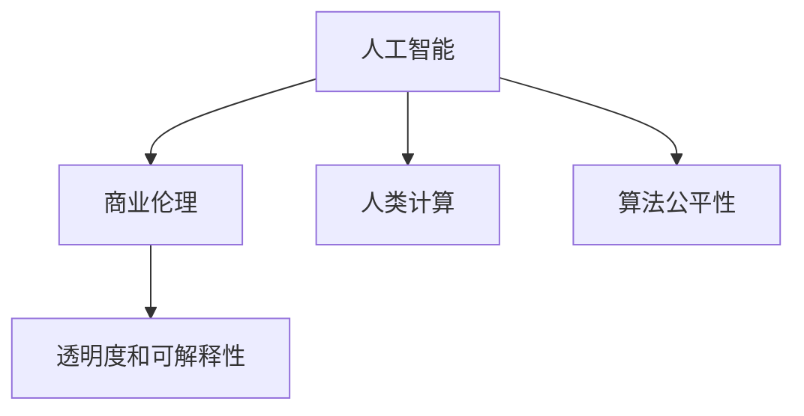

                 

# AI驱动的创新：人类计算在商业中的道德考虑因素与应用趋势预测

> 关键词：人工智能,商业伦理,人类计算,道德哲学,算法公平性

## 1. 背景介绍

### 1.1 问题由来

在过去的几十年里，人工智能(AI)技术迅猛发展，已经渗透到了我们生活的方方面面。从智能手机中的语音助手，到医疗诊断的智能系统，再到自动驾驶车辆，AI的触角无处不在。然而，随着AI技术的深入应用，关于其在商业领域中的道德考虑因素也日益受到关注。

在商业环境中，AI系统被用来提升效率、降低成本、改善决策，但其广泛应用也带来了新的伦理和道德问题。比如，数据隐私、算法偏见、自动化对就业的影响等。这些问题不仅仅是技术问题，更涉及社会公平、责任归属、法律规制等复杂议题。

### 1.2 问题核心关键点

当前，AI在商业中的伦理和道德问题主要集中在以下几个方面：

1. **数据隐私**：AI系统通常需要大量的数据进行训练，而这些数据往往包含个人隐私信息。如何在保护隐私的前提下，合理利用数据，成为一个亟待解决的伦理问题。
2. **算法偏见**：由于数据本身的不均衡性或算法设计上的缺陷，AI系统可能会出现性别、种族、年龄等特征的偏见。如何在模型设计、训练和应用中避免偏见，确保公平性，是另一个重要课题。
3. **自动化对就业的影响**：AI和自动化技术的应用，在某些领域可能会导致大规模的就业结构性变化。如何在提高效率的同时，保护和重塑劳动市场，是一个复杂的社会问题。
4. **透明度和可解释性**：商业决策中，AI系统的决策过程往往缺乏透明度，难以解释。如何在保证商业竞争力的同时，提高算法的可解释性，增强公众信任，也是一个重要挑战。

### 1.3 问题研究意义

研究AI在商业中的伦理和道德问题，对于推动AI技术健康发展、构建公平正义的社会环境具有重要意义：

1. **促进技术良性发展**：通过深入分析AI技术在商业中的应用，可以发现并修正可能引发伦理问题的技术缺陷，推动技术向着更合理、更安全的方向发展。
2. **保障公众利益**：确保AI技术在应用中不会侵害个人隐私、影响社会公平，维护公众的合法权益。
3. **促进社会和谐**：通过合理的制度设计和政策引导，可以在AI技术发展与社会发展之间找到平衡点，构建和谐的社会环境。
4. **增强企业竞争力**：对于企业而言，合理应用AI技术，可以有效提升效率、降低成本、优化决策，增强市场竞争力。

## 2. 核心概念与联系

### 2.1 核心概念概述

为更好地理解AI在商业中的道德考虑因素与应用趋势，本节将介绍几个密切相关的核心概念：

- **人工智能**：通过算法和计算，使计算机系统能够模拟人类智能行为，包括学习、推理、感知、决策等。
- **商业伦理**：商业行为中应遵守的道德规范，如诚信、公正、责任等。
- **人类计算**：利用人类智慧和计算能力进行问题的求解和决策，强调人类在AI系统中的主导作用。
- **算法公平性**：AI系统在处理数据和生成决策时，确保不偏向任何特定群体或个人。
- **透明度和可解释性**：AI系统的决策过程应公开透明，用户应能够理解其工作原理和决策依据。

这些核心概念之间的逻辑关系可以通过以下Mermaid流程图来展示：



这个流程图展示了大语言模型与商业伦理、人类计算、算法公平性和透明度之间的内在联系：

1. 人工智能为商业提供了强大的工具，但也带来了伦理和道德问题。
2. 商业伦理为AI技术的应用提供了道德规范，确保技术向善。
3. 人类计算强调了人类在AI系统中的关键作用，避免过度依赖机器。
4. 算法公平性是确保AI系统公正处理数据和决策的重要原则。
5. 透明度和可解释性是增强AI系统可信度的关键要素。

这些概念共同构成了AI技术在商业应用的伦理框架，指导其在现实场景中的应用和优化。

## 3. 核心算法原理 & 具体操作步骤
### 3.1 算法原理概述

基于AI的商业应用，本质上是一个通过算法和数据生成决策的过程。其核心思想是：利用人工智能技术，基于数据驱动的方式，优化商业决策和运营流程，提高效率和效益。

形式化地，假设商业应用任务为 $T$，训练数据集为 $D=\{(x_i, y_i)\}_{i=1}^N$，其中 $x_i$ 表示输入（如客户信息、市场数据等），$y_i$ 表示目标输出（如客户满意度、市场份额等）。AI系统的目标是找到最优的映射函数 $f(x) = M(x; \theta)$，最小化预测误差：

$$
\min_{\theta} \sum_{i=1}^N \ell(f(x_i), y_i)
$$

其中 $\ell$ 为损失函数，用于衡量预测值与真实值之间的差异。

在实际应用中，AI系统的设计、训练和优化通常包括以下几个关键步骤：

1. 选择合适的算法和模型架构，如神经网络、决策树等。
2. 收集、清洗和处理数据，构建训练集。
3. 设置训练超参数，如学习率、迭代次数等。
4. 使用梯度下降等优化算法，最小化损失函数，更新模型参数。
5. 在验证集和测试集上评估模型性能，进行调优。

### 3.2 算法步骤详解

基于AI的商业应用流程一般包括以下几个关键步骤：

**Step 1: 数据收集与预处理**
- 收集相关业务数据，如客户信息、市场数据、销售数据等。
- 清洗和处理数据，如去除噪声、处理缺失值、特征工程等。
- 构建训练集、验证集和测试集，确保数据分布一致。

**Step 2: 选择合适的模型和算法**
- 根据任务特点，选择合适的深度学习模型，如卷积神经网络(CNN)、循环神经网络(RNN)、Transformer等。
- 设计合理的模型架构，如输入层、隐藏层、输出层等。
- 选择适合的优化算法，如随机梯度下降(SGD)、Adam等。

**Step 3: 模型训练**
- 将训练集输入模型，进行前向传播计算预测值。
- 计算预测值与真实值之间的损失，使用反向传播计算梯度。
- 根据优化算法和超参数，更新模型参数。
- 周期性在验证集上评估模型性能，决定是否触发Early Stopping。

**Step 4: 模型评估与优化**
- 在测试集上评估模型性能，如准确率、召回率、F1-score等。
- 根据评估结果，调整模型参数、超参数，进行模型优化。

**Step 5: 部署与监控**
- 将优化后的模型部署到生产环境中，供业务系统使用。
- 实时监控模型性能，如响应时间、准确率等。
- 定期更新模型，避免过拟合和性能下降。

### 3.3 算法优缺点

基于AI的商业应用方法具有以下优点：
1. 提高效率和效益。利用AI技术可以自动化处理大量数据，优化决策过程，提高运营效率。
2. 优化决策过程。通过数据分析和建模，可以发现潜在的市场趋势和客户需求，优化决策。
3. 增强竞争优势。AI技术可以提升企业在市场中的竞争力，获得更好的市场份额。

同时，该方法也存在一定的局限性：
1. 依赖高质量数据。AI系统的效果很大程度上取决于数据的质量和数量，获取高质量数据成本较高。
2. 模型复杂度。复杂的模型需要更高的计算资源和更多的数据支持，构建和维护成本较高。
3. 可解释性不足。AI模型的决策过程往往缺乏可解释性，难以对其推理逻辑进行分析和调试。
4. 技术门槛高。设计和实现AI系统需要较高的技术水平和专业知识，一般需要专业的团队和工具支持。

尽管存在这些局限性，但就目前而言，基于AI的商业应用方法仍是商业决策和运营的重要手段。未来相关研究的重点在于如何进一步降低数据依赖，提高模型的可解释性，降低技术门槛，同时兼顾公平性和伦理问题。

### 3.4 算法应用领域

基于AI的商业应用方法已经广泛应用于多个领域，涵盖了从金融、零售、医疗到制造、物流等多个行业。具体应用场景包括：

- 金融风控：利用AI系统进行客户信用评估、贷款风险控制、反欺诈检测等。
- 零售推荐：通过分析客户行为数据，AI系统可以提供个性化的商品推荐，提升用户体验和销售额。
- 医疗诊断：AI系统可以通过分析医疗影像、病历数据，辅助医生进行疾病诊断和治疗决策。
- 制造业质量控制：利用AI系统进行设备故障预测、生产过程优化，提高产品质量和生产效率。
- 物流仓储：AI系统可以优化仓储管理、路线规划、配送调度等，提升物流效率和成本控制。

除了上述这些经典应用外，AI技术在更多行业中的应用也在不断涌现，如智能客服、智能制造、智能交通等，为商业领域带来了革命性的变化。

## 4. 数学模型和公式 & 详细讲解 & 举例说明
### 4.1 数学模型构建

本节将使用数学语言对基于AI的商业应用过程进行更加严格的刻画。

假设商业应用任务为 $T$，训练数据集为 $D=\{(x_i, y_i)\}_{i=1}^N$，其中 $x_i \in \mathcal{X}, y_i \in \mathcal{Y}$。

定义模型 $M_{\theta}(x)$ 在输入 $x$ 上的预测结果为 $\hat{y} = M_{\theta}(x)$。训练集 $D$ 上的经验风险为：

$$
\mathcal{L}(\theta) = \frac{1}{N} \sum_{i=1}^N \ell(\hat{y_i}, y_i)
$$

其中 $\ell$ 为损失函数，用于衡量预测值与真实值之间的差异。训练目标是最小化经验风险，即找到最优参数：

$$
\theta^* = \mathop{\arg\min}_{\theta} \mathcal{L}(\theta)
$$

在实践中，我们通常使用基于梯度的优化算法（如SGD、Adam等）来近似求解上述最优化问题。设 $\eta$ 为学习率，$\lambda$ 为正则化系数，则参数的更新公式为：

$$
\theta \leftarrow \theta - \eta \nabla_{\theta}\mathcal{L}(\theta) - \eta\lambda\theta
$$

其中 $\nabla_{\theta}\mathcal{L}(\theta)$ 为损失函数对参数 $\theta$ 的梯度，可通过反向传播算法高效计算。

### 4.2 公式推导过程

以下我们以二分类任务为例，推导交叉熵损失函数及其梯度的计算公式。

假设模型 $M_{\theta}$ 在输入 $x$ 上的输出为 $\hat{y}=M_{\theta}(x) \in [0,1]$，表示样本属于正类的概率。真实标签 $y \in \{0,1\}$。则二分类交叉熵损失函数定义为：

$$
\ell(M_{\theta}(x),y) = -[y\log \hat{y} + (1-y)\log (1-\hat{y})]
$$

将其代入经验风险公式，得：

$$
\mathcal{L}(\theta) = -\frac{1}{N}\sum_{i=1}^N [y_i\log M_{\theta}(x_i)+(1-y_i)\log(1-M_{\theta}(x_i))]
$$

根据链式法则，损失函数对参数 $\theta_k$ 的梯度为：

$$
\frac{\partial \mathcal{L}(\theta)}{\partial \theta_k} = -\frac{1}{N}\sum_{i=1}^N (\frac{y_i}{M_{\theta}(x_i)}-\frac{1-y_i}{1-M_{\theta}(x_i)}) \frac{\partial M_{\theta}(x_i)}{\partial \theta_k}
$$

其中 $\frac{\partial M_{\theta}(x_i)}{\partial \theta_k}$ 可进一步递归展开，利用自动微分技术完成计算。

在得到损失函数的梯度后，即可带入参数更新公式，完成模型的迭代优化。重复上述过程直至收敛，最终得到适应商业任务的最优模型参数 $\theta^*$。

## 5. 项目实践：代码实例和详细解释说明
### 5.1 开发环境搭建

在进行商业应用开发前，我们需要准备好开发环境。以下是使用Python进行PyTorch开发的环境配置流程：

1. 安装Anaconda：从官网下载并安装Anaconda，用于创建独立的Python环境。

2. 创建并激活虚拟环境：
```bash
conda create -n pytorch-env python=3.8 
conda activate pytorch-env
```

3. 安装PyTorch：根据CUDA版本，从官网获取对应的安装命令。例如：
```bash
conda install pytorch torchvision torchaudio cudatoolkit=11.1 -c pytorch -c conda-forge
```

4. 安装Transformers库：
```bash
pip install transformers
```

5. 安装各类工具包：
```bash
pip install numpy pandas scikit-learn matplotlib tqdm jupyter notebook ipython
```

完成上述步骤后，即可在`pytorch-env`环境中开始商业应用开发。

### 5.2 源代码详细实现

这里我们以客户信用评估为例，给出使用Transformers库对金融风控模型进行微调的PyTorch代码实现。

首先，定义客户信用评估任务的数据处理函数：

```python
from transformers import BertTokenizer
from torch.utils.data import Dataset
import torch

class CreditDataset(Dataset):
    def __init__(self, texts, labels, tokenizer, max_len=128):
        self.texts = texts
        self.labels = labels
        self.tokenizer = tokenizer
        self.max_len = max_len
        
    def __len__(self):
        return len(self.texts)
    
    def __getitem__(self, item):
        text = self.texts[item]
        label = self.labels[item]
        
        encoding = self.tokenizer(text, return_tensors='pt', max_length=self.max_len, padding='max_length', truncation=True)
        input_ids = encoding['input_ids'][0]
        attention_mask = encoding['attention_mask'][0]
        
        # 对label进行编码
        encoded_labels = [1 if label == '1' else 0 for label in label]
        encoded_labels.extend([0] * (self.max_len - len(encoded_labels)))
        labels = torch.tensor(encoded_labels, dtype=torch.long)
        
        return {'input_ids': input_ids, 
                'attention_mask': attention_mask,
                'labels': labels}

# 标签与id的映射
label2id = {'1': 1, '0': 0}
id2label = {v: k for k, v in label2id.items()}

# 创建dataset
tokenizer = BertTokenizer.from_pretrained('bert-base-cased')

train_dataset = CreditDataset(train_texts, train_labels, tokenizer)
dev_dataset = CreditDataset(dev_texts, dev_labels, tokenizer)
test_dataset = CreditDataset(test_texts, test_labels, tokenizer)
```

然后，定义模型和优化器：

```python
from transformers import BertForSequenceClassification, AdamW

model = BertForSequenceClassification.from_pretrained('bert-base-cased', num_labels=2)

optimizer = AdamW(model.parameters(), lr=2e-5)
```

接着，定义训练和评估函数：

```python
from torch.utils.data import DataLoader
from tqdm import tqdm
from sklearn.metrics import classification_report

device = torch.device('cuda') if torch.cuda.is_available() else torch.device('cpu')
model.to(device)

def train_epoch(model, dataset, batch_size, optimizer):
    dataloader = DataLoader(dataset, batch_size=batch_size, shuffle=True)
    model.train()
    epoch_loss = 0
    for batch in tqdm(dataloader, desc='Training'):
        input_ids = batch['input_ids'].to(device)
        attention_mask = batch['attention_mask'].to(device)
        labels = batch['labels'].to(device)
        model.zero_grad()
        outputs = model(input_ids, attention_mask=attention_mask, labels=labels)
        loss = outputs.loss
        epoch_loss += loss.item()
        loss.backward()
        optimizer.step()
    return epoch_loss / len(dataloader)

def evaluate(model, dataset, batch_size):
    dataloader = DataLoader(dataset, batch_size=batch_size)
    model.eval()
    preds, labels = [], []
    with torch.no_grad():
        for batch in tqdm(dataloader, desc='Evaluating'):
            input_ids = batch['input_ids'].to(device)
            attention_mask = batch['attention_mask'].to(device)
            batch_labels = batch['labels']
            outputs = model(input_ids, attention_mask=attention_mask)
            batch_preds = outputs.logits.argmax(dim=2).to('cpu').tolist()
            batch_labels = batch_labels.to('cpu').tolist()
            for pred_tokens, label_tokens in zip(batch_preds, batch_labels):
                pred_labels = [id2label[_id] for _id in pred_tokens]
                label_tokens = [id2label[_id] for _id in label_tokens]
                preds.append(pred_labels[:len(label_tokens)])
                labels.append(label_tokens)
                
    print(classification_report(labels, preds))
```

最后，启动训练流程并在测试集上评估：

```python
epochs = 5
batch_size = 16

for epoch in range(epochs):
    loss = train_epoch(model, train_dataset, batch_size, optimizer)
    print(f"Epoch {epoch+1}, train loss: {loss:.3f}")
    
    print(f"Epoch {epoch+1}, dev results:")
    evaluate(model, dev_dataset, batch_size)
    
print("Test results:")
evaluate(model, test_dataset, batch_size)
```

以上就是使用PyTorch对金融风控模型进行微调的完整代码实现。可以看到，得益于Transformers库的强大封装，我们可以用相对简洁的代码完成BERT模型的加载和微调。

### 5.3 代码解读与分析

让我们再详细解读一下关键代码的实现细节：

**CreditDataset类**：
- `__init__`方法：初始化文本、标签、分词器等关键组件。
- `__len__`方法：返回数据集的样本数量。
- `__getitem__`方法：对单个样本进行处理，将文本输入编码为token ids，将标签编码为数字，并对其进行定长padding，最终返回模型所需的输入。

**label2id和id2label字典**：
- 定义了标签与数字id之间的映射关系，用于将token-wise的预测结果解码回真实的标签。

**训练和评估函数**：
- 使用PyTorch的DataLoader对数据集进行批次化加载，供模型训练和推理使用。
- 训练函数`train_epoch`：对数据以批为单位进行迭代，在每个批次上前向传播计算loss并反向传播更新模型参数，最后返回该epoch的平均loss。
- 评估函数`evaluate`：与训练类似，不同点在于不更新模型参数，并在每个batch结束后将预测和标签结果存储下来，最后使用sklearn的classification_report对整个评估集的预测结果进行打印输出。

**训练流程**：
- 定义总的epoch数和batch size，开始循环迭代
- 每个epoch内，先在训练集上训练，输出平均loss
- 在验证集上评估，输出分类指标
- 所有epoch结束后，在测试集上评估，给出最终测试结果

可以看到，PyTorch配合Transformers库使得BERT微调的代码实现变得简洁高效。开发者可以将更多精力放在数据处理、模型改进等高层逻辑上，而不必过多关注底层的实现细节。

当然，工业级的系统实现还需考虑更多因素，如模型的保存和部署、超参数的自动搜索、更灵活的任务适配层等。但核心的微调范式基本与此类似。

## 6. 实际应用场景
### 6.1 智能客服系统

基于AI驱动的智能客服系统，可以广泛应用于各行业客户服务场景。传统客服往往需要配备大量人力，高峰期响应缓慢，且一致性和专业性难以保证。而使用AI驱动的智能客服系统，可以7x24小时不间断服务，快速响应客户咨询，用自然流畅的语言解答各类常见问题。

在技术实现上，可以收集企业内部的历史客服对话记录，将问题和最佳答复构建成监督数据，在此基础上对预训练语言模型进行微调。微调后的智能客服系统能够自动理解用户意图，匹配最合适的答案模板进行回复。对于客户提出的新问题，还可以接入检索系统实时搜索相关内容，动态组织生成回答。如此构建的智能客服系统，能大幅提升客户咨询体验和问题解决效率。

### 6.2 金融舆情监测

金融机构需要实时监测市场舆论动向，以便及时应对负面信息传播，规避金融风险。传统的人工监测方式成本高、效率低，难以应对网络时代海量信息爆发的挑战。基于AI驱动的文本分类和情感分析技术，为金融舆情监测提供了新的解决方案。

具体而言，可以收集金融领域相关的新闻、报道、评论等文本数据，并对其进行主题标注和情感标注。在此基础上对预训练语言模型进行微调，使其能够自动判断文本属于何种主题，情感倾向是正面、中性还是负面。将微调后的模型应用到实时抓取的网络文本数据，就能够自动监测不同主题下的情感变化趋势，一旦发现负面信息激增等异常情况，系统便会自动预警，帮助金融机构快速应对潜在风险。

### 6.3 个性化推荐系统

当前的推荐系统往往只依赖用户的历史行为数据进行物品推荐，无法深入理解用户的真实兴趣偏好。基于AI驱动的个性化推荐系统，可以更好地挖掘用户行为背后的语义信息，从而提供更精准、多样的推荐内容。

在实践中，可以收集用户浏览、点击、评论、分享等行为数据，提取和用户交互的物品标题、描述、标签等文本内容。将文本内容作为模型输入，用户的后续行为（如是否点击、购买等）作为监督信号，在此基础上微调预训练语言模型。微调后的模型能够从文本内容中准确把握用户的兴趣点。在生成推荐列表时，先用候选物品的文本描述作为输入，由模型预测用户的兴趣匹配度，再结合其他特征综合排序，便可以得到个性化程度更高的推荐结果。

### 6.4 未来应用展望

随着AI技术的不断进步，基于AI的商业应用将呈现出更多元化、智能化的发展趋势：

1. **多模态融合**：AI系统将不仅处理文本数据，还将融合图像、视频、语音等多模态信息，提升对复杂场景的建模能力。
2. **实时动态优化**：AI系统将实时动态地根据用户行为和市场变化，调整模型参数和策略，优化决策过程。
3. **人机协同增强**：AI系统将与人协同工作，增强人机交互的体验和效率，构建更加智能的工作环境。
4. **跨领域应用推广**：AI技术将从传统的金融、零售等垂类行业，向医疗、教育、制造等更多领域推广，带来更广泛的商业价值。
5. **隐私保护与合规**：在处理敏感数据时，AI系统将更注重隐私保护和合规性，确保数据使用的透明性和安全性。

以上趋势凸显了AI技术在商业领域的应用潜力，推动其向更深层次、更广范围发展。未来，随着技术成熟和应用推广，AI驱动的商业创新将引领行业变革，带来更多新的商业机会和价值创造。

## 7. 工具和资源推荐
### 7.1 学习资源推荐

为了帮助开发者系统掌握AI驱动的商业应用理论基础和实践技巧，这里推荐一些优质的学习资源：

1. 《深度学习基础》系列博文：由AI领域专家撰写，深入浅出地介绍了深度学习的基本概念和核心算法。
2. Coursera《深度学习专项课程》：由斯坦福大学Andrew Ng教授主讲，涵盖深度学习的基础和应用，适合初学者和进阶者学习。
3. 《机器学习实战》书籍：详细介绍了机器学习在商业中的应用案例，如推荐系统、金融风控等。
4. Kaggle竞赛平台：提供大量真实商业数据集和竞赛项目，可以锻炼数据分析和模型优化能力。
5. AI ethics课程：如MIT的AI伦理和算法公平性课程，帮助开发者理解和解决AI系统中的伦理问题。

通过对这些资源的学习实践，相信你一定能够快速掌握AI驱动的商业应用精髓，并用于解决实际的商业问题。
###  7.2 开发工具推荐

高效的开发离不开优秀的工具支持。以下是几款用于AI驱动的商业应用开发的常用工具：

1. PyTorch：基于Python的开源深度学习框架，灵活动态的计算图，适合快速迭代研究。大部分预训练语言模型都有PyTorch版本的实现。
2. TensorFlow：由Google主导开发的开源深度学习框架，生产部署方便，适合大规模工程应用。同样有丰富的预训练语言模型资源。
3. Transformers库：HuggingFace开发的NLP工具库，集成了众多SOTA语言模型，支持PyTorch和TensorFlow，是进行商业应用开发的利器。
4. Weights & Biases：模型训练的实验跟踪工具，可以记录和可视化模型训练过程中的各项指标，方便对比和调优。与主流深度学习框架无缝集成。
5. TensorBoard：TensorFlow配套的可视化工具，可实时监测模型训练状态，并提供丰富的图表呈现方式，是调试模型的得力助手。
6. Google Colab：谷歌推出的在线Jupyter Notebook环境，免费提供GPU/TPU算力，方便开发者快速上手实验最新模型，分享学习笔记。

合理利用这些工具，可以显著提升AI驱动的商业应用开发的效率，加快创新迭代的步伐。

### 7.3 相关论文推荐

AI驱动的商业应用技术的不断发展，离不开学界的持续研究。以下是几篇奠基性的相关论文，推荐阅读：

1. Deep Learning for Healthcare（健康领域深度学习应用）：展示了深度学习在医疗影像分析、疾病预测、药物研发等领域的广泛应用。
2. Machine Learning for Business（商业领域机器学习应用）：详细介绍了机器学习在推荐系统、客户管理、风险控制等商业场景中的应用。
3. Algorithmic Fairness：介绍了算法公平性的定义和评估方法，探讨了如何在AI系统中避免偏见。
4. Explainable AI：研究如何提高AI系统的可解释性，使决策过程透明化，增强用户信任。
5. AI in Autonomous Vehicles（自动驾驶中的AI应用）：介绍了AI技术在自动驾驶中的应用，从感知、决策到控制等环节。

这些论文代表了大语言模型微调技术的发展脉络。通过学习这些前沿成果，可以帮助研究者把握学科前进方向，激发更多的创新灵感。

## 8. 总结：未来发展趋势与挑战

### 8.1 总结

本文对基于AI驱动的商业应用方法进行了全面系统的介绍。首先阐述了AI技术在商业中的伦理和道德问题，明确了其在提升效率、优化决策等方面的重要价值。其次，从原理到实践，详细讲解了AI商业应用的数学模型和关键步骤，给出了商业应用任务的完整代码实例。同时，本文还广泛探讨了AI驱动的商业应用在智能客服、金融舆情、个性化推荐等多个行业领域的应用前景，展示了AI技术在商业领域的广泛潜力。最后，本文精选了商业应用的相关学习资源和工具，力求为读者提供全方位的技术指引。

通过本文的系统梳理，可以看到，基于AI驱动的商业应用方法在提升效率、优化决策、增强竞争力等方面具有显著优势。然而，其在数据隐私、算法偏见、自动化对就业的影响等伦理和道德问题上，也面临着诸多挑战。未来，如何在提升效率和效益的同时，保障公平性和透明性，确保技术向善，将是AI驱动的商业应用持续发展的关键。

### 8.2 未来发展趋势

展望未来，基于AI驱动的商业应用技术将呈现以下几个发展趋势：

1. **数据智能与业务融合**：AI系统将更智能地处理和利用数据，与业务流程无缝结合，提升决策效率和效果。
2. **跨领域知识融合**：AI系统将融合多领域的知识，如医疗、法律、金融等，提供更全面、深入的决策支持。
3. **实时动态优化**：AI系统将实现实时动态的优化，及时响应市场变化，优化决策和运营。
4. **人机协同增强**：AI系统将与人机协同工作，增强人机交互体验，构建更加智能的工作环境。
5. **隐私保护与合规**：AI系统将更注重隐私保护和合规性，确保数据使用的透明性和安全性。

以上趋势凸显了AI技术在商业领域的应用潜力，推动其向更深层次、更广范围发展。未来，随着技术成熟和应用推广，AI驱动的商业创新将引领行业变革，带来更多新的商业机会和价值创造。

### 8.3 面临的挑战

尽管基于AI驱动的商业应用技术已经取得了显著进展，但在迈向更加智能化、普适化应用的过程中，它仍面临着诸多挑战：

1. **数据隐私和安全**：AI系统需要大量数据进行训练和优化，如何保护数据隐私和安全，是一个亟待解决的问题。
2. **算法偏见和公平性**：AI系统在数据处理和决策过程中，可能存在偏见，如何避免和纠正偏见，确保公平性，是一个重要的研究方向。
3. **自动化对就业的影响**：AI和自动化技术的应用，可能导致大规模的就业结构性变化，如何平衡效率和就业，是一个复杂的社会问题。
4. **模型的可解释性和透明性**：AI系统的决策过程往往缺乏可解释性，难以对其推理逻辑进行分析和调试，如何提高模型的可解释性，增强公众信任，是一个重要的挑战。
5. **技术门槛和资源成本**：AI系统的设计和实现需要较高的技术水平和专业知识，一般需要专业的团队和工具支持，如何降低技术门槛，提高资源利用效率，是一个需要克服的难题。

尽管存在这些挑战，但就目前而言，基于AI驱动的商业应用方法仍是商业决策和运营的重要手段。未来相关研究的重点在于如何进一步降低数据依赖，提高模型的可解释性，降低技术门槛，同时兼顾公平性和伦理问题。

### 8.4 研究展望

面对基于AI驱动的商业应用所面临的种种挑战，未来的研究需要在以下几个方面寻求新的突破：

1. **隐私保护与数据安全**：开发更加隐私保护的AI系统，确保数据使用过程的透明性和安全性。
2. **算法公平性与透明性**：研究如何在AI系统中引入伦理导向的评估指标，过滤和惩罚有害信息，确保公平性和透明性。
3. **跨领域知识融合**：探索如何在AI系统中融合多领域的知识，提升决策的全面性和准确性。
4. **人机协同增强**：研究如何构建更加智能的人机协同系统，提升人机交互体验和工作效率。
5. **实时动态优化**：开发能够实时动态优化的AI系统，及时响应市场变化，优化决策和运营。

这些研究方向的探索，必将引领基于AI驱动的商业应用技术迈向更高的台阶，为构建智能商业系统铺平道路。面向未来，基于AI驱动的商业应用技术还需要与其他人工智能技术进行更深入的融合，如知识表示、因果推理、强化学习等，多路径协同发力，共同推动商业智能的发展。只有勇于创新、敢于突破，才能不断拓展AI技术的边界，让智能技术更好地造福人类社会。

## 9. 附录：常见问题与解答

**Q1：AI驱动的商业应用是否适用于所有业务场景？**

A: AI驱动的商业应用通常适用于数据量较大、决策过程复杂、需要自动化处理的业务场景。对于数据量较小、决策简单、手工操作可行的场景，AI技术可能不是最佳选择。

**Q2：如何确保AI驱动的商业应用中的数据隐私和安全？**

A: 确保AI系统中的数据隐私和安全，可以采取以下措施：
1. 数据匿名化：在数据预处理阶段，将敏感信息进行匿名化处理，保护用户隐私。
2. 加密传输：使用加密技术传输和存储数据，防止数据泄露。
3. 访问控制：设置严格的访问权限，确保只有授权人员可以访问敏感数据。
4. 安全审计：定期对AI系统进行安全审计，发现并修复潜在的安全漏洞。

**Q3：AI驱动的商业应用中的算法偏见如何避免？**

A: 避免AI系统中的算法偏见，可以采取以下措施：
1. 数据多样化：确保训练数据的多样性和代表性，避免数据偏见。
2. 模型公平性评估：引入公平性评估指标，如性别、种族等特征的平衡性，确保模型无偏见。
3. 对抗性训练：在模型训练过程中引入对抗性样本，提高模型的鲁棒性和泛化能力。
4. 模型解释和调试：对模型的决策过程进行解释和调试，发现并修正可能的偏见。

**Q4：AI驱动的商业应用中的自动化对就业的影响如何平衡？**

A: 平衡AI驱动的商业应用中的自动化对就业的影响，可以采取以下措施：
1. 技能培训：提供相关的技能培训，帮助员工适应新的工作环境和技能要求。
2. 岗位优化：根据自动化技术的应用，优化岗位结构，创造新的就业机会。
3. 灵活就业：采用灵活就业模式，如兼职、外包等，平衡就业和自动化。
4. 政策引导：政府和企业应制定相关政策，引导自动化技术的健康发展，保护劳动市场。

**Q5：如何提高AI驱动的商业应用的可解释性？**

A: 提高AI驱动的商业应用的可解释性，可以采取以下措施：
1. 模型简化：简化模型结构，减少复杂度，提高可解释性。
2. 特征解释：对模型的输入特征进行解释，使决策过程透明化。
3. 模型监控：实时监控模型的决策过程，发现并修正潜在的偏见和错误。
4. 用户反馈：收集用户反馈，不断优化模型和算法，提高可解释性。

通过以上措施，可以显著提高AI驱动的商业应用的可解释性，增强用户信任和满意度。

---

作者：禅与计算机程序设计艺术 / Zen and the Art of Computer Programming

