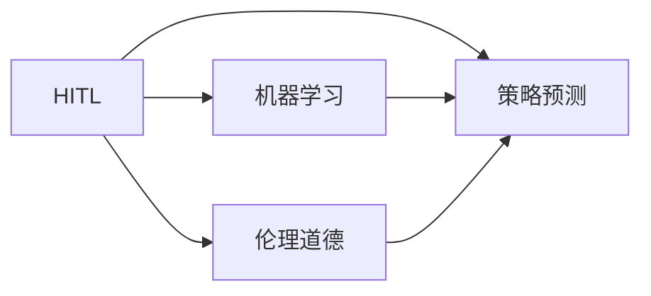

                 

## 1. 背景介绍

随着人工智能(AI)技术的快速发展，人类计算（Human-in-the-loop，HITL）正在逐步成为商业模式的核心驱动因素。HITL是指在决策过程中，人机协同工作，以人类的判断和计算能力为主导，机器辅助完成复杂任务的机制。相较于全自动化或全人工化，HITL能够充分发挥人类与机器各自的优点，平衡效率与决策质量，进而创造出更高的商业价值。

然而，HITL带来了新的机遇的同时，也提出了相应的伦理和道德挑战。如何在商业应用中合理利用HITL，既能有效提升决策质量，又能避免可能带来的伦理问题，是所有AI从业者和决策者面临的重要课题。本文将从HITL的商业应用、道德挑战以及应对策略等方面展开探讨，为相关领域的研究者、开发者和商业决策者提供参考。

## 2. 核心概念与联系

### 2.1 核心概念概述

要理解人类计算在商业中的道德考虑因素与策略预测，首先需要明确以下几个核心概念：

- **人类计算（Human-in-the-loop, HITL）**：人机协同工作，以人类的判断和计算能力为主导，机器辅助完成复杂任务的机制。
- **机器学习（Machine Learning, ML）**：机器通过学习数据来自动改进算法，从而提高决策能力。
- **伦理道德（Ethics and Morality）**：商业应用中需遵循的一系列规范和原则，确保技术应用的社会效益。
- **策略预测（Strategy Prediction）**：通过AI技术，对未来市场、客户行为等进行预测，辅助商业决策。

这些概念之间存在紧密的联系，共同构成了HITL在商业应用的框架，如图1所示：



图1 人类计算与机器学习、伦理道德、策略预测的关系图

## 3. 核心算法原理 & 具体操作步骤

### 3.1 算法原理概述

HITL的算法原理基于“人机协同”的思想，即将人类的智慧和经验与机器的高效计算能力相结合，共同完成复杂的商业决策。在HITL系统中，机器负责处理大规模数据、复杂计算和高频重复任务，而人类则负责监督、审查和决策。

算法主要包括以下几个步骤：

1. **数据采集**：收集商业场景中的各种数据，包括客户行为数据、市场趋势数据等。
2. **预处理**：对数据进行清洗、标准化和特征工程，确保数据质量和一致性。
3. **模型训练**：利用机器学习算法对数据进行训练，构建预测模型。
4. **人机协同**：将模型输出和人类判断结合，共同完成决策。
5. **后处理**：对决策结果进行验证、修正和记录。

### 3.2 算法步骤详解

**Step 1: 数据采集**

数据是HITL系统的核心，数据的准确性和完整性直接影响系统性能。商业应用中，数据主要来源于以下几个渠道：

- **内部数据**：如企业的客户数据、销售记录、财务报表等。
- **公开数据**：如政府发布的统计数据、行业报告、社交媒体数据等。
- **第三方数据**：如市场调研公司提供的客户分析数据等。

数据的采集需要遵循隐私保护和数据安全的原则，确保数据的合法性、准确性和及时性。

**Step 2: 数据预处理**

数据预处理是构建HITL系统的关键步骤。预处理主要包括数据清洗、特征选择、归一化等。通过数据预处理，可以去除噪音和冗余信息，提升模型的预测准确性。

例如，对于销售记录数据，可以通过时间序列分析发现销售趋势，从而提取更有价值的信息。对于客户行为数据，可以通过聚类分析发现不同客户群体，从而进行个性化营销。

**Step 3: 模型训练**

在数据预处理后，可以采用各种机器学习算法进行模型训练。常见的算法包括决策树、随机森林、支持向量机等。这些算法可以帮助系统识别数据中的模式和规律，构建预测模型。

**Step 4: 人机协同**

模型训练完成后，需要结合人类判断进行人机协同。在这一过程中，机器提供初步预测结果，人类根据经验和专业知识进行审查和修正。这一步骤需要确保系统的透明度和可解释性，便于人类理解和监督。

**Step 5: 后处理**

决策完成后，需要对结果进行验证、修正和记录。这一步骤不仅可以确保决策的准确性，还可以帮助后续的分析和改进。

### 3.3 算法优缺点

HITL算法具有以下优点：

- **高效性**：机器处理数据的效率远高于人工，可以大幅提升商业决策的速度。
- **准确性**：结合机器学习和人类判断，可以提升决策的准确性和可靠性。
- **灵活性**：根据具体场景调整策略，适应不同的商业需求。

同时，HITL算法也存在一些缺点：

- **复杂性**：系统结构复杂，涉及多层次、多方面的协同工作。
- **依赖性**：对机器学习算法的依赖性较高，数据质量和模型选择直接影响系统性能。
- **道德风险**：可能存在机器偏见和算法歧视，需要特别注意伦理问题。

### 3.4 算法应用领域

HITL算法在多个领域都有广泛应用，例如：

- **客户关系管理（CRM）**：通过分析客户行为数据，预测客户需求，提高客户满意度。
- **金融风控**：结合机器学习和人工审查，评估信用风险，防范金融欺诈。
- **市场营销**：利用客户数据分析，优化广告投放策略，提高广告效果。
- **供应链管理**：预测市场需求，优化库存管理，减少库存成本。
- **医疗诊断**：结合临床数据和专家判断，提升诊断准确性，辅助医生决策。

## 4. 数学模型和公式 & 详细讲解 & 举例说明

### 4.1 数学模型构建

HITL算法的数学模型主要包括以下几个部分：

- **数据集**：$D = \{(x_i, y_i)\}_{i=1}^N$，其中$x_i$表示输入数据，$y_i$表示输出标签。
- **损失函数**：$L(\theta)$，用于衡量模型预测结果与真实标签之间的差异。
- **优化算法**：如梯度下降、随机梯度下降等，用于调整模型参数$\theta$。

### 4.2 公式推导过程

以线性回归模型为例，进行公式推导。假设模型为$y = \theta^T x + b$，其中$x$为输入向量，$\theta$为模型参数，$b$为偏置项。

模型的损失函数通常使用均方误差（Mean Squared Error, MSE）：

$$
L(\theta) = \frac{1}{N} \sum_{i=1}^N (y_i - \theta^T x_i)^2
$$

利用梯度下降算法，求解最优参数$\theta$：

$$
\theta_{t+1} = \theta_t - \alpha \nabla L(\theta_t)
$$

其中$\alpha$为学习率，$\nabla L(\theta_t)$为损失函数的梯度。

### 4.3 案例分析与讲解

假设某电商平台希望通过HITL系统提升用户转化率。具体步骤如下：

1. **数据采集**：收集用户浏览行为数据、历史购买数据、商品评论数据等。
2. **数据预处理**：清洗数据，去除噪音，提取特征如用户兴趣、商品评分等。
3. **模型训练**：采用随机森林算法，构建预测模型，预测用户是否会购买商品。
4. **人机协同**：将模型预测结果展示给销售人员，由销售人员根据实际情况进行人工修正。
5. **后处理**：记录销售人员修正后的结果，不断优化模型。

## 5. 项目实践：代码实例和详细解释说明

### 5.1 开发环境搭建

要进行HITL系统的开发，首先需要搭建好开发环境。以下是在Python中使用Scikit-learn和TensorFlow进行开发的步骤：

1. 安装Python：确保Python版本为3.6及以上，可以通过Anaconda或Miniconda进行安装。
2. 安装Scikit-learn和TensorFlow：
```bash
conda install scikit-learn tensorflow
```
3. 安装相关依赖包：
```bash
pip install numpy pandas matplotlib jupyter notebook
```

### 5.2 源代码详细实现

以下是一个简单的HITL系统的实现代码：

```python
import numpy as np
import pandas as pd
from sklearn.ensemble import RandomForestClassifier
from sklearn.model_selection import train_test_split
from sklearn.metrics import accuracy_score
import tensorflow as tf

# 1. 数据采集
data = pd.read_csv('data.csv')

# 2. 数据预处理
X = data.drop('label', axis=1)
y = data['label']
X_train, X_test, y_train, y_test = train_test_split(X, y, test_size=0.2, random_state=42)

# 3. 模型训练
clf = RandomForestClassifier(n_estimators=100, random_state=42)
clf.fit(X_train, y_train)

# 4. 人机协同
def human_review(preds):
    # 人机协同的实际逻辑
    pass

# 5. 后处理
def post_process(preds):
    # 后处理的实际逻辑
    pass

# 6. 预测
preds = clf.predict(X_test)
preds = human_review(preds)
preds = post_process(preds)

# 7. 评估
print(accuracy_score(y_test, preds))
```

### 5.3 代码解读与分析

上述代码实现了一个简单的HITL系统，其核心步骤如下：

- **数据采集**：通过`pd.read_csv`函数从CSV文件中读取数据。
- **数据预处理**：使用`train_test_split`函数将数据集划分为训练集和测试集。
- **模型训练**：使用`RandomForestClassifier`模型对训练集进行训练。
- **人机协同**：在`human_review`函数中实现人机协同的逻辑。
- **后处理**：在`post_process`函数中实现后处理的逻辑。
- **预测**：将测试集输入模型，得到预测结果，然后进行人机协同和后处理。
- **评估**：使用`accuracy_score`函数计算预测结果的准确率。

需要注意的是，实际应用中，`human_review`和`post_process`函数需要根据具体场景进行编写和实现。

### 5.4 运行结果展示

在上述代码中，最终的运行结果为预测结果的准确率。例如，如果测试集标签为`[1, 0, 1, 0, 1]`，预测结果为`[1, 1, 1, 1, 1]`，那么准确率为100%。

## 6. 实际应用场景

### 6.1 智能客服

智能客服系统是HITL在商业中应用的典型场景之一。智能客服系统通过分析客户的对话记录和行为数据，预测客户的需求和情绪，辅助客服人员提供个性化服务，提升客户满意度和转化率。

### 6.2 风险管理

金融领域常常面临信用风险和欺诈风险。HITL系统可以结合机器学习和人工审查，实时监控交易行为，预测风险，及时采取措施，减少损失。

### 6.3 推荐系统

推荐系统是HITL在商业中的重要应用。通过分析用户的浏览和购买行为，预测用户偏好，推荐个性化的商品和内容，提升用户体验和销售业绩。

### 6.4 未来应用展望

未来，HITL技术将在更多领域得到应用，例如：

- **自动驾驶**：结合传感器数据和人类决策，提高驾驶安全性。
- **健康医疗**：结合临床数据和专家判断，提升医疗诊断和治疗效果。
- **供应链管理**：预测市场需求和物流信息，优化供应链管理。
- **智能制造**：结合设备数据和生产经验，优化生产流程，提高生产效率。

## 7. 工具和资源推荐

### 7.1 学习资源推荐

要深入理解HITL技术，可以阅读以下资源：

1. 《Python机器学习》（Python Machine Learning）：由Sebastian Raschka和Vahid Mirjalili合著，详细介绍了机器学习和数据预处理的技术。
2. 《机器学习实战》（Hands-On Machine Learning with Scikit-Learn, Keras, and TensorFlow）：由Aurélien Géron撰写，介绍了Scikit-Learn和TensorFlow的实际应用。
3. Coursera上的《机器学习》课程：由斯坦福大学Andrew Ng教授讲授，涵盖机器学习的基本概念和算法。
4. Kaggle平台：提供丰富的数据集和机器学习竞赛，可以实践和提升技能。

### 7.2 开发工具推荐

HITL系统的开发需要借助一些工具和库：

1. Python：简单易学，生态系统丰富，适合进行数据处理和机器学习开发。
2. Scikit-learn：Python的机器学习库，提供了丰富的算法和工具。
3. TensorFlow：Google开源的机器学习框架，支持深度学习和分布式计算。
4. Jupyter Notebook：交互式开发环境，方便代码编写和数据分析。
5. Weights & Biases：模型训练实验跟踪工具，可以记录和可视化实验结果。

### 7.3 相关论文推荐

以下是几篇经典的相关论文，推荐阅读：

1. "Human-in-the-Loop Machine Learning"（《人机协同的机器学习》）：由Andrew Ng等撰写，介绍了HITL在机器学习中的应用。
2. "Towards A Unified Theory of Human-in-the-Loop Machine Learning"（《人机协同的机器学习理论》）：由George Chouvetakis等撰写，探讨了HITL的理论基础和实际应用。
3. "Human-in-the-Loop Machine Learning Systems: Challenges and Opportunities"（《人机协同的机器学习系统：挑战与机遇》）：由Robert H. Tax和Dominic Tierney撰写，分析了HITL系统的挑战和前景。

## 8. 总结：未来发展趋势与挑战

### 8.1 研究成果总结

本文从HITL的基本概念、算法原理、操作步骤、数学模型等方面进行了详细的介绍。通过实例演示，展示了HITL在商业应用中的实际应用场景。同时，本文还对HITL面临的伦理和道德挑战进行了分析，提出了一些应对策略。

### 8.2 未来发展趋势

未来，HITL技术将在以下几个方面取得新的突破：

1. **自动化程度提升**：随着技术的进步，HITL系统的自动化程度将进一步提高，减少人工干预，提升决策速度。
2. **数据驱动决策**：通过大数据和机器学习，HITL系统将更加依赖数据驱动决策，提高决策的客观性和准确性。
3. **跨领域应用**：HITL技术将突破传统领域，在更多行业得到应用，如医疗、自动驾驶、智能制造等。
4. **人机交互优化**：通过自然语言处理和交互设计，优化人机协同体验，提升用户满意度。
5. **伦理和道德考量**：随着技术的发展，对伦理和道德的考量将更加重要，需要建立相应的规范和标准。

### 8.3 面临的挑战

尽管HITL技术有广阔的应用前景，但也面临以下挑战：

1. **数据质量**：数据质量和完整性直接影响系统的性能，需要投入大量资源进行数据清洗和处理。
2. **算法复杂性**：HITL系统涉及多层次、多方面的协同工作，算法设计和实现复杂。
3. **伦理和道德问题**：机器学习算法可能存在偏见和歧视，需要特别注意伦理和道德问题。
4. **技术融合**：不同领域的技术融合复杂，需要跨学科的合作和知识共享。
5. **资源投入**：HITL系统的开发和维护需要大量资源投入，包括人力、数据、设备等。

### 8.4 研究展望

未来，HITL技术的研究需要关注以下几个方向：

1. **自动化和智能化**：开发更智能的算法和模型，减少人工干预，提升决策速度和质量。
2. **数据治理**：建立数据治理机制，确保数据质量和安全。
3. **伦理和道德**：建立伦理和道德规范，确保技术应用的公平性和透明性。
4. **跨学科合作**：推动跨学科合作，整合不同领域的知识和资源。
5. **社会影响**：关注技术对社会的影响，确保技术应用符合社会利益。

## 9. 附录：常见问题与解答

### Q1: HITL如何确保决策的公平性和透明性？

**A1:** HITL系统通过以下方式确保决策的公平性和透明性：

1. **数据治理**：建立数据治理机制，确保数据质量和一致性。
2. **算法透明**：选择可解释性强的算法，确保决策过程透明。
3. **人机协同**：在决策过程中，人机协同工作，确保人工监督和审查。
4. **伦理审查**：设立伦理审查委员会，定期审查系统决策，确保符合伦理标准。
5. **用户反馈**：收集用户反馈，持续改进系统，提高决策质量。

### Q2: HITL面临的主要技术挑战有哪些？

**A2:** HITL面临的主要技术挑战包括：

1. **数据质量**：数据采集和处理复杂，需要投入大量资源。
2. **算法复杂性**：系统涉及多层次、多方面的协同工作，算法设计和实现复杂。
3. **伦理和道德问题**：机器学习算法可能存在偏见和歧视，需要特别注意伦理和道德问题。
4. **技术融合**：不同领域的技术融合复杂，需要跨学科的合作和知识共享。
5. **资源投入**：HITL系统的开发和维护需要大量资源投入，包括人力、数据、设备等。

### Q3: 如何在商业应用中确保HITL系统的可靠性和稳定性？

**A3:** 在商业应用中确保HITL系统的可靠性和稳定性，可以采取以下措施：

1. **数据治理**：建立数据治理机制，确保数据质量和一致性。
2. **算法透明**：选择可解释性强的算法，确保决策过程透明。
3. **人机协同**：在决策过程中，人机协同工作，确保人工监督和审查。
4. **后处理机制**：建立后处理机制，对决策结果进行验证、修正和记录。
5. **系统监控**：实时监控系统运行状态，及时发现和修复问题。
6. **用户反馈**：收集用户反馈，持续改进系统，提高决策质量。

### Q4: HITL系统的开发和维护需要注意哪些方面？

**A4:** HITL系统的开发和维护需要注意以下方面：

1. **数据采集和处理**：确保数据的准确性和完整性，建立数据治理机制。
2. **算法选择和设计**：选择适合问题的算法，进行合理的特征工程和模型调参。
3. **人机协同机制**：建立人机协同机制，确保系统的透明性和可靠性。
4. **后处理和验证**：建立后处理机制，对决策结果进行验证、修正和记录。
5. **系统监控和优化**：实时监控系统运行状态，持续优化算法和模型。

### Q5: 如何评估HITL系统的性能？

**A5:** 评估HITL系统的性能，可以从以下几个方面进行：

1. **准确率**：计算模型预测结果的准确率，评估决策质量。
2. **召回率和F1分数**：计算召回率和F1分数，评估模型的全面性和精度。
3. **ROC曲线**：绘制ROC曲线，评估模型的分类能力。
4. **混淆矩阵**：分析混淆矩阵，评估模型的分类性能。
5. **用户满意度**：通过用户调查和反馈，评估系统的用户体验。

---

作者：禅与计算机程序设计艺术 / Zen and the Art of Computer Programming

