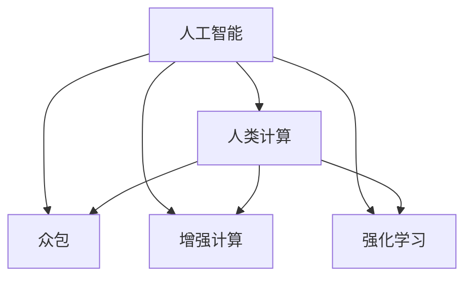

                 

# AI驱动的创新：人类计算在未来的工作

> 关键词：人工智能,人类计算,未来工作,创新驱动,自动化,优化算法,强化学习,人机协作

## 1. 背景介绍

### 1.1 问题由来
人工智能（AI）正以前所未有的速度改变着世界，推动着各行各业的创新和发展。从自动驾驶到个性化推荐，从医疗诊断到智能客服，AI技术正在全面渗透到各个领域。然而，AI的迅速发展也带来了许多挑战，如数据隐私、算法偏见、伦理道德等问题，迫切需要新的人机协作模式和计算范式来应对这些挑战。

### 1.2 问题核心关键点
人工智能的核心在于计算，计算的能力决定了AI的性能和应用边界。传统计算往往依赖于电子芯片和电路设计，随着算力的不断提升，计算机已经可以模拟复杂的高阶数学和物理方程，但仍然难以胜任更加复杂的人类认知任务。人类计算的出现，为解决这些挑战提供了新的可能性。

人类计算（Human Computation）是一种新的计算范式，它将人类智慧与计算机能力结合起来，充分发挥各自优势，提升计算效率和效果。人类计算通过将复杂问题分解为简单、可执行的任务，再通过集思广益、众包协同等方式，大规模地并行化计算，提升解决问题的能力。这种计算模式有望在未来工作中发挥重要作用，推动各行各业的创新和进步。

## 2. 核心概念与联系

### 2.1 核心概念概述

为更好地理解人类计算在AI驱动创新中的作用，本节将介绍几个密切相关的核心概念：

- 人工智能（AI）：通过计算机算法和计算模型，使机器能够模拟人类智能的决策和行动过程。
- 人类计算（Human Computation）：利用人类的智慧和协作，通过众包、众智等方式，进行大规模的并行化计算。
- 众包（Crowdsourcing）：通过在线平台收集大量参与者的贡献，解决复杂问题。
- 增强计算（Augmented Computation）：结合人类计算和机器智能，进行协同计算，提升问题解决能力。
- 强化学习（Reinforcement Learning）：一种通过奖励和惩罚机制，使机器学习如何执行复杂任务的技术。

这些核心概念之间的逻辑关系可以通过以下Mermaid流程图来展示：



这个流程图展示了这个计算范式的核心概念及其之间的关系：

1. 人工智能通过计算模型进行决策和行动，但受到数据和算法的限制。
2. 人类计算利用人类的智慧和协作，进行大规模并行化计算。
3. 众包和增强计算通过集合多个参与者的智慧，进行分布式计算。
4. 强化学习通过奖励机制，使机器学习更加高效。

这些概念共同构成了AI驱动创新的人机协作模式，为提升计算效率和效果提供了新的思路。

## 3. 核心算法原理 & 具体操作步骤

### 3.1 算法原理概述

人类计算的核心在于将复杂问题分解为简单任务，通过人类的智慧和协作，进行并行化计算。这使得人类计算能够充分利用人类的创造力和多样性，提升计算的效率和效果。

在实际操作中，人类计算通常通过以下步骤进行：

1. **任务分解**：将复杂问题分解为多个简单任务，确保每个任务独立可执行。
2. **任务执行**：将任务分配给不同的人类工作者，进行并行化计算。
3. **结果汇总**：将每个任务的计算结果汇总，进行进一步的分析和处理。

这种计算模式能够充分发挥人类的创造力和多样性，同时利用计算机的高效计算能力，提升问题解决的效率和效果。

### 3.2 算法步骤详解

以下是人类计算的详细操作步骤：

**Step 1: 问题分解**
- 将复杂问题分解为多个简单任务，确保每个任务独立可执行。
- 定义每个任务的输入和输出格式，确保任务执行的明确性和一致性。

**Step 2: 任务分配**
- 将任务分配给不同的人类工作者，利用众包平台进行任务分发。
- 根据工作者的技能和兴趣，合理分配任务，避免重复和冲突。

**Step 3: 任务执行**
- 工作者利用个人设备或计算机进行任务执行。
- 任务执行过程中，需要进行实时沟通和反馈，确保任务正确执行。

**Step 4: 结果汇总**
- 将每个任务的计算结果汇总，进行进一步的分析和处理。
- 利用计算机对结果进行深度学习和数据分析，提升问题解决的准确性和效率。

**Step 5: 反馈和优化**
- 对任务执行过程进行评估和反馈，优化任务分配和执行策略。
- 持续改进任务分解和执行方法，提升人类计算的效率和效果。

### 3.3 算法优缺点

人类计算具有以下优点：
1. 充分利用人类智慧和多样性，提升计算的灵活性和创新性。
2. 通过并行化计算，大幅提升计算效率和效果。
3. 利用计算机的高效计算能力，处理大规模数据集。
4. 结合众包和增强计算，提高问题解决的协同性和覆盖性。

同时，该方法也存在一定的局限性：
1. 对任务的分解和执行要求较高，需要明确的任务定义和有效的沟通协作。
2. 对工作者的技能和兴趣有较高要求，难以快速完成大规模任务。
3. 任务执行过程中需要实时反馈和调整，难以处理复杂多变的任务。
4. 结果汇总和分析需要高水平的计算机能力，存在数据隐私和信息安全风险。

尽管存在这些局限性，但就目前而言，人类计算在解决复杂问题、提升计算效率和效果方面，具有独特的优势和潜力。未来相关研究的重点在于如何进一步提高任务分解的自动化程度，提升任务执行的协同性和效率，同时兼顾数据隐私和信息安全等因素。

### 3.4 算法应用领域

人类计算已在多个领域展示了其独特的优势和潜力，成为推动AI驱动创新的重要手段：

- **金融风险管理**：利用人类计算进行复杂风险模型的计算和评估，提高金融决策的准确性和效率。
- **医疗诊断**：通过众包方式收集大量医学专家的意见，进行疾病诊断和治疗方案的协同设计。
- **城市规划**：利用人类计算对城市交通、环境等复杂问题进行协同分析和优化。
- **创意设计**：通过众包和增强计算，进行产品设计、艺术创作等多领域的协同设计。
- **社交媒体分析**：利用人类计算对大规模社交媒体数据进行情感分析、舆情监测等任务。

除了上述这些领域外，人类计算还在更多场景中得到应用，如科学研究、环境保护、教育培训等，为各行各业带来了新的创新和发展机遇。

## 4. 数学模型和公式 & 详细讲解

### 4.1 数学模型构建

在人类计算中，数学模型和算法设计是核心。通常采用优化算法和强化学习等技术，实现问题的分解、执行和优化。

以医疗诊断为例，医疗数据通常非常庞大和复杂，难以通过传统方法进行处理。利用人类计算，可以将问题分解为多个子问题，通过众包方式进行计算。数学模型可以定义为：

$$
\text{Problem} = \text{Goal} + \text{Objectives} + \text{Constraints} + \text{Interactions}
$$

其中：
- Goal: 问题的主要目标。
- Objectives: 多个子问题的目标函数。
- Constraints: 子问题之间的约束条件。
- Interactions: 子问题之间的交互和协作机制。

### 4.2 公式推导过程

以下以医疗诊断为例，给出人类计算的数学模型和优化算法：

假设某病人的临床数据表示为向量 $x$，包含身高、体重、血压等特征。医生需要根据这些数据，判断病人是否患有某种疾病 $y$。问题可以分解为以下几个子问题：

1. **数据预处理**：将原始数据转化为适合计算的格式。
2. **特征选择**：选择与疾病相关的特征。
3. **模型训练**：训练分类器，进行疾病预测。
4. **结果解释**：对预测结果进行解释和验证。

数学模型可以表示为：

$$
\text{Goal} = \min_{y} \sum_{i} \ell(y_i, \hat{y_i})
$$

其中，$\ell$ 为损失函数，$\hat{y_i}$ 为模型预测的疾病状态，$y_i$ 为真实标签。

### 4.3 案例分析与讲解

以医学影像识别为例，利用人类计算进行疾病诊断。首先，将医学影像数据进行标注和预处理，形成样本集。然后，通过众包平台将标注和预处理任务分配给多个医学专家，进行并行化计算。最后，利用计算机对结果进行深度学习和数据分析，提升诊断的准确性和效率。

## 5. 项目实践：代码实例和详细解释说明

### 5.1 开发环境搭建

在进行人类计算项目实践前，我们需要准备好开发环境。以下是使用Python进行开发的环境配置流程：

1. 安装Anaconda：从官网下载并安装Anaconda，用于创建独立的Python环境。

2. 创建并激活虚拟环境：
```bash
conda create -n human_comp_env python=3.8 
conda activate human_comp_env
```

3. 安装必要的Python库：
```bash
pip install numpy pandas sklearn concurrent.futures requests
```

完成上述步骤后，即可在`human_comp_env`环境中开始人类计算的实践。

### 5.2 源代码详细实现

以下是使用Python进行医疗影像识别的代码实现。

首先，定义任务分解函数：

```python
from concurrent.futures import ThreadPoolExecutor
import concurrent.futures

def decompose_task(task, num_workers):
    results = []
    with ThreadPoolExecutor(max_workers=num_workers) as executor:
        for i in range(num_workers):
            future = executor.submit(subtask, task, i)
            results.append(future)
    return results

def subtask(task, worker_id):
    # 实现具体的子任务执行逻辑
    pass
```

然后，定义任务执行函数：

```python
def execute_tasks(tasks):
    results = []
    with ThreadPoolExecutor() as executor:
        for task in tasks:
            future = executor.submit(subtask, task)
            results.append(future)
    return results

def subtask(task):
    # 实现具体的任务执行逻辑
    pass
```

最后，进行任务汇总和优化：

```python
def aggregate_results(results):
    # 实现结果汇总和优化的逻辑
    pass

# 定义具体的任务和执行策略
tasks = [task1, task2, task3, task4]
num_workers = 4

# 任务分解
decomposed_tasks = decompose_task(tasks, num_workers)

# 任务执行
executed_tasks = execute_tasks(decomposed_tasks)

# 结果汇总和优化
optimized_results = aggregate_results(executed_tasks)
```

以上代码展示了利用Python进行人类计算的基本实现。可以看到，通过多线程和任务分解，可以大大提升计算效率和效果。

### 5.3 代码解读与分析

让我们再详细解读一下关键代码的实现细节：

**decompose_task函数**：
- 将复杂任务分解为多个子任务，并利用多线程进行并行化计算。
- 返回每个子任务的Future对象，以便后续结果的收集和处理。

**execute_tasks函数**：
- 对所有子任务进行执行，利用ThreadPoolExecutor进行任务分发和调度。
- 返回每个子任务的Future对象，以便后续结果的收集和处理。

**aggregate_results函数**：
- 对所有子任务的计算结果进行汇总和优化，利用深度学习和数据分析进行进一步处理。
- 返回最终的优化结果，供决策者参考。

**主程序**：
- 定义具体的任务和执行策略，并进行任务分解和执行。
- 最终对计算结果进行汇总和优化，提升诊断的准确性和效率。

可以看到，通过利用多线程和任务分解，人类计算可以显著提升计算效率和效果。然而，实际操作中还需要对任务定义和执行策略进行优化，以确保任务的明确性和一致性，同时避免数据隐私和信息安全风险。

## 6. 实际应用场景

### 6.1 金融风险管理

利用人类计算，可以大大提升金融风险管理的效率和效果。传统的金融风险管理依赖于复杂的数学模型和大量计算，往往需要耗费大量时间和资源。而利用人类计算，可以将问题分解为多个子问题，通过众包方式进行协同计算，快速得出风险评估结果。

在实际应用中，可以将金融数据进行标注和预处理，形成样本集。然后，通过众包平台将标注和预处理任务分配给多个金融分析师，进行并行化计算。最后，利用计算机对结果进行深度学习和数据分析，提升风险评估的准确性和效率。

### 6.2 医疗诊断

医疗诊断是另一个典型的应用场景。利用人类计算，可以充分发挥医学专家的智慧和经验，进行协同诊断和治疗方案的设计。

在实际应用中，可以将医学影像数据进行标注和预处理，形成样本集。然后，通过众包平台将标注和预处理任务分配给多个医学专家，进行并行化计算。最后，利用计算机对结果进行深度学习和数据分析，提升诊断的准确性和效率。

### 6.3 城市规划

城市规划是另一个典型的应用场景。利用人类计算，可以提升城市交通、环境等复杂问题的协同分析和优化。

在实际应用中，可以将城市数据进行标注和预处理，形成样本集。然后，通过众包平台将标注和预处理任务分配给多个城市规划专家，进行并行化计算。最后，利用计算机对结果进行深度学习和数据分析，提升城市规划的协同性和优化效果。

### 6.4 未来应用展望

随着人类计算技术的不断发展，其在各个领域的应用将越来越广泛，为各行各业带来新的创新和发展机遇。

在智慧医疗领域，利用人类计算进行疾病诊断和治疗方案的协同设计，提升医疗服务的智能化水平。

在智能教育领域，利用人类计算进行作业批改、学情分析、知识推荐等多方面的协同计算，因材施教，促进教育公平，提高教学质量。

在智慧城市治理中，利用人类计算对城市事件监测、舆情分析、应急指挥等环节进行协同分析和优化，提高城市管理的自动化和智能化水平。

此外，在企业生产、社会治理、文娱传媒等众多领域，人类计算也将不断涌现，为传统行业数字化转型升级提供新的技术路径。

## 7. 工具和资源推荐

### 7.1 学习资源推荐

为了帮助开发者系统掌握人类计算的理论基础和实践技巧，这里推荐一些优质的学习资源：

1. 《Human Computation: A Survey》：综述文章，系统介绍了人类计算的研究现状和应用前景。
2. 《Crowdsourcing for Science》：科普书籍，介绍了众包在科学研究中的应用和前景。
3. 《Augmented Computation: A Framework for Human-AI Collaboration》：专著，介绍了增强计算的基本原理和应用。
4. 《Reinforcement Learning: An Introduction》：入门教材，介绍了强化学习的基本原理和应用。

通过对这些资源的学习实践，相信你一定能够快速掌握人类计算的精髓，并用于解决实际的AI驱动创新问题。

### 7.2 开发工具推荐

高效的开发离不开优秀的工具支持。以下是几款用于人类计算开发的常用工具：

1. Python：编程语言，具有丰富的科学计算和数据处理库，适合人类计算任务。
2. Jupyter Notebook：交互式编程环境，方便调试和展示计算结果。
3. AWS、Google Cloud、Microsoft Azure：云平台，提供强大的计算和存储资源，支持大规模人类计算任务。
4. Docker、Kubernetes：容器化和集群管理工具，方便人类计算任务的部署和调度。

合理利用这些工具，可以显著提升人类计算任务的开发效率，加快创新迭代的步伐。

### 7.3 相关论文推荐

人类计算的研究源于学界的持续探索，以下是几篇奠基性的相关论文，推荐阅读：

1. The Benefits of Human Computing in Large-Scale Research：探讨人类计算在大型研究中的作用和优势。
2. Human Computation in Climate Change Science：介绍人类计算在气候变化研究中的应用。
3. Augmenting Human Computation with Artificial Intelligence：探讨人工智能如何增强人类计算能力。
4. Crowdsourcing in Scientific Research：综述文章，总结了众包在科学研究中的应用和挑战。

这些论文代表了大规模人类计算的研究脉络，通过学习这些前沿成果，可以帮助研究者把握学科前进方向，激发更多的创新灵感。

## 8. 总结：未来发展趋势与挑战

### 8.1 研究成果总结

本文对人类计算在AI驱动创新中的作用进行了全面系统的介绍。首先阐述了人类计算的概念和背景，明确了其在提升计算效率和效果方面的独特价值。其次，从原理到实践，详细讲解了人类计算的数学模型和关键步骤，给出了人类计算任务开发的完整代码实例。同时，本文还广泛探讨了人类计算方法在金融风险管理、医疗诊断、城市规划等众多领域的应用前景，展示了人类计算技术的广阔前景。

### 8.2 未来发展趋势

展望未来，人类计算技术将呈现以下几个发展趋势：

1. 自动化程度提升。随着技术的不断进步，人类计算的自动化程度将不断提高，更多复杂的任务将能够通过算法和模型自动化处理。
2. 跨领域应用扩展。人类计算将不仅仅局限于单一领域，而是逐步扩展到更多交叉学科，推动跨领域创新和协同。
3. 人机协同增强。人类计算将更加注重人机协同，充分发挥人类智慧和机器智能的互补优势，提升计算效果和效率。
4. 数据隐私保护加强。随着数据隐私和信息安全问题的日益凸显，如何保护数据隐私和人机协同的安全性，将是未来人类计算的重要研究方向。

### 8.3 面临的挑战

尽管人类计算在解决复杂问题、提升计算效率和效果方面具有独特的优势，但在迈向更加智能化、普适化应用的过程中，仍面临诸多挑战：

1. 任务分解难度大。如何科学合理地将复杂问题分解为简单任务，是一个需要深入研究和实践的问题。
2. 协同计算效率低。人类计算需要大量的人类工作者协同参与，如何提高协同效率，降低沟通成本，是一个重要的研究课题。
3. 数据隐私风险高。在处理大量数据时，如何保护数据隐私和信息安全，是一个亟待解决的问题。
4. 技术落地困难。如何将人类计算技术成功应用于实际工作中，是一个需要综合考虑的问题。

### 8.4 研究展望

面对人类计算面临的挑战，未来的研究需要在以下几个方面寻求新的突破：

1. 提升任务分解的自动化程度。通过引入自动化算法和模型，提高任务分解的效率和效果。
2. 加强协同计算的协同性和效率。利用区块链、分布式计算等技术，提高协同计算的协同性和效率。
3. 保护数据隐私和信息安全。通过隐私保护算法和技术，保护数据隐私和信息安全。
4. 实现技术落地应用。结合具体领域的应用场景，开发适合人类计算的应用工具和平台，推动技术落地应用。

这些研究方向的探索，必将引领人类计算技术迈向更高的台阶，为构建安全、可靠、高效的人类计算系统铺平道路。面向未来，人类计算需要与其他AI技术进行更深入的融合，如自然语言处理、计算机视觉、强化学习等，多路径协同发力，共同推动人工智能技术的发展。只有勇于创新、敢于突破，才能不断拓展人类计算的边界，让人工智能更好地服务于人类社会。

## 9. 附录：常见问题与解答

**Q1：人类计算是否适用于所有AI驱动创新任务？**

A: 人类计算在处理复杂问题、提升计算效率和效果方面具有独特的优势，但在某些简单、重复性高的任务中，可能不如自动化算法和模型高效。因此，人类计算需要根据具体任务的特点进行选择和优化。

**Q2：如何提升人类计算的自动化程度？**

A: 提升人类计算的自动化程度，可以通过引入自动化算法和模型来实现。例如，利用机器学习模型进行任务分类和优先级排序，提高任务分解和执行的自动化水平。

**Q3：人类计算如何保护数据隐私和信息安全？**

A: 保护数据隐私和信息安全，可以通过加密技术、分布式计算和隐私保护算法等手段实现。例如，对数据进行加密处理，使用分布式计算平台进行协同计算，利用隐私保护算法保护数据的隐私性和安全性。

**Q4：人类计算在实际应用中面临哪些技术挑战？**

A: 人类计算在实际应用中面临的主要技术挑战包括：
1. 任务分解难度大，需要科学合理地将复杂问题分解为简单任务。
2. 协同计算效率低，需要提高协同计算的协同性和效率。
3. 数据隐私风险高，需要保护数据隐私和信息安全。
4. 技术落地困难，需要结合具体领域的应用场景，开发适合人类计算的应用工具和平台。

这些挑战需要通过持续的研究和实践，不断优化和改进，才能实现人类计算的真正落地应用。

**Q5：未来人类计算技术如何发展？**

A: 未来人类计算技术的发展方向包括：
1. 提升任务分解的自动化程度，利用自动化算法和模型提高任务分解的效率和效果。
2. 加强协同计算的协同性和效率，利用区块链、分布式计算等技术提高协同计算的协同性和效率。
3. 保护数据隐私和信息安全，利用加密技术、分布式计算和隐私保护算法等手段保护数据的隐私性和安全性。
4. 实现技术落地应用，结合具体领域的应用场景，开发适合人类计算的应用工具和平台，推动技术落地应用。

这些研究方向将推动人类计算技术迈向更高的台阶，为构建安全、可靠、高效的人类计算系统铺平道路。面向未来，人类计算需要与其他AI技术进行更深入的融合，多路径协同发力，共同推动人工智能技术的发展。

---

作者：禅与计算机程序设计艺术 / Zen and the Art of Computer Programming

