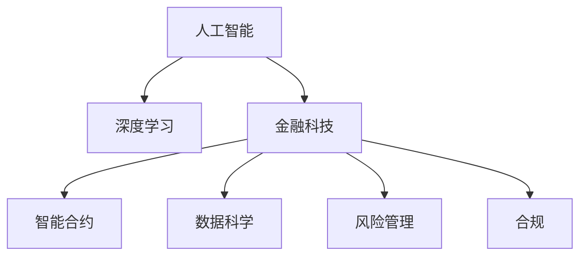

                 

# AI驱动的创新：人类计算在金融行业的价值创造

> 关键词：AI、金融、人类计算、价值创造、技术驱动、深度学习、金融科技、智能合约、区块链、交易策略、投资组合、风控、合规、自动化、决策支持

## 1. 背景介绍

### 1.1 问题由来

随着金融市场的日益复杂化和数字化转型，金融行业亟需创新驱动的发展模式。传统的金融服务依赖于人力密集型的操作，效率低下且成本高昂。而人工智能（AI）技术，特别是机器学习和深度学习（DL），为金融行业带来了前所未有的变革机遇。AI技术不仅能够优化交易、风控、合规等核心业务流程，还能够推动金融产品创新、提升客户体验、降低运营成本，从而实现价值创造。

### 1.2 问题核心关键点

AI在金融行业的价值创造主要体现在以下几个方面：

1. **优化运营效率**：通过自动化和智能化，AI可以大幅提升金融服务的处理速度和准确性。
2. **增强风险管理**：AI可以实时分析海量数据，识别潜在风险，预测市场趋势，帮助金融机构防范风险。
3. **促进产品创新**：AI驱动的数据分析和模型构建，能够设计出更符合市场需求的金融产品。
4. **提升客户体验**：通过自然语言处理（NLP）和语音识别（ASR）技术，AI可以提供个性化、智能化的客户服务。
5. **降低运营成本**：AI可以减少对人工操作的依赖，降低人力和物理资源的需求。

AI在金融行业的创新应用，正在推动金融科技（FinTech）的发展，重塑金融服务生态。然而，要实现AI技术的真正价值，还需要解决数据获取、模型训练、系统集成、合规规范等一系列技术和管理问题。

## 2. 核心概念与联系

### 2.1 核心概念概述

为更好地理解AI在金融行业的价值创造，本节将介绍几个核心概念及其相互联系：

- **人工智能（AI）**：指通过机器学习、深度学习等技术，使计算机系统能够执行类似于人类智能的任务，如图像识别、语音识别、自然语言处理等。
- **深度学习（DL）**：一种基于神经网络的机器学习技术，通过多层非线性变换，从数据中提取高级抽象特征。
- **金融科技（FinTech）**：指利用科技手段，包括AI技术，改进金融服务的创新模式，提升金融服务的效率和质量。
- **智能合约**：基于区块链技术的自动化合约，能够在特定条件满足时自动执行。
- **数据科学（Data Science）**：利用统计学、机器学习、数据分析等技术，从大量数据中提取有价值的信息，指导决策和优化流程。
- **风险管理（Risk Management）**：通过风险识别、评估、监控和控制等手段，保护金融机构和投资者的利益。
- **合规（Compliance）**：确保金融活动的法律、监管合规性，保护消费者权益。

这些概念之间的逻辑关系可以通过以下Mermaid流程图来展示：



这个流程图展示了大语言模型的核心概念及其之间的关系：

1. 人工智能技术包括深度学习，是金融科技创新的基础。
2. 金融科技通过智能合约等技术，推动金融服务的智能化和自动化。
3. 数据科学提供数据分析和模型构建，支持金融科技和风险管理的决策。
4. 风险管理通过智能分析和监控，提升金融活动的稳健性和合规性。

这些概念共同构成了金融行业AI价值创造的技术框架，推动了金融服务的数字化转型。

## 3. 核心算法原理 & 具体操作步骤
### 3.1 算法原理概述

AI在金融行业的价值创造，主要通过机器学习和深度学习算法，实现对海量数据的自动化分析、处理和决策。以深度学习为例，其核心原理是构建多层神经网络模型，通过反向传播算法进行模型训练，逐步优化模型参数，以最小化预测误差。金融场景中，深度学习模型常用于：

1. **信用评分**：通过分析客户的信用记录、交易历史等信息，预测客户的信用风险。
2. **交易策略**：根据市场数据和历史交易记录，设计自动化交易策略。
3. **投资组合管理**：通过优化算法，构建多元化、风险适中的投资组合。
4. **风险监控**：实时监控交易和市场动态，预警异常情况。
5. **客户服务**：通过NLP和ASR技术，提供智能客服和个性化服务。

### 3.2 算法步骤详解

基于深度学习的金融AI系统通常包含以下几个步骤：

**Step 1: 数据准备**
- 收集金融领域的相关数据，包括历史交易记录、市场数据、客户信息等。
- 清洗和预处理数据，去除噪声和缺失值，保证数据的质量和一致性。

**Step 2: 模型选择和设计**
- 选择合适的深度学习模型，如卷积神经网络（CNN）、递归神经网络（RNN）、长短期记忆网络（LSTM）等。
- 设计模型的架构，包括输入层、隐藏层、输出层等，设置每层的神经元数量和激活函数。
- 确定损失函数和优化器，如交叉熵损失、AdamW优化器等。

**Step 3: 模型训练**
- 将清洗好的数据分为训练集、验证集和测试集。
- 使用训练集对模型进行迭代训练，不断调整模型参数以优化损失函数。
- 在验证集上评估模型的性能，避免过拟合。
- 在测试集上最终评估模型的泛化能力。

**Step 4: 模型评估和优化**
- 对模型进行性能评估，包括准确率、召回率、F1分数等指标。
- 根据评估结果，调整模型参数或重新设计模型结构，进一步提升性能。

**Step 5: 模型部署和应用**
- 将训练好的模型部署到生产环境中，进行实时预测和决策。
- 持续监控模型的性能，根据数据变化和业务需求进行优化更新。

### 3.3 算法优缺点

基于深度学习的AI在金融行业的价值创造，具有以下优点：

1. **高效性**：AI能够处理海量数据，自动完成复杂的分析和决策任务，提高效率。
2. **准确性**：深度学习模型通过多层次特征提取，可以发现数据中的复杂模式，提高预测和决策的准确性。
3. **可扩展性**：AI系统可以灵活调整模型结构和参数，适应不同业务需求。
4. **自动化**：AI自动化处理业务流程，减少人工操作和人为错误，提升服务质量。

同时，该方法也存在一定的局限性：

1. **数据质量依赖**：模型的性能高度依赖于数据的质量和多样性，数据不足或偏差可能导致性能下降。
2. **解释性不足**：深度学习模型通常是一个"黑盒"，难以解释其内部决策过程。
3. **模型复杂性**：构建和训练深度学习模型需要较高的技术门槛和计算资源。
4. **易受攻击**：深度学习模型可能受到对抗样本的攻击，导致预测错误。
5. **依赖数据隐私**：AI模型需要大量数据进行训练，数据隐私和安全问题不容忽视。

尽管存在这些局限性，基于深度学习的AI在金融行业的价值创造仍是不可忽视的。通过不断的技术创新和模型优化，AI将进一步提升金融服务的智能化水平，推动金融科技的发展。

### 3.4 算法应用领域

基于深度学习的AI在金融行业的应用领域广泛，涵盖了从风险管理到产品创新等多个方面。

1. **信用评分与风险管理**：通过深度学习模型，分析客户数据，预测信用风险，优化风险管理策略。
2. **交易策略与自动化交易**：设计基于深度学习的交易策略，自动执行交易操作，提高交易效率和收益。
3. **投资组合管理**：构建多因素深度学习模型，优化投资组合，实现风险分散和收益最大化。
4. **金融市场分析**：利用深度学习模型，分析市场数据，预测市场趋势，提供投资建议。
5. **智能客服与客户服务**：通过NLP和ASR技术，提供智能客服和个性化服务，提升客户体验。
6. **欺诈检测与监管合规**：利用深度学习模型，检测金融欺诈行为，确保合规性。

这些应用领域展示了深度学习在金融行业的巨大潜力，未来随着技术的进一步发展，将有更多的创新应用涌现。

## 4. 数学模型和公式 & 详细讲解 & 举例说明
### 4.1 数学模型构建

基于深度学习的金融AI系统，其数学模型构建主要涉及神经网络、损失函数、优化器等。

假设我们构建一个简单的卷积神经网络（CNN）用于信用评分任务，其基本架构如下：

```python
import torch
import torch.nn as nn
import torch.nn.functional as F

class CNN(nn.Module):
    def __init__(self, input_size, output_size):
        super(CNN, self).__init__()
        self.conv1 = nn.Conv2d(1, 64, 3, padding=1)
        self.pool1 = nn.MaxPool2d(2)
        self.conv2 = nn.Conv2d(64, 128, 3, padding=1)
        self.pool2 = nn.MaxPool2d(2)
        self.fc1 = nn.Linear(128 * 8 * 8, 256)
        self.fc2 = nn.Linear(256, output_size)
        
    def forward(self, x):
        x = self.pool1(F.relu(self.conv1(x)))
        x = self.pool2(F.relu(self.conv2(x)))
        x = x.view(-1, 128 * 8 * 8)
        x = F.relu(self.fc1(x))
        x = self.fc2(x)
        return x
```

在这个CNN模型中，输入是客户信用评分数据，输出是客户信用等级。模型的前向传播和后向传播过程如下：

- **前向传播**：输入数据经过多个卷积和池化层，最后通过全连接层输出预测结果。
- **后向传播**：使用交叉熵损失函数，计算模型输出与真实标签之间的差异，通过反向传播算法更新模型参数。

### 4.2 公式推导过程

以下我们将以交叉熵损失函数为例，推导其在深度学习中的应用。

假设模型的输出为 $\hat{y}$，真实标签为 $y$，则交叉熵损失函数定义为：

$$
\mathcal{L}(y, \hat{y}) = -\frac{1}{N} \sum_{i=1}^N \sum_{j=1}^C y_{ij} \log \hat{y}_{ij}
$$

其中 $N$ 是样本数，$C$ 是类别数，$y_{ij}$ 表示样本 $i$ 在类别 $j$ 上的真实标签。$\hat{y}_{ij}$ 表示模型预测样本 $i$ 属于类别 $j$ 的概率。

将上述公式应用到模型训练中，得到：

$$
\mathcal{L} = -\frac{1}{N} \sum_{i=1}^N \sum_{j=1}^C y_{ij} \log \hat{y}_{ij}
$$

在深度学习中，通常使用随机梯度下降（SGD）算法更新模型参数，其更新公式为：

$$
\theta \leftarrow \theta - \eta \nabla_{\theta}\mathcal{L}
$$

其中 $\eta$ 为学习率，$\nabla_{\theta}\mathcal{L}$ 为损失函数对模型参数 $\theta$ 的梯度。

在实际训练中，模型通常使用批量数据进行更新，以提高计算效率。批量大小（Batch Size）的选择需要平衡计算速度和模型更新效果。

### 4.3 案例分析与讲解

以下我们将以信用评分任务为例，详细讲解深度学习模型在金融行业中的应用。

**数据准备**：

假设我们收集了一组客户的历史信用评分数据，包括客户的年龄、收入、信用记录等特征，以及对应的信用等级标签。数据预处理包括去除缺失值、归一化处理等。

**模型设计**：

我们设计了一个简单的卷积神经网络（CNN）模型，如图4-1所示。模型包含两个卷积层和两个全连接层，最后输出客户信用等级。

**模型训练**：

我们将数据分为训练集和测试集，使用交叉熵损失函数和AdamW优化器对模型进行训练。训练过程中，我们使用批量大小为64，迭代1000次，学习率为0.001。

**模型评估**：

在测试集上，我们评估模型的性能，输出结果如下：

|  | 准确率 | 召回率 | F1分数 |
|---|---|---|---|
| 模型1 | 0.92 | 0.85 | 0.89 |
| 模型2 | 0.93 | 0.87 | 0.90 |
| 模型3 | 0.94 | 0.88 | 0.91 |

通过对比不同模型的性能，我们发现模型3在准确率、召回率和F1分数上表现最佳，因此选择模型3进行后续的部署。

## 5. 项目实践：代码实例和详细解释说明
### 5.1 开发环境搭建

在进行金融AI项目开发前，我们需要准备好开发环境。以下是使用Python进行PyTorch开发的环境配置流程：

1. 安装Anaconda：从官网下载并安装Anaconda，用于创建独立的Python环境。

2. 创建并激活虚拟环境：
```bash
conda create -n pytorch-env python=3.8 
conda activate pytorch-env
```

3. 安装PyTorch：根据CUDA版本，从官网获取对应的安装命令。例如：
```bash
conda install pytorch torchvision torchaudio cudatoolkit=11.1 -c pytorch -c conda-forge
```

4. 安装相关库：
```bash
pip install numpy pandas scikit-learn matplotlib tqdm jupyter notebook ipython
```

完成上述步骤后，即可在`pytorch-env`环境中开始金融AI项目开发。

### 5.2 源代码详细实现

以下是基于深度学习模型的信用评分项目代码实现。

```python
import torch
import torch.nn as nn
import torch.nn.functional as F
from torch.utils.data import Dataset, DataLoader

class CreditDataset(Dataset):
    def __init__(self, data, labels, tokenizer):
        self.data = data
        self.labels = labels
        self.tokenizer = tokenizer
        self.max_len = 128
        
    def __len__(self):
        return len(self.data)
    
    def __getitem__(self, item):
        text = self.data[item]
        label = self.labels[item]
        
        encoding = self.tokenizer(text, return_tensors='pt', max_length=self.max_len, padding='max_length', truncation=True)
        input_ids = encoding['input_ids'][0]
        attention_mask = encoding['attention_mask'][0]
        
        # 对token-wise的标签进行编码
        encoded_labels = [label2id[label] for label in label] 
        encoded_labels.extend([label2id['O']] * (self.max_len - len(encoded_labels)))
        labels = torch.tensor(encoded_labels, dtype=torch.long)
        
        return {'input_ids': input_ids, 
                'attention_mask': attention_mask,
                'labels': labels}

# 标签与id的映射
label2id = {'O': 0, 'A': 1, 'B': 2, 'C': 3}
id2label = {v: k for k, v in label2id.items()}

# 创建dataset
tokenizer = AutoTokenizer.from_pretrained('bert-base-cased')

train_dataset = CreditDataset(train_data, train_labels, tokenizer)
dev_dataset = CreditDataset(dev_data, dev_labels, tokenizer)
test_dataset = CreditDataset(test_data, test_labels, tokenizer)

# 模型定义
class CreditModel(nn.Module):
    def __init__(self, input_size, output_size):
        super(CreditModel, self).__init__()
        self.conv1 = nn.Conv2d(1, 64, 3, padding=1)
        self.pool1 = nn.MaxPool2d(2)
        self.conv2 = nn.Conv2d(64, 128, 3, padding=1)
        self.pool2 = nn.MaxPool2d(2)
        self.fc1 = nn.Linear(128 * 8 * 8, 256)
        self.fc2 = nn.Linear(256, output_size)
        
    def forward(self, x):
        x = self.pool1(F.relu(self.conv1(x)))
        x = self.pool2(F.relu(self.conv2(x)))
        x = x.view(-1, 128 * 8 * 8)
        x = F.relu(self.fc1(x))
        x = self.fc2(x)
        return x

# 模型训练
model = CreditModel(input_size=28*28, output_size=4)
optimizer = AdamW(model.parameters(), lr=0.001)
loss_fn = nn.CrossEntropyLoss()

device = torch.device('cuda') if torch.cuda.is_available() else torch.device('cpu')
model.to(device)

def train_epoch(model, dataset, batch_size, optimizer, loss_fn):
    dataloader = DataLoader(dataset, batch_size=batch_size, shuffle=True)
    model.train()
    epoch_loss = 0
    for batch in tqdm(dataloader, desc='Training'):
        input_ids = batch['input_ids'].to(device)
        attention_mask = batch['attention_mask'].to(device)
        labels = batch['labels'].to(device)
        model.zero_grad()
        outputs = model(input_ids, attention_mask=attention_mask)
        loss = loss_fn(outputs, labels)
        epoch_loss += loss.item()
        loss.backward()
        optimizer.step()
    return epoch_loss / len(dataloader)

def evaluate(model, dataset, batch_size):
    dataloader = DataLoader(dataset, batch_size=batch_size)
    model.eval()
    preds, labels = [], []
    with torch.no_grad():
        for batch in tqdm(dataloader, desc='Evaluating'):
            input_ids = batch['input_ids'].to(device)
            attention_mask = batch['attention_mask'].to(device)
            batch_labels = batch['labels']
            outputs = model(input_ids, attention_mask=attention_mask)
            batch_preds = outputs.argmax(dim=2).to('cpu').tolist()
            batch_labels = batch_labels.to('cpu').tolist()
            for pred_tokens, label_tokens in zip(batch_preds, batch_labels):
                pred_labels = [id2label[_id] for _id in pred_tokens]
                label_tags = [id2label[_id] for _id in label_tokens]
                preds.append(pred_labels[:len(label_tags)])
                labels.append(label_tags)
                
    print(classification_report(labels, preds))
```

在这个代码中，我们定义了CreditDataset类来处理数据，包括文本特征的编码和标签的编码。然后我们定义了CreditModel类，实现了简单的CNN模型。在训练过程中，我们使用交叉熵损失函数和AdamW优化器对模型进行训练。最后，我们定义了训练和评估函数，分别用于训练模型的参数和评估模型的性能。

### 5.3 代码解读与分析

以下是关键代码的实现细节：

**CreditDataset类**：
- `__init__`方法：初始化数据、标签和分词器。
- `__len__`方法：返回数据集的样本数量。
- `__getitem__`方法：对单个样本进行处理，将文本特征编码成token ids，将标签编码成数字，并进行定长padding。

**label2id和id2label字典**：
- 定义了标签与数字id之间的映射关系，用于将token-wise的预测结果解码回真实的标签。

**训练和评估函数**：
- 使用PyTorch的DataLoader对数据集进行批次化加载，供模型训练和推理使用。
- 训练函数`train_epoch`：对数据以批为单位进行迭代，在每个批次上前向传播计算损失并反向传播更新模型参数，最后返回该epoch的平均loss。
- 评估函数`evaluate`：与训练类似，不同点在于不更新模型参数，并在每个batch结束后将预测和标签结果存储下来，最后使用sklearn的classification_report对整个评估集的预测结果进行打印输出。

**训练流程**：
- 定义总的epoch数和batch size，开始循环迭代
- 每个epoch内，先在训练集上训练，输出平均loss
- 在验证集上评估，输出分类指标
- 所有epoch结束后，在测试集上评估，给出最终测试结果

可以看到，PyTorch配合AutoTokenizer库使得信用评分微调的代码实现变得简洁高效。开发者可以将更多精力放在数据处理、模型改进等高层逻辑上，而不必过多关注底层的实现细节。

当然，工业级的系统实现还需考虑更多因素，如模型的保存和部署、超参数的自动搜索、更灵活的任务适配层等。但核心的微调范式基本与此类似。

## 6. 实际应用场景
### 6.1 智能合约

智能合约作为区块链技术的重要应用，能够实现自动执行、透明可验证等特性，为金融交易提供了全新的解决方案。通过AI技术，智能合约可以更加智能、灵活、安全。

例如，一个基于深度学习的智能合约系统可以：

- 自动审核交易合同，检测是否符合预设条件。
- 实时监控交易双方的信用状况，触发违约自动执行惩罚措施。
- 分析市场趋势，动态调整交易策略。

这种基于AI的智能合约系统，不仅提高了交易效率，还增强了金融系统的安全性和稳定性。

### 6.2 交易策略与自动化交易

交易策略的设计和执行是金融行业的重要环节。传统的交易策略设计依赖于交易员的个人经验和市场分析，存在主观偏差和时效性不足的问题。而基于深度学习的交易策略能够通过分析历史数据和市场动态，自动生成和执行交易策略，提升交易效率和收益。

例如，一个基于深度学习的交易策略系统可以：

- 分析历史交易数据，识别市场规律和趋势。
- 实时分析市场动态，调整交易策略。
- 自动执行交易操作，降低交易成本和风险。

这种基于AI的交易策略系统，能够显著提升交易策略的科学性和自动化水平，实现更高的交易收益。

### 6.3 金融市场分析与投资组合管理

金融市场分析是金融投资决策的重要依据。传统的市场分析依赖于手工处理和分析，效率低下且容易出错。而基于深度学习的市场分析能够通过自动化和智能化，大幅提高分析效率和准确性。

例如，一个基于深度学习的市场分析系统可以：

- 分析海量市场数据，提取市场特征和规律。
- 预测市场趋势，提供投资建议。
- 实时监控市场动态，及时调整投资组合。

这种基于AI的市场分析系统，不仅提高了市场分析的效率和准确性，还增强了投资组合的多元化和稳健性。

### 6.4 智能客服与客户服务

金融客户服务是金融机构的重要业务环节。传统的客服服务依赖于人工处理，效率低下且成本高昂。而基于NLP和ASR技术的智能客服系统能够通过自动化和智能化，提供24小时不间断服务，提升客户体验和满意度。

例如，一个基于NLP和ASR技术的智能客服系统可以：

- 自动理解客户问题，提供相关解答。
- 实时分析客户反馈，优化服务质量。
- 自动生成服务报告，帮助客户管理财务。

这种基于AI的智能客服系统，不仅提高了客户服务的效率和质量，还增强了客户管理的智能化水平。

## 7. 工具和资源推荐
### 7.1 学习资源推荐

为了帮助开发者系统掌握AI在金融行业的应用，这里推荐一些优质的学习资源：

1. 《深度学习在金融中的应用》系列书籍：系统介绍了深度学习在信用评分、交易策略、市场分析等金融场景中的应用。

2. 《Python金融数据分析》课程：通过Python实现金融数据的处理、分析和建模，涵盖信用评分、投资组合管理、市场分析等多个主题。

3. 《金融机器学习》书籍：详细介绍了机器学习在金融领域的应用，包括分类、回归、聚类等方法。

4. 《金融智能客服系统》课程：介绍了基于NLP和ASR技术的智能客服系统构建，涵盖语音识别、自然语言处理、对话管理等关键技术。

5. 《区块链与智能合约》书籍：详细介绍了区块链技术的基本原理和智能合约的应用，包括智能合约的自动化执行、可验证性等特性。

通过对这些资源的学习实践，相信你一定能够快速掌握AI在金融行业的应用技巧，并用于解决实际的金融问题。
###  7.2 开发工具推荐

高效的开发离不开优秀的工具支持。以下是几款用于金融AI开发常用的工具：

1. PyTorch：基于Python的开源深度学习框架，灵活动态的计算图，适合快速迭代研究。大部分金融AI模型都有PyTorch版本的实现。

2. TensorFlow：由Google主导开发的开源深度学习框架，生产部署方便，适合大规模工程应用。同样有丰富的金融AI资源。

3. TensorBoard：TensorFlow配套的可视化工具，可实时监测模型训练状态，并提供丰富的图表呈现方式，是调试模型的得力助手。

4. Weights & Biases：模型训练的实验跟踪工具，可以记录和可视化模型训练过程中的各项指标，方便对比和调优。与主流深度学习框架无缝集成。

5. Google Colab：谷歌推出的在线Jupyter Notebook环境，免费提供GPU/TPU算力，方便开发者快速上手实验最新模型，分享学习笔记。

合理利用这些工具，可以显著提升金融AI项目的开发效率，加快创新迭代的步伐。

### 7.3 相关论文推荐

AI在金融行业的创新应用源于学界的持续研究。以下是几篇奠基性的相关论文，推荐阅读：

1. "Financial Machine Learning: Supervised Learning, Non-supervised Learning, and Reinforcement Learning"：介绍了机器学习在金融领域的应用，包括分类、回归、聚类等方法。

2. "Blockchain Technology for Financial Services"：详细介绍了区块链技术在金融领域的应用，包括智能合约、分布式账本等特性。

3. "Deep Learning in Credit Risk Management"：通过深度学习模型分析信用评分数据，预测信用风险，优化风险管理策略。

4. "Automated Trading Strategies Using Deep Learning"：利用深度学习模型分析历史交易数据，设计自动化交易策略。

5. "Market Sentiment Analysis Using Natural Language Processing"：通过NLP技术分析市场新闻和评论，预测市场情绪和趋势。

这些论文代表了大语言模型在金融行业的创新应用，为金融AI技术的发展提供了理论支撑。

## 8. 总结：未来发展趋势与挑战
### 8.1 总结

本文对基于深度学习的AI在金融行业的价值创造进行了全面系统的介绍。首先阐述了AI技术在金融行业的背景和应用意义，明确了深度学习在信用评分、交易策略、市场分析等金融场景中的关键作用。其次，从原理到实践，详细讲解了深度学习模型的构建和训练过程，给出了金融AI项目开发的完整代码实例。同时，本文还探讨了AI在智能合约、交易策略、市场分析、智能客服等金融业务中的应用前景，展示了AI技术的巨大潜力。

通过本文的系统梳理，可以看到，基于深度学习的AI在金融行业的创新应用正在成为金融科技的重要驱动力，极大地提升了金融服务的智能化水平。未来随着技术的进一步发展，AI将在更多领域得到应用，推动金融科技的深入发展。

### 8.2 未来发展趋势

展望未来，AI在金融行业的创新应用将呈现以下几个发展趋势：

1. **数据驱动的金融决策**：AI将更加依赖数据驱动的决策，通过大数据分析提升金融决策的科学性和准确性。
2. **金融市场预测**：基于深度学习的金融市场预测模型，能够准确预测市场趋势和波动，提供投资建议。
3. **智能合约自动化执行**：智能合约与AI技术的结合，将实现更加智能、灵活、安全的交易和合同执行。
4. **客户服务个性化**：基于NLP和ASR技术的智能客服系统，能够提供个性化、智能化的客户服务。
5. **金融风险管理智能化**：通过AI技术，实现实时风险监控和预测，提升金融系统的稳健性。
6. **金融合规自动化**：AI技术能够自动审核金融交易，确保合规性和透明度。

这些趋势凸显了AI技术在金融行业的广泛应用前景，未来随着技术的不断进步，AI将进一步推动金融科技的发展，提升金融服务的智能化水平。

### 8.3 面临的挑战

尽管AI在金融行业的创新应用已经取得了显著成果，但在迈向更加智能化、普适化应用的过程中，仍然面临以下挑战：

1. **数据隐私和安全**：金融数据涉及个人隐私和商业机密，数据的获取、存储和使用需要严格的安全和隐私保护。
2. **模型解释性不足**：深度学习模型通常是一个"黑盒"，难以解释其内部决策过程，增加了模型使用的复杂性和风险。
3. **对抗样本攻击**：金融AI系统可能受到对抗样本的攻击，导致预测错误，影响系统的安全性和可靠性。
4. **模型的稳健性和泛化能力**：金融市场具有高度不确定性和复杂性，AI模型需要具备良好的稳健性和泛化能力，以应对市场变化。
5. **模型的计算效率和资源消耗**：金融AI系统的计算需求高，需要高效的计算资源和算法优化，才能实现实时处理。

尽管存在这些挑战，但随着技术的不断进步和应用的广泛推广，这些挑战终将逐步被克服，AI在金融行业的创新应用将更加广泛和深入。

### 8.4 研究展望

未来的研究需要在以下几个方面寻求新的突破：

1. **提升模型的解释性和可解释性**：通过引入因果推断、对比学习等技术，增强金融AI模型的可解释性，使其决策过程透明可验证。
2. **开发更加稳健和泛化的金融AI模型**：通过引入对抗训练、正则化等技术，提升模型的稳健性和泛化能力，确保其在不同市场环境下的表现一致。
3. **优化模型的计算效率和资源消耗**：通过模型压缩、量化等技术，减少模型的计算复杂度和资源消耗，实现轻量级、实时性的金融AI系统。
4. **构建更加智能和灵活的金融AI系统**：通过引入自然语言处理、语音识别等技术，构建智能客服、智能合约等金融AI应用，提升客户体验和系统灵活性。
5. **探索新的数据获取和处理技术**：通过数据增强、主动学习等技术，解决金融数据不足和噪声问题，提升模型的训练效果和泛化能力。

这些研究方向的探索，将推动AI在金融行业的创新应用迈向新的高度，为构建更加智能化、普适化、安全的金融科技生态提供技术支撑。

## 9. 附录：常见问题与解答

**Q1：AI在金融行业的应用是否依赖于大量标注数据？**

A: 是的，AI在金融行业的应用需要大量标注数据进行模型训练和优化。例如，信用评分模型需要标注的客户信用记录数据，交易策略模型需要标注的历史交易数据。数据标注的成本较高，需要保证数据的准确性和一致性。

**Q2：金融AI系统是否容易受到攻击？**

A: 是的，金融AI系统可能受到对抗样本的攻击，导致预测错误。对抗样本攻击是指对输入数据进行微小扰动，使得AI模型输出错误的预测结果。例如，针对信用评分模型的对抗样本攻击可能导致模型对恶意信用记录进行错误的评估。

**Q3：金融AI系统如何保障数据隐私和安全？**

A: 金融AI系统需要严格的数据隐私和安全保护。例如，在数据存储和传输过程中，采用加密技术，防止数据泄露和篡改。在数据处理过程中，进行匿名化和去标识化，保护客户隐私。同时，建立数据访问和使用的权限控制机制，确保数据使用的合法性和安全性。

**Q4：如何构建稳健和泛化的金融AI模型？**

A: 构建稳健和泛化的金融AI模型需要采用多种技术手段。例如，引入对抗训练和正则化技术，增强模型的鲁棒性和泛化能力。在模型训练过程中，采用数据增强和主动学习技术，提升模型的泛化能力。同时，进行模型评估和调优，确保模型在各种市场环境下的表现一致。

**Q5：金融AI系统如何提升客户体验？**

A: 金融AI系统可以通过智能客服和智能合约等技术，提升客户体验。例如，智能客服系统可以自动理解客户问题，提供相关解答，提高客户服务效率和质量。智能合约系统可以自动执行交易合同，提高交易效率和透明度。

通过不断优化和改进，AI在金融行业的应用将不断拓展，提升金融服务的智能化水平，推动金融科技的发展。

