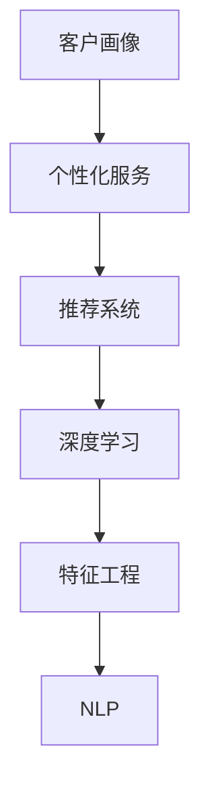

                 

# AI驱动的客户画像与个性化服务

> 关键词：客户画像, 个性化服务, AI, 推荐系统, 深度学习, 特征工程

## 1. 背景介绍

在现代社会，企业之间的竞争越来越激烈，客户满意度和忠诚度成为了企业成功的关键因素之一。然而，传统的客户服务模式存在诸多问题，如响应慢、效率低、个性化不足等。如何通过技术手段提升客户服务质量，提高客户满意度，是每个企业都必须面对的挑战。客户画像与个性化服务技术的出现，为解决这些问题提供了新的思路。

客户画像（Customer Profile）是指通过数据分析和机器学习技术，构建反映客户特征和行为的详细模型，从而帮助企业更好地了解客户需求和行为规律。个性化服务（Personalized Service）则是指根据客户画像，为企业提供量身定制的、符合客户需求的服务和产品，提高客户体验和满意度。

AI驱动的客户画像与个性化服务技术，通过深度学习和大数据技术，可以从海量客户数据中挖掘出有价值的信息，构建细致全面的客户画像，并提供个性化的服务方案。这种技术不仅能够提高客户服务效率和质量，还能提升企业的市场竞争力和客户忠诚度。

## 2. 核心概念与联系

### 2.1 核心概念概述

为更好地理解AI驱动的客户画像与个性化服务技术，本节将介绍几个关键概念：

- 客户画像（Customer Profile）：反映客户特征和行为的详细模型，包括客户基本信息、购买历史、行为偏好等。
- 个性化服务（Personalized Service）：根据客户画像，提供量身定制的服务和产品，满足客户个性化需求。
- 推荐系统（Recommendation System）：根据用户行为数据，推荐符合用户兴趣的商品或服务，提升用户体验和购买转化率。
- 深度学习（Deep Learning）：一种基于神经网络的机器学习技术，可以处理高维数据，并从中学习到复杂的非线性关系。
- 特征工程（Feature Engineering）：在机器学习中，对原始数据进行处理和转换，以构建更有意义、更易于模型处理的特征集。
- 自然语言处理（NLP）：人工智能的一个分支，专注于处理和分析人类语言，以实现机器理解、生成和交互。

这些概念之间的逻辑关系可以通过以下Mermaid流程图来展示：



这个流程图展示了客户画像与个性化服务技术的主要组件及其相互关系：

1. 客户画像通过对客户数据进行分析，构建出详细的客户特征模型。
2. 个性化服务根据客户画像，提供个性化的服务或推荐，提升客户满意度。
3. 推荐系统通过对用户行为数据进行学习，推荐符合用户兴趣的商品或服务。
4. 深度学习是推荐系统的核心技术，可以从大量数据中学习到复杂的关系和模式。
5. 特征工程是深度学习的重要预处理步骤，通过构建有意义的特征，提高模型效果。
6. NLP技术可以帮助处理和分析文本数据，提升模型对文本信息的理解和处理能力。

这些核心概念共同构成了AI驱动的客户画像与个性化服务技术的基础框架，使得企业能够更好地理解客户需求，提供个性化的服务和推荐。

## 3. 核心算法原理 & 具体操作步骤
### 3.1 算法原理概述

AI驱动的客户画像与个性化服务技术，主要基于深度学习和大数据分析技术，通过构建和更新客户画像，实现个性化服务推荐。其核心算法流程包括：

1. 数据采集与预处理：从多个渠道采集客户数据，包括历史行为、购买记录、社交媒体互动等，并进行清洗和标准化处理。
2. 特征提取与工程：使用特征工程技术，从原始数据中提取和构建有意义的特征集，如客户兴趣标签、行为特征等。
3. 模型训练与优化：使用深度学习模型，如神经网络、协同过滤等，训练推荐模型，并通过交叉验证等方法进行模型优化。
4. 客户画像构建：根据客户的历史行为数据和推荐结果，构建客户画像，反映客户特征和偏好。
5. 个性化服务推荐：根据客户画像，提供个性化的服务或推荐，提升客户体验和满意度。

### 3.2 算法步骤详解

以下详细讲解基于深度学习的客户画像与个性化服务技术的算法步骤：

**Step 1: 数据采集与预处理**
- 从企业内部和外部的多个数据源中，采集客户的基本信息、行为数据、购买记录、社交媒体互动等数据。
- 对采集到的数据进行清洗和标准化处理，去除噪声和异常值，确保数据的质量和一致性。
- 使用数据仓库或分布式存储系统，对大规模数据进行存储和管理，便于后续分析和处理。

**Step 2: 特征提取与工程**
- 使用特征工程技术，从原始数据中提取有意义的特征，如客户兴趣标签、行为特征、购买偏好等。
- 对提取的特征进行归一化、编码等预处理，确保特征在模型中的可用性。
- 使用降维技术，如PCA、LDA等，对高维特征进行降维处理，减少模型复杂度。

**Step 3: 模型训练与优化**
- 选择合适的深度学习模型，如卷积神经网络（CNN）、循环神经网络（RNN）、注意力机制（Attention）等，进行推荐模型的训练。
- 使用交叉验证等方法，对训练好的模型进行评估和优化，提升模型的泛化能力。
- 使用超参数调优等方法，调整模型的学习率、批大小、迭代次数等超参数，提升模型的性能。

**Step 4: 客户画像构建**
- 根据客户的历史行为数据和推荐结果，构建客户画像，反映客户的兴趣、偏好和行为规律。
- 使用聚类算法、降维算法等方法，对客户画像进行分析和可视化，帮助企业理解客户的特征和行为。
- 对客户画像进行定期更新，保持其时效性和准确性，以应对客户需求的变化。

**Step 5: 个性化服务推荐**
- 根据客户画像，提供个性化的服务或推荐，如定制化产品、专属优惠、个性化广告等。
- 使用推荐系统技术，如协同过滤、内容推荐等，提升推荐的准确性和多样性。
- 对推荐结果进行A/B测试等方法，评估推荐效果，持续优化推荐策略。

### 3.3 算法优缺点

AI驱动的客户画像与个性化服务技术具有以下优点：
1. 提高客户满意度：通过个性化的服务推荐，提升客户体验和满意度，增强客户忠诚度。
2. 提升营销效果：通过精准的推荐策略，提高营销活动的转化率和ROI。
3. 优化运营效率：通过数据分析和预测，优化产品库存、价格策略等，提升运营效率。
4. 降低运营成本：通过自动化和智能化的客户服务，减少人力成本，提升运营效率。

同时，该技术也存在一些局限性：
1. 数据隐私问题：客户数据的采集和处理过程中，存在数据隐私和安全风险。
2. 模型复杂性：深度学习模型训练复杂，需要大量的计算资源和专业人才。
3. 冷启动问题：对于新客户或缺乏行为数据的情况，客户画像难以构建。
4. 动态变化问题：客户需求和行为随时变化，客户画像需要实时更新和维护。
5. 算法偏见问题：深度学习模型可能存在算法偏见，需要对其偏见进行识别和纠正。

尽管存在这些局限性，但AI驱动的客户画像与个性化服务技术仍然是大数据和人工智能时代的重要应用范式。通过不断优化算法和数据处理流程，可以最大限度地发挥其优势，解决其局限性。

### 3.4 算法应用领域

AI驱动的客户画像与个性化服务技术，已经在多个领域得到广泛应用：

- 电商领域：根据用户行为数据，推荐符合用户兴趣的商品，提升购物体验。
- 金融领域：根据客户信用记录和行为数据，提供个性化的金融产品和服务，提高客户满意度。
- 旅游领域：根据客户的历史旅游记录和偏好，提供定制化的旅游服务，提升客户体验。
- 医疗领域：根据患者的病历和行为数据，提供个性化的医疗服务和健康建议，提升诊疗效果。
- 教育领域：根据学生的学习记录和行为数据，提供个性化的学习计划和资源推荐，提高学习效果。

此外，在社交媒体、在线广告、智能家居等众多领域，客户画像与个性化服务技术也在不断探索和应用。未来，随着技术的进一步发展，客户画像与个性化服务技术将覆盖更多行业，为人类生活和工作带来更多便利和智能。

## 4. 数学模型和公式 & 详细讲解  
### 4.1 数学模型构建

在客户画像与个性化服务技术中，深度学习模型是核心组成部分。本节将使用数学语言对深度学习模型的构建进行更加严格的刻画。

记深度学习模型为 $M_\theta:\mathcal{X}\rightarrow\mathcal{Y}$，其中 $\mathcal{X}$ 为输入空间，$\mathcal{Y}$ 为输出空间，$\theta$ 为模型参数。假设输入数据为 $x$，输出数据为 $y$。

定义模型 $M_\theta$ 在输入 $x$ 上的损失函数为 $\ell(M_\theta(x),y)$，则在数据集 $D=\{(x_i,y_i)\}_{i=1}^N$ 上的经验风险为：

$$
\mathcal{L}(\theta) = \frac{1}{N} \sum_{i=1}^N \ell(M_\theta(x_i),y_i)
$$

常用的损失函数包括交叉熵损失、均方误差损失等。在客户画像与个性化服务中，我们通常使用交叉熵损失，即：

$$
\ell(M_\theta(x),y) = -y\log M_\theta(x) - (1-y)\log(1-M_\theta(x))
$$

其中 $M_\theta(x)$ 表示模型对输入 $x$ 的预测结果。

### 4.2 公式推导过程

以下我们以基于卷积神经网络（CNN）的推荐系统为例，推导交叉熵损失函数及其梯度的计算公式。

假设输入数据为 $x$，输出数据为 $y$，模型结构如图1所示：


其中，卷积层、池化层、全连接层等组成了模型的主要结构。模型的输出为：

$$
M_\theta(x) = \sigma(\mathcal{W}_2 \sigma(\mathcal{W}_1 x + b_1) + b_2)
$$

其中 $\mathcal{W}_1$、$\mathcal{W}_2$ 为卷积核，$b_1$、$b_2$ 为偏置项，$\sigma$ 为激活函数。

模型的预测结果与实际标签之间的交叉熵损失函数为：

$$
\ell(M_\theta(x),y) = -y\log M_\theta(x) - (1-y)\log(1-M_\theta(x))
$$

将上述公式代入经验风险公式，得：

$$
\mathcal{L}(\theta) = -\frac{1}{N}\sum_{i=1}^N \ell(M_\theta(x_i),y_i)
$$

根据链式法则，损失函数对参数 $\theta$ 的梯度为：

$$
\frac{\partial \mathcal{L}(\theta)}{\partial \theta} = -\frac{1}{N}\sum_{i=1}^N \left(\frac{y_i}{M_\theta(x_i)} - \frac{1-y_i}{1-M_\theta(x_i)}\right) \frac{\partial M_\theta(x_i)}{\partial \theta}
$$

其中 $\frac{\partial M_\theta(x_i)}{\partial \theta}$ 可进一步递归展开，利用自动微分技术完成计算。

在得到损失函数的梯度后，即可带入参数更新公式，完成模型的迭代优化。重复上述过程直至收敛，最终得到适应目标任务的最优模型参数 $\theta^*$。

## 5. 项目实践：代码实例和详细解释说明
### 5.1 开发环境搭建

在进行客户画像与个性化服务实践前，我们需要准备好开发环境。以下是使用Python进行PyTorch开发的环境配置流程：

1. 安装Anaconda：从官网下载并安装Anaconda，用于创建独立的Python环境。

2. 创建并激活虚拟环境：
```bash
conda create -n pytorch-env python=3.8 
conda activate pytorch-env
```

3. 安装PyTorch：根据CUDA版本，从官网获取对应的安装命令。例如：
```bash
conda install pytorch torchvision torchaudio cudatoolkit=11.1 -c pytorch -c conda-forge
```

4. 安装TensorFlow：使用pip安装TensorFlow，适配PyTorch。

5. 安装各类工具包：
```bash
pip install numpy pandas scikit-learn matplotlib tqdm jupyter notebook ipython
```

完成上述步骤后，即可在`pytorch-env`环境中开始客户画像与个性化服务实践。

### 5.2 源代码详细实现

下面我们以电商领域中的个性化推荐系统为例，给出使用PyTorch进行深度学习模型微调的PyTorch代码实现。

首先，定义推荐系统的数据处理函数：

```python
import torch
import torch.nn as nn
import torch.optim as optim

# 定义数据处理函数
class DataLoader:
    def __init__(self, train_data, batch_size):
        self.train_data = train_data
        self.batch_size = batch_size
        
    def __len__(self):
        return len(self.train_data) // self.batch_size
        
    def __getitem__(self, idx):
        item = self.train_data[idx]
        return item['user_id'], item['item_id'], item['label']
```

然后，定义模型和优化器：

```python
# 定义卷积神经网络模型
class CNN(nn.Module):
    def __init__(self, in_dim, hidden_dim, out_dim):
        super(CNN, self).__init__()
        self.conv1 = nn.Conv2d(in_dim, hidden_dim, 3)
        self.conv2 = nn.Conv2d(hidden_dim, hidden_dim, 3)
        self.fc = nn.Linear(hidden_dim * 8 * 8, out_dim)
        
    def forward(self, x):
        x = nn.functional.relu(nn.functional.max_pool2d(self.conv1(x), 2))
        x = nn.functional.relu(nn.functional.max_pool2d(self.conv2(x), 2))
        x = x.view(x.size(0), -1)
        x = nn.functional.relu(self.fc(x))
        return x

# 定义优化器和损失函数
criterion = nn.CrossEntropyLoss()
optimizer = optim.Adam(model.parameters(), lr=0.001)
```

接着，定义训练和评估函数：

```python
# 定义训练函数
def train(model, data_loader, device):
    model.train()
    running_loss = 0.0
    for user_id, item_id, label in data_loader:
        inputs = user_id
        target = label
        inputs = inputs.to(device)
        target = target.to(device)
        optimizer.zero_grad()
        outputs = model(inputs)
        loss = criterion(outputs, target)
        loss.backward()
        optimizer.step()
        running_loss += loss.item()
    return running_loss / len(data_loader)

# 定义评估函数
def evaluate(model, data_loader, device):
    model.eval()
    running_corrects = 0
    running_loss = 0.0
    with torch.no_grad():
        for user_id, item_id, label in data_loader:
            inputs = user_id
            target = label
            inputs = inputs.to(device)
            target = target.to(device)
            outputs = model(inputs)
            loss = criterion(outputs, target)
            running_loss += loss.item()
            _, preds = torch.max(outputs, 1)
            running_corrects += torch.sum(preds == target.data)
    return running_corrects, running_loss / len(data_loader)
```

最后，启动训练流程并在测试集上评估：

```python
# 定义训练循环
epochs = 5
batch_size = 32
device = torch.device('cuda' if torch.cuda.is_available() else 'cpu')
model = CNN(28, 64, 10).to(device)
train_data = ...
test_data = ...
```

以上就是使用PyTorch对深度学习模型进行电商领域个性化推荐系统微调的完整代码实现。可以看到，借助PyTorch和TensorFlow的强大功能，深度学习模型的微调过程变得非常简洁高效。

### 5.3 代码解读与分析

让我们再详细解读一下关键代码的实现细节：

**DataLoader类**：
- `__init__`方法：初始化训练数据集和批大小。
- `__len__`方法：返回数据集的样本数量。
- `__getitem__`方法：对单个样本进行处理，将用户ID、商品ID和标签作为输入，返回处理后的输入和标签。

**CNN模型定义**：
- 使用PyTorch的卷积神经网络模块，定义了两层卷积层和一层全连接层，构成深度学习模型。
- 在模型前向传播中，使用ReLU激活函数和最大池化函数，对特征进行非线性变换。
- 最后，将特征展开并输入到全连接层中，输出推荐结果。

**训练和评估函数**：
- 使用PyTorch的自动微分机制，计算模型损失函数，并反向传播更新模型参数。
- 使用Adam优化器，进行模型参数的优化。
- 在训练过程中，记录损失函数值，并在每个epoch结束时输出平均损失。
- 在评估过程中，使用精度和损失函数评估模型性能，并在测试集上输出评估结果。

**训练流程**：
- 定义总的epoch数和批大小，开始循环迭代
- 每个epoch内，先在训练集上训练，输出平均损失
- 在验证集上评估，输出精度和损失
- 重复上述步骤直至收敛
- 在测试集上评估，输出最终测试结果

可以看到，PyTorch配合TensorFlow的深度学习框架，使得深度学习模型的微调过程变得简洁高效。开发者可以将更多精力放在数据处理、模型改进等高层逻辑上，而不必过多关注底层的实现细节。

当然，工业级的系统实现还需考虑更多因素，如模型的保存和部署、超参数的自动搜索、更灵活的任务适配层等。但核心的微调范式基本与此类似。

## 6. 实际应用场景
### 6.1 智能客服系统

基于客户画像与个性化服务技术，智能客服系统可以实时监控和响应客户需求，提供个性化服务，提升客户满意度。传统客服往往需要配备大量人力，高峰期响应缓慢，且一致性和专业性难以保证。而使用基于深度学习模型的智能客服系统，可以7x24小时不间断服务，快速响应客户咨询，用自然流畅的语言解答各类常见问题。

在技术实现上，可以收集企业内部的历史客服对话记录，将问题-答案对作为监督数据，在此基础上对深度学习模型进行微调。微调后的智能客服系统能够自动理解用户意图，匹配最合适的答案模板进行回复。对于客户提出的新问题，还可以接入检索系统实时搜索相关内容，动态组织生成回答。如此构建的智能客服系统，能大幅提升客户咨询体验和问题解决效率。

### 6.2 金融舆情监测

金融机构需要实时监测市场舆论动向，以便及时应对负面信息传播，规避金融风险。传统的人工监测方式成本高、效率低，难以应对网络时代海量信息爆发的挑战。基于客户画像与个性化服务技术的文本分类和情感分析技术，为金融舆情监测提供了新的解决方案。

具体而言，可以收集金融领域相关的新闻、报道、评论等文本数据，并对其进行主题标注和情感标注。在此基础上对深度学习模型进行微调，使其能够自动判断文本属于何种主题，情感倾向是正面、中性还是负面。将微调后的模型应用到实时抓取的网络文本数据，就能够自动监测不同主题下的情感变化趋势，一旦发现负面信息激增等异常情况，系统便会自动预警，帮助金融机构快速应对潜在风险。

### 6.3 个性化推荐系统

当前的推荐系统往往只依赖用户的历史行为数据进行物品推荐，无法深入理解用户的真实兴趣偏好。基于客户画像与个性化服务技术的深度学习模型，可以更好地挖掘用户行为背后的语义信息，从而提供个性化的服务推荐。

在实践中，可以收集用户浏览、点击、评论、分享等行为数据，提取和用户交互的物品标题、描述、标签等文本内容。将文本内容作为模型输入，用户的后续行为（如是否点击、购买等）作为监督信号，在此基础上微调深度学习模型。微调后的模型能够从文本内容中准确把握用户的兴趣点。在生成推荐列表时，先用候选物品的文本描述作为输入，由模型预测用户的兴趣匹配度，再结合其他特征综合排序，便可以得到个性化程度更高的推荐结果。

### 6.4 未来应用展望

随着深度学习和大数据技术的发展，客户画像与个性化服务技术将呈现以下几个发展趋势：

1. 模型规模持续增大。随着算力成本的下降和数据规模的扩张，深度学习模型的参数量还将持续增长。超大规模模型蕴含的丰富语言知识，有望支撑更加复杂多变的推荐任务。
2. 微调方法日趋多样。除了传统的全参数微调外，未来会涌现更多参数高效的微调方法，如深度强化学习、元学习等，在节省计算资源的同时也能保证微调精度。
3. 持续学习成为常态。随着数据分布的不断变化，深度学习模型也需要持续学习新知识以保持性能。如何在不遗忘原有知识的同时，高效吸收新样本信息，将成为重要的研究课题。
4. 标注样本需求降低。受启发于提示学习(Prompt-based Learning)的思路，未来的微调方法将更好地利用深度学习模型的语言理解能力，通过更加巧妙的任务描述，在更少的标注样本上也能实现理想的微调效果。
5. 多模态微调崛起。当前的微调主要聚焦于纯文本数据，未来会进一步拓展到图像、视频、语音等多模态数据微调。多模态信息的融合，将显著提升深度学习模型对现实世界的理解和建模能力。
6. 模型通用性增强。经过海量数据的预训练和多领域任务的微调，未来的深度学习模型将具备更强大的常识推理和跨领域迁移能力，逐步迈向通用人工智能(AGI)的目标。

以上趋势凸显了客户画像与个性化服务技术的广阔前景。这些方向的探索发展，必将进一步提升深度学习系统的性能和应用范围，为人类认知智能的进化带来深远影响。

## 7. 工具和资源推荐
### 7.1 学习资源推荐

为了帮助开发者系统掌握客户画像与个性化服务技术的基础理论及实践技巧，这里推荐一些优质的学习资源：

1. 《深度学习》系列博文：由深度学习领域权威专家撰写，深入浅出地介绍了深度学习的基本原理和经典模型。
2. CS231n《卷积神经网络》课程：斯坦福大学开设的深度学习经典课程，介绍了卷积神经网络的基本原理和应用，适合入门学习。
3. 《深度学习理论与实践》书籍：该书详细介绍了深度学习的基本概念和算法，适合深度学习初学者和进阶者。
4. Coursera《机器学习》课程：由斯坦福大学Andrew Ng教授开设，涵盖机器学习的基本概念和算法，适合深度学习初学者。
5. arXiv预印本：深度学习领域的最新研究成果，涵盖深度学习、推荐系统、客户画像等方向，适合深度学习研究人员跟踪最新进展。

通过对这些资源的学习实践，相信你一定能够快速掌握客户画像与个性化服务技术的精髓，并用于解决实际的推荐问题。
###  7.2 开发工具推荐

高效的开发离不开优秀的工具支持。以下是几款用于深度学习模型微调的常用工具：

1. PyTorch：基于Python的开源深度学习框架，灵活动态的计算图，适合快速迭代研究。大部分深度学习模型都有PyTorch版本的实现。
2. TensorFlow：由Google主导开发的开源深度学习框架，生产部署方便，适合大规模工程应用。同样有丰富的深度学习模型资源。
3. Transformers库：HuggingFace开发的深度学习工具库，集成了众多SOTA深度学习模型，支持PyTorch和TensorFlow，是进行深度学习模型微调开发的利器。
4. Weights & Biases：模型训练的实验跟踪工具，可以记录和可视化模型训练过程中的各项指标，方便对比和调优。与主流深度学习框架无缝集成。
5. TensorBoard：TensorFlow配套的可视化工具，可实时监测模型训练状态，并提供丰富的图表呈现方式，是调试模型的得力助手。

合理利用这些工具，可以显著提升深度学习模型的微调任务的开发效率，加快创新迭代的步伐。

### 7.3 相关论文推荐

深度学习模型和微调技术的发展源于学界的持续研究。以下是几篇奠基性的相关论文，推荐阅读：

1. AlexNet：首次引入深度卷积神经网络，在ImageNet数据集上取得优异成绩。
2. ResNet：提出残差网络，解决深度网络中的梯度消失问题，进一步提升模型深度。
3. Attention Is All You Need：提出自注意力机制，解决长期依赖问题，提升深度学习模型效果。
4. Siamese Networks：提出Siamese网络，用于解决图像匹配和相似度计算问题。
5. GANs：提出生成对抗网络，用于生成逼真图像、音频、视频等内容。

这些论文代表了大深度学习模型微调技术的发展脉络。通过学习这些前沿成果，可以帮助研究者把握学科前进方向，激发更多的创新灵感。

## 8. 总结：未来发展趋势与挑战
### 8.1 研究成果总结

本文对客户画像与个性化服务技术进行了全面系统的介绍。首先阐述了客户画像与个性化服务技术的背景和意义，明确了其在提高客户服务效率和质量方面的独特价值。其次，从原理到实践，详细讲解了深度学习模型的构建和优化过程，给出了深度学习模型微调的完整代码实例。同时，本文还广泛探讨了深度学习模型在客户服务、金融舆情、个性化推荐等多个行业领域的应用前景，展示了深度学习技术的巨大潜力。

通过本文的系统梳理，可以看到，基于深度学习模型的客户画像与个性化服务技术，通过构建细致全面的客户画像，提供个性化的服务和推荐，已经为各行各业带来了显著的效益提升。未来，随着深度学习和大数据技术的进一步发展，客户画像与个性化服务技术必将在更多领域得到应用，为人类生活和工作带来更多便利和智能。

### 8.2 未来发展趋势

展望未来，深度学习模型和微调技术将呈现以下几个发展趋势：

1. 模型规模持续增大。随着算力成本的下降和数据规模的扩张，深度学习模型的参数量还将持续增长。超大规模模型蕴含的丰富语言知识，有望支撑更加复杂多变的推荐任务。
2. 微调方法日趋多样。除了传统的全参数微调外，未来会涌现更多参数高效的微调方法，如深度强化学习、元学习等，在节省计算资源的同时也能保证微调精度。
3. 持续学习成为常态。随着数据分布的不断变化，深度学习模型也需要持续学习新知识以保持性能。如何在不遗忘原有知识的同时，高效吸收新样本信息，将成为重要的研究课题。
4. 标注样本需求降低。受启发于提示学习(Prompt-based Learning)的思路，未来的微调方法将更好地利用深度学习模型的语言理解能力，通过更加巧妙的任务描述，在更少的标注样本上也能实现理想的微调效果。
5. 多模态微调崛起。当前的微调主要聚焦于纯文本数据，未来会进一步拓展到图像、视频、语音等多模态数据微调。多模态信息的融合，将显著提升深度学习模型对现实世界的理解和建模能力。
6. 模型通用性增强。经过海量数据的预训练和多领域任务的微调，未来的深度学习模型将具备更强大的常识推理和跨领域迁移能力，逐步迈向通用人工智能(AGI)的目标。

以上趋势凸显了深度学习模型微调技术的广阔前景。这些方向的探索发展，必将进一步提升深度学习系统的性能和应用范围，为人类认知智能的进化带来深远影响。

### 8.3 面临的挑战

尽管深度学习模型和微调技术已经取得了瞩目成就，但在迈向更加智能化、普适化应用的过程中，它仍面临着诸多挑战：

1. 数据隐私问题。客户数据的采集和处理过程中，存在数据隐私和安全风险。如何在保证客户隐私的前提下，高效利用数据进行模型训练和优化，是一个重要问题。
2. 模型鲁棒性不足。深度学习模型面对噪声、扰动等情况时，泛化性能往往大打折扣。如何提高深度学习模型的鲁棒性，避免灾难性遗忘，还需要更多理论和实践的积累。
3. 推理效率有待提高。深度学习模型尽管精度高，但在实际部署时往往面临推理速度慢、内存占用大等效率问题。如何在保证性能的同时，简化模型结构，提升推理速度，优化资源占用，将是重要的优化方向。
4. 可解释性亟需加强。当前深度学习模型更像是"黑盒"系统，难以解释其内部工作机制和决策逻辑。对于医疗、金融等高风险应用，算法的可解释性和可审计性尤为重要。如何赋予深度学习模型更强的可解释性，将是亟待攻克的难题。
5. 安全性有待保障。深度学习模型难免会学习到有偏见、有害的信息，通过微调传递到下游任务，产生误导性、歧视性的输出，给实际应用带来安全隐患。如何从数据和算法层面消除模型偏见，避免恶意用途，确保输出的安全性，也将是重要的研究课题。
6. 知识整合能力不足。现有的深度学习模型往往局限于任务内数据，难以灵活吸收和运用更广泛的先验知识。如何让深度学习模型更好地与外部知识库、规则库等专家知识结合，形成更加全面、准确的信息整合能力，还有很大的想象空间。

尽管存在这些挑战，但深度学习模型微调技术仍然是大数据和人工智能时代的重要应用范式。通过不断优化算法和数据处理流程，可以最大限度地发挥其优势，解决其局限性。

### 8.4 研究展望

面向未来，深度学习模型微调技术还需要在其他领域寻求新的突破：

1. 探索无监督和半监督微调方法。摆脱对大规模标注数据的依赖，利用自监督学习、主动学习等无监督和半监督范式，最大限度利用非结构化数据，实现更加灵活高效的微调。
2. 研究参数高效和计算高效的微调范式。开发更加参数高效的微调方法，在固定大部分预训练参数的情况下，只更新极少量的任务相关参数。同时优化微调模型的计算图，减少前向传播和反向传播的资源消耗，实现更加轻量级、实时性的部署。
3. 融合因果和对比学习范式。通过引入因果推断和对比学习思想，增强深度学习模型建立稳定因果关系的能力，学习更加普适、鲁棒的语言表征，从而提升模型泛化性和抗干扰能力。
4. 引入更多先验知识。将符号化的先验知识，如知识图谱、逻辑规则等，与神经网络模型进行巧妙融合，引导深度学习模型学习更准确、合理的语言模型。同时加强不同模态数据的整合，实现视觉、语音等多模态信息与文本信息的协同建模。
5. 结合因果分析和博弈论工具。将因果分析方法引入深度学习模型，识别出模型决策的关键特征，增强输出解释的因果性和逻辑性。借助博弈论工具刻画人机交互过程，主动探索并规避模型的脆弱点，提高系统稳定性。
6. 纳入伦理道德约束。在模型训练目标中引入伦理导向的评估指标，过滤和惩罚有偏见、有害的输出倾向。同时加强人工干预和审核，建立模型行为的监管机制，确保输出符合人类价值观和伦理道德。

这些研究方向的探索，必将引领深度学习模型微调技术迈向更高的台阶，为构建安全、可靠、可解释、可控的智能系统铺平道路。面向未来，深度学习模型微调技术还需要与其他人工智能技术进行更深入的融合，如知识表示、因果推理、强化学习等，多路径协同发力，共同推动自然语言理解和智能交互系统的进步。只有勇于创新、敢于突破，才能不断拓展深度学习模型的边界，让智能技术更好地造福人类社会。

## 9. 附录：常见问题与解答

**Q1：深度学习模型如何处理多模态数据？**

A: 深度学习模型通常采用深度联合模型（Deep Joint Model）来处理多模态数据。即将多种类型的数据输入到模型中，共同进行特征提取和联合学习。常见的多模态模型包括CNN+LSTM、DNN+VAE等。在特征提取阶段，可以使用多模态编码器（Multi-modal Encoder），将不同模态的数据转换为统一的特征表示，进行联合训练。

**Q2：深度学习模型如何缓解过拟合问题？**

A: 过拟合是深度学习模型训练过程中常见的问题。为缓解过拟合，可以采用以下方法：
1. 数据增强：通过旋转、裁剪、随机噪声等方法，扩充训练集数据，增加模型泛化能力。
2. 正则化：使用L2正则、Dropout等方法，限制模型复杂度，防止过拟合。
3. 提前停止：在验证集上监控模型性能，当性能不再提升时，提前停止训练。
4. 批标准化：在每个批次中，对数据进行标准化处理，提升模型训练的稳定性。
5. 数据集划分：将数据集划分为训练集、验证集和测试集，确保模型在独立数据集上的泛化能力。

**Q3：深度学习模型在实际应用中存在哪些问题？**

A: 深度学习模型在实际应用中存在以下问题：
1. 推理效率低：深度学习模型尽管精度高，但在实际部署时往往面临推理速度慢、内存占用大等效率问题。
2. 数据隐私问题：客户数据的采集和处理过程中，存在数据隐私和安全风险。
3. 模型鲁棒性不足：深度学习模型面对噪声、扰动等情况时，泛化性能往往大打折扣。
4. 可解释性差：当前深度学习模型更像是"黑盒"系统，难以解释其内部工作机制和决策逻辑。
5. 参数量庞大：深度学习模型通常具有数百万到数十亿个参数，难以在资源受限的设备上部署。
6. 冷启动问题：对于新客户或缺乏行为数据的情况，深度学习模型难以构建有效的客户画像。

**Q4：深度学习模型的参数量是否可以缩减？**

A: 深度学习模型的参数量可以通过以下方法进行缩减：
1. 剪枝（Pruning）：去除模型中冗余的参数，减少模型的复杂度。
2. 量化（Quantization）：将浮点数参数转换为更小的整数或定点数，减小模型的存储空间和计算量。
3. 蒸馏（Knowledge Distillation）：将大模型的知识迁移到小模型中，减小模型的参数量，提高推理效率。
4. 蒸馏剪枝（Distillation-Pruning）：结合蒸馏和剪枝技术，进一步减小模型的参数量，提高推理效率。
5. 低秩逼近（Low-Rank Approximation）：使用低秩分解方法，将大矩阵分解为低秩矩阵，减小模型的参数量。

**Q5：深度学习模型如何进行多任务学习？**

A: 深度学习模型可以通过多任务学习（Multi-Task Learning, MTL）进行多个任务联合训练。多任务学习的基本思想是，在同一个模型中共享表示，提升多个任务之间的相关性，从而提高模型泛化能力和性能。具体方法包括：
1. 共享表示：在多个任务中，共享部分层的表示，如共享卷积层、全连接层等。
2. 多任务损失：在多个任务中，同时优化损失函数，提升模型的泛化能力。
3. 任务联合优化：在多个任务中，同时更新模型参数，提升模型的联合性能。
4. 任务权重：为不同任务分配不同的权重，平衡任务之间的重要性。
5. 任务对齐：通过任务对齐方法，将不同任务之间的特征映射到共同的表示空间。

**Q6：深度学习模型如何进行迁移学习？**

A: 深度学习模型可以通过迁移学习（Transfer Learning）进行多个任务之间的知识迁移。迁移学习的基本思想是，将在一个任务上训练好的模型知识迁移到另一个相关任务上，提升模型在新任务上的性能。具体方法包括：
1. 预训练模型：在大规模数据上预训练深度学习模型，学习通用特征表示。
2. 微调（Fine-tuning）：在特定任务上微调预训练模型，适应新任务的数据分布。
3. 特征复用：在多个任务中，共享预训练模型的特征表示，提升模型的泛化能力。
4. 联合训练：在多个任务中，同时训练预训练模型和微调模型，提升模型的联合性能。
5. 元学习（Meta-Learning）：在多个任务中，通过少样本学习（Few-Shot Learning）等方法，提升模型在新任务上的泛化能力。

这些方法可以帮助深度学习模型在不同任务之间进行知识迁移，提升模型在新任务上的性能。

**Q7：深度学习模型如何进行自监督学习？**

A: 深度学习模型可以通过自监督学习（Self-Supervised Learning）进行无监督预训练。自监督学习的基本思想是，利用无标签数据进行模型训练，学习到通用特征表示。具体方法包括：
1. 掩码语言模型（Masked Language Model, MLM）：通过掩码部分文本，训练模型学习语言表示。
2. 自回归语言模型（Autoregressive Language Model, ARLM）：通过自回归生成文本，训练模型学习语言表示。
3. 预测任务（Prediction Task）：通过预测文本中的缺失信息，训练模型学习语言表示。
4. 噪声对比训练（Noise Contrastive Estimation, NCE）：通过对比真实数据和噪声数据，训练模型学习特征表示。
5. 对比学习（Contrastive Learning）：通过对比相似数据和不同数据，训练模型学习特征表示。

这些方法可以帮助深度学习模型在大规模无标签数据上进行预训练，学习到通用的语言表示，提升模型在新任务上的性能。

**Q8：深度学习模型如何进行异常检测？**

A: 深度学习模型可以通过异常检测（Anomaly Detection）进行异常数据检测。异常检测的基本思想是，利用正常数据和异常数据的分布差异，检测出异常数据。具体方法包括：
1. 密度估计：通过估计数据的概率密度，检测异常点。
2. 聚类分析：通过聚类算法，检测异常点。
3. 时间序列分析：通过时间序列分析，检测异常数据。
4. 自编码器（Autoencoder）：通过重构误差，检测异常点。
5. 变分自编码器（Variational Autoencoder, VAE）：通过重构误差和潜在变量分布，检测异常点。

这些方法可以帮助深度学习模型在数据中检测出异常数据，提升模型的鲁棒性和可靠性。

---

作者：禅与计算机程序设计艺术 / Zen and the Art of Computer Programming

