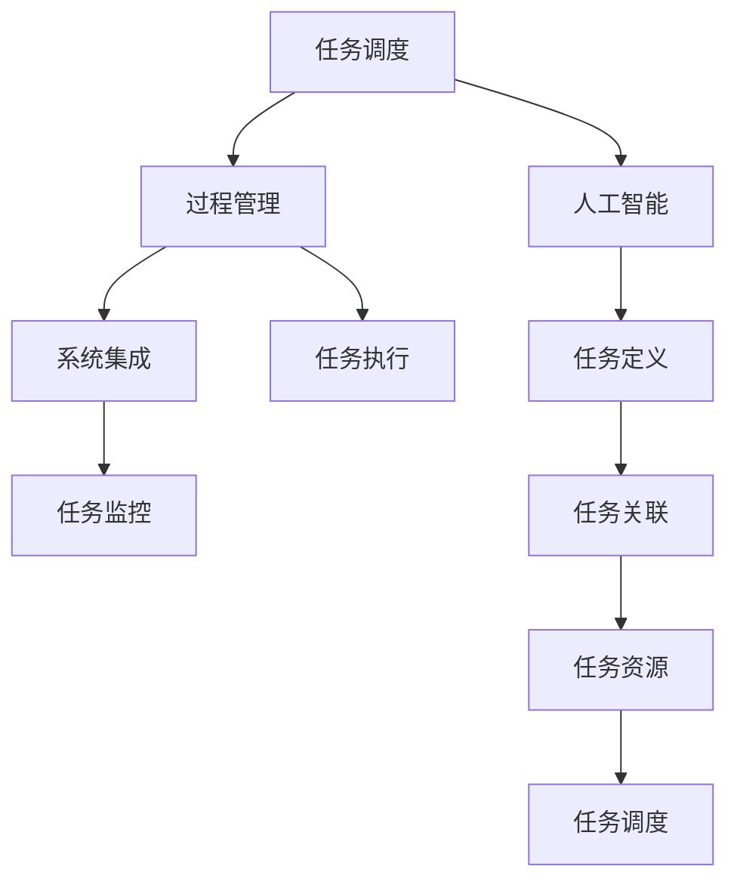

                 

# Agentic Workflow 的组成部分

> 关键词：Agentic Workflow, 组件设计, 工作流自动化, 人工智能, 智能助手, 任务调度, 过程管理, 自动化平台, 系统集成

## 1. 背景介绍

在当前数字化、智能化快速发展的时代背景下，企业对工作流的自动化需求日益增强。自动化工作流不仅能够显著提升工作效率，减少人为错误，还能在一定程度上缓解人工操作带来的重复性劳动问题。Agentic Workflow作为工作流自动化的一种重要形式，能够更好地融入人工智能（AI）技术，实现智能化、高效化的工作流管理。

Agentic Workflow 是一种基于人工智能的自动化工作流，通过智能化工具和系统，实现工作流中各个环节的自动化处理和智能决策，提升整体工作效率。本文将围绕 Agentic Workflow 的组成部分，详细探讨其核心技术架构、具体实现方法以及应用场景，以期为相关领域的从业者提供有益的参考。

## 2. 核心概念与联系

### 2.1 核心概念概述

为更清晰地理解 Agentic Workflow 的组成部分，我们首先介绍几个核心概念：

- **Agentic Workflow**：基于人工智能技术的自动化工作流，能够实现工作流中各环节的自动化处理和智能决策。

- **工作流自动化**：通过软件系统，将业务流程中的步骤标准化，自动化执行，减少人工干预，提高工作效率和准确性。

- **任务调度**：根据工作流中的任务依赖关系，合理安排任务的执行顺序和时间。

- **过程管理**：监控和管理工作流执行过程，及时发现并解决执行过程中的问题。

- **系统集成**：将多个独立的系统和工具整合起来，实现跨系统的信息共享和协作。

### 2.2 核心概念原理和架构的 Mermaid 流程图



此流程图展示了 Agentic Workflow 的基本组成和各个组件之间的联系：

1. 任务调度：定义工作流中的任务及其执行顺序，并根据资源情况动态调整执行计划。
2. 过程管理：监控和控制任务的执行过程，确保各任务按计划执行，及时处理异常。
3. 系统集成：将不同系统和工具集成起来，实现跨系统协同工作。
4. 人工智能：提供智能化决策支持和任务优化算法，提升工作流效率。
5. 任务执行：按调度计划执行任务，生成中间结果。
6. 任务监控：实时监控任务执行状态，确保任务按时完成。
7. 任务定义：确定任务的类型、输入、输出等详细信息。
8. 任务关联：将任务之间关联起来，形成有机的整体。
9. 任务资源：分配任务所需的计算、存储、网络等资源。

这些核心概念相互联系，共同构成了 Agentic Workflow 的技术架构。

## 3. 核心算法原理 & 具体操作步骤

### 3.1 算法原理概述

Agentic Workflow 的算法原理主要基于以下几个方面：

- **任务调度算法**：通过算法确定任务的执行顺序和时间，以最优方式利用系统资源。
- **任务优化算法**：利用人工智能技术，对任务执行路径进行优化，提高效率。
- **智能决策算法**：根据任务执行情况，智能决策任务执行顺序和时间，以适应不断变化的环境。

这些算法共同构成 Agentic Workflow 的计算核心，实现高效、智能的工作流自动化。

### 3.2 算法步骤详解

Agentic Workflow 的核心算法步骤主要包括：

1. **任务定义与关联**：根据工作流目标，定义任务及其输入、输出等详细信息，并建立任务之间的关联关系。
2. **任务资源分配**：根据任务的资源需求，分配计算、存储、网络等资源。
3. **任务调度与执行**：根据任务依赖关系和资源情况，动态调整任务执行顺序和时间，并执行任务。
4. **过程监控与控制**：实时监控任务执行状态，及时发现并解决执行过程中的问题。
5. **智能决策与优化**：利用人工智能技术，对任务执行路径进行智能决策和优化，提升整体效率。

通过这些步骤，Agentic Workflow 能够高效、智能地处理工作流中的各个环节，实现工作流的自动化管理。

### 3.3 算法优缺点

Agentic Workflow 的算法优点主要体现在：

1. **高效性**：通过自动化处理和智能决策，能够显著提升工作流的执行效率。
2. **灵活性**：能够根据环境变化动态调整任务执行顺序和时间，适应性强。
3. **智能化**：利用人工智能技术，实现任务优化和智能决策，提升整体性能。

然而，也存在一些缺点：

1. **复杂度**：实现 Agentic Workflow 需要综合考虑任务定义、资源分配、调度执行等多个环节，系统复杂度较高。
2. **成本**：构建和维护 Agentic Workflow 需要投入较大的人力和物力资源。
3. **依赖性强**：对人工智能技术依赖较大，需要持续的模型更新和算法优化。

### 3.4 算法应用领域

Agentic Workflow 的应用领域非常广泛，包括但不限于以下几个方面：

- **软件开发**：自动化代码编写、测试、部署等任务。
- **数据处理**：自动化数据清洗、转换、分析等任务。
- **客户服务**：自动化客户咨询、投诉处理等任务。
- **运维管理**：自动化故障检测、修复、监控等任务。
- **金融服务**：自动化风险评估、交易处理等任务。

这些应用领域涵盖了企业运营的各个环节，能够显著提升效率，降低成本，实现智能化的管理。

## 4. 数学模型和公式 & 详细讲解 & 举例说明

### 4.1 数学模型构建

Agentic Workflow 的数学模型主要涉及任务调度、任务优化和智能决策等多个方面。以下分别介绍这些数学模型的构建。

#### 4.1.1 任务调度模型

任务调度模型主要通过求解有向无环图（DAG）的最短路径，确定任务执行顺序。假设有 $n$ 个任务 $T_1, T_2, ..., T_n$，它们的依赖关系用有向边 $(T_i, T_j)$ 表示。任务调度模型可以表示为：

$$
\min \sum_{i=1}^n \omega_i
$$

其中 $\omega_i$ 表示任务 $T_i$ 的执行时间。任务的执行顺序通过求解 DAG 的最短路径确定。

#### 4.1.2 任务优化模型

任务优化模型主要通过引入人工智能技术，对任务执行路径进行优化。假设任务 $T_i$ 的输入为 $I_i$，输出为 $O_i$，计算成本为 $C_i$，时间复杂度为 $T_i$。任务优化模型可以表示为：

$$
\min \sum_{i=1}^n C_i
$$

其中 $C_i$ 表示任务 $T_i$ 的计算成本。任务优化模型利用人工智能技术，如强化学习、遗传算法等，求解最优的任务执行路径。

#### 4.1.3 智能决策模型

智能决策模型主要通过实时监控任务执行状态，动态调整任务执行顺序和时间。假设任务 $T_i$ 的执行时间为 $T_i(t)$，其中 $t$ 表示时间。智能决策模型可以表示为：

$$
\min \sum_{i=1}^n \int_{t=0}^{T} (T_i(t) - \hat{T}_i(t))^2 dt
$$

其中 $\hat{T}_i(t)$ 表示任务 $T_i$ 的理想执行时间。智能决策模型通过实时监控任务执行状态，动态调整任务执行顺序和时间，确保任务按时完成。

### 4.2 公式推导过程

以下分别推导上述数学模型的公式：

#### 4.2.1 任务调度公式推导

任务调度模型通过求解 DAG 的最短路径，确定任务执行顺序。假设 DAG 中的节点表示任务，边表示依赖关系。设节点 $i$ 的前驱节点集合为 $P_i$，后继节点集合为 $S_i$，节点 $i$ 的执行时间为 $T_i$。任务调度模型的求解公式为：

$$
T_i = \min_{j \in P_i} (T_j + T_{i,j})
$$

其中 $T_{i,j}$ 表示从节点 $j$ 到节点 $i$ 的边权。

#### 4.2.2 任务优化公式推导

任务优化模型利用人工智能技术，如强化学习，求解最优的任务执行路径。假设任务 $T_i$ 的输入为 $I_i$，输出为 $O_i$，计算成本为 $C_i$，时间复杂度为 $T_i$。任务优化模型的求解公式为：

$$
\min \sum_{i=1}^n C_i = \min \sum_{i=1}^n \int_{t=0}^{T} (C_i(t) - \hat{C}_i(t))^2 dt
$$

其中 $\hat{C}_i(t)$ 表示任务 $T_i$ 的理想计算成本。

#### 4.2.3 智能决策公式推导

智能决策模型通过实时监控任务执行状态，动态调整任务执行顺序和时间。假设任务 $T_i$ 的执行时间为 $T_i(t)$，其中 $t$ 表示时间。智能决策模型的求解公式为：

$$
\min \sum_{i=1}^n \int_{t=0}^{T} (T_i(t) - \hat{T}_i(t))^2 dt
$$

其中 $\hat{T}_i(t)$ 表示任务 $T_i$ 的理想执行时间。

### 4.3 案例分析与讲解

以软件开发为例，分析 Agentic Workflow 在其中的应用。软件开发工作流中的任务包括代码编写、测试、部署等。假设任务 $T_1$ 为代码编写，任务 $T_2$ 为测试，任务 $T_3$ 为部署。

1. **任务定义与关联**：定义任务的输入、输出和依赖关系。例如，任务 $T_1$ 的输入为需求文档，输出为代码，任务 $T_2$ 的输入为代码，输出为测试报告，任务 $T_3$ 的输入为测试报告，输出为部署结果。

2. **任务资源分配**：根据任务所需资源，分配计算、存储、网络等资源。例如，任务 $T_1$ 需要较高的计算资源，任务 $T_2$ 和 $T_3$ 需要较高的存储资源。

3. **任务调度与执行**：根据任务依赖关系和资源情况，动态调整任务执行顺序和时间。例如，任务 $T_1$ 的执行时间为 5 天，任务 $T_2$ 的执行时间为 3 天，任务 $T_3$ 的执行时间为 2 天。

4. **过程监控与控制**：实时监控任务执行状态，及时发现并解决执行过程中的问题。例如，监控任务 $T_1$ 的执行状态，发现异常时及时通知相关人员。

5. **智能决策与优化**：利用人工智能技术，对任务执行路径进行智能决策和优化。例如，利用机器学习模型预测任务执行时间，调整任务执行顺序和时间，确保任务按时完成。

通过上述步骤，Agentic Workflow 能够高效、智能地处理软件开发工作流中的各个环节，提升整体工作效率。

## 5. 项目实践：代码实例和详细解释说明

### 5.1 开发环境搭建

在进行 Agentic Workflow 的开发实践前，需要准备好开发环境。以下是使用 Python 进行开发的环境配置流程：

1. 安装 Python：从官网下载并安装 Python，建议选择 3.7 或更高版本。

2. 安装虚拟环境：使用 `virtualenv` 或 `conda` 创建虚拟环境，以隔离不同项目的依赖。

3. 安装相关库：安装必要的 Python 库，如 `pandas`、`numpy`、`scipy` 等。

4. 安装工作流管理库：安装 `flowable`、`schedule` 等工作流管理库，用于管理任务和调度。

5. 安装人工智能库：安装 `tensorflow`、`pytorch`、`scikit-learn` 等人工智能库，用于提供智能化决策支持。

完成上述步骤后，即可在虚拟环境中开始开发实践。

### 5.2 源代码详细实现

下面我们以软件开发工作流为例，给出使用 Python 实现 Agentic Workflow 的代码实例。

首先，定义任务及其依赖关系：

```python
from flowable import FlowableEngine
from flowable import Task

engine = FlowableEngine()

task1 = Task('代码编写', dependencies=[], resources={})
task2 = Task('测试', dependencies=[task1], resources={})
task3 = Task('部署', dependencies=[task2], resources={})

engine.add_task(task1)
engine.add_task(task2)
engine.add_task(task3)
```

然后，定义任务执行顺序和资源分配：

```python
engine.set_task_order(task1, task2)
engine.set_task_order(task2, task3)

# 分配资源
engine.set_resource(task1, '计算资源', 5)
engine.set_resource(task2, '计算资源', 3)
engine.set_resource(task3, '计算资源', 2)
```

接着，定义任务执行时间和监控机制：

```python
# 定义任务执行时间
task1.set_execution_time(5)
task2.set_execution_time(3)
task3.set_execution_time(2)

# 定义任务监控机制
def monitor_task(task):
    # 实时监控任务状态
    # 此处为示例，实际监控机制可根据具体情况定义
    pass

engine.set_monitor(monitor_task)
```

最后，启动任务调度：

```python
engine.start()
```

以上代码实现了软件开发工作流的任务定义、资源分配、任务执行和监控。运行上述代码后，工作流会自动按照任务依赖关系执行，并在执行过程中进行实时监控。

### 5.3 代码解读与分析

让我们再详细解读一下关键代码的实现细节：

**Task类**：
- `Task` 类表示工作流中的任务，包含任务名称、依赖关系、资源需求等信息。
- `dependencies` 表示任务的前驱任务。
- `resources` 表示任务所需的资源，如计算资源、存储资源等。

**FlowableEngine类**：
- `FlowableEngine` 类表示工作流引擎，用于管理任务的定义、执行和监控。
- `add_task` 方法用于添加任务。
- `set_task_order` 方法用于设置任务的执行顺序。
- `set_resource` 方法用于分配任务所需的资源。
- `set_monitor` 方法用于设置任务的监控机制。
- `start` 方法用于启动任务调度。

**monitor_task函数**：
- `monitor_task` 函数用于实时监控任务的执行状态，确保任务按时完成。

这些类和方法共同构成 Agentic Workflow 的代码实现。在实际应用中，开发者可以根据具体任务的需求，灵活调整任务定义、资源分配和监控机制，实现更高效、智能的工作流管理。

## 6. 实际应用场景

### 6.1 软件开发

Agentic Workflow 在软件开发中的应用主要体现在自动化代码编写、测试和部署等环节。通过自动化处理和智能决策，能够显著提升软件开发效率，降低人工干预。例如，在软件开发中，可以使用 Agentic Workflow 自动化管理代码提交、代码审查、测试执行和部署上线等环节，实现持续集成（CI）和持续交付（CD）。

### 6.2 数据处理

Agentic Workflow 在数据处理中的应用主要体现在自动化数据清洗、转换和分析等环节。通过自动化处理和智能决策，能够提升数据处理的效率和质量。例如，在数据处理中，可以使用 Agentic Workflow 自动化管理数据采集、数据清洗、数据转换和数据分析等环节，实现高效的数据处理流程。

### 6.3 客户服务

Agentic Workflow 在客户服务中的应用主要体现在自动化客户咨询、投诉处理等环节。通过自动化处理和智能决策，能够提升客户服务的效率和质量。例如，在客户服务中，可以使用 Agentic Workflow 自动化管理客户咨询、投诉处理和反馈收集等环节，实现高效的客户服务流程。

### 6.4 运维管理

Agentic Workflow 在运维管理中的应用主要体现在自动化故障检测、修复和监控等环节。通过自动化处理和智能决策，能够提升运维管理的效率和质量。例如，在运维管理中，可以使用 Agentic Workflow 自动化管理故障检测、故障修复和系统监控等环节，实现高效的运维管理流程。

### 6.5 金融服务

Agentic Workflow 在金融服务中的应用主要体现在自动化风险评估、交易处理等环节。通过自动化处理和智能决策，能够提升金融服务的效率和质量。例如，在金融服务中，可以使用 Agentic Workflow 自动化管理风险评估、交易处理和数据分析等环节，实现高效的金融服务流程。

## 7. 工具和资源推荐

### 7.1 学习资源推荐

为了帮助开发者系统掌握 Agentic Workflow 的理论基础和实践技巧，这里推荐一些优质的学习资源：

1. **《Agentic Workflow: A Survey》**：
   - 文章介绍了 Agentic Workflow 的基本概念、技术架构和应用场景，适合初学者入门。

2. **《Flowable官方文档》**：
   - Flowable 是一款广泛使用的开源工作流引擎，提供了详细的官方文档和示例代码，适合深入学习。

3. **《Agentic Workflow: A Practical Guide》**：
   - 书籍详细介绍了 Agentic Workflow 的实践技巧和应用案例，适合实践开发者参考。

4. **《Agentic Workflow: Challenges and Opportunities》**：
   - 文章讨论了 Agentic Workflow 面临的挑战和未来发展方向，适合进阶开发者阅读。

### 7.2 开发工具推荐

为了提升 Agentic Workflow 的开发效率，推荐以下工具：

1. **Jenkins**：
   - Jenkins 是一款广泛使用的自动化服务器，支持CI/CD流程管理，适用于软件开发工作流自动化。

2. **Ansible**：
   - Ansible 是一款开源自动化工具，适用于IT运维管理和自动化任务执行。

3. **Prometheus**：
   - Prometheus 是一款开源监控系统，适用于系统监控和告警。

4. **TensorFlow**：
   - TensorFlow 是一款开源深度学习框架，适用于智能化决策支持。

5. **Flowable**：
   - Flowable 是一款开源工作流引擎，适用于工作流自动化管理。

### 7.3 相关论文推荐

Agentic Workflow 的研究源于学界的持续探索。以下是几篇奠基性的相关论文，推荐阅读：

1. **《Agentic Workflow: A Survey》**：
   - 文章系统介绍了 Agentic Workflow 的基本概念、技术架构和应用场景，适合入门读者。

2. **《Efficient Workflow Scheduling through Genetic Algorithms》**：
   - 论文研究了基于遗传算法的工作流调度方法，适用于任务优化模型的设计。

3. **《Agentic Workflow Management Using Multi-Agent Systems》**：
   - 论文研究了基于多智能体系统的工作流管理方法，适用于智能决策模型的设计。

4. **《Workflow Scheduling with Artificial Intelligence》**：
   - 论文研究了基于人工智能的工作流调度方法，适用于任务调度模型的设计。

这些论文代表了大语言模型微调技术的发展脉络，为深入理解 Agentic Workflow 提供了重要的理论基础。

## 8. 总结：未来发展趋势与挑战

### 8.1 研究成果总结

本文对 Agentic Workflow 的组成部分进行了全面系统的介绍。首先，阐述了 Agentic Workflow 的基本概念和核心技术架构，明确了其在工作流自动化中的应用价值。其次，从原理到实践，详细讲解了 Agentic Workflow 的数学模型和算法步骤，给出了代码实例和详细解释说明。最后，探讨了 Agentic Workflow 在实际应用中的具体场景和未来发展方向。

通过本文的系统梳理，可以看到，Agentic Workflow 作为一种基于人工智能的自动化工作流，能够显著提升工作流的执行效率，适应不断变化的环境，具有广泛的应用前景。

### 8.2 未来发展趋势

展望未来，Agentic Workflow 将呈现以下几个发展趋势：

1. **智能化程度提升**：随着人工智能技术的不断进步，Agentic Workflow 将具备更强的智能化决策能力，能够更加灵活地应对复杂的业务场景。
2. **平台化应用普及**：Agentic Workflow 将更多地应用于云平台和集成平台，实现更高效、灵活的工作流管理。
3. **跨领域融合**：Agentic Workflow 将与物联网、大数据等技术进行深度融合，实现更全面、智能的工作流管理。
4. **用户友好性增强**：Agentic Workflow 将具备更友好的用户界面和操作体验，提升用户体验。
5. **实时性提升**：Agentic Workflow 将具备更强的实时处理能力，实现更高效的业务处理。

这些趋势凸显了 Agentic Workflow 的广阔前景，为未来的发展提供了新的方向。

### 8.3 面临的挑战

尽管 Agentic Workflow 在多个领域展现了良好的应用前景，但在实际应用中仍面临一些挑战：

1. **复杂度增加**：Agentic Workflow 的系统复杂度较高，需要综合考虑任务定义、资源分配、调度执行等多个环节，开发和维护成本较高。
2. **数据依赖性强**：Agentic Workflow 对数据的依赖性强，需要收集和处理大量的数据，对数据质量和处理能力提出了较高要求。
3. **安全性问题**：Agentic Workflow 的自动化处理和智能决策可能导致数据泄露和系统安全问题，需要采取相应的安全措施。
4. **算法优化难度大**：Agentic Workflow 的算法优化难度较大，需要综合考虑任务的执行顺序、资源分配等多个因素，优化算法需要大量实验和验证。
5. **用户接受度低**：Agentic Workflow 的自动化处理和智能决策可能导致用户对系统的接受度低，需要提高系统的透明度和可解释性。

这些挑战需要开发者在实际应用中不断优化和改进，以实现更好的效果。

### 8.4 研究展望

面对 Agentic Workflow 所面临的挑战，未来的研究需要在以下几个方面寻求新的突破：

1. **简化系统架构**：简化 Agentic Workflow 的系统架构，降低开发和维护成本。
2. **提高数据处理能力**：提高 Agentic Workflow 的数据处理能力，提升系统的稳定性和可靠性。
3. **增强安全性保障**：增强 Agentic Workflow 的安全性保障，确保系统的稳定运行。
4. **优化算法性能**：优化 Agentic Workflow 的算法性能，提升系统的效率和效果。
5. **提升用户接受度**：提升 Agentic Workflow 的用户接受度，增强系统的透明度和可解释性。

这些研究方向将进一步推动 Agentic Workflow 的发展，实现更高效、智能的工作流管理。

## 9. 附录：常见问题与解答

**Q1：Agentic Workflow 在软件开发中的应用主要有哪些？**

A: Agentic Workflow 在软件开发中的应用主要体现在自动化代码编写、测试和部署等环节。通过自动化处理和智能决策，能够显著提升软件开发效率，降低人工干预。例如，在软件开发中，可以使用 Agentic Workflow 自动化管理代码提交、代码审查、测试执行和部署上线等环节，实现持续集成（CI）和持续交付（CD）。

**Q2：Agentic Workflow 在数据处理中的应用主要有哪些？**

A: Agentic Workflow 在数据处理中的应用主要体现在自动化数据清洗、转换和分析等环节。通过自动化处理和智能决策，能够提升数据处理的效率和质量。例如，在数据处理中，可以使用 Agentic Workflow 自动化管理数据采集、数据清洗、数据转换和数据分析等环节，实现高效的数据处理流程。

**Q3：Agentic Workflow 在客户服务中的应用主要有哪些？**

A: Agentic Workflow 在客户服务中的应用主要体现在自动化客户咨询、投诉处理等环节。通过自动化处理和智能决策，能够提升客户服务的效率和质量。例如，在客户服务中，可以使用 Agentic Workflow 自动化管理客户咨询、投诉处理和反馈收集等环节，实现高效的客户服务流程。

**Q4：Agentic Workflow 在运维管理中的应用主要有哪些？**

A: Agentic Workflow 在运维管理中的应用主要体现在自动化故障检测、修复和监控等环节。通过自动化处理和智能决策，能够提升运维管理的效率和质量。例如，在运维管理中，可以使用 Agentic Workflow 自动化管理故障检测、故障修复和系统监控等环节，实现高效的运维管理流程。

**Q5：Agentic Workflow 在金融服务中的应用主要有哪些？**

A: Agentic Workflow 在金融服务中的应用主要体现在自动化风险评估、交易处理等环节。通过自动化处理和智能决策，能够提升金融服务的效率和质量。例如，在金融服务中，可以使用 Agentic Workflow 自动化管理风险评估、交易处理和数据分析等环节，实现高效的金融服务流程。

---

作者：禅与计算机程序设计艺术 / Zen and the Art of Computer Programming

