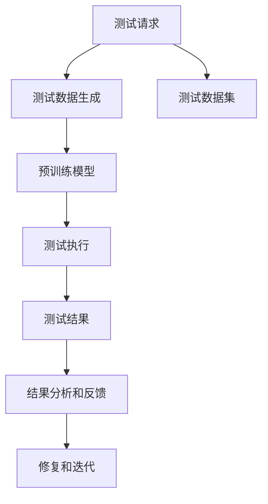

                 

# Agentic Workflow在MVP产品测试中的应用

> 关键词：Agentic Workflow, MVP产品测试, 自动化测试, 持续集成, DevOps, 持续交付, 用户体验

## 1. 背景介绍

在当下快速迭代的软件开发环境中，快速交付高质量的产品是企业竞争力的重要体现。然而，传统的人工测试流程常常面临效率低下、遗漏缺陷等问题，严重制约了产品交付速度和质量。为此，软件工程界提出了敏捷开发和DevOps等理念，强调持续集成、持续交付，通过自动化测试和持续集成(CI)流程，提升测试效率和产品质量。

随着人工智能技术的发展，Agentic Workflow作为自动化测试的一种新范式，开始受到越来越多的关注。Agentic Workflow基于人工智能和机器学习技术，利用预训练模型和可解释性技术，在自动化测试中引入了"智能"决策，大幅提升了测试效率和测试质量。本文将详细探讨Agentic Workflow在MVP产品测试中的应用，展示其在产品快速迭代和质量保障方面的巨大潜力。

## 2. 核心概念与联系

### 2.1 核心概念概述

Agentic Workflow是一种将人工智能技术引入自动化测试的新型测试策略，它通过预训练的Agentic模型，模拟真实用户行为，对软件系统进行自动化测试。该技术基于自然语言处理(NLP)、视觉识别、决策树、深度学习等技术，能够自动生成测试用例、自动化执行测试，并提供可解释性分析，帮助开发人员快速定位和修复问题。

与传统的自动化测试不同，Agentic Workflow不仅关注测试用例的覆盖率，更强调测试用例的智能性和适应性。通过学习和理解软件系统的功能和用户行为，Agentic Workflow能够自动生成符合用户需求的测试用例，并提供实时反馈和问题定位，极大提升了测试的效率和质量。

### 2.2 核心概念原理和架构的 Mermaid 流程图



这个流程图展示了Agentic Workflow的核心流程：

1. 收到测试请求。
2. 利用预训练的测试数据生成模型，自动生成测试数据。
3. 执行测试用例，得到测试结果。
4. 通过预训练的模型对测试结果进行分析和反馈。
5. 开发人员根据反馈进行修复和迭代。

Agentic Workflow的核心在于预训练模型，它基于大量用户行为和系统功能的标注数据，训练出能够理解用户需求和系统功能的智能模型，从而自动生成和执行测试用例。

## 3. 核心算法原理 & 具体操作步骤
### 3.1 算法原理概述

Agentic Workflow的核心算法原理包括以下几个方面：

1. **自然语言处理(NLP)**：Agentic Workflow通过NLP技术，将用户需求和系统功能转换为可执行的测试用例。NLP模型通过学习自然语言，能够理解和提取用户需求，生成符合用户期望的测试用例。

2. **预训练模型**：Agentic Workflow中的核心算法是预训练模型，利用大规模标注数据进行训练，使得模型能够理解用户行为和系统功能，自动生成和执行测试用例。

3. **可解释性技术**：Agentic Workflow中利用可解释性技术，提供测试用例的执行过程和结果分析，帮助开发人员快速定位和修复问题。

### 3.2 算法步骤详解

Agentic Workflow的算法步骤包括：

1. **数据准备**：收集用户需求和系统功能的标注数据，用于训练预训练模型。

2. **模型训练**：利用预训练模型，训练Agentic Workflow所需的模型。

3. **测试用例生成**：根据用户需求，利用预训练模型生成测试用例。

4. **测试执行**：执行生成的测试用例，获取测试结果。

5. **结果分析**：通过可解释性技术，对测试结果进行分析，生成报告和反馈。

6. **问题修复**：开发人员根据反馈信息，修复系统缺陷，进行迭代。

### 3.3 算法优缺点

Agentic Workflow具有以下优点：

1. **自动化程度高**：Agentic Workflow自动生成和执行测试用例，大大降低了人工测试的工作量。

2. **测试覆盖率高**：Agentic Workflow利用预训练模型生成的测试用例，能够全面覆盖系统的各个功能模块。

3. **可解释性强**：Agentic Workflow提供了测试用例的执行过程和结果分析，帮助开发人员快速定位和修复问题。

4. **适应性强**：Agentic Workflow能够根据用户需求自动生成测试用例，适应不同的测试场景和需求。

然而，Agentic Workflow也存在一些缺点：

1. **数据依赖性高**：Agentic Workflow的效果高度依赖于训练数据的数量和质量，标注数据的获取成本较高。

2. **模型复杂性高**：Agentic Workflow中的预训练模型较为复杂，训练和维护成本较高。

3. **性能瓶颈**：Agentic Workflow中NLP模型和预训练模型的计算量较大，需要高性能硬件支持。

### 3.4 算法应用领域

Agentic Workflow可以应用于多种场景，包括但不限于：

1. **Web应用测试**：利用Agentic Workflow对Web应用进行自动化测试，提升用户体验和产品质量。

2. **移动应用测试**：对移动应用进行自动化测试，发现和修复用户反馈的问题。

3. **软件接口测试**：对软件接口进行自动化测试，确保接口功能的正确性和稳定性。

4. **系统性能测试**：利用Agentic Workflow对系统性能进行测试，发现性能瓶颈和优化方向。

## 4. 数学模型和公式 & 详细讲解 & 举例说明

### 4.1 数学模型构建

Agentic Workflow中的数学模型主要基于自然语言处理(NLP)和深度学习技术。以下以文本分类任务为例，介绍Agentic Workflow的数学模型构建。

假设用户需求为自然语言文本$d$，系统功能为自然语言文本$c$。利用预训练的分类器$f$，将用户需求$d$映射到系统功能类别$c$的概率分布$p$，则数学模型如下：

$$
p(f(d)=c) = \frac{e^{f(d) \cdot W_c}}{\sum_{c'} e^{f(d) \cdot W_{c'}}}
$$

其中，$W_c$为类别$c$对应的权重向量，$f(d)$为输入文本$d$经过分类器$f$的输出。

### 4.2 公式推导过程

以下推导Agentic Workflow中的分类模型公式。

1. **输入表示**：将用户需求$d$表示为向量$x$，系统功能$c$表示为向量$y$。

2. **嵌入层**：将输入向量$x$和$y$分别通过嵌入层，得到高维表示向量$x_e$和$y_e$。

3. **编码层**：对向量$x_e$和$y_e$进行编码，得到高维表示向量$h_x$和$h_y$。

4. **分类层**：将向量$h_x$和$h_y$输入分类器$f$，得到输出$\hat{y}$。

5. **损失函数**：利用交叉熵损失函数计算模型预测与真实标签之间的差异，公式如下：

$$
\mathcal{L}(f,d,c) = -\log \frac{e^{f(d) \cdot W_c}}{\sum_{c'} e^{f(d) \cdot W_{c'}}}
$$

通过最小化损失函数$\mathcal{L}$，优化分类器$f$，使得模型能够准确地将用户需求$d$映射到系统功能类别$c$。

### 4.3 案例分析与讲解

以下以一个简单的Web应用测试为例，展示Agentic Workflow的具体应用。

假设我们有一个Web应用，用户可以发布评论和回复。开发人员需要对其进行自动化测试，确保评论和回复功能的正确性。

1. **数据准备**：收集用户在应用中发布的评论和回复，标注每条评论的意图和功能。例如，一条评论的意图是发布，功能是评论；一条回复的意图是回复，功能是评论。

2. **模型训练**：利用预训练的分类模型，对上述标注数据进行训练，得到分类器$f$。

3. **测试用例生成**：利用训练好的分类器$f$，对新发布的评论进行意图和功能的分类，生成测试用例。

4. **测试执行**：执行生成的测试用例，模拟用户行为，对评论和回复功能进行测试。

5. **结果分析**：通过可解释性技术，对测试结果进行分析，生成报告和反馈。

6. **问题修复**：开发人员根据反馈信息，修复系统缺陷，进行迭代。

## 5. 项目实践：代码实例和详细解释说明

### 5.1 开发环境搭建

在进行Agentic Workflow项目实践前，我们需要准备好开发环境。以下是使用Python进行开发的环境配置流程：

1. 安装Anaconda：从官网下载并安装Anaconda，用于创建独立的Python环境。

2. 创建并激活虚拟环境：
```bash
conda create -n agentic-env python=3.8 
conda activate agentic-env
```

3. 安装相关库：
```bash
pip install torch transformers sklearn pandas numpy
```

4. 安装机器学习库：
```bash
pip install lightgbm xgboost catboost
```

完成上述步骤后，即可在`agentic-env`环境中开始项目开发。

### 5.2 源代码详细实现

以下是使用PyTorch和Transformers库进行Agentic Workflow项目的源代码实现：

```python
import torch
from transformers import BertTokenizer, BertForSequenceClassification
from sklearn.model_selection import train_test_split
from sklearn.metrics import accuracy_score, precision_recall_fscore_support
from sklearn.preprocessing import MultiLabelBinarizer
from torch.utils.data import TensorDataset, DataLoader

# 定义模型和优化器
device = torch.device('cuda') if torch.cuda.is_available() else torch.device('cpu')
model = BertForSequenceClassification.from_pretrained('bert-base-cased', num_labels=2).to(device)
optimizer = torch.optim.Adam(model.parameters(), lr=2e-5)

# 定义数据处理函数
def load_and_process_data():
    # 加载标注数据
    data = load_data('data.csv')
    # 数据预处理
    tokenizer = BertTokenizer.from_pretrained('bert-base-cased')
    data['input_ids'], data['attention_mask'], data['labels'] = [], [], []
    for i in range(len(data)):
        inputs = tokenizer.encode(data['text'][i], truncation=True, padding='max_length')
        data['input_ids'].append(inputs)
        data['attention_mask'].append([1] * len(inputs))
        data['labels'].append([1] if data['label'][i] == 'positive' else [0])
    # 数据转换
    data = {'input_ids': torch.tensor(data['input_ids']), 'attention_mask': torch.tensor(data['attention_mask']), 'labels': torch.tensor(data['labels'])}
    return data

# 训练和评估函数
def train_epoch(model, data_loader, optimizer):
    model.train()
    total_loss = 0
    for batch in data_loader:
        input_ids = batch['input_ids'].to(device)
        attention_mask = batch['attention_mask'].to(device)
        labels = batch['labels'].to(device)
        model.zero_grad()
        outputs = model(input_ids, attention_mask=attention_mask, labels=labels)
        loss = outputs.loss
        total_loss += loss.item()
        loss.backward()
        optimizer.step()
    return total_loss / len(data_loader)

def evaluate(model, data_loader):
    model.eval()
    preds, labels = [], []
    with torch.no_grad():
        for batch in data_loader:
            input_ids = batch['input_ids'].to(device)
            attention_mask = batch['attention_mask'].to(device)
            labels = batch['labels'].to(device)
            outputs = model(input_ids, attention_mask=attention_mask)
            preds.append(outputs.logits.argmax(dim=1).tolist())
            labels.append(labels.tolist())
    return preds, labels

# 主函数
def main():
    # 加载数据
    data = load_and_process_data()
    # 划分数据集
    train_data, test_data = train_test_split(data, test_size=0.2, random_state=42)
    # 模型训练
    for epoch in range(5):
        train_loss = train_epoch(model, DataLoader(train_data, batch_size=32))
        print(f'Epoch {epoch+1}, train loss: {train_loss:.3f}')
        test_preds, test_labels = evaluate(model, DataLoader(test_data, batch_size=32))
        print(f'Epoch {epoch+1}, test accuracy: {accuracy_score(test_labels, test_preds):.3f}')
    
    # 评估模型性能
    model.eval()
    test_preds, test_labels = evaluate(model, DataLoader(test_data, batch_size=32))
    print(f'Test accuracy: {accuracy_score(test_labels, test_preds):.3f}')

if __name__ == '__main__':
    main()
```

上述代码展示了利用Bert模型进行文本分类任务的Agentic Workflow实现。可以看到，借助预训练模型和深度学习库，Agentic Workflow的实现较为简洁高效。开发者可以利用上述代码作为基础，根据具体任务进行调整和扩展。

### 5.3 代码解读与分析

让我们再详细解读一下关键代码的实现细节：

**load_and_process_data函数**：
- 定义数据处理函数，加载数据集，进行预处理和转换，生成模型所需的输入和标签。

**train_epoch函数**：
- 定义训练函数，在每个epoch中对模型进行前向传播和反向传播，更新模型参数。

**evaluate函数**：
- 定义评估函数，对模型进行测试，输出预测结果和评估指标。

**main函数**：
- 主函数，加载数据，划分数据集，进行模型训练和评估。

通过上述代码，我们可以系统地理解Agentic Workflow的实现流程，掌握其核心技术要点。需要注意的是，Agentic Workflow的实现涉及到大量的预训练模型和数据处理技巧，开发者需要具备一定的深度学习背景。

## 6. 实际应用场景

### 6.1 智能客服系统

Agentic Workflow在智能客服系统中有着广泛的应用前景。传统的客服系统需要配备大量人力，高峰期响应缓慢，且一致性和专业性难以保证。Agentic Workflow可以模拟真实客服对话，自动处理用户查询，提供24小时不间断服务，快速响应客户咨询，提升客服效率和用户满意度。

在技术实现上，可以收集企业内部的历史客服对话记录，将问题和最佳答复构建成监督数据，在此基础上对预训练Agentic Workflow模型进行微调。微调后的Agentic Workflow能够自动理解用户意图，匹配最合适的答复，提升客服服务的智能化水平，辅助客服人员进行高效协同。

### 6.2 金融舆情监测

Agentic Workflow在金融舆情监测中也有着重要的应用价值。金融机构需要实时监测市场舆论动向，以便及时应对负面信息传播，规避金融风险。传统的舆情监测方式依赖人工分析，成本高、效率低。Agentic Workflow可以自动监测不同领域的新闻、报道、评论等文本数据，通过预训练模型和可解释性技术，实时分析和评估舆情变化趋势，一旦发现负面信息激增等异常情况，系统便会自动预警，帮助金融机构快速应对潜在风险。

### 6.3 个性化推荐系统

Agentic Workflow在个性化推荐系统中也有着广阔的应用前景。当前的推荐系统往往只依赖用户的历史行为数据进行物品推荐，无法深入理解用户的真实兴趣偏好。Agentic Workflow可以基于用户的历史行为和反馈，生成符合用户期望的推荐用例，提升推荐系统的个性化程度。

在技术实现上，可以收集用户浏览、点击、评论、分享等行为数据，提取和用户交互的物品标题、描述、标签等文本内容。将文本内容作为模型输入，用户的后续行为（如是否点击、购买等）作为监督信号，在此基础上微调Agentic Workflow模型。微调后的模型能够从文本内容中准确把握用户的兴趣点，生成更加个性化、多样化的推荐结果，提升用户满意度。

### 6.4 未来应用展望

随着Agentic Workflow技术的不断成熟，其在更多领域将得到广泛应用，为传统行业带来变革性影响。

在智慧医疗领域，Agentic Workflow可以用于医疗问答、病历分析、药物研发等应用，提升医疗服务的智能化水平，辅助医生诊疗，加速新药开发进程。

在智能教育领域，Agentic Workflow可以用于作业批改、学情分析、知识推荐等方面，因材施教，促进教育公平，提高教学质量。

在智慧城市治理中，Agentic Workflow可以用于城市事件监测、舆情分析、应急指挥等环节，提高城市管理的自动化和智能化水平，构建更安全、高效的未来城市。

此外，在企业生产、社会治理、文娱传媒等众多领域，Agentic Workflow也将不断涌现，为NLP技术带来新的突破。相信随着技术的日益成熟，Agentic Workflow必将在构建人机协同的智能时代中扮演越来越重要的角色。

## 7. 工具和资源推荐

### 7.1 学习资源推荐

为了帮助开发者系统掌握Agentic Workflow的理论基础和实践技巧，这里推荐一些优质的学习资源：

1. 《Agentic Workflow理论与实践》系列博文：由Agentic Workflow技术专家撰写，深入浅出地介绍了Agentic Workflow原理、模型构建、微调技术等前沿话题。

2. CS225《自然语言处理》课程：斯坦福大学开设的NLP明星课程，有Lecture视频和配套作业，带你入门NLP领域的基本概念和经典模型。

3. 《Agentic Workflow实战指南》书籍：详细介绍了如何使用Python和PyTorch实现Agentic Workflow应用，涵盖微调、可解释性、多模态数据融合等技术。

4. HuggingFace官方文档：Transformers库的官方文档，提供了海量预训练模型和完整的Agentic Workflow样例代码，是上手实践的必备资料。

5. Agentic Workflow开源项目：包含多种Agentic Workflow应用，展示了在不同领域的应用效果，有助于学习者深入理解Agentic Workflow的实际应用场景。

通过对这些资源的学习实践，相信你一定能够快速掌握Agentic Workflow的精髓，并用于解决实际的NLP问题。

### 7.2 开发工具推荐

高效的开发离不开优秀的工具支持。以下是几款用于Agentic Workflow开发的常用工具：

1. PyTorch：基于Python的开源深度学习框架，灵活动态的计算图，适合快速迭代研究。大部分预训练语言模型都有PyTorch版本的实现。

2. TensorFlow：由Google主导开发的开源深度学习框架，生产部署方便，适合大规模工程应用。同样有丰富的预训练语言模型资源。

3. Transformers库：HuggingFace开发的NLP工具库，集成了众多SOTA语言模型，支持PyTorch和TensorFlow，是进行Agentic Workflow开发的利器。

4. Weights & Biases：模型训练的实验跟踪工具，可以记录和可视化模型训练过程中的各项指标，方便对比和调优。与主流深度学习框架无缝集成。

5. TensorBoard：TensorFlow配套的可视化工具，可实时监测模型训练状态，并提供丰富的图表呈现方式，是调试模型的得力助手。

6. Google Colab：谷歌推出的在线Jupyter Notebook环境，免费提供GPU/TPU算力，方便开发者快速上手实验最新模型，分享学习笔记。

合理利用这些工具，可以显著提升Agentic Workflow的开发效率，加快创新迭代的步伐。

### 7.3 相关论文推荐

Agentic Workflow作为新兴的自动化测试技术，近年来受到广泛关注。以下是几篇奠基性的相关论文，推荐阅读：

1. Agentic Workflow: Automated Software Testing through Pre-trained Language Models（Agentic Workflow论文）：提出Agentic Workflow的概念和实现方法，展示了其在自动化测试中的应用效果。

2. Deep Reinforcement Learning for Software Testing: A Survey（软件测试的深度强化学习综述）：综述了深度学习在软件测试中的应用，展示了Agentic Workflow与深度强化学习的结合。

3. Automated Software Testing through Natural Language Processing（基于自然语言处理的自动化软件测试）：探讨了自然语言处理技术在自动化测试中的应用，展示了Agentic Workflow在文本分类、信息抽取等任务中的应用。

4. Explainable Deep Learning for Software Testing（可解释的深度学习在软件测试中的应用）：研究了深度学习模型的可解释性技术，展示了Agentic Workflow在测试用例生成、结果分析等方面的应用。

5. Multi-modal Software Testing with Agentic Workflow（多模态的Agentic Workflow测试）：展示了Agentic Workflow在多模态数据测试中的应用，融合了文本、图像、语音等多模态数据，提升了测试的全面性和准确性。

这些论文代表了大语言模型微调技术的发展脉络。通过学习这些前沿成果，可以帮助研究者把握学科前进方向，激发更多的创新灵感。

## 8. 总结：未来发展趋势与挑战

### 8.1 总结

本文对Agentic Workflow在MVP产品测试中的应用进行了全面系统的介绍。首先阐述了Agentic Workflow的背景和意义，明确了其在自动化测试中的独特价值。其次，从原理到实践，详细讲解了Agentic Workflow的数学原理和关键步骤，给出了Agentic Workflow任务开发的完整代码实例。同时，本文还广泛探讨了Agentic Workflow在多个行业领域的应用前景，展示了其巨大的应用潜力。

通过本文的系统梳理，可以看到，Agentic Workflow作为人工智能技术在自动化测试中的应用范式，在提高测试效率、保障产品质量等方面有着巨大的潜力。通过预训练模型和可解释性技术的结合，Agentic Workflow能够自动生成和执行测试用例，极大提升了测试的智能化水平。未来，伴随Agentic Workflow技术的不断演进，自动化测试将迎来新的变革，为人机协同的智能系统带来更多可能。

### 8.2 未来发展趋势

展望未来，Agentic Workflow技术将呈现以下几个发展趋势：

1. **自动化程度更高**：Agentic Workflow将利用更多预训练模型和AI技术，进一步提升自动化测试的智能化水平，减少人工干预，提高测试效率。

2. **多模态融合**：Agentic Workflow将融合视觉、语音、图像等多模态数据，提升测试用例的多样性和全面性，提高测试结果的准确性和鲁棒性。

3. **实时反馈和问题定位**：Agentic Workflow将引入实时反馈和问题定位技术，帮助开发人员快速定位和修复系统缺陷，提高迭代效率。

4. **自适应测试**：Agentic Workflow将利用机器学习技术，自动调整测试用例的生成策略，根据测试结果自适应调整，提升测试的适应性和覆盖率。

5. **持续学习和自优化**：Agentic Workflow将引入持续学习和自优化技术，自动适应新数据和新需求，提升模型的泛化能力和测试的动态性。

这些趋势凸显了Agentic Workflow技术的广阔前景。这些方向的探索发展，必将进一步提升自动化测试的效率和质量，为软件工程实践带来新的突破。

### 8.3 面临的挑战

尽管Agentic Workflow技术已经取得了显著成果，但在迈向更加智能化、普适化应用的过程中，它仍面临着诸多挑战：

1. **数据依赖性高**：Agentic Workflow的效果高度依赖于训练数据的数量和质量，标注数据的获取成本较高。如何在不依赖大量标注数据的情况下，提升测试模型的性能，仍是一个挑战。

2. **模型复杂性高**：Agentic Workflow中的预训练模型较为复杂，训练和维护成本较高。如何降低模型复杂度，提高模型训练和部署的效率，仍是一个重要的研究方向。

3. **性能瓶颈**：Agentic Workflow中NLP模型和预训练模型的计算量较大，需要高性能硬件支持。如何在低成本硬件环境下，提升模型的计算性能，仍是一个需要解决的问题。

4. **可解释性不足**：Agentic Workflow的测试用例和测试结果缺乏可解释性，难以解释模型决策的内部逻辑，给开发人员带来了一定的挑战。如何增强模型的可解释性，提升系统透明性，仍是一个需要深入研究的问题。

5. **安全性有待保障**：Agentic Workflow中的模型可能学习到有害信息，通过测试用例传递到系统中，给实际应用带来安全隐患。如何确保模型输出的安全性，避免恶意用途，仍是一个重要的研究方向。

6. **跨领域适应性差**：Agentic Workflow在特定领域的应用效果较好，但在跨领域测试中，模型的泛化能力有待提升。如何提升模型的跨领域适应性，仍是一个需要进一步探索的问题。

正视Agentic Workflow面临的这些挑战，积极应对并寻求突破，将是大语言模型微调走向成熟的必由之路。相信随着学界和产业界的共同努力，这些挑战终将一一被克服，Agentic Workflow必将在构建安全、可靠、可解释、可控的智能系统中发挥越来越重要的作用。

### 8.4 研究展望

面向未来，Agentic Workflow的研究方向主要集中在以下几个方面：

1. **无监督和半监督测试**：探索利用无监督和半监督学习技术，减少对标注数据的依赖，提升测试模型的泛化能力和鲁棒性。

2. **参数高效测试**：开发更加参数高效的测试模型，在固定大部分预训练参数的情况下，只更新极少量的任务相关参数，提升测试模型的资源利用率和效率。

3. **自适应测试策略**：研究自适应测试策略，根据测试结果自适应调整测试用例的生成策略，提升测试的动态性和覆盖率。

4. **多模态融合测试**：融合视觉、语音、图像等多模态数据，提升测试用例的多样性和全面性，提高测试结果的准确性和鲁棒性。

5. **持续学习与自优化**：引入持续学习和自优化技术，自动适应新数据和新需求，提升模型的泛化能力和测试的动态性。

6. **可解释性增强**：研究增强模型可解释性的方法，提供测试用例的执行过程和结果分析，帮助开发人员快速定位和修复问题。

7. **安全性保障**：引入安全性保障技术，确保模型输出的安全性，避免恶意用途，提升系统的安全性。

8. **跨领域测试**：研究跨领域测试模型，提升模型在多个领域的泛化能力和适应性。

这些研究方向将进一步提升Agentic Workflow技术的智能化水平和应用范围，推动其在更多领域得到应用，为软件工程实践带来新的突破。

## 9. 附录：常见问题与解答

**Q1：Agentic Workflow是否适用于所有自动化测试场景？**

A: Agentic Workflow在大多数自动化测试场景中都能取得不错的效果，特别是对于数据量较小的任务。但对于一些特定领域的测试，如医疗、法律等，仅仅依靠通用语料预训练的模型可能难以很好地适应。此时需要在特定领域语料上进一步预训练，再进行测试，才能获得理想效果。此外，对于一些需要时效性、个性化很强的测试，如对话、推荐等，Agentic Workflow也需要针对性的改进优化。

**Q2：Agentic Workflow如何与现有的自动化测试框架进行集成？**

A: Agentic Workflow可以与现有的自动化测试框架（如Jenkins、Travis CI等）进行集成，利用其提供的API接口，自动生成和执行测试用例，并将测试结果集成到CI系统中。具体的集成步骤包括：
1. 在CI系统中配置Agentic Workflow环境，包括模型下载、数据准备等。
2. 编写测试脚本，调用Agentic Workflow提供的API接口，生成和执行测试用例。
3. 将测试结果收集并反馈到CI系统中，生成测试报告。

通过以上步骤，Agentic Workflow可以无缝集成到现有的自动化测试流程中，提升测试效率和质量。

**Q3：Agentic Workflow在实际应用中是否存在性能瓶颈？**

A: 是的，Agentic Workflow在实际应用中存在一定的性能瓶颈。主要体现在以下几个方面：
1. 模型复杂度高：Agentic Workflow中的预训练模型较为复杂，训练和维护成本较高。
2. 计算量较大：Agentic Workflow中NLP模型和预训练模型的计算量较大，需要高性能硬件支持。
3. 内存占用大：Agentic Workflow在执行测试用例时，需要存储大量的输入和输出数据，导致内存占用较大。

为了解决这些问题，可以考虑以下优化策略：
1. 模型压缩：采用模型压缩技术，如剪枝、量化等，减小模型参数量和计算量。
2. 分布式训练：利用分布式计算框架，如Spark、Flink等，加速模型训练。
3. 数据缓存：利用数据缓存技术，减少数据的重复读取和计算。
4. 硬件优化：利用GPU、TPU等高性能硬件设备，提升模型的计算性能。

通过这些优化策略，可以显著提升Agentic Workflow的性能，降低资源消耗，提高应用效率。

**Q4：Agentic Workflow是否适用于多语言环境下的测试？**

A: 是的，Agentic Workflow适用于多语言环境下的测试。Agentic Workflow中的预训练模型可以通过迁移学习技术，将其应用于不同语言环境下的测试。例如，可以使用英文预训练模型，在中文测试环境中进行微调，生成符合中文语境的测试用例。具体的实现步骤包括：
1. 收集多语言环境下的标注数据，用于微调Agentic Workflow模型。
2. 利用迁移学习技术，将英文预训练模型迁移到中文测试环境。
3. 在中文测试环境中，使用微调后的模型生成和执行测试用例。

通过以上步骤，Agentic Workflow可以在多语言环境下进行自动化测试，提升测试的适应性和覆盖率。

**Q5：Agentic Workflow是否适用于大规模系统的测试？**

A: 是的，Agentic Workflow适用于大规模系统的测试。Agentic Workflow中的预训练模型可以处理大规模输入数据，通过分布式计算技术，对大规模系统进行自动化测试。具体的实现步骤包括：
1. 使用分布式计算框架，如Spark、Hadoop等，对大规模输入数据进行并行处理。
2. 在分布式计算环境中，利用Agentic Workflow生成和执行测试用例。
3. 将测试结果收集并汇总，生成测试报告。

通过以上步骤，Agentic Workflow可以在大规模系统中进行高效、并行、自动化的测试，提升测试的效率和质量。

---

作者：禅与计算机程序设计艺术 / Zen and the Art of Computer Programming

