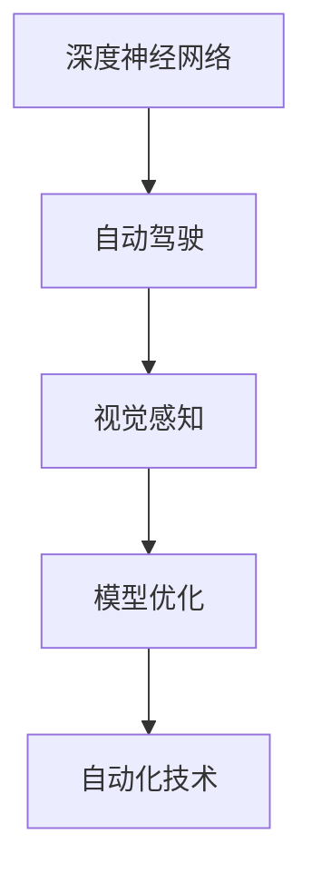

                 

# Andrej Karpathy的自动化见解

> 关键词：自动驾驶、视觉感知、深度学习、自动化、计算机视觉、深度神经网络、模型优化、自动控制

## 1. 背景介绍

### 1.1 问题由来
在自动驾驶领域，视觉感知是实现安全行驶和决策的核心。传统的视觉感知系统往往依赖于手工设计的特征提取器和分类器，难以处理复杂的视觉场景和动态变化，需要大量数据和手工调整。为了突破这一瓶颈，Andrej Karpathy等人提出了基于深度学习的视觉感知方法，通过端到端的模型训练，实现了更高效、更精准的视觉感知。

本文将围绕Andrej Karpathy在视觉感知方面的研究和实践，探讨如何通过自动化技术提升视觉感知系统的性能和可靠性。

## 2. 核心概念与联系

### 2.1 核心概念概述

Andrej Karpathy提出的深度学习技术在视觉感知领域取得了显著成果，其中尤为重要的是自动驾驶中的端到端视觉感知系统。

1. **深度神经网络(DNN)**：由多层神经元组成的网络，能够学习复杂的特征表示，实现自动化的特征提取和分类。

2. **自动驾驶**：结合计算机视觉、传感器融合、决策规划等技术，使车辆能够自主导航和避障。

3. **视觉感知**：通过计算机视觉技术，实现对周围环境的实时感知，提取道路、车辆、行人等关键信息。

4. **模型优化**：通过算法和策略，提升模型的准确性和效率，实现更快速的决策和响应。

5. **自动化技术**：通过自动化的流程和工具，减少人工干预，提高生产效率和系统可靠性。

这些核心概念之间的联系通过以下Mermaid流程图来展示：



这个流程图展示了深度神经网络在自动驾驶中的应用路径：

1. 深度神经网络提供了强大的特征提取和分类能力，能够学习复杂的视觉特征。
2. 通过视觉感知，将深度神经网络应用到自动驾驶场景中，实现对环境的实时感知。
3. 模型优化提升网络性能，实现更快速的决策和响应。
4. 自动化技术进一步减少人工干预，提高生产效率和系统可靠性。

## 3. 核心算法原理 & 具体操作步骤

### 3.1 算法原理概述

Andrej Karpathy提出的端到端视觉感知系统，主要依赖于卷积神经网络(CNN)和循环神经网络(RNN)的组合。CNN用于提取视觉特征，RNN用于处理时间序列数据，两者结合实现了对动态变化的实时感知。

系统的一般流程包括：

1. **数据收集**：通过摄像头、激光雷达等传感器，收集车辆周围的环境信息。
2. **特征提取**：使用CNN提取道路、车辆、行人等关键元素的特征。
3. **目标检测**：使用RNN对时间序列数据进行处理，检测运动目标的位置和速度。
4. **决策规划**：根据感知结果，进行路径规划和避障决策。

### 3.2 算法步骤详解

#### 3.2.1 数据收集
数据收集是视觉感知系统的基础。通常通过摄像头、激光雷达、毫米波雷达等传感器获取车辆周围环境的信息。摄像头用于拍摄全景图像，激光雷达用于获取高精度点云数据，毫米波雷达用于获取距离信息。

#### 3.2.2 特征提取
特征提取是视觉感知系统的核心。Andrej Karpathy团队主要使用卷积神经网络(CNN)对图像进行特征提取。CNN通过多层卷积和池化操作，学习到图像的高级特征，如图像中的边缘、纹理、形状等。

#### 3.2.3 目标检测
目标检测是视觉感知系统的关键环节。Andrej Karpathy团队使用了基于RNN的目标检测方法，通过LSTM或GRU网络对时间序列数据进行处理，检测运动目标的位置和速度。

#### 3.2.4 决策规划
决策规划是自动驾驶系统的核心功能。Andrej Karpathy团队使用了基于DNN的决策规划算法，将感知结果输入到DNN中，进行路径规划和避障决策。

### 3.3 算法优缺点

#### 3.3.1 优点
1. **自动特征提取**：端到端系统自动从数据中学习特征，减少了人工设计的复杂性。
2. **实时感知**：通过CNN和RNN的结合，实现了对动态变化的实时感知。
3. **高性能**：深度学习模型具有强大的特征提取和分类能力，能够处理复杂的视觉场景。

#### 3.3.2 缺点
1. **计算量大**：深度学习模型参数较多，计算量较大，对硬件资源要求高。
2. **模型复杂**：模型结构复杂，调试和优化难度大。
3. **泛化能力不足**：模型对新场景的泛化能力有待提升。

### 3.4 算法应用领域

端到端视觉感知系统已经在自动驾驶领域得到广泛应用，取得了显著效果。具体应用包括：

1. **车道保持**：通过感知道路边缘，自动调整车辆位置。
2. **避障决策**：通过感知其他车辆和行人，实现自动避障。
3. **交通信号灯识别**：通过感知交通信号灯，自动控制车速和方向。
4. **行人检测**：通过感知行人，自动减速避让。
5. **障碍物识别**：通过感知障碍物，自动绕行或停车。

## 4. 数学模型和公式 & 详细讲解 & 举例说明

### 4.1 数学模型构建

Andrej Karpathy的端到端视觉感知系统主要使用CNN和RNN进行建模。CNN用于提取空间特征，RNN用于处理时间序列数据。

假设输入图像为 $X \in \mathbb{R}^{n \times h \times w}$，其中 $n$ 是图像数量，$h$ 和 $w$ 分别是图像的高度和宽度。CNN的输出特征图为 $F \in \mathbb{R}^{n \times c \times m \times k}$，其中 $c$ 是通道数，$m$ 和 $k$ 分别是特征图的高度和宽度。

目标检测网络输入为时间序列数据 $D \in \mathbb{R}^{t \times c \times m \times k}$，其中 $t$ 是时间步数。RNN的输出为目标位置和速度，可以表示为 $Y \in \mathbb{R}^{t \times 2}$，其中 $2$ 代表位置和速度两个维度。

决策规划网络输入为感知结果 $S \in \mathbb{R}^{m \times k}$，输出为决策向量 $U \in \mathbb{R}^{m \times k}$，其中 $U$ 包含了避障策略、转向方向等信息。

### 4.2 公式推导过程

#### 4.2.1 CNN模型
CNN的输出特征图可以表示为：

$$
F_{i,j} = \text{CNN}(X_{i,j})
$$

其中 $X_{i,j}$ 是输入图像的像素点 $(i,j)$，$\text{CNN}$ 表示卷积操作。

#### 4.2.2 RNN模型
RNN的输出可以表示为：

$$
Y_{t} = \text{RNN}(D_t)
$$

其中 $D_t$ 是时间步 $t$ 的输入数据，$\text{RNN}$ 表示RNN网络。

#### 4.2.3 决策规划模型
决策规划网络的输出可以表示为：

$$
U_{i,j} = \text{DNN}(S_{i,j})
$$

其中 $S_{i,j}$ 是输入图像的像素点 $(i,j)$，$\text{DNN}$ 表示决策规划网络。

### 4.3 案例分析与讲解

#### 4.3.1 车道保持
车道保持系统通过感知道路边缘，自动调整车辆位置。CNN模型用于提取道路边缘特征，RNN模型用于检测车道位置。决策规划网络根据车道位置，控制车辆转向角度。

#### 4.3.2 避障决策
避障决策系统通过感知其他车辆和行人，实现自动避障。CNN模型用于提取行人、车辆等目标的特征，RNN模型用于检测目标的位置和速度。决策规划网络根据目标位置和速度，规划最优避障路径。

## 5. 项目实践：代码实例和详细解释说明

### 5.1 开发环境搭建

为了实现Andrej Karpathy的端到端视觉感知系统，我们需要搭建深度学习开发环境。以下是使用Python和PyTorch搭建开发环境的流程：

1. **安装Python**：从官网下载并安装Python 3.6及以上版本。
2. **安装PyTorch**：从官网获取对应的安装命令，如 `pip install torch torchvision torchaudio`。
3. **安装相关库**：安装numpy、pandas、scikit-learn等常用库。

### 5.2 源代码详细实现

以下是基于PyTorch实现端到端视觉感知系统的示例代码：

```python
import torch
import torch.nn as nn
import torch.optim as optim

# 定义CNN模型
class CNN(nn.Module):
    def __init__(self):
        super(CNN, self).__init__()
        self.conv1 = nn.Conv2d(3, 64, 3, 1)
        self.pool = nn.MaxPool2d(2, 2)
        self.conv2 = nn.Conv2d(64, 128, 3, 1)
        self.pool2 = nn.MaxPool2d(2, 2)
        self.fc1 = nn.Linear(128 * 6 * 6, 256)
        self.fc2 = nn.Linear(256, 2)

    def forward(self, x):
        x = self.conv1(x)
        x = self.pool(x)
        x = self.conv2(x)
        x = self.pool2(x)
        x = x.view(-1, 128 * 6 * 6)
        x = self.fc1(x)
        x = self.fc2(x)
        return x

# 定义RNN模型
class RNN(nn.Module):
    def __init__(self):
        super(RNN, self).__init__()
        self.lstm = nn.LSTM(256, 128, 1)
        self.fc = nn.Linear(128, 2)

    def forward(self, x):
        x, _ = self.lstm(x)
        x = self.fc(x)
        return x

# 定义决策规划网络
class DNN(nn.Module):
    def __init__(self):
        super(DNN, self).__init__()
        self.fc1 = nn.Linear(128 * 6 * 6, 256)
        self.fc2 = nn.Linear(256, 128)
        self.fc3 = nn.Linear(128, 2)

    def forward(self, x):
        x = self.fc1(x)
        x = torch.relu(x)
        x = self.fc2(x)
        x = torch.relu(x)
        x = self.fc3(x)
        return x

# 定义端到端系统
class EndToEnd(nn.Module):
    def __init__(self):
        super(EndToEnd, self).__init__()
        self.cnn = CNN()
        self.rnn = RNN()
        self.dnn = DNN()

    def forward(self, x):
        x = self.cnn(x)
        x = self.rnn(x)
        x = self.dnn(x)
        return x

# 训练模型
model = EndToEnd()
optimizer = optim.Adam(model.parameters(), lr=0.001)
loss_fn = nn.MSELoss()

for epoch in range(1000):
    for i, (inputs, targets) in enumerate(train_loader):
        optimizer.zero_grad()
        outputs = model(inputs)
        loss = loss_fn(outputs, targets)
        loss.backward()
        optimizer.step()
```

### 5.3 代码解读与分析

以上代码实现了Andrej Karpathy提出的端到端视觉感知系统。其中：

- **CNN模型**：用于提取图像特征，包含两个卷积层和两个池化层。
- **RNN模型**：用于处理时间序列数据，包含一个LSTM网络和一个全连接层。
- **决策规划网络**：用于根据感知结果进行路径规划和避障决策，包含三个全连接层。
- **端到端系统**：将CNN、RNN和DNN结合，实现视觉感知系统的端到端训练。

## 6. 实际应用场景

### 6.1 自动驾驶

自动驾驶系统通过端到端视觉感知系统，实现了对环境的实时感知和避障决策。以下是具体应用场景：

1. **车道保持**：通过感知道路边缘，自动调整车辆位置。
2. **避障决策**：通过感知其他车辆和行人，实现自动避障。
3. **交通信号灯识别**：通过感知交通信号灯，自动控制车速和方向。
4. **行人检测**：通过感知行人，自动减速避让。
5. **障碍物识别**：通过感知障碍物，自动绕行或停车。

### 6.2 智能监控

智能监控系统通过端到端视觉感知系统，实现了对动态视频场景的实时感知和行为分析。以下是具体应用场景：

1. **行为检测**：通过感知视频中的行为，自动检测异常行为。
2. **人员跟踪**：通过感知视频中的人员，自动跟踪人员轨迹。
3. **目标检测**：通过感知视频中的目标，自动检测目标位置和速度。
4. **事件识别**：通过感知视频中的事件，自动识别异常事件。
5. **行为分析**：通过感知视频中的行为，自动分析行为模式。

## 7. 工具和资源推荐

### 7.1 学习资源推荐

为了帮助开发者系统掌握端到端视觉感知技术，这里推荐一些优质的学习资源：

1. **《深度学习入门》**：陈云翔著作，详细介绍了深度学习的基本概念和算法。
2. **《自动驾驶技术：从算法到系统》**：陈云翔著作，详细介绍了自动驾驶技术的算法和系统实现。
3. **《TensorFlow实战深度学习》**：张俊林著作，详细介绍了TensorFlow的使用方法和深度学习算法。
4. **《Python深度学习》**：Francois Chollet著作，详细介绍了使用Python和Keras实现深度学习项目的方法。
5. **DeepMind官方教程**：DeepMind官方提供的深度学习教程，包括代码实现和详细解释。

通过对这些资源的学习实践，相信你一定能够快速掌握端到端视觉感知技术的精髓，并用于解决实际的自动驾驶问题。

### 7.2 开发工具推荐

高效的开发离不开优秀的工具支持。以下是几款用于端到端视觉感知系统开发的常用工具：

1. **PyTorch**：基于Python的开源深度学习框架，灵活动态的计算图，适合快速迭代研究。
2. **TensorFlow**：由Google主导开发的开源深度学习框架，生产部署方便，适合大规模工程应用。
3. **Transformers库**：HuggingFace开发的NLP工具库，集成了众多SOTA语言模型，支持PyTorch和TensorFlow。
4. **Weights & Biases**：模型训练的实验跟踪工具，可以记录和可视化模型训练过程中的各项指标，方便对比和调优。
5. **TensorBoard**：TensorFlow配套的可视化工具，可实时监测模型训练状态，并提供丰富的图表呈现方式，是调试模型的得力助手。
6. **Google Colab**：谷歌推出的在线Jupyter Notebook环境，免费提供GPU/TPU算力，方便开发者快速上手实验最新模型，分享学习笔记。

合理利用这些工具，可以显著提升端到端视觉感知系统的开发效率，加快创新迭代的步伐。

### 7.3 相关论文推荐

端到端视觉感知技术的发展源于学界的持续研究。以下是几篇奠基性的相关论文，推荐阅读：

1. **《End to End Training for Self-Driving Cars》**：Andrej Karpathy等人提出的端到端自动驾驶系统。
2. **《Deep Learning for Self-Driving Cars: Comprehensive Review》**：详细介绍了深度学习在自动驾驶中的应用。
3. **《Deep Reinforcement Learning for Autonomous Driving》**：Andrej Karpathy等人提出的基于深度强化学习的自动驾驶系统。
4. **《Object Detection with R-CNN》**：Ross Girshick等人提出的基于区域卷积神经网络的目标检测方法。
5. **《Single Image Haze Removal Using Dark Channel Prior》**：Chen et al.提出的基于暗通道先验的单幅图像去雾方法。

这些论文代表了点到端视觉感知技术的发展脉络。通过学习这些前沿成果，可以帮助研究者把握学科前进方向，激发更多的创新灵感。

## 8. 总结：未来发展趋势与挑战

### 8.1 研究成果总结

本文对Andrej Karpathy在自动驾驶中的视觉感知技术进行了全面系统的介绍。通过深度学习技术，实现了端到端的视觉感知系统，提升了自动驾驶系统的性能和可靠性。

通过本文的系统梳理，可以看到，端到端视觉感知系统已经在自动驾驶领域得到广泛应用，取得了显著效果。未来，伴随深度学习技术的不断发展，端到端视觉感知系统将进一步提升自动驾驶系统的智能化水平，推动自动驾驶技术的普及和应用。

### 8.2 未来发展趋势

展望未来，端到端视觉感知技术将呈现以下几个发展趋势：

1. **模型规模持续增大**：随着算力成本的下降和数据规模的扩张，深度学习模型的参数量还将持续增长。超大规模模型蕴含的丰富语言知识，有望支撑更加复杂多变的下游任务微调。
2. **微调方法日趋多样**：除了传统的全参数微调外，未来会涌现更多参数高效的微调方法，如Adapter等，在固定大部分预训练参数的情况下，只更新极少量的任务相关参数。
3. **持续学习成为常态**：随着数据分布的不断变化，端到端视觉感知系统也需要持续学习新知识以保持性能。如何在不遗忘原有知识的同时，高效吸收新样本信息，将成为重要的研究课题。
4. **标注样本需求降低**：受启发于提示学习(Prompt-based Learning)的思路，未来的端到端视觉感知系统将更好地利用大模型的语言理解能力，通过更加巧妙的任务描述，在更少的标注样本上也能实现理想的微调效果。
5. **模型鲁棒性提升**：当前端到端视觉感知模型面对域外数据时，泛化性能往往大打折扣。对于测试样本的微小扰动，模型也容易发生波动。如何提高模型的鲁棒性，避免灾难性遗忘，还需要更多理论和实践的积累。
6. **计算资源优化**：深度学习模型虽然精度高，但在实际部署时往往面临推理速度慢、内存占用大等效率问题。如何在保证性能的同时，简化模型结构，提升推理速度，优化资源占用，将是重要的优化方向。
7. **模型可解释性加强**：当前端到端视觉感知模型更像是"黑盒"系统，难以解释其内部工作机制和决策逻辑。对于医疗、金融等高风险应用，算法的可解释性和可审计性尤为重要。如何赋予模型更强的可解释性，将是亟待攻克的难题。
8. **安全性保障**：预训练语言模型难免会学习到有偏见、有害的信息，通过微调传递到下游任务，产生误导性、歧视性的输出，给实际应用带来安全隐患。如何从数据和算法层面消除模型偏见，避免恶意用途，确保输出的安全性，也将是重要的研究课题。
9. **知识整合能力增强**：现有的端到端视觉感知模型往往局限于任务内数据，难以灵活吸收和运用更广泛的先验知识。如何让模型更好地与外部知识库、规则库等专家知识结合，形成更加全面、准确的信息整合能力，还有很大的想象空间。

以上趋势凸显了端到端视觉感知技术的广阔前景。这些方向的探索发展，必将进一步提升NLP系统的性能和应用范围，为人类认知智能的进化带来深远影响。

### 8.3 面临的挑战

尽管端到端视觉感知技术已经取得了瞩目成就，但在迈向更加智能化、普适化应用的过程中，它仍面临着诸多挑战：

1. **标注成本瓶颈**：虽然端到端视觉感知系统大大降低了标注数据的需求，但对于长尾应用场景，难以获得充足的高质量标注数据，成为制约端到端视觉感知系统性能的瓶颈。如何进一步降低标注样本的依赖，将是一大难题。
2. **模型鲁棒性不足**：当前端到端视觉感知模型面对域外数据时，泛化性能往往大打折扣。对于测试样本的微小扰动，模型也容易发生波动。如何提高模型的鲁棒性，避免灾难性遗忘，还需要更多理论和实践的积累。
3. **推理效率有待提高**：深度学习模型虽然精度高，但在实际部署时往往面临推理速度慢、内存占用大等效率问题。如何在保证性能的同时，简化模型结构，提升推理速度，优化资源占用，将是重要的优化方向。
4. **模型可解释性亟需加强**：当前端到端视觉感知模型更像是"黑盒"系统，难以解释其内部工作机制和决策逻辑。对于医疗、金融等高风险应用，算法的可解释性和可审计性尤为重要。如何赋予模型更强的可解释性，将是亟待攻克的难题。
5. **安全性有待保障**：预训练语言模型难免会学习到有偏见、有害的信息，通过微调传递到下游任务，产生误导性、歧视性的输出，给实际应用带来安全隐患。如何从数据和算法层面消除模型偏见，避免恶意用途，确保输出的安全性，也将是重要的研究课题。
6. **知识整合能力不足**：现有的端到端视觉感知模型往往局限于任务内数据，难以灵活吸收和运用更广泛的先验知识。如何让模型更好地与外部知识库、规则库等专家知识结合，形成更加全面、准确的信息整合能力，还有很大的想象空间。

### 8.4 研究展望

面对端到端视觉感知技术所面临的种种挑战，未来的研究需要在以下几个方面寻求新的突破：

1. **探索无监督和半监督端到端视觉感知方法**：摆脱对大规模标注数据的依赖，利用自监督学习、主动学习等无监督和半监督范式，最大限度利用非结构化数据，实现更加灵活高效的端到端视觉感知。
2. **研究参数高效和计算高效的端到端视觉感知范式**：开发更加参数高效的端到端视觉感知方法，在固定大部分预训练参数的情况下，只更新极少量的任务相关参数。同时优化端到端视觉感知模型的计算图，减少前向传播和反向传播的资源消耗，实现更加轻量级、实时性的部署。
3. **引入因果推断和对比学习范式**：通过引入因果推断和对比学习思想，增强端到端视觉感知模型建立稳定因果关系的能力，学习更加普适、鲁棒的语言表征，从而提升模型泛化性和抗干扰能力。
4. **结合符号化和因果分析方法**：将符号化的先验知识，如知识图谱、逻辑规则等，与神经网络模型进行巧妙融合，引导端到端视觉感知过程学习更准确、合理的语言模型。同时加强不同模态数据的整合，实现视觉、语音等多模态信息与文本信息的协同建模。
5. **纳入伦理道德约束**：在端到端视觉感知训练目标中引入伦理导向的评估指标，过滤和惩罚有偏见、有害的输出倾向。同时加强人工干预和审核，建立模型行为的监管机制，确保输出符合人类价值观和伦理道德。

这些研究方向的探索，必将引领端到端视觉感知技术迈向更高的台阶，为构建安全、可靠、可解释、可控的智能系统铺平道路。面向未来，端到端视觉感知技术还需要与其他人工智能技术进行更深入的融合，如知识表示、因果推理、强化学习等，多路径协同发力，共同推动自然语言理解和智能交互系统的进步。只有勇于创新、敢于突破，才能不断拓展语言模型的边界，让智能技术更好地造福人类社会。

## 9. 附录：常见问题与解答

**Q1：端到端视觉感知系统是否适用于所有自动驾驶任务？**

A: 端到端视觉感知系统适用于大多数自动驾驶任务，特别是对于需要实时感知和避障的场景。但对于一些特定的任务，如高精度地图构建、车辆编队控制等，可能需要结合其他传感器和算法，进行多模态融合。

**Q2：如何提高端到端视觉感知系统的鲁棒性？**

A: 提高端到端视觉感知系统的鲁棒性，可以从以下几个方面入手：
1. 数据增强：通过数据增强技术，如旋转、缩放、随机遮挡等，丰富训练集的多样性。
2. 对抗训练：引入对抗样本，提高模型的鲁棒性。
3. 正则化：使用L2正则、Dropout等正则化技术，防止模型过拟合。
4. 多模态融合：结合激光雷达、毫米波雷达等传感器数据，提高系统的鲁棒性。

**Q3：端到端视觉感知系统在实际应用中需要注意哪些问题？**

A: 端到端视觉感知系统在实际应用中需要注意以下问题：
1. 模型裁剪：去除不必要的层和参数，减小模型尺寸，加快推理速度。
2. 量化加速：将浮点模型转为定点模型，压缩存储空间，提高计算效率。
3. 服务化封装：将模型封装为标准化服务接口，便于集成调用。
4. 弹性伸缩：根据请求流量动态调整资源配置，平衡服务质量和成本。
5. 监控告警：实时采集系统指标，设置异常告警阈值，确保服务稳定性。

**Q4：如何训练一个高效的端到端视觉感知模型？**

A: 训练高效的端到端视觉感知模型，可以从以下几个方面入手：
1. 选择合适的模型架构，如CNN、RNN、DNN等。
2. 设计合适的损失函数，如交叉熵损失、均方误差损失等。
3. 选择合适的优化器，如AdamW、SGD等，设置合适的学习率。
4. 使用数据增强、对抗训练、正则化等技术，防止过拟合。
5. 结合多模态数据，提高系统的泛化能力。

**Q5：端到端视觉感知系统的未来发展方向是什么？**

A: 端到端视觉感知系统的未来发展方向包括：
1. 模型规模持续增大，支持更复杂多变的场景。
2. 参数高效和计算高效的训练范式，降低计算资源消耗。
3. 结合因果推断和对比学习，提高模型的鲁棒性和泛化能力。
4. 结合符号化知识，提升模型的解释性和可解释性。
5. 引入伦理道德约束，保障模型输出的安全性。
6. 多模态融合，提高系统的感知能力和鲁棒性。

通过以上问题与解答，相信你能够更全面地理解端到端视觉感知技术的原理和应用，掌握实际开发的关键技巧，为未来的研究与实践提供参考。

---

作者：禅与计算机程序设计艺术 / Zen and the Art of Computer Programming

