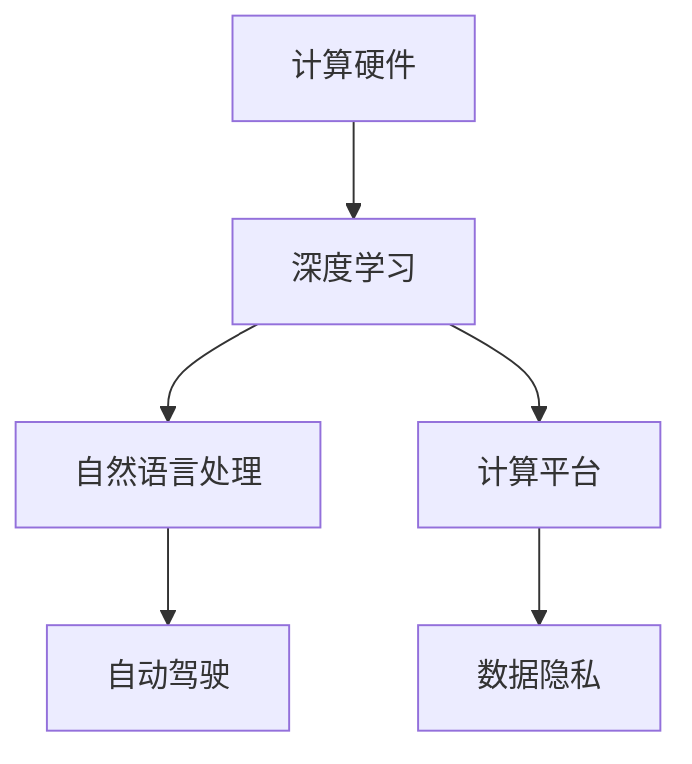
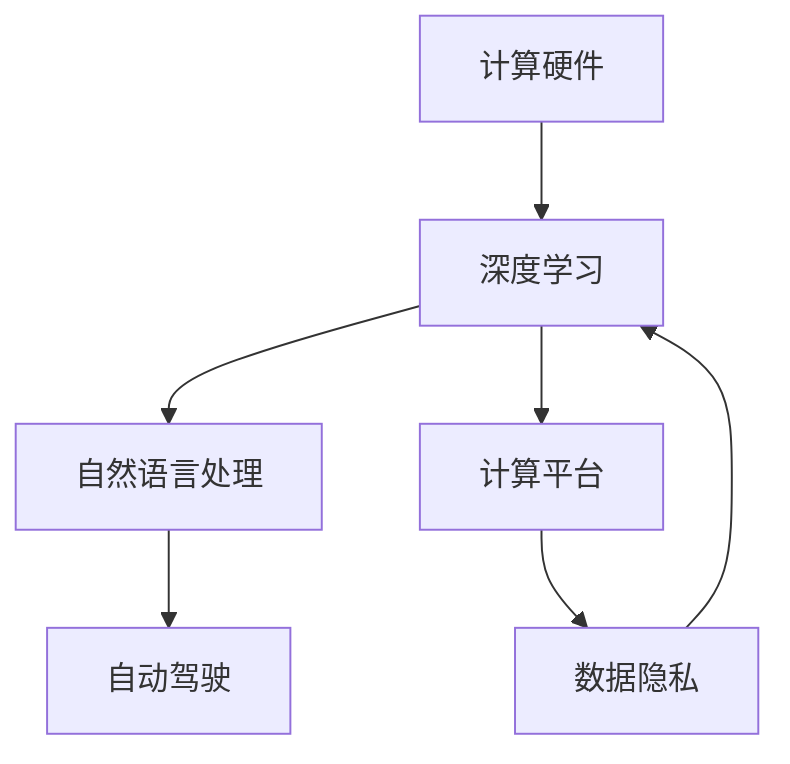

                 

# Andrej Karpathy谈计算变化

在过去十年中，计算技术的迅猛发展不仅改变了我们的生活和工作方式，也为科研、产业界带来了深刻的变革。作为DeepMind的创始人之一和OpenAI的联合创始人，Andrej Karpathy对计算技术的变迁有着深刻的洞察和前瞻性思考。本文通过回顾Andrej Karpathy的一些重要观点和演讲，深入探讨计算技术的演变及其在未来发展中的趋势和挑战。

## 1. 背景介绍

### 1.1 问题由来

计算技术的进步主要体现在两个方面：一方面是计算硬件的革新，如GPU、TPU等加速计算芯片的问世，极大地提升了计算效率和并行能力；另一方面是算法和架构的突破，如深度学习、自然语言处理等AI技术的发展，为计算提供了新的方向和可能。这些进步极大地推动了科研和产业界在各个领域的应用，如自动驾驶、医疗、金融、教育等，带来了前所未有的机遇和挑战。

Andrej Karpathy，作为科技界的巨擘之一，对计算技术的变化有着独到的见解和预测。他曾参与开发了Google的TensorFlow，并主导了DeepMind在机器学习领域的诸多突破。其观点和理论对计算技术的发展产生了深远的影响。

### 1.2 问题核心关键点

1. **计算硬件的演进**：从CPU到GPU、TPU的转变，使得计算能力得到了质的飞跃。
2. **深度学习算法的创新**：如卷积神经网络(CNN)、Transformer、BERT等模型，极大地提升了AI任务的精度和效果。
3. **计算平台的多样化**：云计算、边缘计算等新模式的兴起，使得计算环境变得更加灵活多样。
4. **算法的可解释性**：在追求模型性能的同时，如何提高算法的可解释性成为了新的焦点。
5. **数据的重要性和隐私保护**：数据成为计算的核心，如何在利用数据的同时保护隐私成为了重要问题。

这些关键点构成了Andrej Karpathy对于计算技术变迁的基本框架。

## 2. 核心概念与联系

### 2.1 核心概念概述

为了更好地理解Andrej Karpathy对于计算技术的见解，本文将介绍几个关键概念及其之间的关系：

1. **计算硬件**：包括CPU、GPU、TPU等加速计算芯片，以及相应的计算架构。
2. **深度学习**：一种基于神经网络的机器学习技术，广泛应用于图像识别、自然语言处理等领域。
3. **自然语言处理**：使计算机能够理解和生成人类语言的技术，如BERT、GPT等模型。
4. **自动驾驶**：利用计算机视觉和深度学习技术，实现车辆自主导航和决策的系统。
5. **计算平台**：如云计算、边缘计算等，为计算任务提供了灵活的部署方式。
6. **数据隐私**：在计算过程中如何保护用户数据的隐私和安全性。

这些概念之间的逻辑关系可以通过以下Mermaid流程图来展示：



这个流程图展示了计算技术的关键组件及其相互联系：

1. 计算硬件为深度学习等算法提供了必要的计算能力。
2. 深度学习等算法进一步推动了自然语言处理、自动驾驶等领域的发展。
3. 计算平台提供了灵活的计算环境，使得深度学习等算法可以部署在不同的应用场景中。
4. 数据隐私成为计算过程中必须考虑的关键问题。

### 2.2 核心概念原理和架构的 Mermaid 流程图



这个流程图展示了计算技术中的核心组件及其相互作用。

## 3. 核心算法原理 & 具体操作步骤

### 3.1 算法原理概述

计算技术的发展离不开算法的不断突破和演进。深度学习算法便是其中的一大里程碑。Andrej Karpathy在深度学习领域有着深厚的造诣，他认为深度学习能够捕捉数据的复杂特征，通过多层次的特征提取和组合，实现对复杂任务的高精度建模。

深度学习算法的基本原理如下：

1. **前向传播**：将输入数据通过多个层次的非线性变换，逐步提取出高层次的抽象特征。
2. **反向传播**：通过梯度下降等优化算法，计算模型参数的梯度，更新模型以最小化损失函数。
3. **模型参数**：深度学习模型通常包含大量的参数，如权重和偏置，这些参数需要通过大量数据进行训练。

### 3.2 算法步骤详解

深度学习的训练过程一般包括以下步骤：

1. **数据准备**：收集和处理训练数据，将其转化为模型可以接受的格式。
2. **模型设计**：选择合适的神经网络结构，如卷积神经网络(CNN)、循环神经网络(RNN)、Transformer等。
3. **模型训练**：使用反向传播算法更新模型参数，最小化损失函数。
4. **模型评估**：在测试集上评估模型性能，调整超参数以优化模型表现。
5. **模型部署**：将训练好的模型部署到实际应用中，进行实时推理和预测。

以Andrej Karpathy的深度学习实践为例，以下是一份详细的步骤列表：

1. **数据准备**：
   - 收集标注数据，如ImageNet、COCO等数据集。
   - 进行数据预处理，如缩放、归一化、增强等。

2. **模型设计**：
   - 选择合适的神经网络结构，如ResNet、Inception、EfficientNet等。
   - 设计合适的损失函数，如交叉熵损失、均方误差等。

3. **模型训练**：
   - 使用GPU、TPU等硬件加速计算。
   - 使用SGD、Adam等优化算法进行参数更新。
   - 设置适当的学习率、批大小、迭代轮数等超参数。

4. **模型评估**：
   - 在测试集上评估模型性能，如准确率、精确率、召回率等指标。
   - 调整超参数，如学习率、正则化等，以优化模型表现。

5. **模型部署**：
   - 将训练好的模型导出为TensorFlow SavedModel或PyTorch模型。
   - 使用TensorFlow Serving、Kubeflow等平台进行模型部署。
   - 进行实时推理和预测，监控模型性能。

### 3.3 算法优缺点

深度学习算法在处理复杂任务上具有明显的优势，但也存在以下缺点：

1. **数据依赖**：深度学习模型需要大量的标注数据进行训练，数据采集和标注成本较高。
2. **计算资源需求高**：模型训练和推理需要强大的计算资源，如GPU、TPU等。
3. **可解释性差**：深度学习模型通常是"黑盒"，难以解释其内部工作机制和决策逻辑。
4. **过拟合风险**：模型可能对训练数据过度拟合，泛化性能较差。
5. **对抗攻击敏感**：模型可能对对抗样本敏感，容易受到攻击。

尽管存在这些缺点，但Andrej Karpathy认为，通过不断改进算法和优化模型，这些缺点可以被有效缓解。

### 3.4 算法应用领域

Andrej Karpathy认为，深度学习技术在以下几个领域有广泛的应用：

1. **计算机视觉**：如图像分类、目标检测、图像生成等。
2. **自然语言处理**：如文本分类、机器翻译、对话系统等。
3. **自动驾驶**：利用计算机视觉和深度学习技术，实现车辆自主导航和决策。
4. **医疗**：如医学图像分析、病理诊断等。
5. **金融**：如风险评估、股票预测等。
6. **游戏**：如自动游戏策略生成、智能对战等。

这些应用领域展示了深度学习技术的强大潜力和广泛适用性。

## 4. 数学模型和公式 & 详细讲解

### 4.1 数学模型构建

Andrej Karpathy在深度学习领域的研究涉及了多个数学模型。以下是其中几个关键模型及其构建方式：

1. **卷积神经网络(CNN)**：
   - 数学模型：$y = \sum_{i=1}^{H}\sum_{j=1}^{W}\sum_{k=1}^{N}w_{i,j,k} \cdot x_{i,j,k}$。
   - 其中，$H$、$W$分别为卷积核的高和宽，$N$为输入的特征数，$x_{i,j,k}$为输入数据，$w_{i,j,k}$为卷积核参数，$y$为卷积结果。

2. **循环神经网络(RNN)**：
   - 数学模型：$y_t = \sigma(W_yx_t + U_yh_{t-1} + b_y)$，其中$x_t$为输入，$h_t$为隐藏状态，$W_y$、$U_y$、$b_y$为模型参数。
   - 通过循环结构，RNN能够处理时间序列数据，具有较强的记忆能力。

3. **Transformer模型**：
   - 数学模型：$y = AT + S$，其中$A$为自注意力矩阵，$T$为编码器输出，$S$为解码器输出。
   - 通过多头自注意力机制，Transformer能够并行计算，提高计算效率。

### 4.2 公式推导过程

以下是三个模型的公式推导过程：

**卷积神经网络**：
- 输入数据：$x \in \mathbb{R}^{H \times W \times C}$
- 卷积核参数：$w \in \mathbb{R}^{F \times F \times C \times N}$
- 卷积操作：$y_{i,j} = \sum_{k=1}^{C}w_{i,j,k} \cdot x_{i,j,k}$，其中$y_{i,j}$为卷积结果，$i$和$j$分别为输出图像的高和宽。
- 卷积运算的数学表达式：$y = \sum_{i=1}^{H}\sum_{j=1}^{W}\sum_{k=1}^{N}w_{i,j,k} \cdot x_{i,j,k}$。

**循环神经网络**：
- 输入数据：$x_t \in \mathbb{R}^{N}$
- 隐藏状态：$h_t \in \mathbb{R}^{M}$
- 输出数据：$y_t \in \mathbb{R}^{N}$
- 模型参数：$W_y \in \mathbb{R}^{N \times M}$，$U_y \in \mathbb{R}^{M \times N}$，$b_y \in \mathbb{R}^{N}$
- 模型公式：$y_t = \sigma(W_yx_t + U_yh_{t-1} + b_y)$，其中$\sigma$为激活函数，$x_t$为输入，$h_t$为隐藏状态。

**Transformer模型**：
- 输入数据：$x \in \mathbb{R}^{H \times W \times N}$
- 编码器输出：$T \in \mathbb{R}^{H \times W \times M}$
- 解码器输出：$S \in \mathbb{R}^{H \times W \times M}$
- 模型参数：$W_q \in \mathbb{R}^{M \times N}$，$W_k \in \mathbb{R}^{M \times N}$，$W_v \in \mathbb{R}^{M \times N}$
- 模型公式：$y = AT + S$，其中$A = \sigma(W_qx^T + b_q)W_k$，$T = \sigma(W_vx^T + b_v)$。

### 4.3 案例分析与讲解

以Transformer模型为例，讲解其工作原理和应用场景：

Transformer模型是一种基于自注意力机制的神经网络模型，广泛应用于自然语言处理领域。其基本结构包括编码器和解码器两个部分：

1. **编码器**：
   - 输入数据：$x \in \mathbb{R}^{H \times W \times N}$
   - 模型参数：$W_q \in \mathbb{R}^{M \times N}$，$W_k \in \mathbb{R}^{M \times N}$，$W_v \in \mathbb{R}^{M \times N}$
   - 模型公式：$A = \sigma(W_qx^T + b_q)W_k$，$T = \sigma(W_vx^T + b_v)$。
   - 其中，$A$为自注意力矩阵，$T$为编码器输出。

2. **解码器**：
   - 输入数据：$y_t \in \mathbb{R}^{H \times W \times M}$
   - 隐藏状态：$h_t \in \mathbb{R}^{M}$
   - 模型参数：$W_y \in \mathbb{R}^{M \times N}$，$U_y \in \mathbb{R}^{M \times N}$，$b_y \in \mathbb{R}^{N}$
   - 模型公式：$S = \sigma(W_yy_t + U_yh_{t-1} + b_y)$。
   - 其中，$S$为解码器输出。

Transformer模型通过多头自注意力机制，能够并行计算，提高计算效率。在自然语言处理中，被广泛应用于机器翻译、文本生成等任务。

## 5. 项目实践：代码实例和详细解释说明

### 5.1 开发环境搭建

为了进行深度学习模型的开发，需要先搭建开发环境。以下是Python环境下使用TensorFlow的开发环境配置流程：

1. 安装Anaconda：从官网下载并安装Anaconda，用于创建独立的Python环境。

2. 创建并激活虚拟环境：
```bash
conda create -n tensorflow-env python=3.8 
conda activate tensorflow-env
```

3. 安装TensorFlow：根据CUDA版本，从官网获取对应的安装命令。例如：
```bash
conda install tensorflow-gpu=2.7 -c conda-forge
```

4. 安装TensorBoard：
```bash
pip install tensorboard
```

5. 安装TensorFlow Extended (TFX)：用于模型部署和管理。
```bash
pip install tfx
```

完成上述步骤后，即可在`tensorflow-env`环境中开始深度学习模型的开发。

### 5.2 源代码详细实现

以下是一份使用TensorFlow构建卷积神经网络(CNN)的代码示例：

```python
import tensorflow as tf
import numpy as np

# 定义CNN模型
class CNNModel(tf.keras.Model):
    def __init__(self):
        super(CNNModel, self).__init__()
        self.conv1 = tf.keras.layers.Conv2D(32, (3, 3), activation='relu')
        self.pool1 = tf.keras.layers.MaxPooling2D((2, 2))
        self.conv2 = tf.keras.layers.Conv2D(64, (3, 3), activation='relu')
        self.pool2 = tf.keras.layers.MaxPooling2D((2, 2))
        self.flatten = tf.keras.layers.Flatten()
        self.dense1 = tf.keras.layers.Dense(64, activation='relu')
        self.dense2 = tf.keras.layers.Dense(10, activation='softmax')

    def call(self, x):
        x = self.conv1(x)
        x = self.pool1(x)
        x = self.conv2(x)
        x = self.pool2(x)
        x = self.flatten(x)
        x = self.dense1(x)
        return self.dense2(x)

# 加载和预处理数据
(x_train, y_train), (x_test, y_test) = tf.keras.datasets.mnist.load_data()
x_train = x_train / 255.0
x_test = x_test / 255.0
y_train = tf.keras.utils.to_categorical(y_train, 10)
y_test = tf.keras.utils.to_categorical(y_test, 10)

# 构建模型
model = CNNModel()

# 编译模型
model.compile(optimizer='adam', loss='categorical_crossentropy', metrics=['accuracy'])

# 训练模型
model.fit(x_train, y_train, epochs=10, validation_data=(x_test, y_test))

# 评估模型
model.evaluate(x_test, y_test)
```

以上代码展示了如何使用TensorFlow构建一个简单的卷积神经网络，用于手写数字识别。

### 5.3 代码解读与分析

**CNNModel类**：
- `__init__`方法：定义卷积、池化、全连接等网络结构。
- `call`方法：实现前向传播过程，计算模型输出。

**数据预处理**：
- 加载和预处理数据集MNIST，将其归一化并转化为模型可以接受的格式。

**模型训练**：
- 定义优化器、损失函数、评估指标等，使用`fit`方法训练模型。
- 通过`validation_data`参数指定验证集，监控模型在未见过的数据上的表现。

**模型评估**：
- 使用`evaluate`方法在测试集上评估模型性能，输出准确率和损失。

## 6. 实际应用场景

### 6.1 智能推荐系统

深度学习在推荐系统中的应用非常广泛。例如，Netflix使用深度学习模型推荐个性化电影和电视节目，亚马逊使用深度学习模型推荐商品。Andrej Karpathy认为，未来的推荐系统将更加智能化和个性化，能够基于用户的历史行为和兴趣进行实时推荐。

具体而言，推荐系统可以通过用户点击、浏览、评分等行为数据，学习用户的兴趣偏好。通过深度学习模型，可以预测用户对新物品的偏好，实现个性化推荐。例如，使用RNN或Transformer模型，可以构建时间序列的推荐系统，根据用户的实时行为动态调整推荐结果。

### 6.2 自动驾驶

深度学习在自动驾驶领域也取得了显著进展。例如，Waymo和Tesla等公司使用深度学习模型进行车辆自主导航和决策。Andrej Karpathy认为，自动驾驶的未来将更加安全和可靠，能够适应各种复杂交通环境。

具体而言，自动驾驶系统可以使用计算机视觉和深度学习技术，实现目标检测、路径规划等功能。通过深度学习模型，可以提取道路、车辆、行人等关键信息，实时预测交通情况，做出合理的决策。例如，使用CNN模型进行目标检测，使用RNN模型进行路径规划，使用Transformer模型进行场景理解。

### 6.3 医疗影像分析

深度学习在医疗影像分析领域也有广泛应用。例如，Google Health使用深度学习模型进行医学影像诊断，如肺结节检测、病灶分割等。Andrej Karpathy认为，未来的医疗影像分析将更加精准和高效，能够辅助医生进行诊断和治疗。

具体而言，医疗影像分析系统可以使用卷积神经网络(CNN)模型，学习医学影像中的高层次特征。通过深度学习模型，可以自动识别病灶位置和类型，生成诊断报告。例如，使用3D卷积神经网络对医学影像进行分割和分类，使用Transformer模型进行多模态数据融合，提高诊断的准确性和效率。

### 6.4 未来应用展望

Andrej Karpathy对计算技术的未来发展进行了前瞻性思考，认为未来将有以下趋势：

1. **计算硬件的持续演进**：未来计算硬件将更加强大和高效，如量子计算机、光子计算机等，为计算任务提供更强的支持。
2. **深度学习的进一步突破**：深度学习算法将更加高效和可解释，能够处理更多复杂任务。
3. **跨领域技术的融合**：未来计算技术将与其他技术进行更深入的融合，如生物信息学、材料科学等，推动各领域的创新发展。
4. **人工智能的普及**：未来人工智能技术将更加普及和实用，成为各行各业的重要工具。
5. **伦理和社会问题的关注**：未来计算技术的发展将更加注重伦理和社会问题，如隐私保护、公平性、安全性等。

## 7. 工具和资源推荐

### 7.1 学习资源推荐

为了帮助开发者深入理解深度学习技术，以下是一些优质的学习资源：

1. DeepLearning.AI（深度学习AI）：由Andrew Ng教授主讲的在线课程，涵盖深度学习的基础和高级内容。
2. TensorFlow官网和文档：提供了丰富的学习资料和示例代码，适合初学者和高级开发者。
3. Coursera和Udacity等在线平台：提供深度学习相关的专业课程和项目实践。
4. arXiv和Google Scholar：获取最新深度学习研究论文，了解前沿进展。
5. GitHub和Kaggle：查看和贡献深度学习项目，进行实践和竞赛。

通过这些学习资源，开发者可以全面掌握深度学习技术，并应用于实际项目中。

### 7.2 开发工具推荐

为了提高深度学习开发的效率和质量，以下是一些推荐的开发工具：

1. TensorFlow：由Google开发的深度学习框架，支持分布式训练和部署。
2. PyTorch：由Facebook开发的深度学习框架，灵活易用，支持动态图和静态图。
3. JAX：由Google开发的自动微分库，支持高效的数值计算。
4. TensorBoard：由TensorFlow提供的可视化工具，用于监控和调试模型。
5. Keras：高层次的深度学习框架，易于上手和调试。

这些工具能够帮助开发者更快地开发和调试深度学习模型，提高开发效率。

### 7.3 相关论文推荐

Andrej Karpathy的研究方向涉及深度学习、计算机视觉、自然语言处理等领域，以下是一些重要的相关论文：

1. "Convolutional Neural Networks for Visual Recognition"（深度学习计算机视觉）：提出了卷积神经网络(CNN)，用于图像识别和分类任务。
2. "Long Short-Term Memory"（循环神经网络）：提出了循环神经网络(RNN)，用于时间序列数据的建模和预测。
3. "Attention Is All You Need"（Transformer模型）：提出了Transformer模型，用于自然语言处理任务。
4. "Learning to Transfer"（迁移学习）：探讨了深度学习模型的迁移学习方法和技术。
5. "Natural Language Processing with Transformers"（深度学习自然语言处理）：介绍了Transformer模型在自然语言处理中的应用。

这些论文展示了Andrej Karpathy在深度学习领域的诸多贡献，值得深入学习和研究。

## 8. 总结：未来发展趋势与挑战

### 8.1 研究成果总结

Andrej Karpathy在深度学习领域的研究成果丰富，涵盖计算硬件、深度学习算法、自然语言处理等多个方面。他提出的卷积神经网络、循环神经网络、Transformer模型等算法，为深度学习技术的发展奠定了坚实基础。

### 8.2 未来发展趋势

Andrej Karpathy认为，未来计算技术将有以下发展趋势：

1. **计算硬件的突破**：未来计算硬件将更加强大和高效，如量子计算机、光子计算机等，为计算任务提供更强的支持。
2. **深度学习算法的进步**：深度学习算法将更加高效和可解释，能够处理更多复杂任务。
3. **跨领域技术的融合**：未来计算技术将与其他技术进行更深入的融合，如生物信息学、材料科学等，推动各领域的创新发展。
4. **人工智能的普及**：未来人工智能技术将更加普及和实用，成为各行各业的重要工具。
5. **伦理和社会问题的关注**：未来计算技术的发展将更加注重伦理和社会问题，如隐私保护、公平性、安全性等。

### 8.3 面临的挑战

尽管深度学习技术已经取得了显著进展，但仍面临以下挑战：

1. **数据依赖**：深度学习模型需要大量的标注数据进行训练，数据采集和标注成本较高。
2. **计算资源需求高**：模型训练和推理需要强大的计算资源，如GPU、TPU等。
3. **可解释性差**：深度学习模型通常是"黑盒"，难以解释其内部工作机制和决策逻辑。
4. **过拟合风险**：模型可能对训练数据过度拟合，泛化性能较差。
5. **对抗攻击敏感**：模型可能对对抗样本敏感，容易受到攻击。
6. **伦理和安全问题**：深度学习模型可能引入偏见和歧视，存在伦理和安全风险。

### 8.4 研究展望

为了解决这些挑战，未来的研究需要在以下几个方面进行深入探索：

1. **数据驱动的深度学习**：通过半监督学习、自监督学习等方法，降低对标注数据的依赖。
2. **高效可解释的深度学习**：开发更加可解释的深度学习模型，提高算法的透明度和可信度。
3. **分布式深度学习**：利用分布式计算和模型压缩技术，降低计算资源需求。
4. **公平性安全的深度学习**：通过算法设计和数据筛选，减少深度学习模型的偏见和歧视，提高模型的公平性和安全性。
5. **跨领域的深度学习**：将深度学习技术与其他领域的技术进行融合，推动交叉学科的发展。

## 9. 附录：常见问题与解答

**Q1：深度学习模型需要大量的标注数据，如何降低对标注数据的依赖？**

A: 可以使用半监督学习、自监督学习等方法，通过未标注数据进行预训练，减少对标注数据的依赖。例如，使用生成对抗网络(GAN)进行数据增强，通过未标注数据生成更多训练样本。

**Q2：如何提高深度学习模型的可解释性？**

A: 开发可解释性更强的深度学习模型，如注意力机制、决策树等。同时，使用可视化工具，如TensorBoard，监控模型在训练过程中的表现，理解模型的决策过程。

**Q3：如何降低深度学习模型的计算资源需求？**

A: 使用分布式计算和模型压缩技术，如TensorFlow Serving、TFF、TensorCompress等，降低计算资源需求。

**Q4：如何缓解深度学习模型的过拟合风险？**

A: 使用正则化技术，如L2正则、Dropout等，防止模型对训练数据过度拟合。同时，使用数据增强、对抗训练等方法，提高模型的泛化性能。

**Q5：如何提高深度学习模型的公平性和安全性？**

A: 在算法设计和数据筛选过程中，引入公平性和安全性约束，减少模型的偏见和歧视。同时，使用隐私保护技术，如差分隐私、联邦学习等，保护用户数据隐私。

通过这些研究和实践，深度学习技术将更加成熟和可靠，为计算技术的发展提供更强的动力。

