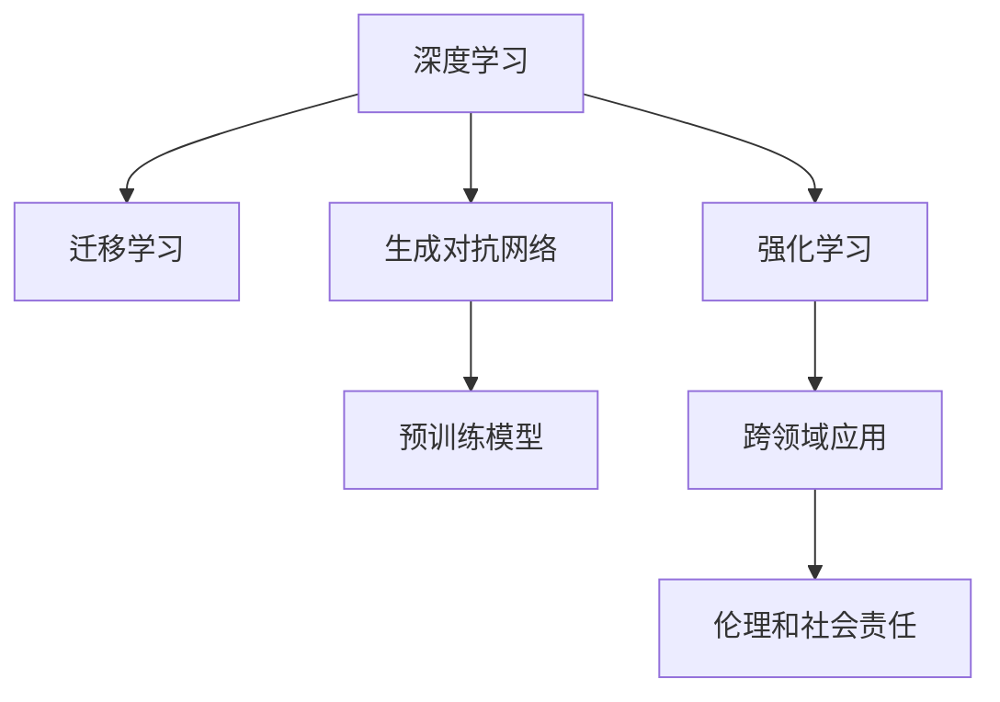

                 

# Andrej Karpathy：人工智能的未来发展机遇

## 1. 背景介绍

### 1.1 问题由来

人工智能（AI）在过去几十年中取得了迅猛发展，从早期的专家系统、机器学习到深度学习、生成对抗网络（GANs），再到最近的大型预训练模型（如OpenAI的GPT-3）和强化学习，AI领域在技术上不断突破。然而，这些技术的突破并没有立即转化为广泛应用，AI在实际生活中的落地仍然面临诸多挑战。AI技术的未来发展机遇，在于解决这些问题，将AI技术应用到更多领域，推动AI技术的发展和普及。

### 1.2 问题核心关键点

AI技术的未来发展机遇主要集中在以下几个方面：

- **算法和模型创新**：深度学习、强化学习、迁移学习等算法和模型的不断创新，为AI提供了更多解决复杂问题的工具。
- **数据和计算资源的提升**：更多高质量的数据和强大的计算资源，使得大规模的训练和测试成为可能。
- **跨领域应用**：AI技术在医疗、金融、教育、交通等领域的广泛应用，为社会带来了巨大的价值。
- **伦理和社会责任**：AI技术的普及，需要解决伦理和社会责任问题，确保AI技术的公平、透明和安全。
- **人机协同**：AI技术与人类的协同工作，提升了效率和创造力，扩展了人类认知的边界。

### 1.3 问题研究意义

研究和探讨AI技术的未来发展机遇，对推动AI技术的应用和普及具有重要意义：

1. **加速技术发展**：理解和把握未来发展方向，能够加速技术创新，推动AI技术在各个领域的落地。
2. **提升应用价值**：明确AI技术的应用场景，能够更好地发挥AI技术的潜力，为社会带来更大的价值。
3. **解决伦理问题**：面对AI技术的广泛应用，需要解决伦理和社会责任问题，确保技术的公平、透明和安全。
4. **促进人机协同**：人机协同将提升效率和创造力，扩展人类认知的边界，推动社会进步。

## 2. 核心概念与联系

### 2.1 核心概念概述

为更好地理解AI技术的未来发展机遇，本节将介绍几个关键概念及其相互联系：

- **深度学习（Deep Learning）**：一种基于神经网络的机器学习技术，能够处理复杂的多层次数据结构。
- **强化学习（Reinforcement Learning）**：通过与环境的交互，学习如何最大化奖励的策略。
- **迁移学习（Transfer Learning）**：将一个领域学到的知识迁移到另一个领域。
- **生成对抗网络（GANs）**：通过对抗训练生成高质量的图像、音频等数据。
- **预训练模型（Pre-trained Models）**：在大规模无标签数据上预训练的模型，用于各种NLP任务。
- **跨领域应用**：AI技术在医疗、金融、教育、交通等领域的广泛应用。
- **伦理和社会责任**：确保AI技术的公平、透明和安全。

这些核心概念之间的逻辑关系可以通过以下Mermaid流程图来展示：



这个流程图展示了大语言模型的核心概念及其之间的关系：

1. 深度学习和大模型提供了通用的语言表示和知识迁移能力。
2. 生成对抗网络用于生成高质量的数据，提升模型的训练效果。
3. 迁移学习使得模型能够从一个领域迁移到另一个领域，提升模型的泛化能力。
4. 强化学习用于训练模型在动态环境中学习最优策略。
5. 跨领域应用展示了AI技术的广泛应用，提升社会价值。
6. 伦理和社会责任确保AI技术的公平、透明和安全。

## 3. 核心算法原理 & 具体操作步骤

### 3.1 算法原理概述

AI技术的未来发展机遇，源于算法的不断创新和优化。深度学习、强化学习、迁移学习等技术的发展，为AI提供了更多解决复杂问题的工具。这些技术的核心思想是通过大规模数据和强大的计算资源，训练出能够处理复杂问题的模型，并通过迁移学习等方式，将其应用于不同领域。

### 3.2 算法步骤详解

AI技术的未来发展机遇的实现，可以分为以下几个关键步骤：

**Step 1: 数据收集和预处理**

- 收集高质量的数据集，如图像、文本、语音等。
- 对数据进行清洗、标注和处理，使其适合模型训练。

**Step 2: 模型设计和训练**

- 选择合适的算法和模型结构，如卷积神经网络（CNN）、循环神经网络（RNN）、Transformer等。
- 在大规模数据集上进行模型训练，优化模型参数。
- 使用正则化、Dropout等技术防止过拟合。

**Step 3: 模型评估和优化**

- 在验证集上评估模型性能，使用交叉验证等技术进行调参。
- 引入对抗训练、数据增强等技术提升模型的鲁棒性和泛化能力。
- 对模型进行微调和优化，提升模型精度和效率。

**Step 4: 应用部署**

- 将训练好的模型部署到实际应用场景中，进行实时推理和预测。
- 不断收集反馈数据，进行模型更新和优化。
- 确保模型的公平、透明和安全，解决伦理和社会责任问题。

### 3.3 算法优缺点

AI技术的未来发展机遇的实现，需要综合考虑算法的优缺点：

**优点**：

1. **解决复杂问题**：深度学习、强化学习等算法能够处理复杂的多层次数据结构，提升模型精度。
2. **泛化能力强**：迁移学习使得模型能够从一个领域迁移到另一个领域，提升泛化能力。
3. **计算效率高**：大规模数据和计算资源使得模型训练和测试成为可能。
4. **跨领域应用**：AI技术在医疗、金融、教育、交通等领域的广泛应用，提升社会价值。

**缺点**：

1. **数据依赖性强**：AI技术依赖高质量的数据，数据标注和收集成本较高。
2. **模型复杂度高**：大规模模型训练和推理需要强大的计算资源。
3. **伦理和社会责任问题**：AI技术的广泛应用需要解决伦理和社会责任问题。
4. **对抗样本脆弱**：模型对抗样本的鲁棒性需要进一步提升。

### 3.4 算法应用领域

AI技术的未来发展机遇，涵盖了各个领域：

- **医疗**：AI技术用于医学影像诊断、疾病预测、药物研发等，提升医疗服务的质量和效率。
- **金融**：AI技术用于金融风险评估、股票预测、欺诈检测等，提升金融服务的安全性和准确性。
- **教育**：AI技术用于智能教育、作业批改、学情分析等，提升教育公平和质量。
- **交通**：AI技术用于智能交通、自动驾驶、交通预测等，提升交通系统的效率和安全。
- **智能客服**：AI技术用于智能客服、对话系统等，提升客户服务体验和效率。
- **娱乐**：AI技术用于游戏、音乐、影视等，提升娱乐产品的个性化和互动性。

## 4. 数学模型和公式 & 详细讲解  
### 4.1 数学模型构建

本节将使用数学语言对AI技术的未来发展机遇进行更加严格的刻画。

假设训练集为 $D=\{(x_i, y_i)\}_{i=1}^N$，其中 $x_i$ 为输入数据，$y_i$ 为标签。模型参数为 $\theta$，损失函数为 $L(\theta)$，模型训练的目标是最小化损失函数：

$$
\theta^* = \mathop{\arg\min}_{\theta} L(\theta)
$$

其中，$L(\theta)$ 可以是交叉熵损失、均方误差损失等。模型的训练过程可以分为以下几个步骤：

1. 对模型进行前向传播，计算输出 $h(x_i)$。
2. 计算损失函数 $L(h(x_i), y_i)$。
3. 对模型进行反向传播，计算梯度 $\nabla_{\theta} L(h(x_i), y_i)$。
4. 使用梯度下降等优化算法更新模型参数 $\theta$。

### 4.2 公式推导过程

以深度学习模型为例，推导其训练过程的数学公式。

假设模型 $M_{\theta}$ 为 $N$ 层神经网络，其中 $l$ 层的输入为 $h_{l-1}$，输出为 $h_l$。模型参数为 $\theta$，损失函数为 $L(\theta)$。训练过程如下：

1. 前向传播：

$$
h_0 = x
$$

$$
h_1 = W_1 h_0 + b_1
$$

$$
\cdots
$$

$$
h_N = W_N h_{N-1} + b_N
$$

其中，$W$ 和 $b$ 分别为权重和偏置。

2. 损失函数：

$$
L(\theta) = \frac{1}{N} \sum_{i=1}^N L(h_N, y_i)
$$

3. 反向传播：

$$
\frac{\partial L}{\partial W_l} = \frac{\partial L}{\partial h_l} \frac{\partial h_l}{\partial h_{l-1}} \frac{\partial h_{l-1}}{\partial W_l}
$$

其中，$\frac{\partial h_l}{\partial h_{l-1}}$ 为链式法则的递推。

4. 梯度下降：

$$
\theta_l \leftarrow \theta_l - \eta \nabla_{\theta_l} L(\theta)
$$

其中，$\eta$ 为学习率。

### 4.3 案例分析与讲解

以卷积神经网络（CNN）为例，推导其在图像分类任务中的训练过程。

假设图像分类任务的数据集为 $D=\{(x_i, y_i)\}_{i=1}^N$，其中 $x_i$ 为图像，$y_i$ 为标签。CNN模型的结构如下：

$$
h_1 = W_1 x + b_1
$$

$$
h_2 = W_2 h_1 + b_2
$$

$$
\cdots
$$

$$
h_n = W_n h_{n-1} + b_n
$$

其中，$W$ 和 $b$ 分别为卷积核和偏置。

损失函数 $L(\theta)$ 可以是交叉熵损失：

$$
L(\theta) = -\frac{1}{N} \sum_{i=1}^N \sum_{j=1}^C y_{i,j} \log s_{i,j}
$$

其中，$y_{i,j}$ 为标签，$s_{i,j}$ 为模型的预测结果。

反向传播过程如下：

$$
\frac{\partial L}{\partial W_l} = \frac{\partial L}{\partial h_l} \frac{\partial h_l}{\partial h_{l-1}} \frac{\partial h_{l-1}}{\partial W_l}
$$

其中，$\frac{\partial h_l}{\partial h_{l-1}}$ 为卷积操作的导数。

## 5. 项目实践：代码实例和详细解释说明

### 5.1 开发环境搭建

在进行AI技术未来发展机遇的研究和实践前，我们需要准备好开发环境。以下是使用Python进行TensorFlow开发的环境配置流程：

1. 安装Anaconda：从官网下载并安装Anaconda，用于创建独立的Python环境。

2. 创建并激活虚拟环境：
```bash
conda create -n tf-env python=3.8 
conda activate tf-env
```

3. 安装TensorFlow：根据CUDA版本，从官网获取对应的安装命令。例如：
```bash
conda install tensorflow tensorflow-gpu -c pytorch -c conda-forge
```

4. 安装各类工具包：
```bash
pip install numpy pandas scikit-learn matplotlib tqdm jupyter notebook ipython
```

完成上述步骤后，即可在`tf-env`环境中开始AI技术未来发展机遇的实践。

### 5.2 源代码详细实现

下面我们以图像分类任务为例，给出使用TensorFlow进行卷积神经网络（CNN）训练的代码实现。

首先，定义CNN模型的结构：

```python
import tensorflow as tf
from tensorflow.keras import layers

model = tf.keras.Sequential([
    layers.Conv2D(32, (3, 3), activation='relu', input_shape=(28, 28, 1)),
    layers.MaxPooling2D((2, 2)),
    layers.Flatten(),
    layers.Dense(10, activation='softmax')
])
```

然后，定义损失函数和优化器：

```python
loss_fn = tf.keras.losses.SparseCategoricalCrossentropy(from_logits=True)
optimizer = tf.keras.optimizers.Adam(learning_rate=0.001)
```

接着，定义训练和评估函数：

```python
def train_epoch(model, dataset, batch_size, optimizer):
    for epoch in range(epochs):
        for batch in dataset:
            with tf.GradientTape() as tape:
                predictions = model(batch)
                loss_value = loss_fn(y_true=batch_labels, y_pred=predictions)
            gradients = tape.gradient(loss_value, model.trainable_variables)
            optimizer.apply_gradients(zip(gradients, model.trainable_variables))
    return loss_value

def evaluate(model, dataset, batch_size):
    correct_predictions = tf.equal(tf.argmax(model(input_images), axis=-1), tf.cast(batch_labels, tf.int64))
    accuracy = tf.reduce_mean(tf.cast(correct_predictions, tf.float32))
    return accuracy
```

最后，启动训练流程并在测试集上评估：

```python
epochs = 10
batch_size = 64

for epoch in range(epochs):
    loss_value = train_epoch(model, train_dataset, batch_size, optimizer)
    print(f'Epoch {epoch+1}, loss: {loss_value:.4f}')
    
print(f'Epoch {epochs}, test accuracy: {evaluate(model, test_dataset, batch_size):.4f}')
```

以上就是使用TensorFlow进行图像分类任务CNN训练的完整代码实现。可以看到，TensorFlow提供了强大的计算图功能和自动微分功能，使得模型训练变得简单高效。

### 5.3 代码解读与分析

让我们再详细解读一下关键代码的实现细节：

**CNN模型定义**：
- `layers.Conv2D`：定义卷积层，参数为卷积核大小、通道数和激活函数。
- `layers.MaxPooling2D`：定义最大池化层，参数为池化核大小。
- `layers.Flatten`：将多维数据展平为一维。
- `layers.Dense`：定义全连接层，参数为输出维度和激活函数。

**损失函数和优化器**：
- `tf.keras.losses.SparseCategoricalCrossentropy`：定义交叉熵损失函数，适用于多分类任务。
- `tf.keras.optimizers.Adam`：定义Adam优化器，参数为学习率。

**训练和评估函数**：
- `train_epoch`函数：使用梯度下降更新模型参数，返回损失值。
- `evaluate`函数：计算模型的准确率，返回测试集上的准确率。

**训练流程**：
- `epochs`：定义训练的轮数。
- `batch_size`：定义每次训练的批次大小。
- 循环迭代训练集，对每个批次进行前向传播和反向传播，更新模型参数。
- 打印训练集上的损失值。
- 测试集上评估模型准确率。

可以看到，TensorFlow提供了丰富的工具和函数，使得模型训练和评估变得非常简单。开发者可以将更多精力放在模型设计和算法优化上，而不必过多关注底层的实现细节。

## 6. 实际应用场景

### 6.1 智能客服系统

基于AI技术的智能客服系统，可以广泛应用于各种客服场景。传统客服系统依赖人工，高峰期响应速度慢，成本高，且难以保证一致性和专业性。而基于AI的智能客服系统，可以通过自然语言处理（NLP）技术，自动理解用户问题，生成并回复自然流畅的文本，提升客户服务体验和效率。

具体实现上，可以收集企业内部的客服对话记录，训练NLP模型进行自然语言理解。在实际应用中，用户通过聊天窗口输入问题，智能客服系统自动分析和回答，提供高效、个性化的服务。随着技术的进步，AI客服还将能够处理更复杂的用户需求，提供更精准的解决方案。

### 6.2 金融舆情监测

金融机构需要实时监测市场舆情动向，以便及时应对负面信息传播，规避金融风险。传统的舆情监测方法依赖人工，成本高，效率低，难以应对海量信息爆炸的挑战。而基于AI的舆情监测系统，可以通过NLP技术，自动识别和分析新闻、评论等文本数据，实时监测市场舆情变化，快速响应潜在风险。

具体实现上，可以收集金融领域的文本数据，如新闻、评论、社交媒体等，训练NLP模型进行情感分析、主题分类等任务。在实时监测中，AI系统自动分析最新的文本数据，提取舆情信息，生成实时报告，帮助金融机构及时应对市场变化，规避金融风险。

### 6.3 个性化推荐系统

推荐系统已经成为电商、视频、社交等平台的核心功能之一，提升用户体验和平台粘性。当前的推荐系统依赖用户的历史行为数据，难以充分理解用户的真实兴趣偏好。而基于AI的个性化推荐系统，可以通过NLP技术，分析用户评论、评分等文本数据，挖掘用户的兴趣点，生成个性化推荐内容。

具体实现上，可以收集用户浏览、点击、评论、分享等行为数据，提取文本内容，训练NLP模型进行情感分析、主题分类等任务。在推荐引擎中，AI系统根据用户历史行为和兴趣标签，生成个性化推荐内容，提升用户满意度。随着技术的进步，AI推荐系统将能够更加精准地预测用户需求，提升推荐效果。

### 6.4 未来应用展望

随着AI技术的不断进步，未来将会有更多领域的创新应用，推动社会的进步和发展：

1. **医疗**：AI技术在医学影像诊断、疾病预测、药物研发等方面，提升医疗服务的质量和效率。
2. **教育**：AI技术在智能教育、作业批改、学情分析等方面，提升教育公平和质量。
3. **交通**：AI技术在智能交通、自动驾驶、交通预测等方面，提升交通系统的效率和安全。
4. **智能客服**：AI技术在智能客服、对话系统等方面，提升客户服务体验和效率。
5. **娱乐**：AI技术在游戏、音乐、影视等方面，提升娱乐产品的个性化和互动性。

## 7. 工具和资源推荐

### 7.1 学习资源推荐

为了帮助开发者系统掌握AI技术的未来发展机遇的理论基础和实践技巧，这里推荐一些优质的学习资源：

1. **《深度学习》（Ian Goodfellow, Yoshua Bengio and Aaron Courville）**：深度学习领域的经典教材，全面介绍了深度学习的基本原理和算法。
2. **Coursera深度学习课程**：斯坦福大学的深度学习课程，由Ian Goodfellow主讲，涵盖深度学习的基本概念和实践。
3. **TensorFlow官方文档**：TensorFlow的官方文档，提供了丰富的教程和示例，帮助开发者快速上手TensorFlow。
4. **Kaggle数据集和竞赛**：Kaggle提供了大量的数据集和竞赛，帮助开发者实践和提升AI技术。
5. **GitHub开源项目**：GitHub上有许多优秀的开源项目，提供丰富的代码和算法实现，帮助开发者学习参考。

通过对这些资源的学习实践，相信你一定能够快速掌握AI技术的未来发展机遇，并用于解决实际的AI问题。

### 7.2 开发工具推荐

高效的开发离不开优秀的工具支持。以下是几款用于AI技术未来发展机遇开发的常用工具：

1. **TensorFlow**：由Google主导开发的开源深度学习框架，生产部署方便，适合大规模工程应用。
2. **PyTorch**：Facebook开源的深度学习框架，支持动态计算图，适合快速迭代研究。
3. **Jupyter Notebook**：用于编写和分享Python代码的Notebook工具，支持代码块和代码输出，方便调试和分享。
4. **Git**：版本控制系统，方便开发者管理代码版本，协作开发。
5. **Docker**：容器化技术，方便开发者构建和管理应用环境。

合理利用这些工具，可以显著提升AI技术未来发展机遇的开发效率，加快创新迭代的步伐。

### 7.3 相关论文推荐

AI技术的未来发展机遇源于学界的持续研究。以下是几篇奠基性的相关论文，推荐阅读：

1. **AlexNet: ImageNet Classification with Deep Convolutional Neural Networks**：提出了卷积神经网络，奠定了图像分类任务的基础。
2. **ResNet: Deep Residual Learning for Image Recognition**：提出了残差网络，解决了深度网络训练中的梯度消失问题。
3. **BERT: Pre-training of Deep Bidirectional Transformers for Language Understanding**：提出了BERT模型，利用预训练和迁移学习提升了语言模型的效果。
4. **AlphaGo: Mastering the Game of Go without Human Knowledge**：通过强化学习训练了AlphaGo，证明了AI在复杂游戏领域的潜力。
5. **SuperResolution Using Deep Convolutional Neural Networks**：提出了超分辨率算法，提升了图像处理的效果。

这些论文代表了大语言模型微调技术的发展脉络。通过学习这些前沿成果，可以帮助研究者把握学科前进方向，激发更多的创新灵感。

## 8. 总结：未来发展趋势与挑战

### 8.1 总结

本文对AI技术的未来发展机遇进行了全面系统的介绍。首先阐述了AI技术的发展背景和意义，明确了未来发展方向，指出AI技术在医疗、金融、教育、交通等领域的广泛应用。其次，从原理到实践，详细讲解了深度学习、强化学习、迁移学习等核心算法和模型，提供了基于TensorFlow的代码实现，帮助开发者快速上手。同时，本文还探讨了AI技术未来发展机遇的实际应用场景，展示了其广阔的应用前景。

通过本文的系统梳理，可以看到，AI技术的未来发展机遇充满机遇和挑战，需要在算法、数据、工程、伦理等多个维度协同发力，才能推动AI技术的普及和应用。相信随着技术的不断进步和应用场景的不断拓展，AI技术将为社会的各个领域带来深远的影响。

### 8.2 未来发展趋势

AI技术的未来发展趋势主要集中在以下几个方面：

1. **算法和模型创新**：深度学习、强化学习、迁移学习等算法和模型的不断创新，为AI提供了更多解决复杂问题的工具。
2. **数据和计算资源的提升**：更多高质量的数据和强大的计算资源，使得大规模的训练和测试成为可能。
3. **跨领域应用**：AI技术在医疗、金融、教育、交通等领域的广泛应用，为社会带来巨大的价值。
4. **伦理和社会责任**：AI技术的广泛应用需要解决伦理和社会责任问题，确保技术的公平、透明和安全。
5. **人机协同**：AI技术与人类的协同工作，提升了效率和创造力，扩展了人类认知的边界。

### 8.3 面临的挑战

AI技术的未来发展机遇面临诸多挑战：

1. **数据依赖性强**：AI技术依赖高质量的数据，数据标注和收集成本较高。
2. **模型复杂度高**：大规模模型训练和推理需要强大的计算资源。
3. **伦理和社会责任问题**：AI技术的广泛应用需要解决伦理和社会责任问题。
4. **对抗样本脆弱**：模型对抗样本的鲁棒性需要进一步提升。
5. **计算资源消耗大**：大规模模型的计算资源消耗较大，需要优化和压缩算法。

### 8.4 研究展望

面对AI技术的未来发展机遇所面临的挑战，未来的研究需要在以下几个方面寻求新的突破：

1. **探索无监督和半监督学习**：摆脱对大规模标注数据的依赖，利用自监督学习、主动学习等无监督和半监督范式，最大限度利用非结构化数据，实现更加灵活高效的AI技术。
2. **开发更加参数高效的AI技术**：开发更加参数高效的AI技术，在固定大部分预训练参数的同时，只更新极少量的任务相关参数。
3. **引入更多先验知识**：将符号化的先验知识，如知识图谱、逻辑规则等，与神经网络模型进行巧妙融合，引导AI技术的微调过程。
4. **结合因果分析和博弈论工具**：将因果分析方法引入AI技术的微调过程，识别出模型决策的关键特征，增强输出解释的因果性和逻辑性。

这些研究方向的探索，必将引领AI技术的未来发展机遇走向更高的台阶，为构建安全、可靠、可解释、可控的智能系统铺平道路。面向未来，AI技术还需要与其他人工智能技术进行更深入的融合，如知识表示、因果推理、强化学习等，多路径协同发力，共同推动AI技术的发展和应用。

## 9. 附录：常见问题与解答

**Q1：AI技术的未来发展机遇是否适用于所有领域？**

A: AI技术的未来发展机遇虽然适用范围广泛，但在一些特定领域，如医疗、法律等，AI技术的应用需要特别关注数据隐私和伦理问题，需要更加谨慎地设计和部署。

**Q2：AI技术的未来发展机遇是否存在伦理和社会责任问题？**

A: AI技术的未来发展机遇需要面对伦理和社会责任问题，如数据隐私、算法偏见、决策透明等。需要制定相应的法律法规和伦理规范，确保AI技术的公平、透明和安全。

**Q3：AI技术的未来发展机遇是否存在计算资源消耗问题？**

A: AI技术的未来发展机遇需要大量的计算资源，尤其是在大规模模型的训练和推理过程中。需要优化和压缩算法，降低计算资源消耗，提高效率。

**Q4：AI技术的未来发展机遇是否存在对抗样本问题？**

A: AI技术的未来发展机遇在对抗样本的鲁棒性方面还有待提升。需要进一步研究和改进算法，提高模型对抗样本的鲁棒性，增强模型的安全性和可靠性。

**Q5：AI技术的未来发展机遇是否存在数据标注问题？**

A: AI技术的未来发展机遇依赖高质量的数据标注，成本较高。需要探索无监督和半监督学习等方法，利用非结构化数据进行训练，降低数据标注成本。

通过对这些问题的探讨和解答，相信你能够更好地理解AI技术的未来发展机遇，掌握其关键技术和实践方法。

