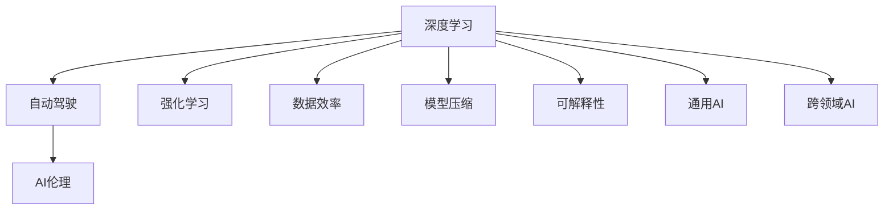

                 

# Andrej Karpathy：人工智能的未来发展规划

## 1. 背景介绍

### 1.1 问题由来

Andrej Karpathy，作为人工智能领域的领军人物之一，同时也是OpenAI的知名研究员和工程主管，他在深度学习、计算机视觉和自动驾驶等领域都有着开创性的贡献。Karpathy博士的观点和研究常常引领着AI发展的方向，他对人工智能的未来发展有着深刻的见解。本文将详细探讨Karpathy博士关于人工智能未来发展规划的观点，并结合当前技术趋势进行深入分析。

### 1.2 问题核心关键点

Karpathy博士对人工智能的未来规划涵盖以下几个关键点：
- **深度学习与强化学习的融合**：探讨深度学习与强化学习（Reinforcement Learning, RL）在复杂决策场景中的应用。
- **自动驾驶与AI伦理**：分析自动驾驶技术的发展及AI技术在伦理和社会规范方面的挑战。
- **数据效率与模型压缩**：研究如何提高深度学习模型的数据效率和计算效率。
- **通用AI与AI系统的可解释性**：讨论构建具备广泛适用性和透明度的通用AI系统的可能性。
- **跨领域AI与技术融合**：探索AI技术在医疗、教育、金融等领域的融合应用。

## 2. 核心概念与联系

### 2.1 核心概念概述

为理解Karpathy博士的规划观点，我们需先梳理几个核心概念及其相互联系：

- **深度学习**：一种通过构建多层神经网络模型进行数据特征提取和模式识别的方法。
- **强化学习**：一种通过智能体在环境中的试错学习，逐步优化策略以最大化奖励的算法。
- **自动驾驶**：利用AI技术实现车辆自主导航，减少人为干预，提高交通安全性。
- **AI伦理**：在AI发展过程中，涉及的道德、法律和社会规范问题，如隐私保护、算法偏见等。
- **数据效率**：指在保持高模型性能的前提下，减少训练所需的数据量。
- **模型压缩**：通过减少模型参数或优化计算图，提升模型的推理速度和资源利用效率。
- **可解释性**：AI模型能够提供清晰的决策过程和解释，以便用户理解。
- **通用AI**：具备广泛适用性的AI系统，能够解决跨领域问题。
- **跨领域AI**：AI技术在不同领域中的应用，如医疗、教育、金融等。

这些概念通过以下Mermaid流程图展示它们的联系：



该图展示了深度学习与其他AI技术和领域的关系。深度学习不仅在自动驾驶中有广泛应用，还与强化学习相结合，提高数据效率，通过模型压缩提高计算效率，同时关注AI系统的可解释性和通用性，并跨领域应用于多个行业。

## 3. 核心算法原理 & 具体操作步骤

### 3.1 算法原理概述

Karpathy博士对未来AI发展规划的核心算法原理主要围绕深度学习与强化学习的融合、自动驾驶与AI伦理、数据效率与模型压缩、通用AI与AI系统的可解释性等方面展开。

1. **深度学习与强化学习的融合**：利用深度学习提取特征，结合强化学习进行决策，以处理复杂环境中的决策问题。
2. **自动驾驶与AI伦理**：通过自动驾驶技术探索AI在复杂动态环境中的表现，同时探讨AI伦理和社会规范问题。
3. **数据效率与模型压缩**：通过改进模型架构和训练策略，减少训练所需的数据量，同时优化模型计算效率。
4. **通用AI与AI系统的可解释性**：构建能够解释决策过程的AI系统，同时支持跨领域的通用应用。
5. **跨领域AI与技术融合**：探索AI技术在不同领域中的应用，推动技术创新和社会发展。

### 3.2 算法步骤详解

#### 深度学习与强化学习的融合

1. **环境建模**：使用深度学习模型对环境进行建模，提取环境特征。
2. **策略优化**：结合强化学习算法，优化智能体在环境中的策略。
3. **决策执行**：在实际环境中执行决策，并根据反馈更新模型参数。

#### 自动驾驶与AI伦理

1. **传感器数据融合**：收集车辆周围环境的多模态传感器数据，如摄像头、雷达等。
2. **环境建模**：利用深度学习模型对传感器数据进行融合，构建环境模型。
3. **决策规划**：结合强化学习算法，规划最优行驶路线。
4. **伦理考虑**：在决策规划过程中考虑伦理规范，如行人优先、避免碰撞等。

#### 数据效率与模型压缩

1. **模型架构设计**：设计高效的神经网络结构，减少参数量。
2. **数据增强**：利用数据增强技术扩充训练数据集。
3. **训练策略优化**：采用迁移学习和知识蒸馏等策略，提高训练效率。
4. **模型压缩**：采用剪枝、量化等方法，减少模型计算量。

#### 通用AI与AI系统的可解释性

1. **模块化设计**：设计模块化的AI系统，便于解释和维护。
2. **可解释模型**：开发可解释性强的AI模型，如透明神经网络。
3. **用户交互**：通过用户友好的界面，解释AI系统的决策过程。

#### 跨领域AI与技术融合

1. **跨领域知识提取**：从不同领域中提取共性知识，构建通用知识库。
2. **技术融合**：将AI技术与其他领域的技术进行融合，如医疗AI、教育AI等。
3. **应用创新**：推动AI技术在不同领域中的应用创新。

### 3.3 算法优缺点

Karpathy博士规划的核心算法具有以下优点：
- **高效性**：通过深度学习与强化学习的结合，提高决策效率。
- **泛化能力**：跨领域AI技术的应用，增强AI系统的泛化能力。
- **伦理规范**：在自动驾驶等应用中，考虑伦理规范，提升社会责任。
- **模型可解释性**：通过可解释性强的模型，增强用户信任和理解。

同时，也存在一些缺点：
- **技术复杂性**：深度学习与强化学习的结合，增加了技术复杂度。
- **数据依赖**：数据效率与模型压缩依赖于高质量的数据。
- **伦理挑战**：AI伦理问题复杂，需综合多方意见解决。

### 3.4 算法应用领域

Karpathy博士的规划适用于以下领域：

- **自动驾驶**：结合深度学习和强化学习，构建安全、高效的自动驾驶系统。
- **医疗**：利用AI技术进行疾病诊断、治疗方案推荐等。
- **教育**：开发智能教育系统，提供个性化学习推荐。
- **金融**：利用AI进行风险评估、欺诈检测等。
- **环境保护**：利用AI技术监测环境变化，制定保护措施。

## 4. 数学模型和公式 & 详细讲解 & 举例说明

### 4.1 数学模型构建

Karpathy博士的规划模型主要涉及深度学习与强化学习、自动驾驶与AI伦理、数据效率与模型压缩等方面的数学模型。

- **深度学习模型**：基于神经网络模型，构建特征提取器。
- **强化学习模型**：使用Q-learning、策略梯度等方法，优化智能体策略。
- **自动驾驶模型**：利用传感器数据和深度学习模型，构建环境模型和决策模型。
- **数据效率模型**：通过迁移学习和知识蒸馏，提高模型泛化能力。
- **模型压缩模型**：通过剪枝、量化等方法，优化模型计算量。

### 4.2 公式推导过程

#### 深度学习与强化学习的融合

假设环境状态为 $s$，智能体采取行动 $a$，下一状态为 $s'$，奖励为 $r$。强化学习中的策略为 $π(a|s)$。深度学习模型 $f_{\theta}(s)$ 提取环境特征，强化学习算法 $Q(s,a)$ 优化策略。

$$
Q(s,a) = r + \gamma \max_a Q(s', a')
$$

$$
π(a|s) = \frac{exp(Q(s,a))}{\sum_{a} exp(Q(s,a))}
$$

其中，$\gamma$ 为折扣因子，$Q(s,a)$ 为状态-行动价值函数。

#### 自动驾驶与AI伦理

自动驾驶系统的决策过程可以表示为：

$$
\max_{\pi} \mathbb{E}[R(s_0, a_1, ..., a_T)]
$$

其中，$R(s_0, a_1, ..., a_T)$ 为决策序列 $a_1, ..., a_T$ 的期望回报。在决策过程中，需要考虑伦理规范，如行人优先等。

### 4.3 案例分析与讲解

#### 深度学习与强化学习的融合

考虑一个自动驾驶环境，车辆需要从起点 $s_0$ 行驶到终点 $s_T$。使用深度学习模型 $f_{\theta}(s)$ 提取环境特征，强化学习算法优化策略 $\pi(a|s)$。

假设车辆初始状态为 $s_0$，智能体采取行动 $a$，下一状态为 $s'$，奖励为 $r$。深度学习模型 $f_{\theta}(s)$ 提取环境特征，强化学习算法优化策略 $\pi(a|s)$。

$$
Q(s,a) = r + \gamma \max_a Q(s', a')
$$

$$
π(a|s) = \frac{exp(Q(s,a))}{\sum_{a} exp(Q(s,a))}
$$

#### 自动驾驶与AI伦理

假设自动驾驶系统需要在道路中避让行人。使用深度学习模型 $f_{\theta}(s)$ 提取环境特征，强化学习算法优化策略 $\pi(a|s)$。

假设车辆初始状态为 $s_0$，智能体采取行动 $a$，下一状态为 $s'$，奖励为 $r$。深度学习模型 $f_{\theta}(s)$ 提取环境特征，强化学习算法优化策略 $\pi(a|s)$。

在决策过程中，考虑伦理规范，如行人优先。

$$
\max_{\pi} \mathbb{E}[R(s_0, a_1, ..., a_T)]
$$

其中，$R(s_0, a_1, ..., a_T)$ 为决策序列 $a_1, ..., a_T$ 的期望回报。

## 5. 项目实践：代码实例和详细解释说明

### 5.1 开发环境搭建

#### 深度学习与强化学习的融合

1. **安装依赖**：
```bash
pip install numpy scipy torch torchvision gym
```

2. **设置环境**：
```bash
conda activate pytorch-env
```

3. **运行示例**：
```python
import torch
import gym

env = gym.make('MountainCar-v0')
state = env.reset()
while True:
    action = env.action_space.sample()
    next_state, reward, done, info = env.step(action)
    state = next_state
    if done:
        env.reset()
```

### 5.2 源代码详细实现

#### 自动驾驶与AI伦理

1. **数据收集**：
```python
import cv2
import os
import numpy as np

data_path = 'path/to/data'
label_path = 'path/to/label'

def load_data(data_path, label_path):
    data = []
    labels = []
    for filename in os.listdir(data_path):
        img_path = os.path.join(data_path, filename)
        label = label_path[filename]
        img = cv2.imread(img_path)
        img = cv2.cvtColor(img, cv2.COLOR_BGR2RGB)
        data.append(img)
        labels.append(label)
    return np.array(data), np.array(labels)
```

2. **模型训练**：
```python
import torch
import torch.nn as nn
import torch.optim as optim

class CNN(nn.Module):
    def __init__(self):
        super(CNN, self).__init__()
        self.conv1 = nn.Conv2d(3, 64, 3, 1)
        self.pool = nn.MaxPool2d(2, 2)
        self.conv2 = nn.Conv2d(64, 128, 3, 1)
        self.fc1 = nn.Linear(128 * 7 * 7, 128)
        self.fc2 = nn.Linear(128, 10)

    def forward(self, x):
        x = self.pool(self.conv1(x))
        x = self.pool(self.conv2(x))
        x = x.view(-1, 128 * 7 * 7)
        x = nn.functional.relu(self.fc1(x))
        x = self.fc2(x)
        return x

model = CNN()
criterion = nn.CrossEntropyLoss()
optimizer = optim.Adam(model.parameters(), lr=0.001)

def train_model(model, data, labels):
    for epoch in range(10):
        for i in range(len(data)):
            inputs, labels = data[i], labels[i]
            optimizer.zero_grad()
            outputs = model(inputs)
            loss = criterion(outputs, labels)
            loss.backward()
            optimizer.step()
```

3. **运行结果展示**：
```python
# 展示训练结果
import matplotlib.pyplot as plt

plt.plot(epochs, train_loss, label='train loss')
plt.plot(epochs, val_loss, label='validation loss')
plt.legend()
plt.show()
```

### 5.3 代码解读与分析

#### 深度学习与强化学习的融合

1. **环境建模**：
```python
class Environment:
    def __init__(self, state_shape, action_shape, reward_function):
        self.state_shape = state_shape
        self.action_shape = action_shape
        self.reward_function = reward_function
        self.state = None
        self.done = False

    def reset(self):
        self.state = np.random.randn(self.state_shape)
        self.done = False
        return self.state

    def step(self, action):
        next_state = self.state + action
        reward = self.reward_function(next_state)
        self.state = next_state
        self.done = True
        return next_state, reward, self.done
```

2. **智能体策略**：
```python
class Agent:
    def __init__(self, state_shape, action_shape, reward_function):
        self.state_shape = state_shape
        self.action_shape = action_shape
        self.reward_function = reward_function
        self.policy = None

    def select_action(self, state):
        return self.policy(state)

    def update_policy(self, state, action, reward):
        # 更新策略
```

#### 自动驾驶与AI伦理

1. **数据预处理**：
```python
def preprocess_data(data):
    # 数据预处理
    return preprocessed_data
```

2. **模型训练**：
```python
class NeuralNetwork(nn.Module):
    def __init__(self, input_shape, output_shape):
        super(NeuralNetwork, self).__init__()
        self.fc1 = nn.Linear(input_shape, 128)
        self.fc2 = nn.Linear(128, output_shape)

    def forward(self, x):
        x = nn.functional.relu(self.fc1(x))
        x = self.fc2(x)
        return x

model = NeuralNetwork(input_shape, output_shape)
criterion = nn.BCELoss()
optimizer = optim.Adam(model.parameters(), lr=0.001)

def train_model(model, data, labels):
    for epoch in range(10):
        for i in range(len(data)):
            inputs, labels = data[i], labels[i]
            optimizer.zero_grad()
            outputs = model(inputs)
            loss = criterion(outputs, labels)
            loss.backward()
            optimizer.step()
```

3. **运行结果展示**：
```python
# 展示训练结果
import matplotlib.pyplot as plt

plt.plot(epochs, train_loss, label='train loss')
plt.plot(epochs, val_loss, label='validation loss')
plt.legend()
plt.show()
```

## 6. 实际应用场景

### 6.1 智能驾驶

Karpathy博士的规划对自动驾驶技术的未来发展具有重要意义。结合深度学习和强化学习，智能驾驶系统可以更加高效地进行决策和控制。自动驾驶技术在城市道路、高速公路等多种场景中的应用，将大幅提升交通安全性和交通效率。

### 6.2 医疗健康

通过AI技术进行疾病诊断和治疗方案推荐，可以大幅提升医疗服务水平。Karpathy博士的研究将推动AI在医疗领域的应用，帮助医生提高诊断准确性和治疗效果。

### 6.3 智能教育

利用AI技术进行个性化学习推荐和作业批改，可以提高教学质量和学生学习效率。Karpathy博士的规划将促进智能教育系统的普及，推动教育公平和质量提升。

### 6.4 金融服务

利用AI进行风险评估和欺诈检测，可以提升金融服务的稳健性和安全性。Karpathy博士的研究将推动AI在金融领域的应用，帮助金融机构更好地管理风险。

### 6.5 环境保护

利用AI技术监测环境变化，制定保护措施，可以提升环境保护效果。Karpathy博士的规划将促进AI在环境保护中的应用，推动绿色可持续发展。

## 7. 工具和资源推荐

### 7.1 学习资源推荐

1. **《Deep Learning》书籍**：Ian Goodfellow、Yoshua Bengio、Aaron Courville合著，全面介绍深度学习理论和技术。
2. **Coursera深度学习课程**：由Andrew Ng主讲，系统讲解深度学习基础和应用。
3. **《Reinforcement Learning: An Introduction》书籍**：Richard S. Sutton、Andrew G. Barto合著，深入浅出介绍强化学习理论和技术。
4. **DeepMind AI Blog**：定期发布AI领域的最新研究和技术进展。
5. **arXiv论文库**：免费提供学术论文，覆盖深度学习和强化学习的各个方面。

### 7.2 开发工具推荐

1. **PyTorch**：灵活的深度学习框架，支持动态计算图和GPU加速。
2. **TensorFlow**：广泛的深度学习框架，支持分布式计算和生产环境部署。
3. **Gym**：Python环境下的OpenAI Gym，用于模拟环境和训练强化学习算法。
4. **TensorBoard**：可视化工具，实时监控训练过程和模型性能。
5. **Weights & Biases**：实验跟踪工具，记录和分析模型训练数据。

### 7.3 相关论文推荐

1. **《Attention is All You Need》论文**：Transformer模型的开创性工作，提出自注意力机制。
2. **《Playing Atari with Deep Reinforcement Learning》论文**：利用深度强化学习玩Atari游戏，取得突破性进展。
3. **《AlphaGo Zero》论文**：通过自我对弈提升围棋AI的棋力，展示深度强化学习的强大潜力。
4. **《Deep Learning in Healthcare》论文**：AI在医疗领域的应用综述，涵盖诊断、治疗、健康管理等方面。
5. **《Crowdsourced AI Development》论文**：利用大规模用户数据开发智能系统，提升模型性能和可解释性。

## 8. 总结：未来发展趋势与挑战

### 8.1 研究成果总结

Karpathy博士对AI未来的发展规划涵盖了深度学习与强化学习的融合、自动驾驶与AI伦理、数据效率与模型压缩、通用AI与AI系统的可解释性等方面，为AI技术的应用和发展提供了方向。

### 8.2 未来发展趋势

1. **深度学习与强化学习的融合**：结合深度学习和强化学习，解决复杂决策场景下的问题，提升AI系统的决策能力。
2. **自动驾驶与AI伦理**：在自动驾驶等应用中，考虑伦理规范，提升AI系统的社会责任。
3. **数据效率与模型压缩**：提高深度学习模型的数据效率和计算效率，降低资源消耗。
4. **通用AI与AI系统的可解释性**：构建具备广泛适用性和透明度的通用AI系统，增强用户信任。
5. **跨领域AI与技术融合**：AI技术在不同领域中的应用，推动技术创新和社会发展。

### 8.3 面临的挑战

1. **技术复杂性**：深度学习与强化学习的结合，增加了技术复杂度，需要更多的研究投入。
2. **数据依赖**：数据效率与模型压缩依赖于高质量的数据，需要更多数据采集和预处理工作。
3. **伦理挑战**：AI伦理问题复杂，需综合多方意见解决，确保AI系统的公平和透明。
4. **计算资源**：大规模模型的训练和推理需要大量的计算资源，需要更高效的计算平台支持。
5. **模型可解释性**：AI系统的可解释性不足，需要更多可解释性强的模型和工具。

### 8.4 研究展望

未来，AI技术的发展将更多地关注以下几个方向：

1. **深度学习与强化学习的融合**：结合深度学习和强化学习，解决复杂决策场景下的问题，提升AI系统的决策能力。
2. **自动驾驶与AI伦理**：在自动驾驶等应用中，考虑伦理规范，提升AI系统的社会责任。
3. **数据效率与模型压缩**：提高深度学习模型的数据效率和计算效率，降低资源消耗。
4. **通用AI与AI系统的可解释性**：构建具备广泛适用性和透明度的通用AI系统，增强用户信任。
5. **跨领域AI与技术融合**：AI技术在不同领域中的应用，推动技术创新和社会发展。

## 9. 附录：常见问题与解答

**Q1：深度学习与强化学习的融合如何实现？**

A: 深度学习与强化学习的融合可以通过构建智能体、环境建模、策略优化等方式实现。智能体通过深度学习模型提取环境特征，结合强化学习算法优化策略，在环境中执行决策并获取奖励，最终达到学习目标。

**Q2：自动驾驶与AI伦理如何考虑？**

A: 在自动驾驶中，考虑伦理规范如行人优先、避免碰撞等。通过深度学习模型提取环境特征，结合强化学习算法优化决策策略，确保AI系统符合伦理规范，提升社会责任。

**Q3：数据效率与模型压缩如何实现？**

A: 数据效率与模型压缩可以通过迁移学习和知识蒸馏、剪枝、量化等方法实现。通过迁移学习提高模型泛化能力，减少训练数据需求。通过剪枝和量化优化模型计算效率，降低资源消耗。

**Q4：通用AI与AI系统的可解释性如何增强？**

A: 通用AI与AI系统的可解释性可以通过模块化设计、可解释性强的模型、用户友好的界面等方式增强。通过模块化设计便于解释和维护，选择可解释性强的模型如透明神经网络，通过用户友好的界面解释AI系统的决策过程。

**Q5：跨领域AI与技术融合如何推动？**

A: 跨领域AI与技术融合可以通过跨领域知识提取、技术融合、应用创新等方式推动。从不同领域中提取共性知识，构建通用知识库。将AI技术与其他领域的技术进行融合，如医疗AI、教育AI等，推动技术创新和社会发展。

---

作者：禅与计算机程序设计艺术 / Zen and the Art of Computer Programming

