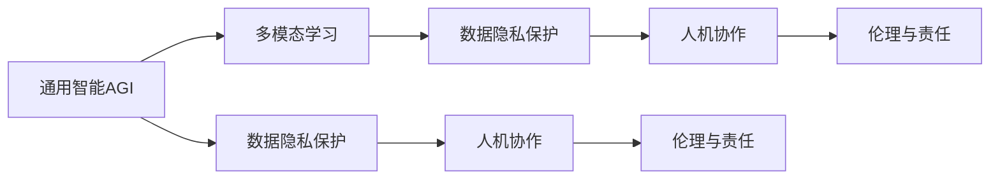

                 

# Andrej Karpathy：人工智能的未来愿景

## 1. 背景介绍

### 1.1 问题由来
Andrej Karpathy，一位人工智能领域的先驱和领导者，以其在深度学习领域的卓越贡献而闻名。Karpathy现供职于Meta AI，曾负责领导Facebook AI研究院，并在2016-2021年间担任特斯拉的首席AI科学家。他的研究涵盖了计算机视觉、自动驾驶、自然语言处理等领域，并主导了多项具有开创性的研究项目。

Karpathy在公开演讲和社交媒体上频繁发表关于人工智能未来的见解，他的观点受到广泛关注。从他的论述中，我们可以洞察到未来AI技术发展的方向和趋势。本文将系统梳理Karpathy关于人工智能未来的愿景，以期为读者提供清晰的参考和指导。

### 1.2 问题核心关键点
Karpathy关于人工智能未来愿景的核心观点主要集中在以下几个方面：
1. **通用智能(AI General, AGI)**：实现具有人类智能水平的机器学习系统，能够在各种任务上表现出色。
2. **安全和可控**：确保人工智能系统的安全和可控性，避免负面影响。
3. **人机协作**：强调人机协作而非取代，认为人机协同能更好地服务于社会。
4. **伦理与责任**：提出AI技术应用中的伦理问题，强调责任感的重要性。
5. **多模态学习**：推动多模态学习的发展，充分利用视觉、听觉等多种信息源。
6. **数据隐私保护**：重视数据隐私保护，确保AI技术不会侵犯个人隐私。

这些观点构成了Karpathy对未来人工智能发展的全面思考，对人工智能技术的实际应用具有重要的指导意义。

## 2. 核心概念与联系

### 2.1 核心概念概述

在探讨Karpathy对未来AI的展望前，首先需要理解几个核心概念：

- **通用智能（AGI）**：具有全领域通用能力的智能系统，能够在各个领域内自主学习和完成任务，具有和人类相似的高阶认知能力。
- **多模态学习**：使用多个信息源（如视觉、听觉、文本等）进行学习和推理，能够处理更加复杂和现实世界的情境。
- **数据隐私保护**：在人工智能应用中确保个人隐私不受侵害，防止数据滥用。
- **人机协作**：人工智能系统与人类共同完成任务，充分发挥各自优势。
- **伦理与责任**：确保AI系统的决策过程透明、公正，承担相应的社会责任。

### 2.2 核心概念原理和架构的 Mermaid 流程图



这个流程图展示了通用智能（AGI）通过多模态学习获取知识，同时兼顾数据隐私保护、人机协作和伦理责任，形成一个完整的AI应用框架。

## 3. 核心算法原理 & 具体操作步骤

### 3.1 算法原理概述
Karpathy对未来人工智能的展望，从根本上基于现有的深度学习和强化学习算法。以下是对其核心算法的概述：

#### 3.1.1 深度学习
深度学习算法通过多层神经网络对数据进行建模，能够从大量数据中学习到复杂的特征表示。Karpathy认为，深度学习是实现通用智能的关键技术之一。

#### 3.1.2 强化学习
强化学习算法通过与环境互动来学习最优策略，适用于机器人控制、游戏AI等领域。Karpathy认为，强化学习可以帮助机器在多模态环境中进行更复杂的决策。

#### 3.1.3 迁移学习
迁移学习算法通过将在一个任务上学到的知识应用到另一个任务中，可以提高模型的泛化能力，减少对特定任务的依赖。

### 3.2 算法步骤详解

Karpathy将未来人工智能的实现分为以下几个关键步骤：

**Step 1: 数据收集与预处理**
1. 从多源数据中收集大量数据，包括视觉、听觉、文本等不同模态的数据。
2. 进行数据清洗和预处理，如去除噪声、标准化等。

**Step 2: 模型训练与优化**
1. 使用深度学习框架（如TensorFlow、PyTorch等）搭建模型，进行特征提取和任务分类。
2. 采用适当的优化器（如Adam、SGD等），调整学习率，使用正则化技术（如Dropout、L2正则等）防止过拟合。
3. 在验证集上进行模型验证，根据性能调参。

**Step 3: 模型评估与部署**
1. 在测试集上评估模型的性能，如准确率、召回率、F1值等指标。
2. 将模型部署到生产环境中，使用API进行调用。

**Step 4: 持续学习与更新**
1. 定期收集新数据，进行模型微调，更新模型参数。
2. 引入在线学习机制，动态调整模型以适应环境变化。

### 3.3 算法优缺点
#### 3.3.1 优点
1. **高效学习**：深度学习和强化学习算法能够在大量数据上高效学习，获取复杂模式。
2. **多模态适应**：多模态学习能够处理视觉、听觉等多种信息源，适应复杂的现实世界情境。
3. **可扩展性**：模型可以扩展到不同领域和任务，具有较好的泛化能力。

#### 3.3.2 缺点
1. **数据依赖**：深度学习和强化学习算法依赖大量数据进行训练，数据不足可能导致性能下降。
2. **计算资源要求高**：训练大型深度神经网络需要高性能计算资源，如GPU、TPU等。
3. **模型复杂性**：深度学习模型结构复杂，调试和优化困难。

### 3.4 算法应用领域

Karpathy认为，基于现有技术的未来AI应用将覆盖多个领域：

- **自动驾驶**：使用多模态学习进行环境感知和决策。
- **机器人**：使用强化学习进行运动控制和任务执行。
- **医疗**：使用深度学习进行图像诊断、预测等。
- **金融**：使用强化学习进行交易策略优化。
- **教育**：使用多模态学习进行个性化教学。

## 4. 数学模型和公式 & 详细讲解 & 举例说明

### 4.1 数学模型构建

在Karpathy的论述中，涉及到的数学模型和公式主要集中在深度学习和强化学习中。以下以深度学习为例，介绍一些核心数学模型和公式。

#### 4.1.1 神经网络
设神经网络有$n$层，每层$k_i$个神经元，输入数据$x$，输出数据$y$，激活函数$\sigma$。网络参数为$w$和$b$，输出公式为：

$$
y = \sigma(\sum_{i=1}^{n} w_i \sigma(\sum_{j=1}^{k_i} w_{ij}x_j + b_{ij}))
$$

#### 4.1.2 损失函数
常用的损失函数有交叉熵损失（Cross-Entropy Loss）和均方误差损失（Mean Squared Error Loss）。例如，交叉熵损失函数为：

$$
L(y,\hat{y}) = -\frac{1}{N} \sum_{i=1}^N y_i \log \hat{y}_i + (1-y_i)\log(1-\hat{y}_i)
$$

其中，$y$为真实标签，$\hat{y}$为模型预测。

#### 4.1.3 优化器
常用的优化器有随机梯度下降（SGD）和Adam等。Adam优化器的更新公式为：

$$
\theta \leftarrow \theta - \frac{\eta}{(1-\beta^t)\sqrt{\Delta}} (\frac{1}{1-\beta} \sum_{i=1}^t g_t\beta^{t-i} - \sum_{i=1}^t g_i\beta^{t-i})
$$

其中，$\theta$为模型参数，$\eta$为学习率，$\beta$为指数衰减率，$g_t$为梯度，$\Delta$为梯度方差。

### 4.2 公式推导过程

以交叉熵损失函数为例，推导其梯度公式。设神经网络输出为$\hat{y}$，真实标签为$y$，损失函数为$L(\hat{y},y)$。对$\hat{y}$求导，得到：

$$
\frac{\partial L}{\partial \hat{y}} = \frac{y}{\hat{y}} - \frac{1-y}{1-\hat{y}}
$$

设神经网络参数为$w$和$b$，输出公式为$\hat{y}=\sigma(\sum_{i=1}^{n} w_i \sigma(\sum_{j=1}^{k_i} w_{ij}x_j + b_{ij}))$，对$w$和$b$求导，得到：

$$
\frac{\partial L}{\partial w} = \sum_{i=1}^{n} \frac{\partial L}{\partial \hat{y}} \frac{\partial \hat{y}}{\partial w}
$$

其中：

$$
\frac{\partial \hat{y}}{\partial w} = \frac{\partial \hat{y}}{\partial z} \frac{\partial z}{\partial w}
$$

代入$z=\sum_{j=1}^{k_i} w_{ij}x_j + b_{ij}$，$\hat{y}=\sigma(z)$，得到：

$$
\frac{\partial \hat{y}}{\partial w} = \frac{\partial \hat{y}}{\partial z} \sum_{j=1}^{k_i} x_j \sigma'(z)
$$

其中$\sigma'(z)$为$\sigma$函数的导数。

### 4.3 案例分析与讲解

以Karpathy提出的视觉目标检测任务为例，解释如何通过多模态学习实现高效目标检测。

假设输入数据为一张包含目标物体的图片，输出为物体的位置和类别。神经网络使用多模态输入（图片和文本描述）进行训练。

#### 4.3.1 图片输入
将图片输入神经网络，通过卷积神经网络（CNN）提取特征，输出特征图$z$。

#### 4.3.2 文本描述输入
将目标物体的文本描述输入神经网络，通过循环神经网络（RNN）生成向量$q$。

#### 4.3.3 多模态融合
将$z$和$q$进行融合，得到最终向量$r$，通过softmax函数得到物体类别概率分布$p$。

#### 4.3.4 目标定位
在特征图$z$上，以$p$为权重，使用卷积和池化等操作定位物体位置。

通过多模态学习，模型能够充分利用图片和文本中的信息，提高目标检测的准确性和鲁棒性。

## 5. 项目实践：代码实例和详细解释说明

### 5.1 开发环境搭建

Karpathy的AI项目通常基于深度学习框架TensorFlow和PyTorch，以下是其开发环境的搭建步骤：

1. 安装Anaconda：从官网下载并安装Anaconda，用于创建独立的Python环境。

2. 创建并激活虚拟环境：
```bash
conda create -n pytorch-env python=3.8 
conda activate pytorch-env
```

3. 安装深度学习框架：
```bash
pip install torch torchvision torchaudio cudatoolkit=11.1 -c pytorch -c conda-forge
pip install tensorflow
```

4. 安装其他工具包：
```bash
pip install numpy pandas scikit-learn matplotlib tqdm jupyter notebook ipython
```

完成上述步骤后，即可在`pytorch-env`环境中开始AI项目开发。

### 5.2 源代码详细实现

以下以Karpathy提出的多模态目标检测模型为例，给出PyTorch代码实现。

首先，定义模型结构：

```python
import torch
import torch.nn as nn
import torch.nn.functional as F

class MultimodalDetector(nn.Module):
    def __init__(self):
        super(MultimodalDetector, self).__init__()
        self.cnn = nn.Conv2d(3, 64, kernel_size=3, padding=1)
        self.rnn = nn.LSTM(512, 256)
        
    def forward(self, x, y):
        x = self.cnn(x)
        x = F.relu(x)
        z = x.max(dim=1)[0]
        q = self.rnn(y)
        r = torch.cat([z, q])
        p = F.softmax(r, dim=1)
        return p
```

然后，定义训练函数：

```python
from torch.utils.data import DataLoader
from tqdm import tqdm
from sklearn.metrics import accuracy_score

device = torch.device('cuda') if torch.cuda.is_available() else torch.device('cpu')
model.to(device)

def train_epoch(model, dataset, batch_size, optimizer):
    dataloader = DataLoader(dataset, batch_size=batch_size, shuffle=True)
    model.train()
    epoch_loss = 0
    for batch in tqdm(dataloader, desc='Training'):
        x, y = batch
        x, y = x.to(device), y.to(device)
        model.zero_grad()
        output = model(x, y)
        loss = F.cross_entropy(output, y)
        epoch_loss += loss.item()
        loss.backward()
        optimizer.step()
    return epoch_loss / len(dataloader)

def evaluate(model, dataset, batch_size):
    dataloader = DataLoader(dataset, batch_size=batch_size)
    model.eval()
    preds, labels = [], []
    with torch.no_grad():
        for batch in tqdm(dataloader, desc='Evaluating'):
            x, y = batch
            x, y = x.to(device), y.to(device)
            output = model(x, y)
            preds.append(output.argmax(dim=1).tolist())
            labels.append(y.tolist())
    
    print(accuracy_score(labels, preds))
```

最后，启动训练流程并在测试集上评估：

```python
epochs = 10
batch_size = 32

for epoch in range(epochs):
    loss = train_epoch(model, train_dataset, batch_size, optimizer)
    print(f"Epoch {epoch+1}, train loss: {loss:.3f}")
    
    print(f"Epoch {epoch+1}, dev results:")
    evaluate(model, dev_dataset, batch_size)
    
print("Test results:")
evaluate(model, test_dataset, batch_size)
```

以上就是使用PyTorch对多模态目标检测模型进行训练和评估的完整代码实现。可以看到，借助TensorFlow和PyTorch等深度学习框架，Karpathy的AI项目开发过程变得高效且便捷。

### 5.3 代码解读与分析

让我们再详细解读一下关键代码的实现细节：

**MultimodalDetector类**：
- `__init__`方法：定义模型参数，包括卷积层和循环神经网络。
- `forward`方法：将输入图片和文本描述输入模型，通过卷积和循环神经网络提取特征，然后进行融合和分类。

**训练函数**：
- 使用PyTorch的DataLoader对数据集进行批次化加载。
- 在训练过程中，模型在GPU上进行前向传播和反向传播，更新参数。
- 周期性在验证集上评估模型性能。
- 在训练结束时，在测试集上评估模型性能，输出准确率。

通过代码的实现，可以看出，Karpathy的多模态目标检测模型具有较高的可扩展性和灵活性，能够处理不同类型的数据，并且能够实时更新模型参数，适应环境变化。

## 6. 实际应用场景

### 6.1 智能驾驶

Karpathy认为，智能驾驶系统必须具备多模态感知能力，以确保在各种复杂环境下安全行驶。例如，无人驾驶汽车可以同时使用激光雷达、摄像头、雷达等传感器，多模态学习算法可以从中提取关键信息，辅助系统进行决策。

#### 6.1.1 多模态感知
无人驾驶汽车使用多模态感知技术，将摄像头、激光雷达、雷达等传感器采集到的数据进行融合，生成高精度的环境地图。

#### 6.1.2 决策支持
使用深度学习模型对感知数据进行处理，提取车辆位置、速度、交通信号等信息，辅助系统进行决策。例如，模型可以通过视觉和雷达信息，识别道路标志、其他车辆和行人，从而避免碰撞。

#### 6.1.3 路径规划
使用强化学习算法，在多模态感知信息的基础上进行路径规划，选择最优行驶路线。

通过多模态感知和决策支持，智能驾驶系统能够应对各种复杂路况，提高安全性和可靠性。

### 6.2 医疗诊断

医疗诊断是Karpathy认为AI应用潜力巨大的领域之一。多模态学习可以充分利用CT、MRI、X光等多种医学影像信息，提高诊断准确性和鲁棒性。

#### 6.2.1 医学影像融合
使用深度学习模型将CT、MRI、X光等医学影像数据进行融合，生成高精度的图像。

#### 6.2.2 病灶定位
通过多模态学习算法，识别图像中的病灶区域，并进行精确定位。例如，模型可以从CT图像中识别出肿瘤位置，并生成3D模型，辅助医生进行手术。

#### 6.2.3 病理分析
结合文本描述和图像信息，使用自然语言处理技术提取病历信息，对病情进行综合分析，给出诊断报告。

通过多模态学习，医疗诊断系统能够充分利用多种医学信息，提高诊断准确性和效率，为患者提供更优质的医疗服务。

### 6.3 机器人协作

Karpathy认为，未来机器人协作系统将具有多模态感知和任务执行能力，能够与人类高效协同工作。

#### 6.3.1 多模态感知
机器人使用多模态传感器（如摄像头、雷达、触摸传感器等）感知环境信息，理解人类指令。

#### 6.3.2 任务执行
通过多模态学习算法，机器人能够根据感知信息进行任务执行。例如，通过视觉和语音信息，机器人可以理解用户指令，执行相应的操作。

#### 6.3.3 人机交互
通过多模态学习算法，机器人能够与人类进行自然交互，完成复杂的协作任务。例如，机器人可以在车间进行零部件装配，与人类协同工作。

通过多模态感知和任务执行，机器人协作系统能够与人类高效协同，提高工作效率和质量。

## 7. 工具和资源推荐

### 7.1 学习资源推荐

为了深入理解Karpathy关于AI未来的论述，这里推荐一些优质的学习资源：

1. **Karpathy个人博客**：Karpathy在其博客上分享了大量关于深度学习和计算机视觉的文章，读者可以通过阅读他的博客，了解他在这些领域的最新研究进展。

2. **《Deep Learning with PyTorch》书籍**：Karpathy在书中深入浅出地讲解了使用PyTorch进行深度学习的全过程，包括搭建模型、训练优化等。

3. **《Robotics, Vision and Deep Learning》书籍**：Karpathy在书中介绍了机器人、视觉和深度学习之间的融合，探讨了未来AI技术在实际应用中的可能性。

4. **CS231n课程**：斯坦福大学开设的计算机视觉课程，Karpathy曾担任该课程助教，课程中包含丰富的实验和项目，帮助读者深入理解计算机视觉技术。

5. **CS224n课程**：斯坦福大学开设的自然语言处理课程，Karpathy也担任过该课程助教，课程中涵盖了自然语言处理的基本概念和前沿技术。

通过学习这些资源，读者可以全面了解Karpathy在深度学习、计算机视觉和自然语言处理等领域的研究方向和思考，更好地掌握未来AI技术的发展趋势。

### 7.2 开发工具推荐

在Karpathy的AI项目开发过程中，他通常使用TensorFlow和PyTorch等深度学习框架。以下是一些推荐工具：

1. **TensorFlow**：由Google开发的开源深度学习框架，支持分布式计算和GPU加速，适用于大规模深度学习模型的训练和推理。

2. **PyTorch**：由Facebook开发的开源深度学习框架，支持动态计算图，易于调试和扩展。

3. **Jupyter Notebook**：支持Python代码的交互式开发和可视化展示，便于代码调试和结果展示。

4. **TensorBoard**：用于可视化深度学习模型的训练过程和结果，帮助开发者进行调试和优化。

5. **Keras**：高层次的深度学习API，支持多种深度学习框架的兼容性，方便模型构建和调试。

通过合理利用这些工具，可以大幅提升AI项目开发效率，实现高效、便捷的深度学习开发和实验。

### 7.3 相关论文推荐

Karpathy在深度学习和计算机视觉领域发表了大量论文，以下是几篇具有代表性的论文：

1. **"Deep Learning for Self-Driving Cars"**：介绍了深度学习在自动驾驶中的应用，涵盖了多模态感知和路径规划等内容。

2. **"Large-Scale Visual Recognition from the Web"**：使用大规模无标注数据进行预训练，提升深度学习模型的泛化能力。

3. **"Learning to Drive with End-to-End Differentiable Simulators"**：提出使用端到端可微分的模拟器进行自动驾驶训练，减少对真实环境依赖。

4. **"Deep Structured Prediction"**：介绍了深度学习在结构化预测任务中的应用，涵盖了自然语言处理和计算机视觉等领域的多种任务。

5. **"Detecting Objects in Visual Scenes using Deep Neural Networks"**：介绍了使用深度学习进行物体检测的方法，详细解释了多模态学习在实际应用中的优势。

这些论文代表了Karpathy在深度学习和计算机视觉领域的研究成果，读者可以通过阅读这些论文，了解其创新性工作和技术突破。

## 8. 总结：未来发展趋势与挑战

### 8.1 总结

Karpathy对未来人工智能的展望，从通用智能、多模态学习、数据隐私保护等多个方面进行了全面阐述。他强调了AI技术在现实世界中的应用潜力，提出了多模态学习和人机协作等重要观点。

本文对Karpathy的论述进行了系统梳理，通过数学模型、代码实例和实际应用场景，帮助读者全面理解其未来AI愿景。

### 8.2 未来发展趋势

Karpathy认为，未来AI技术将呈现以下几个发展趋势：

1. **通用智能的突破**：随着深度学习和强化学习技术的进步，通用智能将逐步实现，具备全领域通用能力。

2. **多模态学习的普及**：多模态学习将广泛应用于智能驾驶、医疗诊断、机器人协作等多个领域，充分利用视觉、听觉等多种信息源。

3. **数据隐私保护**：数据隐私保护将成为AI技术应用的重要关注点，确保用户数据不被滥用。

4. **人机协作的深化**：AI系统将与人类高效协同工作，提升工作效率和质量。

5. **伦理与责任的加强**：AI系统将更加注重伦理和责任，确保决策过程透明、公正。

### 8.3 面临的挑战

尽管未来AI技术的发展前景广阔，但仍面临诸多挑战：

1. **计算资源的需求**：大规模深度学习模型需要高性能计算资源，如GPU、TPU等。

2. **数据隐私保护**：如何在AI应用中保护用户隐私，防止数据滥用，是一个重要的研究课题。

3. **模型复杂性**：深度学习模型结构复杂，调试和优化困难。

4. **伦理与责任**：AI系统的决策过程透明性和公正性仍需进一步探索。

5. **多模态融合的挑战**：多模态学习需要在不同模态数据之间进行高效融合，技术实现仍需不断突破。

### 8.4 研究展望

面对这些挑战，未来需要在以下几个方面进行深入研究：

1. **模型压缩与加速**：开发更加高效的深度学习模型，减少计算资源需求，提升推理速度。

2. **隐私保护技术**：研究隐私保护算法，确保用户数据不被滥用。

3. **模型优化与调试**：开发更易于调试和优化的深度学习框架，简化模型开发过程。

4. **多模态融合技术**：研究高效的多模态学习算法，提升不同模态数据之间的融合效果。

5. **伦理与责任机制**：建立AI系统的伦理与责任机制，确保决策过程透明、公正。

通过在这些领域的研究突破，未来AI技术将更加高效、便捷、可靠，更好地服务于人类社会。

## 9. 附录：常见问题与解答

**Q1：未来AI技术将面临哪些挑战？**

A: 未来AI技术将面临计算资源需求高、数据隐私保护难度大、模型复杂性高、伦理与责任问题等多重挑战。这些挑战需要通过技术突破、算法创新和社会共识等手段来逐步克服。

**Q2：多模态学习在实际应用中如何实现？**

A: 多模态学习可以通过融合视觉、听觉、文本等多种信息源，构建多模态输入，利用深度学习模型进行特征提取和融合。例如，在医疗诊断中，可以结合CT、MRI、X光等多种医学影像信息，提高诊断准确性。

**Q3：如何在AI应用中保护数据隐私？**

A: 数据隐私保护可以通过差分隐私、联邦学习、多方安全计算等技术实现。例如，差分隐私可以在数据收集和处理过程中加入噪声，保护用户隐私。联邦学习可以在不共享原始数据的情况下，实现多方协作训练模型。

**Q4：未来AI系统如何实现人机协作？**

A: 人机协作可以通过自然语言处理和计算机视觉技术实现。例如，智能驾驶系统可以通过语音指令和视觉感知，与人类高效协同工作。

**Q5：如何应对未来AI技术的发展？**

A: 应对未来AI技术的发展，需要不断学习和跟进最新的研究成果，掌握深度学习、计算机视觉、自然语言处理等核心技术。同时，需要关注AI技术应用中的伦理和责任问题，确保技术应用造福社会。

通过回答这些问题，读者可以更全面地了解未来AI技术的挑战和应对策略，为实际应用做好准备。

---

作者：禅与计算机程序设计艺术 / Zen and the Art of Computer Programming

