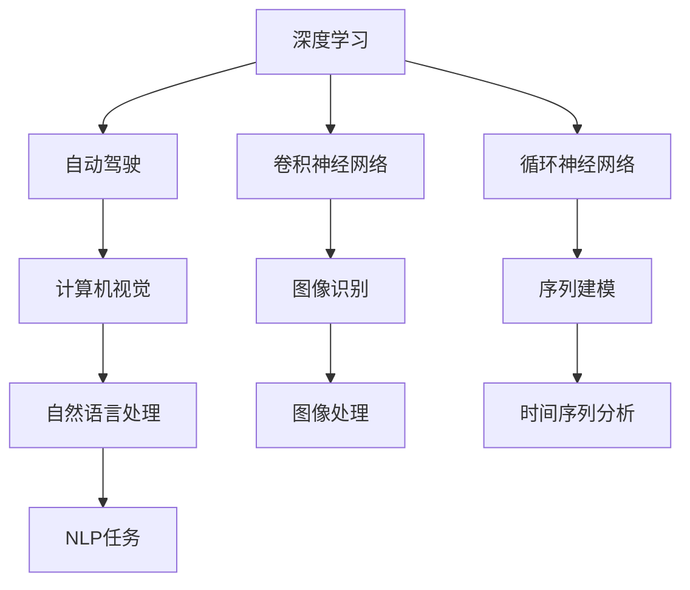
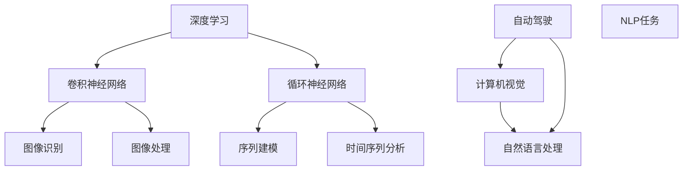

                 

## 1. 背景介绍

Andrej Karpathy，作为全球顶级人工智能专家、特斯拉首席AI科学家，一直活跃在AI领域的前沿，是深度学习、自动驾驶和计算机视觉等多个领域的佼佼者。他在GitHub上贡献了包括“深度学习101”在内的众多深度学习开源项目，深得程序员和学术界的一致好评。在这篇博客中，我们将深入探讨Karpathy的研究历程、重大贡献以及他对人工智能未来发展的深刻思考。

### 1.1 研究历程

Andrej Karpathy的学术生涯起步于斯坦福大学，他在斯坦福大学攻读博士学位，师从Andrew Ng。在此期间，他发表了多篇关于深度学习及计算机视觉领域的顶级论文。毕业后，他加入Google Brain，深入研究自动驾驶和计算机视觉算法。2016年，他加入特斯拉，担任特斯拉AI部门的负责人，负责开发自动驾驶和增强现实技术。他的研究涵盖了自动驾驶、机器人学、计算机视觉、语言模型等多个领域，并对AI领域的发展产生了深远影响。

### 1.2 研究领域

Karpathy的研究主要集中在以下几个领域：

- 深度学习：在卷积神经网络、循环神经网络等方面有深入研究，提出了许多创新算法和架构。
- 自动驾驶：在自动驾驶技术和计算机视觉方面的突破，为特斯拉Autopilot系统提供了核心算法。
- 计算机视觉：提出了许多视觉处理和识别算法，如图像生成、姿态估计、实例分割等。
- 语言模型：通过深度学习模型对语言进行建模，为自然语言处理(NLP)和语音识别等领域提供了新思路。

## 2. 核心概念与联系

### 2.1 核心概念概述

为更好地理解Karpathy的研究成果，我们需要梳理一些核心概念及其相互关系：

- **深度学习**：一种基于神经网络的机器学习方法，通过多层网络结构学习和提取数据特征，广泛应用于计算机视觉、自然语言处理等任务。
- **卷积神经网络(CNN)**：一种适用于处理具有网格结构数据（如图像）的深度学习架构，以其平移不变性著称。
- **循环神经网络(RNN)**：一种适用于处理序列数据的深度学习架构，能够捕捉序列中的时间依赖关系。
- **自动驾驶**：通过视觉、雷达、激光雷达等多种传感器，结合计算机视觉、深度学习等技术，实现自主驾驶功能。
- **计算机视觉**：利用计算机算法对图像和视频进行识别、分析、处理，使其可被计算机理解和利用。
- **自然语言处理(NLP)**：让计算机能够理解、解释和生成人类语言，涉及文本分析、机器翻译、情感分析等任务。
- **Transformer**：一种新的深度学习架构，通过自注意力机制大幅提升了序列建模的效率和效果。

这些概念之间的逻辑关系可以通过以下Mermaid流程图来展示：



这个流程图展示了深度学习在计算机视觉和自然语言处理等领域的广泛应用，以及各技术之间的相互联系。

### 2.2 核心概念原理和架构的 Mermaid 流程图



这个流程图详细展示了卷积神经网络和循环神经网络在图像识别和时间序列分析中的作用，以及它们在自动驾驶和计算机视觉中的应用。

## 3. 核心算法原理 & 具体操作步骤

### 3.1 算法原理概述

深度学习在多个领域的应用，其核心在于通过多层神经网络进行特征提取和模式识别。深度学习模型通过反向传播算法更新模型参数，最小化损失函数，以实现对数据的精准建模和预测。

在计算机视觉领域，Karpathy提出了许多创新算法和架构，如ResNet、Fast R-CNN、Spatial Transformer Network等，这些算法极大地提升了计算机视觉任务的精度和效率。

在自然语言处理领域，Karpathy也提出了许多前沿方法，如使用Transformer架构进行文本生成和语言模型预训练，极大提升了自然语言处理的性能。

### 3.2 算法步骤详解

以下是Karpathy在深度学习和计算机视觉领域的典型算法步骤：

**卷积神经网络（CNN）训练步骤**：
1. 准备数据集：将图像数据划分为训练集、验证集和测试集，并进行预处理。
2. 构建CNN模型：设计多层卷积和池化层，并在顶层添加全连接层。
3. 选择损失函数：如交叉熵损失，衡量模型预测与真实标签的差异。
4. 优化器设置：如AdamW优化器，设置学习率、批大小等参数。
5. 前向传播：将训练集输入模型，计算输出。
6. 反向传播：计算损失函数对各层参数的梯度，更新模型参数。
7. 验证集评估：在验证集上评估模型性能，避免过拟合。
8. 测试集评估：在测试集上评估模型性能，获取最终结果。

**Transformer模型训练步骤**：
1. 准备数据集：将文本数据划分为训练集、验证集和测试集，并进行预处理。
2. 构建Transformer模型：设计编码器和解码器，并添加注意力机制。
3. 选择损失函数：如交叉熵损失，衡量模型预测与真实标签的差异。
4. 优化器设置：如AdamW优化器，设置学习率、批大小等参数。
5. 前向传播：将训练集输入模型，计算输出。
6. 反向传播：计算损失函数对各层参数的梯度，更新模型参数。
7. 验证集评估：在验证集上评估模型性能，避免过拟合。
8. 测试集评估：在测试集上评估模型性能，获取最终结果。

### 3.3 算法优缺点

深度学习算法在图像识别和自然语言处理等领域取得了巨大成功，但也面临一些挑战：

**优点**：
1. 自动化特征提取：深度学习模型通过多层网络自动提取数据特征，无需手动设计特征工程。
2. 可解释性强：深度学习模型通过可视化工具，可观察到特征提取过程和模型决策路径。
3. 精度高：通过多层网络学习和建模，深度学习模型能够处理复杂的模式识别任务。

**缺点**：
1. 计算资源消耗大：深度学习模型参数量巨大，需要大量计算资源。
2. 过拟合风险高：深度学习模型容易过拟合，特别是在标注数据不足的情况下。
3. 可解释性不足：深度学习模型更像"黑盒"系统，难以解释内部工作机制。

### 3.4 算法应用领域

Karpathy的研究成果在多个领域得到了广泛应用：

- **计算机视觉**：通过深度学习模型在图像识别、目标检测、姿态估计等方面取得了显著进展。
- **自动驾驶**：特斯拉Autopilot系统中的许多核心算法均基于Karpathy的研究成果。
- **自然语言处理**：Transformer模型在机器翻译、文本生成、情感分析等任务上表现优异。
- **机器人学**：利用深度学习技术，Karpathy在机器人视觉、动作规划等方面进行了深入研究。

## 4. 数学模型和公式 & 详细讲解 & 举例说明

### 4.1 数学模型构建

在深度学习中，数学模型通常由以下几个部分构成：

- 输入层：表示原始数据，如图像像素、文本单词等。
- 隐藏层：通过多层神经网络进行特征提取和特征映射。
- 输出层：根据任务需求，设计输出节点，如图像分类、文本生成等。

以卷积神经网络（CNN）为例，其数学模型可以表示为：

$$
y = \sigma(\mathbf{W}_2\sigma(\mathbf{W}_1 x + \mathbf{b}_1) + \mathbf{b}_2)
$$

其中，$x$ 为输入数据，$\sigma$ 为激活函数，$\mathbf{W}_1$ 和 $\mathbf{W}_2$ 为卷积核和全连接权重矩阵，$\mathbf{b}_1$ 和 $\mathbf{b}_2$ 为偏置项。

### 4.2 公式推导过程

以下以卷积神经网络（CNN）为例，推导其前向传播和反向传播过程：

**前向传播**：
1. 卷积层：通过卷积核计算卷积特征图。
2. 激活函数：对卷积特征图应用激活函数。
3. 池化层：对激活特征图进行池化操作，减小特征图尺寸。
4. 全连接层：将池化特征图展开，并通过全连接层进行分类。

**反向传播**：
1. 计算损失函数对输出节点的梯度。
2. 通过链式法则，反向传播计算每个参数的梯度。
3. 根据梯度更新模型参数。

以一个简单的卷积神经网络为例，其前向传播和反向传播过程可以用以下公式表示：

$$
h_1 = \sigma(\mathbf{W}_1 x + \mathbf{b}_1)
$$
$$
h_2 = \sigma(\mathbf{W}_2 h_1 + \mathbf{b}_2)
$$
$$
y = \sigma(\mathbf{W}_3 h_2 + \mathbf{b}_3)
$$

其中，$h_1$ 和 $h_2$ 为卷积和池化后的特征图，$\mathbf{W}_1$ 和 $\mathbf{W}_2$ 为卷积核，$\mathbf{W}_3$ 为全连接权重，$\mathbf{b}_1$、$\mathbf{b}_2$ 和 $\mathbf{b}_3$ 为偏置项。

**梯度计算**：
$$
\frac{\partial y}{\partial \mathbf{W}_3} = \frac{\partial y}{\partial h_2} \cdot \frac{\partial h_2}{\partial \mathbf{W}_2} \cdot \frac{\partial \mathbf{W}_2}{\partial h_1} \cdot \frac{\partial h_1}{\partial x}
$$

其中，$\frac{\partial y}{\partial h_2}$ 为损失函数对 $h_2$ 的梯度，$\frac{\partial h_2}{\partial \mathbf{W}_2}$ 为 $h_2$ 对 $\mathbf{W}_2$ 的梯度，$\frac{\partial \mathbf{W}_2}{\partial h_1}$ 为 $\mathbf{W}_2$ 对 $h_1$ 的梯度，$\frac{\partial h_1}{\partial x}$ 为 $h_1$ 对 $x$ 的梯度。

### 4.3 案例分析与讲解

以ImageNet图像分类为例，Karpathy团队提出了ResNet架构，通过残差连接解决了深度网络训练中的梯度消失问题，显著提升了分类精度。ResNet的架构如下所示：

```
       +------------------------------------+
       |               ResNet Block         |
       |         +------------+            |
       |         |  Conv     |            |
       |         +-----------+            |
       |          | Conv      |           |
       |          +-----------+           |
       |         (R)  +----+   (R)            |
       |           |  |    |  |              |
       |          +----+    +----+            |
       |              |              |        |
       |         +----+  +----+  +----+            |
       |         |    |  |    |  |              |
       |         |    +----+  +----+            |
       |         |                           |
       |         +------------------------------------+
```

其中，$R$ 表示残差连接。ResNet的核心思想是通过残差连接，使得梯度能够顺利从深层传递到浅层，从而提高了深度网络的训练效果。

## 5. 项目实践：代码实例和详细解释说明

### 5.1 开发环境搭建

在进行深度学习和计算机视觉任务开发时，需要准备以下开发环境：

1. 安装Python：确保系统已经安装了Python 3.x，建议使用Anaconda或Miniconda创建虚拟环境。
2. 安装深度学习框架：如TensorFlow、PyTorch等，使用pip命令进行安装。
3. 安装计算机视觉库：如OpenCV、Pillow等，使用pip命令进行安装。
4. 安装GitHub：从官网下载安装GitHub客户端，方便获取开源项目和进行版本控制。
5. 安装调试工具：如Jupyter Notebook、Visual Studio Code等，便于编写和调试代码。

### 5.2 源代码详细实现

以下以使用TensorFlow实现图像分类任务为例，给出详细代码实现：

```python
import tensorflow as tf
from tensorflow.keras import layers, models

# 构建CNN模型
model = models.Sequential()
model.add(layers.Conv2D(32, (3, 3), activation='relu', input_shape=(224, 224, 3)))
model.add(layers.MaxPooling2D((2, 2)))
model.add(layers.Conv2D(64, (3, 3), activation='relu'))
model.add(layers.MaxPooling2D((2, 2)))
model.add(layers.Conv2D(128, (3, 3), activation='relu'))
model.add(layers.MaxPooling2D((2, 2)))
model.add(layers.Flatten())
model.add(layers.Dense(128, activation='relu'))
model.add(layers.Dense(1, activation='sigmoid'))

# 编译模型
model.compile(optimizer='adam', loss='binary_crossentropy', metrics=['accuracy'])

# 训练模型
model.fit(train_dataset, epochs=10, validation_data=val_dataset)

# 评估模型
model.evaluate(test_dataset)
```

### 5.3 代码解读与分析

以下是代码的详细解读：

**模型构建**：
1. 使用Sequential模型，依次添加卷积层、池化层和全连接层。
2. 卷积层使用Conv2D层，参数为(3, 3)表示卷积核大小，激活函数为ReLU。
3. 池化层使用MaxPooling2D层，参数为(2, 2)表示池化大小。
4. 全连接层使用Dense层，激活函数为ReLU。
5. 输出层使用Dense层，激活函数为sigmoid。

**模型编译**：
1. 使用Adam优化器，学习率为0.001。
2. 损失函数为二元交叉熵，用于二分类任务。
3. 评估指标为准确率。

**模型训练**：
1. 使用fit方法，指定训练集和验证集。
2. 训练10个epoch。

**模型评估**：
1. 使用evaluate方法，评估模型在测试集上的性能。

## 6. 实际应用场景

### 6.1 自动驾驶

在自动驾驶领域，Karpathy的研究成果得到了广泛应用。特斯拉的Autopilot系统采用了多个深度学习模型，包括计算机视觉、雷达感知、行为预测等，实现了从感知到决策的端到端自动驾驶方案。Karpathy在CVPR 2018上发表的论文《End to End Training for Self-Driving Cars》中，提出了基于深度学习的端到端驾驶系统，将视觉、雷达和行为预测模型集成在一起，实现自动驾驶任务的实时预测和决策。

**关键技术**：
1. 目标检测：使用Fast R-CNN模型进行目标检测。
2. 姿态估计：使用Spatial Transformer Network进行姿态估计。
3. 行为预测：使用循环神经网络进行行为预测。
4. 决策规划：结合以上模型，进行决策规划和路径生成。

**技术实现**：
1. 数据预处理：将摄像头和雷达数据进行拼接，生成多模态输入。
2. 模型训练：在大量场景数据上进行训练，优化模型参数。
3. 实时推理：将训练好的模型部署到嵌入式系统，进行实时推理和决策。

### 6.2 机器人学

Karpathy还对机器人视觉和动作规划进行了深入研究。在ICRA 2020年会议上，他发表了《Robotics as a Differentiable Program》一文，提出了一种基于深度学习的机器人运动规划方法。该方法将机器人运动路径表示为可微分函数，通过优化函数值，求解最优路径。这种方法不仅适用于静态环境，还可以处理动态变化的环境，具有更强的泛化能力。

**关键技术**：
1. 深度学习运动规划：将机器人运动路径表示为可微分函数，通过优化函数值，求解最优路径。
2. 动态环境感知：使用深度学习模型，实现对动态环境的感知和预测。
3. 多任务优化：将多个运动任务集成在一起，进行联合优化。

**技术实现**：
1. 数据预处理：将机器人传感器数据进行拼接，生成多模态输入。
2. 模型训练：在大量场景数据上进行训练，优化模型参数。
3. 实时推理：将训练好的模型部署到机器人系统，进行实时推理和决策。

## 7. 工具和资源推荐

### 7.1 学习资源推荐

为了帮助开发者系统掌握深度学习、计算机视觉等领域的技术，这里推荐一些优质的学习资源：

1. **Deep Learning Specialization**：Andrew Ng在Coursera上开设的深度学习课程，从基础到高级全面讲解深度学习。
2. **Fast.ai**：由Jeremy Howard等人创立的深度学习平台，提供深度学习课程和实战项目。
3. **Udacity**：提供多种深度学习课程和机器人学课程，涵盖深度学习、计算机视觉、自动驾驶等多个领域。
4. **GitHub**：全球最大的开源社区，提供丰富的深度学习项目和代码。
5. **ArXiv**：深度学习领域的权威论文库，收录大量前沿研究。

### 7.2 开发工具推荐

以下是几款用于深度学习和计算机视觉任务开发的常用工具：

1. **TensorFlow**：由Google主导开发的深度学习框架，生产部署方便，支持GPU加速。
2. **PyTorch**：由Facebook开发的深度学习框架，灵活性和可扩展性高，支持动态图。
3. **Keras**：高级深度学习框架，易于上手，支持多种后端。
4. **OpenCV**：计算机视觉库，提供多种图像处理和识别功能。
5. **Pillow**：Python图像处理库，简单易用。
6. **Jupyter Notebook**：交互式笔记本，方便代码编写和调试。

### 7.3 相关论文推荐

以下是几篇Karpathy发表的重要论文，推荐阅读：

1. **CVPR 2018: End to End Training for Self-Driving Cars**：提出了基于深度学习的端到端驾驶系统。
2. **ICRA 2020: Robotics as a Differentiable Program**：提出了一种基于深度学习的机器人运动规划方法。
3. **NeurIPS 2015: Learning to Edit Videos for Scene Manipulation**：提出了一种基于深度学习的视频编辑方法。
4. **ICCV 2015: Learning to Discover Cross-Domain Relations with Generative Adversarial Nets**：提出了一种基于生成对抗网络的跨域学习算法。
5. **ICCV 2017: Adversarial Machine Learning**：探讨了对抗学习的原理和应用。

## 8. 总结：未来发展趋势与挑战

### 8.1 研究成果总结

Andrej Karpathy的研究成果涵盖了深度学习、计算机视觉、自动驾驶、机器人学等多个领域，对AI技术的发展产生了深远影响。他提出的卷积神经网络、残差连接、Transformer等技术，极大地提升了深度学习的性能和效率。在自动驾驶和机器人学领域，他的研究成果也推动了相关技术的进步。

### 8.2 未来发展趋势

未来，深度学习和计算机视觉技术将朝着以下几个方向发展：

1. **大规模预训练模型**：通过更大规模的预训练数据和模型，提升模型的性能和泛化能力。
2. **多模态学习**：结合视觉、语音、文本等多种模态数据，提升模型的多场景适应能力。
3. **弱监督学习**：在标注数据不足的情况下，通过弱监督学习、自监督学习等方法提升模型性能。
4. **实时推理**：通过优化模型结构和推理算法，实现实时推理和决策。
5. **端到端学习**：将多个子任务集成在一起，进行联合优化，提升整体性能。

### 8.3 面临的挑战

尽管深度学习和计算机视觉技术取得了巨大进展，但仍面临一些挑战：

1. **计算资源消耗大**：深度学习模型参数量巨大，需要大量计算资源。
2. **模型可解释性不足**：深度学习模型更像"黑盒"系统，难以解释内部工作机制。
3. **数据分布变化**：随着数据分布的变化，模型性能可能出现下降。
4. **对抗攻击**：深度学习模型容易受到对抗样本的攻击，需要加强模型鲁棒性。
5. **泛化能力不足**：深度学习模型在一些特定场景下可能泛化能力不足，需要进一步优化。

### 8.4 研究展望

未来，深度学习和计算机视觉技术需要在以下几个方面进行突破：

1. **模型压缩与优化**：通过模型压缩、稀疏化存储等技术，提升模型的计算效率。
2. **对抗样本防御**：研究对抗样本生成和防御方法，提升模型的鲁棒性。
3. **跨模态学习**：结合视觉、语音、文本等多种模态数据，提升模型的多场景适应能力。
4. **弱监督学习**：在标注数据不足的情况下，通过弱监督学习、自监督学习等方法提升模型性能。
5. **端到端学习**：将多个子任务集成在一起，进行联合优化，提升整体性能。

## 9. 附录：常见问题与解答

**Q1: 什么是深度学习？**

A: 深度学习是一种基于神经网络的机器学习方法，通过多层网络结构学习和提取数据特征，广泛应用于计算机视觉、自然语言处理等任务。

**Q2: 什么是卷积神经网络（CNN）？**

A: 卷积神经网络是一种适用于处理具有网格结构数据（如图像）的深度学习架构，以其平移不变性著称。

**Q3: 什么是Transformer？**

A: Transformer是一种新的深度学习架构，通过自注意力机制大幅提升了序列建模的效率和效果。

**Q4: 什么是自动驾驶？**

A: 自动驾驶是通过视觉、雷达、激光雷达等多种传感器，结合计算机视觉、深度学习等技术，实现自主驾驶功能。

**Q5: 什么是计算机视觉？**

A: 计算机视觉利用计算机算法对图像和视频进行识别、分析、处理，使其可被计算机理解和利用。

**Q6: 什么是自然语言处理（NLP）？**

A: 自然语言处理让计算机能够理解、解释和生成人类语言，涉及文本分析、机器翻译、情感分析等任务。

**Q7: 什么是Transformer模型？**

A: Transformer模型是一种基于自注意力机制的深度学习架构，常用于文本生成、语言模型预训练等任务。

**Q8: 什么是参数高效微调？**

A: 参数高效微调是指在微调过程中，只更新少量的模型参数，而固定大部分预训练权重不变，以提高微调效率，避免过拟合的方法。

**Q9: 什么是对抗训练？**

A: 对抗训练指加入对抗样本，提高模型鲁棒性，避免模型被对抗样本攻击。

**Q10: 什么是弱监督学习？**

A: 弱监督学习指在标注数据不足的情况下，通过弱监督学习、自监督学习等方法提升模型性能。

通过以上总结和分析，我们可以看到，Andrej Karpathy在深度学习和计算机视觉领域的研究成果，不仅推动了技术的发展，也为AI技术的应用提供了新思路。未来，深度学习和计算机视觉技术将在更多领域得到应用，推动AI技术的不断进步。

