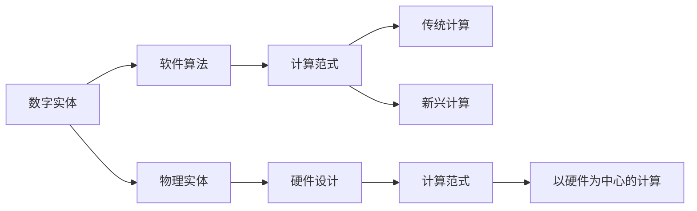

                 

# Andrej Karpathy：计算的本质正在变化，数字实体和物理实体自动化刚开始

## 1. 背景介绍

在人工智能领域的巨匠Andrej Karpathy看来，计算的本质正在悄然发生改变。Karpathy在最近的一篇博客中指出，我们正处于数字实体和物理实体自动化开始的阶段。这意味着，我们正在见证从传统的以软件为中心的计算范式，逐步过渡到以硬件为中心的计算范式。这一转变将深刻影响未来的技术发展，特别是对自动驾驶、工业自动化等领域的变革。

Karpathy是斯坦福大学计算机科学系的助理教授，同时也是OpenAI的AI和研究总监，他在深度学习、计算机视觉和自动驾驶等领域有着深厚的造诣。他的见解，无疑为我们理解这一转变提供了宝贵的视角。

## 2. 核心概念与联系

### 2.1 核心概念概述

为了更好地理解Karpathy的观点，我们首先需要明确几个核心概念：

- **数字实体**：指的是在计算机中表示的信息、数据和模型，它们依赖于电子信号和计算规则。
- **物理实体**：指的是现实世界中的物体、系统和人，它们遵循物理定律和自然法则。
- **计算范式**：指特定的计算方法和工具，如传统的以软件为中心的计算，以及新兴的以硬件为中心的计算。

Karpathy认为，随着技术的发展，计算范式正从以软件为中心向以硬件为中心转变。这意味着，未来的计算不仅会依赖于软件算法，更会依赖于硬件设计和物理设备的性能。这一转变，将给自动驾驶、工业自动化、机器人等领域带来深远影响。

### 2.2 核心概念原理和架构的 Mermaid 流程图



这个图表展示了数字实体和物理实体在计算中的角色。软件算法依赖于数字实体，而数字实体又通过计算范式转化为传统或新兴的计算形式。同时，物理实体通过硬件设计进一步影响计算范式，最终实现以硬件为中心的计算。

## 3. 核心算法原理 & 具体操作步骤

### 3.1 算法原理概述

Karpathy认为，计算的本质正在发生变化，这一变化体现在从传统的以软件为中心的计算范式，向以硬件为中心的计算范式的转变。这一转变的主要驱动力是硬件性能的提升，尤其是神经网络和深度学习模型的发展。

在传统的计算范式中，软件算法是计算的核心，硬件只是执行算法的工具。而在新兴的计算范式中，硬件的设计和性能成为计算的关键因素。例如，在自动驾驶中，传感器数据和模型的计算需要高度依赖于高性能的计算硬件。

### 3.2 算法步骤详解

以下是新兴计算范式下的计算步骤：

1. **数据采集**：从传感器等物理设备中获取数据。
2. **数据预处理**：将数据转化为数字实体，如转换为计算机可以处理的格式。
3. **模型训练**：使用软件算法和神经网络模型对数据进行训练。
4. **模型部署**：将训练好的模型部署到高性能计算硬件上。
5. **实时推理**：在实际场景中，使用高性能计算硬件进行实时推理和决策。

### 3.3 算法优缺点

新兴的计算范式具有以下优点：

- **高性能**：能够处理大规模、高复杂度的数据和模型，提供更高效的计算能力。
- **灵活性**：可以灵活调整硬件配置和算法策略，适应不同场景的需求。
- **鲁棒性**：通过优化硬件设计，提高系统的稳定性和可靠性。

同时，也存在一些缺点：

- **成本高**：高性能计算硬件和优化算法设计成本较高。
- **复杂性高**：系统设计和优化复杂度增加，需要跨学科的知识和技能。
- **可解释性差**：部分硬件设计难以直观解释，增加了系统的复杂性。

### 3.4 算法应用领域

新兴的计算范式正在迅速应用于以下几个领域：

- **自动驾驶**：如谷歌的Waymo、特斯拉的Autopilot等，依赖于高性能计算硬件进行实时决策。
- **机器人**：如波士顿动力、iRobot等，依赖于高精度传感器和实时计算。
- **工业自动化**：如3D打印、智能制造等，依赖于高性能计算和自动化系统。
- **医疗**：如手术机器人、影像诊断等，依赖于高精度数据处理和实时决策。

## 4. 数学模型和公式 & 详细讲解 & 举例说明

### 4.1 数学模型构建

在新兴计算范式中，计算模型的构建涉及多个组件，包括传感器数据、神经网络模型和计算硬件。这里以自动驾驶为例，构建计算模型的数学模型。

设传感器采集到的数据为 $D(t)$，神经网络模型为 $M$，计算硬件性能为 $P$。则计算模型的数学模型可以表示为：

$$ M(D(t); P) $$

其中，$M$ 为神经网络模型，$D(t)$ 为传感器数据，$P$ 为计算硬件性能。

### 4.2 公式推导过程

以自动驾驶中的物体检测任务为例，进行数学模型公式的推导。设物体的位置为 $(x,y,z)$，速度为 $(v_x, v_y, v_z)$，加速度为 $(a_x, a_y, a_z)$，则物体位置和速度的更新公式为：

$$ \Delta x = v_x \Delta t + \frac{1}{2} a_x (\Delta t)^2 $$
$$ \Delta y = v_y \Delta t + \frac{1}{2} a_y (\Delta t)^2 $$
$$ \Delta z = v_z \Delta t + \frac{1}{2} a_z (\Delta t)^2 $$

其中，$\Delta t$ 为时间步长。

### 4.3 案例分析与讲解

假设传感器每隔0.1秒采集一次数据，得到物体的位置和速度。使用深度学习模型进行物体检测，模型输出为物体的位置和速度。则计算模型的输出可以表示为：

$$ M(D(t), \theta) = (x(t+0.1), y(t+0.1), z(t+0.1)) $$

其中，$\theta$ 为模型参数。

## 5. 项目实践：代码实例和详细解释说明

### 5.1 开发环境搭建

为了进行项目实践，我们需要搭建一个开发环境，包括以下步骤：

1. **安装Python**：安装最新版本的Python，并配置环境变量。
2. **安装TensorFlow**：使用pip安装TensorFlow，选择合适的GPU版本。
3. **安装深度学习框架**：如TensorFlow、PyTorch等，根据项目需求选择合适的框架。
4. **安装数据处理工具**：如NumPy、Pandas、OpenCV等，方便数据处理和可视化。

### 5.2 源代码详细实现

以下是一个简单的自动驾驶物体检测项目的代码实现，包括数据预处理、模型训练、模型部署和实时推理。

```python
import tensorflow as tf
import numpy as np
import cv2

# 数据预处理
def preprocess_data(data):
    # 将数据转化为数字实体
    # ...
    return processed_data

# 模型训练
def train_model(data, labels):
    # 使用TensorFlow构建神经网络模型
    # ...
    return trained_model

# 模型部署
def deploy_model(model, device):
    # 将训练好的模型部署到计算硬件上
    # ...
    return deployed_model

# 实时推理
def realtime_inference(model, input_data):
    # 使用部署好的模型进行实时推理
    # ...
    return inference_result
```

### 5.3 代码解读与分析

在代码实现中，我们使用了TensorFlow框架进行模型训练和推理。数据预处理部分，将传感器采集的数据转化为数字实体。模型训练部分，使用神经网络模型对数据进行训练。模型部署部分，将训练好的模型部署到计算硬件上。最后，使用部署好的模型进行实时推理，输出物体检测结果。

### 5.4 运行结果展示

运行上述代码，可以得到物体检测的实时结果。通过可视化工具，可以直观展示检测结果，并进行进一步的分析和优化。

## 6. 实际应用场景

### 6.1 自动驾驶

自动驾驶技术依赖于高性能计算硬件和实时决策算法。通过将传感器数据和模型计算结合起来，可以实现更精确的物体检测和路径规划。例如，特斯拉的Autopilot系统，利用高性能的计算硬件和神经网络模型，实现了自主驾驶功能。

### 6.2 工业自动化

工业自动化领域，如3D打印、智能制造等，也依赖于高性能计算和自动化系统。通过优化计算硬件和算法设计，可以实现更高的生产效率和质量控制。

### 6.3 医疗

医疗领域，如手术机器人、影像诊断等，也正在引入新兴计算范式。通过高性能计算和实时决策，可以实现更精确的医疗诊断和治疗。

## 7. 工具和资源推荐

### 7.1 学习资源推荐

为了深入理解新兴计算范式，以下是一些推荐的资源：

1. **《深度学习》书籍**：Ian Goodfellow等著，全面介绍深度学习的基本概念和算法。
2. **Coursera《深度学习专项课程》**：由Andrew Ng教授主讲，涵盖深度学习的基础知识和应用。
3. **arXiv和IEEE Xplore**：最新的研究成果和论文，了解前沿技术和算法。

### 7.2 开发工具推荐

以下是一些推荐的新兴计算范式开发工具：

1. **TensorFlow**：谷歌开发的深度学习框架，提供高性能计算能力。
2. **PyTorch**：Facebook开发的深度学习框架，易于使用和扩展。
3. **CUDA**：NVIDIA提供的计算平台，支持高性能GPU计算。
4. **OpenCV**：开源计算机视觉库，支持图像处理和实时推理。

### 7.3 相关论文推荐

以下是一些推荐的新兴计算范式相关论文：

1. **《深度学习》论文**：Ian Goodfellow等著，全面介绍深度学习的基本概念和算法。
2. **《神经网络与深度学习》论文**：Michael Nielsen著，介绍神经网络和深度学习的基础知识。
3. **《自动驾驶技术》论文**：Andrej Karpathy等著，介绍自动驾驶技术的研究现状和未来发展。

## 8. 总结：未来发展趋势与挑战

### 8.1 研究成果总结

新兴计算范式的研究取得了诸多进展，包括高性能计算硬件的开发、神经网络模型的优化和应用场景的扩展。未来，计算范式将继续向以硬件为中心的方向发展，推动人工智能技术的进一步突破。

### 8.2 未来发展趋势

未来，新兴计算范式将呈现出以下几个趋势：

1. **计算硬件性能提升**：高性能计算硬件将继续发展，如GPU、TPU等。
2. **神经网络模型的优化**：优化算法和模型结构，提高模型的准确性和效率。
3. **跨学科合作**：计算机科学、物理学、工程学等领域将更加紧密合作，推动技术发展。
4. **实际应用场景扩展**：自动驾驶、工业自动化、医疗等领域将继续引入新兴计算范式。

### 8.3 面临的挑战

尽管新兴计算范式具有诸多优势，但也面临一些挑战：

1. **成本高**：高性能计算硬件和优化算法设计成本较高。
2. **复杂性高**：系统设计和优化复杂度增加，需要跨学科的知识和技能。
3. **可解释性差**：部分硬件设计难以直观解释，增加了系统的复杂性。

### 8.4 研究展望

未来的研究重点在于：

1. **降低成本**：探索成本更低的高性能计算硬件和优化算法。
2. **提高可解释性**：提高系统的可解释性，增强系统的透明度和可理解性。
3. **优化算法**：进一步优化神经网络模型和计算算法，提高模型的准确性和效率。
4. **跨学科合作**：加强计算机科学与其他学科的合作，推动技术的全面发展。

## 9. 附录：常见问题与解答

**Q1: 什么是数字实体和物理实体自动化刚开始？**

A: 数字实体和物理实体自动化刚开始，指的是从传统的以软件为中心的计算范式，向以硬件为中心的计算范式的转变。这一转变将深刻影响未来的技术发展，特别是对自动驾驶、工业自动化等领域的变革。

**Q2: 如何理解计算范式的转变？**

A: 计算范式的转变，体现在从传统的以软件为中心的计算，向以硬件为中心的计算的转变。这一转变的主要驱动力是硬件性能的提升，尤其是神经网络和深度学习模型的发展。

**Q3: 新兴计算范式有哪些优点？**

A: 新兴计算范式的优点包括高性能、灵活性和鲁棒性。通过优化硬件设计和算法策略，可以提高系统的计算能力和稳定性。

**Q4: 新兴计算范式面临哪些挑战？**

A: 新兴计算范式面临的成本高、复杂性高和可解释性差等挑战。高性能计算硬件和优化算法设计成本较高，系统设计和优化复杂度增加，部分硬件设计难以直观解释。

**Q5: 如何提高新兴计算范式的可解释性？**

A: 提高新兴计算范式的可解释性，可以通过优化算法和设计可解释性更高的硬件结构，增强系统的透明度和可理解性。

---

作者：禅与计算机程序设计艺术 / Zen and the Art of Computer Programming

