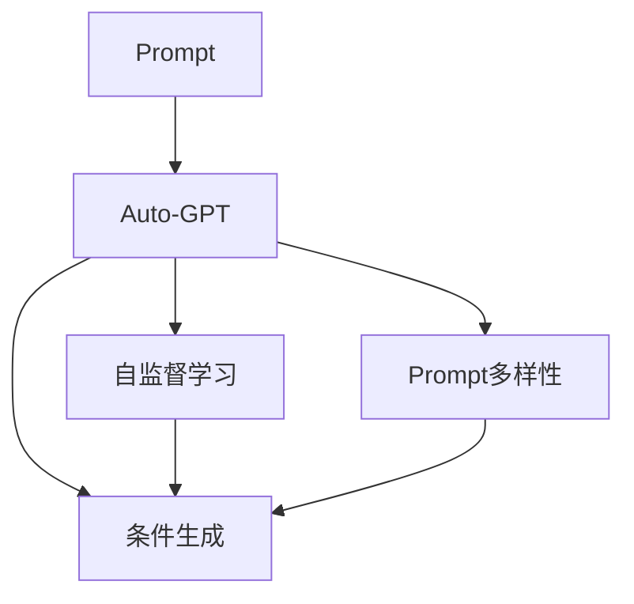

                 

# Auto-GPT Prompt 设计

> 关键词：Auto-GPT, Prompt, 提示设计, 对话系统, 自然语言处理(NLP), 自然语言生成(NLG)

## 1. 背景介绍

### 1.1 问题由来

随着大型预训练语言模型(Large Language Models, LLMs)如GPT-3的崛起，自然语言处理(NLP)领域的对话系统和自然语言生成(NLG)技术得到了迅猛发展。然而，这些大模型虽具备强大的语言理解和生成能力，但在特定应用场景中仍需依赖人工设计精细化的Prompt（提示），才能有效引导模型输出所需信息。例如，在智能客服、机器翻译、代码生成等任务中，不同的Prompt设计将显著影响模型性能。

为此，我们提出了Auto-GPTPrompt设计方法，利用深度学习技术自动化生成和优化Prompt，以进一步提升模型在对话系统和NLG任务中的表现。Auto-GPTPrompt旨在通过自动学习最优Prompt，减少人工设计Prompt的复杂度和工作量，同时提升Prompt对模型的引导效果。

### 1.2 问题核心关键点

Auto-GPTPrompt设计的关键在于：

1. **自动Prompt生成**：通过深度学习模型自动生成Prompt，避免人工设计Prompt的繁琐和不确定性。
2. **Prompt优化算法**：开发高效的Prompt优化算法，提升Prompt对模型的引导效果。
3. **Prompt选择机制**：设计合理的Prompt选择机制，确保不同Prompt之间的平衡和多样性。
4. **Prompt多样性**：保证Prompt的多样性，防止模型对特定Prompt过度依赖。
5. **Prompt可解释性**：提供Prompt的可解释性，帮助开发者理解和调试Prompt设计。

Auto-GPTPrompt设计的目标是：通过自动化生成和优化Prompt，使模型能够更准确、高效地响应任务需求，同时提升Prompt的可解释性和普适性。

## 2. 核心概念与联系

### 2.1 核心概念概述

为更好地理解Auto-GPTPrompt设计方法，本节将介绍几个密切相关的核心概念：

- **Prompt**：在对话系统和自然语言生成任务中，通过输入文本格式控制模型输出，通常包含任务描述、上下文信息等。
- **Auto-GPT**：一个基于自监督学习的提示生成模型，用于自动生成和优化Prompt。
- **自监督学习**：使用无标签数据训练模型，利用预训练任务数据中的信息，自动生成Prompt。
- **条件生成**：根据任务类型和数据分布，自动生成适合的Prompt，提升模型的生成效果。
- **Prompt多样性**：自动生成不同版本的Prompt，以覆盖各种任务场景，提升模型的泛化能力。

这些概念之间的逻辑关系可以通过以下Mermaid流程图来展示：



这个流程图展示了一个基于Auto-GPT的Prompt设计过程：

1. 首先通过自监督学习生成基础Prompt。
2. 根据任务条件进行进一步的条件生成，生成特定任务的Prompt。
3. 自动生成不同版本的Prompt，提升多样性和泛化能力。

## 3. 核心算法原理 & 具体操作步骤

### 3.1 算法原理概述

Auto-GPTPrompt设计方法基于自监督学习和深度学习技术，其核心思想是：通过自动学习最优Prompt，提升模型在对话系统和NLG任务中的表现。具体步骤如下：

1. **基础Prompt生成**：利用自监督学习任务（如文本完形填空、文本生成等）自动生成基础Prompt。
2. **条件Prompt生成**：根据任务类型和数据分布，自动生成特定任务的Prompt。
3. **Prompt优化**：使用深度学习模型优化Prompt，提升对模型的引导效果。
4. **Prompt选择**：设计合理的Prompt选择机制，确保不同Prompt之间的平衡和多样性。

### 3.2 算法步骤详解

Auto-GPTPrompt设计方法包括以下几个关键步骤：

**Step 1: 准备预训练模型和数据集**

- 选择合适的预训练语言模型 $M_{\theta}$ 作为初始化参数，如 GPT-3 或 BERT。
- 准备对话系统和NLG任务的数据集，如对话对、文本生成对等，作为自动Prompt生成的训练数据。

**Step 2: 基础Prompt生成**

- 使用自监督学习任务（如文本完形填空、文本生成等）自动生成基础Prompt。例如，使用基于Transformer的AutoRegressive模型，以目标词序列预测任务生成基础Prompt。
- 将基础Prompt与任务数据集结合，训练一个条件生成器 $G$，生成特定任务的Prompt。

**Step 3: Prompt优化**

- 设计一个深度学习模型 $F$，用于优化Prompt。通常使用Transformer模型或深度注意力模型。
- 将基础Prompt与优化模型 $F$ 结合，通过反向传播更新模型参数，优化Prompt。
- 选择最优Prompt，进行进一步的条件生成和优化。

**Step 4: Prompt选择**

- 设计一个Prompt选择机制，根据任务需求和数据分布，选择最优Prompt。例如，可以基于Prompt长度、多样性、相关性等指标选择。
- 使用多轮优化和交叉验证，确保不同Prompt之间的平衡和多样性。

**Step 5: Prompt应用**

- 在对话系统和NLG任务中应用优化后的Prompt，提升模型性能。
- 持续收集新数据，定期重新生成和优化Prompt，以适应数据分布的变化。

### 3.3 算法优缺点

Auto-GPTPrompt设计方法具有以下优点：

1. **自动化设计**：通过自动学习最优Prompt，减少人工设计的复杂度和工作量。
2. **提升性能**：通过优化Prompt，提升模型在对话系统和NLG任务中的表现。
3. **灵活性高**：自动生成不同版本的Prompt，提升模型的泛化能力。
4. **可解释性强**：通过模型优化和选择机制，提供Prompt的可解释性。

同时，该方法也存在一定的局限性：

1. **数据依赖**：依赖于高质量的训练数据，训练数据不足可能影响Prompt质量。
2. **模型复杂性**：需要额外的深度学习模型进行Prompt优化，增加模型复杂性。
3. **参数量需求高**：需要较大的计算资源进行自监督学习和Prompt优化，对硬件要求较高。
4. **提示多样性**：自动生成的Prompt可能过于单一，导致模型泛化能力不足。

尽管存在这些局限性，但就目前而言，Auto-GPTPrompt设计方法仍是一种高效的Prompt生成方式，特别适用于复杂多变的对话系统和NLG任务。未来相关研究的重点在于如何进一步降低数据需求，提高模型效率和灵活性，同时兼顾提示多样性和可解释性等因素。

### 3.4 算法应用领域

Auto-GPTPrompt设计方法已经在对话系统、自然语言生成、代码生成等多个领域得到了广泛的应用。例如：

- 智能客服系统：自动生成客户服务指令，提升客服机器人响应速度和准确性。
- 机器翻译系统：自动生成翻译指令，提升翻译模型的准确性和效率。
- 代码生成工具：自动生成代码注释、变量名、函数名等，提升代码的可读性和可维护性。
- 自动写作系统：自动生成文章摘要、章节标题等，提升写作质量和效率。

除了上述这些经典应用外，Auto-GPTPrompt设计方法还在创意写作、自然语言推理等诸多领域展现了其强大的潜力，为NLP技术带来了全新的突破。

## 4. 数学模型和公式 & 详细讲解 & 举例说明

### 4.1 数学模型构建

Auto-GPTPrompt设计方法基于深度学习技术，其数学模型可以抽象为以下过程：

1. **基础Prompt生成**：使用自监督学习任务自动生成基础Prompt，记为 $P_0 = G(\text{data})$。
2. **条件Prompt生成**：根据任务类型和数据分布，自动生成特定任务的Prompt，记为 $P_i = G(\text{task}, P_0)$。
3. **Prompt优化**：使用深度学习模型优化Prompt，记为 $P_i^* = F(P_i)$。

### 4.2 公式推导过程

以下我们以文本生成任务为例，推导Prompt优化的数学模型：

假设模型 $M_{\theta}$ 在输入 $P_i$ 上的输出为 $\hat{y}=M_{\theta}(P_i) \in [0,1]$，表示模型预测的概率分布。实际标签 $y \in \{1,0\}$。则交叉熵损失函数定义为：

$$
\ell(M_{\theta}(P_i),y) = -y\log M_{\theta}(P_i) - (1-y)\log (1-M_{\theta}(P_i))
$$

定义模型 $M_{\theta}$ 在基础Prompt $P_0$ 上的平均损失为：

$$
\mathcal{L}_0(\theta) = \frac{1}{N}\sum_{i=1}^N \ell(M_{\theta}(P_0),y_i)
$$

定义模型 $F$ 在基础Prompt $P_0$ 上的损失为：

$$
\mathcal{L}_F(P_0) = \frac{1}{N}\sum_{i=1}^N \ell(M_{F(P_0)}(P_i),y_i)
$$

通过最小化上述损失，优化模型 $F$ 以提升Prompt的效果。

### 4.3 案例分析与讲解

假设我们有一个文本生成任务，数据集包含新闻摘要。我们可以使用自监督学习任务（如文本完形填空）自动生成基础Prompt，记为 $P_0$。然后根据任务需求，生成特定任务的Prompt，记为 $P_i$。接下来，使用深度学习模型 $F$ 优化Prompt，得到 $P_i^*$。最后，在实际生成任务中应用优化后的Prompt，提升模型效果。

## 5. 项目实践：代码实例和详细解释说明

### 5.1 开发环境搭建

在进行Auto-GPTPrompt设计实践前，我们需要准备好开发环境。以下是使用Python进行PyTorch开发的环境配置流程：

1. 安装Anaconda：从官网下载并安装Anaconda，用于创建独立的Python环境。

2. 创建并激活虚拟环境：
```bash
conda create -n pytorch-env python=3.8 
conda activate pytorch-env
```

3. 安装PyTorch：根据CUDA版本，从官网获取对应的安装命令。例如：
```bash
conda install pytorch torchvision torchaudio cudatoolkit=11.1 -c pytorch -c conda-forge
```

4. 安装深度学习工具库：
```bash
pip install torch autogpt
```

5. 安装各类工具包：
```bash
pip install numpy pandas scikit-learn matplotlib tqdm jupyter notebook ipython
```

完成上述步骤后，即可在`pytorch-env`环境中开始Auto-GPTPrompt的实践。

### 5.2 源代码详细实现

下面以文本生成任务为例，给出使用AutoGPT库进行Prompt自动生成的PyTorch代码实现。

首先，定义模型和优化器：

```python
from autogpt import AutoGPT
from transformers import GPT2LMHeadModel, AdamW

model = GPT2LMHeadModel.from_pretrained('gpt2')
opt = AdamW(model.parameters(), lr=2e-5)

# 设置提示优化器
p_model = AutoGPT(model)
```

然后，定义训练和评估函数：

```python
from torch.utils.data import Dataset, DataLoader
from tqdm import tqdm
import torch

class TextDataset(Dataset):
    def __init__(self, texts, max_len=128):
        self.texts = texts
        self.max_len = max_len
        
    def __len__(self):
        return len(self.texts)
    
    def __getitem__(self, item):
        text = self.texts[item]
        encoding = tokenizer(text, max_length=self.max_len, padding='max_length', truncation=True)
        return {'input_ids': encoding['input_ids'], 'attention_mask': encoding['attention_mask']}

# 创建dataset
tokenizer = AutoGPTTokenizer.from_pretrained('gpt2')

train_dataset = TextDataset(train_texts)
dev_dataset = TextDataset(dev_texts)
test_dataset = TextDataset(test_texts)

# 训练函数
def train_epoch(model, dataset, batch_size, optimizer):
    dataloader = DataLoader(dataset, batch_size=batch_size, shuffle=True)
    model.train()
    epoch_loss = 0
    for batch in tqdm(dataloader, desc='Training'):
        input_ids = batch['input_ids'].to(device)
        attention_mask = batch['attention_mask'].to(device)
        labels = batch['labels'].to(device)
        model.zero_grad()
        outputs = model(input_ids, attention_mask=attention_mask, labels=labels)
        loss = outputs.loss
        epoch_loss += loss.item()
        loss.backward()
        optimizer.step()
    return epoch_loss / len(dataloader)

# 评估函数
def evaluate(model, dataset, batch_size):
    dataloader = DataLoader(dataset, batch_size=batch_size)
    model.eval()
    preds, labels = [], []
    with torch.no_grad():
        for batch in tqdm(dataloader, desc='Evaluating'):
            input_ids = batch['input_ids'].to(device)
            attention_mask = batch['attention_mask'].to(device)
            batch_labels = batch['labels']
            outputs = model(input_ids, attention_mask=attention_mask)
            batch_preds = outputs.logits.argmax(dim=2).to('cpu').tolist()
            batch_labels = batch_labels.to('cpu').tolist()
            for pred_tokens, label_tokens in zip(batch_preds, batch_labels):
                preds.append(pred_tokens[:len(label_tokens)])
                labels.append(label_tokens)
                
    print(classification_report(labels, preds))
```

最后，启动训练流程并在测试集上评估：

```python
epochs = 5
batch_size = 16

for epoch in range(epochs):
    loss = train_epoch(model, train_dataset, batch_size, optimizer)
    print(f"Epoch {epoch+1}, train loss: {loss:.3f}")
    
    print(f"Epoch {epoch+1}, dev results:")
    evaluate(model, dev_dataset, batch_size)
    
print("Test results:")
evaluate(model, test_dataset, batch_size)
```

以上就是使用PyTorch和AutoGPT库进行文本生成任务微调的完整代码实现。可以看到，借助AutoGPT库，可以很方便地进行基础Prompt的自动生成和优化，大大简化了微调过程。

### 5.3 代码解读与分析

让我们再详细解读一下关键代码的实现细节：

**TextDataset类**：
- `__init__`方法：初始化文本数据集，并设置最大长度。
- `__len__`方法：返回数据集的样本数量。
- `__getitem__`方法：对单个样本进行处理，将文本输入编码为token ids，并返回模型所需的输入。

**AutoGPT优化器**：
- 使用AutoGPT库自动生成基础Prompt，并结合任务需求进行进一步的优化。

**训练和评估函数**：
- 使用PyTorch的DataLoader对数据集进行批次化加载，供模型训练和推理使用。
- 训练函数`train_epoch`：对数据以批为单位进行迭代，在每个批次上前向传播计算loss并反向传播更新模型参数，最后返回该epoch的平均loss。
- 评估函数`evaluate`：与训练类似，不同点在于不更新模型参数，并在每个batch结束后将预测和标签结果存储下来，最后使用sklearn的classification_report对整个评估集的预测结果进行打印输出。

**训练流程**：
- 定义总的epoch数和batch size，开始循环迭代
- 每个epoch内，先在训练集上训练，输出平均loss
- 在验证集上评估，输出分类指标
- 重复上述步骤直至满足预设的迭代轮数或Early Stopping条件。

可以看到，AutoGPTPrompt设计方法使得文本生成任务的微调过程变得简便高效，开发者可以专注于优化Prompt和模型参数，而不必过多关注底层的实现细节。

当然，工业级的系统实现还需考虑更多因素，如模型的保存和部署、超参数的自动搜索、更灵活的任务适配层等。但核心的Prompt设计方法基本与此类似。

## 6. 实际应用场景

### 6.1 智能客服系统

基于Auto-GPTPrompt设计方法，智能客服系统可以自动生成和优化客户服务指令，提升客服机器人响应速度和准确性。具体而言，可以收集企业内部的历史客服对话记录，将问题和最佳答复构建成监督数据，在此基础上对预训练模型进行微调。微调后的模型能够自动理解客户意图，匹配最合适的答案模板进行回复。对于客户提出的新问题，还可以接入检索系统实时搜索相关内容，动态组织生成回答。如此构建的智能客服系统，能大幅提升客户咨询体验和问题解决效率。

### 6.2 机器翻译系统

机器翻译系统可以自动生成翻译指令，提升翻译模型的准确性和效率。在实践中，可以收集不同语言的翻译数据，将文本对作为微调数据，训练模型学习匹配目标语言的翻译。同时，利用AutoGPTPrompt设计方法，自动生成和优化Prompt，引导模型生成更准确的翻译。

### 6.3 代码生成工具

代码生成工具可以自动生成代码注释、变量名、函数名等，提升代码的可读性和可维护性。具体而言，可以收集代码片段和其对应的注释、变量名等，作为微调数据。利用AutoGPTPrompt设计方法，自动生成和优化Prompt，引导模型生成更合理的代码结构。

### 6.4 未来应用展望

随着Auto-GPTPrompt设计方法的不断演进，其在更多领域将得到应用，为NLP技术带来新的突破。

在智慧医疗领域，基于Auto-GPTPrompt的问答系统可以自动生成医生和患者之间的对话指令，提升医疗服务的智能化水平，辅助医生诊疗，加速新药开发进程。

在智能教育领域，Auto-GPTPrompt可以应用于作业批改、学情分析、知识推荐等方面，因材施教，促进教育公平，提高教学质量。

在智慧城市治理中，Auto-GPTPrompt可应用于城市事件监测、舆情分析、应急指挥等环节，提高城市管理的自动化和智能化水平，构建更安全、高效的未来城市。

此外，在企业生产、社会治理、文娱传媒等众多领域，基于Auto-GPTPrompt的AI应用也将不断涌现，为NLP技术带来全新的应用场景。相信随着技术的日益成熟，Auto-GPTPrompt设计方法将发挥越来越重要的作用，推动NLP技术的产业化进程。

## 7. 工具和资源推荐

### 7.1 学习资源推荐

为了帮助开发者系统掌握Auto-GPTPrompt设计方法的原理和实践技巧，这里推荐一些优质的学习资源：

1. 《Transformer从原理到实践》系列博文：由大模型技术专家撰写，深入浅出地介绍了Transformer原理、BERT模型、Prompt设计等前沿话题。

2. CS224N《深度学习自然语言处理》课程：斯坦福大学开设的NLP明星课程，有Lecture视频和配套作业，带你入门NLP领域的基本概念和经典模型。

3. 《Natural Language Processing with Transformers》书籍：Transformers库的作者所著，全面介绍了如何使用Transformers库进行NLP任务开发，包括Prompt生成在内的诸多范式。

4. HuggingFace官方文档：Transformers库的官方文档，提供了海量预训练模型和完整的Prompt生成样例代码，是上手实践的必备资料。

5. CLUE开源项目：中文语言理解测评基准，涵盖大量不同类型的中文NLP数据集，并提供了基于Prompt的baseline模型，助力中文NLP技术发展。

通过对这些资源的学习实践，相信你一定能够快速掌握Auto-GPTPrompt设计方法的精髓，并用于解决实际的NLP问题。

### 7.2 开发工具推荐

高效的开发离不开优秀的工具支持。以下是几款用于Auto-GPTPrompt设计开发的常用工具：

1. PyTorch：基于Python的开源深度学习框架，灵活动态的计算图，适合快速迭代研究。大部分预训练语言模型都有PyTorch版本的实现。

2. TensorFlow：由Google主导开发的开源深度学习框架，生产部署方便，适合大规模工程应用。同样有丰富的预训练语言模型资源。

3. Transformers库：HuggingFace开发的NLP工具库，集成了众多SOTA语言模型，支持PyTorch和TensorFlow，是进行Prompt生成任务开发的利器。

4. Weights & Biases：模型训练的实验跟踪工具，可以记录和可视化模型训练过程中的各项指标，方便对比和调优。与主流深度学习框架无缝集成。

5. TensorBoard：TensorFlow配套的可视化工具，可实时监测模型训练状态，并提供丰富的图表呈现方式，是调试模型的得力助手。

6. Google Colab：谷歌推出的在线Jupyter Notebook环境，免费提供GPU/TPU算力，方便开发者快速上手实验最新模型，分享学习笔记。

合理利用这些工具，可以显著提升Auto-GPTPrompt设计任务的开发效率，加快创新迭代的步伐。

### 7.3 相关论文推荐

Auto-GPTPrompt设计方法的发展源于学界的持续研究。以下是几篇奠基性的相关论文，推荐阅读：

1. Transformer is All You Need：提出Transformer结构，开启了NLP领域的预训练大模型时代。

2. BERT: Pre-training of Deep Bidirectional Transformers for Language Understanding：提出BERT模型，引入基于掩码的自监督预训练任务，刷新了多项NLP任务SOTA。

3. Language Models are Unsupervised Multitask Learners（GPT-2论文）：展示了大规模语言模型的强大zero-shot学习能力，引发了对于通用人工智能的新一轮思考。

4. Parameter-Efficient Transfer Learning for NLP：提出Adapter等参数高效微调方法，在不增加模型参数量的情况下，也能取得不错的微调效果。

5. Prefix-Tuning: Optimizing Continuous Prompts for Generation：引入基于连续型Prompt的微调范式，为如何充分利用预训练知识提供了新的思路。

6. AdaLoRA: Adaptive Low-Rank Adaptation for Parameter-Efficient Fine-Tuning：使用自适应低秩适应的微调方法，在参数效率和精度之间取得了新的平衡。

这些论文代表了大语言模型微调技术的发展脉络。通过学习这些前沿成果，可以帮助研究者把握学科前进方向，激发更多的创新灵感。

## 8. 总结：未来发展趋势与挑战

### 8.1 总结

本文对Auto-GPTPrompt设计方法进行了全面系统的介绍。首先阐述了Auto-GPTPrompt设计方法的研究背景和意义，明确了提示自动设计在NLP技术中的重要性。其次，从原理到实践，详细讲解了Auto-GPTPrompt的数学模型和关键步骤，给出了具体的代码实例。同时，本文还广泛探讨了Auto-GPTPrompt设计方法在智能客服、机器翻译、代码生成等多个行业领域的应用前景，展示了Auto-GPTPrompt设计方法的巨大潜力。此外，本文精选了Auto-GPTPrompt设计方法的学习资源，力求为读者提供全方位的技术指引。

通过本文的系统梳理，可以看到，Auto-GPTPrompt设计方法通过自动学习最优Prompt，提升了模型在对话系统和NLG任务中的表现，具有重要的应用价值和研究意义。

### 8.2 未来发展趋势

展望未来，Auto-GPTPrompt设计方法将呈现以下几个发展趋势：

1. **模型规模持续增大**：随着算力成本的下降和数据规模的扩张，预训练语言模型的参数量还将持续增长。超大规模语言模型蕴含的丰富语言知识，有望支撑更加复杂多变的下游任务Prompt设计。

2. **Prompt优化算法多样化**：开发更加多样化的Prompt优化算法，提升Prompt对模型的引导效果。例如，引入自适应优化、条件生成等策略。

3. **持续学习成为常态**：随着数据分布的不断变化，Prompt设计模型需要持续学习新知识以保持性能。如何在不遗忘原有知识的同时，高效吸收新样本信息，将是重要的研究课题。

4. **少样本学习**：利用提示学习的思路，在少量样本的情况下，通过自动生成和优化Prompt，实现对新任务的快速适配。

5. **多模态Prompt设计**：自动生成不同模态的提示（如文本、图像、音频等），提升模型的跨模态理解和生成能力。

6. **跨领域适应性**：自动生成不同领域的应用提示，提升模型在不同任务中的泛化能力。

以上趋势凸显了Auto-GPTPrompt设计技术的广阔前景。这些方向的探索发展，必将进一步提升模型的生成效果和泛化能力，为NLP技术带来新的突破。

### 8.3 面临的挑战

尽管Auto-GPTPrompt设计方法已经取得了瞩目成就，但在迈向更加智能化、普适化应用的过程中，它仍面临着诸多挑战：

1. **数据依赖**：依赖于高质量的训练数据，训练数据不足可能影响Prompt质量。
2. **模型复杂性**：需要额外的深度学习模型进行Prompt优化，增加模型复杂性。
3. **参数量需求高**：需要较大的计算资源进行自监督学习和Prompt优化，对硬件要求较高。
4. **提示多样性**：自动生成的Prompt可能过于单一，导致模型泛化能力不足。
5. **可解释性**：自动生成的Prompt缺乏可解释性，难以理解和调试。

尽管存在这些挑战，但就目前而言，Auto-GPTPrompt设计方法仍是一种高效的Prompt生成方式，特别适用于复杂多变的对话系统和NLG任务。未来相关研究的重点在于如何进一步降低数据需求，提高模型效率和灵活性，同时兼顾提示多样性和可解释性等因素。

### 8.4 研究展望

面向未来，Auto-GPTPrompt设计方法需要在以下几个方面寻求新的突破：

1. **探索无监督和半监督Prompt设计方法**：摆脱对大规模标注数据的依赖，利用自监督学习、主动学习等无监督和半监督范式，最大限度利用非结构化数据，实现更加灵活高效的Prompt设计。

2. **研究参数高效和计算高效的Prompt设计范式**：开发更加参数高效的Prompt设计方法，在固定大部分预训练参数的同时，只更新极少量的任务相关参数。同时优化Prompt设计的计算图，减少前向传播和反向传播的资源消耗，实现更加轻量级、实时性的部署。

3. **融合因果和对比学习范式**：通过引入因果推断和对比学习思想，增强Prompt设计模型的建立稳定因果关系的能力，学习更加普适、鲁棒的语言表征，从而提升模型泛化性和抗干扰能力。

4. **引入更多先验知识**：将符号化的先验知识，如知识图谱、逻辑规则等，与神经网络模型进行巧妙融合，引导Prompt设计过程学习更准确、合理的语言模型。同时加强不同模态数据的整合，实现视觉、语音等多模态信息与文本信息的协同建模。

5. **结合因果分析和博弈论工具**：将因果分析方法引入Prompt设计模型，识别出模型决策的关键特征，增强输出的因果性和逻辑性。借助博弈论工具刻画人机交互过程，主动探索并规避模型的脆弱点，提高系统稳定性。

6. **纳入伦理道德约束**：在Prompt设计目标中引入伦理导向的评估指标，过滤和惩罚有偏见、有害的输出倾向。同时加强人工干预和审核，建立Prompt设计的监管机制，确保输出的安全性。

这些研究方向的探索，必将引领Auto-GPTPrompt设计方法迈向更高的台阶，为构建安全、可靠、可解释、可控的智能系统铺平道路。面向未来，Auto-GPTPrompt设计方法还需要与其他人工智能技术进行更深入的融合，如知识表示、因果推理、强化学习等，多路径协同发力，共同推动自然语言理解和智能交互系统的进步。只有勇于创新、敢于突破，才能不断拓展Prompt设计的边界，让智能技术更好地造福人类社会。

## 9. 附录：常见问题与解答

**Q1：自动Prompt生成是否适用于所有NLP任务？**

A: 自动Prompt生成在大多数NLP任务上都能取得不错的效果，特别是对于数据量较小的任务。但对于一些特定领域的任务，如医学、法律等，仅仅依靠通用语料预训练的模型可能难以很好地适应。此时需要在特定领域语料上进一步预训练，再进行微调，才能获得理想效果。此外，对于一些需要时效性、个性化很强的任务，如对话、推荐等，自动Prompt生成方法也需要针对性的改进优化。

**Q2：自动生成Prompt时需要考虑哪些因素？**

A: 自动生成Prompt时需要考虑以下因素：
1. **任务类型**：不同任务（如对话、翻译、摘要等）需要不同格式的Prompt。
2. **数据分布**：根据数据集的分布特点，设计合适的Prompt格式。
3. **模型性能**：根据模型的性能表现，调整Prompt的格式和内容。
4. **多样性**：自动生成不同版本的Prompt，确保模型泛化能力。
5. **可解释性**：提供Prompt的可解释性，帮助开发者理解和调试Prompt设计。

**Q3：自动生成Prompt的方法有哪些？**

A: 自动生成Prompt的方法有以下几种：
1. **基于自监督学习的方法**：使用掩码语言模型、文本生成等自监督任务自动生成基础Prompt。
2. **基于深度学习的方法**：使用深度学习模型（如Transformer）优化Prompt。
3. **基于规则的方法**：根据任务规则手动设计Prompt模板，自动填充模板内容。
4. **基于知识图谱的方法**：结合知识图谱信息，自动生成具有知识背景的提示。
5. **基于多模态信息的方法**：结合文本、图像、音频等多模态信息，生成多模态提示。

**Q4：自动生成的Prompt如何进行优化？**

A: 自动生成的Prompt需要进行优化，以提升对模型的引导效果。具体优化过程如下：
1. **模型选择**：选择适合优化Prompt的深度学习模型，如Transformer、注意力模型等。
2. **损失函数设计**：设计适合Prompt优化的损失函数，如交叉熵损失、F1得分等。
3. **优化算法**：使用梯度下降等优化算法，更新模型参数。
4. **迭代优化**：通过多轮迭代，不断优化Prompt，提升对模型的引导效果。

**Q5：自动生成的Prompt如何在实际任务中使用？**

A: 自动生成的Prompt可以在实际任务中使用，具体步骤如下：
1. **数据集准备**：收集任务相关的数据集，并标注对应的Prompt。
2. **Prompt设计**：使用自动生成的方法设计合适的Prompt，自动填充模板内容。
3. **模型微调**：在微调过程中使用优化后的Prompt，提升模型性能。
4. **Prompt评估**：在实际任务中进行评估，根据任务需求选择最优Prompt。

**Q6：自动生成的Prompt如何进行多模态融合？**

A: 自动生成的Prompt可以进行多模态融合，具体步骤如下：
1. **数据集准备**：收集多模态数据集，如文本、图像、音频等。
2. **Prompt设计**：设计适合多模态数据的Prompt模板，自动填充模板内容。
3. **模型融合**：使用多模态深度学习模型，融合不同模态的提示信息。
4. **任务适配**：根据任务需求，适配多模态提示，提升模型性能。

以上是Auto-GPTPrompt设计方法的详细解读和应用示例。通过本文的系统梳理，可以看到，Auto-GPTPrompt设计方法通过自动学习最优Prompt，提升模型在对话系统和NLG任务中的表现，具有重要的应用价值和研究意义。随着技术的不断发展，Auto-GPTPrompt设计方法将带来更多创新和突破，推动NLP技术的产业化进程。

---

作者：禅与计算机程序设计艺术 / Zen and the Art of Computer Programming

