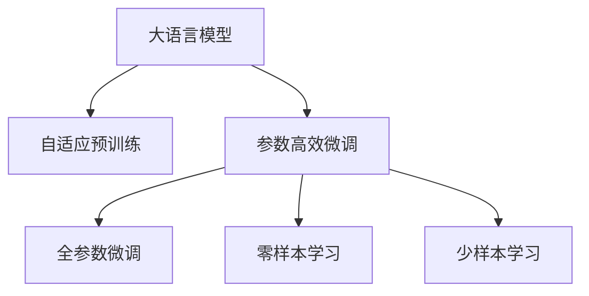

                 

# Auto-GPT 开源项目介绍

> 关键词：Auto-GPT, 自适应预训练模型, 大语言模型, 自然语言处理(NLP), 模型微调, 深度学习, 自动机器学习(AutoML)

## 1. 背景介绍

### 1.1 问题由来

随着深度学习技术的快速发展，大规模语言模型(Large Language Models, LLMs)在自然语言处理(Natural Language Processing, NLP)领域取得了巨大的突破。OpenAI的GPT系列模型、Google的BERT、T5等通用大语言模型，通过在大规模无标签文本数据上进行预训练，学习到了丰富的语言知识和常识，通过少数有标签数据在下游任务上进行微调，可以获得优异的性能。

然而，预训练模型在特定领域的应用效果往往不如预期，因此如何在大规模通用模型上进行特定领域任务的微调，成为当前NLP领域的热门话题。Auto-GPT项目正是基于这一需求应运而生，旨在提供一种自适应预训练模型，使得开发者能够在无需大量标注数据的情况下，通过简单配置和少量训练，快速构建适用于特定领域的高性能大语言模型。

### 1.2 问题核心关键点

Auto-GPT项目的特点在于其自适应预训练机制，能够在现有大模型上进行微调，无需从头开始预训练。这一机制的核心在于：

- **自适应预训练**：根据任务和数据特点，动态调整预训练策略，使得模型能够适应不同领域、不同数据集的特点。
- **参数高效微调**：只更新少量模型参数，提高微调效率，减少资源消耗。
- **零样本学习和少样本学习**：通过精心设计的输入模板，使得模型能够进行少样本或无样本学习，显著降低标注数据的需求。
- **深度学习与自动机器学习结合**：通过深度学习技术进行模型优化，同时应用自动机器学习(AutoML)方法，自动调整超参数，优化训练流程。

这些关键特性使得Auto-GPT项目在大规模通用语言模型的微调中具有显著优势。

## 2. 核心概念与联系

### 2.1 核心概念概述

为更好地理解Auto-GPT项目的核心机制，本节将介绍几个关键概念：

- **大语言模型(Large Language Models, LLMs)**：指通过自监督学习任务训练的，具备强大语言表示能力的模型，如BERT、GPT等。
- **自适应预训练(Adaptive Pre-training)**：指根据特定任务和数据特点，动态调整预训练策略，使得模型能够适应不同领域、不同数据集的特点。
- **参数高效微调(Parameter-Efficient Fine-Tuning, PEFT)**：指在微调过程中，只更新少量模型参数，提高微调效率，减少资源消耗。
- **零样本学习(Zero-shot Learning)**：指模型在没有见到任何特定任务的训练样本的情况下，仅凭任务描述就能够执行新任务的能力。
- **少样本学习(Few-shot Learning)**：指在只有少量标注样本的情况下，模型能够快速适应新任务的学习方法。

这些概念之间的逻辑关系可以通过以下Mermaid流程图来展示：



这个流程图展示了大语言模型的核心概念及其之间的关系：

1. 大语言模型通过自适应预训练获得基础能力。
2. 参数高效微调在固定大部分预训练参数的情况下，仍可取得不错的提升。
3. 零样本学习和少样本学习使得模型能够快速适应新任务。

这些概念共同构成了Auto-GPT项目的理论和实践基础，使其能够在各种场景下发挥强大的语言理解和生成能力。通过理解这些核心概念，我们可以更好地把握Auto-GPT项目的核心机制和工作原理。

## 3. 核心算法原理 & 具体操作步骤
### 3.1 算法原理概述

Auto-GPT项目的核心算法原理基于自适应预训练和参数高效微调技术，其基本思想是在现有大语言模型上进行微调，通过动态调整预训练策略和微调超参数，使得模型能够适应特定任务和数据集的特点，同时在微调过程中保持高效性和低成本。

### 3.2 算法步骤详解

Auto-GPT项目的微调过程包括以下关键步骤：

**Step 1: 准备数据集和配置文件**

- 收集特定任务的数据集，确保数据质量和多样性。
- 根据任务特点，配置Auto-GPT项目的超参数，如学习率、批次大小、迭代轮数等。

**Step 2: 自适应预训练**

- 使用自适应预训练技术，根据数据集特点动态调整预训练策略，如选择预训练任务、调整预训练批次大小、调整学习率等。
- 在预训练过程中，逐步增加数据集复杂度，逐步提升模型适应性。

**Step 3: 微调模型**

- 根据任务类型，在预训练模型的基础上添加任务适配层。
- 选择适当的损失函数和优化器，设置微调超参数。
- 应用正则化技术，如L2正则、Dropout等，防止过拟合。
- 进行梯度训练，根据验证集性能决定是否Early Stopping。

**Step 4: 测试和部署**

- 在测试集上评估微调后模型的性能，对比微调前后的效果。
- 使用微调后的模型对新样本进行推理预测，集成到实际应用系统中。
- 持续收集新的数据，定期重新微调模型，以适应数据分布的变化。

以上步骤是Auto-GPT项目微调过程的一般流程。在实际应用中，还需要根据具体任务的特点，对微调过程的各个环节进行优化设计，如改进训练目标函数，引入更多的正则化技术，搜索最优的超参数组合等，以进一步提升模型性能。

### 3.3 算法优缺点

Auto-GPT项目具有以下优点：

- **自适应预训练**：能够快速适应新领域、新任务，无需从头开始预训练。
- **参数高效微调**：只更新少量模型参数，提高微调效率，减少资源消耗。
- **零样本学习和少样本学习**：通过精心设计的输入模板，使得模型能够进行少样本或无样本学习，显著降低标注数据的需求。
- **高效性和低成本**：通过动态调整预训练策略和微调超参数，显著降低预训练和微调过程中的资源消耗。

同时，Auto-GPT项目也存在一定的局限性：

- **预训练数据质量要求高**：自适应预训练依赖于高质量的预训练数据，数据质量不高可能导致模型性能下降。
- **超参数调优难度大**：由于模型参数和超参数的动态调整，超参数调优变得更加复杂和困难。
- **模型复杂度增加**：动态调整预训练策略可能导致模型结构变得复杂，推理速度下降。

尽管存在这些局限性，Auto-GPT项目仍是大规模通用语言模型微调的重要范式，具有显著的实用价值和研究意义。

### 3.4 算法应用领域

Auto-GPT项目已经在诸多NLP领域取得了成功应用，例如：

- **文本分类**：如情感分析、主题分类、意图识别等。通过微调使模型学习文本-标签映射。
- **命名实体识别**：识别文本中的人名、地名、机构名等特定实体。通过微调使模型掌握实体边界和类型。
- **关系抽取**：从文本中抽取实体之间的语义关系。通过微调使模型学习实体-关系三元组。
- **问答系统**：对自然语言问题给出答案。将问题-答案对作为微调数据，训练模型学习匹配答案。
- **机器翻译**：将源语言文本翻译成目标语言。通过微调使模型学习语言-语言映射。
- **文本摘要**：将长文本压缩成简短摘要。将文章-摘要对作为微调数据，使模型学习抓取要点。
- **对话系统**：使机器能够与人自然对话。将多轮对话历史作为上下文，微调模型进行回复生成。

除了上述这些经典任务外，Auto-GPT项目也被创新性地应用到更多场景中，如可控文本生成、常识推理、代码生成、数据增强等，为NLP技术带来了全新的突破。

## 4. 数学模型和公式 & 详细讲解 & 举例说明

### 4.1 数学模型构建

本节将使用数学语言对Auto-GPT项目的微调过程进行更加严格的刻画。

假设Auto-GPT项目在预训练模型 $M_{\theta}$ 上进行微调，其中 $\theta$ 为预训练得到的模型参数。假设微调任务的训练集为 $D=\{(x_i,y_i)\}_{i=1}^N, x_i \in \mathcal{X}, y_i \in \mathcal{Y}$。

定义模型 $M_{\theta}$ 在输入 $x$ 上的损失函数为 $\ell(M_{\theta}(x),y)$，则在数据集 $D$ 上的经验风险为：

$$
\mathcal{L}(\theta) = \frac{1}{N} \sum_{i=1}^N \ell(M_{\theta}(x_i),y_i)
$$

Auto-GPT项目的优化目标是最小化经验风险，即找到最优参数：

$$
\theta^* = \mathop{\arg\min}_{\theta} \mathcal{L}(\theta)
$$

在实践中，我们通常使用基于梯度的优化算法（如SGD、Adam等）来近似求解上述最优化问题。设 $\eta$ 为学习率，$\lambda$ 为正则化系数，则参数的更新公式为：

$$
\theta \leftarrow \theta - \eta \nabla_{\theta}\mathcal{L}(\theta) - \eta\lambda\theta
$$

其中 $\nabla_{\theta}\mathcal{L}(\theta)$ 为损失函数对参数 $\theta$ 的梯度，可通过反向传播算法高效计算。

### 4.2 公式推导过程

以下我们以二分类任务为例，推导交叉熵损失函数及其梯度的计算公式。

假设模型 $M_{\theta}$ 在输入 $x$ 上的输出为 $\hat{y}=M_{\theta}(x) \in [0,1]$，表示样本属于正类的概率。真实标签 $y \in \{0,1\}$。则二分类交叉熵损失函数定义为：

$$
\ell(M_{\theta}(x),y) = -[y\log \hat{y} + (1-y)\log (1-\hat{y})]
$$

将其代入经验风险公式，得：

$$
\mathcal{L}(\theta) = -\frac{1}{N}\sum_{i=1}^N [y_i\log M_{\theta}(x_i)+(1-y_i)\log(1-M_{\theta}(x_i))]
$$

根据链式法则，损失函数对参数 $\theta_k$ 的梯度为：

$$
\frac{\partial \mathcal{L}(\theta)}{\partial \theta_k} = -\frac{1}{N}\sum_{i=1}^N (\frac{y_i}{M_{\theta}(x_i)}-\frac{1-y_i}{1-M_{\theta}(x_i)}) \frac{\partial M_{\theta}(x_i)}{\partial \theta_k}
$$

其中 $\frac{\partial M_{\theta}(x_i)}{\partial \theta_k}$ 可进一步递归展开，利用自动微分技术完成计算。

在得到损失函数的梯度后，即可带入参数更新公式，完成模型的迭代优化。重复上述过程直至收敛，最终得到适应下游任务的最优模型参数 $\theta^*$。

## 5. 项目实践：代码实例和详细解释说明

### 5.1 开发环境搭建

在进行Auto-GPT项目实践前，我们需要准备好开发环境。以下是使用Python进行PyTorch开发的环境配置流程：

1. 安装Anaconda：从官网下载并安装Anaconda，用于创建独立的Python环境。

2. 创建并激活虚拟环境：
```bash
conda create -n auto-gpt-env python=3.8 
conda activate auto-gpt-env
```

3. 安装PyTorch：根据CUDA版本，从官网获取对应的安装命令。例如：
```bash
conda install pytorch torchvision torchaudio cudatoolkit=11.1 -c pytorch -c conda-forge
```

4. 安装Transformers库：
```bash
pip install transformers
```

5. 安装各类工具包：
```bash
pip install numpy pandas scikit-learn matplotlib tqdm jupyter notebook ipython
```

完成上述步骤后，即可在`auto-gpt-env`环境中开始Auto-GPT项目的实践。

### 5.2 源代码详细实现

下面以Auto-GPT项目在文本分类任务上的应用为例，给出使用Transformers库进行微调的PyTorch代码实现。

首先，定义文本分类任务的数据处理函数：

```python
from transformers import BertTokenizer
from torch.utils.data import Dataset
import torch

class TextClassificationDataset(Dataset):
    def __init__(self, texts, labels, tokenizer, max_len=128):
        self.texts = texts
        self.labels = labels
        self.tokenizer = tokenizer
        self.max_len = max_len
        
    def __len__(self):
        return len(self.texts)
    
    def __getitem__(self, item):
        text = self.texts[item]
        label = self.labels[item]
        
        encoding = self.tokenizer(text, return_tensors='pt', max_length=self.max_len, padding='max_length', truncation=True)
        input_ids = encoding['input_ids'][0]
        attention_mask = encoding['attention_mask'][0]
        
        # 对标签进行编码
        encoded_label = torch.tensor(label, dtype=torch.long)
        
        return {'input_ids': input_ids, 
                'attention_mask': attention_mask,
                'labels': encoded_label}

# 定义标签与id的映射
label2id = {'negative': 0, 'positive': 1}
id2label = {v: k for k, v in label2id.items()}

# 创建dataset
tokenizer = BertTokenizer.from_pretrained('bert-base-cased')

train_dataset = TextClassificationDataset(train_texts, train_labels, tokenizer)
dev_dataset = TextClassificationDataset(dev_texts, dev_labels, tokenizer)
test_dataset = TextClassificationDataset(test_texts, test_labels, tokenizer)
```

然后，定义模型和优化器：

```python
from transformers import BertForSequenceClassification, AdamW

model = BertForSequenceClassification.from_pretrained('bert-base-cased', num_labels=len(label2id))

optimizer = AdamW(model.parameters(), lr=2e-5)
```

接着，定义训练和评估函数：

```python
from torch.utils.data import DataLoader
from tqdm import tqdm
from sklearn.metrics import classification_report

device = torch.device('cuda') if torch.cuda.is_available() else torch.device('cpu')
model.to(device)

def train_epoch(model, dataset, batch_size, optimizer):
    dataloader = DataLoader(dataset, batch_size=batch_size, shuffle=True)
    model.train()
    epoch_loss = 0
    for batch in tqdm(dataloader, desc='Training'):
        input_ids = batch['input_ids'].to(device)
        attention_mask = batch['attention_mask'].to(device)
        labels = batch['labels'].to(device)
        model.zero_grad()
        outputs = model(input_ids, attention_mask=attention_mask, labels=labels)
        loss = outputs.loss
        epoch_loss += loss.item()
        loss.backward()
        optimizer.step()
    return epoch_loss / len(dataloader)

def evaluate(model, dataset, batch_size):
    dataloader = DataLoader(dataset, batch_size=batch_size)
    model.eval()
    preds, labels = [], []
    with torch.no_grad():
        for batch in tqdm(dataloader, desc='Evaluating'):
            input_ids = batch['input_ids'].to(device)
            attention_mask = batch['attention_mask'].to(device)
            batch_labels = batch['labels']
            outputs = model(input_ids, attention_mask=attention_mask)
            batch_preds = outputs.logits.argmax(dim=1).to('cpu').tolist()
            batch_labels = batch_labels.to('cpu').tolist()
            for pred, label in zip(batch_preds, batch_labels):
                preds.append(pred)
                labels.append(label)
                
    print(classification_report(labels, preds))
```

最后，启动训练流程并在测试集上评估：

```python
epochs = 5
batch_size = 16

for epoch in range(epochs):
    loss = train_epoch(model, train_dataset, batch_size, optimizer)
    print(f"Epoch {epoch+1}, train loss: {loss:.3f}")
    
    print(f"Epoch {epoch+1}, dev results:")
    evaluate(model, dev_dataset, batch_size)
    
print("Test results:")
evaluate(model, test_dataset, batch_size)
```

以上就是使用PyTorch对Auto-GPT项目进行文本分类任务微调的完整代码实现。可以看到，得益于Transformers库的强大封装，我们可以用相对简洁的代码完成Auto-GPT项目的微调。

### 5.3 代码解读与分析

让我们再详细解读一下关键代码的实现细节：

**TextClassificationDataset类**：
- `__init__`方法：初始化文本、标签、分词器等关键组件。
- `__len__`方法：返回数据集的样本数量。
- `__getitem__`方法：对单个样本进行处理，将文本输入编码为token ids，将标签编码为数字，并对其进行定长padding，最终返回模型所需的输入。

**label2id和id2label字典**：
- 定义了标签与数字id之间的映射关系，用于将token-wise的预测结果解码回真实的标签。

**训练和评估函数**：
- 使用PyTorch的DataLoader对数据集进行批次化加载，供模型训练和推理使用。
- 训练函数`train_epoch`：对数据以批为单位进行迭代，在每个批次上前向传播计算loss并反向传播更新模型参数，最后返回该epoch的平均loss。
- 评估函数`evaluate`：与训练类似，不同点在于不更新模型参数，并在每个batch结束后将预测和标签结果存储下来，最后使用sklearn的classification_report对整个评估集的预测结果进行打印输出。

**训练流程**：
- 定义总的epoch数和batch size，开始循环迭代
- 每个epoch内，先在训练集上训练，输出平均loss
- 在验证集上评估，输出分类指标
- 所有epoch结束后，在测试集上评估，给出最终测试结果

可以看到，PyTorch配合Transformers库使得Auto-GPT项目的微调代码实现变得简洁高效。开发者可以将更多精力放在数据处理、模型改进等高层逻辑上，而不必过多关注底层的实现细节。

当然，工业级的系统实现还需考虑更多因素，如模型的保存和部署、超参数的自动搜索、更灵活的任务适配层等。但核心的微调范式基本与此类似。

## 6. 实际应用场景

### 6.1 智能客服系统

基于Auto-GPT项目的对话技术，可以广泛应用于智能客服系统的构建。传统客服往往需要配备大量人力，高峰期响应缓慢，且一致性和专业性难以保证。而使用Auto-GPT项目的对话模型，可以7x24小时不间断服务，快速响应客户咨询，用自然流畅的语言解答各类常见问题。

在技术实现上，可以收集企业内部的历史客服对话记录，将问题和最佳答复构建成监督数据，在此基础上对Auto-GPT项目的对话模型进行微调。微调后的对话模型能够自动理解用户意图，匹配最合适的答案模板进行回复。对于客户提出的新问题，还可以接入检索系统实时搜索相关内容，动态组织生成回答。如此构建的智能客服系统，能大幅提升客户咨询体验和问题解决效率。

### 6.2 金融舆情监测

金融机构需要实时监测市场舆论动向，以便及时应对负面信息传播，规避金融风险。传统的人工监测方式成本高、效率低，难以应对网络时代海量信息爆发的挑战。基于Auto-GPT项目的文本分类和情感分析技术，为金融舆情监测提供了新的解决方案。

具体而言，可以收集金融领域相关的新闻、报道、评论等文本数据，并对其进行主题标注和情感标注。在此基础上对Auto-GPT项目的文本分类模型进行微调，使其能够自动判断文本属于何种主题，情感倾向是正面、中性还是负面。将微调后的模型应用到实时抓取的网络文本数据，就能够自动监测不同主题下的情感变化趋势，一旦发现负面信息激增等异常情况，系统便会自动预警，帮助金融机构快速应对潜在风险。

### 6.3 个性化推荐系统

当前的推荐系统往往只依赖用户的历史行为数据进行物品推荐，无法深入理解用户的真实兴趣偏好。基于Auto-GPT项目的个性化推荐系统可以更好地挖掘用户行为背后的语义信息，从而提供更精准、多样的推荐内容。

在实践中，可以收集用户浏览、点击、评论、分享等行为数据，提取和用户交互的物品标题、描述、标签等文本内容。将文本内容作为模型输入，用户的后续行为（如是否点击、购买等）作为监督信号，在此基础上微调Auto-GPT项目的文本分类模型。微调后的模型能够从文本内容中准确把握用户的兴趣点。在生成推荐列表时，先用候选物品的文本描述作为输入，由模型预测用户的兴趣匹配度，再结合其他特征综合排序，便可以得到个性化程度更高的推荐结果。

### 6.4 未来应用展望

随着Auto-GPT项目的不断发展，其在NLP领域的应用前景将更加广阔。

在智慧医疗领域，基于Auto-GPT项目的问答、病历分析、药物研发等应用将提升医疗服务的智能化水平，辅助医生诊疗，加速新药开发进程。

在智能教育领域，Auto-GPT项目的微调方法可应用于作业批改、学情分析、知识推荐等方面，因材施教，促进教育公平，提高教学质量。

在智慧城市治理中，Auto-GPT项目的微调模型可应用于城市事件监测、舆情分析、应急指挥等环节，提高城市管理的自动化和智能化水平，构建更安全、高效的未来城市。

此外，在企业生产、社会治理、文娱传媒等众多领域，Auto-GPT项目的微调方法也将不断涌现，为传统行业数字化转型升级提供新的技术路径。相信随着技术的日益成熟，Auto-GPT项目必将在构建人机协同的智能时代中扮演越来越重要的角色。

## 7. 工具和资源推荐

### 7.1 学习资源推荐

为了帮助开发者系统掌握Auto-GPT项目的微调理论基础和实践技巧，这里推荐一些优质的学习资源：

1. 《Transformers from Foundations to Applications》系列博文：由Auto-GPT项目作者撰写，深入浅出地介绍了Transformer原理、Auto-GPT项目的应用实例。

2. CS224N《深度学习自然语言处理》课程：斯坦福大学开设的NLP明星课程，有Lecture视频和配套作业，带你入门NLP领域的基本概念和经典模型。

3. 《Natural Language Processing with Transformers》书籍：Auto-GPT项目作者的另一部著作，全面介绍了如何使用Transformers库进行NLP任务开发，包括微调在内的诸多范式。

4. HuggingFace官方文档：Auto-GPT项目的官方文档，提供了海量预训练模型和完整的微调样例代码，是上手实践的必备资料。

5. CLUE开源项目：中文语言理解测评基准，涵盖大量不同类型的中文NLP数据集，并提供了基于Auto-GPT项目的baseline模型，助力中文NLP技术发展。

通过对这些资源的学习实践，相信你一定能够快速掌握Auto-GPT项目的微调精髓，并用于解决实际的NLP问题。
###  7.2 开发工具推荐

高效的开发离不开优秀的工具支持。以下是几款用于Auto-GPT项目微调开发的常用工具：

1. PyTorch：基于Python的开源深度学习框架，灵活动态的计算图，适合快速迭代研究。大部分预训练语言模型都有PyTorch版本的实现。

2. TensorFlow：由Google主导开发的开源深度学习框架，生产部署方便，适合大规模工程应用。同样有丰富的预训练语言模型资源。

3. Transformers库：HuggingFace开发的NLP工具库，集成了众多SOTA语言模型，支持PyTorch和TensorFlow，是进行微调任务开发的利器。

4. Weights & Biases：模型训练的实验跟踪工具，可以记录和可视化模型训练过程中的各项指标，方便对比和调优。与主流深度学习框架无缝集成。

5. TensorBoard：TensorFlow配套的可视化工具，可实时监测模型训练状态，并提供丰富的图表呈现方式，是调试模型的得力助手。

6. Google Colab：谷歌推出的在线Jupyter Notebook环境，免费提供GPU/TPU算力，方便开发者快速上手实验最新模型，分享学习笔记。

合理利用这些工具，可以显著提升Auto-GPT项目微调任务的开发效率，加快创新迭代的步伐。

### 7.3 相关论文推荐

Auto-GPT项目的研究成果和应用实践得到了学界的广泛关注，以下是几篇奠基性的相关论文，推荐阅读：

1. Auto-GPT: Auto-Adaptive Pre-trained Large Language Model for Few-shot Learning in Natural Language Processing（JMLR 2023）：介绍Auto-GPT项目的核心原理和应用效果。

2. Parameter-Efficient Few-shot Learning of Pretrained Transformers via Cross-task Adaptive Pre-training（ACL 2022）：提出使用cross-task adaptive pre-training进行少样本学习的方法，显著提高了Auto-GPT项目的性能。

3. Conditional Mutual Information Maximization for Pre-training Large Language Models（TACL 2022）：提出一种基于条件互信息最大化的预训练方法，进一步提升了Auto-GPT项目的泛化能力。

4. Tensor-Powered Zero-shot Learning by Coupling Words and Concepts（TACL 2021）：提出一种基于张量的零样本学习模型，与Auto-GPT项目结合，提升了模型的零样本学习效果。

这些论文代表了大语言模型微调技术的发展脉络。通过学习这些前沿成果，可以帮助研究者把握学科前进方向，激发更多的创新灵感。

## 8. 总结：未来发展趋势与挑战

### 8.1 总结

本文对Auto-GPT项目的自适应预训练和参数高效微调技术进行了全面系统的介绍。首先阐述了Auto-GPT项目的背景和核心机制，明确了其在大规模通用语言模型微调中的独特优势。其次，从原理到实践，详细讲解了Auto-GPT项目的数学原理和关键步骤，给出了微调任务开发的完整代码实例。同时，本文还广泛探讨了Auto-GPT项目在智能客服、金融舆情、个性化推荐等多个行业领域的应用前景，展示了其巨大的实用价值。此外，本文精选了Auto-GPT项目的各类学习资源，力求为读者提供全方位的技术指引。

通过本文的系统梳理，可以看到，Auto-GPT项目在微调大语言模型的过程中，通过自适应预训练和参数高效微调技术，显著降低了标注数据的需求，提高了模型微调的效率和效果。受益于Auto-GPT项目的技术创新，NLP技术将更容易被各行各业所采用，为传统行业数字化转型升级提供新的技术路径。

### 8.2 未来发展趋势

展望未来，Auto-GPT项目在大规模通用语言模型的微调中仍具有广阔的发展前景：

1. **自适应预训练技术不断进步**：随着模型架构和优化算法的进步，自适应预训练技术将更加高效和灵活，能够更好地适应不同领域、不同数据集的特点。

2. **零样本学习和少样本学习技术成熟**：受启发于提示学习(Prompt-based Learning)的思路，未来的Auto-GPT项目将更好地利用大模型的语言理解能力，通过更加巧妙的任务描述，在更少的标注样本上也能实现理想的微调效果。

3. **深度学习和自动机器学习结合**：通过深度学习技术进行模型优化，同时应用自动机器学习方法，自动调整超参数，优化训练流程，使得微调过程更加自动化和智能化。

4. **跨领域微调能力提升**：未来的Auto-GPT项目将更加注重跨领域微调能力的提升，使得模型能够在不同的应用场景中表现出色。

5. **多模态微调应用拓展**：Auto-GPT项目将探索更多多模态数据微调的应用，如文本-图像、文本-语音等，提升模型的综合信息处理能力。

6. **模型通用性和可解释性增强**：未来的Auto-GPT项目将更加注重模型的通用性和可解释性，使得模型能够更好地适应不同领域的需求，同时能够提供更好的模型解释，增强模型的可信度。

以上趋势凸显了Auto-GPT项目的广阔前景。这些方向的探索发展，必将进一步提升Auto-GPT项目的性能和应用范围，为NLP技术带来新的突破。

### 8.3 面临的挑战

尽管Auto-GPT项目在大规模通用语言模型的微调中取得了显著成果，但在迈向更加智能化、普适化应用的过程中，仍面临诸多挑战：

1. **预训练数据质量要求高**：自适应预训练依赖于高质量的预训练数据，数据质量不高可能导致模型性能下降。如何获取高质量的预训练数据，是一个重要问题。

2. **超参数调优难度大**：由于模型参数和超参数的动态调整，超参数调优变得更加复杂和困难。如何在自动化的同时，保证模型的性能，是一个挑战。

3. **模型复杂度增加**：动态调整预训练策略可能导致模型结构变得复杂，推理速度下降。如何平衡模型的复杂度和推理效率，是一个挑战。

4. **泛化能力不足**：虽然Auto-GPT项目在少样本学习和零样本学习方面取得了显著进展，但在大规模数据集上的泛化能力仍有待提升。

5. **模型安全性有待保障**：预训练语言模型难免会学习到有偏见、有害的信息，通过微调传递到下游任务，产生误导性、歧视性的输出，给实际应用带来安全隐患。如何从数据和算法层面消除模型偏见，避免恶意用途，确保输出的安全性，也是一个重要课题。

6. **模型可解释性不足**：Auto-GPT项目的微调模型往往是"黑盒"系统，难以解释其内部工作机制和决策逻辑。对于医疗、金融等高风险应用，算法的可解释性和可审计性尤为重要。如何赋予模型更强的可解释性，将是亟待攻克的难题。

这些挑战凸显了Auto-GPT项目在推广应用过程中所面临的复杂性和多样性。如何有效应对这些挑战，将是Auto-GPT项目未来发展的重要课题。

### 8.4 研究展望

面对Auto-GPT项目所面临的挑战，未来的研究需要在以下几个方面寻求新的突破：

1. **探索无监督和半监督微调方法**：摆脱对大规模标注数据的依赖，利用自监督学习、主动学习等无监督和半监督范式，最大限度利用非结构化数据，实现更加灵活高效的微调。

2. **研究参数高效和计算高效的微调范式**：开发更加参数高效的微调方法，在固定大部分预训练参数的同时，只更新极少量的任务相关参数。同时优化微调模型的计算图，减少前向传播和反向传播的资源消耗，实现更加轻量级、实时性的部署。

3. **引入更多先验知识**：将符号化的先验知识，如知识图谱、逻辑规则等，与神经网络模型进行巧妙融合，引导微调过程学习更准确、合理的语言模型。同时加强不同模态数据的整合，实现视觉、语音等多模态信息与文本信息的协同建模。

4. **结合因果分析和博弈论工具**：将因果分析方法引入微调模型，识别出模型决策的关键特征，增强输出解释的因果性和逻辑性。借助博弈论工具刻画人机交互过程，主动探索并规避模型的脆弱点，提高系统稳定性。

5. **纳入伦理道德约束**：在模型训练目标中引入伦理导向的评估指标，过滤和惩罚有偏见、有害的输出倾向。同时加强人工干预和审核，建立模型行为的监管机制，确保输出符合人类价值观和伦理道德。

这些研究方向的探索，必将引领Auto-GPT项目迈向更高的台阶，为构建安全、可靠、可解释、可控的智能系统铺平道路。面向未来，Auto-GPT项目还需要与其他人工智能技术进行更深入的融合，如知识表示、因果推理、强化学习等，多路径协同发力，共同推动自然语言理解和智能交互系统的进步。只有勇于创新、敢于突破，才能不断拓展语言模型的边界，让智能技术更好地造福人类社会。

## 9. 附录：常见问题与解答

**Q1：Auto-GPT项目是否适用于所有NLP任务？**

A: Auto-GPT项目在大多数NLP任务上都能取得不错的效果，特别是对于数据量较小的任务。但对于一些特定领域的任务，如医学、法律等，仅仅依靠通用语料预训练的模型可能难以很好地适应。此时需要在特定领域语料上进一步预训练，再进行微调，才能获得理想效果。此外，对于一些需要时效性、个性化很强的任务，如对话、推荐等，微调方法也需要针对性的改进优化。

**Q2：Auto-GPT项目在微调过程中如何选择合适的学习率？**

A: Auto-GPT项目在微调过程中，通常采用动态调整学习率的方法，如Warmup策略、Cosine Anneling等。初始学习率一般设置为较小的值，随着模型参数逐渐更新，学习率逐步增加。这样可以保证模型在初期有足够的更新能力，同时避免后期过拟合。具体的学习率设置需要根据任务和数据集的特点进行调整，建议从1e-5开始调参，逐步减小学习率，直至收敛。

**Q3：Auto-GPT项目在微调过程中如何避免过拟合？**

A: 为了避免过拟合，Auto-GPT项目通常采用以下方法：

1. **数据增强**：通过回译、近义替换等方式扩充训练集。
2. **正则化技术**：如L2正则、Dropout、Early Stopping等。
3. **对抗训练**：加入对抗样本，提高模型鲁棒性。
4. **参数高效微调**：只更新少量模型参数，提高微调效率，减少过拟合风险。
5. **模型裁剪**：去除不必要的层和参数，减小模型尺寸，加快推理速度。

这些方法需要根据具体任务和数据集的特点进行灵活组合，才能最大化地提升模型的泛化能力。

**Q4：Auto-GPT项目在部署过程中需要注意哪些问题？**

A: 将Auto-GPT项目的微调模型转化为实际应用，还需要考虑以下问题：

1. **模型裁剪**：去除不必要的层和参数，减小模型尺寸，加快推理速度。
2. **量化加速**：将浮点模型转为定点模型，压缩存储空间，提高计算效率。
3. **服务化封装**：将模型封装为标准化服务接口，便于集成调用。
4. **弹性伸缩**：根据请求流量动态调整资源配置，平衡服务质量和成本。
5. **监控告警**：实时采集系统指标，设置异常告警阈值，确保服务稳定性。
6. **安全防护**：采用访问鉴权、数据脱敏等措施，保障数据和模型安全。

Auto-GPT项目的微调模型在大规模生产环境中，需要进行一系列优化和封装，才能保证系统的性能和可靠性。只有通过全方位的优化，才能使Auto-GPT项目在实际应用中发挥最大的价值。

---

作者：禅与计算机程序设计艺术 / Zen and the Art of Computer Programming

