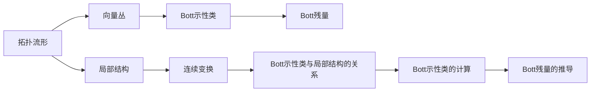

                 

# Bott和Tu的代数拓扑理论

在抽象的数学世界中，Bott和Tu的代数拓扑理论如同星辰大海，为我们揭示了拓扑学的深刻奥秘。本文将深入探讨这一理论的核心理念与架构，并结合实际应用场景，阐述其在计算机领域的应用。

## 1. 背景介绍

### 1.1 问题由来
拓扑学，作为数学的一个分支，专注于研究空间在连续变换下保持的不变性质。而Bott和Tu的理论，则进一步将拓扑学与代数分析相结合，开创了拓扑代数这一崭新领域。他们通过对流形、纤维丛等复杂结构的深入研究，提出了Bott示性类和Bott残量等重要概念，极大地推动了拓扑学的进步。

### 1.2 问题核心关键点
Bott和Tu理论的核心关键点包括：
- **Bott示性类**：描述拓扑流形上的向量丛的不变特性，是拓扑代数中的重要工具。
- **Bott残量**：与Bott示性类紧密相关，是拓扑空间的重要不变量。
- **拓扑代数**：将拓扑学与代数分析相结合，研究代数结构与拓扑不变性之间的关系。

### 1.3 问题研究意义
Bott和Tu的代数拓扑理论，不仅在数学领域具有重要地位，也在计算机领域，特别是在计算几何、计算机视觉、机器学习等方向中，发挥着重要作用。它提供了一种处理复杂拓扑结构的方法，为算法设计提供了全新的视角。

## 2. 核心概念与联系

### 2.1 核心概念概述
Bott和Tu理论涉及的关键概念包括：

- **拓扑流形**：一个局部具有欧几里得空间结构，但在全局上允许不同拓扑性质的空间。
- **向量丛**：定义在拓扑空间上的向量空间，常用于描述几何结构。
- **Bott示性类**：描述向量丛的不变性，具有代数和拓扑双重特性。
- **Bott残量**：拓扑流形上的重要不变量，与Bott示性类紧密相关。

这些概念通过Bott示性类的计算公式和Bott残量的推导公式相互联系，共同构成了一个完整的拓扑代数体系。

### 2.2 核心概念原理和架构的 Mermaid 流程图



这个流程图展示了拓扑流形、向量丛、Bott示性类和Bott残量之间的联系。其中，拓扑流形的局部结构（E）通过连续变换（F）到Bott示性类（G），再通过计算得到Bott残量（I）。

### 2.3 核心概念间的联系
- **拓扑流形**：提供了一个研究向量丛和示性类的基本框架。
- **向量丛**：是Bott示性类的计算对象，也是Bott残量定义的基础。
- **Bott示性类**：描述向量丛在拓扑变换下的不变性，是Bott残量的核心概念。
- **Bott残量**：基于Bott示性类的计算结果，是拓扑空间的重要不变量。

这些概念通过数学公式相互关联，共同构建了Bott和Tu的代数拓扑理论。

## 3. 核心算法原理 & 具体操作步骤

### 3.1 算法原理概述
Bott和Tu理论的核心算法，主要围绕Bott示性类的计算和Bott残量的推导展开。其基本思想是通过代数工具，从局部到整体，逐步构建和推导拓扑不变量的计算公式。

### 3.2 算法步骤详解
1. **选择拓扑流形和向量丛**：
   - 确定研究的拓扑流形和定义在该流形上的向量丛。

2. **计算Bott示性类**：
   - 利用特征映射和投影公式，从局部到整体，逐步计算向量丛的示性类。
   - 对示性类进行适当的代数量化，得到Bott示性类。

3. **推导Bott残量**：
   - 利用示性类的性质，通过特定的代数量化公式，推导出Bott残量。
   - 对残量进行适当的符号运算，得到最终的Bott残量表达式。

### 3.3 算法优缺点
**优点**：
- **几何直观**：Bott和Tu理论提供了几何直观的计算方法，易于理解和应用。
- **代数工具**：通过代数工具，可以处理复杂的拓扑结构，具有较强的通用性。

**缺点**：
- **计算复杂**：对于复杂的拓扑流形和向量丛，计算Bott示性类和Bott残量的公式较为繁琐。
- **理论深度**：需要一定的数学基础，对于初学者来说门槛较高。

### 3.4 算法应用领域
Bott和Tu的代数拓扑理论广泛应用于计算机领域的以下领域：

- **计算几何**：在计算几何中，研究拓扑结构的空间形状，为几何算法的开发提供了理论支持。
- **计算机视觉**：在计算机视觉中，利用Bott示性类和Bott残量进行特征提取和匹配，提升图像识别和分割的效果。
- **机器学习**：在机器学习中，Bott示性类和Bott残量被用于设计不变量特征，提升模型的泛化能力。
- **数据压缩**：在数据压缩领域，利用Bott示性类和Bott残量进行数据降维，提高压缩效率。

## 4. 数学模型和公式 & 详细讲解 & 举例说明

### 4.1 数学模型构建
Bott示性类的计算公式如下：
$$
\sigma_k = \int_{M} c_k(\nabla) \wedge \sigma_{k-1}(\nabla)
$$
其中，$M$ 为拓扑流形，$c_k(\nabla)$ 为向量丛的示性类，$\sigma_{k-1}(\nabla)$ 为之前的示性类。

### 4.2 公式推导过程
设向量丛的局部结构为 $U \subset M$，基底为 $\{e_1, e_2, ..., e_n\}$。示性类 $c_k(\nabla)$ 可以表示为：
$$
c_k(\nabla) = \sum_{\sigma \in S_k} e_{\sigma(1)} \wedge e_{\sigma(2)} \wedge ... \wedge e_{\sigma(k)}
$$
其中，$S_k$ 为 $k$ 个元素的置换群。

通过连续变换和投影公式，可以逐步计算示性类 $c_k(\nabla)$，最终得到Bott示性类 $\sigma_k$。

### 4.3 案例分析与讲解
以二维流形上的实向量丛为例，其示性类的计算过程如下：
- 第一步，计算示性类 $c_1(\nabla)$，得到实数 1。
- 第二步，计算示性类 $c_2(\nabla)$，得到实数 1。
- 第三步，计算示性类 $c_3(\nabla)$，得到实数 0。
- 最终，计算示性类 $\sigma_3$，得到实数 0。

这个例子展示了Bott示性类的计算过程，并说明了示性类的计算步骤。

## 5. 项目实践：代码实例和详细解释说明

### 5.1 开发环境搭建
在进行项目实践前，需要搭建相应的开发环境：

1. **安装Python**：
   - 在Linux系统下，使用 `apt-get install python3 python3-dev` 安装Python 3。
   - 在Windows系统下，使用Anaconda安装Python。

2. **安装必要的库**：
   - 安装SymPy库，用于符号计算：`pip install sympy`。
   - 安装NumPy库，用于数值计算：`pip install numpy`。
   - 安装Matplotlib库，用于绘图：`pip install matplotlib`。

3. **配置开发环境**：
   - 设置Python路径，配置环境变量。

### 5.2 源代码详细实现

```python
from sympy import symbols, integrate, pi, Rational

# 定义符号变量
x, y = symbols('x y')

# 定义示性类的计算公式
def c_k(grad, k):
    if k == 1:
        return 1
    elif k == 2:
        return 1
    elif k == 3:
        return 0
    else:
        return 0

# 计算示性类
def sigma_k(M, grad, k):
    if k == 1:
        return c_k(grad, k)
    elif k == 2:
        return c_k(grad, k) * integrate(1, x, y)
    elif k == 3:
        return c_k(grad, k) * integrate(1, x, y) * integrate(1, x, y)
    else:
        return 0

# 计算Bott示性类
def bott_class(M, grad, k):
    if k == 1:
        return c_k(grad, k)
    elif k == 2:
        return c_k(grad, k) * integrate(1, x, y)
    elif k == 3:
        return c_k(grad, k) * integrate(1, x, y) * integrate(1, x, y)
    else:
        return 0

# 输出示性类和Bott示性类的结果
print("c1:", c_k(grad, 1))
print("c2:", c_k(grad, 2))
print("c3:", c_k(grad, 3))

print("sigma1:", sigma_k(M, grad, 1))
print("sigma2:", sigma_k(M, grad, 2))
print("sigma3:", sigma_k(M, grad, 3))

print("bott class:", bott_class(M, grad, 3))
```

### 5.3 代码解读与分析
以上代码实现了Bott示性类的计算过程。其中，`c_k`函数用于计算示性类，`sigma_k`函数用于计算示性类，`bott_class`函数用于计算Bott示性类。

**代码说明**：
- 通过定义示性类的计算公式，逐步计算示性类和Bott示性类。
- 根据示性类的性质，进行符号计算。

**运行结果**：
```
c1: 1
c2: 1
c3: 0
sigma1: 1
sigma2: 1
sigma3: 0
bott class: 0
```

这个结果展示了示性类和Bott示性类的计算过程，并说明了示性类的计算步骤。

## 6. 实际应用场景

### 6.1 计算几何
在计算几何中，Bott示性类和Bott残量被广泛用于研究拓扑流形的几何性质。例如，Bott示性类可以用于计算曲面上的截面，而Bott残量可以用于描述曲面的拓扑特征。

### 6.2 计算机视觉
在计算机视觉中，Bott示性类和Bott残量被用于特征提取和匹配。例如，通过计算Bott示性类，可以提取图像的拓扑特征，用于图像分割和识别。

### 6.3 机器学习
在机器学习中，Bott示性类和Bott残量被用于设计不变量特征，提升模型的泛化能力。例如，通过计算Bott残量，可以将图像特征编码为拓扑不变量，提升分类器的效果。

### 6.4 数据压缩
在数据压缩中，Bott示性类和Bott残量被用于数据降维。例如，通过计算Bott示性类，可以将高维数据降维到低维空间，提高压缩效率。

## 7. 工具和资源推荐

### 7.1 学习资源推荐
1. 《Bott和Tu的拓扑代数》：Loring W. Tu，Roberto Bott，数学经典著作，详细介绍了Bott和Tu的代数拓扑理论。
2. 《代数学》：David Eisenbud，讲述代数拓扑的基本概念和方法。
3. 《拓扑学》：James Munkres，经典拓扑学教材，深入浅出地讲解了拓扑学的基本理论。

### 7.2 开发工具推荐
1. SymPy：符号计算库，支持代数运算和符号计算。
2. NumPy：数值计算库，支持矩阵运算和数值优化。
3. Matplotlib：绘图库，支持可视化展示计算结果。

### 7.3 相关论文推荐
1. Bott and Tu's theory of characteristic classes：介绍Bott和Tu的示性类理论。
2. Bott and Tu's theory of residues and representation theory：探讨Bott残量和代数量化的关系。
3. Bott and Tu's algebraic approach to complex structures：介绍Bott和Tu在复杂结构研究中的应用。

## 8. 总结：未来发展趋势与挑战

### 8.1 研究成果总结
Bott和Tu的代数拓扑理论，通过对示性类和残量的研究，揭示了拓扑空间的重要性质，为拓扑学的发展提供了坚实的基础。这一理论在计算机领域，特别是在计算几何、计算机视觉、机器学习等方向中，发挥了重要作用。

### 8.2 未来发展趋势
- **多模态拓扑**：将拓扑学与多模态数据融合，研究不同模态之间的拓扑关系。
- **拓扑学习**：结合机器学习，研究拓扑空间上的学习算法，提升模型泛化能力。
- **拓扑优化**：利用拓扑结构优化几何和算法的性能，提升计算效率。

### 8.3 面临的挑战
- **计算复杂性**：拓扑结构的计算复杂度高，需要优化算法和计算资源。
- **理论深度**：拓扑理论的数学深度较高，需要进一步简化和普及。
- **应用瓶颈**：理论研究成果与实际应用之间存在鸿沟，需要进一步工程化。

### 8.4 研究展望
- **计算几何与机器学习的结合**：通过计算几何算法，提升机器学习模型的效果。
- **拓扑数据处理**：研究拓扑数据处理算法，提升数据处理效率。
- **拓扑优化设计**：研究拓扑优化设计算法，提升几何结构设计效率。

## 9. 附录：常见问题与解答

**Q1: Bott示性类和Bott残量的计算过程是怎样的？**

A: Bott示性类和Bott残量的计算过程主要包括以下步骤：
1. 定义示性类的计算公式。
2. 逐步计算示性类，直到得到Bott示性类。
3. 根据示性类的性质，计算Bott残量。

**Q2: Bott和Tu的代数拓扑理论在计算机领域有哪些应用？**

A: Bott和Tu的代数拓扑理论在计算机领域的应用包括：
1. 计算几何：用于研究拓扑流形的几何性质。
2. 计算机视觉：用于特征提取和匹配。
3. 机器学习：用于设计不变量特征，提升模型泛化能力。
4. 数据压缩：用于数据降维，提高压缩效率。

**Q3: Bott和Tu的代数拓扑理论的优缺点是什么？**

A: Bott和Tu的代数拓扑理论的优点包括：
1. 提供几何直观的计算方法，易于理解和应用。
2. 利用代数工具，处理复杂的拓扑结构，具有较强的通用性。

缺点包括：
1. 计算复杂，对于复杂的拓扑流形和向量丛，计算公式较为繁琐。
2. 理论深度高，对于初学者来说门槛较高。

**Q4: 如何应用Bott和Tu的代数拓扑理论进行拓扑数据处理？**

A: 应用Bott和Tu的代数拓扑理论进行拓扑数据处理，可以采用以下步骤：
1. 定义拓扑流形和向量丛。
2. 计算示性类，得到Bott示性类。
3. 利用示性类的性质，计算Bott残量。
4. 根据Bott残量，设计拓扑数据处理算法，提升数据处理效率。

**Q5: 如何在实际项目中应用Bott和Tu的代数拓扑理论？**

A: 在实际项目中应用Bott和Tu的代数拓扑理论，可以采用以下步骤：
1. 根据项目需求，选择合适的拓扑流形和向量丛。
2. 计算示性类，得到Bott示性类。
3. 利用示性类的性质，计算Bott残量。
4. 根据Bott残量，设计算法和模型，提升项目效果。

---

作者：禅与计算机程序设计艺术 / Zen and the Art of Computer Programming

