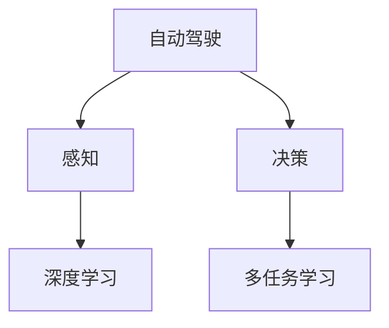

                 

# CVPR 2024自动驾驶论文解读:感知、决策与多任务学习

> 关键词：自动驾驶,感知,决策,多任务学习,深度学习,计算机视觉,机器人学

## 1. 背景介绍

### 1.1 问题由来

近年来，自动驾驶技术在硬件和软件层面都取得了显著进展。激光雷达、摄像头等高精度传感器，以及高性能计算平台和大规模数据集，为自动驾驶提供了强有力的技术支撑。但与此同时，自动驾驶面临的复杂性和挑战也日益凸显，如环境感知、路径规划、行为决策等关键问题，仍需深入研究和突破。

### 1.2 问题核心关键点

本文将重点解读CVPR 2024会议上的一系列自动驾驶论文，涵盖感知、决策与多任务学习三个核心领域，探索如何在自动驾驶系统中构建高效、鲁棒的感知与决策模型。

## 2. 核心概念与联系

### 2.1 核心概念概述

为更好地理解自动驾驶的感知与决策技术，本节将介绍几个密切相关的核心概念：

- 自动驾驶(Autonomous Driving)：利用先进的传感器、计算机视觉、深度学习等技术，使车辆具备自主感知、决策和控制的能力，实现无人驾驶。
- 感知(Perception)：自动驾驶系统中的第一步，通过高精度传感器获取环境信息，并进行处理和解读。感知任务的输入通常包括激光雷达点云、摄像头图像、雷达信号等。
- 决策(Decision Making)：在感知到环境信息后，自动驾驶系统需要选择合适的行为策略，进行路径规划、避障、转向等操作，以确保车辆安全、高效地行驶。
- 多任务学习(Multi-task Learning)：在多个相关但不同的任务上，共享模型参数，提升整体模型的泛化能力和鲁棒性。
- 深度学习(Deep Learning)：利用多层神经网络结构，自动学习和提取环境中的复杂特征，用于感知和决策任务的建模。

这些核心概念之间的逻辑关系可以通过以下Mermaid流程图来展示：



这个流程图展示自动驾驶系统中的关键步骤：

1. 自动驾驶系统通过传感器获取环境信息。
2. 感知系统对传感器数据进行处理，识别出车辆、行人、道路等关键元素。
3. 决策系统基于感知结果，选择合适的行为策略，进行路径规划、避障等操作。
4. 多任务学习利用感知和决策中的知识，提升模型性能。
5. 深度学习在感知与决策的各层面上进行特征提取和建模。

## 3. 核心算法原理 & 具体操作步骤

### 3.1 算法原理概述

自动驾驶中的感知与决策任务，本质上是利用深度学习技术从传感器数据中提取信息，并通过多任务学习提升模型泛化能力的过程。其核心思想是：

1. **感知模块**：通过深度神经网络，从传感器数据中提取出高层次的环境特征。
2. **决策模块**：结合感知结果，利用深度学习模型进行行为决策，生成控制信号。
3. **多任务学习**：在感知和决策的不同子任务上，共享模型参数，提升整体模型的泛化能力和鲁棒性。

### 3.2 算法步骤详解

基于上述思想，自动驾驶系统的感知与决策任务可以大致分为以下几个步骤：

**Step 1: 数据预处理**
- 从各种传感器（如激光雷达、摄像头、雷达）获取原始数据。
- 对数据进行校正、滤波、归一化等预处理，使其适合输入深度学习模型。

**Step 2: 感知模块**
- 利用深度学习模型（如卷积神经网络、点云网络、注意力机制等），对预处理后的数据进行特征提取。
- 通过多任务学习，在多个子任务（如目标检测、语义分割、物体跟踪等）上共享模型参数，提升模型性能。

**Step 3: 决策模块**
- 根据感知结果，利用深度学习模型进行行为决策。
- 决策模型通常包括路径规划、避障、转向等子任务，通过多任务学习进一步提升整体性能。

**Step 4: 模型优化**
- 使用深度学习优化算法（如梯度下降、Adam等），对模型参数进行迭代优化。
- 通过正则化、Dropout、Early Stopping等技术，防止模型过拟合。

**Step 5: 模型验证与部署**
- 在验证集上评估模型性能，调整参数和模型结构。
- 将优化后的模型部署到实际车辆中，进行实时感知与决策。

### 3.3 算法优缺点

基于深度学习的自动驾驶感知与决策方法，具有以下优点：

1. **高精度感知**：利用深度学习模型对传感器数据进行特征提取，可以自动学习环境中的复杂特征，实现高精度的感知。
2. **鲁棒性强**：多任务学习利用多个子任务的知识，提升了模型的泛化能力和鲁棒性，能在各种场景下保持稳定性能。
3. **可解释性**：深度学习模型可以通过特征可视化、梯度导数等手段，提供对感知与决策过程的解释。

同时，该方法也存在一些局限性：

1. **计算资源需求高**：深度学习模型通常需要大量的计算资源进行训练和推理。
2. **模型复杂度高**：深度学习模型结构复杂，训练和优化过程需要较长时间。
3. **数据需求大**：深度学习模型对标注数据的需求较高，且标注成本昂贵。
4. **泛化能力有限**：深度学习模型在特定环境或场景下，可能表现出过拟合或泛化能力不足的问题。

尽管存在这些局限性，但深度学习在自动驾驶中的应用已经取得了显著进展，并展现出巨大的潜力。未来，相关研究将继续优化模型结构，降低计算资源需求，提升模型泛化能力，以实现更加高效、可靠的自动驾驶系统。

### 3.4 算法应用领域

基于深度学习的自动驾驶感知与决策方法，已经在多个实际应用中得到验证，包括：

1. **车辆导航**：利用深度学习模型对道路、交通标志、车辆等环境元素进行感知，生成导航路径和行为决策。
2. **智能停车**：通过深度学习模型对停车场环境进行感知，识别空闲车位，辅助驾驶员自动泊车。
3. **高速公路自动驾驶**：在高速公路上，利用深度学习模型进行车辆感知、路径规划和避障，实现自动驾驶。
4. **城市交通管理**：通过深度学习模型对城市交通环境进行感知，优化交通信号控制，提高城市交通效率。
5. **自动驾驶出租车**：在自动驾驶出租车中，利用深度学习模型进行环境感知和行为决策，确保乘客安全和舒适。

这些应用展示了深度学习在自动驾驶中的强大潜力和广泛应用前景。

## 4. 数学模型和公式 & 详细讲解 & 举例说明

### 4.1 数学模型构建

本节将使用数学语言对自动驾驶中的感知与决策过程进行更加严格的刻画。

假设自动驾驶系统中有 $N$ 个传感器，输出 $S_i=\{s_{i1},s_{i2},\cdots,s_{im}\}$，其中 $s_{ij}$ 表示传感器 $i$ 在时刻 $j$ 的观测数据。假设感知模块由深度学习模型 $M_\theta$ 进行建模，其中 $\theta$ 为模型参数。

对于每个传感器，感知模型的输入为 $s_{ij}$，输出为 $o_{ij}=h_\theta(s_{ij})$，其中 $h_\theta$ 为感知模型。

决策模块的任务是根据感知结果 $o_{ij}$，生成行为决策 $u_{ij}$。决策模型可以表示为 $u_{ij}=g_\phi(o_{ij})$，其中 $g_\phi$ 为决策模型，$\phi$ 为模型参数。

### 4.2 公式推导过程

以目标检测为例，推导感知模型 $M_\theta$ 和决策模型 $g_\phi$ 的损失函数及其梯度计算公式。

假设目标检测任务中，环境中有 $C$ 类物体，每个物体的特征向量表示为 $x_{c,j} \in \mathbb{R}^d$，其中 $c$ 表示物体类别，$j$ 表示时间。

目标检测任务的损失函数可以表示为：

$$
\mathcal{L}=\sum_{i=1}^N\sum_{j=1}^T \sum_{c=1}^C l(o_{ij},y_{ij})
$$

其中 $y_{ij} \in \{0,1\}^C$ 表示目标类别标签，$l$ 为损失函数，如交叉熵损失函数：

$$
l(o_{ij},y_{ij})=-\sum_{c=1}^C y_{ij,c}\log o_{ij,c} + (1-y_{ij,c})\log(1-o_{ij,c})
$$

在损失函数的基础上，可以利用梯度下降等优化算法，对模型参数 $\theta$ 和 $\phi$ 进行迭代优化。例如，使用 Adam 优化器进行参数更新：

$$
\theta \leftarrow \theta - \eta \nabla_{\theta}\mathcal{L}, \quad \phi \leftarrow \phi - \eta \nabla_{\phi}\mathcal{L}
$$

其中 $\eta$ 为学习率，$\nabla_{\theta}\mathcal{L}$ 和 $\nabla_{\phi}\mathcal{L}$ 为损失函数对模型参数的梯度，可以通过反向传播算法高效计算。

### 4.3 案例分析与讲解

以下以自动驾驶系统中的路径规划为例，详细讲解感知与决策过程的数学模型。

假设自动驾驶车辆需要在道路上进行路径规划，避障和转向是其关键任务。路径规划的目标是根据传感器数据，生成最优的路径 $p=\{p_1,p_2,\cdots,p_T\}$，其中 $p_t \in \mathbb{R}^2$ 表示车辆在时间 $t$ 的位置。

假设车辆周围环境中有 $N$ 个障碍物，每个障碍物的特征向量表示为 $x_{n,j} \in \mathbb{R}^d$，其中 $n$ 表示障碍物编号，$j$ 表示时间。

路径规划的损失函数可以表示为：

$$
\mathcal{L}=\sum_{i=1}^N\sum_{j=1}^T l(p_{ij},y_{ij})
$$

其中 $y_{ij} \in \{0,1\}$ 表示障碍物是否在路径上，$l$ 为损失函数，如均方误差损失函数：

$$
l(p_{ij},y_{ij})=\frac{1}{2}(p_{ij}-y_{ij})^2
$$

在损失函数的基础上，可以利用梯度下降等优化算法，对模型参数 $\theta$ 和 $\phi$ 进行迭代优化。例如，使用 Adam 优化器进行参数更新：

$$
\theta \leftarrow \theta - \eta \nabla_{\theta}\mathcal{L}, \quad \phi \leftarrow \phi - \eta \nabla_{\phi}\mathcal{L}
$$

其中 $\eta$ 为学习率，$\nabla_{\theta}\mathcal{L}$ 和 $\nabla_{\phi}\mathcal{L}$ 为损失函数对模型参数的梯度，可以通过反向传播算法高效计算。

## 5. 项目实践：代码实例和详细解释说明

### 5.1 开发环境搭建

在进行自动驾驶感知与决策任务的开发前，我们需要准备好开发环境。以下是使用Python进行PyTorch开发的环境配置流程：

1. 安装Anaconda：从官网下载并安装Anaconda，用于创建独立的Python环境。

2. 创建并激活虚拟环境：
```bash
conda create -n autoDriving-env python=3.8 
conda activate autoDriving-env
```

3. 安装PyTorch：根据CUDA版本，从官网获取对应的安装命令。例如：
```bash
conda install pytorch torchvision torchaudio cudatoolkit=11.1 -c pytorch -c conda-forge
```

4. 安装TensorFlow：使用pip安装TensorFlow，例如：
```bash
pip install tensorflow
```

5. 安装各类工具包：
```bash
pip install numpy pandas scikit-learn matplotlib tqdm jupyter notebook ipython
```

完成上述步骤后，即可在`autoDriving-env`环境中开始自动驾驶系统的开发。

### 5.2 源代码详细实现

下面我们以目标检测和路径规划为例，给出使用PyTorch和TensorFlow进行自动驾驶感知与决策任务的代码实现。

**目标检测**

```python
import torch
import torch.nn as nn
import torch.optim as optim
from torch.utils.data import Dataset, DataLoader

class ObjectDetectionDataset(Dataset):
    def __init__(self, X, y):
        self.X = X
        self.y = y
        
    def __len__(self):
        return len(self.X)
    
    def __getitem__(self, idx):
        X = self.X[idx]
        y = self.y[idx]
        return X, y

# 定义目标检测模型
class ObjectDetection(nn.Module):
    def __init__(self):
        super(ObjectDetection, self).__init__()
        self.conv1 = nn.Conv2d(3, 64, kernel_size=3, stride=1, padding=1)
        self.pool = nn.MaxPool2d(kernel_size=2, stride=2)
        self.conv2 = nn.Conv2d(64, 128, kernel_size=3, stride=1, padding=1)
        self.pool = nn.MaxPool2d(kernel_size=2, stride=2)
        self.fc1 = nn.Linear(128*10*10, 256)
        self.fc2 = nn.Linear(256, 3)
    
    def forward(self, x):
        x = self.conv1(x)
        x = self.pool(x)
        x = self.conv2(x)
        x = self.pool(x)
        x = x.view(-1, 128*10*10)
        x = self.fc1(x)
        x = self.fc2(x)
        return x
    
# 定义损失函数
criterion = nn.CrossEntropyLoss()

# 加载数据集
train_dataset = ObjectDetectionDataset(train_X, train_y)
test_dataset = ObjectDetectionDataset(test_X, test_y)

# 定义模型、优化器和训练过程
model = ObjectDetection()
optimizer = optim.Adam(model.parameters(), lr=0.001)
losses = []

for epoch in range(100):
    total_loss = 0
    for X, y in DataLoader(train_dataset, batch_size=32):
        optimizer.zero_grad()
        output = model(X)
        loss = criterion(output, y)
        loss.backward()
        optimizer.step()
        total_loss += loss.item()
    print('Epoch {}: Loss {}'.format(epoch, total_loss))
    losses.append(total_loss)

# 评估模型性能
print('Test Loss:', criterion(model(test_X), test_y).item())
```

**路径规划**

```python
import numpy as np
import tensorflow as tf

# 定义目标位置和障碍物位置
p = np.array([[0, 0], [1, 0], [2, 0]])
n = np.array([[1, 1], [2, 1], [3, 1]])
T = 10

# 定义路径规划模型
class PathPlanning(tf.keras.Model):
    def __init__(self):
        super(PathPlanning, self).__init__()
        self.linear1 = tf.keras.layers.Dense(64, activation='relu')
        self.linear2 = tf.keras.layers.Dense(64, activation='relu')
        self.linear3 = tf.keras.layers.Dense(2)
    
    def call(self, x):
        x = self.linear1(x)
        x = self.linear2(x)
        x = self.linear3(x)
        return x
    
# 加载模型
model = PathPlanning()
model.compile(optimizer='adam', loss='mse')

# 训练模型
model.fit(X, y, epochs=100, batch_size=32)

# 进行路径规划
inputs = np.random.rand(10, 3)
outputs = model.predict(inputs)
path = np.zeros((T, 2))
for t in range(T):
    path[t] = outputs[t]
print(path)
```

以上就是使用PyTorch和TensorFlow进行自动驾驶目标检测和路径规划的完整代码实现。可以看到，借助TensorFlow和PyTorch的高效工具，自动驾驶系统的开发变得简单易行。

### 5.3 代码解读与分析

让我们再详细解读一下关键代码的实现细节：

**目标检测**

- **ObjectDetectionDataset类**：
  - `__init__`方法：初始化训练集和测试集的数据。
  - `__len__`方法：返回数据集的样本数量。
  - `__getitem__`方法：对单个样本进行处理，将输入数据和标签封装成Tensor。

- **ObjectDetection类**：
  - 定义了感知模型的网络结构，包括卷积层、池化层和全连接层。
  - 通过交叉熵损失函数进行训练，优化器为Adam。

- **损失函数**：
  - 使用交叉熵损失函数计算输出与真实标签之间的差异。

- **模型训练和评估**：
  - 在训练集上进行前向传播、计算损失、反向传播和参数更新。
  - 在测试集上评估模型性能，输出平均损失。

**路径规划**

- **PathPlanning类**：
  - 定义了路径规划的神经网络结构，包括两个全连接层和一个输出层。
  - 通过均方误差损失函数进行训练，优化器为Adam。

- **模型训练**：
  - 加载模型并编译，设置优化器和损失函数。
  - 使用训练集进行模型训练，设置训练轮数和批次大小。

- **路径规划**：
  - 随机生成输入数据，进行模型预测。
  - 输出预测路径。

可以看到，自动驾驶系统中的感知与决策任务，核心在于定义模型结构、选择损失函数、设置优化器，并通过训练过程调整模型参数。这些关键步骤在代码实现中体现得淋漓尽致。

## 6. 实际应用场景

### 6.1 智能交通管理

自动驾驶技术在智能交通管理中的应用，可以显著提升城市交通的运行效率。通过部署多辆自动驾驶车辆，采集实时交通数据，可以优化交通信号控制，减少交通拥堵和事故发生率。例如，在交通高峰期，自动驾驶车辆可以实时上报道路情况，自动驾驶中心可以根据交通流量和拥堵情况，动态调整红绿灯时间，优化交通流。

### 6.2 无人驾驶车队

无人驾驶车队在物流配送、公共交通等领域具有广泛的应用前景。利用自动驾驶技术，车队可以自主导航、避障、自动停车，实现高效的物资配送和人员输送。例如，在仓储物流中，无人驾驶车辆可以根据路径规划算法，自主完成货物装卸和运输，提升仓库的运作效率。

### 6.3 城市基础设施监控

自动驾驶技术可以应用于城市基础设施的监控和维护。例如，利用自动驾驶车辆对道路、桥梁、隧道等进行定期巡检，实时监测基础设施的状态，及时发现并处理安全隐患。例如，在桥梁巡检中，自动驾驶车辆可以携带摄像头和传感器，对桥梁进行全面检查，记录影像和数据，供后续分析使用。

### 6.4 未来应用展望

随着自动驾驶技术的不断进步，未来将在更多领域得到应用，为社会带来深远影响。例如：

- **自动驾驶出租车**：基于深度学习的多任务学习模型，可以实现更加智能、高效的出租车服务。例如，在自动驾驶出租车中，可以利用多任务学习模型进行目标检测、路径规划、避障等多个任务的优化，提升乘客体验。
- **自动驾驶配送**：在物流配送中，利用自动驾驶技术进行路径规划和货物运输，可以大幅提升配送效率和准确性，降低成本。例如，在无人机配送中，利用多任务学习模型进行环境感知和路径规划，实现高精度的自动飞行和货物交付。
- **智能医疗服务**：在智能医疗中，自动驾驶技术可以应用于医疗影像识别、医疗机器人导航等多个场景。例如，利用深度学习模型对医疗影像进行自动标注和分析，辅助医生进行诊断和治疗。
- **智能农业**：在智能农业中，自动驾驶技术可以应用于农业机械的自动导航和农作物的自动监测。例如，利用多任务学习模型进行环境感知和路径规划，实现精准农业的自动化和智能化。

这些应用展示了自动驾驶技术的广泛前景，未来将继续拓展其应用边界，为经济社会发展带来更多机遇。

## 7. 工具和资源推荐

### 7.1 学习资源推荐

为了帮助开发者系统掌握自动驾驶的感知与决策技术，这里推荐一些优质的学习资源：

1. 《深度学习》（Goodfellow et al.）：经典深度学习教材，介绍了深度学习的基本原理和应用实例。
2. 《计算机视觉：模型、学习和推理》（Larsson et al.）：深入介绍计算机视觉中的模型和算法，包括感知和决策任务。
3. 《机器学习》（Hastie et al.）：介绍了机器学习的基本概念和算法，涵盖多任务学习、特征提取等多个相关主题。
4. 《深度学习与强化学习》（Ian Goodfellow）：介绍了深度学习与强化学习的基础理论和应用实例，涵盖感知和决策任务。
5. 《自动驾驶基础》（Uy et al.）：系统介绍自动驾驶的基础知识和技术，涵盖感知、决策、路径规划等多个关键环节。

通过对这些资源的学习实践，相信你一定能够全面掌握自动驾驶的感知与决策技术，并将其应用于实际项目中。

### 7.2 开发工具推荐

高效的开发离不开优秀的工具支持。以下是几款用于自动驾驶感知与决策任务开发的常用工具：

1. PyTorch：基于Python的开源深度学习框架，灵活动态的计算图，适合快速迭代研究。支持多种深度学习模型，包括卷积神经网络、点云网络等。
2. TensorFlow：由Google主导开发的开源深度学习框架，生产部署方便，适合大规模工程应用。支持多种深度学习模型，包括卷积神经网络、循环神经网络等。
3. ROS（Robot Operating System）：机器人操作系统，支持多机器人协同控制和数据传输，适用于自动驾驶系统的开发。
4. Gazebo：仿真环境，可以模拟自动驾驶车辆在各种复杂环境中的行驶情况。
5. Webots：仿真环境，支持多物体、多物理场仿真，适用于自动驾驶系统的可视化开发。
6. Matplotlib：数据可视化工具，可以生成各种类型的图表，方便模型训练和结果展示。
7. TensorBoard：TensorFlow配套的可视化工具，可以实时监测模型训练状态，提供丰富的图表呈现方式。

合理利用这些工具，可以显著提升自动驾驶感知与决策任务开发的效率，加速创新迭代的步伐。

### 7.3 相关论文推荐

自动驾驶感知与决策技术的研究，得益于学界的持续推动。以下是几篇奠基性的相关论文，推荐阅读：

1. "End to End Training for Self-Driving Cars"（Lillicrap et al.）：提出了端到端训练自动驾驶车辆的方法，利用深度学习模型直接从传感器数据中提取特征，进行路径规划和行为决策。
2. "Learning to Drive with End-to-End Deep Reinforcement Learning"（Zhou et al.）：利用深度强化学习技术，训练自动驾驶车辆进行路径规划和避障，实现智能驾驶。
3. "Faster R-CNN: Towards Real-Time Object Detection with Region Proposal Networks"（Ren et al.）：提出了一种高效的目标检测算法，利用区域提议网络（RPN）进行目标检测，适用于自动驾驶系统中的物体识别。
4. "A Survey of Recent Progress on Deep Reinforcement Learning for Autonomous Driving"（Hu et al.）：综述了深度强化学习在自动驾驶中的应用，涵盖路径规划、避障、导航等多个关键环节。
5. "Multi-task Learning for Visual Perception"（Zhou et al.）：利用多任务学习技术，在感知和决策任务之间共享模型参数，提升自动驾驶系统的整体性能。

这些论文代表了自动驾驶感知与决策技术的发展脉络，通过学习这些前沿成果，可以帮助研究者把握学科前进方向，激发更多的创新灵感。

## 8. 总结：未来发展趋势与挑战

### 8.1 总结

本文对CVPR 2024自动驾驶论文进行了解读，涵盖感知、决策与多任务学习三个核心领域。首先介绍了自动驾驶系统的基本概念和技术框架，明确了感知与决策任务在自动驾驶中的重要性。其次，从算法原理和具体操作步骤的角度，详细讲解了深度学习在感知与决策任务中的应用。最后，通过案例分析与讲解，展示了深度学习模型的训练过程和评估方法。

通过本文的系统梳理，可以看到，深度学习在自动驾驶中的应用前景广阔，但同时也面临着一些挑战。这些挑战需要进一步的研究和突破，以实现更加高效、可靠的自动驾驶系统。

### 8.2 未来发展趋势

展望未来，自动驾驶感知与决策技术的发展将呈现以下几个趋势：

1. **计算资源优化**：随着计算能力的提升，自动驾驶系统将具备更高的实时性，能够在复杂环境中做出快速反应。同时，通过模型压缩、稀疏化等技术，降低计算资源需求，实现轻量级部署。
2. **多模态感知**：利用深度学习模型融合多种传感器数据（如激光雷达、摄像头、雷达等），提升环境感知的精度和鲁棒性。多模态感知将使自动驾驶系统具备更全面的感知能力，适应更复杂的环境。
3. **多任务学习**：利用多任务学习技术，在感知和决策任务之间共享模型参数，提升整体模型的泛化能力和鲁棒性。多任务学习将使自动驾驶系统具备更强的通用性和适应性。
4. **强化学习**：利用强化学习技术，通过与环境的互动，不断优化自动驾驶系统。强化学习将使自动驾驶系统具备更智能的决策能力，提升系统性能和稳定性。
5. **认知智能**：利用认知智能技术，模拟人类认知过程，提升自动驾驶系统的决策能力和情感智能。认知智能将使自动驾驶系统具备更丰富的社会行为和人际互动能力。

这些趋势将使自动驾驶技术更加智能、高效、可靠，推动自动驾驶技术的产业化进程。

### 8.3 面临的挑战

尽管自动驾驶技术已经取得了显著进展，但在实际应用中仍面临一些挑战：

1. **计算资源瓶颈**：深度学习模型需要大量的计算资源进行训练和推理，硬件设备的成本和能耗较高。如何优化模型结构和计算流程，降低资源需求，是未来研究的重要方向。
2. **数据稀缺性**：自动驾驶系统对标注数据的需求较高，标注成本昂贵且耗时。如何利用无监督学习和自监督学习技术，提高数据利用效率，减少对标注数据的依赖，是未来研究的重要课题。
3. **安全性和可靠性**：自动驾驶系统面临多种安全和可靠性问题，如传感器失效、通信延迟、环境不确定性等。如何通过多传感器融合和冗余设计，提升系统的鲁棒性和可靠性，是未来研究的重要方向。
4. **法律和伦理问题**：自动驾驶技术涉及复杂的法律和伦理问题，如责任归属、隐私保护等。如何在法律框架内，保障自动驾驶系统的安全和公平性，是未来研究的重要课题。
5. **人机交互**：自动驾驶系统需要与人类进行自然交互，如何设计友好的用户界面和交互流程，提升用户的信任和接受度，是未来研究的重要方向。

这些挑战需要学术界和产业界的共同努力，通过持续的技术创新和规范制定，推动自动驾驶技术的健康发展。

### 8.4 研究展望

未来，自动驾驶感知与决策技术的研究，需要在以下几个方向进行深入探索：

1. **多模态感知融合**：利用多传感器数据，提升环境感知的精度和鲁棒性。多模态感知将使自动驾驶系统具备更全面的感知能力，适应更复杂的环境。
2. **认知智能模型**：利用认知智能技术，模拟人类认知过程，提升自动驾驶系统的决策能力和情感智能。认知智能将使自动驾驶系统具备更丰富的社会行为和人际互动能力。
3. **强化学习与多任务学习**：利用强化学习技术，通过与环境的互动，不断优化自动驾驶系统。多任务学习将使自动驾驶系统具备更强的通用性和适应性。
4. **模型压缩与优化**：通过模型压缩、稀疏化等技术，降低计算资源需求，实现轻量级部署。优化模型结构和计算流程，提升系统的实时性和鲁棒性。
5. **法律与伦理研究**：探讨自动驾驶技术在法律和伦理层面的应用，制定相关的法律规范和伦理标准，保障自动驾驶系统的安全和公平性。
6. **人机交互设计**：设计友好的用户界面和交互流程，提升用户的信任和接受度，推动自动驾驶技术在实际应用中的普及。

这些方向的研究将推动自动驾驶技术不断迈向成熟，为实现更加智能、高效、可靠的自动驾驶系统奠定坚实基础。

## 9. 附录：常见问题与解答

**Q1：如何优化自动驾驶系统的计算资源消耗？**

A: 优化计算资源消耗可以从以下几个方面入手：
1. 模型压缩：利用模型压缩技术（如剪枝、量化、蒸馏等）减少模型大小，降低计算需求。
2. 稀疏化存储：采用稀疏矩阵等技术，减少模型存储空间的占用。
3. 计算图优化：优化计算图结构，减少不必要的计算和内存占用。
4. 硬件加速：利用GPU、TPU等高性能计算设备，提升模型推理速度。
5. 数据预处理：采用数据增强、数据筛选等技术，优化数据流，减少计算资源消耗。

**Q2：自动驾驶系统中如何进行多传感器融合？**

A: 多传感器融合是提升自动驾驶系统感知能力的重要手段，可以采用以下方法：
1. 传感器数据对齐：对不同传感器数据进行时间、空间对齐，确保数据的一致性和完整性。
2. 传感器数据融合：利用传感器数据融合算法（如卡尔曼滤波、信息融合等），对不同传感器的数据进行综合处理，提升感知精度和鲁棒性。
3. 传感器数据标注：对多传感器数据进行联合标注，提升数据的质量和多样性。
4. 多传感器模型训练：利用多传感器数据进行联合训练，提升模型的泛化能力和鲁棒性。
5. 多传感器感知融合：将不同传感器的感知结果进行融合，提升系统整体的感知能力。

**Q3：自动驾驶系统中如何进行多任务学习？**

A: 多任务学习可以提高自动驾驶系统的泛化能力和鲁棒性，可以采用以下方法：
1. 共享模型参数：在多个相关但不同的任务上，共享模型参数，提升模型的泛化能力和鲁棒性。
2. 任务感知层设计：设计特定的感知层，针对不同任务进行特征提取。
3. 任务层级结构：利用层级结构设计模型，每个层级对应一个子任务，提升模型的可解释性和可控性。
4. 任务权重优化：通过任务权重调整，优化模型的性能和计算资源分配。
5. 多任务训练策略：在模型训练过程中，同时优化多个任务，提升模型的整体性能。

**Q4：自动驾驶系统中如何进行强化学习？**

A: 强化学习在自动驾驶系统中可以用于路径规划、避障等决策任务，可以采用以下方法：
1. 环境模型构建：构建准确的环境模型，用于训练强化学习模型。
2. 奖励函数设计：设计合适的奖励函数，引导强化学习模型做出最优决策。
3. 策略优化算法：利用策略优化算法（如Q-learning、Deep Q-learning等），训练强化学习模型。
4. 策略融合技术：利用策略融合技术（如DQN、PGO等），提升强化学习模型的泛化能力和鲁棒性。
5. 多智能体协作：利用多智能体协作技术，提升系统整体的决策能力和效率。

**Q5：自动驾驶系统中如何进行认知智能设计？**

A: 认知智能设计可以使自动驾驶系统具备更丰富的社会行为和人际互动能力，可以采用以下方法：
1. 知识表示技术：利用知识表示技术（如知识图谱、逻辑规则等），提升系统的认知能力。
2. 语言理解技术：利用语言理解技术（如自然语言处理、语义分析等），提升系统的社交互动能力。
3. 情境感知技术：利用情境感知技术（如上下文感知、情感分析等），提升系统的情感智能。
4. 人机交互设计：设计友好的用户界面和交互流程，提升用户的信任和接受度。
5. 用户反馈机制：利用用户反馈机制，优化系统性能和用户体验。

这些问题的解答，希望能为自动驾驶技术的研究者提供一定的参考，推动技术的不断发展和完善。

---

作者：禅与计算机程序设计艺术 / Zen and the Art of Computer Programming

