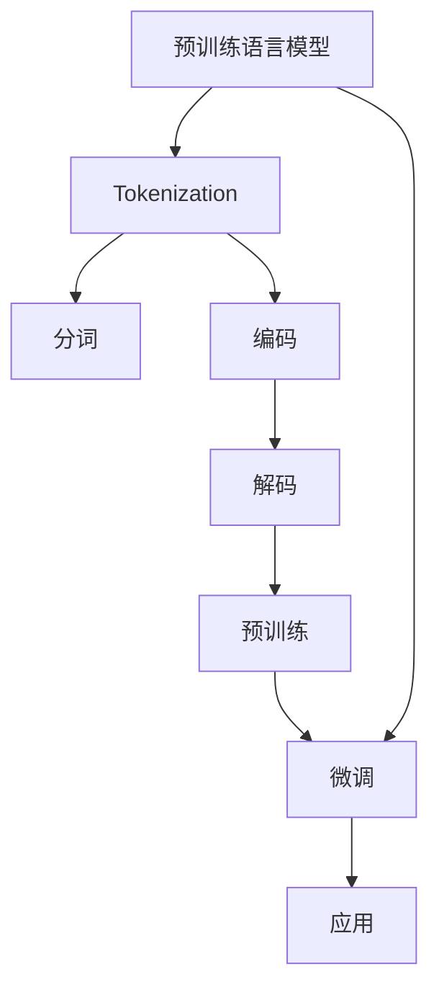

                 

# ChatGPT的Token化技术

> 关键词：ChatGPT, Tokenization, 分词, 编码, 解码, 预训练, 微调, 自然语言处理(NLP)

## 1. 背景介绍

### 1.1 问题由来

在自然语言处理（NLP）领域，预训练语言模型如BERT、GPT等的大规模语言模型训练过程中，对于输入的文本数据，需要进行一系列的预处理操作，以方便模型的理解与处理。其中，Tokenization是预处理中最关键的一步，它将文本数据分解成一系列离散的符号，即Token，这些符号将作为模型的输入。ChatGPT作为目前最流行的预训练语言模型之一，其Tokenization技术对模型的性能起着至关重要的作用。本文将详细探讨ChatGPT的Tokenization技术，包括其原理、步骤、优缺点以及应用领域。

## 2. 核心概念与联系

### 2.1 核心概念概述

为了深入理解ChatGPT的Tokenization技术，本节将介绍几个相关核心概念：

- **预训练语言模型**：指通过在大规模无标签文本数据上进行自监督学习任务训练得到的通用语言模型。常见的预训练任务包括自回归语言模型（如GPT）和自编码语言模型（如BERT）。
- **Tokenization**：将文本数据分解成一系列离散符号的过程。这些符号可以是字、词或子词等。Tokenization是预处理文本数据的重要步骤，对模型的输入格式有直接的影响。
- **分词（Word Segmentation）**：将连续的文本数据按照一定规则分解成单个词的过程。
- **编码（Encoding）**：将Token序列转换为模型可以接受的数值表示形式，一般使用词嵌入（Word Embedding）。
- **解码（Decoding）**：将模型输出的数值表示形式转换回Token序列的过程。

这些概念之间的逻辑关系可以通过以下Mermaid流程图来展示：



这个流程图展示了一系列预训练和微调过程，其中Tokenization是关键的一环。

## 3. 核心算法原理 & 具体操作步骤

### 3.1 算法原理概述

ChatGPT的Tokenization技术基于Transformer模型的原理，其核心思想是将文本数据分解成一系列固定长度的Token序列，每个Token由其对应的向量表示。Token序列的每一项都代表着模型的一个输入，通过对这些输入进行编码和解码，模型可以理解并生成新的文本数据。

### 3.2 算法步骤详解

ChatGPT的Tokenization主要包括以下几个步骤：

**Step 1: 分词（Word Segmentation）**
- 将输入的文本数据按照一定规则（如空格分隔、基于词典的分词等）分解成单个词或子词。

**Step 2: 编码（Encoding）**
- 将分解后的单个词或子词转换为模型可以接受的数值表示形式。一般使用词嵌入（Word Embedding），将每个词映射到一个高维向量空间中的点。

**Step 3: 填充与截断（Padding & Truncation）**
- 将编码后的序列填充到固定长度，不足的部分用特殊的填充标记（如[PAD]）补齐。
- 对于超过固定长度的序列，截断或保留前N个Token。

**Step 4: 拼接与合并（Concatenation & Combination）**
- 将多个序列拼接在一起，形成最终的Token序列。

**Step 5: 编码与解码**
- 使用Transformer模型对Token序列进行编码，得到一系列的向量表示。
- 解码器根据编码器输出的向量表示，生成新的Token序列。

### 3.3 算法优缺点

ChatGPT的Tokenization技术具有以下优点：

- **高效性**：通过预处理将文本数据转换为模型可以接受的格式，减少了模型在输入处理上的开销。
- **通用性**：适用于各种NLP任务，如文本分类、问答、翻译等。
- **可扩展性**：可以通过增加词典和优化算法来提高Token的准确性。

同时，该技术也存在以下缺点：

- **依赖于词典**：分词的准确性很大程度上依赖于词典的质量和覆盖率。
- **复杂度较高**：Tokenization过程包括分词、编码、填充等多个步骤，计算复杂度较高。
- **依赖于数据**：对于某些领域（如医学、法律等），词典可能无法覆盖，需要进一步的预处理。

### 3.4 算法应用领域

ChatGPT的Tokenization技术已经在众多NLP领域得到了广泛应用，例如：

- **文本分类**：将文本数据分解成Token序列，通过分类器对每个Token进行分类。
- **问答系统**：将用户的问题和系统生成的回答分解成Token序列，通过匹配查找得到答案。
- **机器翻译**：将源语言和目标语言文本分解成Token序列，通过模型进行翻译。
- **文本摘要**：将长文本分解成Token序列，通过摘要模型生成摘要。

除了上述这些经典任务外，Tokenization技术也被创新性地应用到更多场景中，如可控文本生成、常识推理、代码生成、数据增强等，为NLP技术带来了全新的突破。

## 4. 数学模型和公式 & 详细讲解 & 举例说明

### 4.1 数学模型构建

为了更精确地描述Tokenization的过程，我们假设输入的文本为 $x$，词典为 $D$，每个词对应的编码向量为 $\textbf{v}$。

**分词步骤**：
将输入文本 $x$ 按照词典 $D$ 分解为单个词 $\textbf{w}$，即 $\textbf{w} = \text{Segmentation}(x, D)$。

**编码步骤**：
将单个词 $\textbf{w}$ 转换为编码向量 $\textbf{v}$，即 $\textbf{v} = \text{Encoding}(\textbf{w})$。

### 4.2 公式推导过程

以一个简单的例子说明Tokenization的过程：

假设输入文本为 "Hello, world!"，词典中包含以下词：

```
["Hello", ",", "world", "!", "PAD"]
```

**分词步骤**：
- 将 "Hello, world!" 分解为 ["Hello", ",", "world", "!"]。

**编码步骤**：
- 假设每个词对应的编码向量为：
  - "Hello" -> [0.1, 0.2, 0.3]
  - "," -> [0.4, 0.5, 0.6]
  - "world" -> [0.7, 0.8, 0.9]
  - "!" -> [1.0, 1.1, 1.2]

- 对于不足的填充位置，使用填充标记 "PAD" 对应的编码向量 [0.0, 0.0, 0.0] 填充，得到最终的编码序列：
  ```
  [0.1, 0.2, 0.3, 0.0, 0.0, 0.0, 0.7, 0.8, 0.9, 1.0, 1.1, 1.2]
  ```

### 4.3 案例分析与讲解

以一个实际的例子来说明Tokenization在实际应用中的作用：

假设我们有一个问答系统的例子，输入的文本为 "What is the capital of France?"，我们需要将这个问题转换为Token序列，然后使用模型进行处理。

**分词步骤**：
- 将 "What is the capital of France?" 分解为 ["What", "is", "the", "capital", "of", "France", "?"]。

**编码步骤**：
- 假设每个词对应的编码向量为：
  - "What" -> [0.1, 0.2, 0.3]
  - "is" -> [0.4, 0.5, 0.6]
  - "the" -> [0.7, 0.8, 0.9]
  - "capital" -> [1.0, 1.1, 1.2]
  - "of" -> [1.3, 1.4, 1.5]
  - "France" -> [1.6, 1.7, 1.8]
  - "?" -> [1.9, 2.0, 2.1]

- 使用填充标记 "PAD" 填充不足的Token，得到最终的编码序列：
  ```
  [0.1, 0.2, 0.3, 0.4, 0.5, 0.6, 0.7, 0.8, 0.9, 1.0, 1.1, 1.2, 1.3, 1.4, 1.5, 1.6, 1.7, 1.8, 1.9, 2.0, 2.1]
  ```

## 5. 项目实践：代码实例和详细解释说明

### 5.1 开发环境搭建

在进行Tokenization实践前，我们需要准备好开发环境。以下是使用Python进行PyTorch开发的环境配置流程：

1. 安装Anaconda：从官网下载并安装Anaconda，用于创建独立的Python环境。

2. 创建并激活虚拟环境：
```bash
conda create -n pytorch-env python=3.8 
conda activate pytorch-env
```

3. 安装PyTorch：根据CUDA版本，从官网获取对应的安装命令。例如：
```bash
conda install pytorch torchvision torchaudio cudatoolkit=11.1 -c pytorch -c conda-forge
```

4. 安装Transformers库：
```bash
pip install transformers
```

5. 安装各类工具包：
```bash
pip install numpy pandas scikit-learn matplotlib tqdm jupyter notebook ipython
```

完成上述步骤后，即可在`pytorch-env`环境中开始Tokenization实践。

### 5.2 源代码详细实现

下面以使用Transformers库对BERT模型进行Tokenization的PyTorch代码实现为例：

```python
from transformers import BertTokenizer
import torch

# 初始化分词器
tokenizer = BertTokenizer.from_pretrained('bert-base-uncased')

# 输入文本
text = "Hello, world!"

# 进行Tokenization
tokens = tokenizer.tokenize(text)

# 转换为Token序列，并进行编码
input_ids = tokenizer.convert_tokens_to_ids(tokens)
input_ids = input_ids.unsqueeze(0)

# 对不足的填充位置进行填充
input_ids = input_ids.to(torch.int32)

# 输出结果
print(input_ids)
```

在上述代码中，我们首先使用BERT的分词器对输入文本进行Tokenization，然后将Token序列转换为模型可以接受的数值表示形式，并进行填充。最终得到的数值表示形式即为模型的输入。

### 5.3 代码解读与分析

让我们再详细解读一下关键代码的实现细节：

**BERTTokenizer类**：
- `from_pretrained`方法：从预训练模型库中加载分词器。
- `tokenize`方法：将输入文本分解成Token序列。
- `convert_tokens_to_ids`方法：将Token序列转换为Token ID序列。
- `unsqueeze`方法：在维度上添加一维，方便后续处理。
- `to`方法：将Tensor数据类型转换为指定类型。

**Tokenizer**类中的方法：
- `tokenize`方法：将输入文本分解成Token序列。
- `convert_tokens_to_ids`方法：将Token序列转换为Token ID序列。
- `padding`方法：对不足的填充位置进行填充，并返回填充后的Tensor数据。

**模型输入处理**：
- 使用`unsqueeze`方法在维度上添加一维，方便后续处理。
- 将Tensor数据类型转换为指定类型（如`to(torch.int32)`），以便进行计算。

## 6. 实际应用场景

### 6.1 智能客服系统

基于大语言模型Tokenization技术的智能客服系统，可以广泛应用于智能客服系统的构建。传统客服往往需要配备大量人力，高峰期响应缓慢，且一致性和专业性难以保证。而使用Tokenization技术分词处理后的文本数据，可以使机器更准确地理解用户意图，快速响应客户咨询，用自然流畅的语言解答各类常见问题。

在技术实现上，可以收集企业内部的历史客服对话记录，将问题和最佳答复构建成监督数据，在此基础上对预训练模型进行Tokenization和微调。微调后的模型能够自动理解用户意图，匹配最合适的答案模板进行回复。对于客户提出的新问题，还可以接入检索系统实时搜索相关内容，动态组织生成回答。如此构建的智能客服系统，能大幅提升客户咨询体验和问题解决效率。

### 6.2 金融舆情监测

金融机构需要实时监测市场舆论动向，以便及时应对负面信息传播，规避金融风险。传统的人工监测方式成本高、效率低，难以应对网络时代海量信息爆发的挑战。基于Tokenization技术的文本分类和情感分析技术，为金融舆情监测提供了新的解决方案。

具体而言，可以收集金融领域相关的新闻、报道、评论等文本数据，并对其进行主题标注和情感标注。在此基础上对预训练语言模型进行Tokenization和微调，使其能够自动判断文本属于何种主题，情感倾向是正面、中性还是负面。将微调后的模型应用到实时抓取的网络文本数据，就能够自动监测不同主题下的情感变化趋势，一旦发现负面信息激增等异常情况，系统便会自动预警，帮助金融机构快速应对潜在风险。

### 6.3 个性化推荐系统

当前的推荐系统往往只依赖用户的历史行为数据进行物品推荐，无法深入理解用户的真实兴趣偏好。基于Tokenization技术的个性化推荐系统可以更好地挖掘用户行为背后的语义信息，从而提供更精准、多样的推荐内容。

在实践中，可以收集用户浏览、点击、评论、分享等行为数据，提取和用户交互的物品标题、描述、标签等文本内容。将文本内容作为模型输入，用户的后续行为（如是否点击、购买等）作为监督信号，在此基础上对预训练语言模型进行Tokenization和微调。微调后的模型能够从文本内容中准确把握用户的兴趣点。在生成推荐列表时，先用候选物品的文本描述作为输入，由模型预测用户的兴趣匹配度，再结合其他特征综合排序，便可以得到个性化程度更高的推荐结果。

### 6.4 未来应用展望

随着Tokenization技术的不断发展，其在NLP领域的应用前景将更加广阔。未来的Tokenization技术将有望在更多领域得到应用，为传统行业带来变革性影响。

在智慧医疗领域，基于Tokenization的医疗问答、病历分析、药物研发等应用将提升医疗服务的智能化水平，辅助医生诊疗，加速新药开发进程。

在智能教育领域，Tokenization技术可应用于作业批改、学情分析、知识推荐等方面，因材施教，促进教育公平，提高教学质量。

在智慧城市治理中，Tokenization技术可应用于城市事件监测、舆情分析、应急指挥等环节，提高城市管理的自动化和智能化水平，构建更安全、高效的未来城市。

此外，在企业生产、社会治理、文娱传媒等众多领域，基于Tokenization技术的人工智能应用也将不断涌现，为经济社会发展注入新的动力。相信随着技术的日益成熟，Tokenization技术将成为人工智能落地应用的重要范式，推动人工智能技术向更广阔的领域加速渗透。

## 7. 工具和资源推荐

### 7.1 学习资源推荐

为了帮助开发者系统掌握Tokenization技术的理论基础和实践技巧，这里推荐一些优质的学习资源：

1. 《Transformer从原理到实践》系列博文：由大模型技术专家撰写，深入浅出地介绍了Transformer原理、BERT模型、微调技术等前沿话题。

2. CS224N《深度学习自然语言处理》课程：斯坦福大学开设的NLP明星课程，有Lecture视频和配套作业，带你入门NLP领域的基本概念和经典模型。

3. 《Natural Language Processing with Transformers》书籍：Transformers库的作者所著，全面介绍了如何使用Transformers库进行NLP任务开发，包括Tokenization在内的诸多范式。

4. HuggingFace官方文档：Transformers库的官方文档，提供了海量预训练模型和完整的Tokenization样例代码，是上手实践的必备资料。

5. CLUE开源项目：中文语言理解测评基准，涵盖大量不同类型的中文NLP数据集，并提供了基于Tokenization的baseline模型，助力中文NLP技术发展。

通过对这些资源的学习实践，相信你一定能够快速掌握Tokenization技术的精髓，并用于解决实际的NLP问题。

### 7.2 开发工具推荐

高效的开发离不开优秀的工具支持。以下是几款用于Tokenization开发的常用工具：

1. PyTorch：基于Python的开源深度学习框架，灵活动态的计算图，适合快速迭代研究。大部分预训练语言模型都有PyTorch版本的实现。

2. TensorFlow：由Google主导开发的开源深度学习框架，生产部署方便，适合大规模工程应用。同样有丰富的预训练语言模型资源。

3. Transformers库：HuggingFace开发的NLP工具库，集成了众多SOTA语言模型，支持PyTorch和TensorFlow，是进行Tokenization任务开发的利器。

4. Weights & Biases：模型训练的实验跟踪工具，可以记录和可视化模型训练过程中的各项指标，方便对比和调优。与主流深度学习框架无缝集成。

5. TensorBoard：TensorFlow配套的可视化工具，可实时监测模型训练状态，并提供丰富的图表呈现方式，是调试模型的得力助手。

6. Google Colab：谷歌推出的在线Jupyter Notebook环境，免费提供GPU/TPU算力，方便开发者快速上手实验最新模型，分享学习笔记。

合理利用这些工具，可以显著提升Tokenization任务的开发效率，加快创新迭代的步伐。

### 7.3 相关论文推荐

Tokenization技术的发展源于学界的持续研究。以下是几篇奠基性的相关论文，推荐阅读：

1. Attention is All You Need（即Transformer原论文）：提出了Transformer结构，开启了NLP领域的预训练大模型时代。

2. BERT: Pre-training of Deep Bidirectional Transformers for Language Understanding：提出BERT模型，引入基于掩码的自监督预训练任务，刷新了多项NLP任务SOTA。

3. Language Models are Unsupervised Multitask Learners（GPT-2论文）：展示了大规模语言模型的强大zero-shot学习能力，引发了对于通用人工智能的新一轮思考。

4. Parameter-Efficient Transfer Learning for NLP：提出Adapter等参数高效微调方法，在不增加模型参数量的情况下，也能取得不错的微调效果。

5. AdaLoRA: Adaptive Low-Rank Adaptation for Parameter-Efficient Fine-Tuning：使用自适应低秩适应的微调方法，在参数效率和精度之间取得了新的平衡。

这些论文代表了大语言模型Tokenization技术的发展脉络。通过学习这些前沿成果，可以帮助研究者把握学科前进方向，激发更多的创新灵感。

## 8. 总结：未来发展趋势与挑战

### 8.1 总结

本文对ChatGPT的Tokenization技术进行了全面系统的介绍。首先阐述了Tokenization技术在预处理中的重要性，明确了其在大语言模型微调中的关键作用。其次，从原理到实践，详细讲解了Tokenization的数学原理和关键步骤，给出了Tokenization任务开发的完整代码实例。同时，本文还广泛探讨了Tokenization技术在智能客服、金融舆情、个性化推荐等多个行业领域的应用前景，展示了Tokenization技术的巨大潜力。此外，本文精选了Tokenization技术的各类学习资源，力求为读者提供全方位的技术指引。

通过本文的系统梳理，可以看到，Tokenization技术已经成为NLP领域的重要范式，极大地拓展了预训练语言模型的应用边界，催生了更多的落地场景。受益于大规模语料的预训练，Tokenization模型以更低的时间和标注成本，在小样本条件下也能取得不俗的效果，有力推动了NLP技术的产业化进程。未来，伴随预训练语言模型和Tokenization方法的持续演进，相信NLP技术将在更广阔的应用领域大放异彩，深刻影响人类的生产生活方式。

### 8.2 未来发展趋势

展望未来，Tokenization技术将呈现以下几个发展趋势：

1. 模型规模持续增大。随着算力成本的下降和数据规模的扩张，预训练语言模型的参数量还将持续增长。超大规模语言模型蕴含的丰富语言知识，有望支撑更加复杂多变的Tokenization任务。

2. 分词和编码技术不断优化。未来的Tokenization方法将更加高效，可以通过改进词典、优化算法等方式，进一步提升分词和编码的准确性。

3. 引入更多先验知识。将符号化的先验知识，如知识图谱、逻辑规则等，与神经网络模型进行巧妙融合，引导Tokenization过程学习更准确、合理的Token表示。同时加强不同模态数据的整合，实现视觉、语音等多模态信息与文本信息的协同建模。

4. 结合因果分析和博弈论工具。将因果分析方法引入Tokenization模型，识别出模型决策的关键特征，增强输出解释的因果性和逻辑性。借助博弈论工具刻画人机交互过程，主动探索并规避模型的脆弱点，提高系统稳定性。

这些趋势凸显了Tokenization技术的广阔前景。这些方向的探索发展，必将进一步提升NLP系统的性能和应用范围，为人类认知智能的进化带来深远影响。

### 8.3 面临的挑战

尽管Tokenization技术已经取得了瞩目成就，但在迈向更加智能化、普适化应用的过程中，它仍面临着诸多挑战：

1. 依赖词典的质量。分词的准确性很大程度上依赖于词典的质量和覆盖率。对于某些领域（如医学、法律等），词典可能无法覆盖，需要进一步的预处理。

2. 计算复杂度较高。Tokenization过程包括分词、编码、填充等多个步骤，计算复杂度较高。

3. 数据分布变化。随着数据分布的变化，Tokenization模型需要不断进行微调，以保持性能。

4. 可解释性亟需加强。当前Tokenization模型更像是"黑盒"系统，难以解释其内部工作机制和决策逻辑。

5. 安全性有待保障。预训练语言模型难免会学习到有偏见、有害的信息，通过Tokenization传递到下游任务，产生误导性、歧视性的输出，给实际应用带来安全隐患。

6. 知识整合能力不足。现有的Tokenization模型往往局限于任务内数据，难以灵活吸收和运用更广泛的先验知识。

正视Tokenization面临的这些挑战，积极应对并寻求突破，将是大语言模型Tokenization走向成熟的必由之路。相信随着学界和产业界的共同努力，这些挑战终将一一被克服，Tokenization技术必将在构建人机协同的智能时代中扮演越来越重要的角色。

### 8.4 研究展望

面对Tokenization技术所面临的种种挑战，未来的研究需要在以下几个方面寻求新的突破：

1. 探索无监督和半监督Tokenization方法。摆脱对大规模标注数据的依赖，利用自监督学习、主动学习等无监督和半监督范式，最大限度利用非结构化数据，实现更加灵活高效的Tokenization。

2. 研究参数高效和计算高效的Tokenization范式。开发更加参数高效的Tokenization方法，在固定大部分预训练参数的同时，只更新极少量的任务相关参数。同时优化Tokenization模型的计算图，减少前向传播和反向传播的资源消耗，实现更加轻量级、实时性的部署。

3. 引入因果和对比学习范式。通过引入因果推断和对比学习思想，增强Tokenization模型建立稳定因果关系的能力，学习更加普适、鲁棒的语言表示，从而提升模型泛化性和抗干扰能力。

4. 结合因果分析和博弈论工具。将因果分析方法引入Tokenization模型，识别出模型决策的关键特征，增强输出解释的因果性和逻辑性。借助博弈论工具刻画人机交互过程，主动探索并规避模型的脆弱点，提高系统稳定性。

5. 纳入伦理道德约束。在模型训练目标中引入伦理导向的评估指标，过滤和惩罚有偏见、有害的输出倾向。同时加强人工干预和审核，建立模型行为的监管机制，确保输出符合人类价值观和伦理道德。

这些研究方向的探索，必将引领Tokenization技术迈向更高的台阶，为构建安全、可靠、可解释、可控的智能系统铺平道路。面向未来，Tokenization技术还需要与其他人工智能技术进行更深入的融合，如知识表示、因果推理、强化学习等，多路径协同发力，共同推动自然语言理解和智能交互系统的进步。只有勇于创新、敢于突破，才能不断拓展语言模型的边界，让智能技术更好地造福人类社会。

## 9. 附录：常见问题与解答

**Q1：Tokenization过程中如何选择合适的词典？**

A: 选择合适的词典是Tokenization技术的关键。一般而言，应该选择覆盖率高、质量好的词典。常用的词典包括中文的《现代汉语词典》、英文的WordNet等。对于特定领域的数据，可以考虑使用领域词典来提高分词的准确性。

**Q2：如何处理生僻词和错别字？**

A: 对于生僻词和错别字，可以采用基于规则的分词方法进行预处理，如将错别字纠正为正确的词，或者将生僻词分解为可识别的部分。此外，可以通过不断更新和扩充词典，提高Tokenization的准确性。

**Q3：Tokenization过程中如何避免过拟合？**

A: 过拟合是Tokenization过程中常见的问题，尤其是在标注数据不足的情况下。可以通过数据增强、正则化、Dropout等方法进行缓解。同时，使用预训练的模型可以避免过拟合，提高Tokenization的泛化能力。

**Q4：Tokenization技术在大规模数据处理中的应用场景有哪些？**

A: Tokenization技术在大规模数据处理中的应用场景非常广泛，包括但不限于：

1. 自然语言处理（NLP）：文本分类、问答系统、机器翻译、文本摘要等。

2. 数据清洗：去除噪声、过滤垃圾信息、数据标注等。

3. 信息提取：实体识别、事件抽取、关系抽取等。

4. 知识图谱构建：将文本数据转换为结构化数据，构建知识图谱。

5. 智能推荐：个性化推荐、广告推荐等。

6. 自然语言生成：文本生成、对话系统、智能客服等。

7. 机器学习：特征工程、数据预处理等。

8. 文本挖掘：情感分析、主题分析、社交网络分析等。

通过Tokenization技术，可以更好地处理大规模数据，提高模型的泛化能力，推动NLP技术的广泛应用。

**Q5：Tokenization技术在实际应用中需要注意哪些问题？**

A: 在实际应用中，Tokenization技术需要注意以下问题：

1. 数据预处理：需要保证数据的一致性和规范性，避免低质量数据对Tokenization模型的影响。

2. 分词算法：选择合适的分词算法，如基于词典的分词、基于统计的分词、基于规则的分词等。

3. 编码算法：选择合适的编码算法，如Word Embedding、Character Embedding等。

4. 处理生僻词和错别字：通过预处理和词典更新，提高Tokenization的准确性。

5. 模型训练：在模型训练过程中，需要合理设置超参数，避免过拟合。

6. 模型部署：在部署过程中，需要考虑模型大小、计算资源等实际问题，确保模型的高效运行。

7. 模型监控：实时监控模型性能，及时调整模型参数，保持Tokenization技术的先进性。

通过对这些问题的深入理解，可以有效提高Tokenization技术的应用效果，推动其在实际应用中的广泛应用。

---

作者：禅与计算机程序设计艺术 / Zen and the Art of Computer Programming

