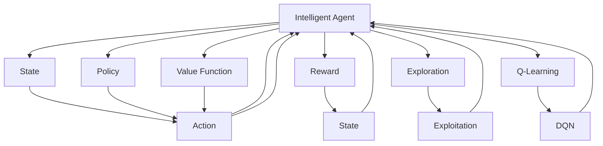

                 

## 1. 背景介绍

在人工智能领域，强化学习（Reinforcement Learning, RL）与传统机器学习、深度学习（Deep Learning, DL）并称为AI三大领域。强化学习是一门研究智能体如何通过与环境交互，智能决策，以最大化长期回报的学科。它不同于监督学习和无监督学习，强调智能体在完成特定任务时，如何在不同状态间进行选择，优化决策策略。

强化学习的诞生，源于上世纪50年代，由赫伯特·西蒙和艾伦·纽厄尔等人提出，最初以马尔科夫决策过程为模型。进入21世纪，深度强化学习的诞生，引入了神经网络等工具，使得强化学习模型可以处理更加复杂的非结构化决策问题。深度强化学习不仅在学术界获得了巨大成功，如AlphaGo战胜人类围棋冠军，AlphaStar横扫星际争霸，也在工业界得到了广泛应用，如Google Dopamine环境，OpenAI Gym等，成为推动AI技术发展的重要动力。

## 2. 核心概念与联系

为了深入理解深度强化学习的原理与实践，本节将详细介绍几个核心概念及其相互关系。

### 2.1 核心概念概述

- 强化学习（Reinforcement Learning, RL）：智能体（agent）在环境中通过探索和尝试，学习最优策略，最大化长期回报的过程。
- 智能体（Agent）：在环境中执行策略的主体，可以是人、机器人或计算机程序。
- 环境（Environment）：智能体行动的外部系统，与智能体交互，提供状态和奖励信号。
- 状态（State）：环境中可观测、可描述的变量集合，智能体当前所处的位置。
- 行动（Action）：智能体可执行的操作或决策。
- 奖励（Reward）：环境对智能体行动的即时反馈，用于指导智能体选择最优策略。
- 策略（Policy）：智能体在给定状态下选择行动的规则或模型。
- 值函数（Value Function）：估计当前状态或策略下的长期回报。
- 探索（Exploration）：智能体在未知状态下进行尝试和探索的过程。
- 利用（Exploitation）：智能体在已知状态下选择最优策略。
- Q-learning（Q-learning）：基于状态-行动-奖励（SAR）对的经验学习算法。
- DQN（Deep Q-Network）：结合深度神经网络的Q-learning算法。

### 2.2 核心概念联系

以上核心概念间的关系可以通过以下Mermaid流程图来展示：



这个流程图展示了强化学习的核心过程：

1. 智能体（Agent）在环境中通过状态（State）进行探索和利用（Action）。
2. 环境根据智能体的行动提供即时反馈（Reward），并更新状态（State）。
3. 智能体利用当前状态和策略（Policy）选择行动（Action）。
4. 值函数（Value Function）用于评估策略的长期回报，指导智能体优化选择。
5. 智能体在探索（Exploration）和利用（Exploitation）间进行平衡，选择最优策略。
6. 经典的Q-learning和DQN算法用于实现强化学习过程。

通过理解这些核心概念，我们可以更好地把握强化学习的本质，并在具体实践中灵活运用。

## 3. 核心算法原理 & 具体操作步骤

### 3.1 算法原理概述

深度强化学习的核心思想是将强化学习算法与深度神经网络结合，实现更高效、更灵活的策略学习。以Q-learning和DQN为例，其基本原理如下：

1. 智能体通过在环境中不断尝试行动，收集状态-行动-奖励（SAR）对的经验。
2. Q-learning通过估计每个状态-行动对的即时回报，即Q值，来指导智能体选择行动。
3. DQN利用神经网络逼近Q值函数，可以处理更加复杂、高维的决策问题。
4. 通过Q值函数的优化，智能体能够学习到最优策略，最大化长期回报。

### 3.2 算法步骤详解

这里以DQN算法为例，详细介绍深度强化学习的具体操作步骤：

1. **环境初始化**：定义环境，收集初始状态。
2. **智能体行动**：智能体根据当前状态选择行动。
3. **环境反馈**：环境根据行动反馈奖励和下一个状态。
4. **状态更新**：智能体接收新状态，重复步骤2-3。
5. **Q值更新**：利用经验回放，随机样本更新Q值，优化策略。
6. **模型更新**：周期性用新经验训练Q值函数，提升模型性能。

### 3.3 算法优缺点

深度强化学习具有以下优点：
1. 能够处理复杂的非结构化决策问题，适合不确定性和动态变化的环境。
2. 利用深度神经网络逼近Q值函数，可以处理高维、复杂的决策空间。
3. 通过经验回放、目标网络更新等技术，提高模型泛化能力和稳定性。

但同时，深度强化学习也存在一些局限性：
1. 样本效率较低，需要大量数据才能收敛。
2. 模型复杂度高，训练和推理成本较高。
3. 策略优化过程较慢，学习效果依赖于初始参数设置。
4. 容易出现过拟合现象，特别是在高维、复杂环境。
5. 模型可解释性不足，难以理解智能体决策过程。

### 3.4 算法应用领域

深度强化学习已经被广泛应用于多个领域，包括游戏AI、机器人控制、自适应系统、自然语言处理等，其核心思想和算法设计具有广泛的适用性。

- 游戏AI：AlphaGo、AlphaStar等深度强化学习模型在围棋、星际争霸等复杂游戏中展现了卓越的智能。
- 机器人控制：DRLab等环境支持深度强化学习模型在多机器人协同、动作生成等方面取得进展。
- 自适应系统：强化学习用于优化资源分配、调度优化、网络安全等自适应场景。
- 自然语言处理：通过对话生成、文本摘要、情感分析等自然语言任务，提高智能系统的语义理解能力。

## 4. 数学模型和公式 & 详细讲解 & 举例说明

### 4.1 数学模型构建

强化学习可以用马尔科夫决策过程（Markov Decision Process, MDP）来建模，其中状态集合为S，行动集合为A，奖励函数为R，策略为π。MDP的状态转移概率为P，值函数为V，最优策略为π*。

- 状态集合：$S=\{s_1,s_2,\dots,s_n\}$。
- 行动集合：$A=\{a_1,a_2,\dots,a_m\}$。
- 奖励函数：$R: S \times A \rightarrow [0, R_{max}]$。
- 状态转移概率：$P: S \times A \rightarrow S$。
- 值函数：$V: S \rightarrow [0, V_{max}]$。
- 最优策略：$π^*: S \rightarrow A$。

### 4.2 公式推导过程

对于状态s，智能体采取行动a，环境反馈奖励r和下一个状态s'，则状态转移概率为：

$$
P(s'|s,a)=\frac{P(s'|s,a)}{\sum_{a'} P(s'|s,a')}
$$

智能体的即时奖励为：

$$
R(s,a)=r(s,a)+γV(s')
$$

其中γ为折扣因子。

强化学习的目标是最优化值函数V，使得

$$
V(s) = \max_{π} E_{s,a}[\sum_{t=0}^{\infty} γ^t R(s_t,a_t)]
$$

即最大化长期回报。

### 4.3 案例分析与讲解

以简化版的Pong游戏为例，来讲解Q-learning和DQN的实现过程。

假设智能体与环境交互，在每个时间步执行如下操作：

1. 智能体从环境中接收状态s，选择行动a。
2. 环境根据智能体行动，反馈奖励r和下一个状态s'。
3. 智能体接收下一个状态s'，更新值函数V，选择新的行动a'。
4. 重复步骤1-3，直到游戏结束。

通过上述过程，智能体能够学习到最优策略π*，最大化长期回报。

## 5. 项目实践：代码实例和详细解释说明

### 5.1 开发环境搭建

在开始DQN的实践之前，我们需要先搭建好开发环境。以下是使用Python进行深度强化学习开发的环境配置流程：

1. 安装Anaconda：从官网下载并安装Anaconda，用于创建独立的Python环境。

2. 创建并激活虚拟环境：
```bash
conda create -n dl-env python=3.8 
conda activate dl-env
```

3. 安装TensorFlow或PyTorch：
```bash
conda install tensorflow=2.7-py3_8 pytorch torchvision torchaudio cudatoolkit=11.1 -c pytorch -c conda-forge
```

4. 安装OpenAI Gym：
```bash
pip install gym
```

5. 安装TensorBoard：用于可视化训练过程：
```bash
pip install tensorboard
```

6. 安装TensorFlow Agents：用于构建深度强化学习模型：
```bash
pip install tensorflow-agents
```

完成上述步骤后，即可在`dl-env`环境中开始深度强化学习的实践。

### 5.2 源代码详细实现

这里以Pong游戏为例，展示如何使用TensorFlow Agents构建和训练DQN模型。

```python
import tensorflow as tf
import gym
import tensorflow_agents.agents.dqn as dqn
import tensorflow_agents.networks.dense_network as dense_network
import tensorflow_agents.networks.distributional_network as distributional_network

# 定义环境
env = gym.make('Pong-v4')

# 定义模型参数
learning_rate = 0.001
target_update_period = 100

# 定义策略网络
state_spec = env.observation_spec()
action_spec = env.action_spec()
dense_net = dense_network.DenseNetwork(
    state_spec, action_spec, learning_rate)
dist_net = distributional_network.DistributionalNetwork(
    state_spec, action_spec, learning_rate)

# 定义DQN模型
dqn_agent = dqn.DQNAgent(
    env,
    strategy=dense_net,
    target_strategy=dist_net,
    target_update_period=target_update_period)

# 定义训练参数
train_params = tf.config.experimental.V2TrainableWorkerParams(
    optimizer=tf.compat.v2.train.AdamOptimizer(learning_rate))

# 定义训练器
train_lib = tf.compat.v2.estimator.CannedTrainer(
    model_fn=dqn_agent,
    trainable_strategy=dense_net,
    trainable_worker_params=train_params)

# 定义训练循环
train_lib.train(env)

# 定义测试循环
test_lib = tf.compat.v2.estimator.CannedEvaluator(
    model_fn=dqn_agent,
    evaluatable_strategy=dense_net,
    evaluatable_worker_params=train_params)
test_lib.evaluate(env)
```

这段代码实现了一个基于DQN的Pong游戏强化学习模型，主要包括环境初始化、模型定义、训练和评估等关键步骤。

### 5.3 代码解读与分析

让我们再详细解读一下关键代码的实现细节：

**env变量**：使用OpenAI Gym的Pong环境，准备强化学习实验。

**state_spec和action_spec**：定义环境的观察空间和动作空间。

**dense_net和dist_net**：定义策略网络，包括原始策略网络和目标策略网络，分别用于探索和利用。

**dqn_agent**：定义DQN模型，将环境、策略网络等参数输入，并设置目标更新周期。

**train_params**：定义训练参数，使用AdamOptimizer优化器。

**train_lib和test_lib**：定义训练器和评估器，用于对DQN模型进行训练和测试。

**train_lib.train()**和**test_lib.evaluate()**：执行训练和评估循环，输出训练和测试结果。

在实际应用中，还需要根据具体问题对代码进行进一步优化和改进，如选择合适的动作空间、设计有效的奖励函数、优化模型训练策略等。

## 6. 实际应用场景

### 6.1 智能机器人控制

深度强化学习在智能机器人控制中的应用非常广泛，能够通过与环境的交互，学习最优的运动策略，实现自主导航、避障、操作物品等复杂任务。

例如，研究人员使用DRLab等环境训练深度强化学习模型，使得机器人能够在复杂室内环境中自主导航，完成从指定点移动到目标点的任务。同时，模型还可以学习避障策略，避免碰撞障碍物。

### 6.2 游戏AI

在游戏AI领域，深度强化学习已经展现出巨大的潜力，可以用于训练智能体在复杂游戏中进行自主决策，从而胜过人类对手。

AlphaGo和AlphaStar的成功，正是得益于深度强化学习的突破性应用。AlphaGo通过与人类围棋高手进行大量对弈，学习到高超的策略，在围棋比赛中取得了巨大成功。AlphaStar则利用深度强化学习在星际争霸中超越了人类选手，成为游戏AI领域的里程碑。

### 6.3 自适应系统

深度强化学习还被应用于资源优化、网络调度等自适应系统，通过智能体的自主决策，提高系统的效率和鲁棒性。

例如，在云计算领域，可以使用深度强化学习模型进行服务器资源优化，根据实时负载情况调整服务器数量和分配，提高资源利用率和稳定性。

## 7. 工具和资源推荐

### 7.1 学习资源推荐

为了帮助开发者系统掌握深度强化学习的理论和实践，这里推荐一些优质的学习资源：

1. 《Reinforcement Learning: An Introduction》书籍：由Richard S. Sutton和Andrew G. Barto合著，全面介绍了强化学习的基本概念和算法。
2. DeepMind论文库：DeepMind的研究论文库，涵盖AlphaGo、AlphaStar、DQN等重要成果。
3. OpenAI Gym文档：OpenAI Gym的官方文档，提供了丰富的环境库和模型库，适合进行实验和研究。
4. TensorFlow Agents文档：TensorFlow Agents的官方文档，提供了构建和训练深度强化学习模型的详细指南。
5. RLlib文档：Ray公司的开源强化学习库，提供了丰富的算法和工具支持。

通过对这些资源的学习实践，相信你一定能够快速掌握深度强化学习的精髓，并用于解决实际的强化学习问题。

### 7.2 开发工具推荐

高效的开发离不开优秀的工具支持。以下是几款用于深度强化学习开发的常用工具：

1. TensorFlow和PyTorch：深度学习框架，支持神经网络的快速构建和训练。
2. OpenAI Gym：环境库，提供了大量经典的强化学习环境。
3. TensorBoard：可视化工具，可以实时监测模型训练状态。
4. Ray Tune：超参数优化工具，可以自动搜索最优参数组合。
5. TensorFlow Agents：强化学习库，提供了丰富的算法和模型支持。

合理利用这些工具，可以显著提升深度强化学习任务的开发效率，加快创新迭代的步伐。

### 7.3 相关论文推荐

深度强化学习的发展离不开学术界的持续研究。以下是几篇奠基性的相关论文，推荐阅读：

1. Deep Q-Networks for Humanoid Robotics（DQN论文）：提出DQN算法，通过深度神经网络逼近Q值函数，实现了复杂决策问题的强化学习。
2. Playing Atari with Deep Reinforcement Learning（AlphaGo论文）：提出AlphaGo算法，结合蒙特卡洛树搜索和深度神经网络，破解了围棋世界冠军。
3. AlphaStar: A General-Reinforcement-Learning Approach to StarCraft II（AlphaStar论文）：提出AlphaStar算法，在星际争霸中取得了人类级成绩。
4. Self-Playing Reinforcement Learning with Generalization via Hindsight Experience Replay（HER论文）：提出HER算法，通过经验回放，提高了强化学习的样本效率。
5. Human-level control through deep reinforcement learning（DQN论文）：提出DQN算法，在Pong等游戏中展现了卓越的智能。

这些论文代表了大规模强化学习的发展脉络，通过学习这些前沿成果，可以帮助研究者把握学科前进方向，激发更多的创新灵感。

## 8. 总结：未来发展趋势与挑战

### 8.1 总结

本文对深度强化学习的原理与实践进行了全面系统的介绍。首先阐述了强化学习的背景和核心概念，明确了深度强化学习在复杂决策问题中的应用前景。其次，从原理到实践，详细讲解了DQN算法和代码实现，展示了深度强化学习的具体步骤。同时，本文还探讨了深度强化学习在机器人控制、游戏AI、自适应系统等诸多领域的应用，展示了其广泛的应用价值。

通过本文的系统梳理，可以看到，深度强化学习在AI技术的发展中扮演了重要角色，具有广阔的应用前景和深远的意义。未来，伴随强化学习模型的不断演进，深度强化学习必将在更多领域展现其巨大的潜力，推动AI技术不断突破新的高度。

### 8.2 未来发展趋势

展望未来，深度强化学习将呈现以下几个发展趋势：

1. 模型复杂度提升。随着算力资源的持续增加，深度强化学习模型将变得更加复杂和强大，能够处理更加复杂和高维的决策问题。
2. 强化学习算法的多样化。除了DQN，未来将涌现更多高效的强化学习算法，如Actor-Critic、PPO等，进一步提高样本效率和模型泛化能力。
3. 模型融合与跨领域应用。深度强化学习将与深度学习、自然语言处理等技术进行更深入的融合，应用于更多领域。
4. 持续学习与终身学习。深度强化学习模型将具备持续学习的能力，不断从新数据中学习，保持其长期的性能和知识更新。
5. 可解释性增强。深度强化学习模型将逐步提升其可解释性，帮助人们理解其决策过程和行为逻辑。
6. 伦理性与安全性。深度强化学习模型将更加注重伦理性和安全性，避免模型输出有害结果，确保其应用的安全可靠。

这些趋势凸显了深度强化学习的发展潜力和广阔前景，未来必将引领AI技术进入新的高度。

### 8.3 面临的挑战

尽管深度强化学习已经取得了巨大成功，但在实际应用中，仍面临诸多挑战：

1. 样本效率低。深度强化学习需要大量数据才能收敛，如何提高样本效率，缩短学习时间，是未来研究的重要方向。
2. 模型复杂度高。深度强化学习模型复杂度高，训练和推理成本高，如何优化模型结构，降低计算成本，是未来研究的重要方向。
3. 可解释性不足。深度强化学习模型往往被视为"黑盒"系统，难以解释其决策过程，如何提高模型可解释性，是未来研究的重要方向。
4. 模型鲁棒性不足。深度强化学习模型面对新环境和新任务时，鲁棒性往往不足，容易过拟合和泛化性差，如何提高模型的鲁棒性和泛化能力，是未来研究的重要方向。
5. 安全性问题。深度强化学习模型在实际应用中可能输出有害结果，如何确保其应用的安全性和伦理性，是未来研究的重要方向。

这些挑战需要通过不断的理论研究和实践优化来解决，才能进一步推动深度强化学习的发展和应用。

### 8.4 研究展望

面对深度强化学习所面临的挑战，未来的研究需要在以下几个方面寻求新的突破：

1. 探索新的模型和算法。研发更高效、更灵活的强化学习模型和算法，如AlphaZero、PPO等，以提高样本效率和模型性能。
2. 优化模型结构和训练过程。采用模型压缩、稀疏化存储等技术，降低计算成本，提高模型可解释性。
3. 强化学习与其他AI技术的融合。将强化学习与自然语言处理、计算机视觉等技术进行融合，应用于更多领域。
4. 提升模型的鲁棒性和泛化能力。引入因果推断、对比学习等方法，提高模型在不同环境下的鲁棒性和泛化能力。
5. 强化学习模型的伦理性与安全保障。引入伦理导向的评估指标，建立模型行为的监管机制，确保模型的伦理性和安全保障。

这些研究方向的探索，必将引领深度强化学习技术迈向更高的台阶，为构建安全、可靠、可解释、可控的智能系统铺平道路。面向未来，深度强化学习还需要与其他人工智能技术进行更深入的融合，共同推动自然语言理解和智能交互系统的进步。只有勇于创新、敢于突破，才能不断拓展强化学习模型的边界，让智能技术更好地造福人类社会。

## 9. 附录：常见问题与解答

**Q1：深度强化学习是否适用于所有决策问题？**

A: 深度强化学习适用于决策问题中，智能体能够在环境中通过学习最优策略，最大化长期回报的场景。但不适合于纯监督学习和无监督学习问题，这些任务通常需要手动标注大量样本。

**Q2：深度强化学习在训练过程中如何处理过拟合问题？**

A: 深度强化学习在训练过程中面临过拟合问题，常见的缓解策略包括：
1. 经验回放：通过随机样本更新模型，减少过拟合风险。
2. 目标网络更新：定期用新经验更新目标网络，保证模型的稳定性和泛化能力。
3. 探索与利用的平衡：在训练过程中，智能体需要在探索和利用之间进行平衡，避免过拟合。

**Q3：深度强化学习在实际应用中如何保证可解释性？**

A: 深度强化学习的模型往往难以解释，可以通过以下方式提升模型的可解释性：
1. 利用可视化工具，如TensorBoard，实时监测模型的训练状态和决策过程。
2. 通过模型简化和特征可视化，理解模型的关键特征和决策路径。
3. 设计任务描述，引导模型按照期望方式输出，增强模型的可解释性。

**Q4：深度强化学习在实际应用中如何提升模型鲁棒性？**

A: 深度强化学习在实际应用中可以通过以下方式提升模型鲁棒性：
1. 引入正则化技术，如L2正则、Dropout等，防止模型过拟合。
2. 采用对抗样本训练，增强模型对噪声和干扰的鲁棒性。
3. 引入多模型集成，提高模型在不同环境下的泛化能力。

**Q5：深度强化学习在实际应用中如何保证安全性？**

A: 深度强化学习在实际应用中可以通过以下方式保证安全性：
1. 引入伦理导向的评估指标，确保模型的行为符合人类价值观和伦理道德。
2. 采用访问鉴权和数据脱敏等措施，保障数据和模型安全。
3. 引入模型行为监管机制，确保模型的输出不会对社会造成负面影响。

这些问题的解答，帮助读者更好地理解深度强化学习的原理和实践，希望在未来的研究中能够发挥更大的作用。

