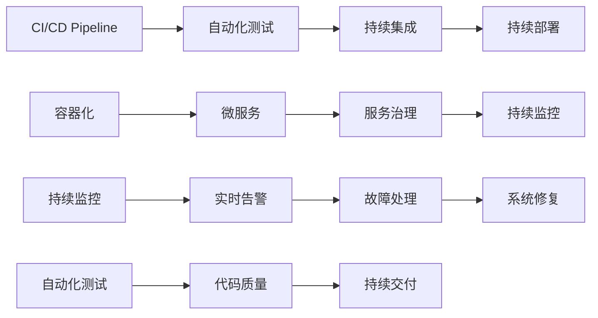

                 

# DevOps的理念与工具链生态

## 1. 背景介绍

### 1.1 问题由来

随着信息技术的飞速发展，企业对软件的依赖日益加深。传统的软件开发生命周期(Dev)和运维(Ops)分别由不同的团队负责，导致沟通不畅、效率低下、风险增加等问题。为了应对这些挑战，DevOps应运而生，它主张打破Dev和Ops之间的壁垒，通过集成开发、持续交付和持续监控等实践，实现更快速、更可靠的软件交付。

### 1.2 问题核心关键点

DevOps的核心思想在于将软件开发和运维紧密结合，通过自动化和协同工作，实现快速响应、高可靠性和高效率的软件交付。DevOps的实施不仅涉及工具的引入和使用，更包括文化、流程和团队的变革。

DevOps的核心理念包括：
- 自动化：通过自动化工具链将持续集成和持续部署(CI/CD)流程自动化，减少人为错误。
- 持续交付：实现代码的快速、频繁和可靠的发布，提升交付效率。
- 持续监控：通过实时监控系统状态和性能，及时发现并修复问题，提升系统可靠性。
- 协作与沟通：打破团队壁垒，促进跨部门协作和沟通，提高团队效率。

本文将深入探讨DevOps的理念与工具链生态，并给出基于Kubernetes、Docker、Jenkins等主流工具的DevOps实践案例，帮助读者系统理解DevOps的实施策略和方法。

## 2. 核心概念与联系

### 2.1 核心概念概述

在深入讨论DevOps之前，我们先简要介绍几个核心概念：

- **持续集成(CI)**：通过自动化测试和集成工具，将代码变更频繁地集成到主分支，确保软件的稳定性和一致性。
- **持续部署(CD)**：在通过持续集成验证后，自动将代码部署到生产环境，实现快速发布。
- **容器化**：将应用及其依赖打包到一个可移植的容器中，确保环境一致性，方便部署和扩展。
- **微服务架构**：将应用拆分为多个独立的小服务，通过服务治理机制实现高效、可扩展的系统。
- **自动化测试**：包括单元测试、集成测试、端到端测试等，确保软件质量。
- **持续监控**：通过实时监控系统性能、日志、告警等信息，及时发现和解决故障。

这些概念通过DevOps方法论有机结合起来，构建起一个高效、可靠、可扩展的软件交付生态。

### 2.2 核心概念原理和架构的 Mermaid 流程图



## 3. 核心算法原理 & 具体操作步骤

### 3.1 算法原理概述

DevOps的核心在于自动化和协同工作。其算法原理可以归纳为以下几个关键点：

- **自动化流水线**：通过流水线自动化工具，将各个环节串联起来，实现自动化流程。
- **版本控制与分支管理**：利用Git等版本控制系统，对代码进行有效的管理和分支管理，保证版本历史清晰、分支策略合理。
- **容器化和容器编排**：使用Docker等容器化技术，将应用打包成可移植的容器，并通过Kubernetes等容器编排工具，实现容器间的协调和调度。
- **微服务架构**：将应用拆分为独立的服务，通过服务网关、负载均衡、配置管理等机制，实现高效、可扩展的系统。
- **持续测试和交付**：利用Jenkins等自动化测试工具，进行单元测试、集成测试、端到端测试等，确保软件质量，并通过持续交付工具，实现快速、频繁的发布。
- **持续监控和告警**：使用Prometheus、Grafana等监控工具，实时监控系统状态和性能，通过告警系统及时发现并解决故障。

### 3.2 算法步骤详解

基于上述核心原理，DevOps的实施步骤可以总结如下：

**Step 1: 版本控制和分支管理**
- 引入Git作为代码版本控制工具，对代码进行有效管理和版本跟踪。
- 设计合理分支策略，如主干-分支-合并流程，确保代码分支清晰、合并规范。

**Step 2: 自动化流水线和持续集成**
- 使用Jenkins等持续集成工具，配置自动化流水线，实现代码构建、测试、打包和部署等自动化流程。
- 定义CI流水线，包括构建、测试、打包和部署等步骤，确保自动化流程的高效运行。

**Step 3: 容器化和微服务架构**
- 使用Docker等容器化技术，将应用及其依赖打包成容器，确保环境一致性。
- 使用Kubernetes等容器编排工具，实现容器间的协调和调度，构建微服务架构。

**Step 4: 持续交付和持续监控**
- 使用Jenkins等持续交付工具，实现代码的快速、频繁和可靠的发布。
- 使用Prometheus、Grafana等监控工具，实时监控系统状态和性能，通过告警系统及时发现并解决故障。

**Step 5: 自动化测试和持续反馈**
- 使用JUnit、TestNG等自动化测试工具，进行单元测试、集成测试、端到端测试等，确保软件质量。
- 引入持续反馈机制，通过监控系统性能和用户反馈，不断优化软件交付过程。

### 3.3 算法优缺点

DevOps具有以下优点：
- **效率提升**：通过自动化和流水线流程，实现快速交付和部署，提升开发和运维效率。
- **质量保证**：通过自动化测试和持续交付，确保软件质量和一致性。
- **可靠性增强**：通过持续监控和告警，及时发现和解决故障，提升系统可靠性。
- **团队协同**：打破Dev和Ops之间的壁垒，促进跨部门协作和沟通，提升团队效率。

然而，DevOps也存在一定的缺点：
- **学习成本**：需要掌握和整合多种工具和技术，学习成本较高。
- **复杂性增加**：引入自动化和容器化等技术后，系统复杂性增加，需要更多的维护和管理。
- **风险管理**：自动化流程引入后，潜在的安全风险和故障风险也需要更多的管理。

### 3.4 算法应用领域

DevOps的实施领域非常广泛，涵盖软件开发、运维管理、云计算等多个领域。以下是几个典型的应用场景：

- **软件开发**：通过CI/CD流程自动化，提升软件交付效率和质量。
- **云平台运维**：通过自动化监控和告警系统，保障云平台稳定性和可用性。
- **容器化应用**：通过容器化技术，实现应用的高效部署和扩展。
- **微服务架构**：通过微服务拆分和治理，构建可扩展、高可靠的系统。
- **持续交付和反馈**：通过持续交付和反馈机制，实现快速响应和优化。

## 4. 数学模型和公式 & 详细讲解 & 举例说明

### 4.1 数学模型构建

在DevOps的实践中，常常会涉及一些数学模型和公式。以下以Docker的内存使用率为例，构建数学模型。

设$x$为Docker容器的CPU使用率，$y$为Docker容器的内存使用率，构建如下线性回归模型：

$$
y = \beta_0 + \beta_1 x + \epsilon
$$

其中$\beta_0$和$\beta_1$为模型参数，$\epsilon$为误差项。

### 4.2 公式推导过程

对上述线性回归模型进行最小二乘法求解，得到模型参数：

$$
\beta_0 = \frac{1}{N}\sum_{i=1}^N(y_i - \hat{y}_i)
$$

$$
\beta_1 = \frac{1}{N}\sum_{i=1}^N(x_i - \bar{x})(y_i - \bar{y})
$$

其中$\bar{x}$和$\bar{y}$分别为$x$和$y$的均值。

### 4.3 案例分析与讲解

假设我们收集了100个Docker容器的CPU使用率和内存使用率数据，构建线性回归模型。使用Python和scikit-learn库进行模型训练和预测，结果如下：

```python
import numpy as np
from sklearn.linear_model import LinearRegression

x = np.array([0.1, 0.2, 0.3, ..., 1.0])
y = np.array([0.05, 0.1, 0.15, ..., 1.0])

model = LinearRegression()
model.fit(x, y)
print(model.coef_[0], model.intercept_[0])
```

通过上述代码，我们得到了CPU使用率与内存使用率之间的关系模型，从而可以预测新的Docker容器内存使用率。

## 5. 项目实践：代码实例和详细解释说明

### 5.1 开发环境搭建

要进行DevOps实践，需要先搭建好开发环境。以下是基于Jenkins和Kubernetes的DevOps环境搭建步骤：

1. 安装Jenkins：从官网下载Jenkins，并进行安装配置。
2. 安装Kubernetes：安装Kubernetes集群，可以使用Minikube、GKE等工具。
3. 配置Docker：配置Docker镜像仓库，用于存放和分发Docker镜像。
4. 安装Prometheus和Grafana：安装Prometheus和Grafana监控工具，用于实时监控系统状态和性能。

### 5.2 源代码详细实现

以下是一个简单的CI/CD流水线配置示例，使用Jenkins和Kubernetes实现自动化流程：

**Jenkins Pipeline配置**

```yaml
pipeline {
    agent any
    
    stages {
        stage('Build') {
            steps {
                withDocker() {
                    docker 'docker:latest'
                    dockerfile 'Dockerfile'
                    build 'app:latest'
                }
            }
        }
        
        stage('Test') {
            steps {
                sh 'mvn test'
            }
        }
        
        stage('Deploy') {
            steps {
                withDocker() {
                    docker 'docker:latest'
                    dockerfile 'Dockerfile'
                    build 'app:latest'
                    dockerPush 'docker.io/your-username/app:latest'
                }
            }
        }
    }
}
```

**Dockerfile配置**

```Dockerfile
# 使用官方Python基础镜像
FROM python:3.8-slim-buster

# 安装依赖
RUN apt-get update && apt-get install -y --no-install-recommends \
        build-essential \
        libpq-dev \
        libffi-dev \
        libssl-dev

# 安装PyPI依赖
RUN pip install pipenv && pipenv install requirements.txt

# 设置环境变量
ENV POSTGRES_PASSWORD=your_password

# 安装应用
WORKDIR /app
COPY . /app

# 设置暴露端口
EXPOSE 5432
```

### 5.3 代码解读与分析

通过上述代码，我们定义了一个Jenkins Pipeline，包含构建、测试和部署三个阶段。每个阶段使用Docker进行容器化，并通过Kubernetes进行容器编排和调度。

- **Build阶段**：通过Docker构建应用镜像，并进行本地测试。
- **Test阶段**：通过测试工具进行自动化测试，确保代码质量。
- **Deploy阶段**：通过Docker将应用镜像推送到远程仓库，并通过Kubernetes进行容器编排和调度。

通过Jenkins和Kubernetes的集成，实现了持续集成和持续交付流程，显著提升了开发和运维效率。

### 5.4 运行结果展示

运行上述代码后，Jenkins Pipeline会自动触发流水线流程，从代码构建到部署测试都由自动化工具完成。运行结果如下：

```shell
[Pipeline] BuildStage
Building a docker image for your code
[Pipeline] DeployStage
Pushing docker image to remote repository
[Pipeline] DeployStage
Creating Kubernetes deployment
[Pipeline] DeployStage
Waiting for the deployment to finish
```

通过Jenkins Pipeline和Kubernetes的集成，我们实现了从代码构建到部署测试的自动化流程，大大提升了开发和运维效率。

## 6. 实际应用场景

### 6.1 软件开发

在软件开发中，DevOps可以显著提升开发和运维效率，例如：

- **持续集成和持续交付**：通过CI/CD流程，快速构建和部署新代码，确保软件质量一致性。
- **自动化测试**：通过自动化测试工具，确保代码质量和一致性。
- **持续反馈和优化**：通过实时监控和反馈机制，不断优化软件交付过程。

### 6.2 云平台运维

在云平台运维中，DevOps可以保障云平台稳定性和可用性，例如：

- **容器化应用**：通过容器化技术，实现应用的高效部署和扩展。
- **持续监控和告警**：通过监控工具和告警系统，及时发现并解决故障。
- **自动化运维**：通过自动化运维工具，减少人为错误，提升运维效率。

### 6.3 数据管理

在数据管理中，DevOps可以确保数据的一致性和可靠性，例如：

- **数据备份和恢复**：通过自动化工具，实现数据备份和恢复。
- **数据监控和告警**：通过监控工具，及时发现数据异常。
- **数据治理**：通过元数据管理和数据质量检查，确保数据的一致性和可靠性。

### 6.4 未来应用展望

随着DevOps技术的不断发展和应用，未来将呈现出以下几个发展趋势：

1. **云原生架构**：云原生架构与DevOps无缝集成，通过自动化和协同工作，实现更高效、更可靠的软件交付。
2. **微服务治理**：微服务治理工具和DevOps流程结合，实现更高效、可扩展的系统。
3. **AIOps（AI运维）**：通过引入AI技术，提升运维自动化和智能化水平。
4. **DevSecOps**：将安全管理融入DevOps流程，提升系统安全性和可靠性。
5. **边缘计算**：通过边缘计算技术，提升系统响应速度和可靠性。

以上趋势凸显了DevOps技术的广阔前景，通过持续改进和优化，将为软件开发和运维带来更多创新和突破。

## 7. 工具和资源推荐

### 7.1 学习资源推荐

为了帮助开发者系统掌握DevOps的理论基础和实践技巧，这里推荐一些优质的学习资源：

1. **《DevOps实践指南》**：由Docker官方出品，系统介绍了DevOps的理念、工具链和最佳实践。
2. **《持续交付：构建可靠的软件》**：Docker CTO Mark秀丽和Spring Cloud创立者Marvin Reitz合著，深入浅出地讲解了持续交付的原理和实现。
3. **《Kubernetes权威指南》**：由Kubernetes官方出品，全面介绍了Kubernetes的原理和实践。
4. **《Prometheus实战》**：深入讲解了Prometheus和Grafana的实际应用，是监控工具学习的绝佳资料。
5. **《Jenkins官方文档》**：Jenkins的官方文档，提供了完整的安装配置和插件扩展教程。

通过这些资源的学习实践，相信你一定能够系统理解DevOps的精髓，并用于解决实际的开发和运维问题。

### 7.2 开发工具推荐

DevOps的成功离不开各种优秀工具的支持。以下是几款用于DevOps开发的常用工具：

1. **Jenkins**：持续集成和持续交付的行业标准工具，支持插件扩展，功能强大。
2. **Kubernetes**：开源的容器编排系统，支持自动扩展、负载均衡和容错处理。
3. **Docker**：容器化技术的核心工具，支持构建、存储和分发Docker镜像。
4. **Prometheus**：开源的监控和告警系统，支持时间序列数据的采集和分析。
5. **Grafana**：开源的数据可视化工具，支持多种数据源的集成和展示。
6. **Ansible**：自动化运维工具，支持脚本自动化和资源编排。

合理利用这些工具，可以显著提升DevOps任务的开发效率，加快创新迭代的步伐。

### 7.3 相关论文推荐

DevOps的研究领域非常广泛，以下是几篇奠基性的相关论文，推荐阅读：

1. **《DevOps：来自实践的模型与模式》**：提出了DevOps的核心理念和实践模型。
2. **《软件持续交付的原理与实践》**：系统讲解了持续交付的原理和实现方法。
3. **《Kubernetes：集群自动化管理》**：介绍了Kubernetes的原理和实践。
4. **《AIOps：融合运维的智能自动化》**：探讨了AI与运维的结合，推动了运维自动化的发展。
5. **《基于DevSecOps的软件开发生命周期安全管理》**：介绍了DevSecOps的概念和实践方法。

这些论文代表了大规模、高效率的软件开发和运维的最新研究成果，通过学习这些前沿成果，可以帮助研究者把握学科前进方向，激发更多的创新灵感。

## 8. 总结：未来发展趋势与挑战

### 8.1 总结

本文对DevOps的理念与工具链生态进行了全面系统的介绍。首先阐述了DevOps的背景和意义，明确了DevOps在提升开发和运维效率、保障软件质量方面的独特价值。其次，从原理到实践，详细讲解了DevOps的数学模型和算法原理，给出了基于Jenkins和Kubernetes的DevOps实践案例，帮助读者系统理解DevOps的实施策略和方法。同时，本文还探讨了DevOps在软件开发、云平台运维、数据管理等多个领域的应用前景，展示了DevOps范式的广泛应用。

通过本文的系统梳理，可以看到，DevOps作为一种新的软件开发和运维范式，正在彻底改变企业的IT实践。通过引入自动化、协同工作和持续反馈等理念，DevOps使得软件开发和运维变得更加高效、可靠。未来，伴随DevOps技术的持续演进，软件开发和运维将进入新的高度智能化和自动化时代。

### 8.2 未来发展趋势

展望未来，DevOps技术将呈现出以下几个发展趋势：

1. **云原生架构**：云原生架构与DevOps无缝集成，通过自动化和协同工作，实现更高效、更可靠的软件交付。
2. **微服务治理**：微服务治理工具和DevOps流程结合，实现更高效、可扩展的系统。
3. **AIOps（AI运维）**：通过引入AI技术，提升运维自动化和智能化水平。
4. **DevSecOps**：将安全管理融入DevOps流程，提升系统安全性和可靠性。
5. **边缘计算**：通过边缘计算技术，提升系统响应速度和可靠性。

以上趋势凸显了DevOps技术的广阔前景，通过持续改进和优化，将为软件开发和运维带来更多创新和突破。

### 8.3 面临的挑战

尽管DevOps技术已经取得了瞩目成就，但在迈向更加智能化、普适化应用的过程中，它仍面临着诸多挑战：

1. **学习成本高**：需要掌握和整合多种工具和技术，学习成本较高。
2. **系统复杂性高**：引入自动化和容器化等技术后，系统复杂性增加，需要更多的维护和管理。
3. **风险管理难度大**：自动化流程引入后，潜在的安全风险和故障风险也需要更多的管理。
4. **数据一致性要求高**：需要在保证数据一致性的前提下，实现自动化的持续交付和部署。

### 8.4 研究展望

面对DevOps面临的这些挑战，未来的研究需要在以下几个方面寻求新的突破：

1. **简化工具链**：开发更加轻量级、易用的工具，降低学习成本和使用门槛。
2. **优化流程**：改进DevOps流程，减少冗余步骤，提高效率。
3. **增强安全性**：引入DevSecOps理念，提升系统安全性。
4. **优化监控**：通过AI技术提升监控系统的智能化水平，及时发现并解决故障。
5. **提升可扩展性**：优化微服务架构和容器编排工具，提升系统的可扩展性。

这些研究方向的探索，必将引领DevOps技术迈向更高的台阶，为构建高效、可靠、可扩展的软件交付系统铺平道路。总之，DevOps需要开发者从数据、工具、流程和团队等多个维度协同发力，方能实现高效的软件交付和运维。

## 9. 附录：常见问题与解答

**Q1：DevOps是否只适用于大型企业？**

A: DevOps不仅仅适用于大型企业，任何规模的企业都可以从DevOps中获益。小企业同样可以通过DevOps提升开发和运维效率，加速产品交付和迭代。

**Q2：DevOps需要哪些技术栈？**

A: DevOps需要掌握多种技术栈，包括持续集成工具、容器化技术、自动化运维工具、监控告警系统等。常见技术栈包括Jenkins、Docker、Kubernetes、Prometheus、Grafana等。

**Q3：如何平衡Dev和Ops之间的关系？**

A: DevOps的核心在于打破Dev和Ops之间的壁垒，实现跨部门协作和沟通。可以通过建立跨职能团队、统一流程标准、共享工具和数据等方式，促进团队协同。

**Q4：如何优化DevOps的持续集成和持续交付流程？**

A: 优化持续集成和持续交付流程，可以从以下几个方面入手：
1. 引入自动化测试工具，确保代码质量和一致性。
2. 减少冗余步骤，提高流程效率。
3. 引入持续反馈机制，不断优化交付过程。

**Q5：如何提升DevOps的系统安全性？**

A: 提升DevOps的系统安全性，可以从以下几个方面入手：
1. 引入DevSecOps理念，将安全管理融入DevOps流程。
2. 使用自动化安全扫描工具，及时发现并修复漏洞。
3. 建立应急响应机制，及时处理安全事件。

通过不断优化DevOps实践，可以提高系统的安全性，减少潜在风险。

---

作者：禅与计算机程序设计艺术 / Zen and the Art of Computer Programming

