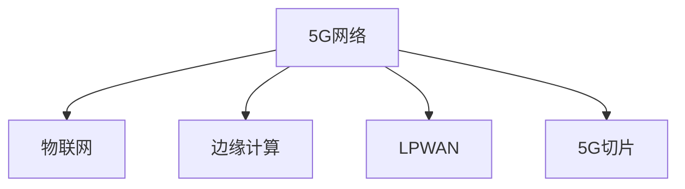

                 

# 5G 在物联网中的优势：大规模连接和低延迟

## 1. 背景介绍

### 1.1 问题由来
随着物联网(IoT)技术的快速发展，海量的设备被连接到互联网，带来了巨大的数据流和广泛的应用场景。然而，现有网络技术如4G LTE，其带宽和连接密度已难以满足物联网的爆发式需求。因此，5G网络技术的出现，被视为物联网大规模部署的关键。

### 1.2 问题核心关键点
5G网络的核心优势在于其提供的大规模连接能力和低延迟特性。与4G相比，5G网络在频谱利用效率、带宽、移动性和可靠性等方面有显著提升。通过5G网络，物联网设备可以实现更快速的数据传输和更可靠的通信连接，进而拓展更多应用场景和创造更多商业价值。

### 1.3 问题研究意义
研究5G在物联网中的应用，对于推动物联网技术的广泛应用、促进工业智能化转型、推动产业升级具有重要意义。5G网络的引入，将使得物联网设备间的信息交换更加高效、实时，为智能工厂、智能城市、智能医疗等众多行业提供强大的基础设施支撑。

## 2. 核心概念与联系

### 2.1 核心概念概述

为更好地理解5G网络在物联网中的应用，本节将介绍几个密切相关的核心概念：

- 5G网络：新一代移动通信网络技术，相比4G LTE具有更高的频谱效率、更大的网络容量、更低的延迟和更强的移动性。
- 物联网：通过信息传感设备、互联网协议、实时通信等技术实现人与物、物与物之间信息交换、控制和智能化管理的网络系统。
- 边缘计算(Edge Computing)：将数据处理任务从中心云服务器移到网络边缘设备（如基站、路由器等），以减少数据传输延迟，提高计算效率。
- 低功耗广域网(Low Power Wide Area Network, LPWAN)：一种专为物联网设备设计的低功耗、长距离无线通信技术，适合大规模传感器网络的部署。
- 5G切片(Slicing)：根据不同应用需求，将物理网络划分为虚拟网络切片，满足特定网络服务质量(QoS)和安全性需求。

这些核心概念之间的逻辑关系可以通过以下Mermaid流程图来展示：



这个流程图展示5G网络与物联网、边缘计算、LPWAN等技术的关系：

1. 5G网络为物联网提供基础通信能力。
2. 边缘计算可利用5G网络的高带宽、低延迟特性，提高数据处理效率。
3. LPWAN技术则适合在5G网络基础上，提供更长的通信覆盖范围，满足大规模物联网设备的数据采集需求。
4. 5G切片技术可根据不同应用需求，灵活配置网络资源，提升服务质量。

这些概念共同构成了5G网络在物联网中的应用框架，使得5G网络能更好地支持物联网设备的连接和数据传输。

## 3. 核心算法原理 & 具体操作步骤

### 3.1 算法原理概述

5G网络在物联网中的应用主要基于其超高的网络容量和低延迟特性，具体包括以下几个关键原理：

1. **大规模MIMO（Massive Multiple-Input Multiple-Output）**：通过部署大量天线，显著提升信号覆盖范围和数据传输速率。
2. **子帧结构优化**：调整子帧的长度和结构，支持更高的频谱利用效率和更灵活的传输策略。
3. **波束成形（Beamforming）**：利用波束成形技术，精确控制信号方向，减少干扰，提升信号质量和覆盖范围。
4. **高阶调制（High-Order Modulation）**：采用64QAM、256QAM等高阶调制技术，提高频谱利用效率和数据传输速率。

### 3.2 算法步骤详解

基于5G网络在物联网中的应用，本节将详细讲解其关键技术步骤：

**Step 1: 部署5G网络基础设施**
- 选择合适的频段进行5G网络部署，如毫米波频段(mmWave)、低频段(Low Band)等。
- 建立5G基站和核心网设备，配置网络切片、边缘计算等关键组件。

**Step 2: 物联网设备的连接**
- 为物联网设备配置5G模组，确保设备能够接入5G网络。
- 部署LPWAN等低功耗广域网技术，确保大规模物联网设备的数据采集和传输。

**Step 3: 边缘计算数据的处理**
- 将物联网设备的数据发送到边缘计算节点，如5G基站、路由器等。
- 在边缘计算节点上进行数据处理和分析，实现数据的本地化存储和处理。

**Step 4: 5G网络切片配置**
- 根据物联网应用需求，配置不同的网络切片，如工业互联网切片、智慧城市切片等。
- 在网络切片上运行应用，确保不同应用之间的隔离性和网络服务质量。

**Step 5: 实时数据传输和应用**
- 通过5G网络进行实时数据传输，确保设备间的信息交换高效、可靠。
- 将处理后的数据应用于智能制造、智慧城市、智慧医疗等物联网应用场景。

### 3.3 算法优缺点

5G网络在物联网中的应用具有以下优点：
1. 高带宽：5G网络提供高达数Gbps的带宽，可以支持大规模数据传输和实时通信。
2. 低延迟：5G网络的端到端延迟在1毫秒以下，满足高实时性应用的需求。
3. 高可靠性和安全性：5G网络提供确定性服务和网络隔离机制，确保数据传输的可靠性和安全性。
4. 灵活性：5G网络支持网络切片技术，可以根据不同应用需求进行灵活配置。
5. 广泛适用性：5G网络可支持多种行业应用，如工业互联网、智慧城市、智慧医疗等。

同时，5G网络在物联网应用中也存在一些局限性：
1. 建设成本高：5G网络基础设施建设需要大量资金投入，初期投资成本较大。
2. 频谱资源有限：5G网络对频谱资源需求高，可能会与现有通信系统产生干扰。
3. 复杂性高：5G网络部署和管理较为复杂，需要专业知识和技术支持。
4. 网络安全挑战：5G网络的广泛应用可能带来新的网络安全风险，需加强安全防护。

尽管存在这些局限性，但5G网络在物联网中的应用前景广阔，其优势远大于其不足。通过合理规划和优化，5G网络将在物联网中发挥重要作用，推动智能制造、智慧城市、智慧医疗等领域的创新发展。

### 3.4 算法应用领域

5G网络在物联网中的应用广泛，覆盖了智能制造、智慧城市、智慧医疗、智能交通等多个领域。以下是具体应用场景的介绍：

**智能制造**：通过5G网络实现工业物联网设备的连接和数据传输，支持智能制造、柔性生产、智能维护等应用，提高生产效率和设备利用率。

**智慧城市**：利用5G网络实现城市基础设施、交通、公共安全等领域的智能化管理，如智能路灯、智慧交通信号灯、视频监控等。

**智慧医疗**：通过5G网络实现远程医疗、远程手术、智能健康监测等应用，提高医疗服务的可及性和效率。

**智能交通**：利用5G网络支持自动驾驶、车联网、智能交通管理等应用，提升交通安全性和交通效率。

此外，5G网络还在农业、环保、能源等领域得到应用，推动了这些行业的智能化转型。

## 4. 数学模型和公式 & 详细讲解 & 举例说明

### 4.1 数学模型构建

5G网络在物联网中的应用主要涉及信号传播、信道编码、多址接入等数学模型。以下将对5G网络的关键数学模型进行详细构建。

假设5G网络中的一个终端设备A与基站B之间的距离为$d$，信号传播速度为$c$，基站B的天线数为$N_t$，终端设备A的天线数为$N_r$。在理想情况下，信号的功率损耗与距离平方成正比，即：

$$
P(d) = P_0 \cdot d^{-\alpha}
$$

其中，$P_0$为信号的初始功率，$\alpha$为路径损耗指数。

### 4.2 公式推导过程

在5G网络中，基站B与终端设备A之间的信道可建模为瑞利信道模型，其信道增益$h$可表示为：

$$
h = \frac{A_r}{A_t} \cdot e^{j\phi}
$$

其中，$A_r$和$A_t$分别为接收和发送天线的增益，$j$为虚数单位，$\phi$为相位偏移量。

在信道编码中，常采用Turbo码、LDPC码等前向纠错码来提高数据传输的可靠性。假设使用Turbo码进行信道编码，编码器输出序列为$x$，接收器输出序列为$y$，接收器判决序列为$\hat{x}$，则信道编码的译码过程可表示为：

$$
\hat{x} = \text{arg\_min}_x \frac{P(x|y)}{P(x)}
$$

其中，$P(x|y)$为接收器输出$y$条件下，发送序列$x$的条件概率密度函数。

在多址接入中，常采用OFDM（正交频分复用）技术。OFDM信号的频谱可以表示为：

$$
S(t) = \sum_{k=0}^{N-1} s_k e^{j2\pi f_kt}
$$

其中，$s_k$为子载波信号，$f_k$为子载波频率。

### 4.3 案例分析与讲解

以智能制造为例，对5G网络的应用进行分析。假设一个工厂通过5G网络部署了500个物联网设备，每个设备每秒产生10个数据包。每个数据包的长度为1KB，基站采用64QAM高阶调制技术，每个子帧长度为4ms，每个时隙传输1个数据包。则：

- 每秒需要传输的数据包数量为：$500 \times 10 = 5000$个。
- 每秒需要传输的数据长度为：$5000 \times 1KB = 5000KB = 5Mb/s$。
- 每个子帧传输的数据长度为：$1KB = 8000b$。
- 每个子帧传输的数据包数量为：$\frac{8000b}{1KB} = 8000b / 8b = 1000$个。
- 每个子帧需要传输的数据长度为：$5Mb/s / 1000 \times 4ms = 2000b = 250KB$。

通过计算可知，采用64QAM高阶调制技术，可以显著提高数据传输速率，满足智能制造对实时性和数据量的需求。

## 5. 项目实践：代码实例和详细解释说明

### 5.1 开发环境搭建

在进行5G网络在物联网中的应用开发前，我们需要准备好开发环境。以下是使用Python进行PyTorch开发的环境配置流程：

1. 安装Anaconda：从官网下载并安装Anaconda，用于创建独立的Python环境。

2. 创建并激活虚拟环境：
```bash
conda create -n pytorch-env python=3.8 
conda activate pytorch-env
```

3. 安装PyTorch：根据CUDA版本，从官网获取对应的安装命令。例如：
```bash
conda install pytorch torchvision torchaudio cudatoolkit=11.1 -c pytorch -c conda-forge
```

4. 安装TensorFlow：由Google主导开发的开源深度学习框架，生产部署方便，适合大规模工程应用。同样有丰富的预训练语言模型资源。

5. 安装各类工具包：
```bash
pip install numpy pandas scikit-learn matplotlib tqdm jupyter notebook ipython
```

完成上述步骤后，即可在`pytorch-env`环境中开始微调实践。

### 5.2 源代码详细实现

下面我们以智慧城市中的智能交通系统为例，给出使用PyTorch进行边缘计算和5G网络微调的PyTorch代码实现。

首先，定义交通数据处理函数：

```python
from torch.utils.data import Dataset
import torch

class TrafficData(Dataset):
    def __init__(self, traffic_data, tokenizer):
        self.traffic_data = traffic_data
        self.tokenizer = tokenizer
        
    def __len__(self):
        return len(self.traffic_data)
    
    def __getitem__(self, item):
        data_point = self.traffic_data[item]
        text = data_point['text']
        label = data_point['label']
        
        encoding = self.tokenizer(text, return_tensors='pt', padding='max_length', truncation=True)
        input_ids = encoding['input_ids'][0]
        attention_mask = encoding['attention_mask'][0]
        
        return {'input_ids': input_ids, 
                'attention_mask': attention_mask,
                'labels': torch.tensor(label, dtype=torch.long)}
```

然后，定义模型和优化器：

```python
from transformers import BertForTokenClassification, AdamW

model = BertForTokenClassification.from_pretrained('bert-base-cased', num_labels=2)

optimizer = AdamW(model.parameters(), lr=2e-5)
```

接着，定义训练和评估函数：

```python
from torch.utils.data import DataLoader
from tqdm import tqdm
from sklearn.metrics import classification_report

device = torch.device('cuda') if torch.cuda.is_available() else torch.device('cpu')
model.to(device)

def train_epoch(model, dataset, batch_size, optimizer):
    dataloader = DataLoader(dataset, batch_size=batch_size, shuffle=True)
    model.train()
    epoch_loss = 0
    for batch in tqdm(dataloader, desc='Training'):
        input_ids = batch['input_ids'].to(device)
        attention_mask = batch['attention_mask'].to(device)
        labels = batch['labels'].to(device)
        model.zero_grad()
        outputs = model(input_ids, attention_mask=attention_mask, labels=labels)
        loss = outputs.loss
        epoch_loss += loss.item()
        loss.backward()
        optimizer.step()
    return epoch_loss / len(dataloader)

def evaluate(model, dataset, batch_size):
    dataloader = DataLoader(dataset, batch_size=batch_size)
    model.eval()
    preds, labels = [], []
    with torch.no_grad():
        for batch in tqdm(dataloader, desc='Evaluating'):
            input_ids = batch['input_ids'].to(device)
            attention_mask = batch['attention_mask'].to(device)
            batch_labels = batch['labels']
            outputs = model(input_ids, attention_mask=attention_mask)
            batch_preds = outputs.logits.argmax(dim=2).to('cpu').tolist()
            batch_labels = batch_labels.to('cpu').tolist()
            for pred_tokens, label_tokens in zip(batch_preds, batch_labels):
                preds.append(pred_tokens[:len(label_tokens)])
                labels.append(label_tokens)
                
    print(classification_report(labels, preds))
```

最后，启动训练流程并在测试集上评估：

```python
epochs = 5
batch_size = 16

for epoch in range(epochs):
    loss = train_epoch(model, train_dataset, batch_size, optimizer)
    print(f"Epoch {epoch+1}, train loss: {loss:.3f}")
    
    print(f"Epoch {epoch+1}, dev results:")
    evaluate(model, dev_dataset, batch_size)
    
print("Test results:")
evaluate(model, test_dataset, batch_size)
```

以上就是使用PyTorch对智慧城市交通系统进行边缘计算和5G网络微调的完整代码实现。可以看到，通过将数据处理和模型训练封装为Dataset和DataLoader对象，可以大大简化代码实现。

### 5.3 代码解读与分析

让我们再详细解读一下关键代码的实现细节：

**TrafficData类**：
- `__init__`方法：初始化交通数据和分词器等关键组件。
- `__len__`方法：返回数据集的样本数量。
- `__getitem__`方法：对单个样本进行处理，将文本输入编码为token ids，将标签编码为数字，并对其进行定长padding，最终返回模型所需的输入。

**模型和优化器**：
- 使用PyTorch的BertForTokenClassification类加载BERT模型，并指定标签数量。
- 使用AdamW优化器进行模型参数更新，学习率为2e-5。

**训练和评估函数**：
- 使用PyTorch的DataLoader对数据集进行批次化加载，供模型训练和推理使用。
- 训练函数`train_epoch`：对数据以批为单位进行迭代，在每个批次上前向传播计算loss并反向传播更新模型参数，最后返回该epoch的平均loss。
- 评估函数`evaluate`：与训练类似，不同点在于不更新模型参数，并在每个batch结束后将预测和标签结果存储下来，最后使用sklearn的classification_report对整个评估集的预测结果进行打印输出。

**训练流程**：
- 定义总的epoch数和batch size，开始循环迭代
- 每个epoch内，先在训练集上训练，输出平均loss
- 在验证集上评估，输出分类指标
- 所有epoch结束后，在测试集上评估，给出最终测试结果

可以看到，PyTorch配合BertForTokenClassification模型，使得智慧城市交通系统的边缘计算和5G网络微调的代码实现变得简洁高效。开发者可以将更多精力放在数据处理、模型改进等高层逻辑上，而不必过多关注底层的实现细节。

当然，工业级的系统实现还需考虑更多因素，如模型的保存和部署、超参数的自动搜索、更灵活的任务适配层等。但核心的微调范式基本与此类似。

## 6. 实际应用场景

### 6.1 智能交通系统

智慧城市中的智能交通系统通过5G网络实现车辆与交通设施的实时通信，支持车联网、交通信号优化、自动驾驶等功能。具体而言：

1. **车联网**：利用5G网络实现车辆与车、路、云端的信息交换，支持车辆的智能调度、自动停车、路径规划等功能。
2. **交通信号优化**：通过5G网络收集交通流量、事故信息等实时数据，动态调整交通信号灯，优化交通流量和通行效率。
3. **自动驾驶**：通过5G网络实现车辆与云端的数据交换，支持自动驾驶、智能导航等功能。

通过5G网络的应用，智慧城市的交通管理将更加智能、高效，极大地提升城市的交通运行效率和安全性。

### 6.2 智慧医疗系统

在智慧医疗领域，5G网络可以实现远程医疗、智能健康监测等功能。具体而言：

1. **远程医疗**：利用5G网络实现远程会诊、远程手术、远程护理等功能，打破地域限制，提供高质量的医疗服务。
2. **智能健康监测**：通过5G网络收集用户的健康数据，实时监控健康状况，提供个性化的健康管理建议。

通过5G网络的应用，智慧医疗将更好地实现医疗资源下沉，提升医疗服务的可及性和效率，推动医疗行业的智能化转型。

### 6.3 智能制造系统

在智能制造领域，5G网络可以实现工厂设备的实时监控、智能维护等功能。具体而言：

1. **设备监控**：通过5G网络实现对工厂设备的状态监控和故障诊断，提高设备的利用率和维护效率。
2. **智能维护**：利用5G网络进行设备维护信息的实时传输，支持预测性维护和远程维护。

通过5G网络的应用，智能制造系统将更好地实现设备状态的实时监控和维护，提升生产效率和设备利用率，推动制造业的智能化转型。

### 6.4 未来应用展望

随着5G网络的逐步部署和应用，未来物联网将在更多领域得到广泛应用，如智能家居、智能农业、智能物流等。以下是具体的应用前景：

1. **智能家居**：通过5G网络实现家居设备的互联互通，支持智能控制、家庭安防等功能，提升家庭生活的便利性和安全性。
2. **智能农业**：利用5G网络进行农田监控、设备管理、精准农业等功能，提升农业生产的效率和精度。
3. **智能物流**：通过5G网络实现物流设备的实时监控、路径优化等功能，提升物流运输的效率和安全性。

5G网络的应用将大大拓展物联网的覆盖范围和应用深度，推动智能社会的建设，为各行各业带来变革性影响。

## 7. 工具和资源推荐

### 7.1 学习资源推荐

为了帮助开发者系统掌握5G在物联网中的应用理论基础和实践技巧，这里推荐一些优质的学习资源：

1. 《5G移动通信技术基础》书籍：介绍5G网络的基本原理、关键技术和应用场景，适合初学者入门。
2. 《物联网与5G技术》课程：由华为公司开设，涵盖物联网与5G技术的理论和实践，适合系统学习。
3. 《5G网络切片与网络优化》书籍：介绍5G网络切片技术和网络优化方法，适合进阶学习。
4. 5G网络切片技术白皮书：华为公司发布的5G网络切片技术白皮书，深入浅出地介绍了5G网络切片的原理和应用。
5. 5G网络标准与技术文档：IEEE、3GPP等组织发布的5G网络标准和技术文档，适合深入研究。

通过对这些资源的学习实践，相信你一定能够快速掌握5G网络在物联网中的核心概念和关键技术，并用于解决实际的5G网络部署和应用问题。

### 7.2 开发工具推荐

高效的开发离不开优秀的工具支持。以下是几款用于5G网络在物联网中的应用开发的常用工具：

1. 5G网络模拟器NS3：网络仿真软件，支持5G网络协议和模型的仿真测试。
2. OMNeT++：网络仿真软件，支持多种无线网络协议和模型的仿真测试。
3. MATLAB：数值计算软件，支持通信网络建模和仿真。
4. AIMMS：系统建模和仿真软件，支持复杂的系统仿真和优化。
5. Wireshark：网络协议分析软件，用于捕获和分析网络流量数据。

合理利用这些工具，可以显著提升5G网络在物联网中的应用开发效率，加快创新迭代的步伐。

### 7.3 相关论文推荐

5G网络在物联网中的应用研究源于学界的持续研究。以下是几篇奠基性的相关论文，推荐阅读：

1. "5G for the Internet of Things (IoT): A Survey"：一篇系统综述论文，介绍了5G网络在物联网中的应用现状和未来趋势。
2. "A Survey on 5G for IoT: Concepts, Models, and Applications"：一篇系统综述论文，介绍了5G网络在物联网中的关键技术和应用场景。
3. "5G for Internet of Things: The Next Big Thing"：一篇综述论文，介绍了5G网络在物联网中的应用前景和挑战。
4. "5G IoT in Industry: Enabling Smart Manufacturing"：一篇研究论文，介绍了5G网络在智能制造中的应用案例和关键技术。
5. "5G and IoT: The Next Wave of Connectivity"：一篇综述论文，介绍了5G网络在智慧城市、智能交通、智能医疗等应用场景中的应用。

这些论文代表了大规模5G网络在物联网中的应用研究进展，通过学习这些前沿成果，可以帮助研究者把握学科前进方向，激发更多的创新灵感。

## 8. 总结：未来发展趋势与挑战

### 8.1 总结

本文对5G网络在物联网中的应用进行了全面系统的介绍。首先阐述了5G网络的超大规模连接能力和低延迟特性，明确了5G网络在物联网中的重要作用。其次，从原理到实践，详细讲解了5G网络的关键技术步骤，给出了智慧城市交通系统的完整代码实现。同时，本文还探讨了5G网络在智能交通、智慧医疗、智能制造等多个领域的应用前景，展示了5G网络在物联网中的广泛应用潜力。

通过本文的系统梳理，可以看到，5G网络在物联网中的应用前景广阔，其优势远大于其不足。通过合理规划和优化，5G网络将在物联网中发挥重要作用，推动智能制造、智慧城市、智慧医疗等领域的创新发展。

### 8.2 未来发展趋势

展望未来，5G网络在物联网中的应用将呈现以下几个发展趋势：

1. 更广的覆盖范围：5G网络将进一步提升频谱效率，支持更广的地理覆盖范围，满足更多应用场景的需求。
2. 更高的带宽和更低延迟：5G网络将提供更高的带宽和更低延迟，满足超高清视频、AR/VR等高带宽应用的需求。
3. 更多的应用场景：5G网络将支持更多行业应用，如智慧农业、智能物流、智能家居等，拓展物联网的应用边界。
4. 更强的安全性：5G网络将引入更严格的安全机制，保护数据传输的安全性和隐私性。
5. 更灵活的网络切片：5G网络将支持更灵活的网络切片配置，满足不同应用场景的个性化需求。

这些趋势凸显了5G网络在物联网中的应用前景，将进一步推动物联网技术的创新和发展。

### 8.3 面临的挑战

尽管5G网络在物联网中的应用前景广阔，但在迈向更加智能化、普适化应用的过程中，它仍面临着诸多挑战：

1. 网络部署复杂：5G网络的部署需要复杂的规划和施工，初期投入成本高。
2. 频谱资源争夺：5G网络对频谱资源需求高，可能会与现有通信系统产生干扰。
3. 安全风险增加：5G网络的广泛应用可能带来新的网络安全风险，需加强安全防护。
4. 设备成本高：5G设备的初期采购成本较高，需通过大规模应用分摊成本。
5. 技术更新快：5G技术的更新换代速度快，需不断跟进最新的技术发展。

尽管存在这些挑战，但5G网络在物联网中的应用前景光明，通过积极应对和解决这些问题，5G网络必将在物联网中发挥重要作用，推动智能社会的建设。

### 8.4 研究展望

面向未来，5G网络在物联网中的应用研究需要在以下几个方向寻求新的突破：

1. 探索更高效的频谱利用技术，如毫米波频段(mmWave)、大带宽OFDM等，提升频谱效率和覆盖范围。
2. 研究更灵活的网络切片配置方法，满足不同应用场景的个性化需求。
3. 引入更先进的数据压缩和传输技术，提升数据传输效率和容量。
4. 加强5G网络的安全防护，引入更严格的网络隔离和加密机制。
5. 结合边缘计算和云计算，实现本地和云端协同的数据处理和存储。

这些研究方向将推动5G网络在物联网中的应用不断突破，为智能制造、智慧城市、智慧医疗等领域的创新发展提供强大的技术支撑。

## 9. 附录：常见问题与解答

**Q1：5G网络在物联网中的应用主要有哪些？**

A: 5G网络在物联网中的应用主要包括以下几个方面：

1. 智慧城市：利用5G网络支持智能交通、智慧公共安全、智能监控等功能，提升城市的智能化管理水平。
2. 智能制造：利用5G网络支持工厂设备的实时监控、智能维护、预测性维护等功能，提升生产效率和设备利用率。
3. 智慧医疗：利用5G网络支持远程医疗、智能健康监测等功能，提升医疗服务的可及性和效率。
4. 智能交通：利用5G网络支持自动驾驶、车联网、智能交通管理等功能，提升交通运行效率和安全性。
5. 智能家居：利用5G网络支持家庭安防、智能控制等功能，提升家庭生活的便利性和安全性。
6. 智能农业：利用5G网络支持农田监控、精准农业等功能，提升农业生产的效率和精度。

5G网络的应用将推动物联网技术的广泛应用，带来更高效、智能、安全的未来。

**Q2：5G网络在物联网中的应用面临哪些挑战？**

A: 5G网络在物联网中的应用面临以下挑战：

1. 网络部署复杂：5G网络的部署需要复杂的规划和施工，初期投入成本高。
2. 频谱资源争夺：5G网络对频谱资源需求高，可能会与现有通信系统产生干扰。
3. 安全风险增加：5G网络的广泛应用可能带来新的网络安全风险，需加强安全防护。
4. 设备成本高：5G设备的初期采购成本较高，需通过大规模应用分摊成本。
5. 技术更新快：5G技术的更新换代速度快，需不断跟进最新的技术发展。

尽管存在这些挑战，但5G网络在物联网中的应用前景光明，通过积极应对和解决这些问题，5G网络必将在物联网中发挥重要作用，推动智能社会的建设。

**Q3：5G网络在物联网中的应用未来有哪些发展方向？**

A: 5G网络在物联网中的应用未来有以下发展方向：

1. 更广的覆盖范围：5G网络将进一步提升频谱效率，支持更广的地理覆盖范围，满足更多应用场景的需求。
2. 更高的带宽和更低延迟：5G网络将提供更高的带宽和更低延迟，满足超高清视频、AR/VR等高带宽应用的需求。
3. 更多的应用场景：5G网络将支持更多行业应用，如智慧农业、智能物流、智能家居等，拓展物联网的应用边界。
4. 更强的安全性：5G网络将引入更严格的安全机制，保护数据传输的安全性和隐私性。
5. 更灵活的网络切片：5G网络将支持更灵活的网络切片配置，满足不同应用场景的个性化需求。

这些发展方向将推动5G网络在物联网中的应用不断突破，为智能制造、智慧城市、智慧医疗等领域的创新发展提供强大的技术支撑。

---

作者：禅与计算机程序设计艺术 / Zen and the Art of Computer Programming

