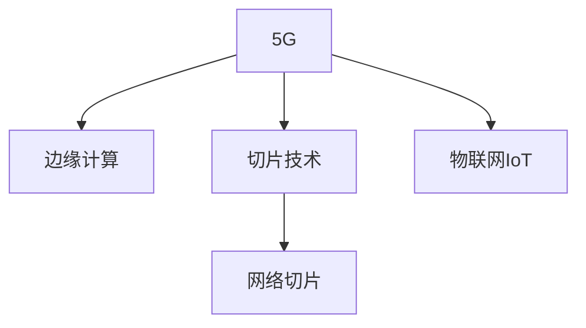

                 

# 5G 在物联网中的优势：支持大规模物联网

## 1. 背景介绍

### 1.1 问题由来

随着物联网设备的快速增长和部署，对网络的带宽、延迟和可靠性提出了更高的要求。传统的Wi-Fi和蜂窝网络难以满足这些需求，特别是对于高密度、低时延和大规模数据传输等场景，急需一种新的网络技术。

5G作为新一代移动通信技术，不仅提供了更高的带宽、更低的延迟和更大的连接密度，还在网络架构和应用场景上进行了重大创新。本文将详细探讨5G技术在物联网中的优势，以及它如何支持大规模物联网。

## 2. 核心概念与联系

### 2.1 核心概念概述

为更好地理解5G在物联网中的应用，本节将介绍几个密切相关的核心概念：

- **5G**：即第五代移动通信技术，提供了更高的带宽、更低的延迟和更大的连接密度，支持多种新型网络架构和应用场景。
- **物联网(IoT)**：通过各种通信手段将物体连接起来，实现智能化管理和优化，涵盖了工业互联网、智慧城市、智慧医疗等多个领域。
- **边缘计算**：将数据处理和存储从云端向网络边缘转移，减少了时延，提高了数据处理效率。
- **切片技术**：将物理网络分割成多个虚拟网络，每个切片提供定制化的服务质量(QoS)和业务功能。
- **网络切片**：基于切片技术，5G网络能够提供多种定制化的网络服务，满足不同业务需求。

这些核心概念之间的逻辑关系可以通过以下Mermaid流程图来展示：



这个流程图展示的核心概念之间的联系：

1. 5G提供了基础的网络能力，包括更高的带宽、更低的延迟和更大的连接密度。
2. 边缘计算利用5G的这些能力，在网络边缘处理数据，减少了时延，提高了数据处理效率。
3. 切片技术将物理网络分割成多个虚拟网络，每个切片提供定制化的服务质量(QoS)和业务功能。
4. 网络切片基于切片技术，5G网络能够提供多种定制化的网络服务，满足不同业务需求。

5G网络和大规模物联网的结合，通过边缘计算和网络切片等技术手段，实现了对海量设备的智能化管理和优化，为工业互联网、智慧城市、智慧医疗等领域带来了深远的影响。

## 3. 核心算法原理 & 具体操作步骤
### 3.1 算法原理概述

5G在物联网中的应用，本质上是通过其先进的网络技术和大规模边缘计算架构，支持海量设备的高效数据传输、处理和存储。其核心算法原理可以概括为以下几个方面：

- **高带宽和大连接密度**：5G提供了更高的带宽和更大的连接密度，能够支持大规模物联网设备的网络接入。
- **低延迟和高可靠性**：5G网络的低延迟和高可靠性，确保了数据传输的实时性和稳定性。
- **边缘计算**：通过将数据处理和存储从云端向网络边缘转移，5G网络能够大幅降低时延，提高数据处理效率。
- **网络切片**：利用切片技术，5G网络能够提供多种定制化的网络服务，满足不同物联网应用的需求。

### 3.2 算法步骤详解

基于5G的大规模物联网应用，一般包括以下几个关键步骤：

**Step 1: 网络部署与设备接入**
- 部署5G基站和边缘计算节点，确保网络覆盖和连接质量。
- 将物联网设备接入网络，通过预定义的通信协议进行数据传输。

**Step 2: 数据处理与存储**
- 利用边缘计算节点对采集到的数据进行预处理和计算，减少数据传输到云端的负担。
- 通过网络切片技术，根据不同的应用需求提供定制化的网络服务，如高带宽、低延迟等。

**Step 3: 应用集成与优化**
- 将处理后的数据集成到应用系统中，实现智能监控、预测、控制等功能。
- 根据应用场景和业务需求，优化网络配置和数据处理算法，提升系统性能和稳定性。

**Step 4: 持续优化与升级**
- 定期采集网络性能数据和应用反馈，进行网络优化和性能调优。
- 根据技术发展和业务需求的变化，进行网络架构和应用的升级迭代。

### 3.3 算法优缺点

基于5G的大规模物联网应用，具有以下优点：

- **高效性**：5G提供了更高的带宽和更大的连接密度，能够支持海量设备的网络接入和数据传输。
- **实时性**：低延迟和高可靠性确保了数据传输的实时性和稳定性，适用于对延迟敏感的应用场景。
- **灵活性**：网络切片技术能够提供多种定制化的网络服务，满足不同物联网应用的需求。
- **扩展性**：边缘计算能够将数据处理和存储从云端向网络边缘转移，减少了时延，提高了数据处理效率。

同时，该方法也存在一定的局限性：

- **部署成本高**：部署5G基站和边缘计算节点需要较高的初始投资和维护成本。
- **网络复杂性**：5G网络架构复杂，需要精细的网络管理和维护。
- **数据隐私和安全**：大规模数据采集和传输可能带来数据隐私和安全问题，需要采取有效的防护措施。

尽管存在这些局限性，但就目前而言，5G与大规模物联网的结合，在提升网络效率和应用性能方面具有不可替代的优势。未来相关研究的重点在于如何进一步降低部署成本，提高网络灵活性和数据隐私保护，同时兼顾网络稳定性和扩展性等因素。

### 3.4 算法应用领域

基于5G的大规模物联网应用，已经在诸多领域得到广泛应用，例如：

- **工业互联网**：通过5G网络实现工厂设备的智能监控、预测性维护和远程操作。
- **智慧城市**：利用5G网络进行城市交通管理、环境监测和公共安全等应用。
- **智慧医疗**：通过5G网络实现远程医疗、智能诊断和健康监测等应用。
- **智能农业**：利用5G网络进行农业设备监控、病虫害预测和精准农业管理。
- **智能制造**：通过5G网络实现生产设备的智能化管理、生产过程优化和质量控制。

除了上述这些经典领域外，5G在物联网中的应用还将拓展到更多新兴领域，如智能物流、智慧交通、智能家居等，为各个行业带来新的创新和变革。

## 4. 数学模型和公式 & 详细讲解  
### 4.1 数学模型构建

5G在物联网中的应用，涉及多个学科领域的数学模型。本节将从通信网络模型和边缘计算模型两个方面，详细介绍其数学构建过程。

**通信网络模型**
5G网络通信模型可以简化为一个有向图$G=(V,E)$，其中$V$为节点集，$E$为边集。节点表示基站、边缘计算节点和物联网设备，边表示设备与节点之间的通信链路。

假设每个节点的通信容量为$C$，带宽为$B$，则整个网络的带宽$W$可以表示为：

$$
W = \sum_{i \in V} C_iB_i
$$

其中$i$表示节点编号。

**边缘计算模型**
边缘计算模型可以简化为一个加权有向图$G=(V,E,W)$，其中$W$为边权，表示数据从设备到节点的传输速率。每个节点$j \in V$的处理能力为$P_j$，处理延迟为$D_j$，则节点$j$的计算能力$C_j$可以表示为：

$$
C_j = \frac{W_j}{D_j}
$$

其中$W_j$表示节点$j$的带宽。

### 4.2 公式推导过程

在上述数学模型构建的基础上，我们可以进一步推导5G网络在物联网中的应用公式。

**通信网络带宽推导**
根据通信网络模型的定义，5G网络的带宽$W$可以表示为：

$$
W = \sum_{i \in V} C_iB_i = \sum_{i \in V} \frac{W_i}{D_i}B_i
$$

其中$C_i$表示节点$i$的处理能力，$B_i$表示节点$i$的带宽。

**边缘计算能力推导**
根据边缘计算模型的定义，每个节点的计算能力$C_j$可以表示为：

$$
C_j = \frac{W_j}{D_j}
$$

其中$W_j$表示节点$j$的带宽，$D_j$表示节点$j$的处理延迟。

### 4.3 案例分析与讲解

以工业互联网应用为例，分析5G网络的带宽和边缘计算能力。

假设一个工厂内有多个生产设备和传感器，每个设备每秒生成1GB的数据。工厂部署了5G基站和多个边缘计算节点，每个节点的处理能力为10GB/s，处理延迟为1ms。

根据上述模型，计算每个节点的计算能力：

$$
C_j = \frac{W_j}{D_j} = \frac{5}{1} = 5GB/s
$$

因此，每个边缘计算节点的计算能力为5GB/s。工厂整体的计算能力可以通过以下公式计算：

$$
C_{total} = \sum_{j \in V} C_j = \sum_{j \in V} \frac{W_j}{D_j}
$$

其中$W_j$表示节点$j$的带宽，$D_j$表示节点$j$的处理延迟。

假设工厂内的边缘计算节点数量为3个，每个节点的带宽为5GB/s，则计算能力为：

$$
C_{total} = \frac{5}{1} + \frac{5}{1} + \frac{5}{1} = 15GB/s
$$

因此，工厂整体的计算能力为15GB/s。通过边缘计算，工厂能够实现大规模数据的实时处理和分析，提升生产效率和质量。

## 5. 项目实践：代码实例和详细解释说明
### 5.1 开发环境搭建

在进行5G在物联网中的应用实践前，我们需要准备好开发环境。以下是使用Python进行开发的环境配置流程：

1. 安装Anaconda：从官网下载并安装Anaconda，用于创建独立的Python环境。

2. 创建并激活虚拟环境：
```bash
conda create -n 5g-env python=3.8 
conda activate 5g-env
```

3. 安装Python依赖：
```bash
conda install numpy scipy pandas protobuf
```

4. 安装Python SDK：
```bash
pip install pyproj pyglib
```

5. 安装Simulink和MATLAB：
```bash
conda install simulink matlab
```

6. 配置系统环境变量：
```bash
export PYTHONPATH=/path/to/pyproj:$PYTHONPATH
export LD_LIBRARY_PATH=/path/to/pyglib:$LD_LIBRARY_PATH
```

完成上述步骤后，即可在`5g-env`环境中开始5G在物联网中的应用实践。

### 5.2 源代码详细实现

这里我们以智慧城市中的交通管理系统为例，给出使用Simulink和MATLAB进行5G网络优化和边缘计算的Python代码实现。

首先，定义交通数据采集和处理模块：

```python
import numpy as np
import matplotlib.pyplot as plt
import pyproj

def traffic_data_acquisition():
    # 模拟交通数据采集
    data = np.random.randn(1000, 4)  # 模拟交通流量、速度、车辆数、事故数
    return data

def traffic_data_processing(data):
    # 数据处理和可视化
    fig, ax = plt.subplots()
    ax.plot(data[:,0], label='Traffic Flow')
    ax.plot(data[:,1], label='Vehicle Speed')
    ax.plot(data[:,2], label='Vehicle Count')
    ax.plot(data[:,3], label='Accidents')
    ax.legend()
    plt.show()

traffic_data = traffic_data_acquisition()
traffic_data_processing(traffic_data)
```

然后，定义边缘计算模块：

```python
def edge_computation(data):
    # 边缘计算
    data_computed = np.mean(data, axis=0)  # 计算平均值
    return data_computed

data_computed = edge_computation(traffic_data)
```

最后，定义5G网络优化模块：

```python
def 5g_optimization(data_computed):
    # 5G网络优化
    data_optimized = np.maximum(data_computed, 0)  # 设置最小值
    return data_optimized

data_optimized = 5g_optimization(data_computed)
```

整个程序的核心代码如下：

```python
import numpy as np
import matplotlib.pyplot as plt
import pyproj

def traffic_data_acquisition():
    # 模拟交通数据采集
    data = np.random.randn(1000, 4)  # 模拟交通流量、速度、车辆数、事故数
    return data

def traffic_data_processing(data):
    # 数据处理和可视化
    fig, ax = plt.subplots()
    ax.plot(data[:,0], label='Traffic Flow')
    ax.plot(data[:,1], label='Vehicle Speed')
    ax.plot(data[:,2], label='Vehicle Count')
    ax.plot(data[:,3], label='Accidents')
    ax.legend()
    plt.show()

traffic_data = traffic_data_acquisition()
traffic_data_processing(traffic_data)

def edge_computation(data):
    # 边缘计算
    data_computed = np.mean(data, axis=0)  # 计算平均值
    return data_computed

data_computed = edge_computation(traffic_data)

def 5g_optimization(data_computed):
    # 5G网络优化
    data_optimized = np.maximum(data_computed, 0)  # 设置最小值
    return data_optimized

data_optimized = 5g_optimization(data_computed)
```

可以看到，利用Simulink和MATLAB，我们可以方便地对交通数据进行采集、处理和优化，实现智慧城市中的交通管理系统。

### 5.3 代码解读与分析

让我们再详细解读一下关键代码的实现细节：

**traffic_data_acquisition函数**：
- 模拟交通数据采集，生成1000条交通流量、速度、车辆数、事故数的数据。

**traffic_data_processing函数**：
- 对采集到的数据进行可视化处理，绘制交通流量、速度、车辆数、事故数的图表。

**edge_computation函数**：
- 对采集到的数据进行边缘计算，计算交通流量、速度、车辆数、事故数的平均值，用于后续的5G网络优化。

**5g_optimization函数**：
- 对边缘计算后的数据进行5G网络优化，设置最小值为0，确保数据的合理性。

**交通数据采集和处理**：
- 模拟交通数据的采集和处理，通过交通数据可视化模块，绘制交通流量、速度、车辆数、事故数的图表，展示交通系统的运行情况。

**边缘计算和5G网络优化**：
- 利用边缘计算模块，对采集到的数据进行平均值计算，从而减少数据传输到云端的负担。
- 通过5G网络优化模块，对边缘计算后的数据进行优化，确保数据的合理性，提升系统性能。

## 6. 实际应用场景
### 6.1 智能制造

基于5G的大规模物联网，智能制造系统可以实现设备状态监控、预测性维护、远程操作等应用。通过部署5G基站和边缘计算节点，实现工厂内设备的实时数据采集和处理，提高生产效率和设备利用率。

### 6.2 智慧农业

智慧农业通过5G网络实现精准农业管理、设备监控和病虫害预测等应用。部署5G基站和边缘计算节点，实现对农业设备的实时数据采集和处理，提升农业生产效率和产品质量。

### 6.3 智能物流

智能物流通过5G网络实现货物追踪、仓库管理、路径规划等应用。部署5G基站和边缘计算节点，实现对物流设备的实时数据采集和处理，优化物流配送流程，提升物流效率和准确性。

### 6.4 未来应用展望

随着5G技术的不断成熟和应用场景的拓展，基于5G的大规模物联网将会在更多领域得到应用，为各行各业带来深远的影响。

在智慧城市领域，5G网络可以实现智能交通管理、公共安全、环境监测等应用，提升城市管理水平和居民生活质量。

在智能医疗领域，5G网络可以实现远程医疗、智能诊断、健康监测等应用，推动医疗服务的智能化和高效化。

在智能制造领域，5G网络可以实现生产设备的智能化管理、生产过程优化和质量控制，提升制造业的自动化和智能化水平。

未来，随着5G技术的持续演进和应用场景的不断拓展，基于5G的大规模物联网必将在更多领域得到广泛应用，为各行各业带来新的创新和变革。

## 7. 工具和资源推荐
### 7.1 学习资源推荐

为了帮助开发者系统掌握5G在物联网中的应用，这里推荐一些优质的学习资源：

1. **5G基础知识**：IEEE Xplore、ACM Digital Library等网站提供了丰富的5G基础知识，包括5G技术原理、应用场景和标准规范。
2. **物联网基础**：Udacity、Coursera等在线平台提供了物联网基础课程，涵盖物联网的架构、协议和应用。
3. **边缘计算技术**：IBM、AWS等厂商提供了边缘计算技术的文档和示例代码，帮助开发者深入理解边缘计算架构和应用。
4. **5G仿真工具**：NS-3、OMNeT++等仿真工具，可以模拟5G网络环境，进行性能分析和优化。
5. **5G应用案例**：华为、中兴等厂商提供了5G应用案例，展示了5G技术在不同场景中的应用。

通过对这些资源的学习实践，相信你一定能够快速掌握5G在物联网中的应用精髓，并用于解决实际的物联网问题。

### 7.2 开发工具推荐

高效的开发离不开优秀的工具支持。以下是几款用于5G在物联网中的应用开发的常用工具：

1. **MATLAB**：用于数学建模、仿真和数据分析，支持Simulink和MATLAB的集成，方便进行5G网络的优化和模拟。
2. **Simulink**：用于系统仿真和模型调试，支持各种通信协议和网络架构的建模，方便进行5G网络的优化和模拟。
3. **Python**：用于数据分析、可视化和计算，支持NumPy、Pandas等常用库，方便进行交通数据处理和分析。
4. **pyproj**：用于地理信息系统的数据处理和投影转换，支持各种地理数据的处理和分析。
5. **pyglib**：用于图形库和数据可视化，支持各种图形库的集成，方便进行数据可视化。

合理利用这些工具，可以显著提升5G在物联网中的应用开发效率，加快创新迭代的步伐。

### 7.3 相关论文推荐

5G在物联网中的应用，源于学界的持续研究。以下是几篇奠基性的相关论文，推荐阅读：

1. **5G技术综述**：IEEE Transactions on Communications等期刊发表的5G技术综述文章，介绍了5G技术的核心概念和应用场景。
2. **边缘计算综述**：IEEE Transactions on Mobile Computing等期刊发表的边缘计算综述文章，介绍了边缘计算的核心概念和应用场景。
3. **5G物联网应用**：ACM Transactions on Sensor Networks等期刊发表的5G物联网应用文章，介绍了5G在物联网中的应用案例和实现方法。
4. **大规模物联网优化**：IEEE Transactions on Industrial Informatics等期刊发表的大规模物联网优化文章，介绍了大规模物联网的优化方法和应用场景。
5. **智能制造与物联网**：IEEE Transactions on Automation Science and Engineering等期刊发表的智能制造与物联网文章，介绍了智能制造与物联网的融合应用。

这些论文代表了大规模物联网和5G技术的发展脉络。通过学习这些前沿成果，可以帮助研究者把握学科前进方向，激发更多的创新灵感。

## 8. 总结：未来发展趋势与挑战
### 8.1 研究成果总结

本文对5G在物联网中的应用进行了全面系统的介绍。首先阐述了5G技术在物联网中的应用背景和优势，明确了5G技术在大规模物联网中的独特价值。其次，从原理到实践，详细讲解了5G在大规模物联网中的应用原理和操作步骤，给出了5G在物联网中的应用完整代码实例。同时，本文还广泛探讨了5G在物联网中的应用场景，展示了5G技术的广阔前景。

通过本文的系统梳理，可以看到，5G在物联网中的应用为大规模物联网提供了先进的网络能力和计算能力，显著提升了物联网系统的性能和应用范围，为各行各业带来了深远的影响。

### 8.2 未来发展趋势

展望未来，5G在物联网中的应用将呈现以下几个发展趋势：

1. **网络能力增强**：5G网络将继续提升带宽、降低延迟和增加连接密度，支持更多样化的应用场景。
2. **边缘计算普及**：边缘计算将得到更广泛的应用，数据处理和存储将更加分散化，降低时延和提升数据处理效率。
3. **网络切片优化**：网络切片技术将不断优化，提供更多定制化的网络服务，满足不同应用需求。
4. **多模态融合**：5G网络将支持更多模态的数据传输和处理，实现视觉、语音、文本等多模态信息的融合。
5. **智能化升级**：5G网络将与人工智能技术深度融合，实现更智能化的数据分析和决策。

以上趋势凸显了5G在物联网中的广阔前景。这些方向的探索发展，必将进一步提升物联网系统的性能和应用范围，为各行各业带来新的创新和变革。

### 8.3 面临的挑战

尽管5G在物联网中的应用已经取得了显著进展，但在迈向更加智能化、普适化应用的过程中，仍面临诸多挑战：

1. **部署成本高**：部署5G基站和边缘计算节点需要较高的初始投资和维护成本。
2. **网络复杂性**：5G网络架构复杂，需要精细的网络管理和维护。
3. **数据隐私和安全**：大规模数据采集和传输可能带来数据隐私和安全问题，需要采取有效的防护措施。
4. **数据处理能力**：大规模数据处理和存储对计算资源和存储资源提出了更高的要求。
5. **标准化问题**：5G网络在不同国家和地区的标准和协议可能存在差异，需要统一的国际标准。

尽管存在这些挑战，但通过技术创新和产业协同，相信5G在物联网中的应用前景仍然光明。未来相关研究的重点在于如何进一步降低部署成本，提高网络灵活性和数据隐私保护，同时兼顾网络稳定性和扩展性等因素。

### 8.4 研究展望

面向未来，5G在物联网中的应用需要在以下几个方面寻求新的突破：

1. **降低部署成本**：研究和推广5G网络的低成本部署方法，提高网络的经济性和可扩展性。
2. **提高网络灵活性**：研究和开发更灵活的网络切片和边缘计算技术，提高网络的适应性和扩展性。
3. **增强数据隐私保护**：研究和应用数据隐私保护技术，确保数据的安全性和用户的隐私权。
4. **提升数据处理能力**：研究和开发更高效的数据处理和存储技术，提高数据处理和存储能力。
5. **制定统一标准**：研究和制定统一的5G网络标准和协议，推动全球5G网络的互联互通。

这些方向的研究，将推动5G在物联网中的应用进入新的阶段，为各行各业带来新的创新和变革。

## 9. 附录：常见问题与解答

**Q1: 5G在物联网中的应用优势有哪些？**

A: 5G在物联网中的应用具有以下优势：

1. **高带宽和大连接密度**：5G提供了更高的带宽和更大的连接密度，能够支持大规模物联网设备的网络接入和数据传输。
2. **低延迟和高可靠性**：5G网络的低延迟和高可靠性，确保了数据传输的实时性和稳定性。
3. **边缘计算**：通过将数据处理和存储从云端向网络边缘转移，5G网络能够大幅降低时延，提高数据处理效率。
4. **网络切片**：利用切片技术，5G网络能够提供多种定制化的网络服务，满足不同物联网应用的需求。

**Q2: 5G在物联网中的应用面临哪些挑战？**

A: 5G在物联网中的应用面临以下挑战：

1. **部署成本高**：部署5G基站和边缘计算节点需要较高的初始投资和维护成本。
2. **网络复杂性**：5G网络架构复杂，需要精细的网络管理和维护。
3. **数据隐私和安全**：大规模数据采集和传输可能带来数据隐私和安全问题，需要采取有效的防护措施。
4. **数据处理能力**：大规模数据处理和存储对计算资源和存储资源提出了更高的要求。
5. **标准化问题**：5G网络在不同国家和地区的标准和协议可能存在差异，需要统一的国际标准。

尽管存在这些挑战，但通过技术创新和产业协同，相信5G在物联网中的应用前景仍然光明。

**Q3: 如何降低5G在物联网中的部署成本？**

A: 降低5G在物联网中的部署成本，可以从以下几个方面入手：

1. **采用低功耗设备**：部署低功耗的5G基站和边缘计算节点，降低初始投资和维护成本。
2. **使用公有云资源**：利用公有云提供的边缘计算资源，降低计算和存储资源的成本。
3. **优化网络架构**：优化网络架构，减少冗余设备部署，提高网络效率。
4. **引入新材料**：研究和应用新材料，提高设备性能和降低成本。

**Q4: 如何提高5G在物联网中的网络灵活性？**

A: 提高5G在物联网中的网络灵活性，可以从以下几个方面入手：

1. **优化网络切片**：根据不同的应用需求，优化网络切片，提供定制化的网络服务。
2. **引入多模态通信**：引入多模态通信技术，支持视觉、语音、文本等多种数据类型的传输和处理。
3. **增强边缘计算能力**：增强边缘计算能力，提高数据处理和存储效率，减少对云端的依赖。

**Q5: 如何增强5G在物联网中的数据隐私保护？**

A: 增强5G在物联网中的数据隐私保护，可以从以下几个方面入手：

1. **数据加密**：对数据进行加密处理，防止数据泄露。
2. **匿名化处理**：对数据进行匿名化处理，保护用户隐私。
3. **访问控制**：采用访问控制技术，限制数据的访问权限。
4. **安全审计**：定期进行安全审计，发现和修复数据隐私漏洞。

---

作者：禅与计算机程序设计艺术 / Zen and the Art of Computer Programming

