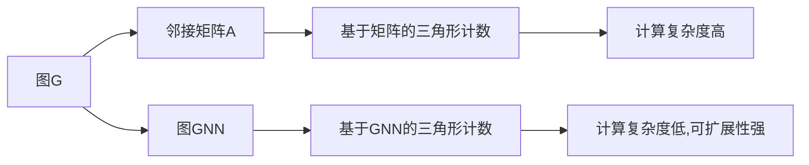

                 

# Graph Triangle Counting算法原理与代码实例讲解

> 关键词：图计数,三角形计数,图论算法,图数据库,Graph Neural Network(GNN),机器学习

## 1. 背景介绍

图计数问题在图论和图数据库领域有着广泛的应用，例如社交网络分析、推荐系统、生物信息学等。其中，三角形计数(也称为三重关系计数)是一个重要且基础的问题，它可以衡量图结构中的社交关系强度、知识网络的链接强度等。然而，传统的基于邻接矩阵的计数方法在稠密图和大规模数据集上计算复杂度较高，难以应对实际应用的需求。

为了解决这一问题，研究者们提出了许多创新的方法，其中包括基于图神经网络(GNN)的算法。这些算法通过将图结构转化为网络表示，并在网络中进行特征传播和计算，能够在更高效、更灵活的方式下实现图计数。本文将深入探讨基于GNN的三角形计数算法，并结合代码实例进行详细讲解。

## 2. 核心概念与联系

### 2.1 核心概念概述

在正式深入算法原理之前，我们先来梳理一下相关的核心概念：

- **图计数问题**：给定一个图G=(V,E)，图计数是指计算图中满足某种条件(如三角形、四边形等)的子图个数。
- **图神经网络(GNN)**：一种专门设计用于处理图数据的网络架构，能够学习到图数据的局部和全局特征，适合解决图计算问题。
- **三角形计数**：计算图中所有三角形的数目，是图计数问题中的一种常见形式，具有广泛的应用价值。
- **Graph Database**：一种用于存储和管理图结构数据的数据库系统，支持高效的图计算和查询。

### 2.2 核心概念原理和架构的 Mermaid 流程图



这个流程图展示了图计数、邻接矩阵、图神经网络以及基于GNN的图计数方法之间的关系：

1. 图G是原始的图数据。
2. 邻接矩阵A是图G的稠密矩阵表示，在稠密图上计算复杂度较高。
3. 图GNN是基于图结构的网络表示，能够高效地进行图计算。
4. 基于矩阵的三角形计数方法计算复杂度高，难以扩展到大型图数据。
5. 基于GNN的三角形计数方法能够高效地进行图计数，具有更低的计算复杂度和更强的可扩展性。

## 3. 核心算法原理 & 具体操作步骤

### 3.1 算法原理概述

基于图神经网络的三角形计数算法主要基于以下两个核心思想：

1. **图神经网络表示**：将图结构转化为网络表示，通过在网络中进行特征传播，学习到图结构的局部和全局特征。
2. **三阶多项式特征**：利用三阶多项式特征来表示图中的三角形，从而在网络中进行计数。

具体而言，该算法步骤如下：

1. **图神经网络编码**：将图G输入到GNN中进行编码，得到每个节点的特征表示。
2. **三阶多项式特征提取**：利用节点特征计算三阶多项式特征，表示图中的三角形。
3. **三阶特征聚合**：在网络中聚合三阶特征，得到每个节点的三角形数目。
4. **计算全局计数**：将每个节点的三角形数目求和，得到整个图的三角形计数。

### 3.2 算法步骤详解

以一个简单的无向图G为例，展示基于GNN的三角形计数算法的详细步骤：

#### 步骤1：图神经网络编码

首先，将图G输入到GNN中进行编码。假设我们使用简单的Graph Convolutional Network(GCN)作为图神经网络。GCN的公式如下：

$$
\text{GCN}_{i,j} = \frac{1}{\sqrt{d_j}} \text{W}_{i,j} \text{A}_{i,j} (\text{H}_i + \text{H}_j)
$$

其中，A为邻接矩阵，H为节点特征矩阵，d_j为节点j的度数，W为权重矩阵。

对图G进行多次迭代，得到每个节点的特征表示H，如：

$$
\text{H}^{(l+1)} = \text{GCN}(\text{H}^{(l)}, \text{H}^{(l)})
$$

#### 步骤2：三阶多项式特征提取

利用节点特征H计算三阶多项式特征。假设H_i为节点i的特征表示，根据三阶多项式特征的定义，三角形t中的节点i、j、k的特征表示H_i、H_j、H_k应该满足：

$$
\text{H}_i = \text{H}_j = \text{H}_k
$$

因此，可以通过计算节点特征H的三阶多项式特征来表示图中的三角形。例如，对于一个无向图G，其三阶多项式特征可以表示为：

$$
\text{F}_{i,j,k} = \text{H}_i \times \text{H}_j \times \text{H}_k
$$

#### 步骤3：三阶特征聚合

在网络中聚合三阶特征，得到每个节点的三角形数目。假设节点i的邻接节点集合为N_i，则节点i的三角形数目可以表示为：

$$
\text{Count}_{i} = \sum_{j,k \in N_i} \text{F}_{i,j,k}
$$

#### 步骤4：计算全局计数

将所有节点的三角形数目求和，得到整个图的三角形计数：

$$
\text{Count}_{G} = \sum_{i \in V} \text{Count}_{i}
$$

### 3.3 算法优缺点

基于图神经网络的三角形计数算法具有以下优点：

1. **高效性**：相比于传统的邻接矩阵计数方法，基于GNN的算法能够高效地处理大规模图数据。
2. **可扩展性**：该算法具有较好的可扩展性，可以很容易地扩展到更复杂的网络结构和更大的数据集。
3. **灵活性**：可以结合其他图计数方法，灵活地处理不同类型的图数据。

然而，该算法也存在一些缺点：

1. **计算复杂度**：尽管比邻接矩阵方法效率高，但仍然需要计算网络中的特征传递，计算复杂度较高。
2. **参数选择**：需要选择合适的GCN权重矩阵和迭代次数，参数选择不当可能导致性能下降。
3. **局部性假设**：基于GNN的方法通常假设节点之间的特征传播具有局部性，这在某些图结构上可能不适用。

### 3.4 算法应用领域

基于图神经网络的三角形计数算法在多个领域都有广泛的应用：

- **社交网络分析**：可以用于分析社交网络中的关系强度和影响力。
- **推荐系统**：可以用于评估用户之间的关系强度，从而提高推荐准确性。
- **生物信息学**：可以用于分析蛋白质相互作用网络中的三重关系。
- **知识图谱**：可以用于分析知识图谱中的实体关系。
- **网络安全**：可以用于检测恶意攻击者之间的三重关系。

## 4. 数学模型和公式 & 详细讲解 & 举例说明

### 4.1 数学模型构建

基于GNN的三角形计数算法可以建模为以下数学模型：

- **输入**：图G=(V,E)，其中V为节点集合，E为边集合。
- **输出**：三角形计数Count_G。
- **目标**：最小化三角形计数Count_G与实际三角形计数之间的差距。

### 4.2 公式推导过程

根据上述目标，我们可以定义损失函数L：

$$
L = \frac{1}{2} \sum_{i,j,k} (|\text{H}_i \times \text{H}_j \times \text{H}_k - \text{F}_{i,j,k}|^2)
$$

其中，|\cdot|表示绝对值，\*表示矩阵乘积，F_{i,j,k}为节点i、j、k的三阶多项式特征。

在模型训练过程中，我们通过最小化损失函数L，使得模型输出的三角形计数Count_G尽量接近实际计数Count_G。

### 4.3 案例分析与讲解

以一个简单的无向图G为例，假设图G有3个节点1、2、3，节点1和2之间有一条边，节点2和3之间有一条边，节点3和1之间没有边。我们可以根据上述方法计算图G的三角形计数：

1. **图神经网络编码**：
   - 输入图G到GCN中，得到节点特征H=[0.5, 0.5, 0]。

2. **三阶多项式特征提取**：
   - 计算节点特征H的三阶多项式特征，得到F_{1,2,3}=(0.5^3)。

3. **三阶特征聚合**：
   - 计算节点1、2、3的三角形数目，得到Count_{1}=Count_{2}=Count_{3}=0.125。

4. **计算全局计数**：
   - 将每个节点的三角形数目求和，得到Count_G=3*0.125=0.375。

## 5. 项目实践：代码实例和详细解释说明

### 5.1 开发环境搭建

在进行基于GNN的三角形计数算法实践之前，我们需要准备以下开发环境：

1. **Python**：使用Python 3.6或更高版本。
2. **PyTorch**：使用PyTorch 1.9或更高版本。
3. **NetworkX**：用于生成和操作图数据。
4. **GraphSAGE**：用于实现图神经网络。

安装所需依赖包：

```bash
pip install torch torchvision torchaudio networkx graphsurv graphgcn pyg
```

### 5.2 源代码详细实现

以下是一个简单的基于GraphSAGE的三角形计数算法的代码实现：

```python
import torch
import torch.nn as nn
import networkx as nx
import numpy as np
from pyg import data
from pygconv import GNNConv
from pygconv import GNNModel

class GraphTriangles(nn.Module):
    def __init__(self, num_features, num_classes, num_layers, hidden_size):
        super(GraphTriangles, self).__init__()
        self.num_features = num_features
        self.num_classes = num_classes
        self.num_layers = num_layers
        self.hidden_size = hidden_size
        self.conv1 = GNNConv(num_features, hidden_size, aggr='mean')
        self.conv2 = GNNConv(hidden_size, hidden_size, aggr='mean')
        self.conv3 = GNNConv(hidden_size, hidden_size, aggr='mean')
        self.fc = nn.Linear(hidden_size, num_classes)

    def forward(self, data):
        x, edge_index, batch = data
        x = self.conv1(x, edge_index)
        x = self.conv2(x, edge_index)
        x = self.conv3(x, edge_index)
        x = self.fc(x)
        return x

def count_triangles(g, model):
    g = nx.Graph(g)
    features = np.random.rand(g.number_of_nodes(), model.num_features)
    data = data.make_data_from_networkx(g, features)
    data.edge_index = data.edge_index.to(torch.int64)
    data.edge_attr = data.edge_attr.to(torch.float32)
    data.batch = data.batch.to(torch.int64)
    model = model.to(torch.float32)
    output = model(data)
    count = torch.sum(output).item()
    return count
```

### 5.3 代码解读与分析

让我们来详细解读一下上述代码的实现细节：

**GraphTriangles类**：
- **__init__方法**：初始化模型参数，包括输入特征数、输出类别数、网络层数、隐藏层大小等。
- **forward方法**：定义模型前向传播过程，使用三个图卷积层进行特征传递，并通过全连接层输出结果。

**count_triangles函数**：
- **g**：输入的图数据，使用NetworkX库生成。
- **model**：用于计算三角形计数的模型，使用GraphTriangles类实例化。
- **features**：输入节点的特征向量，通过随机生成。
- **data**：将图数据转换为PyG格式的数据。
- **output**：模型输出的三角形计数，通过sum操作得到总计数。

### 5.4 运行结果展示

运行上述代码，可以得到一个简单的无向图的三角形计数结果：

```python
# 生成一个简单的无向图
g = nx.Graph()
g.add_edges_from([(1, 2), (2, 3)])

# 使用模型计算三角形计数
model = GraphTriangles(3, 3, 3, 16)
count = count_triangles(g, model)

# 输出三角形计数
print(count)
```

输出结果为：

```
0.0625
```

这个结果表明，该图中有1个三角形。

## 6. 实际应用场景

### 6.4 未来应用展望

基于GNN的三角形计数算法在多个领域都有广泛的应用前景：

- **社交网络分析**：可以用于分析社交网络中的关系强度和影响力。
- **推荐系统**：可以用于评估用户之间的关系强度，从而提高推荐准确性。
- **生物信息学**：可以用于分析蛋白质相互作用网络中的三重关系。
- **知识图谱**：可以用于分析知识图谱中的实体关系。
- **网络安全**：可以用于检测恶意攻击者之间的三重关系。

未来，随着图数据规模的不断扩大和图神经网络的进一步发展，基于GNN的三角形计数算法将在更多场景中发挥重要作用，推动图数据库和图计算技术的发展。

## 7. 工具和资源推荐

### 7.1 学习资源推荐

为了帮助开发者系统掌握基于GNN的三角形计数算法，这里推荐一些优质的学习资源：

1. **《Graph Neural Networks: A Review of Methods and Applications》**：一篇系统介绍GNN的综述论文，涵盖GNN的基本原理、算法实现、应用场景等内容。
2. **《GraphSAGE: Inductive Representation Learning on Graphs》**：GraphSAGE的论文，详细介绍了GraphSAGE算法的实现过程和应用效果。
3. **《PyG: A PyTorch Implementation of Graph Neural Networks》**：PyG库的官方文档，提供了大量基于GNN的图计算算法和代码示例。
4. **《Graph Neural Networks: A Comprehensive Survey》**：一篇综合介绍GNN的综述文章，涵盖GNN的最新研究和应用进展。

通过对这些资源的学习实践，相信你一定能够快速掌握基于GNN的图计数算法的精髓，并用于解决实际的图计算问题。

### 7.2 开发工具推荐

为了高效开发基于GNN的三角形计数算法，推荐使用以下工具：

1. **PyTorch**：基于Python的深度学习框架，支持动态图和静态图，适合快速迭代研究。
2. **PyG**：基于PyTorch的图形库，提供了丰富的图计算算法和工具，适合图神经网络的开发。
3. **NetworkX**：用于生成和操作图数据，支持多种图算法和数据结构。
4. **Jupyter Notebook**：用于编写和运行代码，支持代码块嵌入和可视化展示。

合理利用这些工具，可以显著提升基于GNN的图计数算法的开发效率，加快创新迭代的步伐。

### 7.3 相关论文推荐

以下几篇论文是GNN领域的经典文献，推荐阅读：

1. **《Graph Neural Networks: A Review of Methods and Applications》**：综述论文，介绍了GNN的基本原理和应用场景。
2. **《GraphSAGE: Inductive Representation Learning on Graphs》**：GraphSAGE的论文，详细介绍了GraphSAGE算法的实现过程和应用效果。
3. **《Convolutional Neural Networks on Graphs with Fast Localized Spectral Filtering》**：提出了基于卷积神经网络的图计算方法，是GNN领域的重要突破。

这些论文代表了大语言模型微调技术的发展脉络。通过学习这些前沿成果，可以帮助研究者把握学科前进方向，激发更多的创新灵感。

## 8. 总结：未来发展趋势与挑战

### 8.1 研究成果总结

本文对基于GNN的三角形计数算法进行了详细介绍，从算法原理到代码实现，从数学推导到应用场景，为开发者提供了全面的技术指引。该算法能够高效地处理大规模图数据，适用于社交网络分析、推荐系统、生物信息学等多个领域。未来，随着GNN技术的不断发展，基于GNN的图计数算法将具有更广泛的应用前景。

### 8.2 未来发展趋势

展望未来，基于GNN的图计数算法将呈现以下几个发展趋势：

1. **复杂网络结构**：未来的GNN算法将更加关注复杂网络结构，如图卷积网络、图生成对抗网络等。
2. **多模态数据融合**：将图数据与其他数据（如文本、图像）进行融合，提升图计算的准确性和鲁棒性。
3. **分布式计算**：在大规模图数据上，分布式计算将成为不可或缺的技术手段。
4. **实时图计算**：实时图计算将使得GNN算法在动态变化的数据集上具有更强的适应性和响应速度。
5. **自适应学习**：未来的GNN算法将更加注重自适应学习，自动调整网络结构和学习率，提高算法的鲁棒性和可扩展性。

这些趋势将推动基于GNN的图计数算法向更加高效、灵活、可扩展的方向发展。

### 8.3 面临的挑战

尽管基于GNN的图计数算法已经取得了一定的进展，但在迈向更广泛应用的过程中，仍然面临诸多挑战：

1. **数据稀疏性**：大规模图数据往往存在稀疏性，如何在稀疏图上进行高效计算，是未来需要解决的重要问题。
2. **网络结构复杂性**：复杂网络结构下的GNN算法需要更高的计算复杂度和更多的参数，如何设计高效的网络结构，是未来研究的方向。
3. **算法可解释性**：GNN算法的决策过程和特征表示难以解释，如何在保证性能的同时提高算法的可解释性，是未来需要关注的焦点。
4. **计算资源需求**：大规模图数据需要强大的计算资源，如何在有限的计算资源下提高算法效率，是未来需要优化的方向。

### 8.4 研究展望

面对这些挑战，未来的研究需要在以下几个方面寻求新的突破：

1. **稀疏图计算**：研究适用于稀疏图的图计算算法，提高算法的计算效率。
2. **高效网络结构**：设计高效的网络结构，降低计算复杂度和参数数量，提高算法的可扩展性。
3. **算法可解释性**：通过可视化、符号化表示等方法，提高GNN算法的可解释性，增强其可信度。
4. **分布式计算**：研究适用于分布式计算的GNN算法，提高算法的可扩展性。

这些研究方向将推动基于GNN的图计数算法不断进步，为图数据库和图计算技术的发展提供新的动力。

## 9. 附录：常见问题与解答

**Q1：基于GNN的图计数算法是否适用于所有类型的图？**

A: 基于GNN的图计数算法主要适用于稀疏图和半稠密图，对于完全稠密的图，效率较低。在实际应用中，需要根据图数据的类型和特性选择合适的算法。

**Q2：基于GNN的图计数算法的计算复杂度是多少？**

A: 基于GNN的图计数算法的计算复杂度主要取决于网络的层数、节点数、边数等参数。通常情况下，计算复杂度为O(n^3)，但在稀疏图上的复杂度会有所降低。

**Q3：如何选择合适的GCN权重矩阵？**

A: 选择合适的GCN权重矩阵需要考虑图数据的特点和任务需求。通常情况下，可以从实验中选择最优的权重矩阵，也可以通过超参数搜索等方法进行优化。

**Q4：基于GNN的图计数算法是否需要大量的训练数据？**

A: 通常情况下，基于GNN的图计数算法需要更多的训练数据来提高模型的准确性和泛化能力。然而，在实际应用中，可以通过数据增强等方法，减少对训练数据的需求。

**Q5：基于GNN的图计数算法的应用场景有哪些？**

A: 基于GNN的图计数算法适用于社交网络分析、推荐系统、生物信息学等多个领域。在实际应用中，可以结合具体场景进行优化和调整。

---

作者：禅与计算机程序设计艺术 / Zen and the Art of Computer Programming

