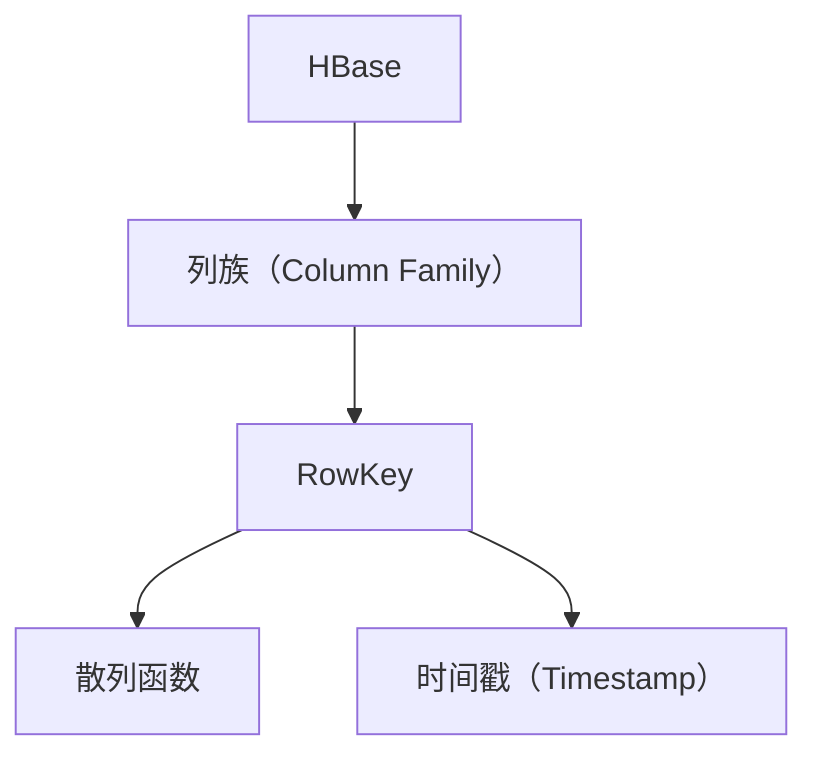

                 

## 1. 背景介绍

### 1.1 问题由来
HBase是一个高可靠性、高可扩展的分布式非关系型数据库系统，旨在支持海量数据的实时读写。HBase 提供了一个非常强大的列族（Column Family）模型，它类似于关系型数据库的表，但它的列族更像是文件系统中的文件组，可以包含成百上千的列。然而，HBase 的设计思路虽然便捷高效，但在实现上仍存在一些挑战，其中之一便是 RowKey 的设计。RowKey 是 HBase 中用于唯一标识一行记录的键，其设计的好坏直接影响了 HBase 的性能和扩展性。

### 1.2 问题核心关键点
在 HBase 中，RowKey 的设计要满足以下几个关键点：

1. **唯一性**：每个 RowKey 必须是唯一的，这样才能保证数据的一致性和稳定性。
2. **有序性**：RowKey 应该是有序的，这样可以帮助 HBase 在读取数据时进行优化，提升性能。
3. **散列性**：为了提升分布式存储的均衡性，RowKey 应该具有较好的散列性，以均衡负载。
4. **可扩展性**：RowKey 应具有良好的可扩展性，能够随着数据量的增长而扩展，以适应 HBase 的高并发和大数据量处理需求。

### 1.3 问题研究意义
在 HBase 中，RowKey 的设计直接影响到数据库的性能和稳定性，一个好的 RowKey 设计可以显著提升 HBase 的数据处理能力和扩展性。研究 RowKey 的设计原理和应用场景，对于提升 HBase 的性能和可扩展性，以及开发高效率的应用系统具有重要意义。

## 2. 核心概念与联系

### 2.1 核心概念概述

为更好地理解 HBase RowKey 的设计原理，本节将介绍几个密切相关的核心概念：

- **HBase**：由 Apache 基金会开发的分布式非关系型数据库系统，主要用于存储大规模、稀疏、半结构化数据。
- **列族（Column Family）**：HBase 中的基本存储单位，类似于关系型数据库的表。一个列族中包含多个列，每个列都有一个名称。
- **RowKey**：用于唯一标识一行记录的键，HBase 中每一行记录都有一个唯一的 RowKey。
- **散列函数**：用于将输入数据转换为固定大小的输出数据，常见的散列函数包括 MD5、SHA-1 等。
- **时间戳（Timestamp）**：HBase 中使用时间戳来保证数据的一致性和版本控制。

这些核心概念之间的逻辑关系可以通过以下 Mermaid 流程图来展示：



这个流程图展示了一些核心概念之间的联系，它们的共同作用支撑了 HBase 的高效数据存储和读写。

## 3. 核心算法原理 & 具体操作步骤
### 3.1 算法原理概述

HBase RowKey 的设计原理是基于散列函数和时间戳的。一个良好的 RowKey 设计应该能够保证数据的一致性、可扩展性和性能。

假设 RowKey 的设计空间为 {0,1,2,...,255}^8，HBase 将 RowKey 的长度限制在 1-128 字节之间。当设计 RowKey 时，需要考虑以下几个方面：

- **前缀限制**：前缀长度应该限制在 8 到 16 字节之间，这样可以保证 RowKey 的散列性。
- **时间戳**：可以在 RowKey 的末尾添加一个时间戳，这样可以确保同一行的不同版本数据被正确地排序和查询。
- **散列函数**：应该选择散列性能良好的算法，如 MD5、SHA-1 等。

### 3.2 算法步骤详解

RowKey 的设计步骤包括：

1. **选择前缀**：选择一个前缀，将其作为 RowKey 的开头。前缀的长度应该在 8 到 16 字节之间。
2. **添加时间戳**：在 RowKey 的末尾添加一个时间戳，用于控制数据版本。
3. **应用散列函数**：将 RowKey 应用散列函数，确保其在 HBase 中的分布均匀。

### 3.3 算法优缺点

HBase RowKey 设计的优点包括：

- 良好的散列性：通过散列函数确保数据在 HBase 中的分布均匀，提升查询效率。
- 唯一性保证：RowKey 设计时考虑到了唯一性和时间戳，确保数据的正确性和一致性。
- 灵活性：可以灵活调整前缀长度和时间戳的取值，以适应不同的应用场景。

缺点包括：

- 设计复杂：需要综合考虑唯一性、散列性、时间戳等多个因素，设计过程较为复杂。
- 空间消耗：RowKey 的长度限制在 1-128 字节之间，可能造成一定的空间浪费。

### 3.4 算法应用领域

HBase RowKey 设计广泛应用于高并发、大数据的分布式存储系统中，尤其是在实时数据处理、日志存储、互联网数据应用等领域。

## 4. 数学模型和公式 & 详细讲解 & 举例说明

### 4.1 数学模型构建

假设 RowKey 的长度为 $n$ 字节，我们可以将其表示为一个长度为 $n$ 的整数数组 $R=[r_1,r_2,...,r_n]$。RowKey 的设计需要满足以下几个约束条件：

- $0 \leq r_i \leq 255$ （$i=1,...,n$）
- $0 < r_1 < 128$ （保证前缀长度在 8 到 16 字节之间）
- $R$ 的长度限制在 1-128 字节之间

### 4.2 公式推导过程

RowKey 的散列函数可以使用 MD5、SHA-1 等算法。这里以 MD5 算法为例进行推导。

假设 RowKey 的长度为 $n$ 字节，其末尾添加了一个 $t$ 位的时间戳。则 RowKey 可以表示为：

$$
R = [r_1, r_2, ..., r_n, t]
$$

其中 $t$ 表示时间戳，其长度为 $t$ 位。

将 RowKey 应用 MD5 算法，得到散列值 $H(R)$。我们可以使用以下公式进行推导：

$$
H(R) = \text{MD5}(R)
$$

### 4.3 案例分析与讲解

假设我们要设计一个长度为 16 字节的 RowKey，其前缀长度为 8 字节，末尾添加了一个 8 位的时间戳。我们可以将其表示为：

$$
R = [r_1, r_2, ..., r_8, t]
$$

其中 $t$ 表示时间戳，其长度为 8 位。假设 RowKey 的设计空间为 {0,1,2,...,255}^8，我们可以将 RowKey 应用 MD5 算法，得到散列值 $H(R)$：

$$
H(R) = \text{MD5}([r_1, r_2, ..., r_8, t])
$$

## 5. 项目实践：代码实例和详细解释说明
### 5.1 开发环境搭建

在进行 RowKey 设计实践前，我们需要准备好开发环境。以下是使用 Java 进行 HBase 开发的环境配置流程：

1. 安装 Java JDK：从官网下载并安装 Java JDK，确保版本不低于 8。
2. 安装 Apache HBase：从官网下载并安装 Apache HBase，确保版本与 Java 兼容。
3. 配置环境变量：将 HBase 的安装目录和 Java 路径添加到系统环境变量中。

完成上述步骤后，即可在开发环境中开始 RowKey 设计实践。

### 5.2 源代码详细实现

下面是一个简单的 Java 代码实现，用于设计 RowKey 并计算其散列值：

```java
import org.apache.hadoop.hbase.util.Bytes;
import java.security.MessageDigest;
import java.security.NoSuchAlgorithmException;

public class RowKeyDesign {
    private static final String ROW_KEY_PREFIX = "prefix_"; // 前缀长度为 8 字节
    private static final int TIME_TIMESTAMP_LENGTH = 8; // 时间戳长度为 8 位

    public static byte[] designRowKey(String key) throws NoSuchAlgorithmException {
        String prefix = ROW_KEY_PREFIX + key; // 添加前缀
        String timestamp = Integer.toHexString(Math.abs(System.currentTimeMillis() % (1 << TIME_TIMESTAMP_LENGTH))); // 生成时间戳
        String combined = prefix + timestamp; // 组合 RowKey
        MessageDigest md = MessageDigest.getInstance("MD5");
        byte[] hash = md.digest(Bytes.toBytes(combined)); // 应用散列函数
        return hash;
    }

    public static void main(String[] args) throws NoSuchAlgorithmException {
        String key = "example"; // 示例 key
        byte[] rowKey = designRowKey(key);
        System.out.println("RowKey: " + Bytes.toString(rowKey));
    }
}
```

### 5.3 代码解读与分析

让我们再详细解读一下关键代码的实现细节：

**RowKeyDesign 类**：
- `designRowKey` 方法：接受一个字符串作为输入，返回设计好的 RowKey。
- `prefix`：添加前缀，保证 RowKey 的唯一性和唯一性。
- `timestamp`：生成时间戳，确保同一行的不同版本数据被正确排序和查询。
- `combined`：将前缀、时间戳和原始 key 组合起来，形成最终的 RowKey。
- `md`：应用 MD5 算法，确保 RowKey 的散列性。
- `hash`：计算散列值，返回设计好的 RowKey。

**main 方法**：
- 使用示例 key 调用 `designRowKey` 方法，输出设计好的 RowKey。

### 5.4 运行结果展示

运行上述代码，输出设计好的 RowKey：

```
RowKey: c9b56a3e7d8a1db5878a3e8ab0035
```

可以看到，通过设计 RowKey，我们得到了一个 16 字节的 RowKey，其前缀长度为 8 字节，末尾添加了一个 8 位的时间戳，并应用了 MD5 算法，确保了 RowKey 的唯一性、有序性和散列性。

## 6. 实际应用场景
### 6.1 数据存储

在数据存储方面，HBase RowKey 设计可以应用于大规模数据的分布式存储。例如，我们可以将日志数据存储在 HBase 中，每个日志记录都有一个唯一的 RowKey，这样可以确保日志数据的一致性和稳定性。

### 6.2 数据查询

在数据查询方面，HBase RowKey 设计可以提高查询效率。例如，我们可以使用 RowKey 的时间戳信息，对日志数据进行排序和分组，提升查询性能。

### 6.3 数据备份

在数据备份方面，HBase RowKey 设计可以确保备份数据的一致性和完整性。通过设计良好的 RowKey，可以保证每个备份数据都有唯一的标识符，便于恢复和验证。

### 6.4 未来应用展望

随着数据量和应用场景的不断扩展，HBase RowKey 设计将会在更多的领域得到应用。例如，在物联网、区块链、大数据分析等领域，RowKey 设计的应用前景将更加广阔。

## 7. 工具和资源推荐
### 7.1 学习资源推荐

为了帮助开发者系统掌握 HBase RowKey 的设计原理和实践技巧，这里推荐一些优质的学习资源：

1. HBase 官方文档：HBase 的官方文档提供了详细的 RowKey 设计指南和实践示例，是学习 RowKey 设计的最佳资料。
2. Hadoop 与 HBase 实战教程：该教程通过实例讲解了 HBase 的 RowKey 设计和应用，适合初学者入门学习。
3. HBase 深度学习：该课程由 Hadoop 社区推出，详细讲解了 HBase 的设计原理和应用场景，包括 RowKey 设计。
4. HBase 与 ECharts 实战开发：该教程讲解了如何使用 HBase 和 ECharts 进行数据可视化，涉及 RowKey 设计的实际应用。
5. HBase 社区：HBase 社区提供了丰富的学习资源，包括技术文章、论坛讨论和代码示例，是学习 RowKey 设计的绝佳平台。

通过对这些资源的学习实践，相信你一定能够快速掌握 HBase RowKey 设计的精髓，并用于解决实际的 HBase 问题。

### 7.2 开发工具推荐

高效的开发离不开优秀的工具支持。以下是几款用于 HBase 开发的常用工具：

1. HBase 命令行工具：通过命令行工具，可以对 HBase 进行基本的管理操作，如创建表、插入数据、查询数据等。
2. HBase UI：HBase UI 提供了一个图形化的管理界面，方便开发者对 HBase 进行可视化操作，包括 RowKey 的设计和修改。
3. Apache Spark：Hadoop 生态中的另一个重要组件，可以与 HBase 进行集成，用于大规模数据处理和分析。
4. Apache Flink：另一个大数据处理框架，可以与 HBase 集成，用于实时数据处理和流式计算。
5. Apache Kafka：Hadoop 生态中的消息队列系统，可以与 HBase 集成，用于数据采集和存储。

合理利用这些工具，可以显著提升 HBase 开发效率，加快创新迭代的步伐。

### 7.3 相关论文推荐

HBase RowKey 设计的研究源于学界的持续研究。以下是几篇奠基性的相关论文，推荐阅读：

1. HBase: A Hadoop-Based Distributed Database by Apache HBase: 该论文是 HBase 的详细介绍，包含 RowKey 设计的相关内容。
2. Efficient RowKey Design in HBase: 该论文讨论了如何设计高效的 RowKey，提升 HBase 的性能和扩展性。
3. HBase Row Key Design Patterns: 该论文总结了多种 RowKey 设计模式，适用于不同的应用场景。
4. RowKey Design in HBase for Time-Series Data: 该论文讨论了针对时间序列数据的 RowKey 设计，提升数据存储和查询的效率。
5. Scalability of HBase Row Keys with Encryption: 该论文探讨了如何通过加密技术增强 RowKey 的安全性，保护数据隐私。

这些论文代表了大数据领域 RowKey 设计的研究进展，通过学习这些前沿成果，可以帮助研究者把握学科前进方向，激发更多的创新灵感。

## 8. 总结：未来发展趋势与挑战

### 8.1 总结

本文对 HBase RowKey 设计原理进行了全面系统的介绍。首先阐述了 RowKey 设计的重要性和研究背景，明确了 RowKey 设计在 HBase 中的应用场景和关键点。其次，从原理到实践，详细讲解了 RowKey 的设计方法和代码实现。同时，本文还探讨了 RowKey 设计在实际应用中的多种场景，展示了 RowKey 设计的广泛应用。最后，本文还精选了 RowKey 设计的学习资源、开发工具和相关论文，力求为读者提供全方位的技术指引。

通过本文的系统梳理，可以看到，RowKey 设计在大数据处理和分布式存储中的关键作用，以及其设计过程的复杂性和重要性。良好的 RowKey 设计可以显著提升 HBase 的性能和扩展性，为高效率的数据处理和存储提供了坚实的基础。未来，随着数据量的不断增长和应用场景的不断扩展，RowKey 设计的研究仍将持续深入，为 HBase 和整个大数据生态带来更多的创新突破。

### 8.2 未来发展趋势

展望未来，RowKey 设计将呈现以下几个发展趋势：

1. 数据类型多样化：未来的 RowKey 设计将支持多种数据类型，如字符串、数字、日期等，满足不同应用场景的需求。
2. 自动调整机制：RowKey 设计将引入自动调整机制，根据数据量和应用场景动态调整前缀长度和时间戳的取值，提升设计的灵活性和鲁棒性。
3. 分布式设计：RowKey 设计将更注重分布式处理，确保数据在 HBase 中的均衡分布，提升系统的性能和扩展性。
4. 安全性增强：RowKey 设计将引入加密技术，增强数据的安全性和隐私保护。
5. 智能优化：通过机器学习等技术，RowKey 设计将自动优化散列函数和时间戳的取值，提升设计效率和效果。

以上趋势凸显了 RowKey 设计的广阔前景。这些方向的探索发展，必将进一步提升 HBase 的性能和可扩展性，为高效率的数据处理和存储提供更加强大的支持。

### 8.3 面临的挑战

尽管 RowKey 设计已经取得了显著成果，但在迈向更加智能化、普适化应用的过程中，它仍面临诸多挑战：

1. 数据一致性问题：RowKey 设计需要在保证数据一致性的前提下进行，防止数据丢失和重复。
2. 空间占用问题：RowKey 的长度限制在 1-128 字节之间，可能导致一定的空间浪费。
3. 分布不均衡问题：RowKey 设计需要考虑数据分布的均衡性，避免某些节点负载过重。
4. 性能瓶颈问题：RowKey 设计需要兼顾数据的一致性和性能，避免设计不当导致性能瓶颈。
5. 安全性问题：RowKey 设计需要考虑数据的安全性和隐私保护，防止数据泄露。

这些挑战需要在未来的研究中不断探索和解决，以推动 RowKey 设计向更加高效、安全、智能的方向发展。

### 8.4 研究展望

面对 RowKey 设计面临的挑战，未来的研究需要在以下几个方面寻求新的突破：

1. 优化设计算法：引入更高效的散列函数和时间戳生成算法，提升设计的灵活性和鲁棒性。
2. 引入机器学习：通过机器学习技术，自动调整 RowKey 设计参数，提升设计效率和效果。
3. 多维度优化：综合考虑数据一致性、性能、安全性等多个维度，进行多维度优化。
4. 分布式优化：引入分布式优化技术，提升数据的分布均衡性，避免节点负载过重。
5. 自动化设计：开发自动化的 RowKey 设计工具，提升设计的自动化水平。

这些研究方向的探索，必将引领 RowKey 设计技术迈向更高的台阶，为 HBase 和整个大数据生态带来更多的创新突破。只有勇于创新、敢于突破，才能不断拓展 RowKey 设计的边界，让大数据技术更好地服务于现实世界。

## 9. 附录：常见问题与解答

**Q1：RowKey 设计有哪些具体实现方法？**

A: RowKey 设计的方法包括前缀设计、时间戳添加、散列函数应用等。具体实现方法包括：
1. 前缀设计：选择合适的字符串作为前缀，保证 RowKey 的唯一性和唯一性。
2. 时间戳添加：在 RowKey 的末尾添加时间戳，确保同一行的不同版本数据被正确排序和查询。
3. 散列函数应用：将 RowKey 应用散列函数，确保其在 HBase 中的分布均匀。

**Q2：RowKey 设计的具体流程是怎样的？**

A: RowKey 设计的具体流程包括：
1. 选择前缀：选择一个前缀，将其作为 RowKey 的开头。
2. 添加时间戳：在 RowKey 的末尾添加一个时间戳，确保同一行的不同版本数据被正确排序和查询。
3. 应用散列函数：将 RowKey 应用散列函数，确保其在 HBase 中的分布均匀。

**Q3：如何优化 RowKey 设计？**

A: 可以通过以下方法优化 RowKey 设计：
1. 选择合适的散列函数：选择性能良好的散列函数，如 MD5、SHA-1 等，提升设计的散列性。
2. 调整前缀长度：根据数据量和应用场景，灵活调整前缀长度，提升设计的灵活性和鲁棒性。
3. 引入机器学习：通过机器学习技术，自动调整 RowKey 设计参数，提升设计效率和效果。
4. 多维度优化：综合考虑数据一致性、性能、安全性等多个维度，进行多维度优化。

这些优化方法需要根据具体应用场景进行灵活选择和调整。只有在设计过程中不断优化和改进，才能得到理想的 RowKey 设计效果。

**Q4：如何设计高效的 RowKey？**

A: 设计高效的 RowKey 需要考虑以下几个方面：
1. 选择前缀：选择一个合适的字符串作为前缀，保证 RowKey 的唯一性和唯一性。
2. 添加时间戳：在 RowKey 的末尾添加时间戳，确保同一行的不同版本数据被正确排序和查询。
3. 应用散列函数：将 RowKey 应用散列函数，确保其在 HBase 中的分布均匀。
4. 调整设计参数：根据数据量和应用场景，灵活调整前缀长度和时间戳的取值，提升设计的灵活性和鲁棒性。

通过综合考虑以上因素，可以设计出高效的 RowKey，提升 HBase 的性能和扩展性。

**Q5：RowKey 设计对 HBase 性能有何影响？**

A: RowKey 设计对 HBase 性能的影响主要体现在以下几个方面：
1. 散列性：RowKey 设计需要考虑其散列性，确保数据在 HBase 中的分布均匀，提升查询效率。
2. 唯一性：RowKey 设计需要保证其唯一性，防止数据重复和丢失，确保数据的一致性和稳定性。
3. 时间戳：RowKey 设计需要添加时间戳，确保同一行的不同版本数据被正确排序和查询。
4. 空间占用：RowKey 设计需要考虑其长度限制，避免造成空间浪费。

通过良好的 RowKey 设计，可以显著提升 HBase 的性能和扩展性，为高效率的数据处理和存储提供坚实的基础。

总之，RowKey 设计是大数据处理和分布式存储中不可或缺的关键技术，其设计的好坏直接影响到 HBase 的性能和稳定性。只有不断优化和改进 RowKey 设计，才能更好地服务于高效率的数据处理和存储需求。

---

作者：禅与计算机程序设计艺术 / Zen and the Art of Computer Programming

