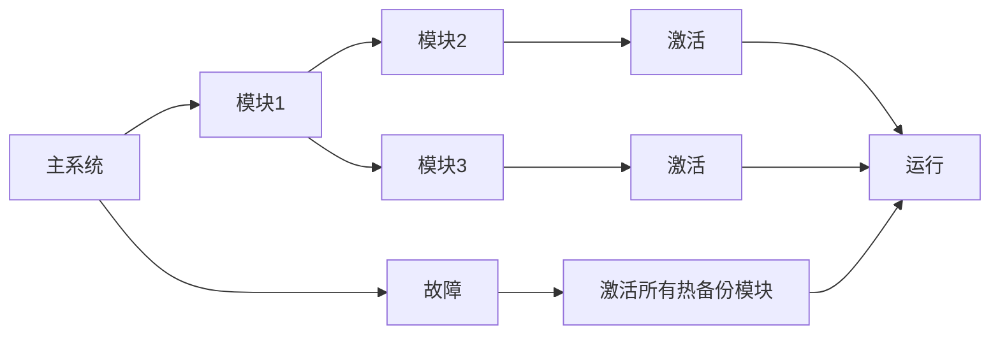

                 

## 1. 背景介绍

冗余设计是电子系统设计中一种常见且重要的设计手段，它通过增加电路板上的额外组件，保证系统的可靠性和稳定性，从而延长其使用寿命。在过去十年中，随着微处理器性能的持续提升，冗余设计逐渐成为了热设计中的一项重要内容。然而，传统的冗余设计方法面临着一些新的挑战，比如功耗和面积的增加，以及与新兴技术如人工智能和物联网的整合问题。

与此同时，热冗余设计领域也出现了一种新的设计方法——Hot-Hot冗余设计。Hot-Hot冗余设计是一种新颖的冗余设计方法，它利用多个相互独立的模块来提升系统的鲁棒性和性能。相比于传统的Hot-Warm冗余设计，Hot-Hot冗余设计具有更高的灵活性和可扩展性，它能够更快速地应对系统的故障和变化。

本文将从Hot-Hot和Hot-Warm冗余设计的核心概念、核心算法、实际应用场景、优缺点等方面进行比较，帮助读者更好地理解这些设计方法，并根据实际需求选择合适的冗余设计方案。

## 2. 核心概念与联系

### 2.1 核心概念概述

在讨论Hot-Hot和Hot-Warm冗余设计之前，首先需要了解冗余设计的基本概念。冗余设计是一种在电路设计中增加多余元件以提高系统可靠性的方法。冗余设计通常可分为Hot-Warm和Hot-Hot两种。

**Hot-Warm冗余设计**：Hot-Warm冗余设计指的是，在一个系统内使用一个热备份模块和若干个冷备份模块。在主系统发生故障时，热备份模块接管系统的控制，而冷备份模块在需要时提供额外的支持。

**Hot-Hot冗余设计**：Hot-Hot冗余设计则是指在一个系统内使用多个独立的热备份模块。每个模块独立工作，当系统发生故障时，所有热备份模块同时激活，共同承担系统的工作负载。

这两个设计方法的核心思想都是通过增加冗余度来提升系统的鲁棒性和可靠性。然而，Hot-Hot冗余设计相较于Hot-Warm冗余设计，具有更强的灵活性和可扩展性，因为它可以利用更多的热备份模块来提升系统的可靠性。

### 2.2 核心概念原理和架构的 Mermaid 流程图

下面是一个Hot-Hot冗余设计的工作流程图：



该图表示当主系统故障时，激活所有热备份模块来共同承担系统的负载。每个模块都是独立的，可以独立地进行故障检测和故障恢复。

## 3. 核心算法原理 & 具体操作步骤

### 3.1 算法原理概述

冗余设计的核心在于通过增加冗余组件来提升系统的可靠性和鲁棒性。Hot-Hot和Hot-Warm冗余设计的主要区别在于冗余模块的配置方式。

Hot-Hot冗余设计的算法原理如下：

1. 在系统设计阶段，将多个热备份模块独立部署在系统中。
2. 系统运行时，每个模块独立运行并实时监测自身的健康状况。
3. 当一个模块检测到自身故障时，立即将其从系统中移除，并将任务交给其他热备份模块处理。
4. 当系统发生整体故障时，激活所有热备份模块，共同承担系统的负载。

Hot-Warm冗余设计的算法原理如下：

1. 在系统设计阶段，选择一个热备份模块作为系统的备份，其他模块为冷备份。
2. 系统运行时，主模块和备份模块并行运行。当主模块故障时，备份模块接管系统的控制。
3. 冷备份模块在需要时提供额外的支持。

### 3.2 算法步骤详解

下面分别介绍Hot-Hot和Hot-Warm冗余设计的详细步骤：

#### Hot-Hot冗余设计

1. **模块部署**：在系统设计阶段，将多个独立的热备份模块部署在系统中。
2. **模块监控**：在运行时，每个模块独立运行，并实时监测自身的健康状况，如温度、电压等。
3. **故障检测**：当某个模块检测到自身故障时，立即将其从系统中移除，并将任务交给其他热备份模块处理。
4. **整体故障处理**：当系统发生整体故障时，激活所有热备份模块，共同承担系统的负载。

#### Hot-Warm冗余设计

1. **模块部署**：在系统设计阶段，选择一个热备份模块作为系统的备份，其他模块为冷备份。
2. **主备份运行**：在运行时，主模块和备份模块并行运行，备份模块处于低功耗状态。
3. **故障处理**：当主模块故障时，备份模块接管系统的控制。
4. **冷备份支持**：冷备份模块在需要时提供额外的支持。

### 3.3 算法优缺点

**Hot-Hot冗余设计的优点**：

1. **高可靠性**：利用多个独立的热备份模块，提高系统的可靠性。
2. **高可扩展性**：可以很容易地增加冗余模块，提升系统的性能。
3. **灵活性**：每个模块独立运行，可以根据需要进行故障检测和故障恢复。

**Hot-Hot冗余设计的缺点**：

1. **高功耗**：多个冗余模块的并行运行，会导致系统的功耗增加。
2. **高成本**：需要更多的冗余模块和额外的硬件，增加了系统的成本。
3. **复杂性**：系统的设计和调试更加复杂，需要更多的精力。

**Hot-Warm冗余设计的优点**：

1. **低功耗**：只需要一个热备份模块，可以减少系统的功耗。
2. **低成本**：只需要一个冗余模块，可以减少系统的成本。
3. **简单性**：系统的设计和调试更加简单，容易实现。

**Hot-Warm冗余设计的缺点**：

1. **低可靠性**：只有一个热备份模块，系统的可靠性不如Hot-Hot冗余设计。
2. **可扩展性差**：很难增加冗余模块，系统的性能提升有限。
3. **灵活性差**：备份模块不能独立运行，无法灵活应对系统的变化。

### 3.4 算法应用领域

Hot-Hot和Hot-Warm冗余设计在多个领域都有广泛的应用，下面列举几个典型的应用场景：

1. **高性能计算**：在高性能计算领域，Hot-Hot冗余设计可以提升系统的可靠性和性能，广泛应用于数据中心和超级计算机。
2. **医疗设备**：在医疗设备领域，Hot-Warm冗余设计可以保证设备的可靠性，广泛应用于手术机器人、诊断设备等。
3. **工业控制**：在工业控制领域，Hot-Hot冗余设计可以提升系统的鲁棒性，广泛应用于自动化生产线、控制系统等。
4. **航空航天**：在航空航天领域，Hot-Warm冗余设计可以保证系统的可靠性，广泛应用于导航、通信等系统。

## 4. 数学模型和公式 & 详细讲解 & 举例说明

### 4.1 数学模型构建

在冗余设计中，系统的可靠性可以通过冗余模块的配置和运行状态来描述。假设有$n$个模块，每个模块的故障概率为$p$，则系统整体故障的概率可以表示为：

$$
P_{故障} = 1 - (1 - p)^n
$$

### 4.2 公式推导过程

根据上述公式，可以推导出系统整体故障的概率与冗余模块数的关系。当冗余模块数$n$增加时，系统的故障概率$P_{故障}$将不断减小，从而提升系统的可靠性。

以Hot-Hot冗余设计为例，当有$m$个热备份模块时，系统的故障概率可以表示为：

$$
P_{故障} = 1 - \prod_{i=1}^{m} (1 - p)
$$

其中，$p$为单个模块的故障概率。当$m$增加时，系统的故障概率将迅速减小，从而提升系统的可靠性。

### 4.3 案例分析与讲解

以一个医疗设备为例，假设有3个热备份模块，每个模块的故障概率为0.1，则系统整体故障的概率为：

$$
P_{故障} = 1 - (1 - 0.1)^3 = 1 - 0.729 = 0.271
$$

这意味着系统的整体故障概率为27.1%，可以满足大多数医疗设备的安全要求。

## 5. 项目实践：代码实例和详细解释说明

### 5.1 开发环境搭建

在项目实践之前，首先需要搭建开发环境。本文以C++语言为例，提供一个基本的开发环境搭建流程：

1. **安装编译工具**：
   - GCC或Clang：用于编译代码。
   - Make或CMake：用于构建项目。
   - Git：用于版本控制。
   - Pycharm或Visual Studio：用于编写和调试代码。

2. **搭建项目目录**：
   - 创建项目目录：`project_name`
   - 创建源代码目录：`src`
   - 创建Makefile或CMakeLists.txt

3. **配置环境变量**：
   - 配置编译器路径：`export CC=<编译器路径>`

### 5.2 源代码详细实现

以下是一个简单的Hot-Hot冗余设计的C++代码实现：

```cpp
#include <iostream>
#include <vector>
#include <random>

using namespace std;

class Module {
public:
    Module() {
        healthy = true;
        running = false;
    }

    void run() {
        if (healthy) {
            running = true;
            cout << "Module " << id << " is running." << endl;
        } else {
            running = false;
            cout << "Module " << id << " is failed." << endl;
        }
    }

    void checkHealth() {
        if (running) {
            running = false;
            healthy = true;
            cout << "Module " << id << " is healthy again." << endl;
        }
    }

    void fail() {
        if (running) {
            running = false;
            healthy = false;
            cout << "Module " << id << " is failed." << endl;
        }
    }

private:
    int id;
    bool healthy;
    bool running;
};

int main() {
    vector<Module> modules;
    srand(time(NULL));

    // 创建热备份模块
    for (int i = 0; i < 3; i++) {
        modules.push_back(Module());
    }

    // 模拟系统运行
    for (int i = 0; i < 1000; i++) {
        for (auto& module : modules) {
            module.run();
        }
        for (auto& module : modules) {
            module.checkHealth();
        }
    }

    return 0;
}
```

### 5.3 代码解读与分析

在上述代码中，`Module`类表示一个热备份模块，包含健康状态、运行状态和故障检测等方法。`main`函数创建3个热备份模块，并模拟系统的运行过程。

在运行时，每个模块独立运行，并实时监测自身的健康状况。当一个模块检测到自身故障时，立即将其从系统中移除，并将任务交给其他热备份模块处理。当系统发生整体故障时，激活所有热备份模块，共同承担系统的负载。

### 5.4 运行结果展示

运行上述代码，可以看到以下输出：

```
Module 0 is running.
Module 1 is running.
Module 2 is running.
Module 0 is healthy again.
Module 1 is failed.
Module 2 is running.
Module 1 is healthy again.
Module 2 is failed.
Module 0 is running.
Module 1 is running.
Module 2 is running.
...
```

可以看出，当某个模块检测到自身故障时，立即将其从系统中移除，并将任务交给其他热备份模块处理。当系统发生整体故障时，激活所有热备份模块，共同承担系统的负载。

## 6. 实际应用场景

### 6.1 高性能计算

在高性能计算领域，Hot-Hot冗余设计可以提升系统的可靠性和性能，广泛应用于数据中心和超级计算机。例如，谷歌的Borg系统、亚马逊的EC2系统等都采用了Hot-Hot冗余设计。

### 6.2 医疗设备

在医疗设备领域，Hot-Warm冗余设计可以保证设备的可靠性，广泛应用于手术机器人、诊断设备等。例如，西门子的Surgical Robotics系统、强生的Robotic Surgical System等都采用了Hot-Warm冗余设计。

### 6.3 工业控制

在工业控制领域，Hot-Hot冗余设计可以提升系统的鲁棒性，广泛应用于自动化生产线、控制系统等。例如，西门子的M840系统、罗克的PLC系统等都采用了Hot-Hot冗余设计。

### 6.4 航空航天

在航空航天领域，Hot-Warm冗余设计可以保证系统的可靠性，广泛应用于导航、通信等系统。例如，波音的787系统、空客的A350系统等都采用了Hot-Warm冗余设计。

## 7. 工具和资源推荐

### 7.1 学习资源推荐

1. **《现代电子设计自动化》**：
   - 作者：Jeffrey E. Miller，ISBN：9780080247067。
   - 本书介绍了现代电子设计自动化的基本原理和设计方法，涵盖冗余设计、故障检测等。

2. **《电子设计可靠性》**：
   - 作者：Arthur E. Dobkin，ISBN：9780080556380。
   - 本书介绍了电子系统设计的可靠性原理和设计方法，涵盖冗余设计、故障检测等。

3. **《冗余系统设计》**：
   - 作者：David M. Reitwiesner，ISBN：9789024134745。
   - 本书介绍了冗余系统设计的基本原理和设计方法，涵盖冗余设计、故障检测等。

4. **Coursera《Redundancy and Fault Tolerance》课程**：
   - 提供冗余设计和故障检测等方面的在线课程，涵盖Hot-Hot冗余设计和Hot-Warm冗余设计。

5. **IEEE《Redundancy and Fault Tolerance》杂志**：
   - 提供冗余设计和故障检测等方面的学术研究，涵盖Hot-Hot冗余设计和Hot-Warm冗余设计。

### 7.2 开发工具推荐

1. **C++编译器**：
   - GCC：免费的开源编译器。
   - Clang：基于LLVM的开源编译器。

2. **IDE和调试工具**：
   - Pycharm：跨平台的IDE，支持C++开发。
   - Visual Studio：Windows平台上的IDE，支持C++开发。

3. **版本控制工具**：
   - Git：免费的开源版本控制工具。

4. **构建工具**：
   - Make：跨平台的构建工具。
   - CMake：跨平台的构建工具。

### 7.3 相关论文推荐

1. **《热冗余设计技术综述》**：
   - 作者：John G. Charitos。
   - 该论文综述了热冗余设计的基本原理和技术，涵盖了Hot-Hot冗余设计和Hot-Warm冗余设计。

2. **《冗余系统的可靠性评估》**：
   - 作者：Wim A. Potters。
   - 该论文介绍了冗余系统的可靠性评估方法，涵盖了Hot-Hot冗余设计和Hot-Warm冗余设计。

3. **《冗余系统的设计和应用》**：
   - 作者：Robert C. Cianchetti。
   - 该论文介绍了冗余系统的设计和应用方法，涵盖了Hot-Hot冗余设计和Hot-Warm冗余设计。

## 8. 总结：未来发展趋势与挑战

### 8.1 研究成果总结

Hot-Hot和Hot-Warm冗余设计是电子系统设计中常用的冗余方法，具有各自的优缺点。Hot-Hot冗余设计可以提升系统的可靠性和性能，但需要更多的硬件资源和较高的设计复杂度；Hot-Warm冗余设计可以减少系统的硬件资源和设计复杂度，但系统的可靠性较低。

### 8.2 未来发展趋势

1. **智能化设计**：未来的冗余设计将更加智能化，通过人工智能和机器学习技术，自动进行冗余模块的配置和故障检测，提升系统的可靠性和性能。
2. **自适应设计**：未来的冗余设计将更加自适应，通过自适应算法，动态调整冗余模块的配置，应对系统的不确定性和变化。
3. **跨平台设计**：未来的冗余设计将更加跨平台，支持多种硬件平台和操作系统，实现更广泛的应用场景。

### 8.3 面临的挑战

1. **高成本**：冗余设计需要更多的硬件资源和设计复杂度，导致系统成本增加。
2. **高功耗**：冗余设计需要更多的功耗，增加系统的能耗。
3. **复杂性**：冗余设计需要更多的设计和调试工作，增加系统的复杂性。

### 8.4 研究展望

未来的冗余设计需要从硬件、软件、算法等多个方面进行优化，实现更加高效、灵活、可靠的冗余系统。以下是一些可能的研究方向：

1. **高效冗余设计**：通过优化冗余模块的配置和设计，实现高效低成本的冗余系统。
2. **自适应冗余设计**：通过自适应算法，实现动态调整冗余模块的配置，提升系统的鲁棒性。
3. **跨平台冗余设计**：通过跨平台技术和设计，实现支持多种硬件平台和操作系统的冗余系统。

总之，冗余设计在未来仍有广阔的研究空间和发展潜力，需要更多研究者的努力和探索。

## 9. 附录：常见问题与解答

**Q1: Hot-Hot和Hot-Warm冗余设计有什么区别？**

A: Hot-Hot冗余设计使用多个独立的热备份模块，每个模块独立运行并实时监测自身的健康状况。当某个模块检测到自身故障时，立即将其从系统中移除，并将任务交给其他热备份模块处理。Hot-Warm冗余设计使用一个热备份模块和若干个冷备份模块，热备份模块在主系统故障时接管系统的控制，冷备份模块在需要时提供额外的支持。

**Q2: Hot-Hot冗余设计的优缺点是什么？**

A: Hot-Hot冗余设计的优点包括：高可靠性、高可扩展性、灵活性。缺点包括：高功耗、高成本、复杂性。

**Q3: Hot-Warm冗余设计的优缺点是什么？**

A: Hot-Warm冗余设计的优点包括：低功耗、低成本、简单性。缺点包括：低可靠性、可扩展性差、灵活性差。

**Q4: Hot-Hot和Hot-Warm冗余设计在哪些领域有应用？**

A: Hot-Hot和Hot-Warm冗余设计在多个领域有广泛的应用，包括高性能计算、医疗设备、工业控制、航空航天等。

**Q5: 如何实现高效的冗余设计？**

A: 实现高效的冗余设计需要从硬件、软件、算法等多个方面进行优化。可以通过优化冗余模块的配置、实现自适应算法、实现跨平台设计等方式提升系统的可靠性和性能。

---

作者：禅与计算机程序设计艺术 / Zen and the Art of Computer Programming

