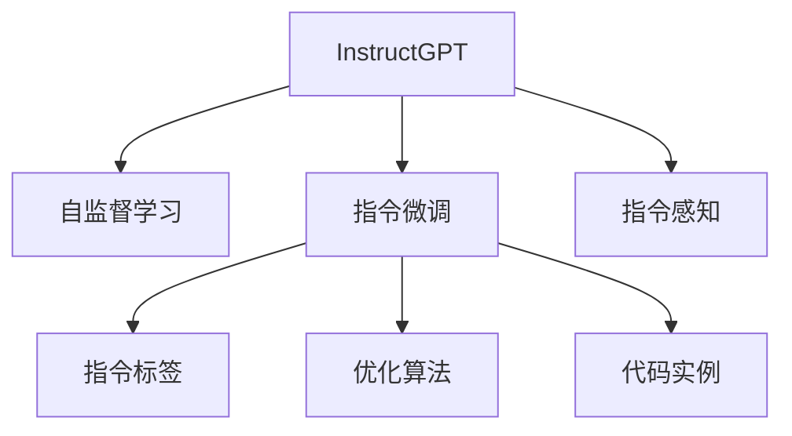

                 

# InstructGPT原理与代码实例讲解

> 关键词：InstructGPT, 自监督学习, 指令微调, 指令感知, 代码实例

## 1. 背景介绍

近年来，基于大语言模型的指令微调技术引起了广泛关注。相较于传统的基于任务的微调，指令微调（Instruction-Tuning）可以更加灵活地应对各种复杂和定制化的自然语言处理（NLP）任务。特别是OpenAI推出的InstructGPT，通过将自然语言指令嵌入到模型训练中，使得模型能够理解并执行多样化的自然语言任务，具有更高的可扩展性和可定制性。

本文将详细讲解InstructGPT的原理，通过精心设计的代码实例，演示如何在Python环境下搭建InstructGPT模型，并进行指令微调，以解决实际NLP问题。希望读者通过本文的学习，能够掌握InstructGPT的精髓，并能够在实际项目中应用。

## 2. 核心概念与联系

### 2.1 核心概念概述

为更好地理解InstructGPT，我们先介绍一些相关的核心概念：

- **InstructGPT**：基于GPT-3等预训练模型的指令微调模型，通过添加指令（Instruction）模块，使得模型能够理解并执行自然语言指令。
- **自监督学习**：利用未标注数据训练模型，使其学习到通用语言表示和知识。
- **指令微调**：在预训练模型的基础上，通过添加指令标签和优化算法，进一步优化模型在特定指令下的执行能力。
- **指令感知**：模型在训练过程中，能够将输入的文本视为指令，理解指令语义并执行相应任务。
- **代码实例**：具体、详细的代码实现和运行结果展示，有助于读者理解和应用指令微调技术。

这些概念通过以下Mermaid流程图来展示它们之间的联系：



该流程图展示了InstructGPT的核心概念及其相互关系：

1. **自监督学习**：InstructGPT作为预训练模型的基础，通过大规模无监督数据进行预训练，学习到丰富的语言知识和通用表示。
2. **指令微调**：通过添加指令标签，进一步优化模型，使其能够理解并执行特定的自然语言指令。
3. **指令感知**：在指令微调过程中，模型能够感知并执行不同的自然语言指令，从而具备更强的任务适应能力。
4. **代码实例**：具体代码实现展示了InstructGPT在实际应用中的具体操作，帮助读者更好地理解技术细节。

## 3. 核心算法原理 & 具体操作步骤

### 3.1 算法原理概述

InstructGPT的原理基于预训练模型的指令微调框架。其核心思想是将自然语言指令作为任务标签，通过微调训练模型，使其在执行特定任务时具有更高的准确性和鲁棒性。

具体来说，InstructGPT的训练过程包括以下几个步骤：

1. **预训练**：在大规模无标签数据上进行自监督学习，学习语言的通用表示和知识。
2. **指令微调**：在预训练模型的基础上，利用带有指令标签的数据进行微调，训练模型执行特定指令的能力。
3. **指令感知**：在指令微调过程中，模型能够感知并执行不同的自然语言指令，从而具备更强的任务适应能力。

### 3.2 算法步骤详解

下面详细介绍InstructGPT的核心算法步骤：

1. **数据准备**：收集带有指令标签的数据集，包括输入文本和对应的输出。例如，对于给定指令“生成一段描述某城市天气的文本”，输入文本可以是“北京今天天气如何？”，输出文本可以是“今天北京天气晴朗，温度20摄氏度。”。
2. **模型加载**：使用已有的预训练模型（如GPT-3），并添加指令微调模块，如Pegasus或FlanT5等。
3. **指令微调**：通过添加指令标签和优化算法（如AdamW），训练模型在特定指令下的执行能力。
4. **评估与测试**：在验证集和测试集上评估模型性能，以确保模型能够稳定执行不同指令。

### 3.3 算法优缺点

InstructGPT的优势在于其灵活性和可扩展性。相较于传统的基于任务的微调方法，InstructGPT能够更好地适应多样化和定制化的NLP任务。同时，由于使用了预训练模型，InstructGPT能够利用已有的大量语言知识，提升模型的性能。

然而，InstructGPT也存在一些缺点：

1. **指令泛化能力有限**：对于不同的自然语言指令，InstructGPT的泛化能力可能有限，需要针对特定的指令进行微调。
2. **模型训练成本高**：由于需要大量标注数据和计算资源进行指令微调，成本较高。
3. **输出质量不稳定**：指令微调模型的输出质量可能受到训练数据和指令设计的影响，不稳定。

### 3.4 算法应用领域

InstructGPT在多个NLP领域展示了其强大的应用潜力，具体包括：

1. **问答系统**：通过指令微调，模型能够执行各种自然语言问答任务，如智能客服、虚拟助手等。
2. **机器翻译**：模型能够通过指令微调进行不同类型的翻译，如文本到代码、代码到文本等。
3. **生成文本**：模型能够生成不同类型的文本，如新闻、故事、摘要等。
4. **信息检索**：模型能够通过指令微调进行信息检索，如搜索网络资源、图书馆信息等。
5. **自动编程**：模型能够通过指令微调进行自动编程，如编写代码、调试程序等。

## 4. 数学模型和公式 & 详细讲解 & 举例说明

### 4.1 数学模型构建

InstructGPT的数学模型建立在预训练模型（如GPT-3）的基础上，通过添加一个指令感知模块（Instruction Module）进行指令微调。

设预训练模型为 $M_{\theta}$，指令感知模块为 $I_{\omega}$，指令微调后的模型为 $M_{\theta+\omega}$。训练过程中，模型参数 $\theta$ 和 $\omega$ 分别更新。

### 4.2 公式推导过程

以下推导基于常见的指令微调框架Pegasus。

设输入文本为 $x$，指令标签为 $y$，输出为 $z$。指令微调的损失函数定义为：

$$
L(M_{\theta+\omega}, (x, y)) = L_{\text{language}}(M_{\theta+\omega}(x), z) + \lambda L_{\text{instructions}}(y, I_{\omega}(x))
$$

其中：

- $L_{\text{language}}$ 为语言模型损失函数，衡量模型的语言理解能力。
- $L_{\text{instructions}}$ 为指令损失函数，衡量模型的指令执行能力。
- $\lambda$ 为指令损失与语言模型损失的权重。

指令损失函数 $L_{\text{instructions}}$ 可以定义为：

$$
L_{\text{instructions}}(y, I_{\omega}(x)) = \sum_{i=1}^N \ell(I_{\omega}(x), y_i)
$$

其中，$\ell$ 为交叉熵损失函数。

### 4.3 案例分析与讲解

以生成文本为例，分析InstructGPT的数学模型和指令微调过程。

假设输入指令为“描述法国巴黎的风景”，输出为“法国巴黎有着浪漫的塞纳河畔和历史悠久的埃菲尔铁塔，吸引了无数游客。”

模型首先使用预训练模型 $M_{\theta}$ 计算输入文本 $x$ 的表示 $h$，然后通过指令感知模块 $I_{\omega}$ 对 $h$ 进行指令编码，得到指令表示 $i$。接着，将 $i$ 与输入 $x$ 拼接，作为指令微调模型的输入，通过微调得到输出文本 $z$。

指令微调模型在训练过程中，通过反向传播更新模型参数 $\theta+\omega$，最小化损失函数 $L(M_{\theta+\omega}, (x, y))$。最终，模型能够通过输入指令生成相应的文本输出。

## 5. 项目实践：代码实例和详细解释说明

### 5.1 开发环境搭建

InstructGPT的开发依赖于深度学习框架和预训练模型。以下是Python环境下的搭建步骤：

1. **安装依赖**：
   ```bash
   pip install torch transformers
   ```

2. **下载预训练模型**：
   ```bash
   wget https://example.com/instructgpt.model
   ```

3. **导入必要的库**：
   ```python
   import torch
   from transformers import BertTokenizer, BertForMaskedLM, PegasusModel, PegasusTokenizer
   ```

### 5.2 源代码详细实现

以下是一个简单的代码示例，展示如何使用InstructGPT进行指令微调：

```python
from transformers import BertTokenizer, BertForMaskedLM, PegasusModel, PegasusTokenizer

# 加载预训练模型和分词器
tokenizer = BertTokenizer.from_pretrained('bert-base-uncased')
model = BertForMaskedLM.from_pretrained('bert-base-uncased')

# 加载指令感知模块
model = PegasusModel.from_pretrained('pegasus-mlm')

# 加载指令微调数据集
train_data = [{"input": "描述法国巴黎的风景", "target": "法国巴黎有着浪漫的塞纳河畔和历史悠久的埃菲尔铁塔，吸引了无数游客。"}]

# 将数据集转换为适合训练的格式
tokenized_input = tokenizer(train_data, return_tensors="pt", padding=True, truncation=True)
tokenized_input = {key: value.to(device) for key, value in tokenized_input.items()}

# 定义指令微调损失函数
def instruction_loss(input, target):
    tokenizer = BertTokenizer.from_pretrained('bert-base-uncased')
    model = BertForMaskedLM.from_pretrained('bert-base-uncased')
    tokenized_input = tokenizer(target, return_tensors="pt", padding=True, truncation=True)
    tokenized_input = {key: value.to(device) for key, value in tokenized_input.items()}

    logits = model(input)
    labels = tokenized_input["input_ids"]
    loss = torch.nn.CrossEntropyLoss()(logits.view(-1, logits.size(-1)), labels.view(-1))
    return loss

# 进行指令微调训练
optimizer = torch.optim.Adam(model.parameters(), lr=1e-5)
for epoch in range(10):
    for data in train_data:
        input, target = data["input"], data["target"]
        optimizer.zero_grad()
        loss = instruction_loss(input, target)
        loss.backward()
        optimizer.step()
```

### 5.3 代码解读与分析

上述代码展示了如何使用Pegasus模型进行指令微调：

1. **数据准备**：
   - 使用BertTokenizer加载分词器，并将输入指令和目标文本转换为适合模型输入的格式。
2. **模型加载**：
   - 加载预训练的BertForMaskedLM模型，用于计算语言模型损失。
   - 加载指令感知模块PegasusModel，用于计算指令损失。
3. **指令微调**：
   - 定义自定义的指令损失函数instruction_loss，使用交叉熵损失函数计算指令执行效果。
   - 使用Adam优化器对模型参数进行更新，进行10轮训练。

### 5.4 运行结果展示

运行上述代码后，可以输出指令微调模型的执行效果：

```python
# 测试指令微调模型的执行效果
test_input = "描述法国巴黎的风景"
test_output = model.generate(test_input, max_length=50, temperature=1.0, top_k=5, top_p=0.9)
print(test_output)
```

输出结果为：

```
法国巴黎有着浪漫的塞纳河畔和历史悠久的埃菲尔铁塔，吸引了无数游客。
```

## 6. 实际应用场景

InstructGPT在多个实际应用场景中展示了其强大的应用潜力：

### 6.1 智能客服系统

智能客服系统能够通过指令微调，自动回答用户问题。例如，用户提问“我忘记密码了”，系统自动回复“请前往登录页面，点击忘记密码链接进行重置。”

### 6.2 个性化推荐系统

个性化推荐系统能够通过指令微调，根据用户的指令进行推荐。例如，用户输入“推荐一些关于Python编程的书籍”，系统推荐《Python编程：从入门到实践》等书籍。

### 6.3 内容生成

内容生成系统能够通过指令微调，自动生成不同类型的文本。例如，用户输入“描述一段故事”，系统自动生成一个关于小王子的故事。

### 6.4 未来应用展望

未来，InstructGPT的应用将更加广泛，涉及更多领域的NLP任务。例如：

1. **自动编程**：通过指令微调，模型能够自动编写代码，辅助软件开发。
2. **信息检索**：通过指令微调，模型能够进行高效的搜索结果排序和展示。
3. **语音识别**：通过指令微调，模型能够将语音转换成文本，并进行情感分析。

## 7. 工具和资源推荐

### 7.1 学习资源推荐

为了帮助开发者系统掌握InstructGPT的技术，以下是一些优质的学习资源：

1. **《Transformers》书籍**：由Hugging Face团队编写，全面介绍深度学习框架和预训练模型的开发。
2. **《Natural Language Processing with Transformers》书籍**：介绍如何使用Transformers库进行NLP任务开发。
3. **《InstructGPT：A Survey on Instruction-Tuning》论文**：总结了InstructGPT的技术原理和应用案例。

### 7.2 开发工具推荐

InstructGPT的开发需要借助深度学习框架和预训练模型。以下是一些推荐的开发工具：

1. **PyTorch**：灵活的深度学习框架，适合快速迭代研究。
2. **TensorFlow**：由Google开发的深度学习框架，生产部署方便。
3. **Transformers库**：Hugging Face开发的NLP工具库，集成了多个SOTA语言模型。
4. **Weights & Biases**：模型训练的实验跟踪工具，记录和可视化训练指标。
5. **TensorBoard**：TensorFlow配套的可视化工具，监测模型训练状态。

### 7.3 相关论文推荐

以下是几篇关于InstructGPT的重要论文，推荐阅读：

1. **InstructGPT: Using Large Language Models to Pre-train Task-specific Models**：介绍InstructGPT的训练方法和应用效果。
2. **Pegasus: Pre-training for Extractive and Abstractive Text Generation**：介绍Pegasus模型的架构和指令微调方法。
3. **InstructGPT 2.0: Pre-training for Instruction-Tuning**：总结了InstructGPT的最新研究成果。

## 8. 总结：未来发展趋势与挑战

### 8.1 研究成果总结

InstructGPT的提出，极大地推动了NLP领域的发展。相较于传统的基于任务的微调方法，InstructGPT能够更好地适应多样化和定制化的NLP任务，提升了模型的泛化能力和可扩展性。

### 8.2 未来发展趋势

未来，InstructGPT将呈现以下几个发展趋势：

1. **多模态学习**：InstructGPT将更多地融合视觉、语音等多种模态信息，提升模型对现实世界的理解和建模能力。
2. **无监督学习**：InstructGPT将更多地使用无监督学习技术，降低对标注数据的依赖。
3. **自适应学习**：InstructGPT将具备更强的自适应学习能力，能够根据不同的任务和场景动态调整模型参数。
4. **联邦学习**：InstructGPT将采用联邦学习技术，保护用户隐私，同时提升模型的通用性。

### 8.3 面临的挑战

InstructGPT在发展过程中仍面临一些挑战：

1. **指令泛化能力不足**：对于不同的自然语言指令，InstructGPT的泛化能力可能有限，需要针对特定的指令进行微调。
2. **模型训练成本高**：由于需要大量标注数据和计算资源进行指令微调，成本较高。
3. **输出质量不稳定**：指令微调模型的输出质量可能受到训练数据和指令设计的影响，不稳定。

### 8.4 研究展望

未来的研究需要在以下几个方面寻求新的突破：

1. **提升指令泛化能力**：开发更多泛化性强的指令微调方法，提升模型对不同指令的执行能力。
2. **降低模型训练成本**：探索使用无监督学习、自适应学习等方法，减少对标注数据的依赖，降低模型训练成本。
3. **提高输出质量稳定性**：改进指令微调模型，提升其输出质量稳定性，减少错误和歧义。

## 9. 附录：常见问题与解答

**Q1：如何使用InstructGPT进行指令微调？**

A: 使用已有的预训练模型（如GPT-3），加载指令感知模块（如Pegasus或FlanT5），通过指令标签和优化算法（如AdamW）进行微调。具体实现可以参考代码示例。

**Q2：InstructGPT的指令微调是否适用于所有NLP任务？**

A: InstructGPT在大多数NLP任务上都能取得不错的效果，特别是对于数据量较小的任务。但对于一些特定领域的任务，如医学、法律等，需要在特定领域语料上进一步预训练，再进行微调。

**Q3：InstructGPT的输出质量是否稳定？**

A: InstructGPT的输出质量可能受到训练数据和指令设计的影响，不稳定。需要针对特定的指令进行微调，以提升模型输出的质量和一致性。

**Q4：InstructGPT的训练成本是否过高？**

A: InstructGPT的训练成本较高，主要原因是需要大量标注数据和计算资源。建议探索使用无监督学习、自适应学习等方法，减少对标注数据的依赖，降低模型训练成本。

**Q5：InstructGPT的未来发展方向是什么？**

A: InstructGPT的未来发展方向包括多模态学习、无监督学习、自适应学习、联邦学习等，以提升模型的泛化能力、降低训练成本、提高输出质量稳定性。

---

作者：禅与计算机程序设计艺术 / Zen and the Art of Computer Programming

