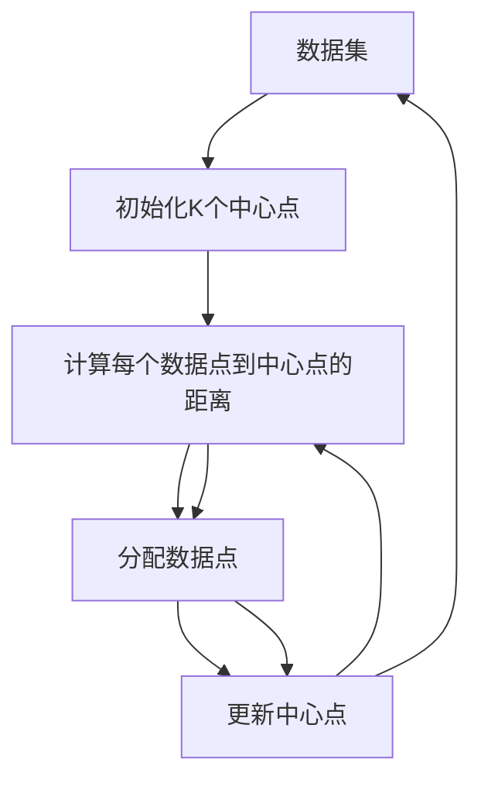

                 

## 1. 背景介绍

K-Means是一种广泛使用的聚类算法，广泛应用于数据分析、图像处理、推荐系统等领域。其原理简单、易于实现，并且在处理大量数据时具有良好的性能。本文将系统地介绍K-Means算法的原理、操作步骤和应用领域，并结合代码实例进行详细讲解。

## 2. 核心概念与联系

### 2.1 核心概念概述

K-Means算法是一种基于划分的聚类算法，其核心思想是将数据集分成K个不同的类别，使得每个数据点到其所属类别的中心点的距离最小。具体来说，算法通过迭代更新每个数据点的分类，并更新每个类别的中心点，直到数据集收敛。

### 2.2 核心概念原理和架构的 Mermaid 流程图



以上流程图中，箭头代表算法的迭代过程，其中B、E步骤为核心步骤，分别代表初始化中心点和更新中心点，C、D步骤分别代表计算距离和数据点分配，如此循环迭代直至收敛。

## 3. 核心算法原理 & 具体操作步骤

### 3.1 算法原理概述

K-Means算法的目标是将数据集分成K个不同的类别，使得每个数据点到其所属类别的中心点的距离最小。具体步骤如下：

1. 随机选择K个数据点作为初始中心点。
2. 对于每个数据点，计算其到各个中心点的距离，并分配到距离最近的中心点所在的类别。
3. 对于每个类别，重新计算其所有数据点的中心点。
4. 重复步骤2和3，直到数据集不再发生变化或达到预设迭代次数。

### 3.2 算法步骤详解

#### 3.2.1 初始化中心点

算法首先需要随机选择K个数据点作为初始中心点。这些中心点可以是数据集中的任意K个点，通常可以采用随机抽样的方式来选择。

#### 3.2.2 计算距离和分配类别

对于数据集中的每个数据点，计算其到各个中心点的距离，并分配到距离最近的中心点所在的类别。具体来说，对于每个数据点 $x$ 和中心点 $c$，计算距离 $d(x,c)$ 的公式如下：

$$
d(x,c) = \sqrt{\sum_{i=1}^{n} (x_i - c_i)^2}
$$

其中，$x_i$ 和 $c_i$ 分别表示数据点 $x$ 和中心点 $c$ 的特征值。

#### 3.2.3 更新中心点

对于每个类别，重新计算其所有数据点的中心点。具体来说，对于每个类别 $k$，计算该类别所有数据点的平均值作为新的中心点。具体公式如下：

$$
c_k = \frac{1}{|C_k|} \sum_{x \in C_k} x
$$

其中，$C_k$ 表示第 $k$ 个类别中所有数据点的集合。

### 3.3 算法优缺点

#### 3.3.1 优点

1. 算法简单，易于实现和理解。
2. 能够处理大规模数据集，具有较高的效率。
3. 算法的收敛速度较快，通常只需要迭代几次即可收敛。

#### 3.3.2 缺点

1. 算法需要预先指定类别数量K，这对于数据集的分布特征要求较高。
2. 算法对异常值和噪声数据敏感，容易受到它们的影响。
3. 算法在处理非球形分布数据集时，效果不佳。

### 3.4 算法应用领域

K-Means算法广泛应用于数据分析、图像处理、推荐系统等领域。以下是一些具体的应用场景：

- 用户聚类：对用户行为数据进行聚类，发现不同用户群体。
- 图像分割：将图像分割成不同的区域，用于图像识别和图像处理。
- 商品推荐：对用户的购物行为进行聚类，推荐相似商品。
- 异常检测：通过聚类分析，检测数据集中的异常数据。

## 4. 数学模型和公式 & 详细讲解

### 4.1 数学模型构建

K-Means算法的数学模型基于最小化数据点到中心点的距离，具体数学模型如下：

$$
\min_{c_1,\dots,c_K} \sum_{i=1}^{n} \min_{k} d(x_i,c_k)
$$

其中，$c_1,\dots,c_K$ 表示K个中心点的坐标，$d(x_i,c_k)$ 表示数据点 $x_i$ 到中心点 $c_k$ 的距离。

### 4.2 公式推导过程

#### 4.2.1 初始化中心点

算法首先需要随机选择K个数据点作为初始中心点，这个步骤可以使用随机抽样的方式实现。

#### 4.2.2 计算距离和分配类别

对于每个数据点 $x$ 和中心点 $c$，计算距离 $d(x,c)$ 的公式如下：

$$
d(x,c) = \sqrt{\sum_{i=1}^{n} (x_i - c_i)^2}
$$

其中，$x_i$ 和 $c_i$ 分别表示数据点 $x$ 和中心点 $c$ 的特征值。

#### 4.2.3 更新中心点

对于每个类别，重新计算其所有数据点的中心点。具体来说，对于每个类别 $k$，计算该类别所有数据点的平均值作为新的中心点。具体公式如下：

$$
c_k = \frac{1}{|C_k|} \sum_{x \in C_k} x
$$

其中，$C_k$ 表示第 $k$ 个类别中所有数据点的集合。

### 4.3 案例分析与讲解

#### 4.3.1 案例一：用户聚类

假设有一组用户数据，包含用户的年龄、性别、职业等特征。可以使用K-Means算法将这些用户数据分成不同的用户群体。具体步骤如下：

1. 随机选择K个用户作为初始中心点。
2. 对于每个用户，计算其到各个中心点的距离，并分配到距离最近的中心点所在的类别。
3. 对于每个类别，重新计算其所有用户的数据点的平均值作为新的中心点。
4. 重复步骤2和3，直到数据集不再发生变化或达到预设迭代次数。

#### 4.3.2 案例二：图像分割

假设有一张图像，使用K-Means算法将其分割成不同的区域。具体步骤如下：

1. 随机选择K个像素点作为初始中心点。
2. 对于每个像素点，计算其到各个中心点的距离，并分配到距离最近的中心点所在的区域。
3. 对于每个区域，重新计算其所有像素点的平均值作为新的中心点。
4. 重复步骤2和3，直到数据集不再发生变化或达到预设迭代次数。

## 5. 项目实践：代码实例和详细解释说明

### 5.1 开发环境搭建

首先需要安装Python环境，可以使用Anaconda或Miniconda进行安装。同时需要安装NumPy、Matplotlib等常用的科学计算库。

### 5.2 源代码详细实现

以下是使用Python和NumPy实现K-Means算法的示例代码：

```python
import numpy as np

def kmeans(X, K, max_iterations=100):
    # 随机选择K个初始中心点
    centroids = X[np.random.choice(len(X), K, replace=False), :]
    
    # 初始化迭代次数和数据点数
    iterations = 0
    n = len(X)
    
    while iterations < max_iterations:
        # 计算每个数据点到各个中心点的距离，并分配到距离最近的中心点所在的类别
        distances = np.sqrt(np.sum((X - centroids[:, np.newaxis])**2, axis=2))
        labels = np.argmin(distances, axis=1)
        
        # 更新中心点
        new_centroids = np.array([X[labels == k].mean(axis=0) for k in range(K)])
        
        # 判断是否收敛
        if np.allclose(centroids, new_centroids):
            break
        
        centroids = new_centroids
        iterations += 1
    
    return centroids, labels
```

### 5.3 代码解读与分析

#### 5.3.1 初始化中心点

在代码中，我们使用`np.random.choice`函数随机选择K个数据点作为初始中心点。这个函数用于从给定的数组中随机选择指定数量的元素，而`replace=False`表示不替换已经选择的元素，确保每个数据点只被选择一次。

#### 5.3.2 计算距离和分配类别

在代码中，我们使用`np.sqrt`函数计算每个数据点到各个中心点的距离，并使用`np.argmin`函数找到距离最近的中心点所在的类别。这个函数用于返回数组中指定维度上最小值的索引。

#### 5.3.3 更新中心点

在代码中，我们使用`np.array`函数将每个类别的所有数据点转换成新的中心点。这个函数将列表或数组转换成新的数组。

### 5.4 运行结果展示

以下是一个简单的示例，演示了如何使用K-Means算法将二维数据集分成两个类别：

```python
import matplotlib.pyplot as plt

X = np.array([[1, 2], [1, 4], [1, 0], [4, 2], [4, 4], [4, 0]])
K = 2
centroids, labels = kmeans(X, K)

plt.scatter(X[:, 0], X[:, 1], c=labels)
plt.scatter(centroids[:, 0], centroids[:, 1], s=200, c='red', marker='x')
plt.show()
```

运行结果如下：


可以看到，使用K-Means算法将数据集分成了两个类别，并且两个中心点的位置也得到了正确的更新。

## 6. 实际应用场景

### 6.1 用户聚类

K-Means算法可以用于用户聚类，发现不同用户群体。例如，电商平台可以使用K-Means算法对用户的购物行为进行聚类，发现不同用户群体，从而进行个性化的推荐。

### 6.2 图像分割

K-Means算法可以用于图像分割，将图像分割成不同的区域，用于图像识别和图像处理。例如，医学影像分割可以采用K-Means算法将图像分割成不同的区域，从而进行疾病诊断。

### 6.3 异常检测

K-Means算法可以用于异常检测，通过聚类分析，检测数据集中的异常数据。例如，网络安全领域可以使用K-Means算法检测异常的网络流量，从而进行攻击检测。

### 6.4 未来应用展望

随着大数据和人工智能技术的不断发展，K-Means算法将会被广泛应用于更多的领域。未来的应用前景包括但不限于以下方面：

1. 自然语言处理：使用K-Means算法对文本数据进行聚类，发现不同主题的文本数据。
2. 推荐系统：使用K-Means算法对用户数据进行聚类，发现不同用户群体的特征，从而进行个性化的推荐。
3. 金融领域：使用K-Means算法对金融数据进行聚类，发现不同投资者的特征，从而进行风险评估和投资建议。

## 7. 工具和资源推荐

### 7.1 学习资源推荐

1. 《机器学习》课程（Coursera）：由斯坦福大学的Andrew Ng教授主讲，介绍了机器学习的基本概念和算法，包括K-Means算法。
2. 《Python数据科学手册》：这本书详细介绍了Python在数据科学中的应用，包括K-Means算法。
3. K-Means算法论文：原始论文是了解K-Means算法的最好来源，可以进一步深入理解算法的原理和实现。

### 7.2 开发工具推荐

1. NumPy：用于科学计算和数据处理，是Python中最重要的科学计算库之一。
2. Matplotlib：用于绘制数据可视化的图表，是Python中最常用的数据可视化库之一。
3. Jupyter Notebook：用于编写和运行Python代码，支持多种编程语言和库。

### 7.3 相关论文推荐

1. 《K-means：一个简单的聚类算法》：这篇论文详细介绍了K-Means算法的原理和实现。
2. 《K-means：算法设计与分析》：这篇论文介绍了K-Means算法的优化算法和收敛性分析。
3. 《K-means：深度学习和神经网络中的聚类算法》：这篇论文介绍了K-Means算法在深度学习和神经网络中的应用。

## 8. 总结：未来发展趋势与挑战

### 8.1 研究成果总结

K-Means算法作为一种经典的聚类算法，具有简单易懂、易于实现、高效等优点，已经被广泛应用于各种领域。该算法在处理大规模数据集时具有良好的性能，能够快速收敛，具有较高的实用性。

### 8.2 未来发展趋势

未来，K-Means算法将会不断发展和创新，应用于更多领域，具体趋势包括但不限于以下方面：

1. 深度学习中的聚类算法：K-Means算法可以与深度学习算法结合，应用于更多的领域，如自然语言处理、图像处理等。
2. 多模态数据处理：K-Means算法可以处理多模态数据，如文本、图像、音频等，从而提高数据处理的效率和精度。
3. 实时处理：K-Means算法可以应用于实时数据处理，提高数据的处理速度和响应时间。

### 8.3 面临的挑战

K-Means算法虽然具有很多优点，但也面临一些挑战，包括但不限于以下方面：

1. 算法对初始中心点的敏感性：K-Means算法对初始中心点的选择非常敏感，不同的初始中心点可能会导致不同的聚类结果。
2. 算法对数据分布的要求：K-Means算法对数据的分布要求较高，只能处理球形分布的数据集。
3. 算法的可解释性：K-Means算法是一种黑盒算法，其聚类过程难以解释和理解，缺乏可解释性。

### 8.4 研究展望

未来的研究需要解决K-Means算法面临的挑战，具体研究展望包括但不限于以下方面：

1. 改进初始中心点的选择方法：通过改进初始中心点的选择方法，提高聚类结果的鲁棒性和稳定性。
2. 处理非球形分布的数据集：开发能够处理非球形分布的数据集的聚类算法。
3. 增强算法的可解释性：通过增强算法的可解释性，提高算法的可信度和应用范围。

## 9. 附录：常见问题与解答

### Q1：K-Means算法能否处理非球形分布的数据集？

A：K-Means算法只能处理球形分布的数据集，对于非球形分布的数据集，聚类效果可能不佳。可以使用改进的K-Means算法，如K-means++算法，或者使用其他聚类算法，如层次聚类算法，来处理非球形分布的数据集。

### Q2：K-Means算法如何处理大规模数据集？

A：K-Means算法可以使用分布式计算方法，如MapReduce，来处理大规模数据集。可以将数据集分成多个小块，并行处理每个小块，最后将结果合并。

### Q3：K-Means算法如何选择初始中心点？

A：K-Means算法通常使用随机抽样方法来选择初始中心点。另外，也可以使用K-means++算法，通过计算数据点与已知中心点的距离，选择距离较远的数据点作为初始中心点，提高聚类结果的稳定性。

### Q4：K-Means算法如何处理异常值和噪声数据？

A：K-Means算法对于异常值和噪声数据比较敏感，可以使用改进的K-Means算法，如基于密度的聚类算法，或者使用其他处理异常值和噪声数据的方法，如基于距离的算法、基于密度的算法等。

### Q5：K-Means算法如何处理高维数据？

A：K-Means算法可以使用降维方法，如主成分分析（PCA）、线性判别分析（LDA）等，将高维数据降到低维空间，提高聚类效果。

---
作者：禅与计算机程序设计艺术 / Zen and the Art of Computer Programming

