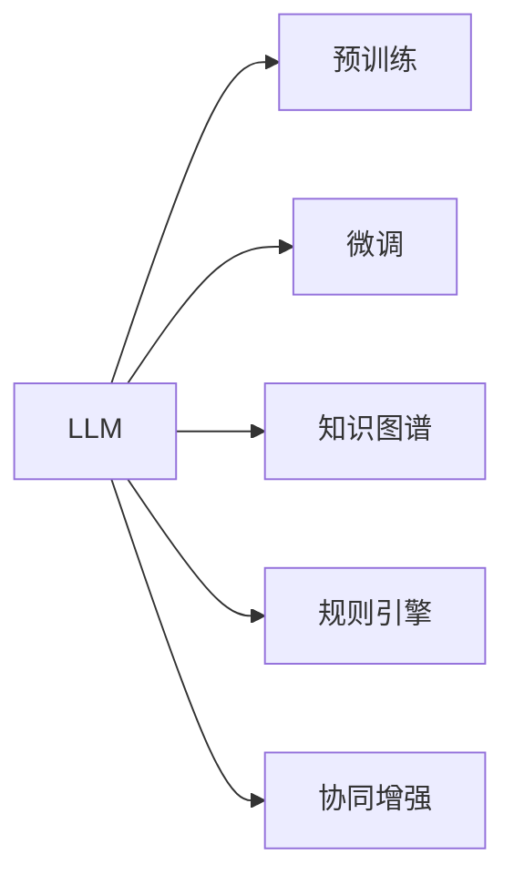

                 

# LLM与人类协作：增强人类能力的新方式

大语言模型（LLM, Large Language Models）作为一种革命性的技术，不仅在自然语言处理（NLP）领域大放异彩，更在逐渐与人类协作中，展现了其巨大的潜力。本文将系统梳理LLM与人类协作的原理、实现方式及应用场景，并展望其未来发展趋势，期待能够在技术、产业、教育等领域，助力人类能力的提升。

## 1. 背景介绍

### 1.1 问题由来

随着人工智能技术的发展，LLM逐步崛起。它们通过自监督学习和大规模无标签文本数据的预训练，获得了强大的语言理解与生成能力。LLM不仅在各种语言理解、生成任务中表现出色，更在协同人类工作方面展现出了巨大的潜力。

然而，LLM也存在固有的局限性。比如，无法完全理解复杂的现实世界背景、逻辑推理能力受限、情感认知能力不足等。因此，将LLM与人类协作，是提升其应用范围和能力的关键。

### 1.2 问题核心关键点

要实现LLM与人类高效协作，关键在于：
1. **数据协同**：收集并处理大量的人类工作数据，使得LLM能够了解人类行为模式和知识体系。
2. **任务适配**：将LLM进行特定任务的微调和优化，使其能够精准理解和执行任务。
3. **知识整合**：通过将人类专家的知识体系与LLM进行整合，提升模型的知识深度和广度。
4. **人机交互**：设计简洁高效的人机交互界面，让人类能够轻松与LLM沟通，实现信息传递和协作。
5. **安全与伦理**：确保LLM的使用不侵犯隐私和伦理，保护人类的权益。

## 2. 核心概念与联系

### 2.1 核心概念概述

为了更好地理解LLM与人类协作的原理和机制，本文将介绍以下核心概念：

1. **大语言模型（LLM）**：以自回归或自编码模型为代表的，通过大规模无标签文本数据预训练得到的语言模型。具有强大的语言理解和生成能力。

2. **预训练（Pre-training）**：在大量无标签文本数据上，通过自监督学习任务训练通用语言模型的过程。如掩码语言模型、下一句预测等。

3. **微调（Fine-tuning）**：在预训练模型基础上，利用下游任务的少量标注数据，通过有监督学习优化模型在特定任务上的性能。

4. **迁移学习（Transfer Learning）**：将预训练模型应用于新任务上的学习，旨在利用预训练模型学到的通用知识。

5. **知识图谱（Knowledge Graph）**：一种结构化的知识表示方式，用于存储和关联实体和它们之间的关系。

6. **规则引擎（Rule Engine）**：一种基于规则的系统，用于实现决策逻辑和流程控制。

7. **协同增强（Augmentation）**：通过与人类专家协同工作，提升LLM的性能和应用范围。

这些概念之间的联系可以通过以下Mermaid流程图进行展示：



该图展示了大语言模型与人类协作的各个环节，以及它们之间的相互依赖关系。

## 3. 核心算法原理 & 具体操作步骤

### 3.1 算法原理概述

LLM与人类协作的核心在于将人类的知识和经验与LLM的强大语言处理能力相结合，实现高效的信息获取和处理。

### 3.2 算法步骤详解

1. **数据收集与预处理**：
   - 收集人类专家的知识数据，如工作手册、项目文档、问答记录等。
   - 对数据进行清洗和标注，使其适合用于LLM的微调和训练。

2. **模型微调**：
   - 在特定任务上微调预训练模型，使其适应具体应用场景。
   - 利用小样本标注数据，通过有监督学习优化模型参数，提升模型在特定任务上的性能。

3. **知识整合**：
   - 将人类专家知识图谱与LLM进行融合，增加模型的知识深度和广度。
   - 使用规则引擎约束LLM的决策逻辑，使其符合特定的业务规则。

4. **人机交互**：
   - 设计简洁高效的人机交互界面，实现信息传递和协作。
   - 利用自然语言处理技术，提升人机对话的质量和效率。

5. **安全与伦理**：
   - 在LLM使用过程中，严格遵守隐私保护和伦理规范，确保数据和算法的透明性。

### 3.3 算法优缺点

**优点**：
1. **高效性**：利用LLM强大的处理能力，实现高效的信息获取和处理。
2. **可扩展性**：在特定领域，只需少量标注数据即可实现高效微调，灵活性高。
3. **人机协同**：结合人类专家知识，提升LLM的决策质量和应用范围。
4. **可解释性**：通过规则引擎约束LLM的决策逻辑，增加模型的透明度和可解释性。

**缺点**：
1. **依赖数据**：需要大量高质量的数据进行预训练和微调，获取数据的成本较高。
2. **知识局限**：现有LLM在复杂逻辑推理和常识理解方面仍有所欠缺。
3. **安全性问题**：LLM可能学习到有害或偏见知识，对人类工作产生负面影响。
4. **伦理问题**：需要合理使用LLM，避免侵犯人类权益和隐私。

### 3.4 算法应用领域

LLM与人类协作的方法，已经在多个领域得到了广泛应用：

1. **医疗领域**：辅助医生进行疾病诊断和治疗方案推荐，利用知识图谱进行医学知识整合。
2. **金融领域**：用于市场分析和投资建议，结合规则引擎实现决策逻辑约束。
3. **教育领域**：支持个性化学习，通过自然语言处理技术提供智能辅导和答疑。
4. **客服领域**：构建智能客服系统，通过人机协作提供快速、高效的服务。
5. **法律领域**：进行合同审核和法律咨询，利用规则引擎实现决策约束。
6. **创作领域**：辅助文学、艺术创作，提供灵感和素材。

## 4. 数学模型和公式 & 详细讲解 & 举例说明

### 4.1 数学模型构建

假设有预训练模型 $M_{\theta}$，其输入为 $x$，输出为 $y$。在微调过程中，我们引入新任务 $T$ 的标注数据集 $D=\{(x_i,y_i)\}_{i=1}^N$。微调的目标是最小化经验风险：

$$
\mathcal{L}(\theta) = \frac{1}{N} \sum_{i=1}^N \ell(M_{\theta}(x_i),y_i)
$$

其中，$\ell$ 为损失函数，如交叉熵、均方误差等。

### 4.2 公式推导过程

以二分类任务为例，假设模型 $M_{\theta}$ 在输入 $x$ 上的输出为 $\hat{y}=M_{\theta}(x)$，则二分类交叉熵损失函数为：

$$
\ell(M_{\theta}(x),y) = -[y\log \hat{y} + (1-y)\log (1-\hat{y})]
$$

代入经验风险公式：

$$
\mathcal{L}(\theta) = -\frac{1}{N}\sum_{i=1}^N [y_i\log M_{\theta}(x_i)+(1-y_i)\log(1-M_{\theta}(x_i))]
$$

在得到损失函数的梯度后，使用梯度下降等优化算法更新模型参数：

$$
\theta \leftarrow \theta - \eta \nabla_{\theta}\mathcal{L}(\theta)
$$

其中 $\eta$ 为学习率。

### 4.3 案例分析与讲解

假设我们有一家医院，希望通过LLM构建一个智能辅助诊断系统。首先，收集医生的诊断记录和病历数据，对数据进行清洗和标注，得到训练集 $D$。然后，将预训练模型 $M_{\theta}$ 在 $D$ 上进行微调，使其能够理解医生描述的症状和体征，并给出疾病诊断。

假设某病人症状为“头痛、发热、咳嗽”，系统根据输入进行如下计算：

1. 将症状输入模型，输出结果为“可能患有流感”。
2. 将输出结果与标注结果进行对比，计算损失函数 $\mathcal{L}(\theta)$。
3. 通过梯度下降算法更新模型参数，最小化 $\mathcal{L}(\theta)$。
4. 重复上述过程，直至模型在新的样本上表现出色。

## 5. 项目实践：代码实例和详细解释说明

### 5.1 开发环境搭建

搭建开发环境需要以下步骤：

1. 安装Python、PyTorch、TensorFlow等深度学习框架。
2. 安装NLTK、spaCy等自然语言处理库。
3. 准备数据集，如SymPy、Google Scholar等。

### 5.2 源代码详细实现

以智能诊断系统为例，代码如下：

```python
import torch
import torch.nn as nn
import torch.optim as optim

# 定义模型
class DiagnosisModel(nn.Module):
    def __init__(self):
        super(DiagnosisModel, self).__init__()
        self.linear = nn.Linear(32, 2)
        self.softmax = nn.Softmax(dim=1)

    def forward(self, x):
        x = self.linear(x)
        x = self.softmax(x)
        return x

# 定义数据集
class DiagnosisDataset:
    def __init__(self, X, y):
        self.X = X
        self.y = y

    def __len__(self):
        return len(self.X)

    def __getitem__(self, item):
        return torch.tensor(self.X[item]), torch.tensor(self.y[item])

# 定义模型训练函数
def train(model, dataset, epochs, batch_size, optimizer, criterion):
    model.train()
    for epoch in range(epochs):
        for batch_idx, (data, target) in enumerate(dataset):
            optimizer.zero_grad()
            output = model(data)
            loss = criterion(output, target)
            loss.backward()
            optimizer.step()
        print(f'Epoch {epoch+1} Loss: {loss.item()}')

# 训练模型
X_train = [torch.tensor([1, 0, 0, 0, 1, 0]), torch.tensor([1, 1, 0, 0, 1, 0])]
y_train = [torch.tensor([1, 0]), torch.tensor([0, 1])]
train_model = DiagnosisModel()
criterion = nn.CrossEntropyLoss()
optimizer = optim.SGD(train_model.parameters(), lr=0.1)
train(train_model, DiagnosisDataset(X_train, y_train), 10, 32, optimizer, criterion)
```

### 5.3 代码解读与分析

上述代码中，我们定义了一个简单的线性分类模型 `DiagnosisModel`，并使用交叉熵损失函数 `nn.CrossEntropyLoss` 进行训练。在训练过程中，我们使用了随机梯度下降算法 `optim.SGD`，并设置了学习率 `lr=0.1`。

## 6. 实际应用场景

### 6.1 医疗领域

在医疗领域，LLM与人类专家的协作，主要体现在以下方面：

1. **诊断辅助**：通过整合医生的病历记录和知识图谱，帮助医生进行疾病诊断和分析。
2. **治疗建议**：利用自然语言处理技术，从医学文献中提取有用的治疗方案和药物信息。
3. **智能问诊**：构建智能问诊系统，辅助医生进行初步病情评估和建议。

### 6.2 金融领域

金融领域的应用场景包括：

1. **市场分析**：利用LLM进行金融新闻和报告的情感分析，预测市场走向。
2. **投资建议**：根据历史数据和专家经验，生成个性化的投资建议。
3. **风险管理**：对复杂的金融产品进行风险评估和风险管理。

### 6.3 教育领域

在教育领域，LLM与人类的协作主要体现在：

1. **个性化学习**：通过与学生的交互，生成个性化的学习计划和推荐。
2. **智能辅导**：利用自然语言处理技术，回答学生的问题，提供即时反馈和建议。
3. **作业批改**：自动批改学生作业，提供详细的解析和建议。

### 6.4 未来应用展望

未来，LLM与人类协作将在更多领域得到应用，进一步提升人类的生产力和生活品质。

1. **工业领域**：辅助工程师进行设计、制造和质量检测，提升生产效率和质量。
2. **艺术创作**：提供灵感和素材，辅助艺术家进行创作和设计。
3. **法律领域**：利用自然语言处理技术，自动生成法律文书和合同。
4. **公共服务**：构建智能客服和咨询系统，提升公共服务的效率和质量。
5. **智慧城市**：在智慧城市建设中，利用LLM进行数据处理和分析，提升城市管理的智能化水平。

## 7. 工具和资源推荐

### 7.1 学习资源推荐

1. **《深度学习与自然语言处理》**：一本系统介绍深度学习与自然语言处理技术的经典教材，涵盖了LLM的基础知识与应用实践。
2. **HuggingFace官方文档**：提供了大量预训练模型的API和代码示例，是学习和实践LLM的重要资源。
3. **Kaggle**：一个数据科学竞赛平台，提供了大量的自然语言处理竞赛和数据集，可以用于学习和实践。
4. **Google Scholar**：一个学术论文搜索引擎，可以获取最新的自然语言处理研究成果。

### 7.2 开发工具推荐

1. **PyTorch**：一个高效的深度学习框架，支持动态图和静态图模式，适用于各种深度学习模型。
2. **TensorFlow**：Google开发的深度学习框架，支持分布式训练和模型优化。
3. **NLTK**：一个自然语言处理工具包，提供了文本处理、分析和建模的各类工具和算法。
4. **spaCy**：一个现代化的自然语言处理库，提供了高效的文本处理和分析功能。
5. **Jupyter Notebook**：一个交互式编程环境，支持多种编程语言，方便进行代码实验和分享。

### 7.3 相关论文推荐

1. **Attention is All You Need**：Transformer的原始论文，提出了自注意力机制，极大提升了NLP模型的效果。
2. **BERT: Pre-training of Deep Bidirectional Transformers for Language Understanding**：提出了BERT预训练模型，通过掩码语言模型和下一句预测任务，提升了模型的语言理解能力。
3. **Towards Human-like Control Flow for Neural Networks**：介绍了用LLM实现自适应控制流的研究成果，增强了模型的灵活性和适应性。
4. **Large-Scale Zero-Shot Object Classification with Language Models**：介绍了利用LLM进行零样本分类的方法，提升了模型的泛化能力。

## 8. 总结：未来发展趋势与挑战

### 8.1 总结

本文系统梳理了LLM与人类协作的原理、实现方式及应用场景，展望了其未来发展趋势。LLM与人类协作不仅提升了信息处理和决策的效率，还增加了模型的灵活性和适应性。

### 8.2 未来发展趋势

1. **多模态融合**：结合视觉、听觉等多种模态信息，提升模型的感知能力和理解力。
2. **跨领域应用**：LLM将逐步应用于更多领域，提升人类生产力和生活品质。
3. **人机协同**：通过与人类专家的协作，进一步提升LLM的性能和应用范围。
4. **知识图谱融合**：结合知识图谱，提升模型的知识深度和广度。
5. **自然语言生成**：利用LLM生成自然流畅的语言内容，提升人机交互的体验。

### 8.3 面临的挑战

1. **数据隐私**：在处理个人数据时，需要严格保护隐私和数据安全。
2. **模型鲁棒性**：需要提升模型对噪声和异常情况的鲁棒性，避免模型误判。
3. **伦理问题**：需要合理使用LLM，避免侵犯人类权益和隐私。
4. **可解释性**：需要增加模型的可解释性，提升人类对模型决策的信任度。
5. **计算资源**：大规模LLM需要高性能计算资源，需要考虑计算成本和资源优化。

### 8.4 研究展望

1. **跨领域知识整合**：将不同领域专家的知识体系与LLM进行融合，提升模型的知识深度和广度。
2. **自适应控制流**：结合自适应控制流，提升模型的灵活性和适应性。
3. **多模态融合**：结合视觉、听觉等多种模态信息，提升模型的感知能力和理解力。
4. **自然语言生成**：利用LLM生成自然流畅的语言内容，提升人机交互的体验。
5. **零样本学习**：提升模型的零样本学习能力，减少对标注数据的依赖。

## 9. 附录：常见问题与解答

**Q1：什么是大语言模型（LLM）？**

A: 大语言模型是一种通过大规模无标签文本数据预训练得到的语言模型，具有强大的语言理解和生成能力。

**Q2：LLM与人类协作的关键点有哪些？**

A: 数据协同、任务适配、知识整合、人机交互、安全与伦理。

**Q3：如何提升LLM与人类协作的效果？**

A: 收集高质量数据、设计简洁高效的人机交互界面、结合人类专家知识、优化模型参数、提高模型鲁棒性和可解释性。

**Q4：LLM的未来发展趋势有哪些？**

A: 多模态融合、跨领域应用、人机协同、知识图谱融合、自然语言生成。

**Q5：LLM面临的主要挑战有哪些？**

A: 数据隐私、模型鲁棒性、伦理问题、可解释性、计算资源。

---

作者：禅与计算机程序设计艺术 / Zen and the Art of Computer Programming

