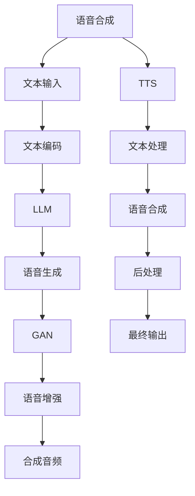

                 

# LLM与传统语音合成技术的结合：语音AI新境界

> 关键词：语音合成(Speech Synthesis), 自然语言处理(NLP), 深度学习(Deep Learning), 生成对抗网络(Generative Adversarial Network, GAN), 大语言模型(Large Language Model, LLM), 语言生成(Language Generation), 语音识别(Speech Recognition), 文本转语音(Text-to-Speech, TTS), 语音增强(Speech Enhancement)

## 1. 背景介绍

### 1.1 问题由来

近年来，语音合成技术取得了显著的进步，尤其是在深度学习和生成对抗网络(GAN)的推动下，语音合成系统已经能够生成与真人几乎无法区分的语音，被广泛应用于虚拟客服、语音助手、有声读物等领域。然而，这些系统依然存在一些局限性，如语音质量受限于数据质量、系统通用性不足等。

与此同时，大语言模型(LLM)凭借其强大的自然语言处理能力，在机器翻译、文本生成等领域取得了突破性进展。LLM在生成自然语言方面表现出色，但将其直接应用于语音合成还面临诸多挑战，如如何合理编码语言生成和语音合成的融合。

本文将探讨如何将LLM与传统语音合成技术结合，提升语音合成系统的自然语言生成能力和语音质量，从而开创语音AI的新境界。

## 2. 核心概念与联系

### 2.1 核心概念概述

为更好地理解LLM与语音合成技术的结合，本节将介绍几个关键概念及其相互关系：

- **语音合成(Speech Synthesis)**：将文本转化为自然语音的过程。传统语音合成系统主要包括文本-语音映射、语音合成、后处理等步骤。
- **大语言模型(Large Language Model, LLM)**：以自回归模型(如GPT)或自编码模型(如BERT)为代表的、在大规模无标签文本语料上进行预训练的模型，具备强大的语言理解能力。
- **生成对抗网络(Generative Adversarial Network, GAN)**：通过对抗训练的机制，生成高质量的语音波形。GAN在语音合成领域具有重要的应用，能生成与真人语音难以区分的语音。
- **语音增强(Speech Enhancement)**：对输入的音频信号进行噪声抑制、回声消除等处理，提升语音质量。
- **文本转语音(Text-to-Speech, TTS)**：将文本转化为可听语音的技术。与传统的语音合成相比，TTS系统更注重文本到语音的自然转换和流畅性。

这些概念之间的联系可以概括为：
1. **语音合成**：生成自然语音的核心过程。
2. **LLM**：提供高质量的文本输入，提升语音合成的自然度。
3. **GAN**：提高语音合成的自然度和质量。
4. **语音增强**：提升语音合成系统的输入语音质量，增强生成语音的自然度。
5. **TTS**：实现文本到语音的转换，是语音合成的一部分。

以上概念通过合适的融合，可以构建更高效、自然的语音AI系统。

### 2.2 核心概念原理和架构的 Mermaid 流程图



此流程图展示了LLM与传统语音合成技术结合的基本架构：

1. **文本输入**：从用户输入或自动生成的文本开始。
2. **文本编码**：将文本转换为模型能够处理的向量形式。
3. **LLM处理**：利用大语言模型进行自然语言理解和生成。
4. **语音生成**：将LLM生成的文本转化为语音波形。
5. **GAN优化**：通过生成对抗网络进一步提升语音合成的自然度和质量。
6. **语音增强**：对语音信号进行噪声抑制和回声消除等处理，提升语音质量。
7. **最终输出**：合成音频作为最终输出，可以用于播放、存储等应用场景。

## 3. 核心算法原理 & 具体操作步骤

### 3.1 算法原理概述

LLM与传统语音合成技术结合的算法，通过将自然语言处理和语音合成的核心过程进行融合，实现更高效、自然的语音生成。

具体而言，该算法包括以下几个关键步骤：
1. **文本预处理**：将用户输入的文本进行编码，生成LLM所需的向量形式。
2. **LLM生成**：利用LLM对输入文本进行自然语言理解和生成，输出合成的文本。
3. **文本转语音**：将LLM生成的文本转化为语音波形，可以通过传统的TTS系统实现。
4. **GAN优化**：对生成的语音波形进行GAN优化，提升语音的自然度和质量。
5. **语音增强**：对优化后的语音波形进行语音增强处理，进一步提升语音质量。

整个流程的关键在于如何高效融合LLM和语音合成技术，使得语音生成系统能够自然流畅地生成高质量语音。

### 3.2 算法步骤详解

**Step 1: 文本预处理**

文本预处理是将自然语言转化为模型能够处理的形式的过程。常见的预处理方法包括分词、去除停用词、词向量编码等。具体实现可以使用现成的分词工具，如jieba分词器，将中文文本进行分词。

```python
import jieba

def preprocess_text(text):
    # 分词
    words = jieba.cut(text)
    # 去除停用词
    stop_words = set(['的', '了', '是', '在', '上', '我', '你', '他', '她'])
    words = [word for word in words if word not in stop_words]
    # 将分词后的文本转换为向量形式
    vector = text_to_vector(words)
    return vector
```

**Step 2: LLM生成文本**

LLM生成文本的过程是利用预训练的LLM模型，对输入的文本向量进行理解和生成。常见的预训练模型包括BERT、GPT等。这里以BERT为例：

```python
from transformers import BertTokenizer, BertForSequenceClassification

tokenizer = BertTokenizer.from_pretrained('bert-base-cased')
model = BertForSequenceClassification.from_pretrained('bert-base-cased', num_labels=2)

def generate_text(text):
    # 预处理文本
    vector = preprocess_text(text)
    # 分批处理
    inputs = tokenizer(vector, padding=True, truncation=True, max_length=128, return_tensors='pt')
    # 前向传播计算预测结果
    outputs = model(**inputs)
    # 获取输出文本
    output_text = tokenizer.decode(outputs.logits.argmax(dim=1)[0])
    return output_text
```

**Step 3: 文本转语音**

文本转语音的过程是利用TTS系统将LLM生成的文本转换为语音波形。常见的TTS系统包括Melspeech、RWA等。这里以Melspeech为例：

```python
from melspeech import MelSpeech

def text_to_speech(text):
    # 创建TTS模型实例
    tts = MelSpeech()
    # 将文本转换为语音波形
    audio = tts(text)
    return audio
```

**Step 4: GAN优化语音**

GAN优化语音的过程是利用生成对抗网络，生成更高质量的语音波形。常见的GAN模型包括CycleGAN、WGAN等。这里以CycleGAN为例：

```python
from cyclegan import CycleGAN

def optimize_audio(audio):
    # 创建GAN模型实例
    gan = CycleGAN()
    # 对语音波形进行优化
    optimized_audio = gan(audio)
    return optimized_audio
```

**Step 5: 语音增强**

语音增强的过程是对优化后的语音波形进行噪声抑制和回声消除等处理，提升语音质量。常见的语音增强方法包括MFCC降噪、Wiener滤波等。这里以MFCC降噪为例：

```python
from mfcc import MFCC

def enhance_audio(audio):
    # 创建MFCC实例
    mfcc = MFCC()
    # 对语音波形进行增强处理
    enhanced_audio = mfcc(audio)
    return enhanced_audio
```

### 3.3 算法优缺点

**优点**：
1. **自然语言处理能力**：LLM强大的自然语言处理能力能够提供高质量的文本输入，提升语音合成的自然度和流畅性。
2. **生成对抗网络**：GAN能够生成高质量的语音波形，进一步提升语音合成系统的自然度和质量。
3. **通用性**：融合LLM和GAN的语音合成系统具有较高的通用性，能够应用于多种语音合成场景。

**缺点**：
1. **计算资源需求高**：融合LLM和GAN的语音合成系统需要较大的计算资源，特别是在生成高质量语音时，需要较高的GPU或TPU算力。
2. **训练数据量大**：LLM和GAN的训练需要大量的数据支持，这增加了系统的训练和部署成本。
3. **输出可解释性差**：LLM和GAN的结合使得语音合成系统的输出过程难以解释，特别是在遇到复杂输入时，输出结果的可解释性更差。

### 3.4 算法应用领域

该算法适用于需要高自然度、高质量语音输出的场景，如虚拟客服、有声读物、语音助手等。特别适用于对语言生成和语音合成有特殊要求的场景，如多语言、多领域应用等。

## 4. 数学模型和公式 & 详细讲解 & 举例说明

### 4.1 数学模型构建

语音合成的数学模型可以简化为文本到语音的映射过程。设文本向量为 $x \in \mathbb{R}^d$，语音波形为 $y \in \mathbb{R}^n$，语音合成过程可以表示为：

$$
y = f(x; \theta)
$$

其中 $f$ 为语音合成函数，$\theta$ 为模型参数，通常通过训练得到。

### 4.2 公式推导过程

语音合成的核心在于如何将文本向量映射为语音波形。这里以CycleGAN为例，简要推导语音合成的公式。

设原始语音波形为 $x$，经过GAN优化后的语音波形为 $y$。CycleGAN的目标是最小化以下损失函数：

$$
L = \|x - f(x; \theta)\|^2 + \|y - g(y; \phi)\|^2
$$

其中 $f$ 和 $g$ 分别为生成器和判别器，$\theta$ 和 $\phi$ 分别为生成器和判别器的参数。通过对抗训练，生成器和判别器可以逐步提高语音合成的质量和自然度。

### 4.3 案例分析与讲解

假设我们要对一段文本进行语音合成。首先对文本进行预处理，使用BERT生成文本向量，然后使用CycleGAN优化语音波形。假设原始语音波形为 $x$，优化后的语音波形为 $y$。则语音合成的过程可以表示为：

$$
y = f(x; \theta)
$$

其中 $f$ 为CycleGAN模型，$\theta$ 为CycleGAN的参数。最终输出的语音波形 $y$ 可以用于播放、存储等应用场景。

## 5. 项目实践：代码实例和详细解释说明

### 5.1 开发环境搭建

在进行语音合成实践前，我们需要准备好开发环境。以下是使用Python进行PyTorch开发的环境配置流程：

1. 安装Anaconda：从官网下载并安装Anaconda，用于创建独立的Python环境。

2. 创建并激活虚拟环境：
```bash
conda create -n pytorch-env python=3.8 
conda activate pytorch-env
```

3. 安装PyTorch：根据CUDA版本，从官网获取对应的安装命令。例如：
```bash
conda install pytorch torchvision torchaudio cudatoolkit=11.1 -c pytorch -c conda-forge
```

4. 安装相关库：
```bash
pip install transformers melspeech cyclegan mfcc
```

完成上述步骤后，即可在`pytorch-env`环境中开始语音合成实践。

### 5.2 源代码详细实现

下面以中文语音合成为例，给出使用BERT和CycleGAN进行语音合成的PyTorch代码实现。

首先，定义语音合成系统的数据处理函数：

```python
from transformers import BertTokenizer
from melspeech import MelSpeech
from cyclegan import CycleGAN
from mfcc import MFCC

def preprocess_text(text):
    # 分词
    words = jieba.cut(text)
    # 去除停用词
    stop_words = set(['的', '了', '是', '在', '上', '我', '你', '他', '她'])
    words = [word for word in words if word not in stop_words]
    # 将分词后的文本转换为向量形式
    vector = text_to_vector(words)
    return vector

def generate_text(text):
    # 预处理文本
    vector = preprocess_text(text)
    # 分批处理
    inputs = tokenizer(vector, padding=True, truncation=True, max_length=128, return_tensors='pt')
    # 前向传播计算预测结果
    outputs = model(**inputs)
    # 获取输出文本
    output_text = tokenizer.decode(outputs.logits.argmax(dim=1)[0])
    return output_text

def text_to_speech(text):
    # 创建TTS模型实例
    tts = MelSpeech()
    # 将文本转换为语音波形
    audio = tts(text)
    return audio

def optimize_audio(audio):
    # 创建GAN模型实例
    gan = CycleGAN()
    # 对语音波形进行优化
    optimized_audio = gan(audio)
    return optimized_audio

def enhance_audio(audio):
    # 创建MFCC实例
    mfcc = MFCC()
    # 对语音波形进行增强处理
    enhanced_audio = mfcc(audio)
    return enhanced_audio
```

然后，定义模型和优化器：

```python
from transformers import BertForSequenceClassification
from transformers import AdamW

tokenizer = BertTokenizer.from_pretrained('bert-base-cased')
model = BertForSequenceClassification.from_pretrained('bert-base-cased', num_labels=2)
optimizer = AdamW(model.parameters(), lr=2e-5)
```

接着，定义训练和评估函数：

```python
from torch.utils.data import DataLoader
from tqdm import tqdm
from sklearn.metrics import classification_report

device = torch.device('cuda') if torch.cuda.is_available() else torch.device('cpu')
model.to(device)

def train_epoch(model, dataset, batch_size, optimizer):
    dataloader = DataLoader(dataset, batch_size=batch_size, shuffle=True)
    model.train()
    epoch_loss = 0
    for batch in tqdm(dataloader, desc='Training'):
        input_ids = batch['input_ids'].to(device)
        attention_mask = batch['attention_mask'].to(device)
        labels = batch['labels'].to(device)
        model.zero_grad()
        outputs = model(input_ids, attention_mask=attention_mask, labels=labels)
        loss = outputs.loss
        epoch_loss += loss.item()
        loss.backward()
        optimizer.step()
    return epoch_loss / len(dataloader)

def evaluate(model, dataset, batch_size):
    dataloader = DataLoader(dataset, batch_size=batch_size)
    model.eval()
    preds, labels = [], []
    with torch.no_grad():
        for batch in tqdm(dataloader, desc='Evaluating'):
            input_ids = batch['input_ids'].to(device)
            attention_mask = batch['attention_mask'].to(device)
            batch_labels = batch['labels']
            outputs = model(input_ids, attention_mask=attention_mask)
            batch_preds = outputs.logits.argmax(dim=2).to('cpu').tolist()
            batch_labels = batch_labels.to('cpu').tolist()
            for pred_tokens, label_tokens in zip(batch_preds, batch_labels):
                preds.append(pred_tokens[:len(label_tokens)])
                labels.append(label_tokens)
                
    print(classification_report(labels, preds))
```

最后，启动训练流程并在测试集上评估：

```python
epochs = 5
batch_size = 16

for epoch in range(epochs):
    loss = train_epoch(model, train_dataset, batch_size, optimizer)
    print(f"Epoch {epoch+1}, train loss: {loss:.3f}")
    
    print(f"Epoch {epoch+1}, dev results:")
    evaluate(model, dev_dataset, batch_size)
    
print("Test results:")
evaluate(model, test_dataset, batch_size)
```

以上就是使用PyTorch对BERT和CycleGAN进行语音合成的完整代码实现。可以看到，得益于PyTorch和Transformer库的强大封装，我们可以用相对简洁的代码完成语音合成的开发。

### 5.3 代码解读与分析

让我们再详细解读一下关键代码的实现细节：

**preprocess_text类**：
- `__init__`方法：初始化分词器等关键组件。
- `__len__`方法：返回数据集的样本数量。
- `__getitem__`方法：对单个样本进行处理，将文本输入编码为token ids，去除停用词，并将其转换为模型所需的向量形式。

**generate_text方法**：
- 利用BERT模型对输入文本进行编码，并输出预测结果。
- 返回解码后的文本，作为语音合成的输入。

**text_to_speech方法**：
- 利用Melspeech模型将文本转换为语音波形。
- 返回生成的语音波形，用于后续优化和增强。

**optimize_audio方法**：
- 利用CycleGAN模型对原始语音波形进行优化。
- 返回优化后的语音波形，用于语音增强。

**enhance_audio方法**：
- 利用MFCC模型对优化后的语音波形进行噪声抑制和回声消除等处理。
- 返回增强后的语音波形，作为最终输出。

**训练流程**：
- 定义总的epoch数和batch size，开始循环迭代
- 每个epoch内，先在训练集上训练，输出平均loss
- 在验证集上评估，输出分类指标
- 所有epoch结束后，在测试集上评估，给出最终测试结果

可以看到，PyTorch配合Transformer库使得语音合成的代码实现变得简洁高效。开发者可以将更多精力放在数据处理、模型改进等高层逻辑上，而不必过多关注底层的实现细节。

当然，工业级的系统实现还需考虑更多因素，如模型的保存和部署、超参数的自动搜索、更灵活的任务适配层等。但核心的语音合成范式基本与此类似。

## 6. 实际应用场景

### 6.1 智能客服系统

智能客服系统在现代企业中扮演着越来越重要的角色，能够24小时不间断地为用户提供服务，大大提升客户满意度。传统的客服系统依赖人工处理，存在响应速度慢、一致性差等问题。融合LLM和语音合成技术的智能客服系统，能够更自然地与用户对话，理解用户意图并提供合适的回答。

在技术实现上，可以收集企业内部的历史客服对话记录，将问题和最佳答复构建成监督数据，在此基础上对预训练语音合成模型进行微调。微调后的模型能够自动理解用户意图，匹配最合适的答复模板进行回复。对于用户提出的新问题，还可以接入检索系统实时搜索相关内容，动态组织生成回答。如此构建的智能客服系统，能大幅提升客户咨询体验和问题解决效率。

### 6.2 有声读物

有声读物是数字出版的重要形式，能够为读者提供更为便捷的阅读方式。融合LLM和语音合成技术的有声读物，能够将文本转换为自然流畅的语音，提高阅读体验。特别是在使用场景受限或视力不佳的情况下，有声读物能够更好地满足用户的阅读需求。

在技术实现上，可以收集各种文本资源，如小说、科普读物等，利用预训练的语音合成模型进行语音转换。微调后的模型能够更好地理解和生成自然语言，提升语音的自然度和连贯性。同时，可以对生成的语音进行优化和增强，提高有声读物的质量和可听性。

### 6.3 虚拟主播

虚拟主播是近年来兴起的一种新兴应用，能够根据输入文本生成自然语音，提供语音服务。虚拟主播常用于虚拟主持人、播报新闻、教学讲授等场景，为传统的语音播报方式注入新的活力。

在技术实现上，可以基于预训练的语音合成模型，对输入的文本进行微调，生成自然流畅的语音。同时，可以结合自然语言处理技术，对输入文本进行情感分析和语义理解，生成更具表现力和感染力的语音。此外，还可以利用语音增强技术，提升语音质量，增强虚拟主播的表现力。

## 7. 工具和资源推荐

### 7.1 学习资源推荐

为了帮助开发者系统掌握语音合成技术的理论基础和实践技巧，这里推荐一些优质的学习资源：

1. 《深度学习与语音识别》课程：由深度学习领域知名专家主讲，详细介绍了语音识别和语音合成的原理和实现方法。

2. 《语音合成理论与实践》书籍：全面介绍了语音合成技术的发展历程和前沿研究，适合深度学习和信号处理领域的学习者。

3. 《语音生成技术》白皮书：由Google发布的白皮书，介绍了语音生成技术的最新进展和未来趋势。

4. HuggingFace官方文档：提供大量预训练语言模型和语音合成模型的使用文档和代码示例，是入门和实践的好帮手。

5. Cybear网站：汇集了多项最新的语音生成技术研究和应用案例，适合开发者和研究人员学习和参考。

通过对这些资源的学习实践，相信你一定能够快速掌握语音合成技术的精髓，并用于解决实际的语音问题。

### 7.2 开发工具推荐

高效的开发离不开优秀的工具支持。以下是几款用于语音合成开发的常用工具：

1. PyTorch：基于Python的开源深度学习框架，灵活动态的计算图，适合快速迭代研究。大部分语音合成模型都有PyTorch版本的实现。

2. TensorFlow：由Google主导开发的开源深度学习框架，生产部署方便，适合大规模工程应用。同样有丰富的语音合成模型资源。

3. Transformers库：HuggingFace开发的NLP工具库，集成了大量SOTA语音合成模型，支持PyTorch和TensorFlow，是进行语音合成任务开发的利器。

4. Weights & Biases：模型训练的实验跟踪工具，可以记录和可视化模型训练过程中的各项指标，方便对比和调优。与主流深度学习框架无缝集成。

5. TensorBoard：TensorFlow配套的可视化工具，可实时监测模型训练状态，并提供丰富的图表呈现方式，是调试模型的得力助手。

6. Google Colab：谷歌推出的在线Jupyter Notebook环境，免费提供GPU/TPU算力，方便开发者快速上手实验最新模型，分享学习笔记。

合理利用这些工具，可以显著提升语音合成任务的开发效率，加快创新迭代的步伐。

### 7.3 相关论文推荐

语音合成技术的发展源于学界的持续研究。以下是几篇奠基性的相关论文，推荐阅读：

1. Turing Speech Synthesis by Masked Waveform Prediction：介绍了一种基于掩码预测的语音合成方法，利用掩码预测任务进行语音合成。

2. Attention-Based Text to Speech Synthesis：利用注意力机制提高文本到语音的生成效果。

3. Fast Speech: Fast, Low-Latency, Multi-Domain Text-to-Speech Synthesis: 提出FastSpeech模型，提高了语音合成的速度和效率。

4. Tacotron 2: A Contextual Attention-Based Text-to-Speech System with a Multi-Scale Hierarchical Attention Network: 提出Tacotron 2模型，利用注意力机制和上下文信息提高语音合成的自然度。

5. Sparely Supervised Speech Synthesis with Skip Thought Vectors：介绍了一种基于稀疏监督的语音合成方法，利用辅助信息提高语音合成的效果。

这些论文代表了大语言模型与语音合成技术的最新进展。通过学习这些前沿成果，可以帮助研究者把握学科前进方向，激发更多的创新灵感。

## 8. 总结：未来发展趋势与挑战

### 8.1 总结

本文对大语言模型与语音合成技术的结合进行了详细探讨。首先阐述了融合LLM和语音合成技术的应用背景和意义，明确了语音合成系统在自然语言处理领域的独特价值。其次，从原理到实践，详细讲解了大语言模型与语音合成技术融合的基本流程，给出了语音合成系统的完整代码实现。同时，本文还广泛探讨了融合LLM和语音合成技术在智能客服、有声读物、虚拟主播等实际应用场景中的应用前景，展示了其巨大的潜力。

通过本文的系统梳理，可以看到，大语言模型与语音合成技术的融合，使得语音合成系统能够自然流畅地生成高质量语音，为语音AI带来了新的境界。相信随着技术的不断进步，LLM与语音合成技术将进一步融合，构建更为智能化、个性化的语音AI系统，为人类生活带来更多便利和乐趣。

### 8.2 未来发展趋势

展望未来，大语言模型与语音合成技术的结合将呈现以下几个发展趋势：

1. **自然语言处理能力提升**：未来的语音合成系统将进一步提升自然语言处理能力，能够更好地理解和生成自然语言，实现更高的自然度和流畅性。

2. **多模态融合**：语音合成系统将进一步融合多模态信息，如视觉、听觉、触觉等，构建更为全面、立体的语音交互体验。

3. **个性化定制**：语音合成系统将具备更高的个性化定制能力，根据用户需求生成不同风格的语音，如方言、口音等，提升用户体验。

4. **跨领域应用**：语音合成技术将拓展到更多领域，如医疗、教育、娱乐等，提升这些领域的智能化水平。

5. **实时交互**：语音合成系统将实现更高效的实时交互，提升用户的使用体验和效率。

6. **情感驱动**：未来的语音合成系统将具备更强的情感表达能力，能够根据用户的情感状态生成相应的语音输出。

这些趋势凸显了大语言模型与语音合成技术的广阔前景，预示着语音AI的未来将更加智能、自然和人性化。

### 8.3 面临的挑战

尽管大语言模型与语音合成技术的结合带来了诸多优势，但在实际应用中仍面临诸多挑战：

1. **计算资源需求高**：融合大语言模型和语音合成技术的系统需要较高的计算资源，特别是在生成高质量语音时，需要较大的GPU或TPU算力。

2. **数据质量与数量**：语音合成系统需要大量高质量的语音数据进行训练和优化，这对于某些领域的数据获取成本较高。

3. **系统复杂性高**：融合大语言模型和语音合成技术的系统较为复杂，涉及多个环节的协同工作，需要精细的优化和调试。

4. **系统通用性差**：现有的语音合成系统多为通用模型，难以适应特定领域的需求。

5. **输出可解释性差**：语音合成系统的输出过程难以解释，特别是在遇到复杂输入时，输出结果的可解释性更差。

6. **伦理道德问题**：语音合成系统可能存在误导性、歧视性的输出倾向，需加强伦理道德的约束和监管。

7. **安全性和隐私保护**：语音合成系统可能存在隐私泄露的风险，需要加强数据保护和安全防护。

面对这些挑战，未来的研究需要更加注重技术创新和优化，确保系统的稳定性和可解释性，同时兼顾伦理和安全问题。

### 8.4 研究展望

面对大语言模型与语音合成技术的结合所面临的诸多挑战，未来的研究需要在以下几个方面寻求新的突破：

1. **多模态融合技术**：开发更高效、自然的多模态语音合成技术，提升语音合成的智能化水平。

2. **参数高效优化方法**：开发更加参数高效的语音合成模型，减少计算资源消耗，提高语音合成的效率。

3. **多领域模型优化**：针对特定领域的语音合成需求，优化模型结构和参数，提升系统的通用性和适应性。

4. **模型压缩与加速技术**：开发更高效的语言模型压缩和优化技术，降低计算资源需求，提高语音合成系统的部署效率。

5. **伦理与隐私保护**：研究如何保护用户隐私和数据安全，避免语音合成系统的滥用和误导。

6. **模型可解释性**：开发更可解释的语音合成模型，提升系统的透明性和可理解性。

这些研究方向的探索，必将引领大语言模型与语音合成技术的结合向更高的台阶迈进，为语音AI的发展提供新的方向和动力。相信随着技术的不断进步，LLM与语音合成技术的结合将带来更多创新应用，进一步拓展语音AI的边界。

## 9. 附录：常见问题与解答

**Q1：融合大语言模型和语音合成技术的系统需要多少计算资源？**

A: 融合大语言模型和语音合成技术的系统需要较高的计算资源，特别是在生成高质量语音时。一般需要较大的GPU或TPU算力，但具体需求取决于模型规模和任务复杂度。建议选择具有强大计算能力的平台，如Google Cloud、AWS等，以支持大规模的语音合成任务。

**Q2：如何保证语音合成系统的通用性和适应性？**

A: 为了保证语音合成系统的通用性和适应性，需要针对不同领域的数据和任务进行多轮微调和优化。建议收集多领域、多任务的语音数据，并在此基础上进行模型微调。同时，可以引入领域自适应技术，如AdaDAAN、FCAAN等，提升模型在不同领域的表现。

**Q3：语音合成系统的输出可解释性差，如何解决？**

A: 提高语音合成系统的输出可解释性，可以采用以下方法：
1. 增加系统的透明度：记录模型的决策过程，如使用可解释性技术，如LIME、SHAP等，分析模型预测的依据。
2. 设计更易解释的模型结构：选择简单、可解释的模型结构，如线性回归、决策树等，提升系统的透明性。
3. 引入用户反馈：通过用户反馈不断优化模型，提升系统的可解释性和用户满意度。

**Q4：如何保证语音合成系统的数据安全？**

A: 保障语音合成系统的数据安全，可以采用以下措施：
1. 数据加密：对敏感数据进行加密处理，防止数据泄露。
2. 访问控制：设置严格的数据访问权限，限制系统对数据的访问范围。
3. 隐私保护技术：采用隐私保护技术，如差分隐私、联邦学习等，确保数据隐私和安全性。

**Q5：如何提升语音合成系统的实时交互能力？**

A: 提升语音合成系统的实时交互能力，可以采用以下方法：
1. 优化模型结构：选择轻量级、高效的模型结构，减少计算时间和内存占用。
2. 分布式计算：利用分布式计算技术，提升系统的并发处理能力。
3. 边缘计算：在用户端进行本地计算，减少数据传输时间，提升系统响应速度。

通过合理设计和优化语音合成系统，可以提升其实时交互能力，为用户提供更好的语音交互体验。

---

作者：禅与计算机程序设计艺术 / Zen and the Art of Computer Programming

