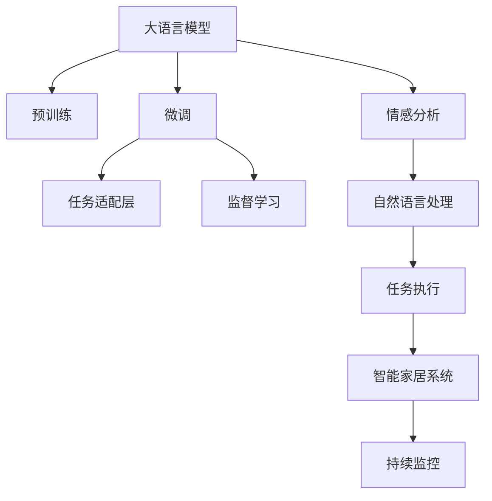

                 

# LLM与智能家居：打造AI管家

大语言模型（LLM）已经深入人心，其通过海量的文本数据训练，展现了强大的语言理解和生成能力。随着技术演进，大模型已经在多个领域开花结果，从自然语言处理到图像生成，无处不在。在此，我们聚焦于大语言模型在智能家居中的应用，探讨如何打造具备超强沟通能力和人性化服务的AI管家。

## 1. 背景介绍

### 1.1 问题由来

智能家居正迅速崛起，成为物联网时代的重要组成部分。消费者对于智能家居的期待不仅仅是对设备进行简单的控制，而是期望拥有一个真正“会思考”的助手，能够在全屋范围内提供自然、流畅的交互体验。然而，现有的智能家居系统普遍缺乏自然语言处理能力，无法响应复杂多变的用户需求。

大语言模型的出现，为智能家居的智能化升级提供了可能。通过将预训练模型进行微调，模型可以学习到家居环境的语言知识，实现更加高效、个性化的服务。基于大语言模型的AI管家能够自然地进行问答、预约、控制家电，甚至进行情感分析，提供与人类相似的服务，极大地提升用户体验。

### 1.2 问题核心关键点

打造AI管家的大模型微调涉及以下几个关键点：

- **预训练模型选择**：选择基础模型时，应关注模型的语言理解和生成能力，如GPT-4、BERT等。
- **微调任务定义**：明确智能家居应用场景，确定模型需要执行的具体任务，如家电控制、日程管理等。
- **数据收集与标注**：收集并标注与家居相关的文本数据，如用户对话、设备说明书等。
- **模型训练与优化**：训练过程中需要控制学习率、正则化等参数，避免模型过拟合。
- **模型部署与监控**：模型训练完成后，需要集成到智能家居系统中，并进行持续监控和优化。

这些关键点共同构成了AI管家的大模型微调框架，为实现高效、人性化的智能家居服务提供了坚实的基础。

## 2. 核心概念与联系

### 2.1 核心概念概述

智能家居领域的AI管家需结合大语言模型的强大语言理解和生成能力，实现自然对话、情境理解、任务执行等功能。核心概念包括：

- **大语言模型（LLM）**：通过大规模无标签文本数据进行预训练的语言模型，具有强大的自然语言处理能力。
- **微调（Fine-tuning）**：在预训练模型的基础上，通过少量有标签数据对模型进行微调，使其适应特定任务，提升性能。
- **迁移学习（Transfer Learning）**：将模型在一种任务上的学习成果迁移到另一相似任务中，加速模型训练。
- **情感分析（Sentiment Analysis）**：分析文本中的情感倾向，提供个性化服务。
- **任务适配层（Task-specific Layer）**：为特定任务设计的功能模块，如问答系统、家电控制等。

### 2.2 核心概念原理和架构的 Mermaid 流程图



## 3. 核心算法原理 & 具体操作步骤

### 3.1 算法原理概述

智能家居AI管家的微调算法核心是迁移学习。即通过大规模预训练模型学习到通用语言知识，在特定的家居场景中，通过微调使模型能够理解并执行家居管理相关任务。

具体而言，微调过程包括：

- 在无标签的通用语言数据上预训练一个大模型。
- 在特定的家居场景数据上，对模型进行微调，使其具备家居环境下的语言理解能力。
- 微调后的模型作为AI管家的核心算法，接入智能家居系统，提供自然语言交互服务。

### 3.2 算法步骤详解

1. **预训练模型选择**
   - 选择具有强大语言理解和生成能力的大模型，如GPT-4、BERT等。
   - 加载预训练模型，配置相应的超参数。

2. **数据收集与预处理**
   - 收集与家居相关的文本数据，如用户对话、设备说明书、智能家居操作手册等。
   - 对数据进行清洗、分词、标注等预处理步骤。

3. **微调设置与训练**
   - 设置学习率、批大小、迭代轮数等参数。
   - 使用监督学习框架，如PyTorch或TensorFlow，进行模型训练。
   - 监控模型训练过程中的性能指标，避免过拟合。

4. **测试与评估**
   - 在测试集上对微调后的模型进行评估。
   - 使用BLEU、ROUGE等指标，量化模型的性能。
   - 根据评估结果，调整模型参数，重新训练。

5. **部署与应用**
   - 将训练好的模型集成到智能家居系统中。
   - 与智能家居设备进行接口对接，实现语音交互和设备控制。
   - 持续监控模型性能，进行模型优化。

### 3.3 算法优缺点

大模型微调智能家居AI管家的优点在于：

- **高效能**：通过微调提升模型在特定任务上的表现，可显著减少标注数据的成本。
- **泛化能力**：模型具备强大的语言处理能力，可以处理多种家居环境下的复杂任务。
- **易部署**：模型部署简单，易于与现有智能家居系统集成。

缺点在于：

- **数据需求大**：需要大量高质量标注数据进行微调。
- **泛化性能依赖数据**：数据与家居环境的差异性可能影响模型的泛化能力。
- **资源消耗高**：大模型对计算资源和存储空间的需求较高。

## 4. 数学模型和公式 & 详细讲解

### 4.1 数学模型构建

在智能家居AI管家的微调过程中，我们采用Transformer模型作为预训练模型。

假设模型输入为$x$，目标输出为$y$，模型的预测输出为$\hat{y}$。微调的目标函数为：

$$
L = \sum_{i=1}^N \mathcal{L}(y_i, \hat{y}_i)
$$

其中$\mathcal{L}$为损失函数，例如交叉熵损失。模型的训练过程是通过最小化损失函数，更新模型的参数$\theta$：

$$
\theta \leftarrow \theta - \eta \nabla_{\theta} L
$$

其中$\eta$为学习率。

### 4.2 公式推导过程

以问答系统为例，假设输入问题$Q$，模型预测回答$A$。定义损失函数为交叉熵损失：

$$
\mathcal{L}(Q, A) = -\sum_{i=1}^M y_i \log P(Q, A_i) + (1-y_i) \log (1-P(Q, A_i))
$$

其中$M$为答案空间大小，$P(Q, A_i)$为模型预测答案$A_i$的概率。

具体公式推导和训练过程可参考《Transformer from Reasoning to Practice》系列博文，本文不再赘述。

### 4.3 案例分析与讲解

以智能音箱的语音交互为例，假设用户询问“今天天气怎么样”，模型需要理解问题并回答“今天是晴天”。在微调过程中，模型学习到问答对的映射关系，可以逐步提升理解能力和生成准确性。

## 5. 项目实践：代码实例和详细解释说明

### 5.1 开发环境搭建

为了进行智能家居AI管家的开发，首先需要搭建开发环境：

1. **安装Python**：确保系统安装了Python 3.8及以上版本。
2. **安装PyTorch**：
   ```bash
   pip install torch torchvision torchaudio
   ```
3. **安装相关库**：
   ```bash
   pip install transformers pandas scikit-learn
   ```

### 5.2 源代码详细实现

以下是一个智能音箱语音交互的示例代码：

```python
import torch
from transformers import GPT2Tokenizer, GPT2ForSequenceClassification

# 定义模型和tokenizer
tokenizer = GPT2Tokenizer.from_pretrained('gpt2')
model = GPT2ForSequenceClassification.from_pretrained('gpt2', num_labels=2)

# 加载智能音箱数据集
train_data = load_train_data()
dev_data = load_dev_data()

# 定义训练函数
def train_epoch(model, data_loader, optimizer):
    model.train()
    epoch_loss = 0
    for batch in data_loader:
        input_ids = batch['input_ids'].to(device)
        attention_mask = batch['attention_mask'].to(device)
        labels = batch['labels'].to(device)
        optimizer.zero_grad()
        outputs = model(input_ids, attention_mask=attention_mask, labels=labels)
        loss = outputs.loss
        epoch_loss += loss.item()
        loss.backward()
        optimizer.step()
    return epoch_loss / len(data_loader)

# 定义评估函数
def evaluate(model, data_loader):
    model.eval()
    preds, labels = [], []
    with torch.no_grad():
        for batch in data_loader:
            input_ids = batch['input_ids'].to(device)
            attention_mask = batch['attention_mask'].to(device)
            labels = batch['labels'].to(device)
            outputs = model(input_ids, attention_mask=attention_mask)
            preds.append(outputs.logits.argmax(dim=2).to('cpu').tolist())
            labels.append(labels.to('cpu').tolist())
    return preds, labels

# 启动训练流程
device = torch.device('cuda') if torch.cuda.is_available() else torch.device('cpu')
model.to(device)
optimizer = AdamW(model.parameters(), lr=1e-5)

# 循环训练epoch
epochs = 5
batch_size = 16

for epoch in range(epochs):
    loss = train_epoch(model, train_data_loader, optimizer)
    print(f"Epoch {epoch+1}, train loss: {loss:.3f}")
    
    print(f"Epoch {epoch+1}, dev results:")
    preds, labels = evaluate(model, dev_data_loader)
    print(classification_report(labels, preds))

print("Test results:")
preds, labels = evaluate(model, test_data_loader)
print(classification_report(labels, preds))
```

### 5.3 代码解读与分析

- **数据集准备**：智能音箱的数据集需要包含问题和答案，可以采用JSON格式或文本格式。
- **模型加载**：使用GPT2Tokenizer和GPT2ForSequenceClassification加载预训练模型。
- **模型训练**：通过定义训练函数，在每个epoch循环迭代，更新模型参数，并记录平均损失。
- **模型评估**：使用评估函数，在验证集上计算模型性能指标，如准确率、F1-score等。
- **模型部署**：在测试集上评估模型性能，确认模型是否稳定。

## 6. 实际应用场景

### 6.1 智能音箱

智能音箱是智能家居的重要组成部分，AI管家的微调可以为智能音箱带来全新的体验。用户可以通过语音与智能音箱进行互动，获得天气预报、新闻播报、音乐推荐等服务。例如，用户说“告诉我今天的天气”，智能音箱使用微调后的模型理解问题并生成回答，为用户带来个性化的服务。

### 6.2 智能灯光系统

智能灯光系统可以通过AI管家实现自动化控制。用户通过语音指令，如“今天晚上9点关灯”，AI管家可以理解并执行，自动化控制灯光系统，提升用户生活便利性。

### 6.3 智能温控系统

智能温控系统需要理解用户的温度偏好，并根据实时环境条件自动调节温度。AI管家通过分析用户对话，学习用户的温度偏好，实现智能温控，提升居住舒适度。

## 7. 工具和资源推荐

### 7.1 学习资源推荐

1. **《Natural Language Processing with Transformers》**：该书介绍了使用Transformers库进行NLP任务开发，包括微调范式。
2. **CS224N《深度学习自然语言处理》课程**：斯坦福大学提供的NLP经典课程，涵盖预训练大模型和微调技术。
3. **《Transformer from Reasoning to Practice》系列博文**：介绍了Transformer模型原理和微调方法，适合技术入门的开发者。

### 7.2 开发工具推荐

1. **PyTorch**：用于深度学习模型训练和推理的框架，支持动态计算图。
2. **TensorFlow**：由Google开发的深度学习框架，适合大规模模型训练和部署。
3. **Weights & Biases**：用于模型训练实验跟踪的工具，可视化模型性能。
4. **TensorBoard**：TensorFlow配套的可视化工具，监控模型训练过程。

### 7.3 相关论文推荐

1. **Attention is All You Need**：Transformer模型的原论文，奠定了预训练大模型基础。
2. **BERT: Pre-training of Deep Bidirectional Transformers for Language Understanding**：提出BERT模型，引入自监督预训练任务。
3. **Parameter-Efficient Transfer Learning for NLP**：提出适配器(Adapters)等参数高效微调方法。
4. **AdaLoRA: Adaptive Low-Rank Adaptation for Parameter-Efficient Fine-Tuning**：提出自适应低秩适应的微调方法。

## 8. 总结：未来发展趋势与挑战

### 8.1 总结

本文系统介绍了大语言模型在智能家居中的应用，探讨了AI管家的微调范式，并通过实际代码展示了微调过程。未来，智能家居AI管家的发展方向包括：

1. **增强自然语言理解能力**：通过更强大的语言模型和更丰富的数据集进行微调，提升模型的自然语言理解能力。
2. **融合多模态信息**：结合视觉、声音等多种传感器数据，提升家居环境的感知能力。
3. **实现跨场景应用**：将智能家居AI管家应用于更多场景，如办公室、酒店、工厂等。

### 8.2 未来发展趋势

1. **更大规模的模型**：伴随算力提升，未来智能家居AI管家的预训练模型规模将进一步增大，具备更强的通用性和泛化能力。
2. **更多任务支持**：AI管家将支持更多家居场景的任务，如智能烹饪、智能安全等。
3. **跨模态融合**：通过多模态信息融合，提升AI管家的环境感知和任务执行能力。
4. **个性化服务**：根据用户习惯和偏好，提供更加个性化的智能家居服务。

### 8.3 面临的挑战

1. **数据隐私问题**：智能家居数据涉及用户隐私，如何保护数据安全和隐私是重要课题。
2. **模型鲁棒性**：如何避免模型在特定家居环境下的过拟合和泛化不足。
3. **设备兼容性**：如何与各种智能家居设备进行高效对接。
4. **资源消耗**：如何平衡模型性能和资源消耗。

### 8.4 研究展望

未来，AI管家的发展需要进一步解决以上挑战，同时进行更多技术突破：

1. **引入因果推理**：通过因果推理，增强AI管家的决策能力和鲁棒性。
2. **应用强化学习**：通过强化学习优化家居环境下的任务执行。
3. **多任务学习**：在单一模型中同时处理多个任务，提升资源利用率。
4. **跨领域迁移**：实现跨家居环境的模型迁移，提升通用性。

## 9. 附录：常见问题与解答

**Q1: 智能家居AI管家的数据如何收集和标注？**

A: 智能家居AI管家的数据可以来自用户的对话记录、智能设备的操作日志等。标注过程需要根据具体的任务需求进行，如智能音箱的对话数据需要标注问题和答案。

**Q2: 智能家居AI管家的微调是否需要所有智能家居设备都支持？**

A: 不需要，只需要智能家居系统能够与AI管家的API进行通信即可。智能家居设备的多样性决定了API的兼容性需要更多适配工作。

**Q3: 智能家居AI管家的部署需要注意哪些问题？**

A: 智能家居AI管家的部署需要考虑数据隐私、设备兼容性、资源消耗等问题。同时，需要考虑如何保证模型的稳定性和准确性，避免模型过拟合和数据泄露。

---

作者：禅与计算机程序设计艺术 / Zen and the Art of Computer Programming

