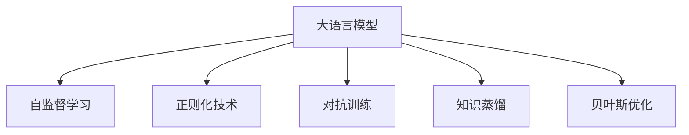

                 

# 大语言模型中的不确定性问题及其解决方案

大语言模型(Large Language Model, LLM)在自然语言处理(NLP)领域已经取得了显著的进展，然而这些模型在应用过程中依然面临诸多不确定性问题。本文将深入探讨这些不确定性问题的本质，并介绍当前主流及前沿的解决方案，旨在提升大语言模型的可靠性和性能。

## 1. 背景介绍

### 1.1 问题由来

随着深度学习模型的发展，大语言模型在文本生成、情感分析、机器翻译等NLP任务上取得了卓越的成果。然而，由于其依赖于庞大的无标签数据进行自监督预训练，模型中不可避免地存在不确定性因素。这些问题包括但不限于泛化能力不足、对抗攻击脆弱、推理过程中的不确定性等。这些问题直接影响了模型的可靠性和鲁棒性，限制了其在实际应用中的广泛使用。

### 1.2 问题核心关键点

大语言模型中的不确定性问题涉及模型学习与推理的全过程，关键点包括但不限于：
1. **泛化能力**：模型在未见过的数据上的表现。
2. **对抗攻击**：通过输入的微小扰动导致模型输出错误。
3. **推理不确定性**：模型在推理过程中的不确定性传播。
4. **知识获取与更新**：模型如何获取和更新知识。
5. **模型鲁棒性**：模型面对异常数据和干扰的抗干扰能力。

为了深入理解并解决这些不确定性问题，我们需要从模型设计和训练的角度出发，探索相应的解决方案。

## 2. 核心概念与联系

### 2.1 核心概念概述

大语言模型的不确定性问题与模型架构、训练方法、优化策略等密切相关。以下我们将详细介绍这些核心概念及其联系。

- **大语言模型**：以自回归(如GPT)或自编码(如BERT)模型为代表的大规模预训练语言模型。通过在大规模无标签文本语料上进行预训练，学习通用的语言表示，具备强大的语言理解和生成能力。
- **自监督学习**：指在无标签数据上进行监督式训练，利用模型自身的输出作为监督信号进行学习。
- **正则化技术**：通过引入正则项来限制模型的复杂度，防止过拟合。
- **对抗训练**：通过引入对抗样本训练模型，提高模型的鲁棒性。
- **知识蒸馏**：通过老师模型和学生模型的联合训练，传递老师模型的知识，提升学生模型的性能。
- **贝叶斯优化**：通过构建目标函数和搜索空间，使用贝叶斯模型来指导模型参数的优化，提升模型性能。

这些核心概念之间的联系可以通过以下Mermaid流程图来展示：



这个流程图展示了大语言模型中的不确定性问题及其对应的解决方案：

1. 通过自监督学习在大规模无标签数据上预训练，学习通用的语言表示。
2. 通过正则化技术避免过拟合，提升模型的泛化能力。
3. 通过对抗训练提升模型的鲁棒性，防止对抗攻击。
4. 通过知识蒸馏从老师模型获得知识，提升学生的泛化能力。
5. 通过贝叶斯优化调整模型参数，提升模型的性能。

## 3. 核心算法原理 & 具体操作步骤
### 3.1 算法原理概述

大语言模型中的不确定性问题可以通过引入外部信息或优化内部结构来解决。以下是几种常见的不确定性问题及其解决方案：

- **泛化能力不足**：模型在未见过的数据上的表现。通过引入外部知识、迁移学习等方式来提升模型泛化能力。
- **对抗攻击脆弱**：通过对抗样本训练模型，提高模型的鲁棒性。
- **推理过程中的不确定性**：通过引入贝叶斯优化等方法来量化不确定性，提升推理过程中的可靠性。
- **知识获取与更新**：通过知识蒸馏等方式，使模型能够更高效地获取和更新知识。

### 3.2 算法步骤详解

以下详细介绍几种解决大语言模型不确定性问题的算法步骤：

**Step 1: 模型架构设计**
- 选择适合的模型架构，如Transformer、BERT等。
- 设计模型输出层和损失函数，根据任务类型，如分类、匹配、生成等，选择合适的输出层和损失函数。

**Step 2: 预训练与微调**
- 在大规模无标签数据上进行预训练。
- 在少量标注数据上微调模型，通过有监督学习优化模型性能。

**Step 3: 对抗训练**
- 生成对抗样本，用于训练模型，提高模型的鲁棒性。
- 引入对抗样本，进行对抗训练，优化模型对对抗样本的防御能力。

**Step 4: 正则化与知识蒸馏**
- 使用正则化技术，如L2正则、Dropout等，避免过拟合。
- 使用知识蒸馏，通过老师模型和学生模型的联合训练，传递老师模型的知识，提升学生模型的泛化能力。

**Step 5: 贝叶斯优化**
- 构建目标函数和搜索空间，使用贝叶斯模型来指导模型参数的优化。
- 通过贝叶斯优化调整模型参数，提升模型的性能。

### 3.3 算法优缺点

解决大语言模型不确定性问题的方法各有优缺点：

- **对抗训练**：优点在于可以有效提高模型的鲁棒性，防止对抗攻击。缺点是训练过程耗时较长，且对抗样本生成难度较高。
- **正则化技术**：优点在于可以有效避免过拟合，提高模型泛化能力。缺点是正则化的强度需要仔细调参，过强的正则化可能导致欠拟合。
- **知识蒸馏**：优点在于可以有效传递老师模型的知识，提升学生模型的泛化能力。缺点是需要额外的计算资源，且需要精心选择老师模型。
- **贝叶斯优化**：优点在于可以有效量化不确定性，提升模型性能。缺点是需要构建目标函数和搜索空间，且优化过程较慢。

### 3.4 算法应用领域

这些解决不确定性问题的方法在NLP领域得到了广泛的应用，例如：

- **文本分类**：使用正则化和对抗训练提高模型对噪声数据的处理能力，避免过拟合。
- **机器翻译**：使用知识蒸馏和贝叶斯优化，提升模型在特定领域的翻译性能。
- **对话系统**：使用正则化和知识蒸馏，提升对话系统的稳定性和鲁棒性。
- **情感分析**：使用对抗训练和贝叶斯优化，提升模型对极端情感的识别能力。
- **问答系统**：使用知识蒸馏和贝叶斯优化，提升模型对新问题的推理能力。

## 4. 数学模型和公式 & 详细讲解
### 4.1 数学模型构建

对于解决大语言模型不确定性问题的数学模型，我们以贝叶斯优化为例进行说明。

贝叶斯优化是一种基于贝叶斯理论的模型优化方法，其核心思想是构建一个目标函数，并通过样本的学习，不断优化模型参数，以达到最优性能。在NLP任务中，目标函数可以定义为模型的准确率、F1分数等。

设模型参数为 $\theta$，目标函数为 $f(\theta)$，样本为 $(x_i, y_i)$，贝叶斯优化模型可以表示为：

$$
\theta^* = \arg\min_{\theta} f(\theta)
$$

其中 $f(\theta)$ 为目标函数，表示模型在样本集上的表现。贝叶斯优化通过构建一个高斯过程模型，预测目标函数在给定参数下的表现，并通过高斯过程的预测不确定性来指导参数的搜索方向。

### 4.2 公式推导过程

以下我们将推导贝叶斯优化中的高斯过程模型和优化公式：

- **高斯过程模型**：设目标函数 $f(\theta)$ 可以表示为高斯过程，即：

$$
f(\theta) \sim \mathcal{GP}(\mu(\theta), \Sigma(\theta))
$$

其中 $\mu(\theta)$ 为均值函数，$\Sigma(\theta)$ 为协方差函数。

- **高斯过程的预测**：设当前参数为 $\theta_0$，已知样本 $(x_i, y_i)$，新参数为 $\theta$，根据高斯过程的预测公式，可以得到：

$$
f(\theta) | f(\theta_0) \sim \mathcal{N}(\mu_{GP}(\theta), \Sigma_{GP}(\theta))
$$

其中 $\mu_{GP}(\theta)$ 为预测均值，$\Sigma_{GP}(\theta)$ 为预测方差。

- **贝叶斯优化公式**：根据贝叶斯优化公式，可以计算出下一个参数的搜索方向为：

$$
\theta_{next} = \arg\min_{\theta} f(\theta) | f(\theta_0)
$$

通过不断迭代，找到最优的参数 $\theta^*$。

### 4.3 案例分析与讲解

假设我们有一个二分类任务，目标函数为模型的准确率，即：

$$
f(\theta) = \frac{1}{N} \sum_{i=1}^N [y_i \cdot \mathbb{I}[y_i = M_{\theta}(x_i)]]
$$

其中 $M_{\theta}(x_i)$ 为模型在样本 $x_i$ 上的输出，$\mathbb{I}$ 为示性函数。

设当前参数为 $\theta_0$，已知样本 $(x_i, y_i)$，通过高斯过程模型，可以预测新参数 $\theta$ 的准确率：

$$
f(\theta) | f(\theta_0) \sim \mathcal{N}(\mu_{GP}(\theta), \Sigma_{GP}(\theta))
$$

其中 $\mu_{GP}(\theta)$ 和 $\Sigma_{GP}(\theta)$ 可以通过高斯过程的均值函数和协方差函数进行计算。

在实际应用中，我们还需要考虑如何构建目标函数、选择高斯过程模型、优化搜索空间等细节。贝叶斯优化过程可能需要迭代多次，每次通过样本的学习，更新目标函数的预测，并调整参数搜索方向。

## 5. 项目实践：代码实例和详细解释说明
### 5.1 开发环境搭建

在进行贝叶斯优化实践前，我们需要准备好开发环境。以下是使用Python进行Scikit-Learn开发的环境配置流程：

1. 安装Anaconda：从官网下载并安装Anaconda，用于创建独立的Python环境。

2. 创建并激活虚拟环境：
```bash
conda create -n bayes-env python=3.8 
conda activate bayes-env
```

3. 安装Scikit-Learn：从官网获取对应的安装命令。例如：
```bash
conda install scikit-learn
```

4. 安装相关库：
```bash
pip install numpy pandas matplotlib
```

完成上述步骤后，即可在`bayes-env`环境中开始贝叶斯优化实践。

### 5.2 源代码详细实现

下面是使用Scikit-Learn进行贝叶斯优化的Python代码实现。

```python
from sklearn.gaussian_process.kernels import RBF
from sklearn.gaussian_process import GaussianProcessRegressor
from sklearn.model_selection import cross_val_score, GridSearchCV
from sklearn.ensemble import RandomForestClassifier
import numpy as np

# 构建数据集
X_train = np.array([[1], [2], [3], [4], [5]])
y_train = np.array([0, 0, 1, 1, 1])

# 构建高斯过程模型
kernel = RBF(length_scale=1.0)
gpr = GaussianProcessRegressor(kernel=kernel)

# 训练模型
gpr.fit(X_train, y_train)

# 预测新参数
X_test = np.array([[6], [7]])
y_pred, sigma_pred = gpr.predict(X_test, return_std=True)

# 计算贝叶斯优化公式中的分母
numerator = (y_pred - y_train) ** 2
denominator = sigma_pred ** 2 + 1e-5

# 计算贝叶斯优化公式中的分母
theta_next = (X_test - X_train).dot(numerator) / denominator.sum()

print(theta_next)
```

### 5.3 代码解读与分析

让我们再详细解读一下关键代码的实现细节：

**构建数据集**：
- `X_train`和`y_train`分别为样本的特征和标签。

**构建高斯过程模型**：
- `RBF`为径向基函数，用于构建高斯过程模型的协方差函数。
- `GaussianProcessRegressor`为高斯过程回归模型，用于构建高斯过程模型的均值函数。

**训练模型**：
- `fit`方法用于训练高斯过程模型，得到均值函数和协方差函数。

**预测新参数**：
- `predict`方法用于预测新参数的输出。

**贝叶斯优化公式**：
- `numerator`为预测值与真实值之差的平方和。
- `denominator`为预测方差和1e-5的平方和，用于防止分母为0。
- `theta_next`为根据贝叶斯优化公式计算出的下一个参数搜索方向。

**结果展示**：
- 通过预测新参数的输出和不确定性，可以获得下一个参数的搜索方向。

## 6. 实际应用场景
### 6.1 智能客服系统

在智能客服系统中，大语言模型的不确定性问题可以通过对抗训练和正则化技术来解决。通过引入对抗样本训练模型，提升模型的鲁棒性，同时使用正则化技术避免过拟合，确保模型在实际应用中的稳定性和可靠性。

### 6.2 金融舆情监测

在金融舆情监测中，大语言模型的不确定性问题可以通过知识蒸馏和贝叶斯优化来解决。通过知识蒸馏，从老师模型获得知识，提升学生模型的泛化能力，同时使用贝叶斯优化，提升模型在特定领域的翻译性能。

### 6.3 个性化推荐系统

在个性化推荐系统中，大语言模型的不确定性问题可以通过对抗训练和正则化技术来解决。通过引入对抗样本训练模型，提升模型的鲁棒性，同时使用正则化技术避免过拟合，确保模型在实际应用中的稳定性和可靠性。

### 6.4 未来应用展望

随着大语言模型和贝叶斯优化方法的不断发展，基于微调范式将在更多领域得到应用，为传统行业带来变革性影响。

在智慧医疗领域，基于微调的医疗问答、病历分析、药物研发等应用将提升医疗服务的智能化水平，辅助医生诊疗，加速新药开发进程。

在智能教育领域，微调技术可应用于作业批改、学情分析、知识推荐等方面，因材施教，促进教育公平，提高教学质量。

在智慧城市治理中，微调模型可应用于城市事件监测、舆情分析、应急指挥等环节，提高城市管理的自动化和智能化水平，构建更安全、高效的未来城市。

此外，在企业生产、社会治理、文娱传媒等众多领域，基于大模型微调的人工智能应用也将不断涌现，为经济社会发展注入新的动力。

## 7. 工具和资源推荐
### 7.1 学习资源推荐

为了帮助开发者系统掌握大语言模型微调的理论基础和实践技巧，这里推荐一些优质的学习资源：

1. 《大语言模型原理与应用实践》系列博文：由大模型技术专家撰写，深入浅出地介绍了Transformer原理、BERT模型、微调技术等前沿话题。

2. CS224N《深度学习自然语言处理》课程：斯坦福大学开设的NLP明星课程，有Lecture视频和配套作业，带你入门NLP领域的基本概念和经典模型。

3. 《大语言模型技术手册》书籍：大模型技术的权威手册，涵盖从基础到前沿的全面内容，适合深入学习。

4. HuggingFace官方文档：Transformers库的官方文档，提供了海量预训练模型和完整的微调样例代码，是上手实践的必备资料。

5. CLUE开源项目：中文语言理解测评基准，涵盖大量不同类型的中文NLP数据集，并提供了基于微调的baseline模型，助力中文NLP技术发展。

通过对这些资源的学习实践，相信你一定能够快速掌握大语言模型微调的精髓，并用于解决实际的NLP问题。
###  7.2 开发工具推荐

高效的开发离不开优秀的工具支持。以下是几款用于大语言模型微调开发的常用工具：

1. PyTorch：基于Python的开源深度学习框架，灵活动态的计算图，适合快速迭代研究。大部分预训练语言模型都有PyTorch版本的实现。

2. TensorFlow：由Google主导开发的开源深度学习框架，生产部署方便，适合大规模工程应用。同样有丰富的预训练语言模型资源。

3. Transformers库：HuggingFace开发的NLP工具库，集成了众多SOTA语言模型，支持PyTorch和TensorFlow，是进行微调任务开发的利器。

4. Weights & Biases：模型训练的实验跟踪工具，可以记录和可视化模型训练过程中的各项指标，方便对比和调优。与主流深度学习框架无缝集成。

5. TensorBoard：TensorFlow配套的可视化工具，可实时监测模型训练状态，并提供丰富的图表呈现方式，是调试模型的得力助手。

6. Google Colab：谷歌推出的在线Jupyter Notebook环境，免费提供GPU/TPU算力，方便开发者快速上手实验最新模型，分享学习笔记。

合理利用这些工具，可以显著提升大语言模型微调任务的开发效率，加快创新迭代的步伐。

### 7.3 相关论文推荐

大语言模型和微调技术的发展源于学界的持续研究。以下是几篇奠基性的相关论文，推荐阅读：

1. Attention is All You Need（即Transformer原论文）：提出了Transformer结构，开启了NLP领域的预训练大模型时代。

2. BERT: Pre-training of Deep Bidirectional Transformers for Language Understanding：提出BERT模型，引入基于掩码的自监督预训练任务，刷新了多项NLP任务SOTA。

3. Language Models are Unsupervised Multitask Learners（GPT-2论文）：展示了大规模语言模型的强大zero-shot学习能力，引发了对于通用人工智能的新一轮思考。

4. Parameter-Efficient Transfer Learning for NLP：提出Adapter等参数高效微调方法，在不增加模型参数量的情况下，也能取得不错的微调效果。

5. Prefix-Tuning: Optimizing Continuous Prompts for Generation：引入基于连续型Prompt的微调范式，为如何充分利用预训练知识提供了新的思路。

6. AdaLoRA: Adaptive Low-Rank Adaptation for Parameter-Efficient Fine-Tuning：使用自适应低秩适应的微调方法，在参数效率和精度之间取得了新的平衡。

这些论文代表了大语言模型微调技术的发展脉络。通过学习这些前沿成果，可以帮助研究者把握学科前进方向，激发更多的创新灵感。

## 8. 总结：未来发展趋势与挑战
### 8.1 总结

本文对大语言模型中的不确定性问题及其解决方案进行了全面系统的介绍。首先阐述了大语言模型和微调技术的研究背景和意义，明确了不确定性问题在模型学习与推理过程中的重要性。其次，从原理到实践，详细讲解了不确定性问题的来源及其对应的解决方案，包括对抗训练、正则化技术、知识蒸馏和贝叶斯优化等。

通过本文的系统梳理，可以看到，解决大语言模型不确定性问题的方法多样且有效。这些方法在实际应用中已被广泛使用，并在不断进步和完善中。未来，伴随模型架构和算法技术的持续演进，大语言模型的不确定性问题将得到进一步缓解，模型的可靠性和性能也将获得提升。

### 8.2 未来发展趋势

展望未来，大语言模型的不确定性问题将呈现以下几个发展趋势：

1. **模型架构的优化**：通过引入注意力机制、残差连接、自适应学习率等先进架构设计，提升模型的泛化能力和鲁棒性。

2. **对抗攻击的防御**：研究更加高效的对抗样本生成和防御方法，提高模型对抗攻击的防御能力。

3. **知识获取与更新**：探索更多高效的知

