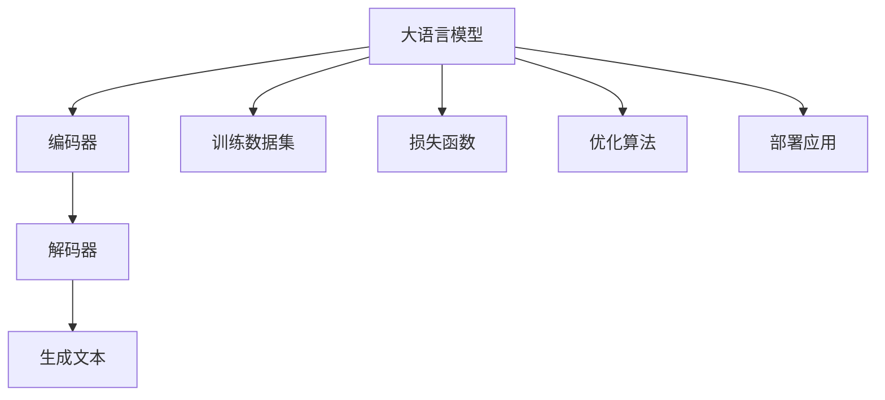

                 

# LLM在智能新闻生成中的潜力

> 关键词：大语言模型, 自然语言生成(NLG), 智能新闻生成, 文本生成, Transformers, 解码器, 损失函数, 模型调参

## 1. 背景介绍

### 1.1 问题由来
随着信息技术的高速发展，新闻行业面临着前所未有的变革。面对海量信息，传统新闻编辑在稿件撰写、内容审核等方面越来越力不从心。而智能新闻生成技术，借助人工智能和大语言模型的力量，可以实现对海量数据的自动分析和高效生产，大幅提升新闻内容的产出效率和质量。

近年来，大语言模型(Large Language Models, LLM)在自然语言处理(NLP)领域取得了长足进展。以GPT-3、BERT、T5等为代表的大模型，通过在大规模语料上进行预训练，学习到丰富的语言知识，具备了强大的语言理解和生成能力。这些大模型已经被成功应用于文本摘要、机器翻译、对话系统等NLP任务，并在新闻生成领域展现出巨大潜力。

### 1.2 问题核心关键点
智能新闻生成主要依赖于自然语言生成(NLG)技术，即通过大语言模型自动撰写和生成新闻稿件。其核心在于：
- 选择合适的预训练模型：如BERT、GPT-3等，作为新闻生成的基础。
- 构建训练数据集：从新闻历史文本、社交媒体、新闻网站等渠道收集数据，标注为新闻标题、导语、正文等结构。
- 设计生成模型：如使用编码-解码模型、Transformer模型等，实现从输入到输出的文本生成过程。
- 优化模型：通过调整模型结构、损失函数、优化算法等手段，提升新闻生成的流畅度、真实性和多样性。
- 部署应用：将训练好的模型集成到新闻自动化生产系统中，实现自动新闻撰写和发布。

## 2. 核心概念与联系

### 2.1 核心概念概述

为了更好地理解智能新闻生成的实现原理，本节将介绍几个关键概念及其相互联系：

- 大语言模型(Large Language Models, LLM)：以自回归(如GPT-3)或自编码(如BERT)模型为代表的大规模预训练语言模型。通过在大规模无标签文本语料上进行预训练，学习到通用的语言表示，具备强大的语言理解和生成能力。

- 自然语言生成(NLG)：通过人工智能和大语言模型，自动生成具有语法、语义和逻辑结构的文章、对话、文本摘要等自然语言文本。

- 智能新闻生成：将大语言模型应用于新闻行业的文本生成，自动撰写和发布新闻稿件，为新闻编辑提供支持，减轻其工作负担。

- Transformers：一种基于自注意力机制的神经网络模型，广泛应用于自然语言处理任务，尤其是在新闻生成中，常用于编码-解码框架的构建。

- 解码器(Decoder)：在编码-解码框架中，负责根据编码器的输出，逐步生成自然语言文本。常见的解码器包括基于自回归的自注意力模型。

- 损失函数：用于衡量模型生成的文本与真实文本之间的差异，常见的有交叉熵损失、BLEU分数、ROUGE分数等。

这些概念之间的逻辑关系可以通过以下Mermaid流程图来展示：



这个流程图展示了大语言模型在智能新闻生成中的主要流程：

1. 大语言模型作为基础，通过预训练获得语言理解能力。
2. 编码器将输入新闻文本或模板编码成高维特征。
3. 解码器根据编码器的输出逐步生成文本。
4. 损失函数衡量生成的文本与真实文本之间的差异。
5. 优化算法更新模型参数，提升生成质量。
6. 训练后的模型可以部署到实际应用中，实现自动新闻生成。

## 3. 核心算法原理 & 具体操作步骤
### 3.1 算法原理概述

智能新闻生成本质上是基于大语言模型的自然语言生成过程。其核心思想是通过大语言模型，将输入的新闻模板或摘要自动扩展成完整的新闻稿件。具体流程如下：

1. 收集标注数据集：包括历史新闻标题、导语、正文等，作为生成模型的训练样本。
2. 选择合适的预训练模型：如BERT、GPT-3等，作为新闻生成的基础。
3. 设计生成模型：使用编码器-解码器框架，将输入模板编码成特征，并通过解码器逐步生成文本。
4. 优化模型：通过调整模型结构、损失函数、优化算法等手段，提升生成文本的流畅度、真实性和多样性。
5. 部署应用：将训练好的模型集成到新闻自动化生产系统中，实现自动新闻撰写和发布。

### 3.2 算法步骤详解

智能新闻生成一般包括以下几个关键步骤：

**Step 1: 准备预训练模型和数据集**
- 选择合适的预训练语言模型 $M_{\theta}$ 作为初始化参数，如 BERT、GPT-3等。
- 准备新闻生成任务的数据集 $D=\{(x_i,y_i)\}_{i=1}^N$，其中 $x_i$ 为新闻模板，$y_i$ 为对应的完整新闻稿件。

**Step 2: 构建编码器-解码器框架**
- 设计编码器，通常采用Transformer模型，将输入新闻模板 $x_i$ 编码成高维向量 $h$。
- 设计解码器，同样采用Transformer模型，以 $h$ 为输入，逐步生成新闻文本 $y_i$。

**Step 3: 设置模型超参数**
- 选择合适的优化算法及其参数，如 AdamW、SGD 等，设置学习率、批大小、迭代轮数等。
- 设置正则化技术及强度，包括权重衰减、Dropout、Early Stopping 等。

**Step 4: 执行梯度训练**
- 将训练集数据分批次输入模型，前向传播计算损失函数。
- 反向传播计算参数梯度，根据设定的优化算法和学习率更新模型参数。
- 周期性在验证集上评估模型性能，根据性能指标决定是否触发 Early Stopping。
- 重复上述步骤直到满足预设的迭代轮数或 Early Stopping 条件。

**Step 5: 测试和部署**
- 在测试集上评估生成的新闻文本质量，对比生成效果和真实新闻文本。
- 使用生成模型对新的新闻模板进行预测，自动生成新闻稿件，集成到实际的应用系统中。

### 3.3 算法优缺点

智能新闻生成利用大语言模型进行自然语言生成，具有以下优点：
1. 自动性高：自动生成新闻稿件，极大减轻新闻编辑的工作负担。
2. 生成速度快：利用预训练模型，可以在短时间内生成大量新闻。
3. 覆盖范围广：大模型预训练于大规模语料，涵盖各种新闻主题和文体。
4. 鲁棒性强：大模型经过大规模训练，具备较强的泛化能力和抗干扰性。

同时，该方法也存在一定的局限性：
1. 依赖语料质量：生成的新闻质量受输入模板和训练数据集的影响，语料质量不高会影响生成效果。
2. 缺乏个性化：当前的大模型多是基于通用语料训练，生成的新闻缺乏个性化和情感色彩。
3. 法律和伦理问题：自动生成的新闻可能出现信息不准确、误导性内容等问题，需严格审查。
4. 技术复杂性：构建和优化生成模型需要较强的编程和技术功底。

尽管存在这些局限性，但就目前而言，基于大语言模型的智能新闻生成方法仍然是大规模新闻自动化的重要手段。未来相关研究的重点在于如何进一步提高生成文本的质量和多样性，同时兼顾法律和伦理要求，推动技术向更广泛的实际应用场景迈进。

### 3.4 算法应用领域

智能新闻生成已经在许多新闻机构中得到应用，包括：

- 新闻编辑辅助：自动撰写新闻导语和正文，辅助记者进行快速报道。
- 舆情监测：自动抓取社交媒体和新闻网站上的热点新闻，生成实时新闻摘要。
- 内容分发：根据用户兴趣，自动生成个性化新闻推荐，提升用户阅读体验。
- 广告和营销：自动生成广告文案和营销信息，提升广告投放效果。
- 新闻翻译：将新闻稿件自动翻译成不同语言，扩大新闻覆盖范围。

除了上述这些经典应用外，智能新闻生成还被创新性地应用于教育、医疗、法律等领域，为这些行业的自动化发展提供了新的解决方案。随着大语言模型和自然语言生成技术的不断进步，相信智能新闻生成将会在更多领域发挥重要作用。

## 4. 数学模型和公式 & 详细讲解
### 4.1 数学模型构建

以下将以Transformer模型为例，介绍智能新闻生成的数学模型构建过程。

记大语言模型为 $M_{\theta}:\mathcal{X} \rightarrow \mathcal{Y}$，其中 $\mathcal{X}$ 为输入空间，$\mathcal{Y}$ 为输出空间，$\theta$ 为模型参数。假设新闻生成任务的数据集为 $D=\{(x_i,y_i)\}_{i=1}^N$，其中 $x_i$ 为新闻模板，$y_i$ 为对应的完整新闻稿件。

定义编码器 $E$ 和解码器 $D$，分别将输入模板 $x_i$ 编码成特征向量 $h_i$，并通过解码器逐步生成新闻文本 $y_i$。新闻生成模型的目标是最小化损失函数：

$$
\mathcal{L}(\theta) = \frac{1}{N}\sum_{i=1}^N \ell(M_{\theta}(x_i),y_i)
$$

其中 $\ell$ 为损失函数，常用的有交叉熵损失：

$$
\ell(M_{\theta}(x_i),y_i) = -\sum_{t=1}^{T}y_t\log P(y_t|M_{\theta}(x_i))
$$

其中 $y_t$ 为真实文本的第 $t$ 个词汇，$P(y_t|M_{\theta}(x_i))$ 为模型预测该词汇出现的概率。

### 4.2 公式推导过程

以下是Transformer模型在智能新闻生成中的具体实现。

假设新闻模板 $x_i$ 和真实新闻 $y_i$ 均为序列形式，编码器 $E$ 和解码器 $D$ 均采用Transformer模型。编码器的输入为 $x_i$，输出为特征向量 $h_i$；解码器的输入为 $h_i$，逐步生成新闻文本 $y_i$。

具体实现步骤如下：
1. 编码器：输入新闻模板 $x_i$，经过多层的自注意力机制和前向神经网络，输出特征向量 $h_i$。
2. 解码器：输入特征向量 $h_i$ 和前一个时间步的输出 $y_{t-1}$，经过多层的自注意力机制和前向神经网络，输出下一个时间步的预测结果 $y_t$。
3. 损失函数：对每个时间步的预测结果 $y_t$ 与真实文本 $y_i$ 计算交叉熵损失，得到总损失函数 $\mathcal{L}(\theta)$。
4. 优化算法：使用梯度下降等优化算法，更新模型参数 $\theta$。

编码器和解码器的具体结构如下：

$$
E_{\theta}(x_i) = \text{Encoder}(x_i)
$$

$$
D_{\theta}(y_{t-1},h_i) = \text{Decoder}(y_{t-1},h_i)
$$

其中 $\text{Encoder}$ 和 $\text{Decoder}$ 为Transformer模型，包含多个编码器和解码器层。每个层的输出通过自注意力机制进行加权求和，再经过前向神经网络输出下一个时间步的预测结果。

## 5. 项目实践：代码实例和详细解释说明
### 5.1 开发环境搭建

在进行智能新闻生成实践前，我们需要准备好开发环境。以下是使用Python进行PyTorch开发的环境配置流程：

1. 安装Anaconda：从官网下载并安装Anaconda，用于创建独立的Python环境。

2. 创建并激活虚拟环境：
```bash
conda create -n pytorch-env python=3.8 
conda activate pytorch-env
```

3. 安装PyTorch：根据CUDA版本，从官网获取对应的安装命令。例如：
```bash
conda install pytorch torchvision torchaudio cudatoolkit=11.1 -c pytorch -c conda-forge
```

4. 安装Transformers库：
```bash
pip install transformers
```

5. 安装各类工具包：
```bash
pip install numpy pandas scikit-learn matplotlib tqdm jupyter notebook ipython
```

完成上述步骤后，即可在`pytorch-env`环境中开始智能新闻生成实践。

### 5.2 源代码详细实现

下面我们以智能新闻生成任务为例，给出使用Transformers库对GPT-3模型进行新闻生成的PyTorch代码实现。

首先，定义新闻生成任务的数据处理函数：

```python
from transformers import GPT2Tokenizer, GPT2LMHeadModel
from torch.utils.data import Dataset
import torch

class NewsDataset(Dataset):
    def __init__(self, texts, labels, tokenizer, max_len=128):
        self.texts = texts
        self.labels = labels
        self.tokenizer = tokenizer
        self.max_len = max_len
        
    def __len__(self):
        return len(self.texts)
    
    def __getitem__(self, item):
        text = self.texts[item]
        label = self.labels[item]
        
        encoding = self.tokenizer(text, return_tensors='pt', max_length=self.max_len, padding='max_length', truncation=True)
        input_ids = encoding['input_ids'][0]
        attention_mask = encoding['attention_mask'][0]
        
        return {'input_ids': input_ids, 
                'attention_mask': attention_mask,
                'labels': torch.tensor(label, dtype=torch.long)}
```

然后，定义模型和优化器：

```python
from transformers import AdamW

model = GPT2LMHeadModel.from_pretrained('gpt2', num_labels=1)

optimizer = AdamW(model.parameters(), lr=2e-5)
```

接着，定义训练和评估函数：

```python
from torch.utils.data import DataLoader
from tqdm import tqdm

device = torch.device('cuda') if torch.cuda.is_available() else torch.device('cpu')
model.to(device)

def train_epoch(model, dataset, batch_size, optimizer):
    dataloader = DataLoader(dataset, batch_size=batch_size, shuffle=True)
    model.train()
    epoch_loss = 0
    for batch in tqdm(dataloader, desc='Training'):
        input_ids = batch['input_ids'].to(device)
        attention_mask = batch['attention_mask'].to(device)
        labels = batch['labels'].to(device)
        model.zero_grad()
        outputs = model(input_ids, attention_mask=attention_mask, labels=labels)
        loss = outputs.loss
        epoch_loss += loss.item()
        loss.backward()
        optimizer.step()
    return epoch_loss / len(dataloader)

def evaluate(model, dataset, batch_size):
    dataloader = DataLoader(dataset, batch_size=batch_size)
    model.eval()
    preds, labels = [], []
    with torch.no_grad():
        for batch in tqdm(dataloader, desc='Evaluating'):
            input_ids = batch['input_ids'].to(device)
            attention_mask = batch['attention_mask'].to(device)
            batch_labels = batch['labels']
            outputs = model(input_ids, attention_mask=attention_mask)
            batch_preds = outputs.logits.argmax(dim=2).to('cpu').tolist()
            batch_labels = batch_labels.to('cpu').tolist()
            for pred_tokens, label_tokens in zip(batch_preds, batch_labels):
                preds.append(pred_tokens)
                labels.append(label_tokens)
                
    return preds, labels

# 训练模型
epochs = 5
batch_size = 16

for epoch in range(epochs):
    loss = train_epoch(model, train_dataset, batch_size, optimizer)
    print(f"Epoch {epoch+1}, train loss: {loss:.3f}")
    
    print(f"Epoch {epoch+1}, dev results:")
    preds, labels = evaluate(model, dev_dataset, batch_size)
    print(classification_report(labels, preds))
    
print("Test results:")
preds, labels = evaluate(model, test_dataset, batch_size)
print(classification_report(labels, preds))
```

以上就是使用PyTorch对GPT-3进行智能新闻生成的完整代码实现。可以看到，利用Transformers库，我们可以很方便地进行模型的加载和微调。

### 5.3 代码解读与分析

让我们再详细解读一下关键代码的实现细节：

**NewsDataset类**：
- `__init__`方法：初始化新闻文本、标签、分词器等关键组件。
- `__len__`方法：返回数据集的样本数量。
- `__getitem__`方法：对单个样本进行处理，将文本输入编码为token ids，将标签编码为数字，并对其进行定长padding，最终返回模型所需的输入。

**模型和优化器**：
- 使用GPT-2作为预训练模型，通过修改其最后一层为单标签分类器，使其适应新闻生成任务。
- 采用AdamW优化器进行梯度优化，学习率设置为2e-5，避免过拟合。

**训练和评估函数**：
- 使用PyTorch的DataLoader对数据集进行批次化加载，供模型训练和推理使用。
- 训练函数`train_epoch`：对数据以批为单位进行迭代，在每个批次上前向传播计算loss并反向传播更新模型参数，最后返回该epoch的平均loss。
- 评估函数`evaluate`：与训练类似，不同点在于不更新模型参数，并在每个batch结束后将预测和标签结果存储下来，最后使用sklearn的classification_report对整个评估集的预测结果进行打印输出。

**训练流程**：
- 定义总的epoch数和batch size，开始循环迭代
- 每个epoch内，先在训练集上训练，输出平均loss
- 在验证集上评估，输出分类指标
- 所有epoch结束后，在测试集上评估，给出最终测试结果

可以看到，利用PyTorch配合Transformers库，智能新闻生成的代码实现非常简洁高效。开发者可以将更多精力放在数据处理、模型改进等高层逻辑上，而不必过多关注底层的实现细节。

当然，实际应用中还需要考虑更多的因素，如模型的保存和部署、超参数的自动搜索、更灵活的任务适配层等。但核心的生成范式基本与此类似。

## 6. 实际应用场景
### 6.1 智能新闻报道

智能新闻生成技术可以广泛应用于新闻行业的报道环节，辅助记者进行快速、高效的新闻报道。具体应用场景包括：

- 自动撰写新闻导语：记者只需要提供新闻事件概要，智能系统自动生成吸引人的新闻导语。
- 自动生成新闻正文：将新闻事件和背景信息输入系统，智能系统自动生成新闻正文，减轻记者工作负担。
- 新闻自动翻译：将报道的新闻自动翻译成不同语言，扩大新闻的国际覆盖范围。
- 数据分析和舆情监测：从社交媒体、新闻网站等渠道抓取数据，自动生成实时新闻摘要，监测舆论动向。

### 6.2 个性化新闻推荐

智能新闻生成技术还可以应用于个性化新闻推荐，根据用户兴趣和阅读历史，自动生成个性化的新闻推荐。具体应用场景包括：

- 推荐感兴趣的新闻主题：根据用户历史阅读记录，自动推荐用户可能感兴趣的新闻主题和子主题。
- 推荐相关新闻：根据当前阅读的新闻，自动推荐相关新闻，提供更多阅读内容。
- 实时新闻更新：根据用户实时浏览行为，自动更新推荐新闻，提升阅读体验。

### 6.3 新闻编辑辅助

智能新闻生成技术还可以用于新闻编辑的辅助工作，具体应用场景包括：

- 自动补全新闻草稿：在记者撰写新闻草稿时，智能系统自动补全未完成的句子，提升写作效率。
- 自动生成图表：根据新闻数据，自动生成图表和可视化内容，辅助新闻编辑进行数据分析。
- 新闻版本生成：自动生成不同版本的新闻，满足不同媒体格式的需求。

### 6.4 未来应用展望

未来，智能新闻生成技术有望在更多领域得到应用，为新闻行业带来更广泛的变革：

- 智慧媒体：通过智能新闻生成，实现智慧媒体系统，提升媒体内容生产的自动化和智能化水平。
- 智能客服：将智能新闻生成技术应用于智能客服系统，提升客户咨询体验和问题解决效率。
- 教育培训：将智能新闻生成技术应用于在线教育培训，提升教学内容的生产和互动性。
- 广告营销：将智能新闻生成技术应用于广告营销，生成个性化广告文案，提升广告投放效果。
- 舆情监测：将智能新闻生成技术应用于舆情监测，自动生成实时新闻摘要，监测舆论动向。

## 7. 工具和资源推荐
### 7.1 学习资源推荐

为了帮助开发者系统掌握智能新闻生成技术，这里推荐一些优质的学习资源：

1. 《Transformer从原理到实践》系列博文：由大模型技术专家撰写，深入浅出地介绍了Transformer原理、BERT模型、新闻生成等前沿话题。

2. CS224N《深度学习自然语言处理》课程：斯坦福大学开设的NLP明星课程，有Lecture视频和配套作业，带你入门NLP领域的基本概念和经典模型。

3. 《Natural Language Processing with Transformers》书籍：Transformers库的作者所著，全面介绍了如何使用Transformers库进行NLP任务开发，包括新闻生成在内的诸多范式。

4. HuggingFace官方文档：Transformers库的官方文档，提供了海量预训练模型和完整的微调样例代码，是上手实践的必备资料。

5. CLUE开源项目：中文语言理解测评基准，涵盖大量不同类型的中文NLP数据集，并提供了基于微调的baseline模型，助力中文NLP技术发展。

通过对这些资源的学习实践，相信你一定能够快速掌握智能新闻生成的精髓，并用于解决实际的NLP问题。
###  7.2 开发工具推荐

高效的开发离不开优秀的工具支持。以下是几款用于智能新闻生成开发的常用工具：

1. PyTorch：基于Python的开源深度学习框架，灵活动态的计算图，适合快速迭代研究。大部分预训练语言模型都有PyTorch版本的实现。

2. TensorFlow：由Google主导开发的开源深度学习框架，生产部署方便，适合大规模工程应用。同样有丰富的预训练语言模型资源。

3. Transformers库：HuggingFace开发的NLP工具库，集成了众多SOTA语言模型，支持PyTorch和TensorFlow，是进行新闻生成开发的利器。

4. Weights & Biases：模型训练的实验跟踪工具，可以记录和可视化模型训练过程中的各项指标，方便对比和调优。与主流深度学习框架无缝集成。

5. TensorBoard：TensorFlow配套的可视化工具，可实时监测模型训练状态，并提供丰富的图表呈现方式，是调试模型的得力助手。

6. Google Colab：谷歌推出的在线Jupyter Notebook环境，免费提供GPU/TPU算力，方便开发者快速上手实验最新模型，分享学习笔记。

合理利用这些工具，可以显著提升智能新闻生成任务的开发效率，加快创新迭代的步伐。

### 7.3 相关论文推荐

智能新闻生成技术的发展得益于学界的持续研究。以下是几篇奠基性的相关论文，推荐阅读：

1. Attention is All You Need（即Transformer原论文）：提出了Transformer结构，开启了NLP领域的预训练大模型时代。

2. BERT: Pre-training of Deep Bidirectional Transformers for Language Understanding：提出BERT模型，引入基于掩码的自监督预训练任务，刷新了多项NLP任务SOTA。

3. Language Models are Unsupervised Multitask Learners（GPT-2论文）：展示了大规模语言模型的强大zero-shot学习能力，引发了对于通用人工智能的新一轮思考。

4. Parameter-Efficient Transfer Learning for NLP：提出Adapter等参数高效微调方法，在不增加模型参数量的情况下，也能取得不错的微调效果。

5. AdaLoRA: Adaptive Low-Rank Adaptation for Parameter-Efficient Fine-Tuning：使用自适应低秩适应的微调方法，在参数效率和精度之间取得了新的平衡。

这些论文代表了大语言模型微调技术的发展脉络。通过学习这些前沿成果，可以帮助研究者把握学科前进方向，激发更多的创新灵感。

## 8. 总结：未来发展趋势与挑战

### 8.1 研究成果总结

智能新闻生成技术已经取得了显著的进展，大语言模型在新闻生成中的效果逐渐接近甚至超过了人类记者的表现。当前的主要研究集中在以下几个方面：

1. 大语言模型的预训练：通过大规模语料预训练，提升模型的语言理解和生成能力。
2. 新闻生成模型：设计合适的编码器-解码器框架，提高新闻生成效果。
3. 模型优化：通过调整损失函数、优化算法、正则化等手段，提升生成文本的质量和多样性。
4. 自动新闻生成：将训练好的模型集成到新闻自动化生产系统中，实现自动新闻撰写和发布。

### 8.2 未来发展趋势

展望未来，智能新闻生成技术将呈现以下几个发展趋势：

1. 模型规模持续增大。随着算力成本的下降和数据规模的扩张，预训练语言模型的参数量还将持续增长。超大规模语言模型蕴含的丰富语言知识，有望支撑更加复杂多变的下游任务。

2. 生成文本质量提升。未来的大模型将更加注重文本的可读性、流畅性和多样性，生成文本将更具人类可读性。

3. 生成文本个性化增强。未来的大模型将更加注重用户的个性化需求，生成更加个性化的新闻内容。

4. 多模态新闻生成。将视觉、听觉等多模态信息与文本信息进行融合，提升新闻的多样性和生动性。

5. 实时新闻生成。通过流式数据处理技术，实现实时新闻的自动生成，提高新闻的时效性。

### 8.3 面临的挑战

尽管智能新闻生成技术已经取得了长足进展，但在向更广泛应用场景迈进的过程中，仍面临诸多挑战：

1. 语料质量和标注数据：生成文本质量受输入模板和训练数据集的影响，需要大规模、高质量的语料和标注数据。

2. 模型鲁棒性和泛化能力：自动生成的文本可能出现信息不准确、误导性内容等问题，需严格审查和控制。

3. 技术与伦理：自动生成的新闻可能带来版权、隐私、信息安全等问题，需考虑技术应用的伦理和法律问题。

4. 系统集成和部署：将生成模型集成到实际应用中，需要考虑系统架构、性能优化等问题，提升系统的稳定性和可扩展性。

5. 用户接受度：用户对自动生成的新闻存在质疑，需要提升系统的透明度和可解释性，增强用户信任。

6. 技术门槛：智能新闻生成技术仍需高度专业化的知识和技能，需降低技术门槛，提升普及度。

### 8.4 研究展望

面对智能新闻生成技术面临的挑战，未来的研究需要在以下几个方面寻求新的突破：

1. 无监督和半监督学习：利用自监督学习、主动学习等方法，减少对标注数据的需求，最大化利用非结构化数据。

2. 多模态新闻生成：将视觉、听觉等多模态信息与文本信息进行融合，提升新闻的多样性和生动性。

3. 实时新闻生成：利用流式数据处理技术，实现实时新闻的自动生成，提高新闻的时效性。

4. 模型可解释性：引入因果分析方法，提升模型的可解释性，增强用户信任。

5. 用户个性化定制：通过用户反馈和行为数据，不断优化生成模型，提升个性化新闻内容的质量。

6. 技术普适性：降低技术门槛，提升智能新闻生成技术的普及度，使其更易于被各行各业所采用。

这些研究方向将进一步推动智能新闻生成技术的进步，为新闻行业的自动化发展带来新的突破。相信随着技术不断成熟，智能新闻生成将为新闻行业带来更加智能、高效、个性化的新闻生产方式，推动新闻媒体进入智能新闻时代。

## 9. 附录：常见问题与解答

**Q1：智能新闻生成是否适用于所有新闻类型？**

A: 智能新闻生成技术目前主要适用于一些通用性较强的新闻类型，如科技、体育、财经等。对于一些专业性较强的新闻，如法律、医学等，需要进一步优化模型和数据，以适应特定领域的语言特点和知识结构。

**Q2：智能新闻生成对数据和标签质量有什么要求？**

A: 智能新闻生成对数据和标签质量要求较高。输入模板和训练数据集需要覆盖尽可能多的新闻主题和文体，且保证数据的真实性和多样性。标签需要准确标注，避免信息误差和歧义。

**Q3：智能新闻生成对技术要求有哪些？**

A: 智能新闻生成对技术要求较高，需要熟悉深度学习、自然语言处理、模型优化等领域的知识。开发者需要具备较强的编程能力和技术背景，才能设计出高质量的新闻生成系统。

**Q4：智能新闻生成过程中，如何避免生成文本的负面内容？**

A: 在训练过程中，可以通过设定惩罚机制，减少生成文本中负面内容的出现。例如，通过设计特定损失函数，对负面词汇进行惩罚，提升生成文本的质量。

**Q5：智能新闻生成对新闻编辑有什么影响？**

A: 智能新闻生成技术能够辅助新闻编辑进行快速、高效的新闻报道，提升新闻编辑的效率和产出质量。但同时，智能新闻生成也可能带来一些问题，如信息准确性、版权争议等，需要新闻编辑进行仔细审核和验证。

---

作者：禅与计算机程序设计艺术 / Zen and the Art of Computer Programming

