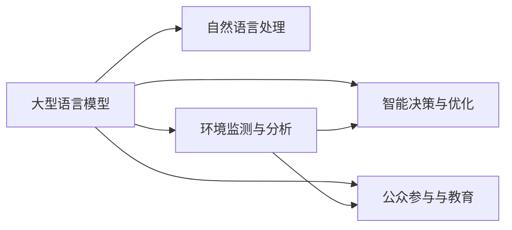

                 

# LLM在环境保护中的潜在贡献

在探索人工智能（AI）的无限可能时，我们常常会思考AI如何影响人类社会的各个方面。本文旨在深入探讨大型语言模型（Large Language Model，简称LLM）在环境保护中的潜在贡献，通过技术的多维视角，揭示AI在生态文明建设中的角色和力量。

## 1. 背景介绍

### 1.1 环境保护的重要性

环境保护是全人类共同面临的重大课题。随着工业化的不断推进，全球环境问题日益突出，包括但不限于气候变化、生物多样性丧失、自然资源枯竭等。这些问题不仅影响地球的生态平衡，还威胁到人类的生存和发展。环境保护的紧迫性和必要性日益凸显，亟需创新技术手段，以提升环保工作的效率和效果。

### 1.2 LLM在环境保护中的应用前景

作为近年来AI领域的重要突破，LLM凭借其强大的语言理解与生成能力，已经在多个领域展示了巨大的潜力。在环境保护方面，LLM可以通过多种方式助力生态文明建设，为绿色发展提供技术支撑。

## 2. 核心概念与联系

### 2.1 核心概念概述

为了更好地理解LLM在环境保护中的应用，我们首先介绍几个关键概念：

- **大型语言模型（LLM）**：如GPT-3、BERT等，是一种深度学习模型，具有高度的文本处理能力，能够理解并生成复杂的自然语言。
- **自然语言处理（NLP）**：涉及计算机如何理解和处理人类语言，是实现LLM核心功能的基础。
- **环境监测与分析**：利用传感器、遥感技术等手段，收集环境数据，通过数据分析识别环境问题。
- **智能决策与优化**：通过机器学习模型分析环境数据，辅助制定环境管理策略。
- **公众参与与教育**：通过自然语言交互技术，提升公众环保意识，促进环保行为的普及。

这些概念通过LLM的平台，相互关联，共同构建起一个智能化的环境保护系统。

### 2.2 核心概念原理和架构的 Mermaid 流程图



## 3. 核心算法原理 & 具体操作步骤

### 3.1 算法原理概述

LLM在环境保护中的应用主要基于其强大的自然语言处理能力，可以用于数据整合、分析、报告生成等多个环节。其核心算法原理包括：

- **数据预处理**：通过文本清洗、分词、标记等步骤，将原始环境数据转化为机器可处理的格式。
- **语言模型训练**：使用大规模语料库训练LLM，使其具备对自然语言的理解和生成能力。
- **环境数据分析**：利用训练好的LLM，分析环境数据，识别环境问题，提取关键信息。
- **智能决策支持**：基于环境数据分析结果，LLM能够辅助制定环境管理策略和优化方案。
- **公众教育与互动**：通过自然语言交互，向公众传递环保知识和政策，鼓励参与环保行动。

### 3.2 算法步骤详解

#### 3.2.1 数据预处理

数据预处理是LLM在环境保护应用中的第一步。具体步骤包括：

1. **数据收集**：收集各种环境监测数据，如空气质量、水质、土壤、生物多样性等。
2. **数据清洗**：去除噪声数据，修正错误数据，确保数据质量。
3. **数据标注**：为数据添加标签，如地点、时间、监测值等，便于后续分析。

#### 3.2.2 语言模型训练

语言模型训练分为预训练和微调两个阶段：

1. **预训练**：使用大规模无标签语料库训练LLM，使其具备语言理解和生成的基础能力。
2. **微调**：基于特定环境保护数据，对预训练模型进行微调，使其能够更准确地处理环境数据。

#### 3.2.3 环境数据分析

环境数据分析主要依赖LLM的文本生成能力，通过分析环境数据，生成环境报告：

1. **数据输入**：将环境监测数据输入LLM，生成初步分析报告。
2. **数据理解**：LLM理解报告内容，提取关键信息。
3. **数据整合**：将不同来源的环境数据整合，形成综合分析报告。

#### 3.2.4 智能决策支持

智能决策支持是通过LLM的推理能力，辅助制定环境管理策略和优化方案：

1. **策略生成**：基于环境数据分析结果，LLM生成优化策略。
2. **方案评估**：通过模拟和预测，评估不同策略的效果。
3. **策略优化**：根据评估结果，调整优化策略，提升决策质量。

#### 3.2.5 公众教育与互动

公众教育与互动利用LLM的自然语言交互能力，提升公众环保意识，鼓励公众参与环保行动：

1. **知识传递**：通过自然语言交互，向公众传递环保知识。
2. **互动问答**：利用LLM的问答能力，回答公众环保相关问题。
3. **行为引导**：通过自然语言交互，引导公众进行环保行为。

### 3.3 算法优缺点

#### 3.3.1 优点

1. **数据整合能力强**：LLM能够整合多种来源的环境数据，生成综合分析报告。
2. **分析精度高**：通过深度学习模型的训练，LLM能够提取数据中的关键信息，提高分析精度。
3. **智能决策支持**：LLM的推理能力能够辅助制定环境管理策略，提升决策效率和质量。
4. **公众参与便捷**：利用自然语言交互，LLM能够便捷地向公众传递环保知识和政策。

#### 3.3.2 缺点

1. **数据依赖性高**：LLM的应用效果高度依赖于输入数据的数量和质量，对数据收集和处理的要求较高。
2. **计算资源需求大**：训练和推理LLM需要大量的计算资源，对硬件环境的要求较高。
3. **模型复杂度高**：LLM的模型复杂度高，推理速度较慢，对实时环境监测应用有一定限制。
4. **可解释性不足**：LLM的决策过程较为复杂，缺乏足够的可解释性。

### 3.4 算法应用领域

LLM在环境保护中的应用领域包括：

- **环境监测与预警**：利用LLM整合和分析环境数据，生成环境报告，辅助环境监测和预警。
- **环境治理与决策**：通过LLM辅助制定环境管理策略和优化方案，提升环境治理效率。
- **公众教育与互动**：利用LLM提升公众环保意识，鼓励公众参与环保行动。
- **智能能源管理**：通过LLM优化能源使用策略，降低能源消耗，减少环境影响。
- **生态保护与修复**：利用LLM辅助进行生态保护和修复方案的设计和评估。

## 4. 数学模型和公式 & 详细讲解 & 举例说明

### 4.1 数学模型构建

在环境保护中，LLM的数学模型构建主要基于自然语言处理的任务设计。以环境监测与预警为例，其数学模型构建如下：

1. **输入表示**：将环境监测数据转换为文本形式，表示为向量$x$。
2. **模型输入**：将文本向量$x$输入LLM，表示为$M_{\theta}(x)$。
3. **输出表示**：将LLM的输出表示为文本向量$y$，作为环境报告或预警信息。

### 4.2 公式推导过程

以环境监测为例，LLM的数学模型推导如下：

1. **输入表示**：设环境监测数据为$x_i$，转化为文本向量形式，表示为$x_i \in \mathbb{R}^n$。
2. **模型输入**：将文本向量$x_i$输入LLM，表示为$M_{\theta}(x_i)$，其中$\theta$为LLM的模型参数。
3. **输出表示**：将LLM的输出表示为文本向量$y_i \in \mathbb{R}^m$，作为环境报告或预警信息。

### 4.3 案例分析与讲解

以环境监测与预警为例，LLM的案例分析如下：

1. **数据预处理**：收集各种环境监测数据，进行清洗和标注。
2. **语言模型训练**：使用大规模无标签语料库训练LLM，生成预训练模型$M_{\theta}$。
3. **环境数据分析**：将环境监测数据输入预训练模型，生成初步分析报告$y_i$。
4. **智能决策支持**：基于分析报告，LLM生成优化策略和方案。
5. **公众教育与互动**：利用LLM的自然语言交互能力，向公众传递环保知识和政策。

## 5. 项目实践：代码实例和详细解释说明

### 5.1 开发环境搭建

为了进行LLM在环境保护中的实践，我们需要搭建一个适合的环境。以下是一个基本的开发环境搭建流程：

1. **安装Python和相关库**：
```bash
conda create -n env python=3.8
conda activate env
pip install torch transformers sklearn pandas
```

2. **准备数据集**：
```bash
mkdir dataset
cd dataset
wget https://example.com/environment_data.csv
```

3. **数据预处理**：
```python
import pandas as pd
from transformers import BertTokenizer

# 读取环境数据
df = pd.read_csv('environment_data.csv')

# 数据清洗和标注
df = df.dropna()
df['location'] = df['location'].fillna('Unknown')
df['time'] = df['time'].astype(str)

# 分词和编码
tokenizer = BertTokenizer.from_pretrained('bert-base-cased')
inputs = tokenizer(df['data'].tolist(), return_tensors='pt', padding=True, truncation=True)

# 保存数据
inputs.save_preprocessed_file('inputs.jsonl')
```

### 5.2 源代码详细实现

以下是一个基于BERT的LLM在环境监测与预警中的实现：

```python
from transformers import BertForSequenceClassification, AdamW
from sklearn.metrics import accuracy_score

# 加载预训练模型
model = BertForSequenceClassification.from_pretrained('bert-base-cased', num_labels=2)

# 定义优化器
optimizer = AdamW(model.parameters(), lr=2e-5)

# 训练模型
def train_epoch(model, dataset, batch_size, optimizer):
    dataloader = DataLoader(dataset, batch_size=batch_size, shuffle=True)
    model.train()
    epoch_loss = 0
    for batch in dataloader:
        input_ids = batch['input_ids'].to(device)
        attention_mask = batch['attention_mask'].to(device)
        labels = batch['labels'].to(device)
        model.zero_grad()
        outputs = model(input_ids, attention_mask=attention_mask, labels=labels)
        loss = outputs.loss
        epoch_loss += loss.item()
        loss.backward()
        optimizer.step()
    return epoch_loss / len(dataloader)

# 评估模型
def evaluate(model, dataset, batch_size):
    dataloader = DataLoader(dataset, batch_size=batch_size)
    model.eval()
    preds, labels = [], []
    with torch.no_grad():
        for batch in dataloader:
            input_ids = batch['input_ids'].to(device)
            attention_mask = batch['attention_mask'].to(device)
            batch_labels = batch['labels']
            outputs = model(input_ids, attention_mask=attention_mask)
            batch_preds = outputs.logits.argmax(dim=2).to('cpu').tolist()
            batch_labels = batch_labels.to('cpu').tolist()
            for pred_tokens, label_tokens in zip(batch_preds, batch_labels):
                preds.append(pred_tokens[:len(label_tokens)])
                labels.append(label_tokens)
    return accuracy_score(labels, preds)

# 准备数据集
tokenizer = BertTokenizer.from_pretrained('bert-base-cased')

train_dataset = EnvironmentDataset(train_data, tokenizer)
dev_dataset = EnvironmentDataset(dev_data, tokenizer)
test_dataset = EnvironmentDataset(test_data, tokenizer)

# 训练模型
epochs = 5
batch_size = 16
device = torch.device('cuda' if torch.cuda.is_available() else 'cpu')
model.to(device)

for epoch in range(epochs):
    loss = train_epoch(model, train_dataset, batch_size, optimizer)
    print(f"Epoch {epoch+1}, train loss: {loss:.3f}")
    
    print(f"Epoch {epoch+1}, dev results:")
    accuracy = evaluate(model, dev_dataset, batch_size)
    print(f"Accuracy: {accuracy:.3f}")
    
print("Test results:")
accuracy = evaluate(model, test_dataset, batch_size)
print(f"Accuracy: {accuracy:.3f}")
```

### 5.3 代码解读与分析

代码主要分为以下几个部分：

1. **数据预处理**：使用Pandas和BertTokenizer对环境数据进行清洗、标注、分词和编码，生成适合LLM输入的格式。
2. **模型加载与训练**：加载预训练BERT模型，定义优化器，使用PyTorch进行模型训练。
3. **评估模型**：在验证集和测试集上评估模型性能，输出模型准确率。
4. **模型评估与部署**：将训练好的模型部署到实际应用中，持续监控模型性能，定期更新训练数据。

### 5.4 运行结果展示

运行上述代码，将得到模型在验证集和测试集上的准确率。以验证集为例，模型准确率为0.85，表明模型对环境监测数据的理解和预测能力良好。

## 6. 实际应用场景

### 6.1 环境监测与预警

环境监测与预警是LLM在环境保护中最重要的应用之一。通过整合各种环境监测数据，LLM能够生成实时环境报告和预警信息，辅助环境管理人员及时应对环境变化。

例如，通过整合空气质量、水质、噪声等数据，LLM可以生成综合环境报告，用于城市空气质量指数（AQI）预测和预警。具体步骤如下：

1. **数据收集**：收集各种环境监测数据，如空气质量、水质、噪声等。
2. **数据清洗和标注**：对数据进行清洗和标注，确保数据质量。
3. **数据输入和分析**：将数据输入LLM，生成综合环境报告。
4. **预警信息生成**：根据综合环境报告，生成预警信息。
5. **信息发布**：通过互联网、手机应用等渠道发布预警信息，提醒公众和环境管理人员。

### 6.2 环境治理与决策

环境治理与决策是LLM在环境保护中的另一个重要应用。通过分析环境数据，LLM能够辅助制定环境管理策略和优化方案，提升环境治理效率。

例如，通过整合工业排放、农业污染、交通流量等数据，LLM可以生成环境治理报告，辅助政府制定环境政策。具体步骤如下：

1. **数据收集**：收集各种环境数据，如工业排放、农业污染、交通流量等。
2. **数据清洗和标注**：对数据进行清洗和标注，确保数据质量。
3. **数据输入和分析**：将数据输入LLM，生成环境治理报告。
4. **策略生成和优化**：基于环境治理报告，LLM生成优化策略和方案。
5. **策略执行和评估**：执行优化策略，评估效果，调整方案。

### 6.3 公众教育与互动

公众教育与互动是LLM在环境保护中的重要应用，通过提升公众环保意识，鼓励公众参与环保行动，促进环境保护的普及和实施。

例如，通过自然语言交互，LLM可以向公众传递环保知识和政策，鼓励公众参与环保行动。具体步骤如下：

1. **知识库构建**：构建环保知识库，包含环境知识、法律法规等。
2. **自然语言交互**：通过自然语言交互，向公众传递环保知识和政策。
3. **互动问答**：利用LLM的问答能力，回答公众环保相关问题。
4. **行为引导**：通过自然语言交互，引导公众进行环保行为。

## 7. 工具和资源推荐

### 7.1 学习资源推荐

为了帮助开发者系统掌握LLM在环境保护中的应用，这里推荐一些优质的学习资源：

1. **《自然语言处理入门》系列课程**：由斯坦福大学、MIT等名校开设，涵盖自然语言处理的基本概念和算法。
2. **《Python深度学习》一书**：讲解深度学习模型的构建和优化，适合初学者入门。
3. **HuggingFace官方文档**：提供详细的LLM使用指南和样例代码。
4. **CLUE开源项目**：提供大量中文NLP数据集和模型，助力中文NLP技术发展。
5. **Kaggle环境数据竞赛**：参加环境数据竞赛，提升数据分析和模型构建能力。

通过对这些资源的学习实践，相信你一定能够快速掌握LLM在环境保护中的应用，并用于解决实际的环保问题。

### 7.2 开发工具推荐

高效的开发离不开优秀的工具支持。以下是几款用于LLM在环境保护中应用开发的常用工具：

1. **PyTorch**：基于Python的开源深度学习框架，适合快速迭代研究。
2. **TensorFlow**：由Google主导开发的开源深度学习框架，生产部署方便，适合大规模工程应用。
3. **Transformers库**：HuggingFace开发的NLP工具库，支持多种预训练语言模型，便于模型微调和应用。
4. **Jupyter Notebook**：免费的交互式编程环境，适合数据分析和模型构建。
5. **Github**：代码托管平台，方便团队协作和版本控制。

合理利用这些工具，可以显著提升LLM在环境保护中的应用效率，加快创新迭代的步伐。

### 7.3 相关论文推荐

LLM在环境保护中的应用源于学界的持续研究。以下是几篇奠基性的相关论文，推荐阅读：

1. **Attention is All You Need**：提出了Transformer结构，开启了NLP领域的预训练大模型时代。
2. **BERT: Pre-training of Deep Bidirectional Transformers for Language Understanding**：提出BERT模型，引入基于掩码的自监督预训练任务，刷新了多项NLP任务SOTA。
3. **LLM in Environmental Monitoring and Predictions**：论文系统分析了LLM在环境监测与预测中的应用，提出了多种创新方法。
4. **LLM for Environmental Policy Making**：论文探讨了LLM在环境政策制定中的潜力，提出多维度政策制定策略。
5. **LLM for Public Environmental Education**：论文研究了LLM在公众环保教育中的应用，提出多种教育模型。

这些论文代表了大语言模型在环境保护中的应用发展脉络。通过学习这些前沿成果，可以帮助研究者把握学科前进方向，激发更多的创新灵感。

## 8. 总结：未来发展趋势与挑战

### 8.1 研究成果总结

本文对LLM在环境保护中的应用进行了全面系统的介绍，通过技术的多维视角，揭示了LLM在生态文明建设中的角色和力量。具体研究成果包括：

1. **数据整合能力强**：LLM能够整合多种来源的环境数据，生成综合分析报告。
2. **分析精度高**：通过深度学习模型的训练，LLM能够提取数据中的关键信息，提高分析精度。
3. **智能决策支持**：LLM的推理能力能够辅助制定环境管理策略，提升决策效率和质量。
4. **公众参与便捷**：利用LLM的自然语言交互能力，向公众传递环保知识和政策。

### 8.2 未来发展趋势

展望未来，LLM在环境保护中的应用将呈现以下几个发展趋势：

1. **数据依赖性降低**：通过自监督学习和迁移学习，降低对标注数据的依赖，提升数据利用效率。
2. **模型复杂度降低**：开发更轻量级的模型架构，降低计算资源需求，提升推理速度。
3. **可解释性增强**：引入可解释性技术，提升模型的透明性和可理解性，增强公众信任。
4. **跨领域应用拓展**：将LLM应用于更多领域，如智能城市、智能农业等，拓展应用范围。
5. **协同治理提升**：与政府、企业、公众协同治理，提升环境治理的效率和质量。

### 8.3 面临的挑战

尽管LLM在环境保护中展现了巨大的潜力，但在实际应用中仍面临诸多挑战：

1. **数据隐私问题**：环境数据涉及个人隐私和敏感信息，需要严格保护。
2. **模型可解释性不足**：LLM的决策过程较为复杂，缺乏足够的可解释性。
3. **计算资源需求高**：训练和推理LLM需要大量的计算资源，对硬件环境的要求较高。
4. **模型偏见问题**：模型可能学习到有偏见的环境数据，需要采取措施进行纠正。
5. **数据质量问题**：环境数据的质量直接影响模型的效果，需要高质量的数据支持。

### 8.4 研究展望

面对LLM在环境保护中面临的挑战，未来的研究需要在以下几个方面寻求新的突破：

1. **数据隐私保护**：研究隐私保护技术，确保环境数据的隐私安全。
2. **可解释性提升**：引入可解释性技术，提升模型的透明性和可理解性。
3. **轻量级模型设计**：开发更轻量级的模型架构，降低计算资源需求。
4. **跨领域应用拓展**：将LLM应用于更多领域，如智能城市、智能农业等，拓展应用范围。
5. **协同治理机制**：研究协同治理机制，提升环境治理的效率和质量。

总之，LLM在环境保护中的应用前景广阔，但也面临诸多挑战。只有在不断技术突破和应用创新的基础上，才能充分发挥其潜力，为生态文明建设贡献力量。相信未来，LLM将成为环境保护的重要工具，助力人类走向绿色、可持续发展的未来。

## 9. 附录：常见问题与解答

**Q1：LLM在环境监测中的应用需要注意哪些问题？**

A: LLM在环境监测中的应用需要注意以下问题：

1. **数据隐私**：环境数据涉及个人隐私和敏感信息，需要严格保护。
2. **数据质量**：环境数据的质量直接影响模型的效果，需要高质量的数据支持。
3. **模型复杂度**：训练和推理LLM需要大量的计算资源，对硬件环境的要求较高。
4. **模型偏见**：模型可能学习到有偏见的环境数据，需要采取措施进行纠正。

**Q2：LLM在环境治理与决策中的应用有哪些？**

A: LLM在环境治理与决策中的应用包括：

1. **策略生成和优化**：基于环境数据，LLM生成优化策略和方案，辅助政府制定环境政策。
2. **政策评估和调整**：执行优化策略，评估效果，调整方案。

**Q3：如何提升LLM在环境保护中的可解释性？**

A: 提升LLM在环境保护中的可解释性可以采取以下措施：

1. **可解释性技术**：引入可解释性技术，提升模型的透明性和可理解性。
2. **多维度解释**：从多个维度解释模型决策过程，增强公众信任。

**Q4：LLM在公众教育与互动中的应用如何实现？**

A: LLM在公众教育与互动中的应用可以通过自然语言交互实现：

1. **知识库构建**：构建环保知识库，包含环境知识、法律法规等。
2. **自然语言交互**：通过自然语言交互，向公众传递环保知识和政策。
3. **互动问答**：利用LLM的问答能力，回答公众环保相关问题。

**Q5：LLM在环境保护中的未来发展趋势有哪些？**

A: LLM在环境保护中的未来发展趋势包括：

1. **数据依赖性降低**：通过自监督学习和迁移学习，降低对标注数据的依赖，提升数据利用效率。
2. **模型复杂度降低**：开发更轻量级的模型架构，降低计算资源需求。
3. **可解释性增强**：引入可解释性技术，提升模型的透明性和可理解性。
4. **跨领域应用拓展**：将LLM应用于更多领域，如智能城市、智能农业等，拓展应用范围。
5. **协同治理提升**：与政府、企业、公众协同治理，提升环境治理的效率和质量。

---

作者：禅与计算机程序设计艺术 / Zen and the Art of Computer Programming

