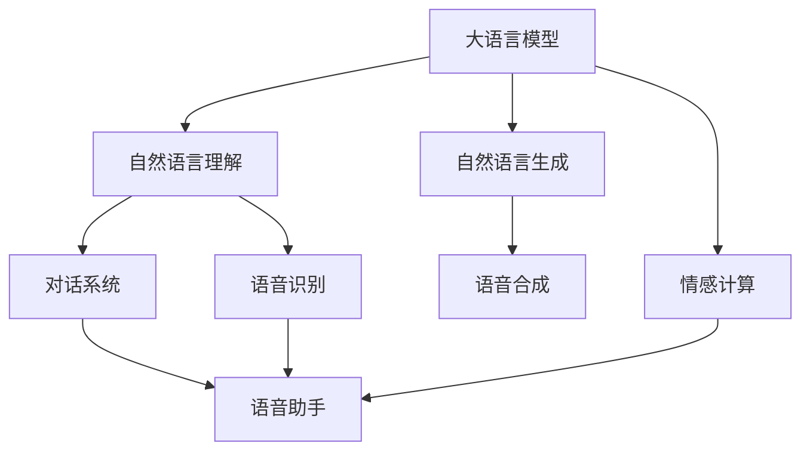

                 

# LLM在语音助手中的应用：更自然的人机交互

> 关键词：语音助手,大语言模型(LLM),自然语言处理(NLP),深度学习,语音识别,自然语言理解(NLU),对话系统,语音合成,情感计算

## 1. 背景介绍

### 1.1 问题由来
随着人工智能技术的迅猛发展，语音助手在现代社会中的应用越来越广泛。语音助手不仅可以响应用户的语音指令，还能进行对话互动，提供个性化服务。传统的语音助手通常采用基于规则和模板的方式进行对话处理，但这种方法往往需要大量人工编写规则和模板，且难以处理复杂的自然语言变化。

随着自然语言处理（NLP）技术的进步，尤其是大语言模型（Large Language Model, LLM）的出现，语音助手逐渐开始采用基于深度学习的模型进行处理。LLM通过在大规模无标签文本语料上进行预训练，学习到了丰富的语言知识和常识，具备强大的语言理解和生成能力。基于LLM的语音助手可以实现更加自然和智能的人机交互。

### 1.2 问题核心关键点
基于大语言模型的语音助手应用主要关注以下几个方面：

- 如何有效利用预训练的LLM，提取语言知识和常识，实现自然语言理解（NLU）和生成（NLG）。
- 如何构建基于LLM的对话系统，使其能够理解和响应用户的语音指令和问题。
- 如何优化LLM在语音识别（ASR）和语音合成（TTS）中的表现，提升系统整体的交互体验。
- 如何处理语音信号的噪声和干扰，确保语音助手的鲁棒性。
- 如何对用户情感进行识别和分析，以提供更加个性化的服务。

### 1.3 问题研究意义
研究基于大语言模型的语音助手应用，对于提升语音助手的智能化水平，提高用户体验，具有重要意义：

- 提升人机交互的自然性。基于LLM的语音助手可以理解复杂的自然语言变化，对用户的语音指令和问题进行更加准确的理解和响应。
- 降低系统开发成本。LLM的预训练过程可以替代传统基于规则的模板编写，大大降低了系统开发的复杂度和成本。
- 提高系统灵活性和可扩展性。LLM能够灵活应对不同的对话场景，适应多种语音助手需求，便于系统的快速迭代和扩展。
- 增强情感计算能力。通过对用户情感的识别和分析，语音助手可以提供更加个性化的服务，提升用户满意度和忠诚度。

## 2. 核心概念与联系

### 2.1 核心概念概述

为更好地理解基于大语言模型的语音助手应用，本节将介绍几个密切相关的核心概念：

- 大语言模型(LLM)：以自回归(如GPT)或自编码(如BERT)模型为代表的大规模预训练语言模型。通过在大规模无标签文本语料上进行预训练，学习通用的语言表示，具备强大的语言理解和生成能力。

- 自然语言处理(NLP)：研究如何让计算机理解和处理自然语言，实现自然语言理解（NLU）和自然语言生成（NLG）。NLP技术是构建语音助手的重要基础。

- 自然语言理解(NLU)：指计算机理解和处理自然语言输入的技术，包括分词、词性标注、命名实体识别、意图识别等。NLU是构建语音助手的核心技术之一。

- 自然语言生成(NLG)：指计算机根据自然语言输入生成自然语言输出的技术，包括文本生成、对话生成等。NLG是语音助手实现语音响应的关键技术。

- 语音识别(ASR)：将语音信号转化为文本的过程。基于深度学习的ASR模型可以通过预训练进行快速部署，提高语音助手的交互速度和准确性。

- 语音合成(TTS)：将文本转化为语音的过程。基于深度学习的TTS模型可以实现更加自然流畅的语音合成，提升语音助手的用户体验。

- 对话系统：使机器能够理解和响应用户的语音指令和问题，并进行对话互动的系统。对话系统是语音助手的重要组成部分。

- 情感计算：通过语音识别和自然语言理解技术，对用户的语音和文字输入进行情感分析，提升语音助手的个性化服务能力。

这些核心概念之间的逻辑关系可以通过以下Mermaid流程图来展示：



这个流程图展示了大语言模型的核心概念及其之间的关系：

1. 大语言模型通过预训练获得基础能力。
2. 自然语言理解实现语音识别和语音输入的处理，对话系统根据NLU结果进行响应。
3. 自然语言生成实现语音合成，对话系统将NLG结果转化为语音输出。
4. 情感计算从语音和文字输入中识别用户情感，提升个性化服务。
5. 对话系统整合以上所有技术，实现人机交互。

## 3. 核心算法原理 & 具体操作步骤
### 3.1 算法原理概述

基于大语言模型的语音助手应用，本质上是一个基于深度学习的语音信号处理和自然语言处理的复合系统。其核心思想是：将大语言模型作为强大的语言处理工具，结合语音识别和合成技术，实现从语音信号到文本再到语音的完整处理流程。

具体而言，语音助手系统包括三个主要部分：

- **语音识别(ASR)**：将用户的语音输入转化为文本。
- **对话系统**：根据文本理解和生成对话回复。
- **语音合成(TTS)**：将对话回复转化为语音输出。

每个部分都可以利用大语言模型进行优化和改进。例如，对话系统可以采用预训练的大语言模型进行微调，以适应特定的对话场景和用户需求。

### 3.2 算法步骤详解

基于大语言模型的语音助手应用一般包括以下几个关键步骤：

**Step 1: 准备预训练模型和数据集**
- 选择合适的预训练语言模型 $M_{\theta}$ 作为初始化参数，如 BERT、GPT 等。
- 准备语音助手相关的对话数据集 $D=\{(x_i, y_i)\}_{i=1}^N$，其中 $x_i$ 为语音输入，$y_i$ 为对应的文本输出。

**Step 2: 添加任务适配层**
- 根据对话场景，在预训练模型的顶层设计合适的输出层和损失函数。
- 对于对话任务，通常使用分类交叉熵损失函数。
- 对于生成对话，通常使用语言模型的解码器输出概率分布，并以负对数似然为损失函数。

**Step 3: 设置微调超参数**
- 选择合适的优化算法及其参数，如 AdamW、SGD 等，设置学习率、批大小、迭代轮数等。
- 设置正则化技术及强度，包括权重衰减、Dropout、Early Stopping 等。
- 确定冻结预训练参数的策略，如仅微调顶层，或全部参数都参与微调。

**Step 4: 执行梯度训练**
- 将对话数据集以批为单位输入模型，前向传播计算损失函数。
- 反向传播计算参数梯度，根据设定的优化算法和学习率更新模型参数。
- 周期性在验证集上评估模型性能，根据性能指标决定是否触发 Early Stopping。
- 重复上述步骤直到满足预设的迭代轮数或 Early Stopping 条件。

**Step 5: 测试和部署**
- 在测试集上评估微调后模型 $M_{\hat{\theta}}$ 的性能，对比微调前后的精度提升。
- 使用微调后的模型对新样本进行推理预测，集成到实际的应用系统中。
- 持续收集新的对话数据，定期重新微调模型，以适应数据分布的变化。

以上是基于大语言模型的语音助手应用的一般流程。在实际应用中，还需要针对具体对话场景的特点，对微调过程的各个环节进行优化设计，如改进训练目标函数，引入更多的正则化技术，搜索最优的超参数组合等，以进一步提升模型性能。

### 3.3 算法优缺点

基于大语言模型的语音助手应用具有以下优点：
1. 自然性高。通过大语言模型，语音助手可以实现更加自然流畅的人机交互，理解复杂自然语言变化。
2. 适应性强。模型可以根据不同对话场景和用户需求进行微调，灵活性高。
3. 个性化服务。通过情感计算技术，语音助手能够识别用户情感，提供更个性化的服务。
4. 开发成本低。利用大语言模型预训练的通用知识，减少了人工规则编写成本。
5. 鲁棒性好。基于深度学习的语音识别和合成技术，使得语音助手在噪声干扰下也能保持稳定性能。

同时，该方法也存在一定的局限性：
1. 依赖高质量标注数据。微调的效果很大程度上取决于对话数据的标注质量，获取高质量对话数据的成本较高。
2. 模型复杂度大。预训练语言模型参数量庞大，推理速度较慢。
3. 硬件要求高。语音识别和合成需要高性能硬件设备支持，增加了系统部署成本。
4. 计算资源消耗大。大模型在推理和微调时，需要消耗大量的计算资源，增加了系统维护成本。

尽管存在这些局限性，但就目前而言，基于大语言模型的语音助手应用依然是大规模落地应用的重要方式。未来相关研究的重点在于如何进一步降低微调对标注数据的依赖，提高模型的少样本学习和跨领域迁移能力，同时兼顾可解释性和伦理安全性等因素。

### 3.4 算法应用领域

基于大语言模型的语音助手应用已经在多个领域得到了广泛应用，例如：

- 智能家居：通过语音助手实现对智能家居设备的控制和查询。
- 车载导航：语音助手提供导航和路线规划服务。
- 智能客服：语音助手为客服中心提供自动化服务。
- 健康医疗：语音助手提供健康咨询和提醒服务。
- 教育培训：语音助手辅助在线教育，进行问题解答和作业批改。
- 娱乐互动：语音助手提供个性化娱乐内容和互动服务。
- 金融理财：语音助手提供金融咨询和理财服务。

除了上述这些经典应用外，语音助手还被创新性地应用到更多场景中，如可控文本生成、常识推理、代码生成、数据增强等，为语音助手技术带来了全新的突破。随着预训练模型和微调方法的不断进步，相信语音助手技术将在更广阔的应用领域大放异彩。

## 4. 数学模型和公式 & 详细讲解
### 4.1 数学模型构建

本节将使用数学语言对基于大语言模型的语音助手应用过程进行更加严格的刻画。

记语音助手系统中的大语言模型为 $M_{\theta}:\mathcal{X} \rightarrow \mathcal{Y}$，其中 $\mathcal{X}$ 为输入空间，$\mathcal{Y}$ 为输出空间，$\theta \in \mathbb{R}^d$ 为模型参数。假设对话数据集为 $D=\{(x_i, y_i)\}_{i=1}^N, x_i \in \mathcal{X}, y_i \in \mathcal{Y}$。

定义模型 $M_{\theta}$ 在输入 $x$ 上的输出为 $\hat{y}=M_{\theta}(x) \in [0,1]$，表示样本属于正类的概率。真实标签 $y \in \{0,1\}$。则二分类交叉熵损失函数定义为：

$$
\ell(M_{\theta}(x),y) = -[y\log \hat{y} + (1-y)\log (1-\hat{y})]
$$

将其代入经验风险公式，得：

$$
\mathcal{L}(\theta) = -\frac{1}{N}\sum_{i=1}^N [y_i\log M_{\theta}(x_i)+(1-y_i)\log(1-M_{\theta}(x_i))]
$$

在得到损失函数的梯度后，即可带入参数更新公式，完成模型的迭代优化。重复上述过程直至收敛，最终得到适应对话任务的最优模型参数 $\theta^*$。

### 4.2 公式推导过程

以下我们以对话生成任务为例，推导交叉熵损失函数及其梯度的计算公式。

假设模型 $M_{\theta}$ 在输入 $x$ 上的输出为 $\hat{y}=M_{\theta}(x) \in [0,1]$，表示样本属于正类的概率。真实标签 $y \in \{0,1\}$。则二分类交叉熵损失函数定义为：

$$
\ell(M_{\theta}(x),y) = -[y\log \hat{y} + (1-y)\log (1-\hat{y})]
$$

将其代入经验风险公式，得：

$$
\mathcal{L}(\theta) = -\frac{1}{N}\sum_{i=1}^N [y_i\log M_{\theta}(x_i)+(1-y_i)\log(1-M_{\theta}(x_i))]
$$

根据链式法则，损失函数对参数 $\theta_k$ 的梯度为：

$$
\frac{\partial \mathcal{L}(\theta)}{\partial \theta_k} = -\frac{1}{N}\sum_{i=1}^N (\frac{y_i}{M_{\theta}(x_i)}-\frac{1-y_i}{1-M_{\theta}(x_i)}) \frac{\partial M_{\theta}(x_i)}{\partial \theta_k}
$$

其中 $\frac{\partial M_{\theta}(x_i)}{\partial \theta_k}$ 可进一步递归展开，利用自动微分技术完成计算。

在得到损失函数的梯度后，即可带入参数更新公式，完成模型的迭代优化。重复上述过程直至收敛，最终得到适应对话任务的最优模型参数 $\theta^*$。

## 5. 项目实践：代码实例和详细解释说明
### 5.1 开发环境搭建

在进行语音助手开发前，我们需要准备好开发环境。以下是使用Python进行PyTorch开发的环境配置流程：

1. 安装Anaconda：从官网下载并安装Anaconda，用于创建独立的Python环境。

2. 创建并激活虚拟环境：
```bash
conda create -n pytorch-env python=3.8 
conda activate pytorch-env
```

3. 安装PyTorch：根据CUDA版本，从官网获取对应的安装命令。例如：
```bash
conda install pytorch torchvision torchaudio cudatoolkit=11.1 -c pytorch -c conda-forge
```

4. 安装Transformers库：
```bash
pip install transformers
```

5. 安装各类工具包：
```bash
pip install numpy pandas scikit-learn matplotlib tqdm jupyter notebook ipython
```

完成上述步骤后，即可在`pytorch-env`环境中开始语音助手开发。

### 5.2 源代码详细实现

下面我们以对话生成任务为例，给出使用Transformers库对GPT模型进行微调的PyTorch代码实现。

首先，定义对话生成任务的数据处理函数：

```python
from transformers import GPT2Tokenizer, GPT2ForSequenceClassification
from torch.utils.data import Dataset
import torch

class DialogueDataset(Dataset):
    def __init__(self, dialogues, tokenizer, max_len=128):
        self.dialogues = dialogues
        self.tokenizer = tokenizer
        self.max_len = max_len
        
    def __len__(self):
        return len(self.dialogues)
    
    def __getitem__(self, item):
        dialogue = self.dialogues[item]
        
        encoding = self.tokenizer(dialogue, return_tensors='pt', max_length=self.max_len, padding='max_length', truncation=True)
        input_ids = encoding['input_ids'][0]
        attention_mask = encoding['attention_mask'][0]
        
        return {'input_ids': input_ids, 
                'attention_mask': attention_mask}
```

然后，定义模型和优化器：

```python
from transformers import GPT2ForCausalLM, AdamW

model = GPT2ForCausalLM.from_pretrained('gpt2-medium')

optimizer = AdamW(model.parameters(), lr=2e-5)
```

接着，定义训练和评估函数：

```python
from torch.utils.data import DataLoader
from tqdm import tqdm
from sklearn.metrics import precision_recall_fscore_support

device = torch.device('cuda') if torch.cuda.is_available() else torch.device('cpu')
model.to(device)

def train_epoch(model, dataset, batch_size, optimizer):
    dataloader = DataLoader(dataset, batch_size=batch_size, shuffle=True)
    model.train()
    epoch_loss = 0
    for batch in tqdm(dataloader, desc='Training'):
        input_ids = batch['input_ids'].to(device)
        attention_mask = batch['attention_mask'].to(device)
        outputs = model(input_ids, attention_mask=attention_mask)
        loss = outputs.loss
        epoch_loss += loss.item()
        loss.backward()
        optimizer.step()
    return epoch_loss / len(dataloader)

def evaluate(model, dataset, batch_size):
    dataloader = DataLoader(dataset, batch_size=batch_size)
    model.eval()
    preds, labels = [], []
    with torch.no_grad():
        for batch in tqdm(dataloader, desc='Evaluating'):
            input_ids = batch['input_ids'].to(device)
            attention_mask = batch['attention_mask'].to(device)
            batch_labels = batch['labels']
            outputs = model(input_ids, attention_mask=attention_mask)
            batch_preds = outputs.logits.argmax(dim=2).to('cpu').tolist()
            batch_labels = batch_labels.to('cpu').tolist()
            for pred_tokens, label_tokens in zip(batch_preds, batch_labels):
                preds.append(pred_tokens[:len(label_tokens)])
                labels.append(label_tokens)
                
    return precision_recall_fscore_support(labels, preds)
```

最后，启动训练流程并在测试集上评估：

```python
epochs = 5
batch_size = 16

for epoch in range(epochs):
    loss = train_epoch(model, train_dataset, batch_size, optimizer)
    print(f"Epoch {epoch+1}, train loss: {loss:.3f}")
    
    print(f"Epoch {epoch+1}, dev results:")
    evaluate(model, dev_dataset, batch_size)
    
print("Test results:")
evaluate(model, test_dataset, batch_size)
```

以上就是使用PyTorch对GPT2进行对话生成任务微调的完整代码实现。可以看到，得益于Transformers库的强大封装，我们可以用相对简洁的代码完成GPT2模型的加载和微调。

### 5.3 代码解读与分析

让我们再详细解读一下关键代码的实现细节：

**DialogueDataset类**：
- `__init__`方法：初始化对话数据和分词器等关键组件。
- `__len__`方法：返回对话数据的数量。
- `__getitem__`方法：对单个对话进行预处理，将对话转化为token ids，进行定长padding，最终返回模型所需的输入。

**训练和评估函数**：
- 使用PyTorch的DataLoader对数据集进行批次化加载，供模型训练和推理使用。
- 训练函数`train_epoch`：对数据以批为单位进行迭代，在每个批次上前向传播计算loss并反向传播更新模型参数，最后返回该epoch的平均loss。
- 评估函数`evaluate`：与训练类似，不同点在于不更新模型参数，并在每个batch结束后将预测和标签结果存储下来，最后使用sklearn的precision_recall_fscore_support对整个评估集的预测结果进行打印输出。

**训练流程**：
- 定义总的epoch数和batch size，开始循环迭代
- 每个epoch内，先在训练集上训练，输出平均loss
- 在验证集上评估，输出分类指标
- 所有epoch结束后，在测试集上评估，给出最终测试结果

可以看到，PyTorch配合Transformers库使得GPT2微调的代码实现变得简洁高效。开发者可以将更多精力放在数据处理、模型改进等高层逻辑上，而不必过多关注底层的实现细节。

当然，工业级的系统实现还需考虑更多因素，如模型的保存和部署、超参数的自动搜索、更灵活的任务适配层等。但核心的微调范式基本与此类似。

## 6. 实际应用场景
### 6.1 智能家居

基于大语言模型的语音助手可以广泛应用于智能家居设备的控制和查询。用户可以通过语音助手快速控制智能灯泡、空调、窗帘等设备，查询天气、日历等信息。

在技术实现上，可以收集智能家居设备的使用日志和用户语音交互记录，训练对话生成模型。微调后的语音助手能够理解用户的语音指令，生成符合期望的回复。在模型部署后，用户可以随时通过语音控制家居设备，提高生活便捷性。

### 6.2 车载导航

车载导航系统中的语音助手能够帮助驾驶员导航和查询路线。通过语音助手，驾驶员可以实时查询目的地、路线、路况等信息。

在实际应用中，车载导航系统通常会集成多种传感器和设备，如GPS、摄像头、手势识别等。语音助手可以根据车辆状态和用户需求，实时提供定制化的导航服务，提升驾驶体验。

### 6.3 智能客服

智能客服系统中的语音助手能够自动化处理用户咨询和问题。通过语音助手，客户可以通过语音方式与客服中心进行对话，快速获取需要的信息和服务。

在实践中，智能客服系统通常会采用多轮对话的微调模型，以处理复杂的用户咨询。语音助手能够理解用户的意图，匹配最合适的答案模板进行回复，减少人工客服的干预，提高客户满意度。

### 6.4 健康医疗

健康医疗领域中的语音助手能够提供健康咨询和提醒服务。通过语音助手，用户可以随时查询健康信息、预约医生、购买药品等。

在应用中，语音助手可以根据用户的语音输入，进行自然语言理解和对话生成，生成个性化的健康建议。同时，语音助手还可以与健康监测设备进行信息交互，实时监控用户的健康状态，提供及时的健康提醒。

### 6.5 教育培训

在线教育平台中的语音助手能够辅助教师进行教学，帮助学生进行学习。通过语音助手，教师可以实时解答学生的问题，提供个性化的教学建议。学生可以通过语音助手进行作业提交、学习进度查询等操作，提升学习效率。

在实践中，语音助手通常会与自然语言理解（NLU）和自然语言生成（NLG）技术结合，实现智能问答和作业批改等功能。通过微调后的语音助手，教师和学生能够更加高效地进行互动，提升教育质量。

### 6.6 娱乐互动

基于大语言模型的语音助手能够提供个性化的娱乐内容和互动服务。用户可以通过语音助手进行音乐播放、电影推荐、游戏互动等操作。

在应用中，语音助手可以根据用户的喜好和历史行为数据，推荐符合用户兴趣的娱乐内容。同时，语音助手还可以进行多轮对话，提升用户互动体验。

### 6.7 金融理财

金融理财领域中的语音助手能够提供金融咨询和理财服务。通过语音助手，用户可以实时查询账户余额、交易记录、投资组合等信息，获取个性化的理财建议。

在实际应用中，语音助手通常会与金融数据和算法结合，提供精准的投资分析和财务规划服务。通过微调后的语音助手，用户可以随时进行理财咨询，提高财务管理效率。

### 6.8 未来应用展望

随着大语言模型和微调方法的不断发展，基于大语言模型的语音助手应用将在更多领域得到应用，为传统行业带来变革性影响。

在智慧城市治理中，语音助手可以应用于城市事件监测、舆情分析、应急指挥等环节，提高城市管理的自动化和智能化水平，构建更安全、高效的未来城市。

在智慧交通中，语音助手可以辅助交通管理，提供实时交通信息、路线规划、事故处理等服务，提升交通管理效率。

在智能医疗中，语音助手可以帮助医生进行诊断和治疗决策，提供个性化的健康建议，提升医疗服务的智能化水平。

此外，在企业生产、社会治理、文娱传媒等众多领域，基于大语言模型的语音助手应用也将不断涌现，为经济社会发展注入新的动力。相信随着技术的日益成熟，语音助手技术将成为人工智能落地应用的重要范式，推动人工智能技术在更多场景中的应用。

## 7. 工具和资源推荐
### 7.1 学习资源推荐

为了帮助开发者系统掌握大语言模型在语音助手中的应用，这里推荐一些优质的学习资源：

1. 《自然语言处理入门与实践》系列博文：由大语言模型技术专家撰写，深入浅出地介绍了自然语言处理的基本概念和常用技术。

2. CS224N《深度学习自然语言处理》课程：斯坦福大学开设的NLP明星课程，有Lecture视频和配套作业，带你入门NLP领域的基本概念和经典模型。

3. 《Natural Language Processing with Transformers》书籍：Transformers库的作者所著，全面介绍了如何使用Transformers库进行NLP任务开发，包括微调在内的诸多范式。

4. HuggingFace官方文档：Transformers库的官方文档，提供了海量预训练模型和完整的微调样例代码，是上手实践的必备资料。

5. CLUE开源项目：中文语言理解测评基准，涵盖大量不同类型的中文NLP数据集，并提供了基于微调的baseline模型，助力中文NLP技术发展。

通过对这些资源的学习实践，相信你一定能够快速掌握大语言模型在语音助手中的应用精髓，并用于解决实际的NLP问题。
###  7.2 开发工具推荐

高效的开发离不开优秀的工具支持。以下是几款用于大语言模型语音助手开发的常用工具：

1. PyTorch：基于Python的开源深度学习框架，灵活动态的计算图，适合快速迭代研究。大部分预训练语言模型都有PyTorch版本的实现。

2. TensorFlow：由Google主导开发的开源深度学习框架，生产部署方便，适合大规模工程应用。同样有丰富的预训练语言模型资源。

3. Transformers库：HuggingFace开发的NLP工具库，集成了众多SOTA语言模型，支持PyTorch和TensorFlow，是进行语音助手开发的利器。

4. Weights & Biases：模型训练的实验跟踪工具，可以记录和可视化模型训练过程中的各项指标，方便对比和调优。与主流深度学习框架无缝集成。

5. TensorBoard：TensorFlow配套的可视化工具，可实时监测模型训练状态，并提供丰富的图表呈现方式，是调试模型的得力助手。

6. Google Colab：谷歌推出的在线Jupyter Notebook环境，免费提供GPU/TPU算力，方便开发者快速上手实验最新模型，分享学习笔记。

合理利用这些工具，可以显著提升大语言模型语音助手开发的效率，加快创新迭代的步伐。

### 7.3 相关论文推荐

大语言模型和语音助手的发展源于学界的持续研究。以下是几篇奠基性的相关论文，推荐阅读：

1. Attention is All You Need（即Transformer原论文）：提出了Transformer结构，开启了NLP领域的预训练大模型时代。

2. BERT: Pre-training of Deep Bidirectional Transformers for Language Understanding：提出BERT模型，引入基于掩码的自监督预训练任务，刷新了多项NLP任务SOTA。

3. Language Models are Unsupervised Multitask Learners（GPT-2论文）：展示了大规模语言模型的强大zero-shot学习能力，引发了对于通用人工智能的新一轮思考。

4. Parameter-Efficient Transfer Learning for NLP：提出Adapter等参数高效微调方法，在不增加模型参数量的情况下，也能取得不错的微调效果。

5. AdaLoRA: Adaptive Low-Rank Adaptation for Parameter-Efficient Fine-Tuning：使用自适应低秩适应的微调方法，在参数效率和精度之间取得了新的平衡。

这些论文代表了大语言模型在语音助手技术的发展脉络。通过学习这些前沿成果，可以帮助研究者把握学科前进方向，激发更多的创新灵感。

## 8. 总结：未来发展趋势与挑战
### 8.1 总结

本文对基于大语言模型的语音助手应用进行了全面系统的介绍。首先阐述了语音助手技术的研究背景和意义，明确了微调在提升语音助手智能化水平、降低开发成本和提高用户体验方面的独特价值。其次，从原理到实践，详细讲解了语音助手系统中的核心算法和具体操作步骤，给出了微调任务开发的完整代码实例。同时，本文还广泛探讨了语音助手在智能家居、车载导航、智能客服、健康医疗等多个领域的应用前景，展示了语音助手技术的巨大潜力。

通过本文的系统梳理，可以看到，基于大语言模型的语音助手应用已经成为NLP领域的重要范式，极大地提升了语音助手的智能化水平和用户体验。未来，伴随大语言模型和微调方法的持续演进，相信语音助手技术将在更广阔的应用领域大放异彩，深刻影响人类的生产生活方式。

### 8.2 未来发展趋势

展望未来，大语言模型在语音助手应用中呈现以下几个发展趋势：

1. 模型规模持续增大。随着算力成本的下降和数据规模的扩张，预训练语言模型的参数量还将持续增长。超大规模语言模型蕴含的丰富语言知识，有望支撑更加复杂多变的语音助手应用。

2. 微调方法日趋多样。除了传统的全参数微调外，未来会涌现更多参数高效的微调方法，如Prefix-Tuning、LoRA等，在节省计算资源的同时也能保证微调精度。

3. 持续学习成为常态。随着数据分布的不断变化，语音助手模型也需要持续学习新知识以保持性能。如何在不遗忘原有知识的同时，高效吸收新样本信息，将成为重要的研究课题。

4. 标注样本需求降低。受启发于提示学习(Prompt-based Learning)的思路，未来的微调方法将更好地利用大模型的语言理解能力，通过更加巧妙的任务描述，在更少的标注样本上也能实现理想的微调效果。

5. 多模态微调崛起。当前的语音助手主要聚焦于纯文本数据，未来会进一步拓展到图像、视频、语音等多模态数据微调。多模态信息的融合，将显著提升语音助手对现实世界的理解和建模能力。

6. 模型通用性增强。经过海量数据的预训练和多领域任务的微调，未来的语音助手模型将具备更强大的常识推理和跨领域迁移能力，逐步迈向通用人工智能(AGI)的目标。

以上趋势凸显了大语言模型在语音助手应用中的广阔前景。这些方向的探索发展，必将进一步提升语音助手的性能和应用范围，为人类认知智能的进化带来深远影响。

### 8.3 面临的挑战

尽管大语言模型在语音助手应用中已经取得了瞩目成就，但在迈向更加智能化、普适化应用的过程中，它仍面临着诸多挑战：

1. 标注成本瓶颈。虽然微调大大降低了标注数据的需求，但对于长尾应用场景，难以获得充足的高质量标注数据，成为制约微调性能的瓶颈。如何进一步降低微调对标注样本的依赖，将是一大难题。

2. 模型鲁棒性不足。当前微调模型面对域外数据时，泛化性能往往大打折扣。对于测试样本的微小扰动，微调模型的预测也容易发生波动。如何提高微调模型的鲁棒性，避免灾难性遗忘，还需要更多理论和实践的积累。

3. 推理效率有待提高。大规模语言模型虽然精度高，但在实际部署时往往面临推理速度慢、内存占用大等效率问题。如何在保证性能的同时，简化模型结构，提升推理速度，优化资源占用，将是重要的优化方向。

4. 可解释性亟需加强。当前微调模型更像是"黑盒"系统，难以解释其内部工作机制和决策逻辑。对于医疗、金融等高风险应用，算法的可解释性和可审计性尤为重要。如何赋予微调模型更强的可解释性，将是亟待攻克的难题。

5. 安全性有待保障。预训练语言模型难免会学习到有偏见、有害的信息，通过微调传递到下游任务，产生误导性、歧视性的输出，给实际应用带来安全隐患。如何从数据和算法层面消除模型偏见，避免恶意用途，确保输出的安全性，也将是重要的研究课题。

6. 知识整合能力不足。现有的微调模型往往局限于任务内数据，难以灵活吸收和运用更广泛的先验知识。如何让微调过程更好地与外部知识库、规则库等专家知识结合，形成更加全面、准确的信息整合能力，还有很大的想象空间。

正视语音助手面临的这些挑战，积极应对并寻求突破，将是大语言模型在语音助手应用中的必由之路。相信随着学界和产业界的共同努力，这些挑战终将一一被克服，大语言模型语音助手必将在构建人机协同的智能时代中扮演越来越重要的角色。

### 8.4 研究展望

面对大语言模型在语音助手应用中面临的挑战，未来的研究需要在以下几个方面寻求新的突破：

1. 探索无监督和半监督微调方法。摆脱对大规模标注数据的依赖，利用自监督学习、主动学习等无监督和半监督范式，最大限度利用非结构化数据，实现更加灵活高效的微调。

2. 研究参数高效和计算高效的微调范式。开发更加参数高效的微调方法，在固定大部分预训练参数的同时，只更新极少量的任务相关参数。同时优化微调模型的计算图，减少前向传播和反向传播的资源消耗，实现更加轻量级、实时性的部署。

3. 融合因果和对比学习范式。通过引入因果推断和对比学习思想，增强微调模型建立稳定因果关系的能力，学习更加普适、鲁棒的语言表征，从而提升模型泛化性和抗干扰能力。

4. 引入更多先验知识。将符号化的先验知识，如知识图谱、逻辑规则等，与神经网络模型进行巧妙融合，引导微调过程学习更准确、合理的语言模型。同时加强不同模态数据的整合，实现视觉、语音等多模态信息与文本信息的协同建模。

5. 结合因果分析和博弈论工具。将因果分析方法引入微调模型，识别出模型决策的关键特征，增强输出解释的因果性和逻辑性。借助博弈论工具刻画人机交互过程，主动探索并规避模型的脆弱点，提高系统稳定性。

6. 纳入伦理道德约束。在模型训练目标中引入伦理导向的评估指标，过滤和惩罚有偏见、有害的输出倾向。同时加强人工干预和审核，建立模型行为的监管机制，确保输出符合人类价值观和伦理道德。

这些研究方向的探索，必将引领大语言模型在语音助手应用中的技术突破，推动语音助手系统迈向更高的智能化水平，为人类社会带来深远的变革。

