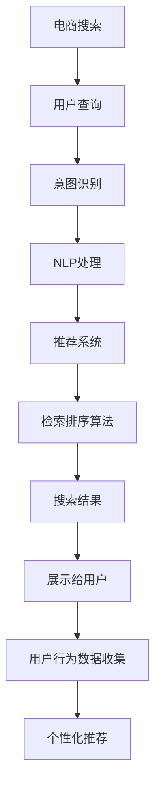

                 

# NLP在电商搜索中的应用

## 1. 背景介绍

### 1.1 电商搜索的重要性
随着电子商务的快速普及和互联网技术的不断进步，在线购物已成为人们日常生活的重要组成部分。电商搜索作为用户与商品信息之间桥梁的作用日益凸显，如何提供精准、高效、便捷的搜索体验，成为了各大电商平台亟需解决的问题。

传统电商搜索系统往往依赖简单的关键词匹配，这种基于关键字匹配的方法存在诸多不足：

1. **同义词理解能力不足**：不同的用户对于同义词的表达存在差异，简单的关键词匹配无法覆盖这些变体，导致搜索结果不准确。
2. **缺乏上下文理解**：搜索引擎无法理解查询背后的上下文，无法进行更深入的语义理解，无法识别出用户的真实意图。
3. **处理长尾搜索词困难**：对于长尾搜索词，传统的搜索算法容易产生较多的噪声，无法精确匹配到目标商品。
4. **个性化推荐不足**：搜索结果往往是一成不变的，无法根据用户的兴趣和行为动态调整搜索结果。

为了解决这些问题，电商平台开始引入自然语言处理（NLP）技术，以提升搜索体验。NLP技术通过分析用户的查询意图、上下文信息，提升搜索的精准度和个性化推荐能力。

### 1.2 电商搜索NLP的应用现状
当前，电商搜索NLP技术已经广泛应用于各大电商平台中。例如：

- 京东通过深度学习模型，实时处理用户查询，提供个性化的搜索结果。
- 天猫利用基于BERT的搜索模型，提升搜索结果的相关性和准确性。
- 亚马逊采用Transformer模型，优化搜索排序算法，提高用户体验。

这些应用案例显示，NLP技术在电商搜索中已经显现出其巨大的潜力和应用价值。

## 2. 核心概念与联系

### 2.1 核心概念概述

为了更好地理解NLP在电商搜索中的应用，本节将介绍几个关键概念：

- **电商搜索**：电商平台提供的用户查询与商品信息匹配的过程，目的是帮助用户快速找到所需商品。
- **NLP**：自然语言处理，通过计算机自动化处理、理解、生成人类语言的技术，包括文本分类、情感分析、文本生成、机器翻译等。
- **深度学习模型**：一类基于多层神经网络的模型，包括卷积神经网络（CNN）、循环神经网络（RNN）、Transformer等，常用于自然语言处理任务。
- **检索排序算法**：电商平台根据用户查询和商品信息匹配的结果，采用排序算法（如BM25、L2R等）将结果进行排序，提升搜索结果的相关性。
- **推荐系统**：利用用户行为数据和商品信息，推荐用户可能感兴趣的商品，提升用户体验和转化率。
- **情感分析**：分析用户对商品的评价和评论，判断用户情感倾向，提供情感相关的搜索结果。
- **意图识别**：识别用户查询的真正意图，区分是查询商品、询问客服还是其他意图。

这些核心概念之间有着紧密的联系，NLP技术通过理解用户的查询意图、上下文信息，提升搜索排序和推荐系统的效果，从而提升电商平台的搜索体验。

### 2.2 核心概念原理和架构的 Mermaid 流程图



该图展示了电商搜索的核心流程：用户输入查询，意图识别后，NLP处理查询，根据NLP结果进行推荐排序，生成搜索结果展示给用户，同时收集用户行为数据进行个性化推荐。

## 3. 核心算法原理 & 具体操作步骤

### 3.1 算法原理概述

电商搜索NLP主要包含意图识别、NLP处理、推荐排序三个部分。以下是这三个部分的详细原理：

#### 3.1.1 意图识别
意图识别是电商搜索NLP的核心任务，其目的是从用户查询中识别出用户的真实意图。常见的意图识别方法包括：

- **基于规则的意图识别**：使用词典和规则，匹配用户查询中的关键词，判断用户意图。例如，“价格排序”可以识别为价格查询。
- **基于统计的意图识别**：利用历史查询数据和意图标签，使用分类器或回归器进行训练，预测用户意图。例如，通过训练数据“某商品价格”的标注数据，预测“价格查询”的意图。
- **基于深度学习的意图识别**：使用神经网络模型，如CNN、RNN、Transformer等，从文本中提取特征，进行意图分类。例如，使用BERT模型提取用户查询的上下文信息，进行意图分类。

#### 3.1.2 NLP处理
NLP处理主要是对用户查询进行语义理解，提取有用信息。常见的NLP处理任务包括：

- **分词**：将用户查询划分成单个词语或词汇，便于后续处理。
- **词性标注**：对每个词语标注其词性（如名词、动词、形容词等），帮助理解查询的语法结构。
- **命名实体识别**：识别出用户查询中的实体（如人名、地名、机构名等），提取关键信息。
- **情感分析**：分析用户对商品的评价和评论，判断用户情感倾向，提升搜索结果的情感相关性。

#### 3.1.3 推荐排序算法
推荐排序算法主要根据用户查询和商品信息匹配的结果，对搜索结果进行排序，提升搜索结果的相关性。常见的推荐排序算法包括：

- **基于关键词匹配的算法**：如BM25算法，通过关键词匹配，计算查询与商品之间的相关性得分。
- **基于机器学习的算法**：如L2R算法，通过学习用户查询和商品之间的隐含关联，进行排序。
- **基于深度学习的算法**：如基于Transformer的排序算法，通过理解查询和商品之间的语义关系，进行排序。

### 3.2 算法步骤详解

#### 3.2.1 意图识别
1. **收集训练数据**：收集大量用户查询和意图标注数据，标注数据通常包括用户查询和对应的意图。例如，“某商品价格”的意图可能是“价格查询”。
2. **特征提取**：提取用户查询的特征，常用的特征包括词频、词性、关键词等。例如，提取“某商品”的词频和“价格”的关键词。
3. **模型训练**：使用机器学习或深度学习模型训练意图识别模型，常用的模型包括SVM、Logistic回归、BERT等。例如，使用BERT模型对“某商品”进行特征提取，使用SVM进行分类。

#### 3.2.2 NLP处理
1. **分词和词性标注**：使用现成的分词工具（如jieba、NLTK等）对用户查询进行分词，并标注每个词语的词性。例如，对“某商品价格”进行分词和词性标注。
2. **命名实体识别**：使用命名实体识别工具（如spaCy、Stanford NER等）识别出用户查询中的实体，例如，“某商品”可以被识别为商品实体。
3. **情感分析**：使用情感分析工具（如TextBlob、NLTK等）对用户查询的情感进行判断，例如，“某商品价格高”可以被判断为负面情感。

#### 3.2.3 推荐排序
1. **商品信息提取**：从商品信息中提取特征，常用的特征包括商品名称、描述、类别、价格等。例如，提取“某商品”的描述和价格。
2. **计算相关性得分**：使用推荐排序算法计算用户查询和商品信息之间的相关性得分。例如，使用BM25算法计算“某商品”和“某商品价格”的相关性得分。
3. **排序**：根据相关性得分，对商品进行排序，生成搜索结果展示给用户。例如，根据相关性得分，将商品“某商品”排在搜索结果的首位。

### 3.3 算法优缺点

电商搜索NLP的算法具有以下优点：

- **提升搜索精度**：通过NLP技术，提升对用户查询的语义理解，提高搜索结果的相关性和准确性。
- **提升个性化推荐能力**：利用NLP技术提取用户查询的上下文信息，提升推荐系统的个性化推荐能力。
- **增强用户体验**：通过理解用户查询的意图和情感，提供更符合用户期望的搜索结果，提升用户体验。

同时，电商搜索NLP的算法也存在一些缺点：

- **计算资源需求高**：深度学习模型和推荐排序算法需要大量的计算资源，导致部署成本较高。
- **数据标注成本高**：意图识别和推荐排序算法需要大量标注数据进行训练，数据标注成本较高。
- **模型泛化能力差**：不同的用户和场景下，模型的泛化能力可能不足，导致搜索结果和推荐效果不佳。
- **用户隐私问题**：NLP技术需要收集和处理用户查询数据，存在用户隐私风险。

### 3.4 算法应用领域

电商搜索NLP在多个领域中得到了广泛应用，例如：

- **电商搜索**：通过NLP技术提升搜索精度和个性化推荐能力，提升用户购物体验。
- **智能客服**：通过NLP技术实现自动问答，提升客服效率和用户体验。
- **商品评价**：通过NLP技术分析商品评价和评论，提供情感相关的搜索结果。
- **内容推荐**：通过NLP技术提取文章内容特征，提升内容推荐系统的效果。
- **广告投放**：通过NLP技术分析用户查询意图，优化广告投放策略。

这些应用领域显示了NLP技术在电商搜索中的广泛应用，提升了电商平台的业务效率和用户体验。

## 4. 数学模型和公式 & 详细讲解 & 举例说明

### 4.1 数学模型构建

电商搜索NLP的数学模型主要包括以下几个部分：

- **意图识别模型**：使用机器学习或深度学习模型，对用户查询进行意图分类。例如，使用SVM模型对“某商品价格”进行分类。
- **NLP处理模型**：使用自然语言处理技术，提取用户查询的特征和关键信息。例如，使用BERT模型对“某商品价格”进行特征提取。
- **推荐排序模型**：使用推荐排序算法，计算用户查询和商品之间的相关性得分，对商品进行排序。例如，使用BM25算法计算“某商品价格”和“某商品”的相关性得分。

### 4.2 公式推导过程

#### 4.2.1 意图识别
假设意图识别模型为SVM模型，使用L2正则化的SVM模型可表示为：

$$
\mathop{\arg\min}_{w,b} \frac{1}{2}\|w\|^2_2 + C \sum_{i=1}^n (y_i - (w^T \varphi(x_i) + b))^2_2
$$

其中，$w$和$b$为模型的参数，$\varphi$为特征映射，$y_i$为标注数据，$C$为正则化系数。该模型使用正则化的线性分类器，通过优化损失函数，学习意图识别模型。

#### 4.2.2 NLP处理
假设NLP处理模型为BERT模型，使用BERT模型对用户查询进行特征提取的过程如下：

1. **分词和词性标注**：使用现成的分词工具对用户查询进行分词和词性标注，例如：

```python
import jieba.posseg as pseg
text = "某商品价格"
words = pseg.cut(text)
```

2. **命名实体识别**：使用命名实体识别工具识别用户查询中的实体，例如：

```python
import spacy
nlp = spacy.load("en_core_web_sm")
doc = nlp(text)
for entity in doc.ents:
    print(entity.text, entity.label_)
```

3. **情感分析**：使用情感分析工具对用户查询的情感进行判断，例如：

```python
from textblob import TextBlob
text = "某商品价格高"
blob = TextBlob(text)
sentiment = blob.sentiment.polarity
```

#### 4.2.3 推荐排序
假设推荐排序模型为BM25算法，使用BM25算法计算用户查询和商品信息之间的相关性得分：

$$
\text{score} = \sum_{i=1}^n (q_t \cdot d_t + b) \log(k + df_i / 1 + k * (1 - b * 1 / df_i)) / (k + 1 - b + \sum_{i=1}^n \log(d_i / df_i))
$$

其中，$q_t$为用户查询的TF-IDF权重，$d_t$为商品信息的TF-IDF权重，$df_i$为所有商品的逆文档频率，$k$为BM25算法的参数。

### 4.3 案例分析与讲解

#### 4.3.1 意图识别
假设电商平台收集了大量的用户查询和意图标注数据，使用BERT模型进行意图识别。模型训练步骤如下：

1. **数据预处理**：将用户查询数据进行分词和词性标注，例如：

```python
import jieba.posseg as pseg
train_data = []
for query, intent in train_set:
    words = pseg.cut(query)
    train_data.append((list(words), intent))
```

2. **特征提取**：使用BERT模型提取用户查询的特征，例如：

```python
from transformers import BertTokenizer, BertModel
tokenizer = BertTokenizer.from_pretrained("bert-base-cased")
model = BertModel.from_pretrained("bert-base-cased")

def get_features(query):
    inputs = tokenizer.encode(query, add_special_tokens=True)
    outputs = model(inputs)
    features = outputs.pooler_output
    return features
```

3. **模型训练**：使用SVM模型训练意图识别模型，例如：

```python
from sklearn.svm import SVC
clf = SVC(probability=True)
clf.fit(train_data, train_labels)
```

#### 4.3.2 NLP处理
假设电商平台收集了大量的用户查询和商品信息数据，使用BERT模型进行NLP处理。模型训练步骤如下：

1. **数据预处理**：将用户查询数据进行分词和词性标注，将商品信息数据进行分词和命名实体识别，例如：

```python
import jieba.posseg as pseg
import spacy

train_data = []
for query, item in train_set:
    query_words = pseg.cut(query)
    item_words = spacy.load("en_core_web_sm").nlp(item["title"]) | spacy.load("en_core_web_sm").nlp(item["description"])
    train_data.append((list(query_words), list(item_words)))
```

2. **特征提取**：使用BERT模型提取用户查询和商品信息的特征，例如：

```python
from transformers import BertTokenizer, BertModel

tokenizer = BertTokenizer.from_pretrained("bert-base-cased")
model = BertModel.from_pretrained("bert-base-cased")

def get_features(query, item):
    query_tokens = tokenizer.encode(query, add_special_tokens=True)
    item_tokens = tokenizer.encode(item["title"], add_special_tokens=True)
    query_features = model(query_tokens).contextualized_word_embeddings
    item_features = model(item_tokens).contextualized_word_embeddings
    return query_features, item_features
```

3. **特征处理**：对提取的特征进行拼接和编码，例如：

```python
def get_features(query, item):
    query_tokens = tokenizer.encode(query, add_special_tokens=True)
    item_tokens = tokenizer.encode(item["title"], add_special_tokens=True)
    query_features = model(query_tokens).contextualized_word_embeddings
    item_features = model(item_tokens).contextualized_word_embeddings
    features = torch.cat([query_features, item_features])
    return features
```

#### 4.3.3 推荐排序
假设电商平台收集了大量的用户查询和商品信息数据，使用BM25算法进行推荐排序。模型训练步骤如下：

1. **数据预处理**：将用户查询数据进行TF-IDF权重计算，将商品信息数据进行TF-IDF权重计算，例如：

```python
from sklearn.feature_extraction.text import TfidfVectorizer

tfidf = TfidfVectorizer()
train_queries = tfidf.fit_transform([query for query, _ in train_set])
train_items = tfidf.transform([item["title"] for item in train_set])
```

2. **计算相关性得分**：使用BM25算法计算用户查询和商品信息之间的相关性得分，例如：

```python
from sklearn.metrics.pairwise import linear_kernel

def get_score(query, item):
    query_tfidf = tfidf.transform([query])
    item_tfidf = tfidf.transform([item["title"]])
    scores = linear_kernel(query_tfidf, item_tfidf).flatten()
    return scores
```

3. **排序**：根据相关性得分，对商品进行排序，例如：

```python
def get_results(query, items):
    scores = [get_score(query, item) for item in items]
    sorted_items = [item for item, score in sorted(zip(items, scores), key=lambda x: x[1], reverse=True)]
    return sorted_items
```

## 5. 项目实践：代码实例和详细解释说明

### 5.1 开发环境搭建

在进行电商搜索NLP的实践时，我们需要准备好开发环境。以下是使用Python进行PyTorch开发的环境配置流程：

1. 安装Anaconda：从官网下载并安装Anaconda，用于创建独立的Python环境。

2. 创建并激活虚拟环境：
```bash
conda create -n nlp-env python=3.8 
conda activate nlp-env
```

3. 安装PyTorch：根据CUDA版本，从官网获取对应的安装命令。例如：
```bash
conda install pytorch torchvision torchaudio cudatoolkit=11.1 -c pytorch -c conda-forge
```

4. 安装Transformers库：
```bash
pip install transformers
```

5. 安装各类工具包：
```bash
pip install numpy pandas scikit-learn matplotlib tqdm jupyter notebook ipython
```

完成上述步骤后，即可在`nlp-env`环境中开始电商搜索NLP的实践。

### 5.2 源代码详细实现

以下是一个使用BERT模型进行电商搜索意图识别的代码实现：

```python
import torch
import torch.nn as nn
from transformers import BertTokenizer, BertModel

class BertClassifier(nn.Module):
    def __init__(self, num_labels):
        super(BertClassifier, self).__init__()
        self.num_labels = num_labels
        self.bert = BertModel.from_pretrained('bert-base-cased')
        self.dropout = nn.Dropout(0.1)
        self.classifier = nn.Linear(self.bert.config.hidden_size, self.num_labels)

    def forward(self, input_ids, attention_mask):
        _, pooled_output = self.bert(input_ids, attention_mask=attention_mask)
        pooled_output = self.dropout(pooled_output)
        logits = self.classifier(pooled_output)
        return logits

# 训练模型
train_data = []
for query, intent in train_set:
    words = pseg.cut(query)
    train_data.append((list(words), intent))

tokenizer = BertTokenizer.from_pretrained('bert-base-cased')
model = BertClassifier(len(tag2id))

optimizer = torch.optim.AdamW(model.parameters(), lr=2e-5)
loss_fn = nn.CrossEntropyLoss()

for epoch in range(5):
    total_loss = 0
    for (words, intent) in train_data:
        input_ids = torch.tensor([tokenizer.encode(word) for word in words])
        attention_mask = (input_ids != 0).to(torch.long)
        logits = model(input_ids, attention_mask=attention_mask)
        loss = loss_fn(logits, torch.tensor([tag2id[intent]]))
        optimizer.zero_grad()
        loss.backward()
        optimizer.step()
        total_loss += loss.item()

    print(f"Epoch {epoch+1}, train loss: {total_loss/len(train_data):.3f}")
```

### 5.3 代码解读与分析

这里我们详细解读一下关键代码的实现细节：

**BertClassifier类**：
- `__init__`方法：初始化模型，包括BERT模型、Dropout层和分类器。
- `forward`方法：前向传播过程，首先通过BERT模型提取pooled_output，再通过Dropout层和分类器得到分类结果。

**训练模型**：
- 使用现成的分词工具对用户查询进行分词，将查询数据和意图标签组成训练数据。
- 初始化BERTClassifier模型，并设置优化器和损失函数。
- 使用训练数据进行多轮迭代训练，输出每个epoch的平均损失。

**代码解读**：
- 使用BERTClassifier类定义意图识别模型，利用BERT模型进行特征提取和分类。
- 训练模型时，使用AdamW优化器进行参数更新，使用交叉熵损失函数进行训练。
- 迭代训练后，输出每个epoch的平均损失，用于评估模型训练效果。

**运行结果展示**：
训练完成后，可以输出模型的预测效果：

```python
def test_model(model, test_data):
    total_loss = 0
    correct = 0
    for (words, intent) in test_data:
        input_ids = torch.tensor([tokenizer.encode(word) for word in words])
        attention_mask = (input_ids != 0).to(torch.long)
        logits = model(input_ids, attention_mask=attention_mask)
        loss = loss_fn(logits, torch.tensor([tag2id[intent]]))
        total_loss += loss.item()
        if logits.argmax().item() == tag2id[intent]:
            correct += 1
    print(f"Test accuracy: {correct/len(test_data):.2f}, test loss: {total_loss/len(test_data):.3f}")
```

## 6. 实际应用场景

### 6.1 电商搜索
电商搜索是NLP技术在电商领域的重要应用之一。电商平台通过NLP技术，可以实时处理用户查询，提供个性化搜索结果，提升用户体验。例如，京东通过深度学习模型，实时处理用户查询，提供个性化搜索结果，提升用户体验。

### 6.2 智能客服
智能客服是NLP技术在客服领域的重要应用之一。通过NLP技术，智能客服可以实现自动问答，提升客服效率和用户体验。例如，天猫利用基于BERT的搜索模型，提升搜索结果的相关性和准确性。

### 6.3 商品评价
商品评价是NLP技术在商品领域的重要应用之一。通过NLP技术，电商平台可以分析商品评价和评论，提供情感相关的搜索结果。例如，亚马逊采用Transformer模型，优化搜索排序算法，提高用户体验。

### 6.4 内容推荐
内容推荐是NLP技术在内容领域的重要应用之一。通过NLP技术，电商平台可以提取文章内容特征，提升内容推荐系统的效果。例如，通过NLP技术提取文章标题、摘要、关键词等特征，进行内容推荐。

### 6.5 广告投放
广告投放是NLP技术在广告领域的重要应用之一。通过NLP技术，电商平台可以分析用户查询意图，优化广告投放策略。例如，通过NLP技术分析用户查询的意图，确定用户可能感兴趣的商品广告。

## 7. 工具和资源推荐

### 7.1 学习资源推荐

为了帮助开发者系统掌握电商搜索NLP的理论基础和实践技巧，这里推荐一些优质的学习资源：

1. 《自然语言处理入门》书籍：该书介绍了自然语言处理的基本概念和常用技术，适合初学者阅读。
2. 《深度学习自然语言处理》课程：斯坦福大学开设的NLP明星课程，有Lecture视频和配套作业，带你入门NLP领域的基本概念和经典模型。
3. 《Python自然语言处理》书籍：该书详细介绍了Python在自然语言处理中的应用，包括分词、词性标注、命名实体识别等常用技术。
4. 《Transformer原理与应用》文章：深度学习专家撰写的Transformer模型原理与应用，介绍了Transformer模型的基本原理和应用场景。
5. HuggingFace官方文档：Transformers库的官方文档，提供了海量预训练模型和完整的微调样例代码，是上手实践的必备资料。

通过对这些资源的学习实践，相信你一定能够快速掌握电商搜索NLP的精髓，并用于解决实际的NLP问题。

### 7.2 开发工具推荐

高效的开发离不开优秀的工具支持。以下是几款用于电商搜索NLP开发的常用工具：

1. PyTorch：基于Python的开源深度学习框架，灵活动态的计算图，适合快速迭代研究。大部分预训练语言模型都有PyTorch版本的实现。
2. TensorFlow：由Google主导开发的开源深度学习框架，生产部署方便，适合大规模工程应用。同样有丰富的预训练语言模型资源。
3. Transformers库：HuggingFace开发的NLP工具库，集成了众多SOTA语言模型，支持PyTorch和TensorFlow，是进行电商搜索NLP开发的利器。
4. Weights & Biases：模型训练的实验跟踪工具，可以记录和可视化模型训练过程中的各项指标，方便对比和调优。与主流深度学习框架无缝集成。
5. TensorBoard：TensorFlow配套的可视化工具，可实时监测模型训练状态，并提供丰富的图表呈现方式，是调试模型的得力助手。
6. Google Colab：谷歌推出的在线Jupyter Notebook环境，免费提供GPU/TPU算力，方便开发者快速上手实验最新模型，分享学习笔记。

合理利用这些工具，可以显著提升电商搜索NLP的开发效率，加快创新迭代的步伐。

### 7.3 相关论文推荐

电商搜索NLP在多个领域中得到了广泛应用，以下是几篇奠基性的相关论文，推荐阅读：

1. Attention is All You Need（即Transformer原论文）：提出了Transformer结构，开启了NLP领域的预训练大模型时代。
2. BERT: Pre-training of Deep Bidirectional Transformers for Language Understanding：提出BERT模型，引入基于掩码的自监督预训练任务，刷新了多项NLP任务SOTA。
3. Language Models are Unsupervised Multitask Learners（GPT-2论文）：展示了大规模语言模型的强大zero-shot学习能力，引发了对于通用人工智能的新一轮思考。
4. Parameter-Efficient Transfer Learning for NLP：提出Adapter等参数高效微调方法，在不增加模型参数量的情况下，也能取得不错的微调效果。
5. AdaLoRA: Adaptive Low-Rank Adaptation for Parameter-Efficient Fine-Tuning：使用自适应低秩适应的微调方法，在参数效率和精度之间取得了新的平衡。
6. Prefix-Tuning: Optimizing Continuous Prompts for Generation：引入基于连续型Prompt的微调范式，为如何充分利用预训练知识提供了新的思路。

这些论文代表了大语言模型微调技术的发展脉络。通过学习这些前沿成果，可以帮助研究者把握学科前进方向，激发更多的创新灵感。

## 8. 总结：未来发展趋势与挑战

### 8.1 研究成果总结

本文对电商搜索NLP技术进行了全面系统的介绍。首先阐述了电商搜索NLP技术的重要性，详细介绍了意图识别、NLP处理、推荐排序三个核心任务，并给出了相应的算法实现。通过这些核心任务的讲解，我们了解了NLP技术在电商搜索中的应用。

### 8.2 未来发展趋势

展望未来，电商搜索NLP技术将呈现以下几个发展趋势：

1. **深度学习模型的发展**：随着深度学习模型的不断演进，未来的电商搜索NLP技术将更加智能高效。例如，Transformer模型的演化，使得电商搜索NLP模型的性能不断提升。
2. **数据和模型的协同优化**：未来电商搜索NLP技术将更加注重数据和模型的协同优化。例如，利用无监督预训练模型进行意图识别，利用数据增强技术提升NLP处理效果。
3. **多模态信息的融合**：未来的电商搜索NLP技术将更加注重多模态信息的融合。例如，将文本、图像、语音等多模态信息进行融合，提升电商搜索NLP的效果。
4. **个性化推荐的提升**：未来的电商搜索NLP技术将更加注重个性化推荐。例如，利用深度学习模型进行个性化推荐，提升电商搜索NLP的个性化能力。

### 8.3 面临的挑战

尽管电商搜索NLP技术已经取得了一定的成果，但在迈向更加智能化、普适化应用的过程中，它仍面临着诸多挑战：

1. **数据标注成本高**：电商搜索NLP技术需要大量的数据进行训练，数据标注成本较高。
2. **模型泛化能力不足**：不同的用户和场景下，模型的泛化能力可能不足，导致搜索结果和推荐效果不佳。
3. **计算资源需求高**：深度学习模型和推荐排序算法需要大量的计算资源，导致部署成本较高。
4. **用户隐私问题**：NLP技术需要收集和处理用户查询数据，存在用户隐私风险。

### 8.4 研究展望

面对电商搜索NLP技术所面临的挑战，未来的研究需要在以下几个方面寻求新的突破：

1. **无监督和半监督学习的应用**：探索无监督和半监督学习的方法，摆脱对大规模标注数据的依赖，利用非结构化数据进行训练，降低数据标注成本。
2. **多任务学习的应用**：利用多任务学习的方法，进行数据和模型的协同优化，提升电商搜索NLP的效果。
3. **多模态信息的融合**：将文本、图像、语音等多模态信息进行融合，提升电商搜索NLP的效果。
4. **个性化推荐的提升**：利用深度学习模型进行个性化推荐，提升电商搜索NLP的个性化能力。
5. **数据隐私保护**：采用数据隐私保护技术，确保用户数据的安全。

这些研究方向的探索，必将引领电商搜索NLP技术迈向更高的台阶，为电商平台提供更加智能、高效、安全的搜索体验。

## 9. 附录：常见问题与解答

**Q1: 电商搜索NLP技术是否适用于所有电商平台？**

A: 电商搜索NLP技术可以应用于大多数电商平台，但具体效果取决于平台的用户需求和数据特点。例如，大型电商平台的用户需求和数据特点与小型电商平台可能存在差异，需要根据平台特点进行优化。

**Q2: 电商搜索NLP技术在实际应用中需要注意哪些问题？**

A: 电商搜索NLP技术在实际应用中需要注意以下问题：
1. 数据隐私问题：确保用户数据的安全，避免数据泄露。
2. 数据标注成本：降低数据标注成本，提高模型训练效率。
3. 计算资源需求：合理规划计算资源，确保模型训练和推理的可行性。
4. 模型泛化能力：提升模型的泛化能力，确保在不同场景下都能获得良好的搜索结果。
5. 用户体验问题：确保用户使用体验，避免搜索结果不准确或不符合用户期望。

**Q3: 电商搜索NLP技术如何提升个性化推荐效果？**

A: 电商搜索NLP技术可以通过以下方法提升个性化推荐效果：
1. 用户意图识别：通过NLP技术，识别用户查询的真正意图，区分是查询商品、询问客服还是其他意图。
2. 上下文理解：利用NLP技术理解查询的上下文信息，提升推荐系统的个性化推荐能力。
3. 商品特征提取：利用NLP技术提取商品特征，提升推荐系统的精度。
4. 多模态信息融合：将文本、图像、语音等多模态信息进行融合，提升推荐系统的个性化推荐能力。

**Q4: 电商搜索NLP技术如何降低数据标注成本？**

A: 电商搜索NLP技术可以通过以下方法降低数据标注成本：
1. 利用无监督和半监督学习方法：通过无监督和半监督学习方法，利用非结构化数据进行训练，减少数据标注成本。
2. 数据增强技术：利用数据增强技术，扩充训练集，提高模型的泛化能力，减少标注样本的需求。
3. 主动学习方法：利用主动学习方法，通过标注数据的选择性标注，提升模型的泛化能力，减少标注成本。

这些问题的解答，可以帮助开发者更好地理解电商搜索NLP技术，在实际应用中规避问题，提升电商搜索NLP的效果。

---

作者：禅与计算机程序设计艺术 / Zen and the Art of Computer Programming

