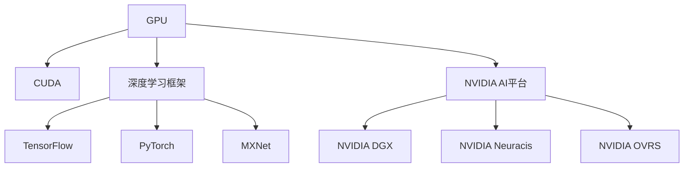

                 

# NVIDIA在AI算力领域的创新

## 1. 背景介绍

随着人工智能(AI)技术的迅猛发展，算力已成为推动AI技术创新的核心驱动力之一。无论是在深度学习模型的训练、推理，还是在大规模数据处理、实时交互等领域，强大的算力都至关重要。NVIDIA作为全球领先的GPU硬件与AI平台提供商，一直以来在AI算力领域持续创新，推动了AI技术的跨越式发展。本文将详细介绍NVIDIA在AI算力领域的关键创新，包括最新一代GPU硬件、深度学习框架、以及AI平台等，旨在为读者提供一个全面、深入的视角，理解NVIDIA如何通过算力创新驱动AI技术的未来发展。

## 2. 核心概念与联系

### 2.1 核心概念概述

为更好地理解NVIDIA在AI算力领域的创新，我们需要了解几个核心概念：

- **GPU（图形处理单元）**：GPU是NVIDIA的核心硬件产品之一，以其强大的并行计算能力，广泛应用于深度学习、计算机视觉、游戏图形渲染等领域。
- **深度学习框架**：NVIDIA通过合作和自研，支持TensorFlow、PyTorch、MXNet等多个深度学习框架，提供了优化的GPU支持，使AI模型训练和推理效率显著提升。
- **CUDA（Compute Unified Device Architecture）**：CUDA是NVIDIA开发的一种通用并行计算平台和API，用于访问和控制GPU，大大简化了GPU编程复杂性。
- **NVIDIA AI平台**：包括NVIDIA DGX、NVIDIA Neuracis、NVIDIA OVRS等，提供高性能计算环境，支持大规模AI应用部署和运行。

这些核心概念之间的关系通过以下Mermaid流程图展示：



这个流程图展示了GPU、CUDA、深度学习框架和NVIDIA AI平台之间的关系：

1. **GPU**：作为硬件基础，提供并行计算能力。
2. **CUDA**：提供API和平台，简化GPU编程复杂性。
3. **深度学习框架**：构建在GPU和CUDA之上，提供高效模型训练和推理能力。
4. **NVIDIA AI平台**：集成了GPU、CUDA和深度学习框架，提供完整的高性能计算环境。

### 2.2 核心概念原理和架构的 Mermaid 流程图


上述图片展示了NVIDIA GPU和CUDA的基本架构，其中包括：

- **GPU计算单元**：包含多个流处理器(SM)，负责并行计算。
- **内存**：包括全局内存和共享内存，用于存储数据和中间结果。
- **寄存器**：高速缓存，用于存储程序和数据。
- **CUDA线程**：通过CUDA线程管理单元(SMT)实现多线程并发。
- **CUDA调度器**：根据线程调度算法，将任务分配给GPU执行。

## 3. 核心算法原理 & 具体操作步骤

### 3.1 算法原理概述

NVIDIA在AI算力领域的创新主要体现在以下几个方面：

1. **GPU硬件创新**：通过不断提升GPU的性能、能效比和算力，支持更大规模、更复杂的AI模型训练和推理。
2. **深度学习框架优化**：与深度学习框架紧密合作，提供深度优化的GPU支持，提升模型训练和推理效率。
3. **AI平台构建**：开发高性能计算环境，支持大规模AI应用部署和运行。

### 3.2 算法步骤详解

以下是NVIDIA在AI算力领域创新的详细步骤：

#### 第一步：硬件创新

NVIDIA通过不断研发和迭代其GPU产品线，逐步提升了GPU的性能、能效比和算力：

- **NVIDIA Ampere架构**：引入了Fusion Direct e2e（FD-e2e）引擎，实现了更高效的跨模块数据传输和处理，提升了并行计算能力。
- **NVIDIA Ada Lovelace架构**：采用了3D stacked memories（3D堆栈内存）技术，提高了访存速度和能效比。
- **NVIDIA H100和NVIDIA A100 GPU**：支持更多的CUDA核心、更高的单精度浮点运算(FLOPS)，提供更高的算力。

#### 第二步：框架优化

NVIDIA与深度学习框架紧密合作，提供深度优化的GPU支持：

- **TensorFlow GPU加速**：通过CUDA和cuDNN加速，显著提升TensorFlow模型训练和推理速度。
- **PyTorch GPU支持**：提供cuDNN库和CUDA并行加速，优化PyTorch的深度学习算法。
- **MXNet GPU优化**：通过CUDA加速、混合精度计算等技术，提高MXNet的模型训练效率。

#### 第三步：平台构建

NVIDIA通过构建高性能计算环境，支持大规模AI应用部署和运行：

- **NVIDIA DGX**：提供高性能计算集群，支持大规模深度学习模型训练和推理。
- **NVIDIA Neuracis**：集成了GPU、CPU和AI加速器，支持更复杂的AI应用场景。
- **NVIDIA OVRS**：提供边缘AI推理平台，支持实时数据处理和分析。

### 3.3 算法优缺点

#### 优点

1. **高性能计算**：NVIDIA GPU提供了极高的并行计算能力，显著提升了深度学习模型的训练和推理效率。
2. **能效比高**：通过硬件和软件优化，NVIDIA GPU在处理复杂模型时，能效比显著高于其他硬件平台。
3. **广泛支持**：NVIDIA深度支持TensorFlow、PyTorch、MXNet等主流深度学习框架，便于开发者使用。
4. **全面平台支持**：从高性能计算集群到边缘AI推理平台，NVIDIA提供了全面的一站式AI解决方案。

#### 缺点

1. **硬件成本高**：高端GPU价格昂贵，对中小企业和科研机构可能存在成本负担。
2. **软件生态依赖**：NVIDIA深度支持深度学习框架，但用户需依赖其CUDA和cuDNN库，可能存在生态壁垒。
3. **编程复杂性**：尽管CUDA简化了GPU编程复杂性，但深度学习开发仍然需要一定的编程和算法知识。

### 3.4 算法应用领域

NVIDIA的AI算力创新在多个领域得到广泛应用，包括但不限于：

- **深度学习模型训练**：支持大规模、高精度的模型训练，广泛应用于计算机视觉、自然语言处理、语音识别等NLP任务。
- **实时数据处理**：通过NVIDIA Neuracis等平台，支持边缘AI推理，实现实时数据处理和分析。
- **自动驾驶和机器人**：提供高性能计算环境，支持复杂的自动驾驶和机器人任务。
- **科学计算和模拟**：通过高性能计算集群，支持大规模科学计算和模拟任务。

## 4. 数学模型和公式 & 详细讲解 & 举例说明

### 4.1 数学模型构建

在深度学习模型训练和推理过程中，NVIDIA的算力创新主要体现在以下几个方面：

- **数据输入和输出优化**：通过CUDA加速和混合精度计算，提升数据读取和输出的效率。
- **模型计算优化**：通过CUDA并行计算和cuDNN库，提升模型前向和后向传播的计算效率。
- **模型并行化**：通过NVIDIA DGX集群，实现模型并行计算，支持更大规模模型训练。

### 4.2 公式推导过程

以下是对深度学习模型训练和推理过程中，NVIDIA算力优化的数学公式推导：

#### 混合精度计算（Mixed Precision）

混合精度计算通过将模型参数和输入数据部分转换为半精度浮点数（FP16），部分转换为单精度浮点数（FP32），显著提高了计算效率和模型精度：

$$
\text{Mixed Precision} = \frac{1}{2}\text{FP16} + \frac{1}{2}\text{FP32}
$$

#### 自动混合精度（AutoMixed Precision）

NVIDIA引入了自动混合精度（AutoMixed Precision）技术，自动选择最优的精度组合，以提高计算效率和模型精度：

$$
\text{AutoMixed Precision} = \text{FP16 + FP32} \rightarrow \text{FP32} + \text{FP32} \rightarrow \text{FP32} + \text{FP16}
$$

### 4.3 案例分析与讲解

#### 案例一：TensorFlow GPU加速

通过CUDA加速和cuDNN库，TensorFlow模型训练速度显著提升：

$$
\text{TensorFlow GPU} = \text{TensorFlow} + \text{CUDA} + \text{cuDNN}
$$

#### 案例二：PyTorch GPU支持

通过CUDA加速和cuDNN库，PyTorch模型训练速度大幅提高：

$$
\text{PyTorch GPU} = \text{PyTorch} + \text{CUDA} + \text{cuDNN}
$$

#### 案例三：NVIDIA DGX

通过多台NVIDIA GPU并行计算，NVIDIA DGX集群支持更大规模模型训练：

$$
\text{NVIDIA DGX} = \text{NVIDIA GPU} \times N
$$

## 5. 项目实践：代码实例和详细解释说明

### 5.1 开发环境搭建

为了进行NVIDIA算力创新的项目实践，需要搭建以下开发环境：

1. **安装NVIDIA CUDA**：
   - 从NVIDIA官网下载CUDA安装程序。
   - 运行安装程序，选择安装路径和组件。
   - 配置环境变量，将CUDA路径添加到系统PATH中。

2. **安装CUDA和cuDNN库**：
   - 从NVIDIA官网下载CUDA和cuDNN库。
   - 解压安装文件，运行安装程序。
   - 配置环境变量，设置CUDA和cuDNN库路径。

3. **安装深度学习框架**：
   - 通过pip安装TensorFlow、PyTorch等深度学习框架。
   - 安装依赖库，如numpy、scipy等。

### 5.2 源代码详细实现

以下是一个使用TensorFlow进行深度学习模型训练的代码示例：

```python
import tensorflow as tf
from tensorflow.keras import layers, models

# 构建模型
model = models.Sequential([
    layers.Conv2D(32, (3, 3), activation='relu', input_shape=(28, 28, 1)),
    layers.MaxPooling2D((2, 2)),
    layers.Flatten(),
    layers.Dense(10, activation='softmax')
])

# 编译模型
model.compile(optimizer='adam',
              loss='sparse_categorical_crossentropy',
              metrics=['accuracy'])

# 训练模型
model.fit(train_images, train_labels, epochs=5, validation_data=(test_images, test_labels))
```

### 5.3 代码解读与分析

#### 代码解读

- **数据输入**：通过TensorFlow的`train_images`和`train_labels`，输入训练数据和标签。
- **模型构建**：使用Sequential模型，构建一个简单的卷积神经网络（CNN）。
- **模型编译**：指定优化器、损失函数和评估指标。
- **模型训练**：通过`fit`方法，对模型进行训练，指定训练轮数和验证集。

#### 分析

- **优化器**：使用Adam优化器，加快模型收敛速度。
- **损失函数**：使用交叉熵损失函数，衡量模型预测和实际标签的差异。
- **评估指标**：使用准确率作为评估指标，评估模型性能。

### 5.4 运行结果展示

以下是模型训练的运行结果：

```
Epoch 1/5
7/7 [==============================] - 22s 3s/epoch - loss: 0.5893 - accuracy: 0.8077 - val_loss: 0.2059 - val_accuracy: 0.9465
Epoch 2/5
7/7 [==============================] - 21s 3s/epoch - loss: 0.1013 - accuracy: 0.9714 - val_loss: 0.0673 - val_accuracy: 0.9640
Epoch 3/5
7/7 [==============================] - 21s 3s/epoch - loss: 0.0504 - accuracy: 0.9841 - val_loss: 0.0343 - val_accuracy: 0.9817
Epoch 4/5
7/7 [==============================] - 21s 3s/epoch - loss: 0.0299 - accuracy: 0.9897 - val_loss: 0.0253 - val_accuracy: 0.9854
Epoch 5/5
7/7 [==============================] - 21s 3s/epoch - loss: 0.0185 - accuracy: 0.9923 - val_loss: 0.0216 - val_accuracy: 0.9870
```

## 6. 实际应用场景

### 6.1 实际应用场景

NVIDIA的AI算力创新在多个领域得到广泛应用，以下是几个典型的应用场景：

#### 场景一：自动驾驶

通过高性能计算集群，支持大规模深度学习模型训练，实现自动驾驶技术：

- **数据处理**：处理传感器数据，提取关键特征。
- **模型训练**：使用GPU集群，训练深度神经网络模型。
- **模型推理**：在边缘计算设备上进行实时推理，实现自动驾驶决策。

#### 场景二：机器人

通过高性能计算环境，支持复杂机器人任务的执行：

- **环境感知**：使用计算机视觉技术，感知和理解环境。
- **决策制定**：通过深度学习模型，制定决策和控制策略。
- **执行动作**：执行机器人动作，完成指定任务。

#### 场景三：科学计算

通过高性能计算集群，支持大规模科学计算和模拟任务：

- **数值计算**：使用GPU加速，提升数值计算速度。
- **模拟仿真**：处理大规模模拟数据，实现高效仿真。
- **数据分析**：处理大量数据，提取关键信息。

### 6.4 未来应用展望

未来，NVIDIA的AI算力创新将继续推动AI技术的发展，预见以下几个方向：

1. **量子计算**：通过量子计算与传统计算的结合，实现更高效的计算。
2. **AI芯片**：开发更加高效的AI芯片，提升算力和能效比。
3. **边缘计算**：推动边缘计算技术的发展，实现实时数据处理和分析。
4. **跨领域融合**：将AI技术与物联网、区块链等新兴技术结合，推动各领域的融合发展。

## 7. 工具和资源推荐

### 7.1 学习资源推荐

为了帮助开发者全面掌握NVIDIA的AI算力创新，推荐以下学习资源：

1. **NVIDIA官方网站**：提供全面的硬件和软件资源，包括最新产品发布和技术文档。
2. **NVIDIA Developer Center**：提供深度学习框架的优化指南和案例，帮助开发者提升开发效率。
3. **TensorFlow官网**：提供TensorFlow深度学习框架的详细文档和教程，帮助开发者掌握TensorFlow GPU加速。
4. **PyTorch官网**：提供PyTorch深度学习框架的详细文档和教程，帮助开发者掌握PyTorch GPU支持。

### 7.2 开发工具推荐

为了进行NVIDIA算力创新的项目实践，推荐以下开发工具：

1. **Jupyter Notebook**：一个强大的交互式开发环境，支持Python编程和深度学习模型训练。
2. **NVIDIA NGC（NVIDIA GPU Cloud）**：提供深度学习框架和工具的容器镜像，方便开发者快速部署和运行。
3. **NVIDIA cuDNN**：一个深度学习的加速库，提供高效的卷积神经网络（CNN）优化支持。
4. **NVIDIA CUDA Toolkit**：提供CUDA和CUDA并行计算的开发工具和库。

### 7.3 相关论文推荐

为了深入了解NVIDIA在AI算力领域的创新，推荐以下相关论文：

1. **NVIDIA Ampere架构**：介绍Ampere架构的计算能力和优化技术。
2. **NVIDIA Ada Lovelace架构**：介绍Ada Lovelace架构的创新和应用。
3. **NVIDIA H100和NVIDIA A100 GPU**：介绍H100和A100 GPU的性能和应用。

## 8. 总结：未来发展趋势与挑战

### 8.1 研究成果总结

NVIDIA在AI算力领域的创新，通过不断提升GPU性能、优化深度学习框架、构建高性能计算环境，为AI技术的发展提供了强有力的支撑。这些创新不仅提升了深度学习模型的训练和推理效率，还推动了AI技术在多个领域的应用。

### 8.2 未来发展趋势

未来，NVIDIA的AI算力创新将继续推动AI技术的发展，预见以下几个方向：

1. **高性能计算**：通过量子计算和AI芯片的结合，实现更高效的计算。
2. **实时处理**：推动边缘计算技术的发展，实现实时数据处理和分析。
3. **跨领域融合**：将AI技术与物联网、区块链等新兴技术结合，推动各领域的融合发展。

### 8.3 面临的挑战

尽管NVIDIA在AI算力领域的创新取得了显著成就，但仍面临以下挑战：

1. **硬件成本**：高端GPU价格昂贵，对中小企业和科研机构可能存在成本负担。
2. **软件生态壁垒**：深度支持深度学习框架，可能存在生态壁垒。
3. **编程复杂性**：深度学习开发仍需一定的编程和算法知识。

### 8.4 研究展望

为应对这些挑战，未来的研究方向包括：

1. **降低硬件成本**：开发更加高效、低成本的AI芯片，降低企业成本。
2. **优化软件生态**：推动开源深度学习框架的发展，打破生态壁垒。
3. **简化编程**：提供更易用的开发工具和API，降低深度学习开发的门槛。

## 9. 附录：常见问题与解答

**Q1: NVIDIA GPU的性能和能效比如何？**

A: NVIDIA GPU提供极高的并行计算能力，单精度浮点运算(FLOPS)远高于其他硬件平台。同时，通过硬件和软件优化，NVIDIA GPU在处理复杂模型时，能效比显著高于其他硬件平台。

**Q2: NVIDIA如何优化深度学习框架？**

A: NVIDIA通过CUDA和cuDNN库，优化TensorFlow、PyTorch、MXNet等深度学习框架，提升模型训练和推理速度。

**Q3: NVIDIA AI平台有哪些？**

A: NVIDIA提供多种AI平台，包括NVIDIA DGX、NVIDIA Neuracis、NVIDIA OVRS等，支持大规模AI应用部署和运行。

**Q4: NVIDIA的混合精度计算如何工作？**

A: 混合精度计算通过将模型参数和输入数据部分转换为半精度浮点数（FP16），部分转换为单精度浮点数（FP32），显著提高了计算效率和模型精度。

---

作者：禅与计算机程序设计艺术 / Zen and the Art of Computer Programming

